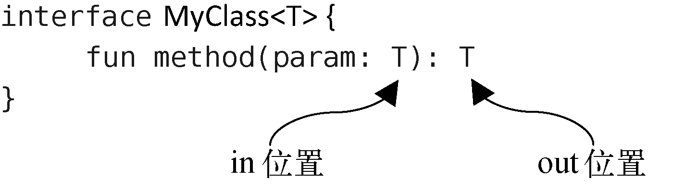

# 1	高阶函数

## 1.1	定义高阶函数


---

<br>

## 1.2	内联函数

---

<br>

### 1.2.1	概述

---


### 1.2.2	定义内联函数

---

<br>

### 1.2.Ⅰ	内联函数的作用


---

<br>

### 1.2.Ⅱ	noinline


---

<br>

### 1.2.Ⅲ	crossinline


---

<br>

## 1.3	infix 函数

**A to B 语法结构与 infix 函数**

- 使用 A to B 的语法结构可以构建键值对，但是 to 并不是 Kotlin 语言中的一个关键字，之所以我们能够使用 A to B 这样的语法结构，是因为 Kotlin 提供了一种高级语法糖特性：infix 函数。

**注意**

- infix 函数允许我们将函数调用时的小数点、括号等计算机相关的语法去掉，从而使用一种更接近英语的语法来编写程序，让代码看起来更具有可读性。
- infix 函数由于其语法糖的特殊性，有两个比较严格的限制：
  1. infix 函数不能定义成顶层函数，它必须是某个类的成员函数（可以使用扩展函数的方式将它定义到某个类当中）
  2. infix 函数必须接收且只能接收一个参数（参数类型没有限制）

**例**

```kotlin
//String 类的扩展函数，用于判断一个字符串是否一某个指定参数开头
infix fun String.beginsWith(prefix:String) = startsWith(prefix)//内部通过 String 类的 startswith() 函数实现

//调用方式
//1.传统调用
str.beginsWith("s")

//2.特殊调用
str beginWith "s"
```

---

<br>

# 2	泛型

## 2.0	概述

**什么是泛型**

- 在一般的编程模式下，我们需要给任何一个变量指定一个具体的类型，而泛型允许我们在不指定具体类型的情况下进行编程，这样编写出来的代码 **有更好的扩展性**。

---

<br>

## 2.1	基本语法

**定义泛型类，例**

```kotlin
class MyClass<T>{
	
	fun method(param:T):T{
		return param
	}
}

//调用泛型类中的方法
val myclass = MyClass<Int>()
val result = myclass.method(123)
```

**定义泛型方法，例**

```kotlin
class MyClass{
	
	fun <T> method(param:T):T{
		return param
	}
}

//调用一般类中的泛型方法
val myclass = MyClass()
val result = myclass.method<Int>(123)
```

**注意**

- 由于 Kotlin 出色的类型推导机制，它能自动推导出泛型的类型，所以我们可以直接省略泛型的指定。
- 可以对泛型的类型进行限制（可以通过指定上界的方式来对泛型的类型进行约束）。
- 在默认情况下，所有的泛型都是可以指定成**可空类型**的，这是因为在不手动指定上界的时候，泛型的上界默认是 Any?。而如果想要让泛型的类型不可为空，只需要将泛型的上界手动指定成 Any 就可以了。

---

<br>

## 2.2	泛型实化

### 2.2.1	基础

**Java 的泛型擦除机制**

- 在 JDK 1.5 之前，Java是没有泛型功能的，**那个时候诸如 List 之类的数据结构可以存储任意类型的数据**，取出数据的时候也需要手动向下转型才行，这不仅麻烦，而且很危险。比如说我们在同一个 List 中存储了字符串和整型这两种数据，但是在取出数据的时候却无法区分具体的数据类型，如果手动将它们强制转成同一种类型，那么就会抛出类型转换异常。
- 于是在 JDK 1.5 中，Java终于引入了泛型功能。这不仅让诸如List之类的数据结构变得简单好用，也让我们的代码变得更加安全。
- 但是实际上，**Java 的泛型功能是通过类型擦除机制来实现的**。这意味着，**泛型对于类型的约束只在编译时期存在，运行的时候仍然会按照 JDK 1.5 之前的机制来运行，JVM 无法识别我们在代码中指定的泛型类型的**。例如，假设我们创建了一个List\<String>集合，虽然在编译时期只能向集合中添加字符串类型的元素，但是在运行时期 JVM 并不能知道它本来只打算包含哪种类型的元素，只能识别出来它是个 List。
- **所有基于 JVM 的语言，它们的泛型功能都是通过类型擦除机制来实现的，其中当然也包括了Kotlin**。这种机制使得我们不可能使用`a is T` 或者 `T :: class.java` 这样的语法，因为 T 的实际类型在运行的时候已经被擦除了。

**内联函数和泛型实化**

- 内联函数中的代码会在编译的时候自动被替换到调用它的地方，这样也就不存在泛型擦除问题了，因为**代码在编译之后会直接使用实际的类型来替代内联函数中的泛型声明**。
- 这意味着，**在Kotlin 中是可以将内联函数中的泛型进行实化的**。

**借助内敛函数使泛型实化**

- 首先，该函数必须是内联函数才行，也就是要用inline关键字来修饰该函数。其次，在声明泛型的地方必须加上 **reified 关键字** 来表示该泛型要进行实化。

- **例**

  ```kotlin
  inline fun <reified T> getGenericType() { } 
  ```

**泛型实化的应用**

- 通过泛型实化，可以简化 intent 的使用：

  ```kotlin
  inline fun <reified T> startActivity(context: Context) {
      val intent = Intent(context, T::class.java)
      context.startActivity(intent)
  }
  
  //调用
  startActivity<TestActivity>(context)
  ```

- 对于需要附带参数的 intent，可以通过高阶函数和 Lambda 表达式完成

  ```kotlin
  inline fun <reified T> startActivity(context: Context, block: Intent.() -> Unit) {
      val intent = Intent(context, T::class.java)
      intent.block()
      context.startActivity(intent)
  }
  
  //调用
  startActivity<TestActivity>(context) {
      putExtra("param1", "data")
      putExtra("param2", 123)
  }
  ```

---

<br>

## 2.3	泛型的协变和逆变

**in 位置与 out 位置**

- 一个泛型类或者泛型接口中的方法，它的参数列表是接收数据的地方，因此可以称它为in位置，而它的返回值是输出数据的地方，因此可以称它为out位置。

- 如图：

  


---

<br>

# 3	委托

## 3.0	概述

**什么是委托**

- 委托是一种设计模式，它的基本理念是：操作对象自己不会去处理某段逻辑，而是会把工作委托给另外一个辅助对象去处理。

**Kotlin 中的委托**

- Kotlin 支持委托功能，并将委托功能分为了两类：
  1. 类委托
  2. 委托属性

**注意**

- Java 对于委托并没有语言层级的实现，而像 C# 等语言就对委托进行了原生的支持。

---

<br>

## 3.1	类委托

**类委托的核心思想**

- 将一个类的具体实现委托给另一个类去完成。

**例：借助委托模式实现自定义的 Set 类**

```kotlin
//实现 Set 接口
class MySet<T>(val helperSet:HashSet<T>):Set<T> {
    override val size: Int
        get() = helperSet.size

    override fun contains(element: T) = helperSet.contains(element)

    override fun containsAll(elements: Collection<T>) = helperSet.containsAll(elements)

    override fun isEmpty() = helperSet.isEmpty()

    override fun iterator() = helperSet.iterator()
}
```

- MySet 的构造函数中接受了一个 HashSet 参数，这就相当于一个辅助对象。然后在 Set 接口所有的方法实现中，我们都没有进行自己的实现，而是调用了辅助对象中相应的方法实现。
- 这样做的好处在于，我们可以重写少部分方法的重写，甚至加入一些自己独有的方法，那么 MySet 就会成为一个 **全新** 的数据结构类，这就是委托模式的意义所在。
- 但是，**如果接口中待实现的方法过多，那么实现将过于繁琐**。

**通过类委托实现 MySet **

```kotlin
/**
 * 演示：借助类委托简化 Myset 的实现，并新增一个 helloWorld()方法，重写 isEmpty() 方法
 */
class MySet<T>(val helperSet:HashSet<T>):Set<T> by helperSet{
    fun hellworld() = println("HELLO WORLD")
    
    override fun isEmpty = flase
}
```

---

<br>

## 3.2	委托属性

**委托属性的核心思想**

- 将一个属性（字段）的具体实现委托给另一个类去完成。

**语法**

```kotlin
class MyClass{
    //将 p 属性的具体实现委托给了 Delegate 类去完成，当调用 p 属性的时候会自动调用 Delegate 类的 getValue() 方法，当给 p 属性赋值的时候会自动调用 Delegate 类的 setValue() 方法
	var p by Delegate()
}

//Delegate 类的标准代码实现模板
class Delegate{
    var propValue:Any? = null
    
    //第一参数用于声明该 Delegate 类的委托功能可以在什么类中使用
    //第二个参数是 Kotlin 中的一个属性操作类，可用于获取各种属性相关的值
    operator fun getValue(myClass:MyClass,prop:KProperty<*>):Any?{
        return propValue
    }
    
    operator fun setValue(myClass:MyClass,prop:KProperty<*>,value:Any?){
        propValue = value
    }
}
```

**注意**

- 当 p 属性是使用 val 关键字声明时，可以不用在 Delegate 类中实现 setValue() 方法，因为此时 MyClass 中的 p 属性是无法在初始化后重新被赋值的，因此也就没有必要实现 setValue() 方法。

---

<br>

## 2.Ⅰ	lazy 函数

**基本语法结构**

```kotlin
val p by lazy {...}
```

- lazy 实际上是一个高阶函数，在 lazy 函数中会创建并返回一个 Delegate 对象，当我们调用 p 属性的时候，其实调用的是 Delegate 对象的 getValue() 方法，然后 getValue() 方法中又会调用 lazy 函数传入的 Lambda 表达式，这样表达式中的代码就可以得到执行了，并且调用 p 属性后得到的值就是 Lambda 表达式中最后一行代码的返回值。

**实现自己的懒加载函数**

1. 新建一个 Later.kt 文件，并编写如下代码：

   ```kotlin
   class Later<T>(val block : () -> T){
   
   }
   ```

2. 在 Later 类中实现实现 getValue() 方法：

   ```kotlin
   class Later<T>(val block : () -> T){
   
   	var value:Any? = null
   	
   	operator fun getValue(any:Any?,prop:KProperty<*>):T{
   		if(value == null){
   			value = block()
   		}
   		return value as T
   	}
   }
   ```

3. 为了使它的用法更类似 lazy 函数，最好再定义一个顶层函数

   ```kotlin
   fun <T> later(block:() -> T) = Later(block)
   ```

**注意**

- 自己实现的懒加载函数在诸如同步、空值处理等方面并没有实现得很严谨。因此，在正式的项目中，使用 Kotlin 内置的 lazy 函数才是最佳的选择。

---

<br>

# 4	协程


---

<br>

# 5	DSL

## 5.0	概述

**什么是 DSL**

- DSL 的全称是领域特定语言（Domain Specific Language），它是编程语言赋予开发者的一种特殊能力，**通过它我们可以编写出一些看似脱离其原始语法结构的代码，从而构建出一种专有的语法结构**。

**Kotlin 中的 DSL**

- Kotlin 支持 DSL，并且**在 Kotlin 中实现DSL的实现方式并不固定**，比如使用 infix 函数构建出的特有语法结构就属于 DSL。
- 在 Kotlin 中，实现 DSL 最常见的方式是通过高阶函数的方式来实现DSL。

---

<br>

## 5.1	

**Gradle 添加依赖语法**

```
dependencies {
    implementation 'com.squareup.retrofit2:retrofit:2.6.1'
    implementation 'com.squareup.retrofit2:converter-gson:2.6.1'
}
```

- Gradle 是基于 Groovy 语言的构建工具，上述的语法结构其实就是Groovy 提供的 DSL 功能。，借助Kotlin的DSL，我们也可以实现类似的语法结构。

**使用 Kotlin 实现 Gradle 添加依赖语法**

1. 首先新建一个 DSL.kt 文件，然后在里面定义一个 `Dependency` 类，代码如下所示：

   ```kotlin
   class Dependency {
   
       //使用 List 集合来保存所有的依赖库，
       val libraries = ArrayList<String>()
   
       //用于向 List 集合中添加依赖库
       fun implementation(lib: String) {
           libraries.add(lib)
       }
   
   }
   ```

2. 定义一个 `dependencies` 高阶函数

   ```kotlin
   //dependencies 函数接收一个函数类型参数，并且该参数是定义到 Dependency 类中的
   //因此调用该函数的时候需要先创建一个 Dependency 的实例，然后再通过该实例调用函数类型参数，这样传入的Lambda表达式就能得到执行了。
   fun dependencies(block: Dependency.() -> Unit): List<String> {
       val dependency = Dependency()
       dependency.block()
       
       //将 Dependency 类中保存的依赖库集合返回。
       return dependency.libraries
   }
   ```

3. 经过这样的DSL设计之后，我们就可以在项目中使用如下的语法结构了：

   ```kotlin
   dependencies {
       implementation("com.squareup.retrofit2:retrofit:2.6.1")
       implementation("com.squareup.retrofit2:converter-gson:2.6.1")
   }
   ```

   - 由于 `dependencies`函 数接收一个函数类型参数，因此这里我们可以传入一个Lambda表达式。而此时的 Lambda 表达式中拥有 `Dependency 的上下文，因此当然就可以直接调用 `Dependency `类中的 `implementation()`方 法来添加依赖库了。
   - 这种语法结构和我们在build.gradle文件中使用的语法结构并不完全相同，这主要是因为Kotlin和Groovy在语法层面还是有一定差别的。

4. 另外，我们也可以通过 `dependencies` 函数的返回值来获取所有添加的依赖库，代码如下所示：

   ```kotlin
   fun main() {
       val libraries = dependencies {
           implementation("com.squareup.retrofit2:retrofit:2.6.1")
           implementation("com.squareup.retrofit2:converter-gson:2.6.1")
       }
       //使用for-in循环将集合中的依赖库全部打印出来
       for (lib in libraries) {
           println(lib)
       }
   }
   ```

**例：借助 DSL 动态生成表格所对应的 HTML 代码**

1. 在 DSL.kt 文件中定义一个 `Td` 类，代码如下所示：

   ```kotlin
   class Td {
   	
   	//由于 <td> 标签表示一个单元格，其中必然是要包含内容的，因此这里我们使用了一个 content 字段来存储单元格中显示的内容
       var content = ""
   
       //当调用这个方法时就返回一段 <td> 标签的 HTML 代码，并将 content 中存储的内容拼接进去。
       fun html() = "\n\t\t<td>$content</td>"
   }
   ```

2. 再定义一个`Tr`类，代码如下所示：

   ```kotlin
   class Tr {
       
       //由于 <tr> 标签表示表格的行，可以包含多个<td>标签的，因此首先创建一个 children 集合，用于存储当前 Tr 所包含的 Td 对象
       private val children = ArrayList<Td>()
   
       //接收一个定义到 Td 类中并且返回值是 String 的函数类型参数。
       //当调用 td() 函数时，会先创建一个 Td 对象，接着调用函数类型参数并获取它的返回值，然后赋值到 Td 类的 content 字段当中，这样就可以将调用 td() 函数时传入的 Lambda 表达式的返回值赋值给 content 字段
       fun td(block: Td.() -> String) {
           val td = Td()
           td.content = td.block()
           
           //将创建的 td 对象添加到 children 中
           children.add(td)
       }
   
       //该方法与 Td 类中的 html() 方法一致。只是由于每个 Tr 都可能会包含很多个 Td，因此我们需要使用循环来遍历 children 集合，将所有的子 Td 都拼接到 <tr> 标签当中，从而返回一段嵌套的 HTML 代码。
       fun html(): String {
           val builder = StringBuilder()
           builder.append("\n\t<tr>")
           for (childTag in children) {
               builder.append(childTag.html())
           }
           builder.append("\n\t</tr>")
           return builder.toString()
       }
   }
   ```

3. 再定义一个`Table`类，代码如下所示：

   ```kotlin
   class Table {
       //用于存储当前 Table 所包含的 Tr 对象。
       private val children = ArrayList<Tr>()
   
       //接收一个定义到 Tr 类中的函数类型参数。当调用tr()函数时，会先创建一个Tr对象，接着调用函数类型参数，这样Lambda表达式中的代码就能得到执行
       fun tr(block: Tr.() -> Unit) {
           val tr = Tr()
           tr.block()
           //将创建的Tr对象添加到children集合当中
           children.add(tr)
       }
   
       fun html(): String {
           val builder = StringBuilder()
           builder.append("<table>")
           for (childTag in children) {
               builder.append(childTag.html())
           }
           builder.append("\n</table>")
           return  builder.toString()
       }
   }
   ```

4. 现在，我们就可以使用如下的语法结构来构建一个表格了：

   ```kotlin
   val table = Table()
   table.tr {
       td { "Apple" }
       td { "Grape" }
       td { "Orange" }
   }
   table.tr {
       td { "Pear" }
       td { "Banana" }
       td { "Watermelon" }
   }
   ```

5. 再进一步对语法结构进行精简。定义一个`table()`函数，代码如下所示：

   ```kotlin
   //这里的table()函数接收一个定义到Table类中的函数类型参数，当调用table()函数时，会先创建一个Table对象，接着调用函数类型参数，这样Lambda表达式中的代码就能得到执行。最后调用Table的html()方法获取生成的HTML代码，并作为最终的返回值返回。
   fun table(block: Table.() -> Unit): String {
       val table = Table()
       table.block()
       return table.html()
   }
   ```

6. 接下来可以使用下列语法结构来动态生成一个表格所对应的 HTML 代码：

   ```kotlin
   fun main() {
       val html = table {
           tr {
               td { "Apple" }
               td { "Grape" }
               td { "Orange" }
           }
           tr {
               td { "Pear" }
               td { "Banana" }
               td { "Watermelon" }
           }
       }
       println(html)
   }
   ```

---

<br>

# 6	Java与Kotlin代码之间的转换

**将一段 Java 代码转换为 Kotlin 代码**

- 复制 Java 代码，在 Android Studio 中打开任意一个 Kotlin 文件，在这里进行粘贴，Android Studio 就会弹出确认框，询问是否将 Java 代码转换为 Kotlin 代码
- Android Studio 虽然能够帮助我们进行一键代码转换，但是它只会按照固定的语法变化规律来执行转换工作，而不会自动应用 Kotlin 的各种优秀特性。因此，依靠这种自动转换工具只能实现基础版的 Kotlin 语法，细节方面的代码优化还是得靠我们手动完成。

**将一个 Java 文件以及其中的所有代码一次性转换成 Kotlin 版本**

- 在 Android Studio 中打开该 Java 文件，然后点击导航栏中的 Cod e→ Convert Java File to Kotlin File。

**将 Kotlin 代码转换为 Java 代码**

- 因为 Kotlin 拥有许多 Java 中并不存在的特性，因此很难进行一键转换。
- 但是，可以先将 Kotlin 代码转换成 Kotlin 字节码，然后再通过反编译的方式将它还原成 Java 代码。这种反编译出来的代码 **可能无法像正常编写的 Java 代码那样直接运行**，但是 **非常有利于帮助我们理解诸多 Kotlin 特性背后的实现原理**。
- 具体操作方式是，点击 Android Studio 导航栏中的 Tools → Kotlin → Show Kotlin Bytecode，得到 kotlin 的字节码。然后只需要点击这个窗口左上角的“Decompile”按钮，就可以将这些 Kotlin 字节码反编译成 Java 代码

---

<br>

# 为什么 Kotlin 中没有异常检查机制

---

<br>

# 附录

**最后编辑时间**

- 2021/2/15

**参考资料**

- 

**脚注**

[^1]: 

**注意点**

[^!1]: 

**疑问**

[^?1]: 

