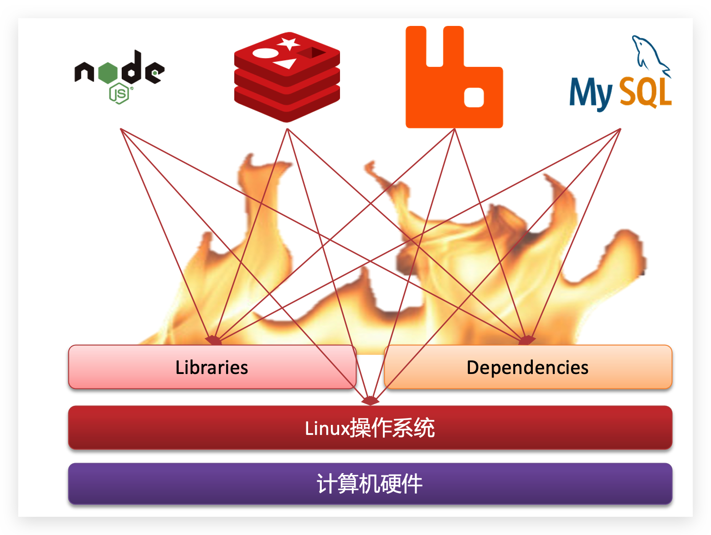

# 1	Docker 概述

## 1.1	Docker 简介

##### 微服务项目的部署十分复杂

微服务虽然具备各种各样的优势，但服务的拆分通用给部署带来了很大的麻烦。大型项目组件较多，运行环境也较为复杂，部署时会碰到一些问题：

- **依赖兼容**：分布式系统中，依赖的组件非常多，依赖关系复杂，不同组件之间部署时往往会产生一些冲突，出现兼容性问题。
- **操作系统环境差异**：在数百上千台服务中重复部署，而且包括开发、测试、生产等类型的环境，环境不一定一致，会遇到各种问题。

例如一个项目中，部署时需要依赖于 node.js、Redis、RabbitMQ、MySQL 等，这些服务部署时所需要的函数库、依赖项各不相同，甚至会有冲突。给部署带来了极大的困难。



<br>

##### Docker 如何解决依赖兼容问题

Docker 采用了两个手段解决依赖的兼容问题：

1. 将应用的 Libs（函数库）、Deps（依赖）、配置与应用一起打包。
2. 将每个应用放到一个隔离 **容器** 去运行，避免互相干扰。


这样打包好的应用包中，既包含应用本身，也保护应用所需要的 Libs、Deps，无需再操作系统上安装这些  Libs、Deps，自然就不存在不同应用之间的兼容问题了。

也就是说：

- Docker 允许开发中将应用、依赖、函数库、配置一起 **打包**，形成可移植镜像。
- Docker 应用运行在容器中，使用沙箱机制，相互 **隔离**。

<br>

##### Docker 如何解操作系统环境差异

###### 操作系统的结构

要解决不同操作系统环境差异问题，必须先了解操作系统结构。以一个 Ubuntu 操作系统为例，结构如下：


结构包括：

- **计算机硬件**：例如 CPU、内存、磁盘等。
- **系统内核**：所有 Linux 发行版的内核都是 Linux，例如 CentOS、Ubuntu、Fedora 等。内核可以与计算机硬件交互，对外提供 **内核指令**，用于操作计算机硬件。
- **系统应用**：操作系统本身提供的应用、函数库。这些函0数库是对内核指令的封装，使用更加方便。

应用与计算机交互的流程如下：

- 应用调用操作系统应用（函数库），实现各种功能
- 系统函数库是对内核指令集的封装，会调用内核指令
- 内核指令操作计算机硬件

Ubuntu 和 CentOS 都是基于Linux内核，无非是系统应用不同，提供的函数库有差异。但是，如果将一个 Ubuntu 版本的 MySQL 应用安装到 CentOS 系统，MySQL 在调用 Ubuntu 函数库时，会发现找不到或者不匹配，只能报错。


###### Docker 解决不同系统环境问题的原理

1. Docker 将用户程序与所需要调用的系统函数库一起打包。
2. Docker 在不同操作系统运行时，直接基于打包的函数库，借助于操作系统的 Linux 内核来运行。


Docker 镜像中包含完整运行环境，包括系统函数库，仅依赖系统的 Linux 内核，因此可以在任意 Linux 操作系统上运行。

<br>

##### Docker 技术的优势

Docker是一个快速交付应用、运行应用的技术，具备下列优势：

- 可以将程序及其依赖、运行环境一起打包为一个镜像，可以迁移到任意 Linux 操作系统。
- 运行时利用沙箱机制形成隔离容器，各个应用互不干扰。
- 启动、移除都可以通过一行命令完成，方便快捷。

<br>

---

<div STYLE="page-break-after: always;">
    <br>
    <br>
    <br>
    <br>
    <br></div>

## 1.2	Docker 与虚拟机的区别

##### Docker 与虚拟机的相似之处

Docker 可以让一个应用在任何操作系统中非常方便的运行。而虚拟机也能在一个操作系统中，运行另外一个操作系统，保护系统中的任何应用。

<br>

##### Docker 与虚拟机之间的区别

**虚拟机**（virtual machine）是在操作系统中 **模拟** 硬件设备，然后运行另一个操作系统[^1.2-1]。

**Docker** 仅仅是封装函数库，并没有模拟完整的操作系统。实质上是一个 **系统进程**。


<br>

##### Docker 与虚拟机性能的对比

| 特性     | Docker    | 虚拟机    |
| -------- | --------- | --------- |
| 性能     | 接近原生  | 性能较差  |
| 硬盘占用 | 一般为 MB | 一般为 GB |
| 驱动速度 | 秒级      | 分钟级    |

<br>

---

[^1.2-1]: 比如在 Windows 系统里面运行 Ubuntu 系统，这样就可以运行任意的 Ubuntu 应用了。

<div STYLE="page-break-after: always;">
    <br>
    <br>
    <br>
    <br>
    <br></div>

## 1.3	Docker 架构

##### 镜像（Image）

Docker 将应用程序及其所需的依赖、函数库、环境、配置等文件打包在一起，称为镜像。

<br>

##### 容器（Container）

镜像中的应用程序运行后形成的进程就是 **容器**，只是 Docker 会给容器进程做隔离，对外不可见。

<br>

##### 镜像与容器之间的关系

一切应用最终都是代码组成，都是硬盘中的一个个的字节形成的 **文件**。只有运行时，才会加载到内存，形成进程。

**镜像** 把一个应用在硬盘上的文件、及其运行环境、部分系统函数库文件一起打包形成一个只读的文件包。

**容器** 则将这些文件中编写的程序、函数加载到内存中运行，形成进程，只不过要隔离起来。因此一个镜像可以启动多次，形成多个容器进程。


<br>

##### DockerHub

开源应用程序非常多，打包这些应用往往是重复的劳动。为了避免这些重复劳动，人们就会将自己打包的应用镜像，例如 Redis、MySQL 镜像放到网络上，共享使用，就像 GitHub 的代码共享一样。

而 [DockerHub](https://hub.docker.com/) 是一个 **官方的 Docker 镜像托管平台**。这样的平台称为 Docker Registry。国内也有类似于 DockerHub 的公开服务，比如 [网易云镜像服务](https://c.163yun.com/hub)、[阿里云镜像库 ](https://cr.console.aliyun.com/)等。


<br>

##### Docker 的架构

在操作系统上安装 Docker 后，就可以使用 Docker 来操作镜像、容器。

Docker 是一个 CS 架构的程序，由两部分组成：

- **服务端（server）**：Docker 守护进程，负责处理 Docker 指令，管理镜像、容器等。
- **客户端（client）**：通过命令或 RestAPI 向 Docker 服务端发送指令。可以本地或远程向服务端发送指令。


<br>

---

<div STYLE="page-break-after: always;">
    <br>
    <br>
    <br>
    <br>
    <br></div>

## 1.4	安装 Docker

##### 在 Linux 环境下安装 Docker

1. 如果之前安装过 Docker ，需要先卸载旧版本的 Docker

```yaml
yum remove docker \
                  docker-client \
                  docker-client-latest \
                  docker-common \
                  docker-latest \
                  docker-latest-logrotate \
                  docker-logrotate \
                  docker-selinux \
                  docker-engine-selinux \
                  docker-engine \
                  docker-ce
```

2. 使用官方安装脚本自动安装：

```cmd
curl -fsSL https://get.docker.com | bash -s docker --mirror Aliyun
```

3. 通过命令启动 docker：

```cmd
systemctl start docker  # 启动docker服务

systemctl stop docker  # 停止docker服务

systemctl restart docker  # 重启docker服务

systemctl enable docker  #设置 docker 开机自启动
```

<br>

---

<div STYLE="page-break-after: always;">
    <br>
    <br>
    <br>
    <br>
    <br></div>
## 1.5	Docker helper

##### Docker helper 的作用

在任意 docker 命令后添加 `--help` 参数可以查看命令的说明以及命令包含的参数，有很大的帮助。

<br>

---

<div STYLE="page-break-after: always;">
    <br>
    <br>
    <br>
    <br>
    <br></div>
