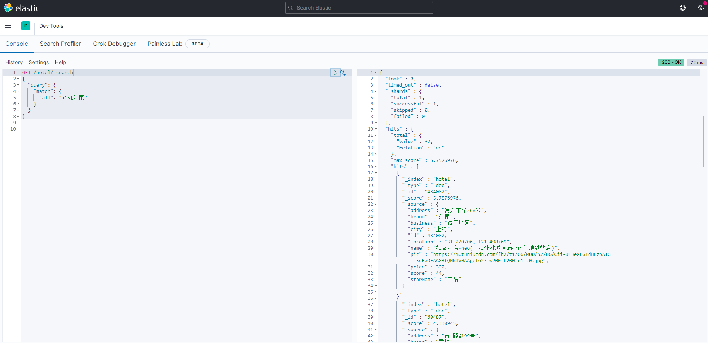
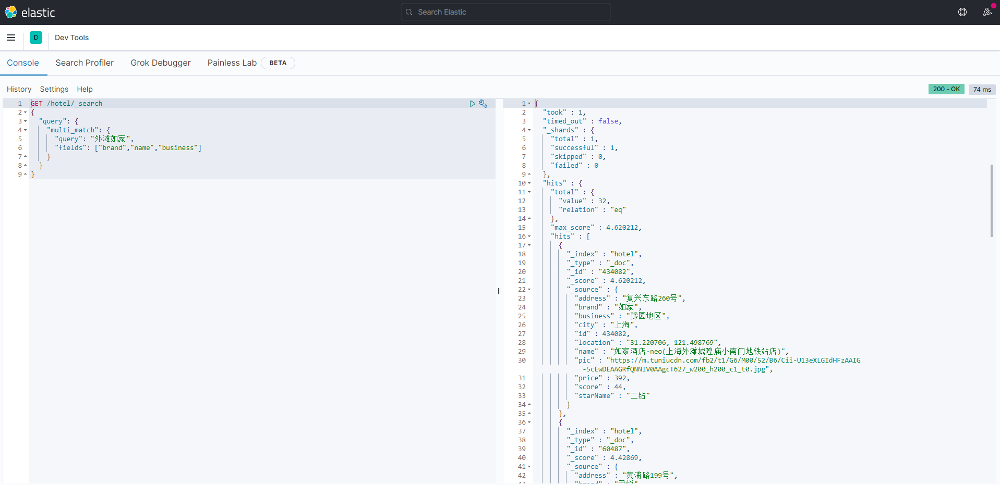
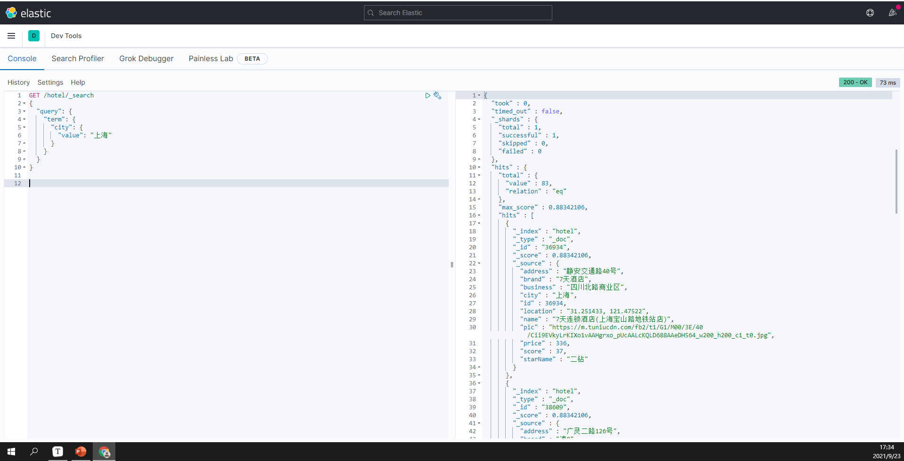
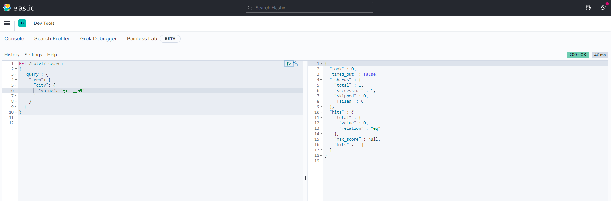
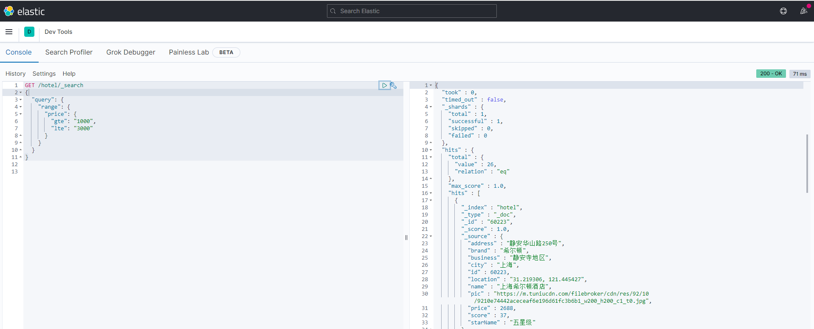
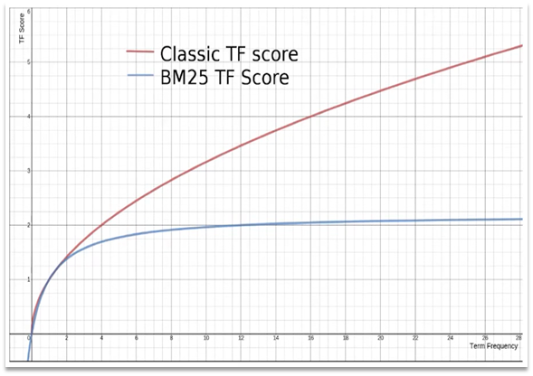
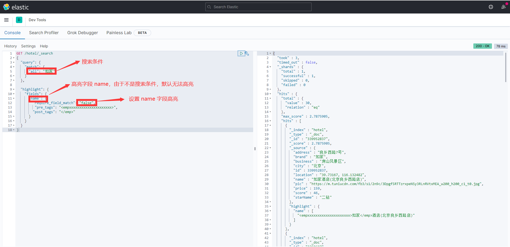
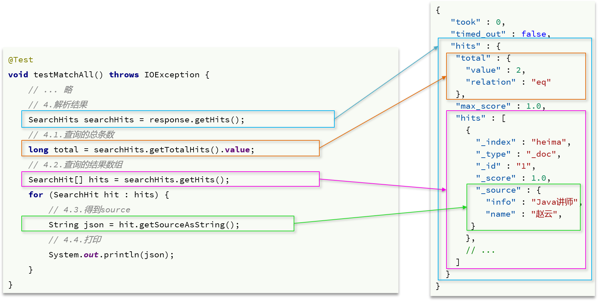

# 5	查询

## 5.1	DSL 查询文档

### 5.1.1	DSL 查询分类与基本语法

##### Elasticsearch 查询

Elasticsearch 提供了基于 JSON 的 DSL（Domain Specific Language）来定义查询。

<br>

##### 常见的查询类型

常见的查询类型包括：

- **查询所有**：查询出所有数据，一般用于测试。例如：match_all。

- **全文检索（full text）查询**：利用分词器对用户输入内容分词，然后去倒排索引库中匹配。例如：match_query 与 multi_match_query。
- **精确查询**：根据精确词条值查找数据，一般是查找 keyword、数值、日期、boolean 等类型字段。例如：id 、range、term。
- **地理（geo）查询**：根据经纬度查询。例如：geo_distance 与 geo_bounding_box。
- **复合（compound）查询**：复合查询可以将上述各种查询条件组合起来，合并查询条件。例如：bool 与 function_score。

<br>

##### 查询基本语法

查询的语法基本一致：

```json
GET /indexName/_search
{
  "query": {
    "查询类型": {
      "查询条件": "条件值"
    }
  }
}
```

<br>

##### 例——查询所有

```json
// 查询所有
GET /indexName/_search
{
  "query": {
    "match_all": {//查询类型为 match_all
    }//没有查询条件
  }
}
```

<br>

---

<div STYLE="page-break-after: always;">
    <br>
    <br>
    <br>
    <br>
    <br>
</div>

### 5.1.2	全文检索查询

##### 基本流程

全文检索查询的基本流程如下：

1. 对用户搜索的内容做分词，得到词条
2. 根据词条去倒排索引库中匹配，得到文档 id
3. 根据文档 id 找到文档，返回给用户

<br>

##### 应用场景

比较常用的场景包括：

- 商城的输入框搜索
- 百度输入框搜索

<br>

##### 使用全文检索查询的前提条件

因为是通过词条去匹配，因此参与搜索的字段也必须是可分词的 text 类型的字段。

<br>

##### 单字段查询——match

```json
GET /indexName/_search
{
  "query": {
    "match": {
      "FIELD": "TEXT"
    }
  }
}
```

<br>

##### 多字段查询——multi_match

任意一个字段符合条件就算符合查询条件，参与查询字段越多，查询性能越差：

```json
GET /indexName/_search
{
  "query": {
    "multi_match": {
      "query": "TEXT",
      "fields": ["FIELD1", " FIELD12"]
    }
  }
}
```

<br>

##### 📌建议使用 copy_to 加单字段查询

多字段查询搜索字段越多，对查询性能影响越大，因此建议采用 copy_to 将字段复合到一起，然后采用单字段查询的方式进行查询。

<br>

##### 示例

###### 使用 match 查询 all 字段



###### 使用 multi_match 查询 brand、name、business 字段



###### 分析

因为 brand、name、business 字段的值都利用 copy_to 复制到了 all 字段中，所以上述两个查询的结果相同，但是 match 查询的速度（72ms）比 multi_match 的速度（75ms）更快。

<br>

---

<div STYLE="page-break-after: always;">
    <br>
    <br>
    <br>
    <br>
    <br>
</div>

### 5.1.3	精确查询

##### 精确查询的前提条件

精确查询一般是查找 keyword、数值、日期、boolean 等类型字段。所以 **不会** 对搜索条件分词。

<br>

##### 常用的精确查询

- **term**：根据词条精确值查询
- **range**：根据值的范围查询

<br>

##### term 查询

###### 语法

```json
// term查询
GET /indexName/_search
{
  "query": {
    "term": {
      "FIELD": {
        "value": "VALUE"
      }
    }
  }
}
```

###### 示例

搜索精确词条时，能正确查询出结果：



搜索的内容不是词条，而是多个词语形成的短语时，无法得到结果：



<br>

##### range查询

根据数值范围查询，可以是数值、日期的范围，一般应用在对数值类型做范围过滤的时候。比如做价格范围过滤。

###### 语法

```json
// range查询
GET /indexName/_search
{
  "query": {
    "range": {
      "FIELD": {
        "gte": 10, // 这里的gte代表大于等于，gt则代表大于
        "lte": 20 // lte代表小于等于，lt则代表小于
      }
    }
  }
}
```

###### 示例



<br>

---

<div STYLE="page-break-after: always;">
    <br>
    <br>
    <br>
    <br>
    <br>
</div>

### 5.1.4	地理坐标查询

##### 地理坐标查询的本质

所谓的地理坐标查询，其实就是根据经纬度查询。

<br>

##### 官方文档

https://www.elastic.co/guide/en/elasticsearch/reference/current/geo-queries.html

<br>

##### 应用场景

常见的使用场景包括：

- 携程：搜索我附近的酒店
- 滴滴：搜索我附近的出租车
- 微信：搜索我附近的人

<br>

#####  矩形范围查询

矩形范围查询，也就是 geo_bounding_box 查询，查询坐标落在某个矩形范围的所有文档。

###### 查询条件

查询时，需要指定矩形的 **左上**、**右下** 两个点的坐标，然后画出一个矩形，落在该矩形内的都是符合条件的点。

###### 语法

```json
// geo_bounding_box查询
GET /indexName/_search
{
  "query": {
    "geo_bounding_box": {
      "FIELD": {
        "top_left": { // 左上点
          "lat": 31.1,
          "lon": 121.5
        },
        "bottom_right": { // 右下点
          "lat": 30.9,
          "lon": 121.7
        }
      }
    }
  }
}
```

<br>

##### 附近查询

附近查询，也叫做距离查询（geo_distance），查询到指定中心点小于某个距离值的所有文档。

###### 查询条件

在地图上找一个点作为圆心，以指定距离为半径，画一个圆，落在圆内的坐标都算符合条件。

###### 语法

```json
// geo_distance 查询
GET /indexName/_search
{
  "query": {
    "geo_distance": {
      "distance": "15km", // 半径
      "FIELD": "31.21,121.5" // 圆心
    }
  }
}
```

###### 示例

搜索陆家嘴附近 15km 的酒店：


符合条件的酒店一共有 47 家。 

<br>

---

<div STYLE="page-break-after: always;">
    <br>
    <br>
    <br>
    <br>
    <br>
</div>

### 5.1.5	复合查询

##### 什么是符合查询

复合（compound）查询：复合查询可以将其它简单查询组合起来，实现更复杂的搜索逻辑。常见的有两种：

- fuction score：算分函数查询，可以控制文档相关性算分，控制文档排名
- bool query：布尔查询，利用逻辑关系组合多个其它的查询，实现复杂搜索

<br>

##### 相关性算分

当我们利用 match 查询时，文档结果会根据与搜索词条的关联度打分（_score），返回结果时按照分值降序排列。

例如，我们搜索 "虹桥如家"，结果如下：

```json
[
  {
    "_score" : 17.850193,
    "_source" : {
      "name" : "虹桥如家酒店真不错",
    }
  },
  {
    "_score" : 12.259849,
    "_source" : {
      "name" : "外滩如家酒店真不错",
    }
  },
  {
    "_score" : 11.91091,
    "_source" : {
      "name" : "迪士尼如家酒店真不错",
    }
  }
]
```

###### TF-IDF 算法

在 elasticsearch 中，早期使用的打分算法是TF-IDF算法，公式如下：


###### BM25 算法

在后来的 5.1 版本升级中，elasticsearch 将算法改进为 BM25 算法，公式如下：


###### TF-IDF 算法的缺陷与 BM25 算法

TF-IDF 算法有一个缺陷，就是词条频率越高，文档得分也会越高，单个词条对文档影响较大。而BM25则会让单个词条的算分有一个上限，曲线更加平滑：



<br>

##### 算分函数查询

###### 算分的现实需求

根据相关度打分是比较合理的需求，但 **合理的不一定是产品经理需要** 的。以百度为例，你搜索的结果中，并不是相关度越高排名越靠前，而是谁掏的钱多排名就越靠前。

###### 控制相关性算分

要想人为控制相关性算分，就需要利用 elasticsearch 中的 function score 查询了。

###### 语法


function score 查询中包含四部分内容：

- **原始查询条件**：query 部分，基于这个条件搜索文档，并且基于 BM25 算法给文档打分，**原始算分**（query score)
- **过滤条件**：filter 部分，符合该条件的文档才会重新算分
- **算分函数**：符合filter条件的文档要根据这个函数做运算，得到的 **函数算分**（function score），有四种函数
  - weight：函数结果，常量
  - field_value_factor：以文档中的某个字段值作为函数结果
  - random_score：以随机数作为函数结果
  - script_score：自定义算分函数算法
- **运算模式**：算分函数的结果、原始查询的相关性算分，两者之间的运算方式，包括：
  - multiply：相乘
  - replace：用 function score 替换 query score
  - 其它，例如：sum、avg、max、min

###### function score的运行流程

1. 根据 **原始条件** 查询搜索文档，并且计算相关性算分，称为 **原始算分**（query score）
2. 根据 **过滤条件**，过滤文档
3. 符合 **过滤条件** 的文档，基于 **算分函数** 运算，得到 **函数算分**（function score）
4. 将 **原始算分**（query score）和 **函数算分**（function score）基于 **运算模式** 做运算，得到最终结果，作为相关性算分。

###### function score关键点

- **过滤条件**：决定哪些文档的算分被修改
- **算分函数**：决定函数算分的算法
- **运算模式**：决定最终算分结果

###### 示例

需求：给“如家”这个品牌的酒店排名靠前一些

翻译一下这个需求，转换为之前说的四个要点：

- 原始条件：不确定，可以任意变化
- 过滤条件：brand = "如家"
- 算分函数：可以简单粗暴，直接给固定的算分结果，weight
- 运算模式：比如求和

因此最终的DSL语句如下：

```json
GET /hotel/_search
{
  "query": {
    "function_score": {
      "query": {  .... }, // 原始查询，可以是任意条件
      "functions": [ // 算分函数
        {
          "filter": { // 满足的条件，品牌必须是如家
            "term": {
              "brand": "如家"
            }
          },
          "weight": 2 // 算分权重为2
        }
      ],
      "boost_mode": "sum" // 加权模式，求和
    }
  }
}
```

测试，在未添加算分函数时，如家得分如下：


添加了算分函数后，如家得分就提升了：


<br>

---

<div STYLE="page-break-after: always;">
    <br>
    <br>
    <br>
    <br>
    <br>
</div>

### 5.1.6	布尔查询

##### 什么是布尔查询

布尔查询是一个或多个查询子句的组合，每一个子句就是一个 **子查询**。子查询的组合方式有：

- **must**：必须匹配每个子查询，类似“与”
- **should**：选择性匹配子查询，类似“或”
- **must_not**：必须不匹配，**不参与算分**，类似“非”
- **filter**：必须匹配，**不参与算分**

<br>

##### 应用场景

比如在搜索酒店时，除了关键字搜索外，我们还可能根据品牌、价格、城市等字段做过滤：


每一个不同的字段，其查询的条件、方式都不一样，必须是多个不同的查询，而要组合这些查询，就必须用 bool 查询了。

<br>

##### 提升布尔查询的性能

需要注意的是，搜索时，参与 **打分的字段越多，查询的性能也越差**。因此这种多条件查询时，建议这样做：

- 搜索框的关键字搜索，是全文检索查询，使用 must 查询，参与算分
- 其它过滤条件，采用 filter 查询。不参与算分

<br>

##### 示例——布尔查询的基本语法

```json
GET /hotel/_search
{
  "query": {
    "bool": {
      "must": [
        {"term": {"city": "上海" }}
      ],
      "should": [
        {"term": {"brand": "皇冠假日" }},
        {"term": {"brand": "华美达" }}
      ],
      "must_not": [
        { "range": { "price": { "lte": 500 } }}
      ],
      "filter": [
        { "range": {"score": { "gte": 45 } }}
      ]
    }
  }
}
```

<br>

##### 示例——多字段布尔查询

###### 需求

搜索名字包含“如家”，价格不高于 400，在坐标 31.21,121.5 周围 10km 范围内的酒店。

###### 分析

- 名称搜索，属于全文检索查询，应该参与算分。放到 must 中
- 价格不高于 400，用 range 查询，属于过滤条件，不参与算分。放到 must_not 中
- 周围 10km 范围内，用 geo_distance 查询，属于过滤条件，不参与算分。放到 filter 中

###### 查询语句


<br>

----

<div STYLE="page-break-after: always;">
    <br>
    <br>
    <br>
    <br>
    <br></div>
## 5.2	查询结果处理

### 5.2.1	排序

##### 通过自定义方式为查询结果排序

elasticsearch默认是根据相关度算分（_score）来排序，但是也支持自定义方式对搜索 [结果排序](https://www.elastic.co/guide/en/elasticsearch/reference/current/sort-search-results.html)。可以排序字段类型有：keyword 类型、数值类型、地理坐标类型、日期类型等。

<br>

#####  普通字段排序

keyword、数值、日期类型排序的语法基本一致。

###### 语法

```json
GET /indexName/_search
{
  "query": {
    "match_all": {}
  },
  "sort": [
    {
      "FIELD": "desc"  // 排序字段、排序方式ASC、DESC
    }
  ]
}
```

###### 多条件排序

排序条件是一个数组，也就是可以写多个排序条件。按照声明的顺序，当第一个条件相等时，再按照第二个条件排序，以此类推。

###### 示例——酒店数据按照用户评价降序排序评价相同的按照价格(price)升序排序


<br>

##### 地理坐标排序

###### 语法

```json
GET /indexName/_search
{
  "query": {
    "match_all": {}
  },
  "sort": [
    {
      "_geo_distance" : {
          "FIELD" : "纬度，经度", // 文档中geo_point类型的字段名、目标坐标点
          "order" : "asc", // 排序方式
          "unit" : "km" // 排序的距离单位
      }
    }
  ]
}
```

这个查询的含义是：

- 指定一个坐标，作为目标点
- 计算每一个文档中，指定字段（必须是geo_point类型）的坐标 到目标点的距离是多少
- 根据距离排序

###### 例——实现对酒店数据按照到你的位置坐标的距离升序排序

假设我的位置是：31.034661，121.612282，寻找我周围距离最近的酒店。


<br>

---

<div STYLE="page-break-after: always;">
    <br>
    <br>
    <br>
    <br>
    <br></div>

### 5.2.2	分页

##### elasticsearch 分页操作

elasticsearch 默认情况下只返回 top10 的数据。而如果要查询更多数据就需要修改分页参数了。

<br>

##### 语法——基本的分页

分页的基本语法如下：

```json
GET /hotel/_search
{
  "query": {
    "match_all": {}
  },
  "from": 0, // 分页开始的位置，默认为0
  "size": 10, // 期望获取的文档总数
  "sort": [
    {"price": "asc"}
  ]
}
```

elasticsearch 中通过修改 from、size 参数来控制要返回的分页结果：

- from：从第几个文档开始
- size：总共查询几个文档

<br>

##### 深度分页问题

如果要查询 991 ~ 1000 的数据，查询逻辑要这么写：

```json
GET /hotel/_search
{
  "query": {
    "match_all": {}
  },
  "from": 990, // 分页开始的位置，默认为0
  "size": 10, // 期望获取的文档总数
  "sort": [
    {"price": "asc"}
  ]
}
```

但是，elasticsearch 内部分页时，必须先查询 1 ~ 1000条，然后截取其中的 991 ~ 1000 的这10条：

如果es是单点模式，这并无太大影响。但是 elasticsearch 将来一定是集群。假设集群有 5 个节点，要查询 TOP1000 的数据，并不是每个节点查询 200 条就可以了。因为节点 A 的 TOP200，在另一个节点可能排到 10000 名以外了。因此要想获取整个集群的TOP1000，**必须先查询出每个节点的 TOP1000，汇总结果后，重新排名，重新截取 TOP1000**。


当查询分页深度较大时，汇总数据过多，对内存和CPU会产生非常大的压力，因此elasticsearch会禁止 from+ size 超过10000的请求。

<br>

##### 深度分页的解决方案

针对深度分页，ES提供了两种解决方案：

- **search after**：分页时需要排序，原理是从上一次的排序值开始，查询下一页数据。**官方推荐使用的方式**。
- **scroll**：原理是将排序后的文档 id 形成快照，保存在内存。**官方已经不推荐使用**。

<br>

##### 分页查询的常见实现方案的优缺点

###### from + size

- 优点：支持随机翻页
- 缺点：深度分页问题，默认查询上限（from + size）是10000
- 场景：百度、京东、谷歌、淘宝这样的随机翻页搜索

###### after search

- 优点：没有查询上限（单次查询的size不超过10000）
- 缺点：只能向后逐页查询，不支持随机翻页
- 场景：没有随机翻页需求的搜索，例如手机向下滚动翻页

###### scroll

- 优点：没有查询上限（单次查询的size不超过10000）
- 缺点：会有额外内存消耗，并且搜索结果是非实时的
- 场景：海量数据的获取和迁移。从 ES7.1 开始不推荐，建议用 after search 方案。

<br>

---

<div STYLE="page-break-after: always;">
    <br>
    <br>
    <br>
    <br>
    <br></div>

### 5.2.3	高亮

##### 什么是高亮

在百度，京东搜索时，关键字会变成红色，比较醒目，这叫高亮显示.

<br>

##### 实现高亮显示

高亮显示的实现分为两步：

1. 给文档中的所有关键字都添加一个标签，例如 `<em>` 标签
2. 页面给 `<em>` 标签编写 CSS 样式

<br>

##### 语法

```json
GET /hotel/_search
{
  "query": {
    "match": {
      "FIELD": "TEXT" // 查询条件，高亮一定要使用全文检索查询
    }
  },
  "highlight": {
    "fields": { 
      "FIELD": {// 指定要高亮的字段
        "pre_tags": "<em>",  // 用来标记高亮字段的前置标签
        "post_tags": "</em>" // 用来标记高亮字段的后置标签
      }
    }
  }
}
```

- 高亮是对关键字高亮，因此 **搜索条件必须带有关键字**，而不能是范围这样的查询。
- 默认情况下，**高亮的字段，必须与搜索指定的字段一致**，否则无法高亮。
- 如果要对非搜索字段高亮，则需要添加一个属性：required_field_match=false

<br>

##### 示例



<br>

---

<div STYLE="page-break-after: always;">
    <br>
    <br>
    <br>
    <br>
    <br></div>
## 5.3	RestClient 查询文档

### 5.3.1	发起查询请求与解析响应

##### request.source()

`request.source()` 包含了查询、排序、分页、高亮等所有功能。

<br>

##### QueryBuilders

`QueryBuilders` 中包含 match、term、function_score、bool 等各种查询。

<br>

##### 步骤——发送请求

1. 创建 `SearchRequest` 对象，指定索引库名；
2. 利用 `request.source()` 构建 DSL，DSL 中可以包含查询、分页、排序、高亮等
  - `query()`：代表查询条件，利用 `QueryBuilders.matchAllQuery()` 构建一个 match_all 查询的DSL
3. 利用 `client.search()` 发送请求，得到响应。


<br>

##### 步骤——解析响应

elasticsearch 返回的结果是一个JSON字符串，结构包含：

- `hits`：命中的结果
  - `total`：总条数，其中的value是具体的总条数值
  - `max_score`：所有结果中得分最高的文档的相关性算分
  - `hits`：搜索结果的文档数组，其中的每个文档都是一个json对象
    - `_source`：文档中的原始数据，也是json对象

因此，我们解析响应结果，就是逐层解析JSON字符串，流程如下：

1. `SearchHits`：通过 response.getHits() 获取，就是JSON中的最外层的 hits，代表命中的结果
2. `SearchHits.getTotalHits().value`：获取总条数信息
3. `SearchHits.getHits()`：获取 SearchHit 数组，也就是文档数组
4. `SearchHit.getSourceAsString()`：获取文档结果中的 _source，也就是原始的 json 文档数据



<br>

##### 完整代码

```java
@SpringBootTest
public class HotelDocumentQueryTests {

    private RestHighLevelClient client;

    @Test
    void testMatchAll() throws IOException {
        // 1.准备Request
        SearchRequest request = new SearchRequest("hotel");
        // 2.准备DSL
        request.source()
                .query(QueryBuilders.matchAllQuery());
        // 3.发送请求
        SearchResponse response = client.search(request, RequestOptions.DEFAULT);

        // 4.解析响应
        handleResponse(response);
    }


    private void handleResponse(SearchResponse response) {
        // 4.解析响应
        SearchHits searchHits = response.getHits();
        // 4.1.获取总条数
        long total = searchHits.getTotalHits().value;
        System.out.println("共搜索到" + total + "条数据");
        // 4.2.文档数组
        SearchHit[] hits = searchHits.getHits();
        // 4.3.遍历
        for (SearchHit hit : hits) {
            // 获取文档source
            String json = hit.getSourceAsString();
            // 反序列化
            HotelDoc hotelDoc = JSON.parseObject(json, HotelDoc.class);
            System.out.println("hotelDoc = " + hotelDoc);
        }
    }

    @BeforeEach
    void setUp() {
        this.client = new RestHighLevelClient(RestClient.builder(
                HttpHost.create("http://8.131.72.52:9200")
        ));
    }

    @AfterEach
    void tearDown() throws IOException {
        this.client.close();
    }
}
```

<br>

---

<div STYLE="page-break-after: always;">
    <br>
    <br>
    <br>
    <br>
    <br></div>

### 5.3.2	match 查询

##### match 查询的共同点

全文检索的 match 和 multi_match 查询与 match_all 的 API 基本一致。差别是查询条件，也就是 query 的部分。

 

因此，Java 代码上的差异主要是 `request.source().query()` 中的参数了。同样是利用 `QueryBuilders` 提供的方法：

```java
// 单字段查询
QueryBuilders.matchQuery("all", "如家");

// 多字段查询
QueryBuilders.multiMatchQuery("如家", "name", "business");
```

 而结果解析代码则完全一致，可以抽取并共享。

<br>

##### 完整代码

```java
@Test
void testMatch() throws IOException {
    // 1.准备Request
    SearchRequest request = new SearchRequest("hotel");
    // 2.准备DSL
    request.source()
        .query(QueryBuilders.matchQuery("all", "如家"));
    // 3.发送请求
    SearchResponse response = client.search(request, RequestOptions.DEFAULT);
    // 4.解析响应
    handleResponse(response);

}
```

<br>

---

<div STYLE="page-break-after: always;">
    <br>
    <br>
    <br>
    <br>
    <br></div>

### 5.3.3	精确查询

##### 精确查询条件构造的 API

```java
// 词条查询
QueryBuilders.termQuery("city", "杭州"); 
// 范围查询
QueryBuilders.rangeQuery("price").gte(100).lte(150);
```

 <br>

---

<div STYLE="page-break-after: always;">
    <br>
    <br>
    <br>
    <br>
    <br></div>


### 5.3.4	布尔查询

##### 分析


<br>

##### 完整代码

```java
@Test
void testBool() throws IOException {
    // 1.准备Request
    SearchRequest request = new SearchRequest("hotel");
    // 2.准备DSL
    // 2.1.准备BooleanQuery
    BoolQueryBuilder boolQuery = QueryBuilders.boolQuery();
    // 2.2.添加term
    boolQuery.must(QueryBuilders.termQuery("city", "杭州"));
    // 2.3.添加range
    boolQuery.filter(QueryBuilders.rangeQuery("price").lte(250));

    request.source().query(boolQuery);
    // 3.发送请求
    SearchResponse response = client.search(request, RequestOptions.DEFAULT);
    // 4.解析响应
    handleResponse(response);

}
```

<br>

---

<div STYLE="page-break-after: always;">
    <br>
    <br>
    <br>
    <br>
    <br></div>

### 5.3.5	排序、分页

##### 分析


<br>

##### 完整代码

```java
@Test
void testPageAndSort() throws IOException {
    // 页码，每页大小
    int page = 1, size = 5;

    // 1.准备Request
    SearchRequest request = new SearchRequest("hotel");
    // 2.准备DSL
    // 2.1.query
    request.source().query(QueryBuilders.matchAllQuery());
    // 2.2.排序 sort
    request.source().sort("price", SortOrder.ASC);
    // 2.3.分页 from、size
    request.source().from((page - 1) * size).size(5);
    // 3.发送请求
    SearchResponse response = client.search(request, RequestOptions.DEFAULT);
    // 4.解析响应
    handleResponse(response);

}
```

<br>

----

<div STYLE="page-break-after: always;">
    <br>
    <br>
    <br>
    <br>
    <br></div>

### 5.3.6	高亮

##### 高亮的注意点

高亮的代码与之前代码差异较大，有两点：

- 查询的DSL：其中除了查询条件，还需要添加高亮条件，同样是与query同级。
- 结果解析：结果除了要解析_source文档数据，还要解析高亮结果

<br>

##### 高亮请求构建

高亮请求的构建API如下：


上述代码省略了查询条件部分，但是大家不要忘了：高亮查询必须使用全文检索查询，并且要有搜索关键字，将来才可以对关键字高亮。

<br>

##### 高亮结果解析

高亮的结果与查询的文档结果默认是分离的，并不在一起。因此解析高亮的代码需要额外处理：


代码解读：

1. 从结果中获取 `source`。`hit.getSourceAsString()`，这部分是非高亮结果，json 字符串。还需要反序列为 `HotelDoc` 对象
2. 获取高亮结果。`hit.getHighlightFields()`，返回值是一个 Map，key 是高亮字段名称，值是 `HighlightField` 对象，代表高亮值
3. 从 map 中根据高亮字段名称，获取高亮字段值对象HighlightField
4. 从 HighlightField 中获取 Fragments，并且转为字符串。这部分就是真正的高亮字符串了
5. 用高亮的结果替换 HotelDoc 中的非高亮结果

<br>

##### 完整代码

```java
@Test
void testHighlight() throws IOException {
    // 1.准备Request
    SearchRequest request = new SearchRequest("hotel");
    // 2.准备DSL
    // 2.1.query
    request.source().query(QueryBuilders.matchQuery("all", "如家"));
    // 2.2.高亮
    request.source().highlighter(new HighlightBuilder().field("name").requireFieldMatch(false));
    // 3.发送请求
    SearchResponse response = client.search(request, RequestOptions.DEFAULT);
    // 4.解析响应
    handleResponse(response);

}

private void handleResponse(SearchResponse response) {
    // 4.解析响应
    SearchHits searchHits = response.getHits();
    // 4.1.获取总条数
    long total = searchHits.getTotalHits().value;
    System.out.println("共搜索到" + total + "条数据");
    // 4.2.文档数组
    SearchHit[] hits = searchHits.getHits();
    // 4.3.遍历
    for (SearchHit hit : hits) {
        // 获取文档source
        String json = hit.getSourceAsString();
        // 反序列化
        HotelDoc hotelDoc = JSON.parseObject(json, HotelDoc.class);
        // 获取高亮结果
        Map<String, HighlightField> highlightFields = hit.getHighlightFields();
        if (!CollectionUtils.isEmpty(highlightFields)) {
            // 根据字段名获取高亮结果
            HighlightField highlightField = highlightFields.get("name");
            if (highlightField != null) {
                // 获取高亮值
                String name = highlightField.getFragments()[0].string();
                // 覆盖非高亮结果
                hotelDoc.setName(name);
            }
        }
        System.out.println("hotelDoc = " + hotelDoc);
    }
}
```

<br>

---

<div STYLE="page-break-after: always;">
    <br>
    <br>
    <br>
    <br>
    <br></div>
