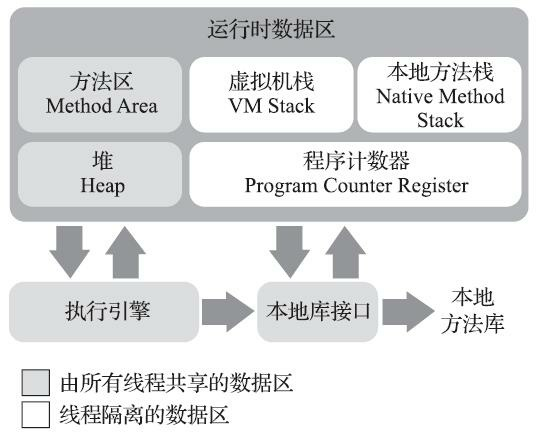
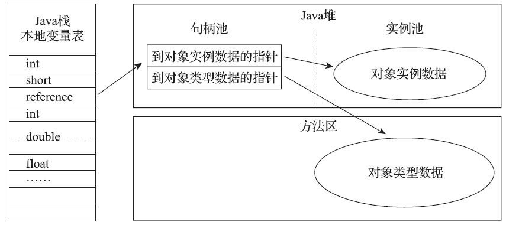
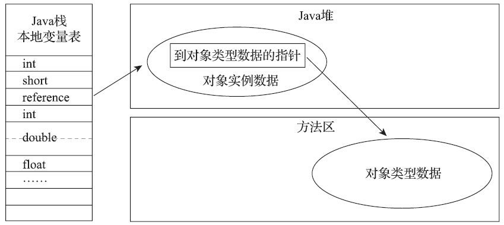

# 1	Java 内存区域与内存溢出异常

## 1.0

##### Java 中的内存泄露与内存溢出问题

- 在虚拟机自动内存管理机制的帮助下，Java 不再需要为每一个 new 操作编写配对的 delete/free 代码，不容易出现内存泄漏和内存溢出问题。

  但是，因为 Java 把控制内存的权力交给了 Java 虚拟机，一旦出现内存泄漏和溢出方面的问题，如果不了解虚拟机是怎样使用内存的，那排查错误、修正问题就会成为一项异常艰难的工作。

---

<div STYLE="page-break-after: always;"><br/><br/><br/></div>

## 1.1	运行时数据区域

##### 简介

- Java 虚拟机在执行 Java 程序的过程中会把它所管理的内存划分为若干个不同的数据区域。这些区域有各自的用途以及创建和销毁时间，有的区域随虚拟机进程的启动而一直存在，有些区域则是依赖用户线程的启动和结束而建立和销毁。

<br/>

##### Java 虚拟机运行时数据区



<br/>

##### 程序计数器

###### 简介

- 程序计数器（Program Counter Register）是一块较小的内存空间，它可以看作是 **当前线程所执行的字节码的行号指示器**。在 Java 虚拟机的概念模型[^1.1-1]里，字节码解释器工作时就是通过改变这个计数器的值来选取下一条需要执行的字节码指令，它是 **程序控制流的指示器**，分支、循环、跳转、异常处理、线程恢复等基础功能都需要依赖这个计数器来完成。

###### 每条线程都有独立的程序计数器

- 由于 Java 虚拟机的多线程是通过线程轮流切换、分配处理器执行时间的方式来实现的，在任何一个确定的时刻，一个处理器[^1.1-2]都只会执行一条线程中的指令。因此，为了线程切换后能恢复到正确的执行位置，每条线程都需要有一个独立的程序计数器，各条线程之间计数器互不影响，独立存储，我们称这类内存区域为**“线程私有”**的内存。

###### 执行本地方法时，程序计数器的值为空

- 如果线程正在执行的是一个 Java 方法，这个计数器记录的是正在执行的虚拟机字节码指令的地址；如果正在执行的是本地（Native）方法，这个计数器值则应为空（Undefined）。

###### 程序计数器没有规定 OutOfMemoryError 情况

- 此内存区域是唯一一个在《Java 虚拟机规范》中没有规定任何 OutOfMemoryError 情况的区域。

<br/>

##### Java 虚拟机栈

###### 线程私有

- 与程序计数器一样，Java虚拟机栈（Java Virtual Machine Stack）也是 **线程私有的**，它的生命周期与线程相同。

###### 虚拟机栈描述的是 Java 方法执行的线程内存模型

- 每个方法被执行的时候，Java 虚拟机都会同步创建一个栈帧（Stack Frame）用于存储 **局部变量表**、操作数栈、动态连接、方法出口等信息。每一个方法被调用直至执行完毕的过程，就对应着一个栈帧在虚拟机栈中从入栈到出栈的过程。

###### 栈内存与虚拟机栈

- 经常有人把 Java 内存区域 **笼统** 地划分为堆内存（Heap）和栈内存（Stack）。“栈” 通常就是指虚拟机栈，或者更多的情况下只是指虚拟机栈中局部变量表部分。

###### 局部变量表

- 局部变量表存放了编译期可知的各种 Java 虚拟机基本数据类型[^1.1-3]、对象引用[^1.1-4]和 returnAddress 类型[^1.1-5]。

  这些数据类型在局部变量表中的存储空间以局部变量槽（Slot）来表示，其中64位长度的 long 和 double 类型的数据会占用两个变量槽，其余的数据类型只占用一个。

  局部变量表所需的内存空间在编译期间完成分配，当进入一个方法时，这个方法需要在栈帧中分配多大的局部变量空间是完全确定的，在方法运行期间不会改变局部变量表的大小[^1.1-6]。

###### 虚拟机栈的异常状况

- 在《Java 虚拟机规范》中，对这个内存区域规定了两类异常状况：

  - 如果线程请求的栈深度大于虚拟机所允许的深度，将抛出 StackOverflowError 异常；
  - 如果 Java 虚拟机栈容量可以动态扩展，当栈扩展时无法申请到足够的内存会抛出 OutOfMemoryError 异常。

  HotSpot 虚拟机的栈容量是不可以动态扩展的。所以在 HotSpot 虚拟机上是不会由于虚拟机栈无法扩展而导致 OutOfMemoryError 异常——只要线程申请栈空间成功了就不会有 OOM ，但是如果申请时就失败，仍然会出现OOM 异常。

<br/>

##### 本地方法栈

###### 简介

- 本地方法栈（Native Method Stacks）与虚拟机栈所发挥的作用是非常相似的，其区别只是虚拟机栈为虚拟机执行 Java 方法（也就是字节码）服务，而本地方法栈则是为虚拟机使用到的 **本地（Native）方法** 服务。

###### 本地方法栈的虚拟机实现没有强制规定

- 《Java 虚拟机规范》对本地方法栈中方法使用的语言、使用方式与数据结构并没有任何强制规定，因此 **具体的虚拟机可以根据需要自由实现它**，甚至有的 Java 虚拟机（譬如Hot-Spot虚拟机）直接就把本地方法栈和虚拟机栈合二为一。


###### 本地方法栈的异常情况

- 与虚拟机栈一样，本地方法栈也会在栈深度溢出或者栈扩展失败时分别抛出 StackOverflowError 和 OutOfMemoryError 异常。

<br/>

##### Java 堆

###### 简介

- 对于 Java 应用程序来说，Java 堆（Java Heap）是虚拟机所管理的内存中 **最大** 的一块。Java 堆是 **被所有线程共享** 的一块内存区域，**在虚拟机启动时创建**。**此内存区域的唯一目的就是存放对象实例**，Java 世界里 **“几乎”** 所有的对象实例都在这里分配内存[^1.1-7]。

###### Java 堆也被称为 GC 堆

- Java 堆是垃圾收集器管理的内存区域，因此一些资料中它也被称作**“GC堆”**（Garbage CollectedHeap）。

###### Java 堆的划分

- - 从回收内存的角度看，由于现代垃圾收集器大部分都是基于 **分代收集理论** 设计的，所以 Java 堆中经常会出现“新生代”、“老年代”、“永久代”、“Eden间”、“From Survivor空间”、“To Survivor空间”等名词[^1.1-8]。

  - 如果从分配内存的角度看，所有线程共享的 Java 堆中可以划分出多个线程私有的分配缓冲区（Thread Local Allocation Buffer，TLAB），以提升对象分配时的效率。

  不过无论从什么角度，无论如何划分，都不会改变 Java 堆中存储内容的共性，无论是哪个区域，存储的都只能是对象的实例，将 Java 堆细分的目的只是为了更好地回收内存，或者更快地分配内存。

###### Java 堆的实现

- 根据《Java虚拟机规范》的规定，**Java 堆可以处于物理上不连续的内存空间中，但在逻辑上它应该被视为连续的**[^1.1-9]。但对于大对象（典型的如数组对象），多数虚拟机实现出于实现简单、存储高效的考虑，很可能会要求连续的内存空间。

  Java 堆既可以被实现成固定大小的，也可以是可扩展的，不过当前主流的 Java 虚拟机都是按照可扩展来实现的（通过参数 `-Xmx` 和 `-Xms` 设定）。

###### Java 堆的异常情况

- 如果在 Java 堆中 **没有足够内存完成实例分配，并且堆也无法再扩展时**，Java 虚拟机将会抛出 OutOfMemoryError 异常。

<br/>

##### 方法区

###### 简介

- 方法区（Method Area）与 Java 堆一样，是各个线程共享的内存区域，它 **用于存储已被虚拟机加载的类型信息、常量、静态变量、即时编译器编译后的代码缓存等数据**。虽然《Java 虚拟机规范》中把方法区描述为堆的一个逻辑部分，但是它却有一个别名叫作“非堆”（Non-Heap），目的是与 Java 堆区分开来。

###### 方法区与永久代

- 在 JDK 8 以前，HotSpot 虚拟机设计团队选择把收集器的分代设计扩展至方法区，或者说使用永久代来实现方法区[^1.1-10]。这导致很多人都更愿意把方法区称呼为“永代”（Permanent Generation），或将两者混为一谈。但是，本质上这两者并不是等价的。甚至对于其他虚拟机实现，譬如 BEA JRockit、IBM J9 等来说，**是不存在永久代的概念的**。

  原则上如何实现方法区属于虚拟机实现细节，不受《Java 虚拟机规范》管束，并不要求统一。但现在回头来看，HotSpot 当年使用永久代来实现方法区的决定并不是一个好主意，这种设计导致了 Java 应用更容易遇到内存溢出的问题[^1.1-11]，而且有极少数方法（例如 `String::intern()`）会因永久代的原因而导致不同虚拟机下有不同的表现。考虑到 HotSpot 未来的发展，在 JDK 6的时候 HotSpot 开发团队就有放弃永久代，逐步改为采用本地内存（Native Memory）来实现方法区的计划了，到了 JDK 7 的 HotSpot，已经把原本放在永久代的字符串常量池、静态变量等移出，而到了JDK 8，终于完全废弃了永久代的概念，改用与 JRockit、J9 一样在本地内存中实现的元空间（Meta-space）来代替，把 JDK 7 中永久代还剩余的内容（主要是类型信息）全部移到元空间中。

###### 方法区的实现与垃圾收集

- 《Java虚拟机规范》对方法区的约束是非常宽松的，除了和 Java 堆一样不需要连续的内存和可以选择固定大小或者可扩展外，甚至还可以选择不实现垃圾收集。

  相对而言，垃圾收集行为在这个区域的确是比较少出现的，但并非数据进入了方法区就如永久代的名字一样“永久”存在了。这区域的内存回收目标主要是针对常量池的回收和对类型的卸载，一般来说这个区域的回收效果比较难令人满意，尤其是类型的卸载，条件相当苛刻，但是这部分区域的回收有时又确实是必要的[^1.1-12]。

###### 方法区的异常情况

- 根据《Java 虚拟机规范》的规定，如果方法区无法满足新的内存分配需求时，将抛出 OutOfMemoryError 异常。

<br/>

##### 运行时常量池

###### 简介

- 运行时常量池（Runtime Constant Pool）**是方法区的一部分**。Class 文件中除了有类的版本、字段、方法、接口等描述信息外，还有一项信息是常量池表（Constant Pool Table），用于存放编译期生成的各种字面量与符号引用，这部分内容将在类加载后存放到方法区的运行时常量池中。

###### 运行时常量池的实现

- Java 虚拟机对于 Class 文件每一部分（自然也包括常量池）的格式都有严格规定，如每一个字节用于存储哪种数据都必须符合规范上的要求才会被虚拟机认可、加载和执行，但对于运行时常量池，《Java 虚拟机规范》并没有做任何细节的要求，不同提供商实现的虚拟机可以按照自己的需要来实现这个内存区域，不过一般来说，除了保存 Class 文件中描述的符号引用外，还会把由符号引用翻译出来的直接引用也存储在运行时常量池中。

###### 运行时常量池具备动态性

- 运行时常量池相对于 Class 文件常量池的另外一个重要特征是具备动态性，Java 语言并不要求常量一定只有编译期才能产生，也就是说，并非预置入 Class 文件中常量池的内容才能进入方法区运行时常量池，运行期间也可以将新的常量放入池中，这种特性被开发人员利用得比较多的便是 String 类的intern()方法。

###### 运行时常量池的异常情况

- 既然运行时常量池是方法区的一部分，自然受到方法区内存的限制，当常量池无法再申请到内存时会抛出 OutOfMemoryError 异常。

<br/>

##### 直接内存

###### 简介

- 直接内存（Direct Memory）并不是虚拟机运行时数据区的一部分，也不是《Java虚拟机规范》中定义的内存区域。但是这部分内存也被频繁地使用，而且也可能导致 OutOfMemoryError 异常出现，所以必须了解。

###### NIO

- 在 JDK 1.4中新加入了NIO（New Input/Output）类，引入了一种基于通道（Channel）与缓冲区（Buffer）的I/O方式，它可以**使用 Native 函数库直接分配堆外内存**，然后通过一个存储在Java堆里面的 DirectByteBuffer 对象作为这块内存的引用进行操作。这样能在一些场景中显著提高性能，因为避免了在 Java 堆和 Native 堆中来回复制数据。

  显然，**本机直接内存的分配不会受到 Java 堆大小的限制**，但是，既然是内存，则肯定还是会受到本机总内存大小[^1.1-13]以及处理器寻址空间的限制。

  一般服务器管理员配置虚拟机参数时，会根据实际内存去设置 -Xmx 等参数信息，但经常忽略掉直接内存，使得各个内存区域总和大于物理内存限制（包括物理的和操作系统级的限制），从而导致动态扩展时出现 OutOfMemoryError 异常。

<br/>

---

[^1.1-1]:概念模型”这个词会经常被提及，它代表了所有虚拟机的统一外观，但各款具体的Java虚拟机并不一定要完全照着概念模型的定义来进行设计，可能会通过一些更高效率的等价方式去实现它。

[^1.1-2]: 对于多核处理器来说则是一个内核。

[^1.1-3]: boolean、byte、char、short、int、float、long、double

[^1.1-4]: reference 类型，它并不等同于对象本身，可能是一个指向对象起始地址的引用指针，也可能是指向一个代表对象的句柄或者其他与此对象相关的位置。

[^1.1-5]: 指向了一条字节码指令的地址。

[^1.1-6]: 请注意，这里说的“大小”是指变量槽的数量，虚拟机真正使用多大的内存空间（譬如按照1个变量槽占用32个比特、64个比特，或者更多）来实现一个变量槽，是完全由具体的虚拟机实现自行决定的事情。

[^1.1-7]: 在《Java 虚拟机规范》中对 Java 堆的描述是：“所有的对象实例以及数组都应当在堆上分配”，而这里的“几乎”是指从实现角度来看，随着 Java语言的发展，现在已经能看到些许迹象表明日后可能出现值类型的支持，即使只考虑现在，由于即时编译技术的进步，尤其是逃逸分析技术的日渐强大，栈上分配、标量替换优化手段已经导致一些微妙的变化悄然发生，所以说 Java 对象实例都分配在堆上也渐渐变得不是那么绝对了。
[^1.1-8]: 但是这些区域划分仅仅是一部分垃圾收集器的共同特性或者说设计风格而已，而非某个 Java 虚拟机具体实现的固有内存布局，更不是《Java 虚拟机规范》里对 Java 堆的进一步细致划分。不少资料中之所以将堆进行上述划分，主要是因为曾经的主流虚拟机 HotSpot 采用这种设计，但是随着垃圾收集器技术的发展，该设计已经不再被普遍采用了。
[^1.1-9]: 这点就像我们用磁盘空间去存储文件一样，并不要求每个文件都连续存放。
[^1.1-10]: 这样使得 HotSpot 的垃圾收集器能够像管理 Java 堆一样管理这部分内存，省去专门为方法区编写内存管理代码的工作。
[^1.1-11]: 永久代有 -XX：MaxPermSize 的上限，即使不设置也有默认大小，而 J9 和 JRockit 只要没有触碰到进程可用内存的上限，例如32位系统中的4GB限制，就不会出问题。
[^1.1-12]: 以前 Sun 公司的 Bug 列表中，曾出现过的若干个严重的 Bug 就是由于低版本的 HotSpot 虚拟机对此区域未完全回收而导致内存泄漏。
[^1.1-13]: 包括物理内存、SWAP分区或者分页文件。

<div STYLE="page-break-after: always;"><br/><br/><br/></div>

## 1.2	HotSpot 虚拟机对象

##### 创建对象

###### 语言层面的对象创建

- 在语言层面上，创建对象通常[^1.2-1]仅仅是使用了一个 new 关键字。

###### 虚拟机中的对象创建过程

1. 当 Java 虚拟机遇到一条字节码 new 指令时，首先将去检查这个指令的参数是否能在常量池中定位到一个类的符号引用，并且检查这个符号引用代表的类是否已被加载、解析和初始化过。如果没有，那必须先执行相应的类加载过程。

2. 在类加载检查通过后，接下来虚拟机将为新生对象分配内存。对象所需内存的大小在类加载完成后便可完全确定，为对象分配空间的任务实际上便等同于把一块确定大小的内存块从 Java 堆中划分出来。

3. 内存分配完成之后，虚拟机必须将分配到的内存空间（但不包括对象头）都初始化为零值，如果使用了 [TLAB][1] 的话，这一项工作也可以提前至 TLAB 分配时顺便进行。这步操作保证了对象的实例字段在 Java 代码中可以不赋初始值就直接使用，使程序能访问到这些字段的数据类型所对应的零值。

4. 接下来，Java 虚拟机还要对对象进行必要的设置，例如这个对象是哪个类的实例、如何才能找到类的元数据信息、对象的哈希码[^1.2-2]之中。根据虚拟机当前运行状态的不同，如是否启用偏向锁等，对象头会有不同的设置方式。

5. 在上面工作都完成之后**，从虚拟机的视角来看，一个新的对象已经产生了**。但是从 Java 程序的视角看来，对象创建才刚刚开始——构造函数，即 Class 文件中的 `<init>()` 方法还没有执行，所有的字段都为默认的零值，对象需要的其他资源和状态信息也还没有按照预定的意图构造好。

   一般来说[^1.2-3]，new 指令之后会接着执行 `<init>()` 方法，按照程序员的意愿对对象进行初始化，这样一个真正可用的对象才算完全被构造出来。

###### 对象内存的分配方式

- - **指针碰撞**：假设Java堆中内存是绝对规整的，所有被使用过的内存都被放在一边，空闲的内存被放在另一边，中间放着一个指针作为分界点的指示器，那所分配内存就仅仅是把那个指针向空闲空间方向挪动一段与对象大小相等的距离，这种分配方式称为 **“指针碰撞”（Bump The Pointer）**。
  - **空闲列表**：如果Java堆中的内存并不是规整的，已被使用的内存和空闲的内存相互交错在一起，那就没有办法简单地进行指针碰撞了，虚拟机就必须维护一个列表，记录上哪些内存块是可用的，在分配的时候从列表中找到一块足够大的空间划分给对象实例，并更新列表上的记录，这种分配方式称为 **“空闲列表”（Free List）**。

  选择哪种分配方式**由 Java 堆是否规整决定**，而 Java 堆是否规整又由所采用的垃圾收集器是否带有空间压缩整理（Compact）的能力决定。因此，当使用 Serial、ParNew 等带压缩整理过程的收集器时，系统采用的分配算法是指针碰撞，既简单又高效；而当使用 CMS 这种基于清除（Sweep）算法的收集器时，**理论上** 就只能采用较为复杂的空闲列表来分配内存[^1.2-4]。

###### 对象创建的线程安全

- 对象创建在虚拟机中是非常频繁的行为，即使仅仅修改一个指针所指向的位置，在并发情况下也并不是线程安全的，可能出现正在给对象 A 分配内存，指针还没来得及修改，对象 B 又同时使用了原来的指针来分配内存的情况。解决这个问题有两种可选方案：
  1. 一种是对分配内存空间的动作进行同步处理——实际上虚拟机是采用 CAS 配上失败重试的方式保证更新操作的原子性；
  2. 另外一种是把内存分配的动作按照线程划分在不同的空间之中进行，即每个线程在 Java 堆中预先分配一小块内存，称为<span id="1" style="display:none"> **本地线程分配缓冲（Thread Local Allocation Buffer，TLAB）**</span>，哪个线程要分配内存，就在哪个线程的本地缓冲区中分配，只有本地缓冲区用完了，分配新的缓存区时才需要同步锁定。虚拟机是否使用 TLAB，可以通过 `-XX：+/-UseTLAB` 参数来设定。

<br/>

##### 对象的内存布局

###### 对象的布局划分

- 在 HotSpot 虚拟机里，对象在堆内存中的存储布局可以划分为三个部分：
  1. 对象头（Header）
  2. 实例数据（Instance Data）
  3. 对齐填充（Padding）。

###### 对象头

- HotSpot 虚拟机对象的对象头部分包括两类信息：

  1. 第一类是 **用于存储对象自身的运行时数据**，如哈希码（HashCode）、GC分代年龄、锁状态标志、线程持有的锁、偏向线程ID、偏向时间戳等，这部分数据的长度在32位和64位的虚拟机（未开启压缩指针）中分别为32个比特和64个比特，官方称它为 **“Mark Word”**。

     对象需要存储的运行时数据很多，其实已经超出了32、64位 Bitmap 结构所能记录的最大限度，但对象头里的信息是与对象自身定义的数据无关的额外存储成本，考虑到虚拟机的空间效率，Mark Word 被设计成一个有着动态定义的数据结构，以便在极小的空间内存储尽量多的数据，根据对象的状态复用自己的存储空间。

     以32位的 HotSpot 虚拟机为例，如果对象未被同步锁锁定， Mark Word 的32个比特存储空间中的25个比特用于存储对象哈希码，4个比特用于存储对象分代年龄，2个比特用于存储锁标志位，1个比特固定为0。
  
  2. 对象头的另外一部分是 **类型指针**，即 **对象指向它的类型元数据的指针**，Java 虚拟机通过该指针来确定该对象是哪个类的实例[^1.2-5]。此外，如果对象是一个 Java 数组，那在对象头中还必须有一块用于记录数组长度的数据，因为虚拟机可以通过普通 Java 对象的元数据信息确定 Java 对象的大小，但是如果数组的长度是不确定的，将无法通过元数据中的信息推断出数组的大小。

###### 实例数据

- 实例数据部分是 **对象真正存储的有效信息**，即我们在程序代码里面所定义的各种类型的字段内容，无论是从父类继承下来的，还是在子类中定义的字段都必须记录起来。

  这部分的存储顺序会受到虚拟机分配策略参数（`-XX：FieldsAllocationStyle` 参数）和字段在 Java 源码中定义顺序的影响。HotSpot 虚拟机默认的分配顺序为 longs/doubles、ints、shorts/chars、bytes/booleans、oops（Ordinary Object Pointers），从以上默认的分配策略中可以看到，相同宽度的字段总是被分配到一起存放，在满足这个前提条件的情况下，在父类中定义的变量会出现在子类之前。如果 HotSpot 虚拟机的 `+XX：CompactFields` 参数值为 `true`（默认即为 true），那子类之中较窄的变量也允许插入父类变量的空隙之中，以节省出一点点空间。

###### 对其填充

- 对象的第三部分是对齐填充，这并不是必然存在的，也没有特别的含义，它仅仅起着占位符的作用。由于 HotSpot 虚拟机的自动内存管理系统要求对象起始地址必须是8字节的整数倍，换句话说就是 **任何对象的大小都必须是8字节的整数倍**。对象头部分已经被精心设计成正好是8字节的倍数（1倍或者2倍），因此，如果对象实例数据部分没有对齐的话，就需要通过对齐填充来补全。

<br/>

##### 对象的访问定位

###### Java 通过 reference 数据访问对象

- Java 程序会通过栈上的 reference 数据来操作堆上的具体对象。由于 reference 类型在《Java虚拟机规范》里面只规定了它是一个指向对象的引用，并没有定义这个引用应该通过什么方式去定位、访问到堆中对象的具体位置，所以对象访问方式也是由虚拟机实

  现而定的。

###### 主流的对象访问方式

- - **使用句柄访问**：如果使用句柄访问的话，Java 堆中将可能会划分出一块内存来作为句柄池，reference 中存储的就是对象的句柄地址，而句柄中包含了对象实例数据与类型数据各自具体的地址信息，其结构如下图所示。

  

  - **使用直接指针访问**：如果使用直接指针访问的话，Java 堆中对象的内存布局就必须考虑如何放置访问类型数据的相关信息，reference 中存储的直接就是对象地址，如果只是访问对象本身的话，就不需要多一次间接访问的开销，其结构如下图所示。

    

<br/>

---

[^1.2-1]: 例外：复制、反序列化。
[^1.2-2]: 实际上对象的哈希码会延后到真正调用 Object::hashCode() 方法时才计算）*、对象的 GC 分代年龄等信息。这些信息存放在对象的对象头（Object Header。
[^1.2-3]: 这由字节码流中 new 指令后面是否跟随 invokespecial 指令所决定，Java 编译器会在遇到 new 关键字的地方同时生成这两条字节码指令，但如果直接通过其他方式产生的则不一定如此。
[^1.2-4]: 强调“理论上”是因为在 CMS 的实现里面，为了能在多数情况下分配得更快，设计了一个叫作 Linear Allocation Buffer 的分配缓冲区，通过空闲列表拿到一大块分配缓冲区之后，在它里面仍然可以使用指针碰撞方式来分配。
[^1.2-5]: 并不是所有的虚拟机实现都必须在对象数据上保留类型指针，换句话说，查找对象的元数据信息并不一定要经过对象本身。

<div STYLE="page-break-after: always;"><br/><br/><br/></div>

## 1.3	OutOfMemory 异常

### 1.3.1	Java 堆溢出

##### Java 堆溢出的提示信息

- Java 堆内存的 OutOfMemoryError 异常是实际应用中最常见的内存溢出异常情况。出现 Java 堆内存溢出时，异常堆栈信息 “java.lang.OutOfM emoryError” 会跟随进一步提示 “Java heap space”。

<br>

##### Java 堆溢出的触发条件

- Java 堆用于储存对象实例，我们只要不断地创建对象，并且保证 GC Roots 到对象之间有可达路径来避免垃圾回收机制清除这些对象，那么随着对象数量的增加，总容量触及最大堆的容量限制后就会产生内存溢出异常。

<br/>

##### 例——Java 堆溢出异常触发演示

```java
package JavaVirtualMachine;

import java.util.ArrayList;
import java.util.List;

/**
 * 通过设置虚拟机参数限制 Java 堆的大小为 20 MB，不可扩展（将堆的最小值-Xms参数与最大值-Xmx参数设置为一样即可避免堆自动扩展）
 * VM Args：-Xms20m -Xmx20m -XX:+HeapDumpOnOutOfMemoryError
 * @author zzm
 */
class OOMObject {}

public class HeapOOM {
    public static void main(String[] args) {

        List<OOMObject> list = new ArrayList<OOMObject>();

        while (true) {
            list.add(new OOMObject());
        }
    }
}
```

- 运行结果：

  ```
  Exception in thread "main" java.lang.OutOfMemoryError: Java heap space
  	at java.base/java.util.Arrays.copyOf(Arrays.java:3720)
  	at java.base/java.util.Arrays.copyOf(Arrays.java:3689)
  	at java.base/java.util.ArrayList.grow(ArrayList.java:238)
  	at java.base/java.util.ArrayList.grow(ArrayList.java:243)
  	at java.base/java.util.ArrayList.add(ArrayList.java:486)
  	at java.base/java.util.ArrayList.add(ArrayList.java:499)
  	at JavaVirtualMachine.HeapOOM.main(HeapOOM.java:27)
  ```

<br/>

##### 📌解决堆溢出异常

###### 内存映像分析工具

- 要解决这个内存区域的异常，常规的处理方法是首先通过内存映像分析工具[^1.3.1-1]对 Dump 出来的堆转储快照进行分析。第一步首先应 **确认内存中导致 OOM 的对象是否是必要的**，也就是要先分清楚到底是出现了内存泄漏（Memory Leak）还是内存溢出（MemoryOverflow）。

###### 📌解决内存泄漏导致的堆溢出异常

- 如果是内存泄漏，可进一步通过工具查看泄漏对象到 GC Roots 的引用链，找到泄漏对象是通过怎样的引用路径、与哪些GC Roots相关联，才导致垃圾收集器无法回收它们，根据泄漏对象的类型信息以及它到 GC Roots引 用链的信息，一般可以比较准确地定位到这些对象创建的位置，进而找出产生内存泄漏的代码的具体位置。

###### 📌解决内存溢出导致的堆溢出异常

- 如果不是内存泄漏，换句话说就是内存中的对象确实都是必须存活的，那就应当检查 Java 虚拟机的堆参数（-Xmx与-Xms）设置，与机器的内存对比，看看是否还有向上调整的空间。再从代码上检查是否存在某些对象生命周期过长、持有状态时间过长、存储结构设计不合理等情况，尽量减少程序运行期的内存消耗。

<br/>

---

[^1.3.1-1]: 如 Eclipse Memory Analyzer 或 IDEA 插件 JProfiler

<div STYLE="page-break-after: always;"><br/><br/><br/></div>

### 1.3.2	虚拟机栈和本地方法栈溢出

##### HopSpot 虚拟机的栈容量设置

- 由于 HotSpot 虚拟机中并不区分虚拟机栈和本地方法栈，因此对于 HotSpot 来说，`-Xoss` 参数（设置本地方法栈大小）虽然存在，但实际上是没有任何效果的，栈容量只能由 `-Xss` 参数来设定。

 <br/>

##### HopSpot 虚拟机的栈溢出异常

- 《Java 虚拟机规范》明确允许 Java 虚拟机实现自行选择是否支持栈的动态扩展，而 HotSpot 虚拟机的选择是不支持扩展，所以除非在创建线程申请内存时就因无法获得足够内存而出现 OutOfMemoryError 异常，否则在线程运行时是不会因为扩展而导致内存溢出的，只会因为栈容量无法容纳新的栈帧而导致 StackOverflowError 异常[^1.3.2-1]。

<br/>

##### 多线程导致的栈 OutOfMemoryError 异常

- 通过不断建立线程的方式，在 HotSpot 上也是可以产生内存溢出异常的。但是 **这样产生的内存溢出异常和栈空间是否足够并不存在任何直接的关系，主要取决于操作系统本身的内存使用状态**。甚至可以说，在这种情况下，给每个线程的栈分配的内存越大，反而越容易产生内存溢出异常。

  原因其实不难理解，操作系统分配给每个进程的内存是有限制的，譬如 32位 Windows 的单个进程最大内存限制为 2GB。HotSpot 虚拟机提供了参数控制 Java 堆和方法区这两部分的内存的最大值，那剩余的内存即为 2GB（操作系统限制）减去最大堆容量，再减去最大方法区容量，由于程序计数器消耗内存很小，可以忽略掉，如果把直接内存和虚拟机进程本身耗费的内存也去掉的话，剩下的内存就由虚拟机栈和本地方法栈来分配了。因此为每个线程分配到的栈内存越大，可以建立的线程数量自然就越少，建立线程时就越容易把剩下的内存耗尽。

<br/>

##### 📌解决虚拟机栈和本地方法栈溢出异常

###### 📌解决 StackOverflowError

- 出现 StackOverflowError 异常时，会有明确错误堆栈可供分析，相对而言比较容易定位到问题所在。如果使用 HotSpot 虚拟机默认参数，栈深度在大多数情况下[^1.3.2-2]到达 1000~2000 完全没有问题，对于正常的方法调用（包括不能做尾递归优化的递归调用），这个深度应该完全够用了。

###### 📌解决建立过多线程导致的内存溢出

- 如果是建立过多线程导致的内存溢出，在不能减少线程数量或者更换64位虚拟机的情况下，就只能通过 **减少最大堆和减少栈容量来换取更多的线程**。

  这种通过“减少内存”的手段来解决内存溢出的方式，如果没有这方面处理经验，一般比较难以想到，这一点读者需要在开发32位系统的多线程应用时注意。也是由于这种问题较为隐蔽，从 JDK 7 起，以上提示信息中 “unable to create native thread”后面，虚拟机会特别注明原因可能是 “possiblyout of memory or process/resource limits reached”。

<br/>

---

[^1.3.2-1]:在《深入理解Java虚拟机：JVM高级特性与最佳实践（第3版）》的 2.4.2 虚拟机栈和本地方法栈溢出 一节中对此进行了验证。
[^1.3.2-2]:因为每个方法压入栈的帧大小并不是一样的，所以只能说大多数情况下。

<div STYLE="page-break-after: always;"><br/><br/><br/></div>

### 1.3.3	方法区和运行时常量池溢出[^1.3.3-1]

##### 使用“永久代”还是“元空间”来实现方法区对程序的影响[^1.3.3-2]

- 由于在 JDK 6 或更早之前的 HotSpot 虚拟机中，运行时常量池属于方法区（即JDK 6的HotSpot虚拟机中的永久代）的一部分。这导致运行时常量池溢出时，会提示 “PermGen space”。

<br/>

##### 运行时生成大量动态类导致方法区溢出的场景

###### CGLib 技术

- 当前的很多主流框架，如 Spring、Hibernate 对类进行增强时，都会使用到CGLib这类字节码技术，当增强的类越多，就需要越大的方法区以保证动态生成的新类型可以载入内存。

###### 动态语言

- 很多运行于 Java 虚拟机上的动态语言（例如 Groovy 等）通常都会持续创建新类型来支撑语言的动态性，随着这类动态语言的流行也会导致方法区溢出越来越常见。

<br/>

##### 元空间对永久代的替代

- 在 JDK 8 以后，永久代便完全退出了历史舞台，元空间作为其替代者登场。在默认设置下，正常的动态创建新类型已经很难再迫使虚拟机产生方法区的溢出异常了，但是为了让使用者预防实际应用里出现的内存溢出，虚拟机还是提供了预防措施。


<br/>

##### 元空间对内存溢出的预防措施

###### -XX：MaxM etaspaceSize

- 设置元空间最大值，默认是-1，即不限制，或者说只受限于本地内存大小。

###### -XX：MetaspaceSize

- 指定元空间的初始空间大小，以字节为单位，达到该值就会触发垃圾收集进行类型卸载，同时收集器会对该值进行调整：如果释放了大量的空间，就适当降低该值；如果释放了很少的空间，那么在不超过-XX：M axM etaspaceSize（如果设置了的话）的情况下，适当提高该值。

###### -XX：MinM etaspaceFreeRatio

- 作用是在垃圾收集之后控制最小的元空间剩余容量的百分比，可减少因为元空间不足导致的垃圾收集的频率。类似的还有-XX：M ax-M etaspaceFreeRatio，用于控制最大的元空间剩余容量的百分比。

<br/>

---

[^1.3.3-1]: 由于运行时常量池是方法区的一部分，所以这两个区域的溢出测试可以放到一起进行。
[^1.3.3-2]: 在《深入理解Java虚拟机：JVM高级特性与最佳实践（第3版）》的 2.4.3 方法区和运行时常量池溢出 中对此进行了验证。

<div STYLE="page-break-after: always;"><br/><br/><br/></div>

### 1.3.4	本机直接内存溢出

##### 设置直接内存的大小

- 直接内存（Direct M emory）的容量大小可通过 `-XX：MaxDirectM emorySize` 参数来指定，如果不去指定，则默认与 Java 堆最大值（由 `-Xmx` 指定）一致。

<br/>

##### 判断与解决本机直接内存溢出

- 由直接内存导致的内存溢出，一个明显的特征是**在 Heap Dump 文件中不会看见有什么明显的异常情况**，如果读者发现内存溢出之后产生的 Dump 文件很小，而程序中又直接或间接使用了 DirectMemory（典型的间接使用就是 NIO），那就可以考虑重点检查一下直接内存方面的原因了。

<br/>

---


<div STYLE="page-break-after: always;"><br/><br/><br/></div>

# 2

---


<div STYLE="page-break-after: always;"><br/><br/><br/></div>

# 附录

##### 最后编辑时间

- 2021/05/01

##### 环境

- adopt-openjdk-11
- IntelliJ IDEA 2020.3.2 (Ultimate Edition)
- Runtime version: 11.0.9.1+11-b1145.77 amd64
- VM: OpenJDK 64-Bit Server VM by JetBrains s.r.o.
- Windows 10 10.0
- GC: ParNew, ConcurrentMarkSweep
- Memory: 1967M
- Cores: 8
- Non-Bundled Plugins: org.example.BetterIntelliJ

##### 参考资料

- 《深入理解 Java 虚拟机：JVM 高级特性与最佳实践（第3版）》

##### 附

- 

##### 代码链接

[1]:

##### 脚注


