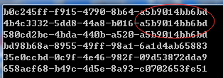

# 分布式系统唯一 ID 生成方案

##### 分布式系统的唯一 ID 生成策略

系统唯一ID是我们在设计一个系统的时候常常会遇见的问题，也常常为这个问题而纠结。生成ID的方法有很多，适应不同的场景、需求以及性能要求。所以有些比较复杂的系统会有多个ID生成的策略。下面就介绍一些常见的ID生成策略。

<br>

##### 数据库自增长序列或字段

最常见的方式。利用数据库，全数据库唯一。

###### 优点

- **简单、性能尚可**：简单，代码方便，性能可以接受。

- **天然排序**：数字 ID 天然排序，对分页或者需要排序的结果很有帮助。

###### 缺点

- **数据库迁移问题**：不同数据库语法和实现不同，数据库迁移的时候或多数据库版本支持的时候需要处理。
- **单点故障风险**：在单个数据库或读写分离或一主多从的情况下，只有一个主库可以生成。有单点故障的风险。
- **不适用于海量高并发**：一般在性能达不到要求的情况下，会对数据库进行扩展，但是该方法比较难于扩展。
- **数据迁移与系统合并支持性差**：如果遇见多个系统需要合并或者涉及到数据迁移会相当痛苦。
- **难以分库分表**：分表分库的时候会有麻烦。
- **ID 不一定连续**：ID 并非一定连续，类似MySQL，当生成新ID的事务回滚，那么后续的事务也不会再用这个ID了。这个在性能和连续性的折中。如果为了保证连续，必须要在事务结束后才能生成ID，那性能就会出现问题。
- **热点数据问题**：在分布式数据库中，如果采用了自增主键的话，有可能会带来尾部热点。分布式数据库常常使用 range 的分区方式，在大量新增记录的时候，IO会集中在一个分区上，造成热点数据。

###### 优化方案

针对主库单点，如果有多个 Master 库，则每个 Master 库设置的起始数字不一样，步长一样，可以是 Master 的个数。比如：

- Master1 生成的是 1，4，7，10；
- Master2 生成的是 2,5,8,11；
- Master3 生成的是 3,6,9,12。

这样就可以有效生成集群中的唯一 ID，也可以大大降低ID生成数据库操作的负载。

 <br>

##### UUID

常见的方式。可以利用数据库也可以利用程序生成，一般来说全局唯一。UUID 是由 32 个的 16 进制数字组成，所以每个 UUID 的长度是128位（16^32 = 2^128）。UUID 作为一种广泛使用标准，有多个实现版本，影响它的因素包括时间、网卡 MAC 地址、自定义 Namesapce 等等。

###### 优点

- **简单**：简单，代码实现方便。
- **性能好**：生成 ID 性能非常好，基本不会有性能问题。
- **ID 全局唯一**：全局唯一，在遇见数据迁移，系统数据合并，或者数据库变更等情况下，可以从容应对。

###### 缺点

- **没有排序**：没有排序，无法保证趋势递增。
- **查询效率低**：UUID 往往是使用字符串存储，查询的效率比较低。
- **占用存储空间大**：UUID 的存储空间比较大，如果是海量数据库，就需要考虑存储量的问题。
- **传输数据量大**：数据量过大。

- **不可读**：没有可读性。

######  UUID的变种

为了解决 UUID 的不可读问题，可以使用 UUID to Int64 的方法：

```
/// <summary>
/// 根据GUID获取唯一数字序列
/// </summary>
public static long GuidToInt64()
{
    byte[] bytes = Guid.NewGuid().ToByteArray();
    return BitConverter.ToInt64(bytes, 0);
}
```

为了解决 UUID 无序的问题，NHibernate 在其主键生成方式中提供了 Comb 算法（combined guid/timestamp）。保留GUID的10个字节，用另6个字节表示 GUID 生成的时间（DateTime）。

```
/// <summary> 
/// Generate a new <see cref="Guid"/> using the comb algorithm. 
/// </summary> 
private Guid GenerateComb()
{
    byte[] guidArray = Guid.NewGuid().ToByteArray();
 
    DateTime baseDate = new DateTime(1900, 1, 1);
    DateTime now = DateTime.Now;
 
    // Get the days and milliseconds which will be used to build    
    //the byte string    
    TimeSpan days = new TimeSpan(now.Ticks - baseDate.Ticks);
    TimeSpan msecs = now.TimeOfDay;
 
    // Convert to a byte array        
    // Note that SQL Server is accurate to 1/300th of a    
    // millisecond so we divide by 3.333333    
    byte[] daysArray = BitConverter.GetBytes(days.Days);
    byte[] msecsArray = BitConverter.GetBytes((long)
      (msecs.TotalMilliseconds / 3.333333));
 
    // Reverse the bytes to match SQL Servers ordering    
    Array.Reverse(daysArray);
    Array.Reverse(msecsArray);
 
    // Copy the bytes into the guid    
    Array.Copy(daysArray, daysArray.Length - 2, guidArray,
      guidArray.Length - 6, 2);
    Array.Copy(msecsArray, msecsArray.Length - 4, guidArray,
      guidArray.Length - 4, 4);
 
    return new Guid(guidArray);
}
```

用上面的算法测试一下，得到如下的结果：作为比较，前面3个是使用 COMB 算法得出的结果，最后12个字符串是时间序（统一毫秒生成的3个UUID），过段时间如果再次生成，则12个字符串会比图示的要大。后面3个是直接生成的GUID。

 

如果想把时间序放在前面，可以生成后改变12个字符串的位置，也可以修改算法类的最后两个 `Array.Copy`。

<br>

#####  Redis 生成 ID

当使用数据库来生成 ID 性能不够要求的时候，我们可以尝试使用 Redis 来生成 ID。这主要依赖于 Redis 是单线程的，所以也可以用生成全局唯一的 ID。可以用 Redis 的原子操作 INCR 和 INCRBY 来实现。

可以使用 Redis 集群来获取更高的吞吐量。假如一个集群中有 5 台 Redis。可以初始化每台 Redis 的值分别是 1,2,3,4,5，设置步长都是 5。各个 Redis 生成的ID为：

- A：1,6,11,16,21

- B：2,7,12,17,22

- C：3,8,13,18,23

- D：4,9,14,19,24

- E：5,10,15,20,25

注意，负载到哪台机器必须先确定，未来很难做修改。但是 3-5 台服务器基本能够满足器上，都可以获得不同的 ID。但是步长和初始值一定需要事先需要了。

使用 Redis 集群也可以避免单点故障的问题。

###### 适用场景

使用 Redis 比较适合用来生成每天从 0 开始的流水号。比如订单号=日期 + 当日自增长号。可以每天在 Redis 中生成一个 Key，使用 INCR 进行累加。

######  优点

- **灵活、性能好**：不依赖于数据库，灵活方便，且性能优于数据库。
- **ID 天然排序**：数字 ID 天然排序，对分页或者需要排序的结果很有帮助。

###### 缺点

- **需要使用 Redis**：如果系统中没有Redis，还需要引入新的组件，增加系统复杂度。
- **工作量大**：需要编码和配置的工作量比较大。

 <br>

##### Twitter 的 snowflake 算法

snowflake 是 Twitter 开源的分布式 ID 生成算法，算法的结果是一个 long 型的 ID。其核心思想是：使用 41bit 作为毫秒数，10bit 作为机器的ID（5个bit是数据中心，5 个 bit 的机器 ID），12bit 作为毫秒内的流水号（意味着每个节点在每毫秒可以产生 4096 个 ID），最后还有一个符号位，永远是0。具体实现的代码可以参看 https://github.com/twitter/snowflake。雪花算法支持的 TPS 可以达到419万左右（2^22*1000）。

雪花算法在工程实现上有单机版本和分布式版本。单机版本如下，分布式版本可以参看美团 leaf 算法：https://github.com/Meituan-Dianping/Leaf。

snowflake 算法可以根据自身项目的需要进行一定的修改。比如估算未来的数据中心个数，每个数据中心的机器数以及统一毫秒可以能的并发数来调整在算法中所需要的bit数。

###### snowflake 的 C# 代码实现

```
/// <summary>
    /// From: https://github.com/twitter/snowflake
    /// An object that generates IDs.
    /// This is broken into a separate class in case
    /// we ever want to support multiple worker threads
    /// per process
    /// </summary>
    public class IdWorker
    {
        private long workerId;
        private long datacenterId;
        private long sequence = 0L;

        private static long twepoch = 1288834974657L;

        private static long workerIdBits = 5L;
        private static long datacenterIdBits = 5L;
        private static long maxWorkerId = -1L ^ (-1L << (int)workerIdBits);
        private static long maxDatacenterId = -1L ^ (-1L << (int)datacenterIdBits);
        private static long sequenceBits = 12L;

        private long workerIdShift = sequenceBits;
        private long datacenterIdShift = sequenceBits + workerIdBits;
        private long timestampLeftShift = sequenceBits + workerIdBits + datacenterIdBits;
        private long sequenceMask = -1L ^ (-1L << (int)sequenceBits);

        private long lastTimestamp = -1L;
        private static object syncRoot = new object();

        public IdWorker(long workerId, long datacenterId)
        {

            // sanity check for workerId
            if (workerId > maxWorkerId || workerId < 0)
            {
                throw new ArgumentException(string.Format("worker Id can't be greater than %d or less than 0", maxWorkerId));
            }
            if (datacenterId > maxDatacenterId || datacenterId < 0)
            {
                throw new ArgumentException(string.Format("datacenter Id can't be greater than %d or less than 0", maxDatacenterId));
            }
            this.workerId = workerId;
            this.datacenterId = datacenterId;
        }

        public long nextId()
        {
            lock (syncRoot)
            {
                long timestamp = timeGen();

                if (timestamp < lastTimestamp)
                {
                    throw new ApplicationException(string.Format("Clock moved backwards.  Refusing to generate id for %d milliseconds", lastTimestamp - timestamp));
                }

                if (lastTimestamp == timestamp)
                {
                    sequence = (sequence + 1) & sequenceMask;
                    if (sequence == 0)
                    {
                        timestamp = tilNextMillis(lastTimestamp);
                    }
                }
                else
                {
                    sequence = 0L;
                }

                lastTimestamp = timestamp;

                return ((timestamp - twepoch) << (int)timestampLeftShift) | (datacenterId << (int)datacenterIdShift) | (workerId << (int)workerIdShift) | sequence;
            }
        }

        protected long tilNextMillis(long lastTimestamp)
        {
            long timestamp = timeGen();
            while (timestamp <= lastTimestamp)
            {
                timestamp = timeGen();
            }
            return timestamp;
        }

        protected long timeGen()
        {
            return (long)(DateTime.UtcNow - new DateTime(1970, 1, 1, 0, 0, 0, DateTimeKind.Utc)).TotalMilliseconds;
        }
    }
```

###### 测试代码

```
private static void TestIdWorker()
        {
            HashSet<long> set = new HashSet<long>();
            IdWorker idWorker1 = new IdWorker(0, 0);
            IdWorker idWorker2 = new IdWorker(1, 0);
            Thread t1 = new Thread(() => DoTestIdWoker(idWorker1, set));
            Thread t2 = new Thread(() => DoTestIdWoker(idWorker2, set));
            t1.IsBackground = true;
            t2.IsBackground = true;

            t1.Start();
            t2.Start();
            try
            {
                Thread.Sleep(30000);
                t1.Abort();
                t2.Abort();
            }
            catch (Exception e)
            {
            }

            Console.WriteLine("done");
        }

        private static void DoTestIdWoker(IdWorker idWorker, HashSet<long> set)
        {
            while (true)
            {
                long id = idWorker.nextId();
                if (!set.Add(id))
                {
                    Console.WriteLine("duplicate:" + id);
                }

                Thread.Sleep(1);
            }
        }
```

###### 优点

- **不依赖数据库，且性能更好**：不依赖于数据库，灵活方便，且性能优于数据库。
- **ID 自然排序**：ID 按照时间在单机上是递增的。

###### 缺点：

- **时间回拨问题**：在单机上是递增的，但是由于涉及到分布式环境，每台机器上的时钟不可能完全同步，在算法上要解决时间回拨的问题。

 <br>

##### 利用 zookeeper 生成唯一 ID

 zookeeper 主要通过其 znode 数据版本来生成序列号，可以生成 32 位和 64 位的数据版本号，客户端可以使用这个版本号来作为唯一的序列号。
很少会使用 zookeeper 来生成唯一 ID。主要是由于需要依赖 zookeeper，并且是多步调用 API，如果在竞争较大的情况下，需要考虑使用分布式锁。因此，性能在高并发的分布式环境下，也不甚理想。

 <br>

##### MongoDB 的 ObjectId

MongoDB 的 ObjectId和 snowflake 算法类似。它设计成轻量型的，不同的机器都能用全局唯一的同种方法方便地生成它。MongoDB 从一开始就设计用来作为分布式数据库，处理多个节点是一个核心要求。使其在分片环境中要容易生成得多。

 <br>

###### 格式


 

- 前4 个字节是从标准纪元开始的时间戳，单位为秒。时间戳，与随后的5 个字节组合起来，提供了秒级别的唯一性。由于时间戳在前，这意味着ObjectId 大致会按照插入的顺序排列。这对于某些方面很有用，如将其作为索引提高效率。这4 个字节也隐含了文档创建的时间。绝大多数客户端类库都会公开一个方法从ObjectId 获取这个信息。
- 接下来的3 字节是所在主机的唯一标识符。通常是机器主机名的散列值。这样就可以确保不同主机生成不同的ObjectId，不产生冲突。为了确保在同一台机器上并发的多个进程产生的ObjectId 是唯一的，接下来的两字节来自产生ObjectId 的进程标识符（PID）。
- 前9 字节保证了同一秒钟不同机器不同进程产生的ObjectId 是唯一的。后3 字节就是一个自动增加的计数器，确保相同进程同一秒产生的ObjectId 也是不一样的。同一秒钟最多允许每个进程拥有2563（16 777 216）个不同的ObjectId。

###### 实现

实现的源码可以到MongoDB官方网站下载。

  <br>

###### TiDB 的主键

TiD= B 默认是支持自增主键的，对未声明主键的表，会提供了一个隐式主键 _tidb_rowid，因为这个主键大体上是单调递增的，所以也会出现我们前面说的“尾部热点”问题。

TiDB 也提供了 UUID 函数，而且在 4.0 版本中还提供了另一种解决方案 AutoRandom。TiDB 模仿 MySQL 的 AutoIncrement，提供了 AutoRandom 关键字用于生成一个随机 ID 填充指定列。

  <br>

----

<div STYLE="page-break-after: always;">
    <br>
	<br>
	<br>
	<br>
	<br>
</div>
