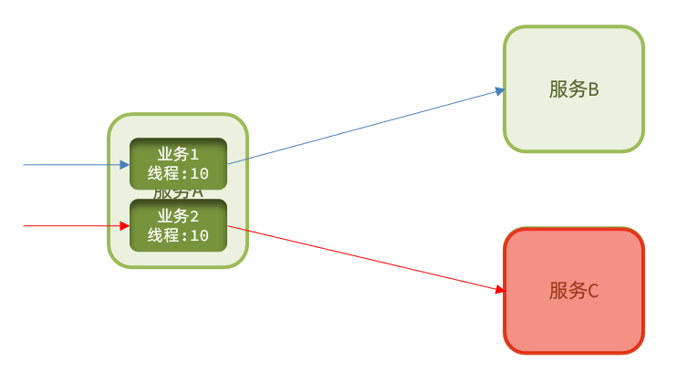

# 1	概述

## 1.1	服务架构的演变

##### 单体架构

将业务的所有功能集中在一个项目中开发，打成一个包部署。

###### 优点

- 架构简单
- 部署成本低

###### 缺点

- 耦合度高（维护困难、升级困难）

###### 适用场景

适合小型项目。

 

##### 分布式架构

根据业务功能对系统做拆分，每个业务功能模块作为独立项目开发，称为一个服务。

###### 优点

- 降低服务耦合
- 有利于服务升级和拓展

###### 缺点

- 服务调用关系错综复杂

###### 适用场景

适合大型互联网项目。

###### 分布式架构存在的问题

分布式架构虽然降低了服务耦合，但是服务拆分时也有很多问题需要思考：

- 服务拆分的粒度如何界定？
- 服务之间如何调用？
- 服务的调用关系如何管理？

为此，人们需要制定一套行之有效的标准来约束分布式架构。

 

---

     
     
     
     
     

## 1.2	微服务架构

##### 微服务架构的特征

- **单一职责**：微服务拆分粒度更小，每一个服务都对应唯一的业务能力，做到单一职责。
- **自治**：团队独立、技术独立、数据独立，独立部署和交付。
- **面向服务**：服务提供统一标准的接口，与语言和技术无关。
- **隔离性强**：服务调用做好隔离、容错、降级，避免出现级联问题。

 

##### 微服务架构的本质

微服务的上述特性其实是在 **给分布式架构制定一个标准，进一步降低服务之间的耦合度，提供服务的独立性和灵活性。做到高内聚，低耦合**。因此，可以认为 **微服务** 是一种经过良好架构设计的 **分布式架构方案** 。

 

##### 优缺点

- **优点**：与一般的分布式架构相比拆分粒度更小、服务更独立、耦合度更低。
- **缺点**：架构非常复杂，运维、监控、部署难度提高。

 

----

     
     
     
     
     

## 1.3	微服务技术栈与 Spring Cloud

##### 完整的微服务技术栈示意图

 

##### 完整的微服务技术栈可分为

 

##### Spring Cloud

微服务作为一种分布式架构方案，需要具体的技术栈落地实现。全球的互联网公司都在积极尝试自己的微服务落地方案。其中在 Java 领域最引人注目的就是 Spring Cloud 提供的方案了。

Spring Cloud 是微服务架构的 **一站式解决方案**，集成了各种优秀微服务功能组件，并基于SpringBoot实现了这些组件的自动装配，从而提供了良好的 **开箱即用** 体验，是目前国内使用最广泛的微服务框架。

###### 官网地址

https://spring.io/projects/spring-cloud

###### 常见的组件包括

###### Spring Cloud 与 Spring Boot 的兼容关系

Spring Cloud 底层依赖于 Spring Boot，并且版本的兼容关系：

| Release Train                                                | Boot Version                          |
| :----------------------------------------------------------- | :------------------------------------ |
| [2020.0.x](https://github.com/spring-cloud/spring-cloud-release/wiki/Spring-Cloud-2020.0-Release-Notes) aka Ilford | 2.4.x, 2.5.x (Starting with 2020.0.3) |
| [Hoxton](https://github.com/spring-cloud/spring-cloud-release/wiki/Spring-Cloud-Hoxton-Release-Notes) | 2.2.x, 2.3.x (Starting with SR5)      |
| [Greenwich](https://github.com/spring-projects/spring-cloud/wiki/Spring-Cloud-Greenwich-Release-Notes) | 2.1.x                                 |
| [Finchley](https://github.com/spring-projects/spring-cloud/wiki/Spring-Cloud-Finchley-Release-Notes) | 2.0.x                                 |
| [Edgware](https://github.com/spring-projects/spring-cloud/wiki/Spring-Cloud-Edgware-Release-Notes) | 1.5.x                                 |
| [Dalston](https://github.com/spring-projects/spring-cloud/wiki/Spring-Cloud-Dalston-Release-Notes) | 1.5.x                                 |

 

##### Spring Cloud Alibaba

Spring Cloud Alibaba 是阿里巴巴提供的微服务开发一站式解决方案，是阿里巴巴开源中间件与 Spring Cloud 体系的融合。

 

##### 各种微服务技术框架之间的对比

|                | **Dubbo**           | **Spring Cloud**           | **Spring Cloud Alibaba**   |
| -------------- | ------------------- | -------------------------- | -------------------------- |
| 注册中心       | zookeeper、Redis    | Eureka、Consul             | Nacos、Eureka              |
| 服务远程调用   | Dubbo协议           | Feign（http协议）          | Dubbo、Feign               |
| 配置中心       | 无                  | Spring Cloud Config        | Spring Cloud Config、Nacos |
| 服务网关       | 无                  | Spring Cloud Gateway、Zuul | Spring Cloud Gateway、Zuul |
| 服务监控和保护 | dubbo-admin，功能弱 | Hystix                     | Sentinel                   |

 

##### 企业中常见的几种微服务技术框架

###### Spring Cloud + Feign

- 使用 Spring Cloud 技术栈
- 服务接口采用 Restful 风格
- 服务调用采用Feign方式

###### Spring Cloud Alibaba + Feign

- 使用 Spring Cloud Alibaba 技术栈
- 服务接口采用 Restful 风格
- 服务调用采用 Feign 方式

###### Spring Cloud Alibaba + Dubbo

- 使用 Spring Cloud Alibaba技术栈
- 服务接口采用 Dubbo 协议标准
- 服务调用采用 Dubbo 方式

###### Dubbo原始模式

- 基于 Dubbo 老旧技术体系
- 服务接口采用 Dubbo 协议标准
- 服务调用采用 Dubbo 方式

 

---

     
     
     
     
     

## 1.4	微服务保护

##### 服务雪崩

微服务中，服务间调用关系错综复杂，一个微服务往往依赖于多个其它微服务。服务雪崩就是**在微服务之间相互调用的过程中，因为调用链中的一个服务故障，引起整个链路都无法访问的情况**。

如果一个服务提供者发生了故障，依赖于该服务的部分业务也会被阻塞。此时，其它业务似乎不受影响。但是，阻塞业务的请求不会得到响应，**服务器的这个线程不会释放**，随着越来越多的用户请求到来，越来越多的线程会阻塞。服务器支持的线程和并发数有限，请求一直阻塞，会导致服务器资源耗尽，从而导致所有其它服务都不可用，那么当前服务也就不可用了。依赖于当前服务的其它服务随着时间的推移，最终也都会变的不可用，形成 **级联失败**，雪崩就发生了：

 

##### 解决雪崩问题的常见方式

解决雪崩问题的常见方式有四种：

1. 超时处理
2. 仓壁模式
3. 断路器
4. 限流

###### 超时处理

设定超时时间，请求超过一定时间没有响应就返回错误信息，不会无休止等待。

###### 仓壁模式

仓壁模式来源于船舱的设计。船舱都会被隔板分离为多个独立空间，当船体破损时，只会导致部分空间进入，将故障控制在一定范围内，避免整个船体都被淹没。

与此类似，我们可以限定每个业务能使用的线程数，避免耗尽整个服务器的资源，因此也叫线程隔离。

######  断路器

由 **断路器** 统计业务执行的异常比例，如果超出阈值则会 **熔断** 该业务，拦截访问该业务的一切请求。当发现访问服务的请求异常比例过高时，认为服务有导致雪崩的风险，会拦截访问服务的一切请求，形成熔断。

###### 限流

限制业务访问的 QPS，避免服务因流量的突增而故障。

注意，在解决服务雪崩的四种方案中，限流是避免服务因突发的流量而发生故障，是对微服务雪崩问题的 **预防**。

 

##### 服务保护技术对比

SpringCloud 支持多种服务保护技术：

- [Netfix Hystrix](https://github.com/Netflix/Hystrix)
- [Sentinel](https://github.com/alibaba/Sentinel)
- [Resilience4J](https://github.com/resilience4j/resilience4j)

早期比较流行的是 Hystrix 框架，但目前国内实用最广泛的还是阿里巴巴的 Sentinel 框架，这里我们做下对比：

|                | Sentinel                                       | *Hystrix                      |
| -------------- | ---------------------------------------------- | ----------------------------- |
| 隔离策略       | 信号量隔离                                     | 线程池隔离/信号量隔离         |
| 熔断降级策略   | 基于慢调用比例或异常比例                       | 基于失败比率                  |
| 实时指标实现   | 滑动窗口                                       | 滑动窗口（基于 RxJava）       |
| 规则配置       | 支持多种数据源                                 | 支持多种数据源                |
| 扩展性         | 多个扩展点                                     | 插件的形式                    |
| 基于注解的支持 | 支持                                           | 支持                          |
| 限流           | 基于 QPS，支持基于调用关系的限流               | 有限的支持                    |
| 流量整形       | 支持慢启动、匀速排队模式                       | 不支持                        |
| 系统自适应保护 | 支持                                           | 不支持                        |
| 控制台         | 开箱即用，可配置规则、查看秒级监控、机器发现等 | 不完善                        |
| 常见框架的适配 | Servlet、Spring Cloud、Dubbo、gRPC  等         | Servlet、Spring Cloud Netflix |

 

-----

     
     
     
     
     

## 1.5	分布式事务

##### 事务的 ACID 原则

- **原子性（Atomicity）**：事务中的所有操作，要么全部成功，要么全部失败。
- **一致性（Consistency）**：要保证数据库内部完整性约束、声明性约束。
- **隔离性（Isolation）**：对同一资源操作的事务不能同时发生。
- **持久性（Durability）**：对数据库做的一切修改将永久保存，不管是否出现故障。

 

##### CAP 定理

1998年，加州大学的计算机科学家 Eric Brewer 提出，分布式系统有三个指标：

- Consistency（一致性）：用户访问分布式系统中的任意节点，得到的数据必须一致。
- Availability（可用性）：用户访问集群中的任意健康节点，必须能得到响应，而不是超时或拒绝
- Partition tolerance （分区容错性）：因为网络故障或其它原因导致分布式系统中的部分节点与其它节点失去连接，形成独立分区。此时，，整个系统也要持续对外提供服务。

**理论上，分布式系统无法同时满足这三个指标**。分布式系统节点通过网络连接，一定会出现分区问题（P）。•当分区出现时，系统的一致性（C）和可用性（A）就无法同时满足。这个结论就叫做 CAP 定理。

 

##### BASE 理论

BASE 理论是对 CAP 的一种解决思路，包含三个思想：

- **Basically Available** **（基本可用）**：分布式系统在出现故障时，允许损失部分可用性，即保证核心可用。
- **Soft State（软状态）：**在一定时间内，允许出现中间状态，比如临时的不一致状态。
- **Eventually Consistent（最终一致性）**：虽然无法保证强一致性，但是在软状态结束后，最终达到数据一致。

 

##### 解决分布式事务问题

分布式事务最大的问题是各个子事务的一致性问题，因此可以借鉴 CAP 定理和 BASE 理论：

- **AP模式**：各子事务分别执行和提交，允许出现结果不一致，然后采用弥补措施恢复数据即可，**实现最终一致**。
- **CP模式**：各个子事务执行后互相等待，同时提交，同时回滚，达成 **强一致**。但事务等待过程中，**处于弱可用状态**。

 

##### 分布式事务模型

解决分布式事务，**各个子系统之间必须能感知到彼此的事务状态**，才能保证状态一致，因此需要一个事务协调者来协调每一个事务的参与者，即 **子系统事务**。

子系统事务，又称为分支事务；有关联的各个分支事务在一起称为 **全局事务**。

 

---

     
     
     
     
     

## 1.6	分布式缓存

---

     
     
     
     
     

## 1.7	微服务技术组件

##### 注册中心

###### 服务调用时会出现的问题

- 服务消费者该如何获取服务提供者的地址信息？
- 如果有多个服务提供者，消费者该如何选择？
- 消费者如何得知服务提供者的健康状态？

###### 解决方案

###### 落地技术

Eureka、Dubbo

 

---

     
     
     
     
     

