# 5	Nacos 注册中心

## 5.1	Nacos 概述

##### Nacos 简介

Nacos ，是由阿里巴巴出品的 Spring Cloud Alibaba 的注册中心组件。相比 Eureka 功能更加丰富，在国内受欢迎程度较高。Nacos 是Spring Cloud Alibaba的组件，而 Spring Cloud Alibaba 也遵循 Spring Cloud 中定义的服务注册、服务发现规范。因此使用 Nacos 和使用 Eureka 对于微服务来说，并没有太大区别。

相对于 Spring Cloud Eureka 来说，Nacos 更强大。Nacos = Spring Cloud Eureka + Spring Cloud Config。Nacos 可以与 Spring, Spring Boot, Spring Cloud 集成，并能代替 Spring Cloud Eureka, Spring Cloud Config。

通过 Nacos Server 和 spring-cloud-starter-alibaba-nacos-discovery 可以实现服务的注册与发现。

<br>

##### Nacos 与 Eureka 之间的异同

###### 共同点

- 都支持服务注册和服务拉取；
- 都支持服务提供者心跳方式做健康检测。

###### 区别

- Nacos 支持服务端主动检测提供者状态：临时实例采用心跳模式，非临时实例采用主动检测模式；
- 临时实例心跳不正常会被剔除，非临时实例则不会被剔除；
- Nacos 支持服务列表变更的消息推送模式，服务列表更新更及时；
- Nacos 集群默认采用 AP 方式，当集群中存在非临时实例时，采用 CP 模式；Eureka 采用 AP 方式。

<br>

##### Nacos 的功能

Nacos 是以服务为主要服务对象的中间件，Nacos支持所有主流的服务发现、配置和管理，主要提供以下四大功能：

- 服务发现和服务健康监测
- 动态配置服务
- 动态DNS服务
- 服务及其元数据管理

<br>

##### Nacos 结构图

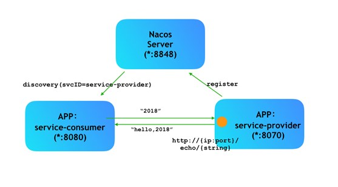

##### Nacos 官方文档

https://nacos.io/zh-cn/

<br>

##### Nacos GitHub 主页

https://github.com/alibaba/nacos

<br>

##### Nacos GitHub Release 下载页

https://github.com/alibaba/nacos/releases

<br>

---

<div STYLE="page-break-after: always;">
    <br>
    <br>
    <br>
    <br>
    <br>
</div>

## 5.2	安装 Nacos

##### Windows 平台

###### 下载与解压

1. 在 https://github.com/alibaba/nacos/releases 选择适当的版本下载
2. 将下载后的安装包解压到任意非中文目录下

###### 目录结构

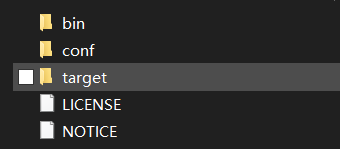

- **bin**：启动脚本
- **conf**：配置文件

###### 端口配置

Nacos 的默认端口是 8848，如果你电脑上的其它进程占用了 8848 端口，请先尝试关闭该进程。

如果需要修改 Nacos 的默认端口，可以在 conf/application.properties  文件中进行修改。

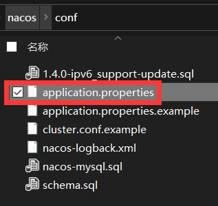

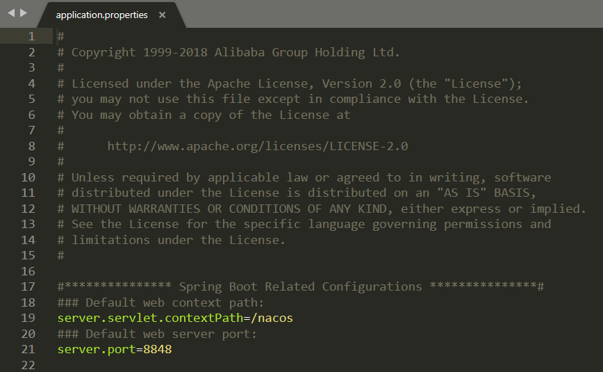

###### 启动

进入 bin 目录，在 bin 目录下打开 cmd 窗口，输入：

```shell
#以单应用模式启动 Nacos
startup.cmd -m standalone
```

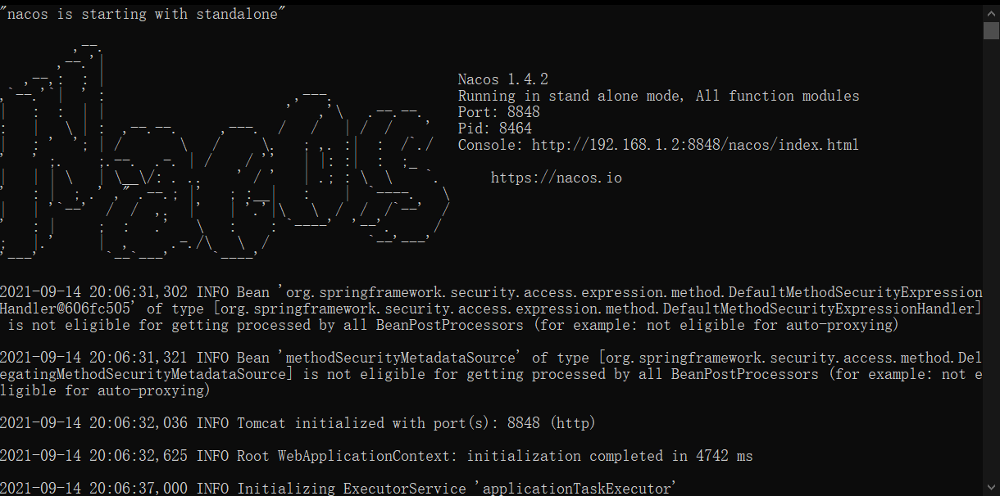

###### 访问

在浏览器重输入地址 http://127.0.0.1:8848/nacos：

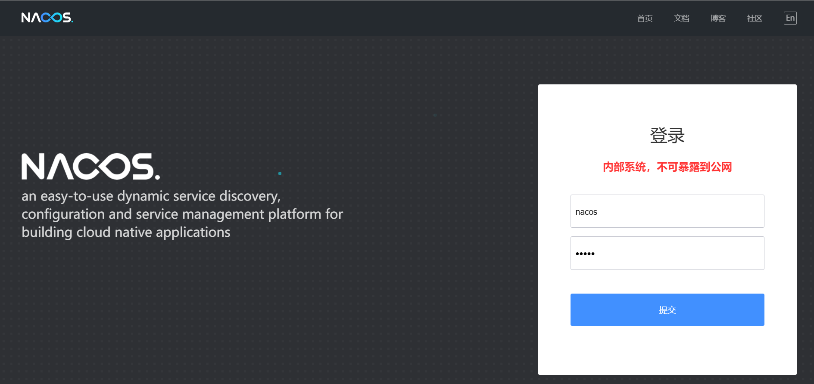

默认账号-密码为：`nacos-nacos`。

<br>

---

<div STYLE="page-break-after: always;">
    <br>
    <br>
    <br>
    <br>
    <br>
</div>

## 5.3	在项目中引入 Nacos

##### 步骤

1. 在项目父工程的 pom.xml 文件中引入 Spring Cloud Alibaba 依赖：

   ```xml
   <dependency>
       <groupId>com.alibaba.cloud</groupId>
       <artifactId>spring-cloud-alibaba-dependencies</artifactId>
       <version>2.2.6.RELEASE</version>
       <type>pom</type>
       <scope>import</scope>
   </dependency>
   ```

2. 在微服务模块的 pom.xml 文件中引入 nacos-discovery：

   ```xml
   <!-- 引入这段依赖之前必须先将 Eureka 依赖  -->
   <dependency>
       <groupId>com.alibaba.cloud</groupId>
       <artifactId>spring-cloud-starter-alibaba-nacos-discovery</artifactId>
   </dependency>
   ```

3. 在微服务模块的 application.yml 文件中添加 nacos 配置

   ```php
   spring:
     cloud:
       nacos:
         server-addr: localhost:8848
   ```

4. 重启微服务

   <br>

---

<div STYLE="page-break-after: always;">
    <br>
    <br>
    <br>
    <br>
    <br>
</div>

## 5.4	Nacos 服务分级存储模型

##### 服务分级存储模型

一个 **服务** 可以有多个 **实例**，假如这些实例分布于全国各地的不同机房，Nacos 可以将同一机房内的实例划分为一个**集群**。


<br>

##### 微服务互相访问时应尽可能访问同集群实例

微服务互相访问时，应该尽可能访问同集群实例，因为本地访问速度更快。当本集群内不可用时，才访问其它集群。


<br>

##### 为微服务模块配置集群

1. 修改微服务模块的 application.yml 文件，添加集群配置：

   ```yaml
   spring:
     cloud:
       nacos:
         server-addr: localhost:8848
         discovery:
           cluster-name: HZ # 集群名称
   ```

2. 创建一个新的实例，添加属性：

   ```
   -Dserver.port=8084 -Dspring.cloud.nacos.discovery.cluster-name=SH
   ```

3. 启动所有实例后查看控制台：

   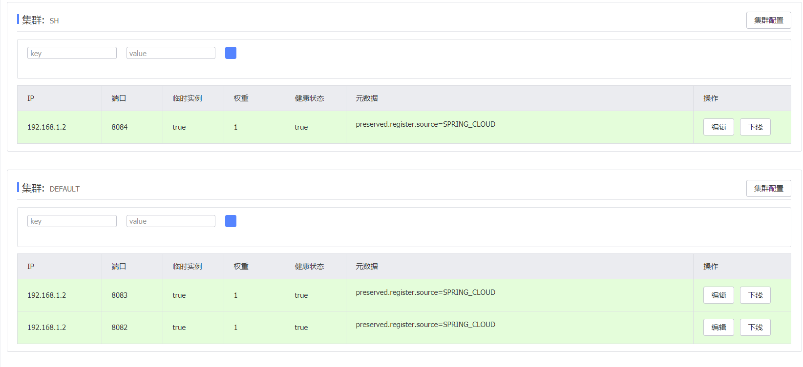

<br>

##### 设置同集群优先的负载均衡

默认的`ZoneAvoidanceRule`并不能实现根据同集群优先来实现负载均衡。因此 Nacos 提供了一个 `NacosRule` 的实现，可以优先从同集群中挑选实例。

###### 步骤

1. 为微服务模块配置集群信息

2. 修改微服务模块的 application.ym l文件，修改负载均衡规则：

   ```php
   userservice:
     ribbon:
       NFLoadBalancerRuleClassName: com.alibaba.cloud.nacos.ribbon.NacosRule # 负载均衡规则 
   ```

<br>

---

<div STYLE="page-break-after: always;">
    <br>
    <br>
    <br>
    <br>
    <br>
</div>

## 5.5	权重配置

##### 能者多劳

实际部署中会出现这样的场景——服务器设备性能有差异，部分实例所在机器性能较好，另一些较差，我们希望性能好的机器承担更多的用户请求。但默认情况下 NacosRule 是同集群内随机挑选，不会考虑机器的性能问题。

因此，Nacos 提供了权重配置来控制访问频率，权重越大则访问频率越高。

<br>

##### 修改实例权重

1. 通过 Nacos 控制台的服务列表查找对应的服务，进入详情页面。

   

2. 选择需要修改的实例，点击编辑按钮。

   

3. 对权重进行编辑。

   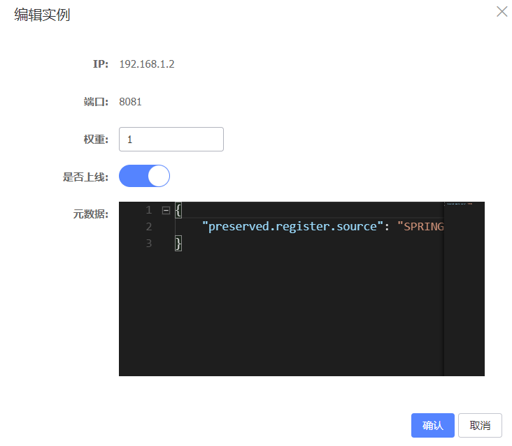

<br>

##### 权重为 0

如果权重修改为0，则该实例永远不会被访问。

<br>

---

<div STYLE="page-break-after: always;">
    <br>
    <br>
    <br>
    <br>
    <br>
</div>

## 5.6	环境隔离

##### Nacos 的 namespace

Nacos 提供了 namespace 来实现环境隔离功能。

- nacos 中可以有多个 namespace

- namespace 下可以有group、service等

  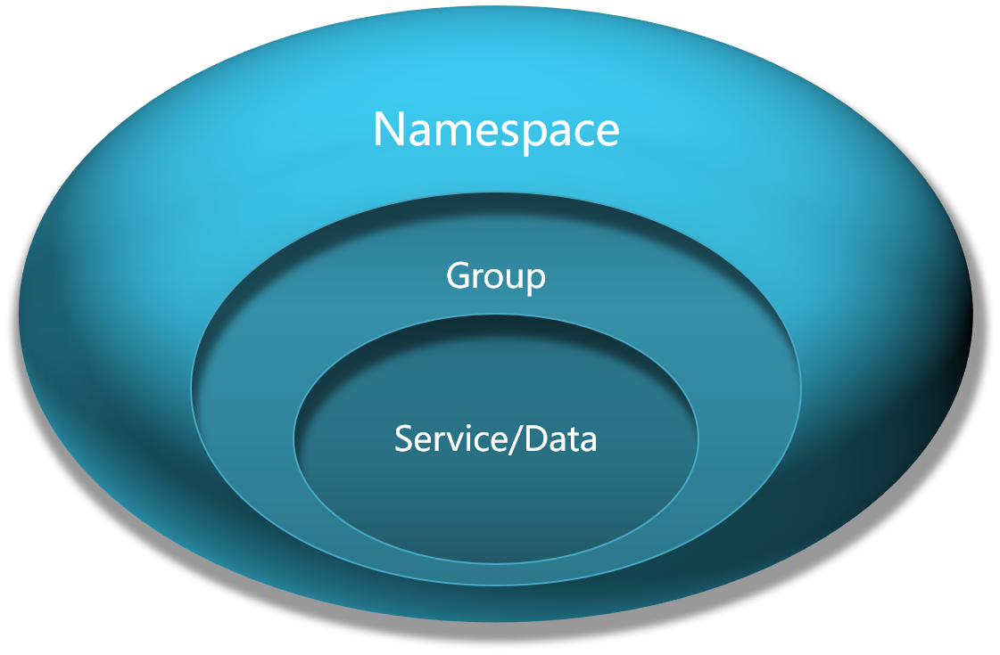

- **不同 namespace 之间相互隔离**，即不同 namespace 的服务互相不可见.

- 默认情况下，所有 service、data、group 都在同一个namespace，名为 public


<br>

##### 创建 namespace

1. 在 Nacos 控制台的命名空间一栏中选择新建命名空间。

   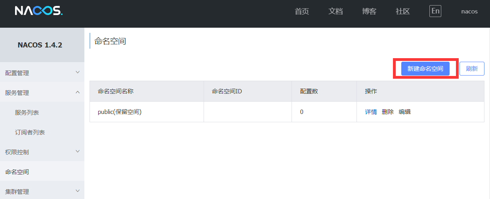

2. 输入必要信息。

   

3. 创建成功。

   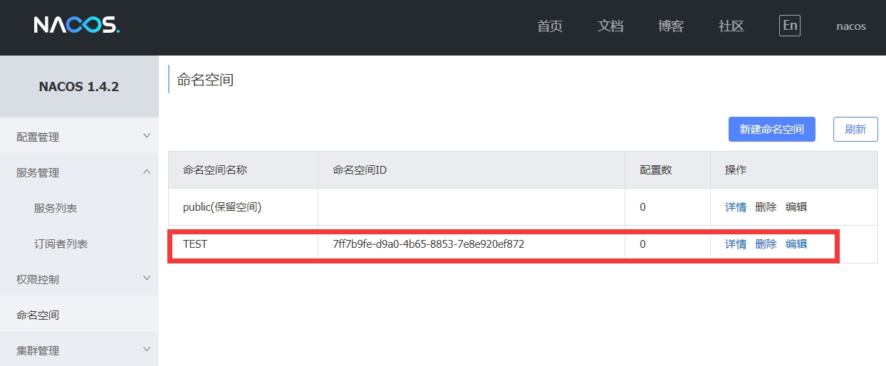

<br>

##### 为微服务配置 namespace

1. 修改微服务 的 application.yml 文件：

   ```yaml
   spring:
     cloud:
       nacos:
         server-addr: localhost:8848
         discovery:
           cluster-name: HZ
           namespace: 7ff7b9fe-d9a0-4b65-8853-7e8e920ef872 # 命名空间，填写自动生成或设置的命名空间 ID
   ```

2. 之后重启微服务。

----

<div STYLE="page-break-after: always;">
    <br>
    <br>
    <br>
    <br>
    <br>
</div>

## 5.7	临时实例与永久实例

##### Nacos 的两种服务实例类型

- **临时实例**：如果实例宕机超过一定时间，会从服务列表剔除，**默认的类型**。
- **永久实例（非临时实例）**：如果实例宕机，不会从服务列表剔除。

<br>

##### 配置一个服务实例为永久实例

```ymal
spring:
  cloud:
    nacos:
      discovery:
        ephemeral: false # 设置为永久实例
```

<br>

---

<div STYLE="page-break-after: always;">
    <br>
    <br>
    <br>
    <br>
    <br>
</div>

## 5.8	Nacos 配置管理

### 5.8.1	Nacos 配置管理基础

#####  统一配置管理

当微服务部署的实例越来越多，达到数十、数百时，逐个修改微服务配置就会让人抓狂，而且很容易出错。我们需要一种统一配置管理方案，可以集中管理所有实例的配置。

Spring Cloud 框架使用 Spring Cloud Config 进行配置管理，但是 Nacos 不仅有注册中心的功能，同可以进行配置管理。Nacos 一方面可以将配置集中管理，另一方面可以在配置变更时，及时通知微服务，实现配置的热更新。


<br>

##### nacos 统一配置管理的原理

微服务要拉取 nacos 中管理的配置，并且与本地的 application.yml 配置合并，才能完成项目启动。但如果尚未读取 application.yml，又如何得知 nacos 地址呢？

为此，spring 引入了一种新的配置文件：bootstrap.yaml 文件，会在 application.yml 之前被读取，流程如下：


<br>

##### 如何在 nacos 中添加配置文件

1. 在 nacos 控制台的配置列表中添加配置文件

   

2. 在弹出的表单中，填写配置信息：


###### 📌注意

 Data IDs 一栏填写的配置文件 ID 的格式为 [服务名称]-[profile].[后缀名]，其中的 -[profile] 表示环境[^5.8.1-1]

<br>

##### 如何从微服务拉取配置

1. 首先，在微服务子模块中，引入 nacos-config 的客户端依赖

   ```xml
   <!--nacos配置管理依赖-->
   <dependency>
       <groupId>com.alibaba.cloud</groupId>
       <artifactId>spring-cloud-starter-alibaba-nacos-config</artifactId>
   </dependency>
   ```

2. 在微服务子模块的resource目录下添加 bootstrap.yaml 文件，内容如下：

   ```yaml
   spring:
     application:
       name: userservice # 服务名称
     profiles:
       active: dev #开发环境，这里是dev 
     cloud:
       nacos:
         server-addr: localhost:8848 # Nacos地址
         config:
           file-extension: yaml # 文件后缀名
   ```

   这里会根据 `spring.cloud.nacos.server-addr` 获取 nacos 地址，再根据

   `${spring.application.name}-${spring.profiles.active}.${spring.cloud.nacos.config.file-extension}` 作为文件 id[^5.8.1-2]，来读取配置。此处读取的配置即为 `userservice-dev.yaml`。

   

3. 测试，在微服务中的 Controller 中添加业务逻辑，读取配置：

   ```java
   @Slf4j
   @RestController
   @RequestMapping("/user")
   public class UserController {
   
   	......
   
       //获取配置
       @Value("${pattern.dateformat}")
       private String dateformat;
       
       //根据获取的时间格式输出当前日期
       @GetMapping("now")
       public String now(){
           return LocalDateTime.now().format(DateTimeFormatter.ofPattern(dateformat));
       }
       
       ......
       
   }
   ```

<br>

##### 📌什么配置需要由 Nacos 管理？

项目的核心配置、需要热更新的配置才有由 nacos 管理的必要。基本不会变更的一些配置还是保存在微服务本地比较好。

<br>

----

[^5.8.1-1]: dev（开发）/test（测试）/uat（验收）/prod（生产）。
[^5.8.1-2]: 即 Nacos 控制台配置列表中配置的 Data ID

<div STYLE="page-break-after: always;">
    <br>
    <br>
    <br>
    <br>
    <br>
</div>

### 5.8.2	配置热更新

##### 使用 Nacos 管理配置的最终目的

使用 Nacos 管理配置的最终目的是，修改 nacos 中的配置后，微服务中无需重启即可让配置生效，也就是 **配置热更新**。

<br>

##### 方式一 —— 使用 @RefreshScope 与 @value 

1. 声明一个字符串变量，并使用 `@Value` 赋值

2. 在变量所在类上添加 `@RefreshScope`

   ```java
   @Slf4j
   @RestController//添加 @RefreshScope
   @RequestMapping("/user")
   public class UserController {
   
   	......
   
   	@Value("${pattern.dateformat}")
   	private String dateformat;
   
       //根据获取的时间格式输出当前日期
       @GetMapping("now")
       public String now(){
           return LocalDateTime.now().format(DateTimeFormatter.ofPattern(dateformat));
       }
   
   	......
   }
   ```

3. 测试。

<br>

##### 方式二 —— 使用 PatternProperties 类

1. 在微服务中，添加一个类[^5.8.2-1]

   ```java
   package cn.itcast.user.config;
   
   import lombok.Data;
   import org.springframework.boot.context.properties.ConfigurationProperties;
   import org.springframework.stereotype.Component;
   
   @Component
   @Data
   @ConfigurationProperties(prefix = "pattern")
   public class PatternProperties {
       private String dateformat;
   }
   ```

2. 自动注入 PatternProperties，并通过 `patternProperties.getDateformat()` 获取具体配置

   ```java
   @Slf4j
   @RequestMapping("/user")
   public class UserController {
   
   	......
   
   	@AutoWired
       private PatternProperties patternProperties;
   
       //根据获取的时间格式输出当前日期
       @GetMapping("now")
       public String now(){
           return LocalDateTime.now().format(DateTimeFormatter.ofPattern(patternProperties.getDateformat()));
       }
   
   	......
   }
   ```

3. 测试。

<br>

---

[^5.8.2-1]: 一般是配置类。

<div STYLE="page-break-after: always;">
    <br>
    <br>
    <br>
    <br>
    <br>
</div>

### 5.8.3	配置共享

##### 配置共享的原理

微服务启动时，会去 nacos 读取多个配置文件，例如：

- `[spring.application.name]-[spring.profiles.active].yaml`，例如：userservice-dev.yaml；

- `[spring.application.name].yaml`，例如：userservice.yaml。

因为 `[spring.application.name].yaml` 不包含环境，因此可以被多个环境共享。

<br>

##### 如何添加环境共享配置

1. 在 nacos 中添加一个 userservice.yaml 文件：


2. 在微服务中，修改 PatternProperties 类，读取新添加的属性:

   ```java
   @Component
   @Data
   @ConfigurationProperties(prefix = "pattern")
   public class PatternProperties {
       private String dateformat;
       private String envSharedValue;
   }
   ```

3. 修改 Controller，添加一个方法用于测试：

   ```java
       //根据获取的时间格式输出当前日期
       @GetMapping("prop")
       public String prop(){
           return patternProperties;
       }
   ```

4. 开启一个新的微服务实例，改变其 profile 值


5. 测试，分别访问两个实例的 `prop()` 方法。

<br>

---

<div STYLE="page-break-after: always;">
    <br>
    <br>
    <br>
    <br>
    <br>
</div>

### 5.8.4	配置共享的优先级

##### 不同配置相同属性之间的优先级

当 nacos、服务本地同时出现相同属性时，优先级有高低之分：


<br>

---

<div STYLE="page-break-after: always;">
    <br>
    <br>
    <br>
    <br>
    <br>
</div>

## 5.9	搭建 Nacos 集群

##### 生产环境下需要将 Nacos 部署为集群状态

为了保证健壮性，Nacos 在生产环境下一定要部署为集群状态。

<br>

##### Nacos 集群结构图


图示中包含 3 个 nacos 节点，然后由一个负载均衡器代理 3 个 Nacos。这里负载均衡器可以使用 nginx。

我们计划的集群结构：


<br>

##### 搭建集群

###### 基本步骤

1. 搭建数据库，初始化数据库表结构
2. 下载 nacos 安装包
3. 配置 nacos
4. 启动 nacos 集群
5. nginx 反向代理

###### 初始化数据库

Nacos 默认数据存储在内嵌数据库 Derby 中，不属于生产可用的数据库。官方推荐的最佳实践是使用带有主从的高可用数据库集群[^5.9-1]。此处使用单体数据库进行演示。

新建一个数据库，命名为 nacos，执行查询：

```sql
CREATE TABLE `config_info` (
  `id` bigint(20) NOT NULL AUTO_INCREMENT COMMENT 'id',
  `data_id` varchar(255) NOT NULL COMMENT 'data_id',
  `group_id` varchar(255) DEFAULT NULL,
  `content` longtext NOT NULL COMMENT 'content',
  `md5` varchar(32) DEFAULT NULL COMMENT 'md5',
  `gmt_create` datetime NOT NULL DEFAULT CURRENT_TIMESTAMP COMMENT '创建时间',
  `gmt_modified` datetime NOT NULL DEFAULT CURRENT_TIMESTAMP COMMENT '修改时间',
  `src_user` text COMMENT 'source user',
  `src_ip` varchar(50) DEFAULT NULL COMMENT 'source ip',
  `app_name` varchar(128) DEFAULT NULL,
  `tenant_id` varchar(128) DEFAULT '' COMMENT '租户字段',
  `c_desc` varchar(256) DEFAULT NULL,
  `c_use` varchar(64) DEFAULT NULL,
  `effect` varchar(64) DEFAULT NULL,
  `type` varchar(64) DEFAULT NULL,
  `c_schema` text,
  PRIMARY KEY (`id`),
  UNIQUE KEY `uk_configinfo_datagrouptenant` (`data_id`,`group_id`,`tenant_id`)
) ENGINE=InnoDB DEFAULT CHARSET=utf8 COLLATE=utf8_bin COMMENT='config_info';

/******************************************/
/*   数据库全名 = nacos_config   */
/*   表名称 = config_info_aggr   */
/******************************************/
CREATE TABLE `config_info_aggr` (
  `id` bigint(20) NOT NULL AUTO_INCREMENT COMMENT 'id',
  `data_id` varchar(255) NOT NULL COMMENT 'data_id',
  `group_id` varchar(255) NOT NULL COMMENT 'group_id',
  `datum_id` varchar(255) NOT NULL COMMENT 'datum_id',
  `content` longtext NOT NULL COMMENT '内容',
  `gmt_modified` datetime NOT NULL COMMENT '修改时间',
  `app_name` varchar(128) DEFAULT NULL,
  `tenant_id` varchar(128) DEFAULT '' COMMENT '租户字段',
  PRIMARY KEY (`id`),
  UNIQUE KEY `uk_configinfoaggr_datagrouptenantdatum` (`data_id`,`group_id`,`tenant_id`,`datum_id`)
) ENGINE=InnoDB DEFAULT CHARSET=utf8 COLLATE=utf8_bin COMMENT='增加租户字段';


/******************************************/
/*   数据库全名 = nacos_config   */
/*   表名称 = config_info_beta   */
/******************************************/
CREATE TABLE `config_info_beta` (
  `id` bigint(20) NOT NULL AUTO_INCREMENT COMMENT 'id',
  `data_id` varchar(255) NOT NULL COMMENT 'data_id',
  `group_id` varchar(128) NOT NULL COMMENT 'group_id',
  `app_name` varchar(128) DEFAULT NULL COMMENT 'app_name',
  `content` longtext NOT NULL COMMENT 'content',
  `beta_ips` varchar(1024) DEFAULT NULL COMMENT 'betaIps',
  `md5` varchar(32) DEFAULT NULL COMMENT 'md5',
  `gmt_create` datetime NOT NULL DEFAULT CURRENT_TIMESTAMP COMMENT '创建时间',
  `gmt_modified` datetime NOT NULL DEFAULT CURRENT_TIMESTAMP COMMENT '修改时间',
  `src_user` text COMMENT 'source user',
  `src_ip` varchar(50) DEFAULT NULL COMMENT 'source ip',
  `tenant_id` varchar(128) DEFAULT '' COMMENT '租户字段',
  PRIMARY KEY (`id`),
  UNIQUE KEY `uk_configinfobeta_datagrouptenant` (`data_id`,`group_id`,`tenant_id`)
) ENGINE=InnoDB DEFAULT CHARSET=utf8 COLLATE=utf8_bin COMMENT='config_info_beta';

/******************************************/
/*   数据库全名 = nacos_config   */
/*   表名称 = config_info_tag   */
/******************************************/
CREATE TABLE `config_info_tag` (
  `id` bigint(20) NOT NULL AUTO_INCREMENT COMMENT 'id',
  `data_id` varchar(255) NOT NULL COMMENT 'data_id',
  `group_id` varchar(128) NOT NULL COMMENT 'group_id',
  `tenant_id` varchar(128) DEFAULT '' COMMENT 'tenant_id',
  `tag_id` varchar(128) NOT NULL COMMENT 'tag_id',
  `app_name` varchar(128) DEFAULT NULL COMMENT 'app_name',
  `content` longtext NOT NULL COMMENT 'content',
  `md5` varchar(32) DEFAULT NULL COMMENT 'md5',
  `gmt_create` datetime NOT NULL DEFAULT CURRENT_TIMESTAMP COMMENT '创建时间',
  `gmt_modified` datetime NOT NULL DEFAULT CURRENT_TIMESTAMP COMMENT '修改时间',
  `src_user` text COMMENT 'source user',
  `src_ip` varchar(50) DEFAULT NULL COMMENT 'source ip',
  PRIMARY KEY (`id`),
  UNIQUE KEY `uk_configinfotag_datagrouptenanttag` (`data_id`,`group_id`,`tenant_id`,`tag_id`)
) ENGINE=InnoDB DEFAULT CHARSET=utf8 COLLATE=utf8_bin COMMENT='config_info_tag';

/******************************************/
/*   数据库全名 = nacos_config   */
/*   表名称 = config_tags_relation   */
/******************************************/
CREATE TABLE `config_tags_relation` (
  `id` bigint(20) NOT NULL COMMENT 'id',
  `tag_name` varchar(128) NOT NULL COMMENT 'tag_name',
  `tag_type` varchar(64) DEFAULT NULL COMMENT 'tag_type',
  `data_id` varchar(255) NOT NULL COMMENT 'data_id',
  `group_id` varchar(128) NOT NULL COMMENT 'group_id',
  `tenant_id` varchar(128) DEFAULT '' COMMENT 'tenant_id',
  `nid` bigint(20) NOT NULL AUTO_INCREMENT,
  PRIMARY KEY (`nid`),
  UNIQUE KEY `uk_configtagrelation_configidtag` (`id`,`tag_name`,`tag_type`),
  KEY `idx_tenant_id` (`tenant_id`)
) ENGINE=InnoDB DEFAULT CHARSET=utf8 COLLATE=utf8_bin COMMENT='config_tag_relation';

/******************************************/
/*   数据库全名 = nacos_config   */
/*   表名称 = group_capacity   */
/******************************************/
CREATE TABLE `group_capacity` (
  `id` bigint(20) unsigned NOT NULL AUTO_INCREMENT COMMENT '主键ID',
  `group_id` varchar(128) NOT NULL DEFAULT '' COMMENT 'Group ID，空字符表示整个集群',
  `quota` int(10) unsigned NOT NULL DEFAULT '0' COMMENT '配额，0表示使用默认值',
  `usage` int(10) unsigned NOT NULL DEFAULT '0' COMMENT '使用量',
  `max_size` int(10) unsigned NOT NULL DEFAULT '0' COMMENT '单个配置大小上限，单位为字节，0表示使用默认值',
  `max_aggr_count` int(10) unsigned NOT NULL DEFAULT '0' COMMENT '聚合子配置最大个数，，0表示使用默认值',
  `max_aggr_size` int(10) unsigned NOT NULL DEFAULT '0' COMMENT '单个聚合数据的子配置大小上限，单位为字节，0表示使用默认值',
  `max_history_count` int(10) unsigned NOT NULL DEFAULT '0' COMMENT '最大变更历史数量',
  `gmt_create` datetime NOT NULL DEFAULT CURRENT_TIMESTAMP COMMENT '创建时间',
  `gmt_modified` datetime NOT NULL DEFAULT CURRENT_TIMESTAMP COMMENT '修改时间',
  PRIMARY KEY (`id`),
  UNIQUE KEY `uk_group_id` (`group_id`)
) ENGINE=InnoDB DEFAULT CHARSET=utf8 COLLATE=utf8_bin COMMENT='集群、各Group容量信息表';

/******************************************/
/*   数据库全名 = nacos_config   */
/*   表名称 = his_config_info   */
/******************************************/
CREATE TABLE `his_config_info` (
  `id` bigint(64) unsigned NOT NULL,
  `nid` bigint(20) unsigned NOT NULL AUTO_INCREMENT,
  `data_id` varchar(255) NOT NULL,
  `group_id` varchar(128) NOT NULL,
  `app_name` varchar(128) DEFAULT NULL COMMENT 'app_name',
  `content` longtext NOT NULL,
  `md5` varchar(32) DEFAULT NULL,
  `gmt_create` datetime NOT NULL DEFAULT CURRENT_TIMESTAMP,
  `gmt_modified` datetime NOT NULL DEFAULT CURRENT_TIMESTAMP,
  `src_user` text,
  `src_ip` varchar(50) DEFAULT NULL,
  `op_type` char(10) DEFAULT NULL,
  `tenant_id` varchar(128) DEFAULT '' COMMENT '租户字段',
  PRIMARY KEY (`nid`),
  KEY `idx_gmt_create` (`gmt_create`),
  KEY `idx_gmt_modified` (`gmt_modified`),
  KEY `idx_did` (`data_id`)
) ENGINE=InnoDB DEFAULT CHARSET=utf8 COLLATE=utf8_bin COMMENT='多租户改造';


/******************************************/
/*   数据库全名 = nacos_config   */
/*   表名称 = tenant_capacity   */
/******************************************/
CREATE TABLE `tenant_capacity` (
  `id` bigint(20) unsigned NOT NULL AUTO_INCREMENT COMMENT '主键ID',
  `tenant_id` varchar(128) NOT NULL DEFAULT '' COMMENT 'Tenant ID',
  `quota` int(10) unsigned NOT NULL DEFAULT '0' COMMENT '配额，0表示使用默认值',
  `usage` int(10) unsigned NOT NULL DEFAULT '0' COMMENT '使用量',
  `max_size` int(10) unsigned NOT NULL DEFAULT '0' COMMENT '单个配置大小上限，单位为字节，0表示使用默认值',
  `max_aggr_count` int(10) unsigned NOT NULL DEFAULT '0' COMMENT '聚合子配置最大个数',
  `max_aggr_size` int(10) unsigned NOT NULL DEFAULT '0' COMMENT '单个聚合数据的子配置大小上限，单位为字节，0表示使用默认值',
  `max_history_count` int(10) unsigned NOT NULL DEFAULT '0' COMMENT '最大变更历史数量',
  `gmt_create` datetime NOT NULL DEFAULT CURRENT_TIMESTAMP COMMENT '创建时间',
  `gmt_modified` datetime NOT NULL DEFAULT CURRENT_TIMESTAMP COMMENT '修改时间',
  PRIMARY KEY (`id`),
  UNIQUE KEY `uk_tenant_id` (`tenant_id`)
) ENGINE=InnoDB DEFAULT CHARSET=utf8 COLLATE=utf8_bin COMMENT='租户容量信息表';


CREATE TABLE `tenant_info` (
  `id` bigint(20) NOT NULL AUTO_INCREMENT COMMENT 'id',
  `kp` varchar(128) NOT NULL COMMENT 'kp',
  `tenant_id` varchar(128) default '' COMMENT 'tenant_id',
  `tenant_name` varchar(128) default '' COMMENT 'tenant_name',
  `tenant_desc` varchar(256) DEFAULT NULL COMMENT 'tenant_desc',
  `create_source` varchar(32) DEFAULT NULL COMMENT 'create_source',
  `gmt_create` bigint(20) NOT NULL COMMENT '创建时间',
  `gmt_modified` bigint(20) NOT NULL COMMENT '修改时间',
  PRIMARY KEY (`id`),
  UNIQUE KEY `uk_tenant_info_kptenantid` (`kp`,`tenant_id`),
  KEY `idx_tenant_id` (`tenant_id`)
) ENGINE=InnoDB DEFAULT CHARSET=utf8 COLLATE=utf8_bin COMMENT='tenant_info';

CREATE TABLE `users` (
	`username` varchar(50) NOT NULL PRIMARY KEY,
	`password` varchar(500) NOT NULL,
	`enabled` boolean NOT NULL
);

CREATE TABLE `roles` (
	`username` varchar(50) NOT NULL,
	`role` varchar(50) NOT NULL,
	UNIQUE INDEX `idx_user_role` (`username` ASC, `role` ASC) USING BTREE
);

CREATE TABLE `permissions` (
    `role` varchar(50) NOT NULL,
    `resource` varchar(255) NOT NULL,
    `action` varchar(8) NOT NULL,
    UNIQUE INDEX `uk_role_permission` (`role`,`resource`,`action`) USING BTREE
);

INSERT INTO users (username, password, enabled) VALUES ('nacos', '$2a$10$EuWPZHzz32dJN7jexM34MOeYirDdFAZm2kuWj7VEOJhhZkDrxfvUu', TRUE);

INSERT INTO roles (username, role) VALUES ('nacos', 'ROLE_ADMIN');
```

###### 下载 nacos

在官方渠道下载并解压平台对应的 Nacos。

###### 配置 Nacos

进入 nacos 的 conf 目录，修改配置文件 cluster.conf.example，重命名为 cluster.conf：


在 cluster.conf 中添加内容：

```
# 集群实例的IP地址与端口号
127.0.0.1:8845
127.0.0.1.8846
127.0.0.1.8847
```

修改配置文件 conf /application.properties，添加数据库配置：

```php
spring.datasource.platform=mysql

db.num=1

db.url.0=jdbc:mysql://127.0.0.1:3306/nacos?characterEncoding=utf8&connectTimeout=1000&socketTimeout=3000&autoReconnect=true&useUnicode=true&useSSL=false&serverTimezone=UTC
db.user.0=root
db.password.0=123
```

###### 启动

将 nacos 文件夹复制三份，分别命名为：nacos1、nacos2、nacos3[^5.9-2]，然后分别修改三个文件夹中的 application.properties，

nacos1:

```properties
server.port=8845
```

nacos2:

```properties
server.port=8846
```

nacos3:

```properties
server.port=8847
```

启动这三个 nacos 节点。

```cmd
startup.cmd
```

###### nginx 反向代理

下载并解压 nginx 压缩包到任意非中文目录下，修改 conf/nginx.conf 文件，配置如下：

```conf
upstream nacos-cluster {
    server 127.0.0.1:8845;
	server 127.0.0.1:8846;
	server 127.0.0.1:8847;
}

server {
    listen       80;
    server_name  localhost;

    location /nacos {
        proxy_pass http://nacos-cluster;
    }
}
```

修改微服务的 application.yaml 文件配置：

```conf
spring:
	cloud:
    	nacos:
        	server-addr: localhost:80
```

###### 优化

- 实际部署时，需要给做反向代理的 nginx 服务器设置一个域名，这样后续如果有服务器迁移 nacos 的客户端也无需更改配置；

- Nacos 的各个节点应该部署到多个不同服务器，做好容灾和隔离、

---

[^5.9-1]:参考高可用数据库集群搭建资料。
[^5.9-2]:部署于不同主机上则不需要重命名。

<div STYLE="page-break-after: always;">
    <br>
    <br>
    <br>
    <br>
    <br>
</div>
