# 9	Seata 分布式事务

## 9.1	概述

##### 什么是 Seata

Seata是 2019 年 1 月份蚂蚁金服和阿里巴巴共同开源的分布式事务解决方案。致力于提供高性能和简单易用的分布式事务服务，为用户打造一站式的分布式解决方案。

<br>

##### 官网地址

http://seata.io/

<br>

##### Seata 架构

Seata 事务管理中有三个重要的角色：

- **TC (Transaction Coordinator，事务协调者)  **：维护全局和分支事务的状态，协调全局事务提交或回滚。
- **TM (Transaction Manager，事务管理器) **：定义全局事务的范围、开始全局事务、提交或回滚全局事务。
- **RM (Resource Manager，资源管理器)**：管理分支事务处理的资源，与 TC 交谈以注册分支事务和报告分支事务的状态，并驱动分支事务提交或回滚。

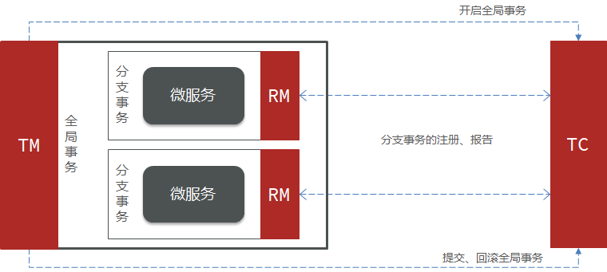

<br>

##### Seata 提供的分布式事务解决方案

Seata 提供了四种不同的分布式事务解决方案

- XA 模式：强一致性分阶段事务模式，牺牲了一定的可用性，无业务侵入。
- TCC 模式：最终一致的分阶段事务模式，有业务侵入。
- AT 模式：最终一致的分阶段事务模式，无业务侵入，也是 Seata 的默认模式
- SAGA 模式：长事务模式，有业务侵入。

<br>

##### 四种分布式事务解决方案之间的对比

|              | XA                             | AT                                           | TCC                                                          | SAGA                                                         |
| ------------ | ------------------------------ | -------------------------------------------- | ------------------------------------------------------------ | ------------------------------------------------------------ |
| **一致性**   | 强一致                         | 弱一致                                       | 弱一致                                                       | 最终一致                                                     |
| **隔离性**   | 完全隔离                       | 基于全局锁隔离                               | 基于资源预留隔离                                             | 无隔离                                                       |
| **代码侵入** | 无                             | 无                                           | 有，要编写三个接口                                           | 有，要编写状态机和补偿业务                                   |
| **性能**     | 差                             | 好                                           | 非常好                                                       | 非常好                                                       |
| **场景**     | 对一致性、隔离性有高要求的业务 | 基于关系型数据库的大多数分布式事务场景都可以 | 1.对性能要求较高的事务。 <br>2.有非关系型数据库要参与的事务。 | 1.业务流程长、业务流程多 <br/>2.参与者包含其它公司或遗留系统服务，无法提供  TCC  模式要求的三个接口 |

<br>

----

<div STYLE="page-break-after: always;">
    <br>
	<br>
	<br>
	<br>
	<br>
</div>
## 9.2	Seata 的部署与集成基础

##### 下载地址

[http](http://seata.io/zh-cn/blog/download.html)[://seata.io/zh-cn/blog/download](http://seata.io/zh-cn/blog/download.html)[.](http://seata.io/zh-cn/blog/download.html)[html](http://seata.io/zh-cn/blog/download.html)

<br>

##### 解压

下载完成后在非中文目录解压缩压缩包，其目录结构如下：


<br>

##### 修改配置

修改 conf 目录下的 registry.conf 文件，内容如下：

```properties
registry {
  # tc服务的注册中心类，这里选择nacos，也可以是eureka、zookeeper等
  type = "nacos"

  nacos {
    # seata tc 服务注册到 nacos的服务名称，可以自定义
    application = "seata-tc-server"
    serverAddr = "127.0.0.1:8848"
    group = "DEFAULT_GROUP"
    namespace = ""
    cluster = "SH"
    username = "nacos"
    password = "nacos"
  }
}

config {
  # 读取tc服务端的配置文件的方式，这里是从nacos配置中心读取，这样如果tc是集群，可以共享配置
  type = "nacos"
  # 配置nacos地址等信息
  nacos {
    serverAddr = "127.0.0.1:8848"
    namespace = ""
    group = "SEATA_GROUP"
    username = "nacos"
    password = "nacos"
    dataId = "seataServer.properties"
  }
}
```

<br>

##### 在 nacos 添加配置

特别注意，为了让 tc 服务的集群可以共享配置，我们选择了 nacos 作为统一配置中心。因此服务端配置文件 seataServer.properties 文件需要在 nacos 中配好。

格式如下：


配置内容如下：

```properties
# 数据存储方式，db代表数据库
store.mode=db
store.db.datasource=druid
store.db.dbType=mysql
store.db.driverClassName=com.mysql.jdbc.Driver
store.db.url=jdbc:mysql://127.0.0.1:3306/seata?useUnicode=true&rewriteBatchedStatements=true
store.db.user=root
store.db.password=123
store.db.minConn=5
store.db.maxConn=30
store.db.globalTable=global_table
store.db.branchTable=branch_table
store.db.queryLimit=100
store.db.lockTable=lock_table
store.db.maxWait=5000
# 事务、日志等配置
server.recovery.committingRetryPeriod=1000
server.recovery.asynCommittingRetryPeriod=1000
server.recovery.rollbackingRetryPeriod=1000
server.recovery.timeoutRetryPeriod=1000
server.maxCommitRetryTimeout=-1
server.maxRollbackRetryTimeout=-1
server.rollbackRetryTimeoutUnlockEnable=false
server.undo.logSaveDays=7
server.undo.logDeletePeriod=86400000

# 客户端与服务端传输方式
transport.serialization=seata
transport.compressor=none
# 关闭metrics功能，提高性能
metrics.enabled=false
metrics.registryType=compact
metrics.exporterList=prometheus
metrics.exporterPrometheusPort=9898
```

其中的 **数据库地址、用户名、密码** 都需要修改成你自己的数据库信息。

<br>

##### 创建数据库表

特别注意，tc 服务在管理分布式事务时，需要记录事务相关数据到数据库中，你需要提前创建好这些表。

新建一个名为 seata 的数据库，运行 sql 文件[seata-tc-server.sql](attachment\eg_2\sql)：


这些表主要记录全局事务、分支事务、全局锁信息：

```mysql
SET NAMES utf8mb4;
SET FOREIGN_KEY_CHECKS = 0;

-- ----------------------------
-- 分支事务表
-- ----------------------------
DROP TABLE IF EXISTS `branch_table`;
CREATE TABLE `branch_table`  (
  `branch_id` bigint(20) NOT NULL,
  `xid` varchar(128) CHARACTER SET utf8 COLLATE utf8_general_ci NOT NULL,
  `transaction_id` bigint(20) NULL DEFAULT NULL,
  `resource_group_id` varchar(32) CHARACTER SET utf8 COLLATE utf8_general_ci NULL DEFAULT NULL,
  `resource_id` varchar(256) CHARACTER SET utf8 COLLATE utf8_general_ci NULL DEFAULT NULL,
  `branch_type` varchar(8) CHARACTER SET utf8 COLLATE utf8_general_ci NULL DEFAULT NULL,
  `status` tinyint(4) NULL DEFAULT NULL,
  `client_id` varchar(64) CHARACTER SET utf8 COLLATE utf8_general_ci NULL DEFAULT NULL,
  `application_data` varchar(2000) CHARACTER SET utf8 COLLATE utf8_general_ci NULL DEFAULT NULL,
  `gmt_create` datetime(6) NULL DEFAULT NULL,
  `gmt_modified` datetime(6) NULL DEFAULT NULL,
  PRIMARY KEY (`branch_id`) USING BTREE,
  INDEX `idx_xid`(`xid`) USING BTREE
) ENGINE = InnoDB CHARACTER SET = utf8 COLLATE = utf8_general_ci ROW_FORMAT = Compact;

-- ----------------------------
-- 全局事务表
-- ----------------------------
DROP TABLE IF EXISTS `global_table`;
CREATE TABLE `global_table`  (
  `xid` varchar(128) CHARACTER SET utf8 COLLATE utf8_general_ci NOT NULL,
  `transaction_id` bigint(20) NULL DEFAULT NULL,
  `status` tinyint(4) NOT NULL,
  `application_id` varchar(32) CHARACTER SET utf8 COLLATE utf8_general_ci NULL DEFAULT NULL,
  `transaction_service_group` varchar(32) CHARACTER SET utf8 COLLATE utf8_general_ci NULL DEFAULT NULL,
  `transaction_name` varchar(128) CHARACTER SET utf8 COLLATE utf8_general_ci NULL DEFAULT NULL,
  `timeout` int(11) NULL DEFAULT NULL,
  `begin_time` bigint(20) NULL DEFAULT NULL,
  `application_data` varchar(2000) CHARACTER SET utf8 COLLATE utf8_general_ci NULL DEFAULT NULL,
  `gmt_create` datetime NULL DEFAULT NULL,
  `gmt_modified` datetime NULL DEFAULT NULL,
  PRIMARY KEY (`xid`) USING BTREE,
  INDEX `idx_gmt_modified_status`(`gmt_modified`, `status`) USING BTREE,
  INDEX `idx_transaction_id`(`transaction_id`) USING BTREE
) ENGINE = InnoDB CHARACTER SET = utf8 COLLATE = utf8_general_ci ROW_FORMAT = Compact;

SET FOREIGN_KEY_CHECKS = 1;
```

<br>

##### 启动TC服务

进入bin目录，运行其中的seata-server.bat即可：


启动成功后，seata-server应该已经注册到nacos注册中心了。

打开浏览器，访问nacos地址：http://localhost:8848，然后进入服务列表页面，可以看到seata-tc-server的信息：

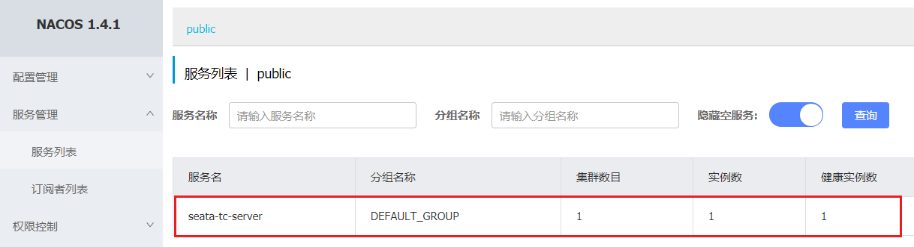

<br>

##### 导入示例项目

微服务下单业务，在下单时会调用订单服务，创建订单并写入数据库。然后订单服务调用账户服务和库存服务：

- 账户服务负责扣减用户余额
- 库存服务负责扣减商品库存

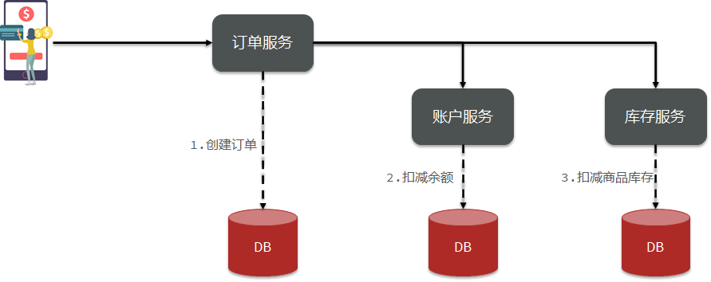

1. 创建数据库 seata_demo，导入SQL 文件 [seata-demo.sql](attachment\eg_2\sql) 。
2. 导入微服务 [seata-demo](attachment\eg_2\seata-demo)

<br>

##### 微服务集成 Seata

1. 在微服务模块中引入 seata 相关依赖

```xml
 <!--seata-->
        <dependency>
            <groupId>com.alibaba.cloud</groupId>
            <artifactId>spring-cloud-starter-alibaba-seata</artifactId>
            <exclusions>
                <!--版本较低，1.3.0，因此排除--> 
                <exclusion>
                    <artifactId>seata-spring-boot-starter</artifactId>
                    <groupId>io.seata</groupId>
                </exclusion>
            </exclusions>
        </dependency>
		<!--seata starter 采用1.4.2版本-->
        <dependency>
            <groupId>io.seata</groupId>
            <artifactId>seata-spring-boot-starter</artifactId>
            <version>${seata.version}</version>
        </dependency>
```

2. 配置 application.yml，让微服务通过注册中心找到 seata-tc-server

```yaml
seata:
  registry: 
  # TC服务注册中心的配置，微服务根据这些信息去注册中心获取tc服务地址
    # 参考tc服务自己的registry.conf中的配置
    type: nacos
    nacos: # tc
      server-addr: 127.0.0.1:8848
      namespace: ""
      group: DEFAULT_GROUP
      application: seata-tc-server # tc服务在nacos中的服务名称
      cluster: SH
  tx-service-group: seata-demo # 事务组，根据这个获取tc服务的cluster名称
  service:
    vgroup-mapping: # 事务组与TC服务cluster的映射关系
      seata-demo: SH
```

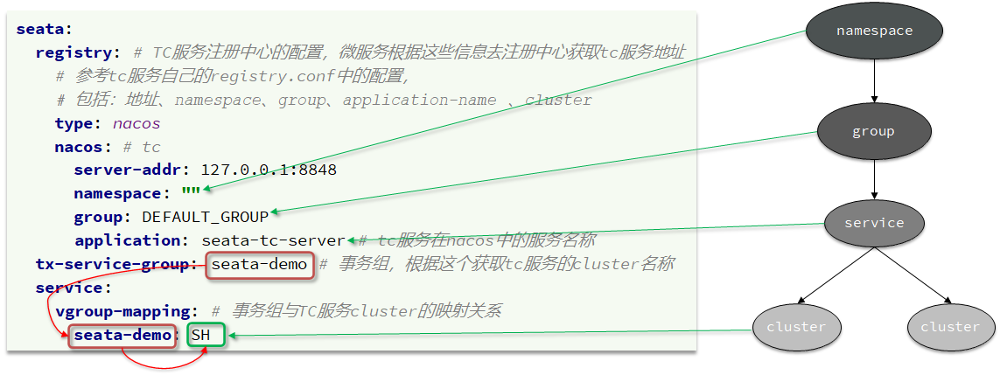

<br>

---

<div STYLE="page-break-after: always;">
    <br>
	<br>
	<br>
	<br>
	<br>
</div>

## 9.3	XA 模式

##### XA 模式原理

XA 规范 是 X/Open 组织定义的分布式事务处理（DTP，Distributed Transaction Processing）标准，XA 规范描述了全局的 TM 与局部的 RM 之间的接口，几乎所有主流的数据库都对 XA 规范提供了支持。

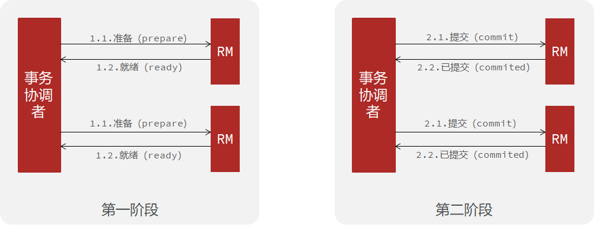

<br>

##### XA 模式的优缺点

###### 优点

- 事务的强一致性，满足 ACID 原则。

- 常用数据库都支持，实现简单，并且没有代码侵入

##### 缺点

- 因为一阶段需要锁定数据库资源，等待二阶段结束才释放，性能较差

- 依赖关系型数据库实现事务

<br>

##### seata 的 XA 模式

seata 的 XA 模式做了一些调整，但大体相似。

RM 在一阶段的工作：

- 注册分支事务到 TC
- 执行分支业务 sql 但不提交
- 报告执行状态到 TC

TC 在二阶段的工作：

- TC 检测各分支事务执行状态。如果都成功，通知所有 RM 提交事务，如果有失败，通知所有RM回滚事务。

RM 在二阶段的工作：

- 接收 TC 指令，提交或回滚事务

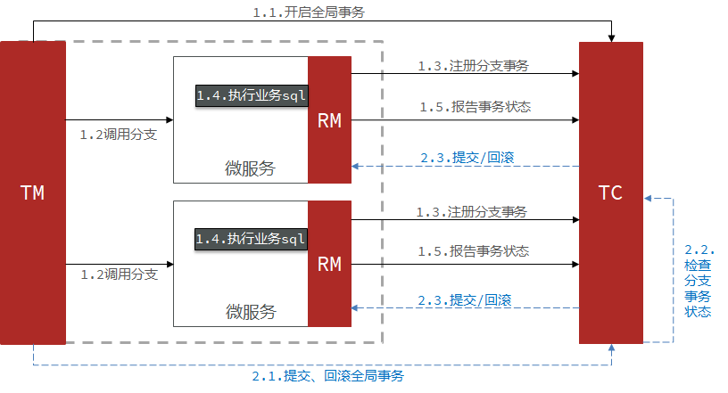

<br>

##### 实现 XA 模式

Seata 的 starter 已经完成了 XA 模式的自动装配，实现非常简单，步骤如下：

1.修改每个参与事务的微服务的 application.yml 文件（），开启XA模式：

```yaml
seata:
	data-source-proxy-mode: XA # 开启数据源代理的XA模式
```

2. 给发起全局事务的入口方法添加 `@GlobalTransactional` 注解，本例中是 OrderServiceImpl 中的 create 方法：

```java
@Override
@GlobalTransactionalpublic Long create(Order order) {
	// 创建订单
	orderMapper.insert(order);
	// 扣余额 ...略 
    // 扣减库存 ...略    
    return order.getId();
}
```

3. 重启服务并测试

<br>

---

<div STYLE="page-break-after: always;">
    <br>
	<br>
	<br>
	<br>
	<br>
</div>

## 9.4	AT 模式

##### AT 模式原理

AT 模式同样是分阶段提交的事务模型，不过缺弥补了 XA 模型中资源锁定周期过长的缺陷。

阶段一 RM 的工作：

- 注册分支事务
- 记录 undo-log（数据快照）
- 执行业务 sql 并提交
- 报告事务状态

阶段二提交时 RM 的工作：

- 删除 undo-log 即可

阶段二回滚时RM的工作：

- 根据 undo-log 恢复数据到更新前

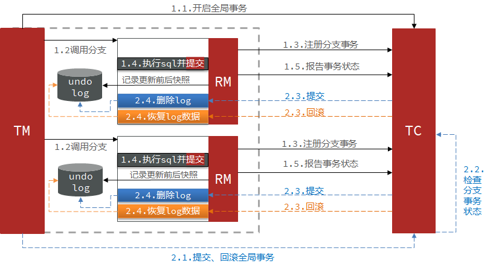

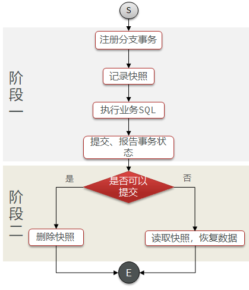

<br>

##### AT 模式与 XA 模式之间的区别

- XA 模式一阶段不提交事务，锁定资源；AT 模式一阶段直接提交，不锁定资源。
- XA 模式依赖数据库机制实现回滚；AT 模式利用数据快照实现数据回滚。
- XA 模式强一致；AT 模式最终一致

<br>

##### AT 模式的脏写问题

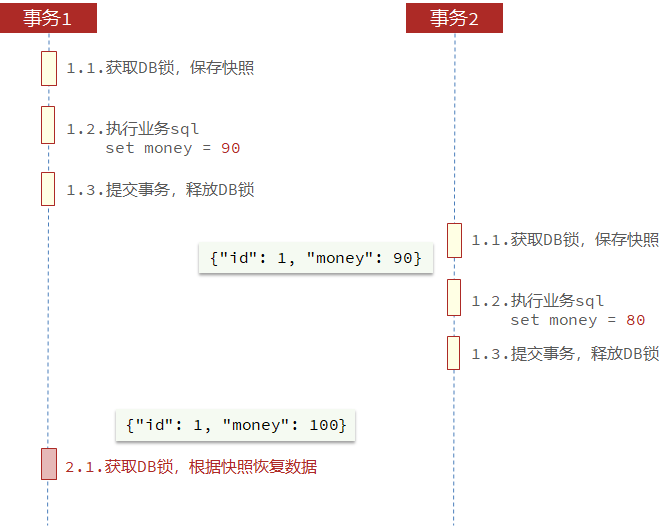

按照以上步骤执行的事务，最后将导致回滚、

<br>

##### AT模式的写隔离

###### 非 seata 管理的全局事务


###### 全局锁

由 TC 记录当前正在操作某行数据的事务，该事务持有全局锁，具备执行权。

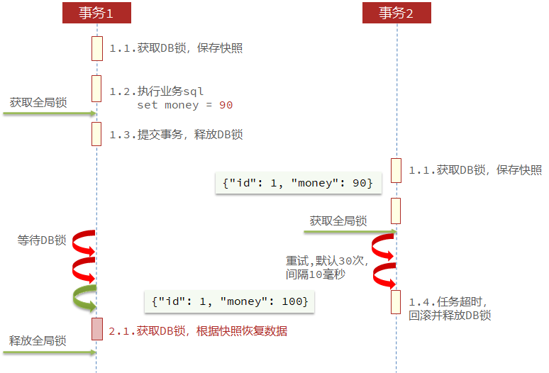

<br>

##### AT模式的优缺点

###### 优点

- 一阶段完成直接提交事务，释放数据库资源，性能比较好
- 利用全局锁实现读写隔离
- 没有代码侵入，框架自动完成回滚和提交

###### 缺点

- 两阶段之间属于软状态，属于最终一致
- 框架的快照功能会影响性能，但比XA模式要好很多

<br>

##### 实现 AT 模式

AT模式中的快照生成、回滚等动作都是由框架自动完成，**没有任何代码侵入**，因此实现非常简单。

1. 导入 Sql 文件：[seata-at.sql](attachment\eg_2\sql)，其中 lock_table 导入到 TC 服务关联的数据库，undo_log 表导入到微服务关联的数据库。

2. 修改 application.yml 文件，将事务模式修改为 AT 模式即可。

3. 重启服务并测试。

<br>

----

<div STYLE="page-break-after: always;">
    <br>
	<br>
	<br>
	<br>
	<br>
</div>

## 9.5	TCC 模式

##### TCC 模式原理

TCC模式与AT模式非常相似，每阶段都是独立事务，不同的是 TCC 通过人工编码来实现数据恢复。需要实现三个方法：

- Try：资源的检测和预留； 
- Confirm：完成资源操作业务；要求 Try 成功 Confirm 一定要能成功。
- Cancel：预留资源释放，可以理解为try的反向操作。

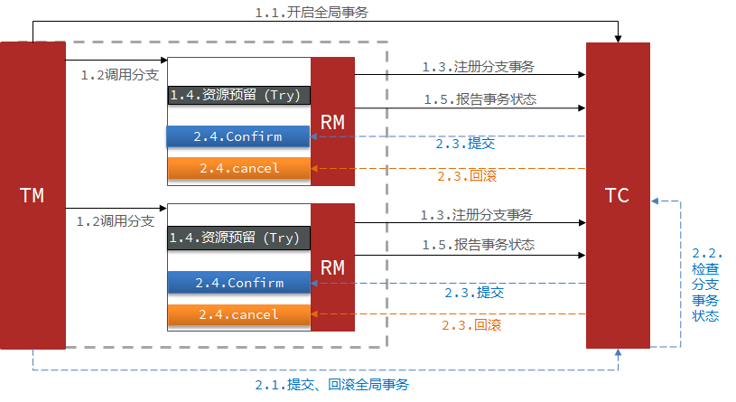

举例，一个扣减用户余额的业务。假设账户A原来余额是100，需要余额扣减30元。

- 阶段一（ Try ）：检查余额是否充足，如果充足则冻结金额增加30元，可用余额扣除30。
- 阶段二：假如要提交（Confirm），则冻结金额扣减30
- 阶段二：如果要回滚（Cancel），则冻结金额扣减30，可用余额增加30

<br>

##### TCC 的优缺点

###### 优点

- 一阶段完成直接提交事务，释放数据库资源，性能好
- 相比 AT 模型，无需生成快照，无需使用全局锁，性能最强
- 不依赖数据库事务，而是依赖补偿操作，可以用于非事务型数据库

###### 缺点

- 有代码侵入，需要人为编写try、Confirm和Cancel接口，太麻烦
- 软状态，事务是最终一致
- 需要考虑Confirm和Cancel的失败情况，做好幂等处理

<br>

##### TCC 的空回滚和业务悬挂

当某分支事务的 try 阶段阻塞时，可能导致全局事务超时而触发二阶段的 cancel 操作。在未执行 try 操作时先执行了 cancel 操作，这时 cancel 不能做回滚，即 **空回滚**。

对于已经空回滚的业务，如果以后继续执行 try，就永远不可能 confirm 或 cancel，这就是业务悬挂。应当阻止执行空回滚后的 try 操作，避免悬挂。

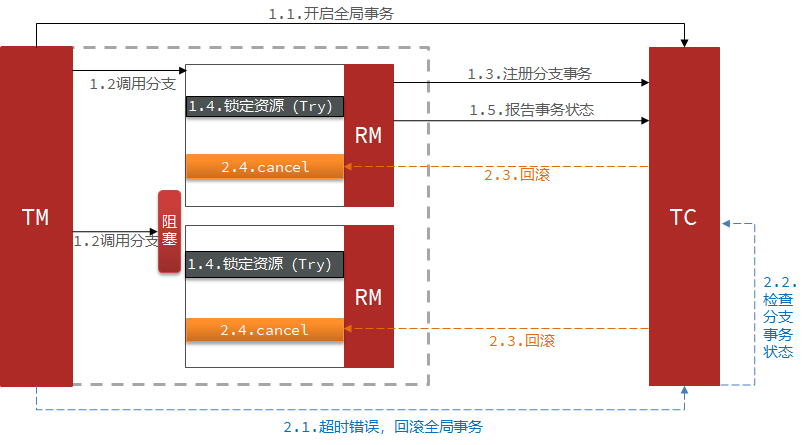

<br>

##### 例——改造account-service服务，利用TCC实现分布式事务

###### 需求

- 修改 account-service，编写 try、confirm、cancel 逻辑

- try业务：添加冻结金额，扣减可用金额
- confirm 业务：删除冻结金额
- cancel 业务：删除冻结金额，恢复可用金额
- 保证 confirm、cancel 接口的幂等性
- 允许空回滚
- 拒绝业务悬挂

###### 业务分析

为了实现空回滚、防止业务悬挂，以及幂等性要求。我们必须在数据库记录冻结金额的同时，记录当前事务id和执行状态，为此我们设计了一张表：

```sql
CREATE TABLE `account_freeze_tbl` (
  `xid` varchar(128) NOT NULL,
  `user_id` varchar(255) DEFAULT NULL COMMENT '用户id',
  `freeze_money` int(11) unsigned DEFAULT '0' COMMENT '冻结金额',
  `state` int(1) DEFAULT NULL COMMENT '事务状态，0:try，1:confirm，2:cancel',
  PRIMARY KEY (`xid`) USING BTREE
) ENGINE=InnoDB DEFAULT CHARSET=utf8 ROW_FORMAT=COMPACT;
```

Try业务：

- 记录冻结金额和事务状态到 account_freeze 表
- 扣减 account 表可用金额

Confirm 业务：

- 根据 xid 删除 account_freeze 表的冻结记录

Cancel 业务：

- 修改 account_freeze 表，冻结金额为 0，state 为2
- 修改 account 表，恢复可用金额

如何判断是否空回滚：

- cancel 业务中，根据 xid 查询 account_freeze，如果为 null 则说明 try 还没做，需要空回滚。

如何避免业务悬挂：

- try业务中，根据 xid 查询 account_freeze ，如果已经存在则证明 Cancel 已经执行，拒绝执行 try 业务。

###### 实现

声明 TCC 接口，TCC 的 Try、Confirm、Cancel 方法都需要在接口中基于注解来声明，语法如下：

```java
@LocalTCC
public interface TCCService {
	/**
    * Try逻辑，@TwoPhaseBusinessAction中的name属性要与当前方法名一致，用于指定Try逻辑对应的方法
    */    
    @TwoPhaseBusinessAction(name = "prepare", commitMethod = "confirm", rollbackMethod = "cancel")
    void prepare(@BusinessActionContextParameter(paramName = "param") String param);
    
    /**
    * 二阶段confirm确认方法、可以另命名，但要保证与commitMethod一致
    *     
    * @param context 上下文,可以传递try方法的参数
    * @return boolean 执行是否成功     
    */
    boolean confirm (BusinessActionContext context);
    
    /**
    * 二阶段回滚方法，要保证与rollbackMethod一致
    */
    boolean cancel (BusinessActionContext context);
}
```

<br>

----

<div STYLE="page-break-after: always;">
    <br>
	<br>
	<br>
	<br>
	<br>
</div>

## 9.6	Saga 模式

##### Saga 模式原理

Saga 模式是 SEATA 提供的长事务解决方案。也分为两个阶段：

- 一阶段：直接提交本地事务
- 二阶段：成功则什么都不做；失败则通过编写补偿业务来回滚


<br>

##### Saga 模式的优缺点

###### 优点

- 事务参与者可以基于事件驱动实现异步调用，吞吐高
- 一阶段直接提交事务，无锁，性能好
- 不用编写TCC中的三个阶段，实现简单

###### 缺点

- 软状态持续时间不确定，时效性差

- 没有锁，没有事务隔离，会有脏写

<br>

---

<div STYLE="page-break-after: always;">
    <br>
	<br>
	<br>
	<br>
	<br>
</div>

## 9.7	TC 的异地多机房容灾架构

##### TC 服务不能宕机

TC 服务作为 Seata 的核心服务，一定要保证高可用和异地容灾。

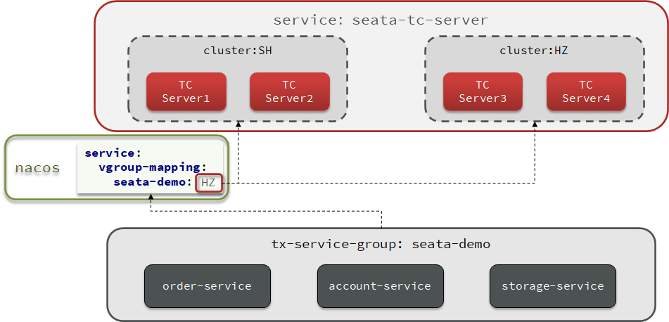

<br>

##### 模拟异地容灾的TC集群

计划启动两台seata的tc服务节点：

| 节点名称 | ip地址    | 端口号 | 集群名称 |
| -------- | --------- | ------ | -------- |
| seata    | 127.0.0.1 | 8091   | SH       |
| seata2   | 127.0.0.1 | 8092   | HZ       |

之前我们已经启动了一台seata服务，端口是8091，集群名为SH。

现在，将seata目录复制一份，起名为seata2

修改seata2/conf/registry.conf内容如下：

```nginx
registry {
  # tc服务的注册中心类，这里选择nacos，也可以是eureka、zookeeper等
  type = "nacos"

  nacos {
    # seata tc 服务注册到 nacos的服务名称，可以自定义
    application = "seata-tc-server"
    serverAddr = "127.0.0.1:8848"
    group = "DEFAULT_GROUP"
    namespace = ""
    cluster = "HZ"
    username = "nacos"
    password = "nacos"
  }
}

config {
  # 读取tc服务端的配置文件的方式，这里是从nacos配置中心读取，这样如果tc是集群，可以共享配置
  type = "nacos"
  # 配置nacos地址等信息
  nacos {
    serverAddr = "127.0.0.1:8848"
    namespace = ""
    group = "SEATA_GROUP"
    username = "nacos"
    password = "nacos"
    dataId = "seataServer.properties"
  }
}
```

进入seata2/bin目录，然后运行命令：

```powershell
seata-server.bat -p 8092
```

打开nacos控制台，查看服务列表：


点进详情查看：


###### 将事务组映射配置到nacos

接下来，我们需要将tx-service-group与cluster的映射关系都配置到nacos配置中心。

新建一个配置：


配置的内容如下：

```properties
# 事务组映射关系
service.vgroupMapping.seata-demo=SH

service.enableDegrade=false
service.disableGlobalTransaction=false
# 与TC服务的通信配置
transport.type=TCP
transport.server=NIO
transport.heartbeat=true
transport.enableClientBatchSendRequest=false
transport.threadFactory.bossThreadPrefix=NettyBoss
transport.threadFactory.workerThreadPrefix=NettyServerNIOWorker
transport.threadFactory.serverExecutorThreadPrefix=NettyServerBizHandler
transport.threadFactory.shareBossWorker=false
transport.threadFactory.clientSelectorThreadPrefix=NettyClientSelector
transport.threadFactory.clientSelectorThreadSize=1
transport.threadFactory.clientWorkerThreadPrefix=NettyClientWorkerThread
transport.threadFactory.bossThreadSize=1
transport.threadFactory.workerThreadSize=default
transport.shutdown.wait=3
# RM配置
client.rm.asyncCommitBufferLimit=10000
client.rm.lock.retryInterval=10
client.rm.lock.retryTimes=30
client.rm.lock.retryPolicyBranchRollbackOnConflict=true
client.rm.reportRetryCount=5
client.rm.tableMetaCheckEnable=false
client.rm.tableMetaCheckerInterval=60000
client.rm.sqlParserType=druid
client.rm.reportSuccessEnable=false
client.rm.sagaBranchRegisterEnable=false
# TM配置
client.tm.commitRetryCount=5
client.tm.rollbackRetryCount=5
client.tm.defaultGlobalTransactionTimeout=60000
client.tm.degradeCheck=false
client.tm.degradeCheckAllowTimes=10
client.tm.degradeCheckPeriod=2000

# undo日志配置
client.undo.dataValidation=true
client.undo.logSerialization=jackson
client.undo.onlyCareUpdateColumns=true
client.undo.logTable=undo_log
client.undo.compress.enable=true
client.undo.compress.type=zip
client.undo.compress.threshold=64k
client.log.exceptionRate=100
```

###### 微服务读取nacos配置

接下来，需要修改每一个微服务的application.yml文件，让微服务读取nacos中的client.properties文件：

```yaml
seata:
  config:
    type: nacos
    nacos:
      server-addr: 127.0.0.1:8848
      username: nacos
      password: nacos
      group: SEATA_GROUP
      data-id: client.properties
```

重启微服务，现在微服务到底是连接tc的SH集群，还是tc的HZ集群，都统一由nacos的client.properties来决定了。

---

<div STYLE="page-break-after: always;">
    <br>
	<br>
	<br>
	<br>
	<br>
</div>

