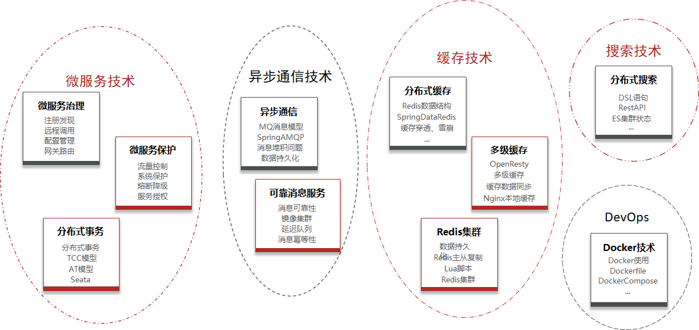

# 1	概述

## 1.1	服务架构的演变

##### 单体架构

将业务的所有功能集中在一个项目中开发，打成一个包部署。

###### 优点

- 架构简单
- 部署成本低

###### 缺点

- 耦合度高（维护困难、升级困难）

###### 适用场景

适合小型项目。

 

##### 分布式架构

根据业务功能对系统做拆分，每个业务功能模块作为独立项目开发，称为一个服务。

###### 优点

- 降低服务耦合
- 有利于服务升级和拓展

###### 缺点

- 服务调用关系错综复杂

###### 适用场景

适合大型互联网项目。

###### 分布式架构存在的问题

分布式架构虽然降低了服务耦合，但是服务拆分时也有很多问题需要思考：

- 服务拆分的粒度如何界定？
- 服务之间如何调用？
- 服务的调用关系如何管理？

为此，人们需要制定一套行之有效的标准来约束分布式架构。

 

---

[^1.1-1]: 

     
     
     
     
     

## 1.2	微服务架构

##### 微服务架构的特征

- **单一职责**：微服务拆分粒度更小，每一个服务都对应唯一的业务能力，做到单一职责。
- **自治**：团队独立、技术独立、数据独立，独立部署和交付。
- **面向服务**：服务提供统一标准的接口，与语言和技术无关。
- **隔离性强**：服务调用做好隔离、容错、降级，避免出现级联问题。

 

##### 微服务架构的本质

微服务的上述特性其实是在 **给分布式架构制定一个标准，进一步降低服务之间的耦合度，提供服务的独立性和灵活性。做到高内聚，低耦合**。因此，可以认为 **微服务** 是一种经过良好架构设计的 **分布式架构方案** 。

 

##### 优缺点

- **优点**：与一般的分布式架构相比拆分粒度更小、服务更独立、耦合度更低。
- **缺点**：架构非常复杂，运维、监控、部署难度提高。

 

----

     
     
     
     
     

## 1.3	微服务技术栈与 Spring Cloud

##### 完整的微服务技术栈示意图

 

##### 完整的微服务技术栈可分为

 

##### Spring Cloud

微服务作为一种分布式架构方案，需要具体的技术栈落地实现。全球的互联网公司都在积极尝试自己的微服务落地方案。其中在 Java 领域最引人注目的就是 Spring Cloud 提供的方案了。

Spring Cloud 是微服务架构的 **一站式解决方案**，集成了各种优秀微服务功能组件，是目前国内使用最广泛的微服务框架。

###### 官网地址

https://spring.io/projects/spring-cloud

###### 常见的组件包括

###### Spring Cloud 与 Spring Boot 的兼容关系

Spring Cloud 底层依赖于 Spring Boot，并且版本的兼容关系：

 

---

     
     
     
     
     

