# 10	Redis 分布式缓存

## 10.1	单点 Redis 的问题与解决方案

##### 数据丢失问题

Redis 是内存存储，服务重启可能会丢失数据

###### 解决方案

实现 Redis 数据持久化。

<br>

##### 并发能力问题

单节点 Redis 并发能力虽然不错，但也无法满足如618这样的高并发场景

###### 解决方案

搭建主从集群，实现读写分离。

<br>

##### 故障恢复问题

如果 Redis 宕机，则服务不可用，需要一种自动的故障恢复手段。

###### 解决方案

利用 Redis 哨兵，实现健康检测和自动恢复

<br>

##### 存储能力问题

Redis 基于内存，单节点能存储的数据量难以满足海量数据需求.

###### 解决方案

搭建分片集群，利用插槽机制实现动态扩容

<br>

----

<div STYLE="page-break-after: always;">
    <br>
	<br>
	<br>
	<br>
	<br>
</div>
## 10.2	Redis 持久化

### 10.2.1	RDB 持久化

##### RDB 简介

RDB 全称 Redis Database Backup file（Redis数据备份文件），也被叫做 Redis 数据快照。简单来说就是把内存中的所有数据都记录到磁盘中。当 Redis 实例故障重启后，从磁盘读取快照文件，恢复数据。

快照文件称为 RDB文件，默认是保存在当前运行目录。

<br>

##### RDB 触发机制

- Redis 停机时会执行一次 RDB
- Redis 内部有触发RDB的机制，可以在 redis.conf 文件中找到，格式如下：

```
# 900秒内，如果至少有1个key被修改，则执行bgsave ， 如果是save "" 则表示禁用RDB
save 900 1  
save 300 10  
save 60 10000 
```

<br>

##### save 与 bgsave


<br>

##### redis.conf

RDB 的其它配置也可以在 redis.conf 文件中设置：

```
# 是否压缩 ,建议不开启，压缩也会消耗cpu，磁盘的话不值钱
rdbcompression yes

# RDB文件名称
dbfilename dump.rdb  

# 文件保存的路径目录
dir ./ 
```

<br>

##### RDB bgsave流程

1. fork 主进程得到一个子进程，子进程共享主进程的内存数据（内存空间）
2. 完成fork后，子进程读取内存数据并写入新的 RDB文 件
3. 用新 RDB 文件替换旧的RDB 文件。

fork 采用的是 copy-on-write 技术：

- 当主进程执行读操作时，访问共享内存；
- 当主进程执行写操作时，则会拷贝一份数据，执行写操作。

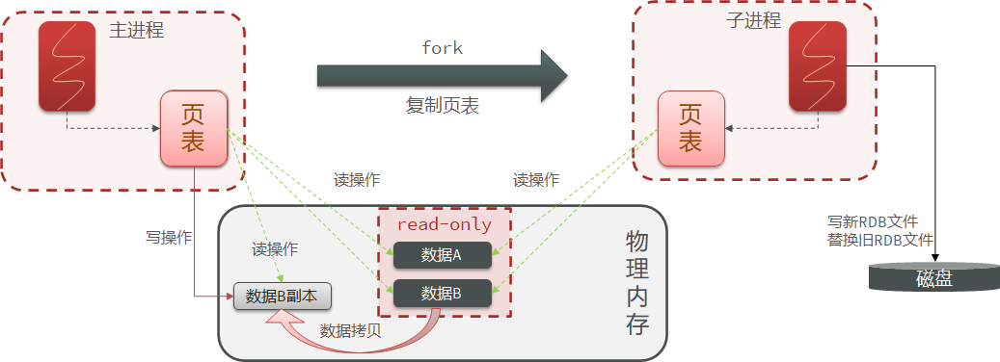

<br>

##### RDB的缺点

- RDB执行间隔时间长，两次RDB之间写入数据有丢失的风险
- fork子进程、压缩、写出RDB文件都比较耗时

<br>

----

<div STYLE="page-break-after: always;">
    <br>
	<br>
	<br>
	<br>
	<br>
</div>

### 10.2.2	AOF持久化

##### AOF 简介

AOF 全称为 Append Only File（追加文件）。Redis 处理的每一个写命令都会记录在 AOF 文件，可以看做是命令日志文件。

因为是记录命令，AOF 文件会比 RDB 文件大的多。

<br>

##### 开启 AOF

AOF默认是关闭的，需要修改redis.conf配置文件来开启AOF：

```
# 是否开启AOF功能，默认是no
appendonly yes
# AOF文件的名称
appendfilename "appendonly.aof"
```

<br>

##### 配置 AOF 的命令记录的频率

通过 redis.conf 文件配置：

```
# 表示每执行一次写命令，立即记录到AOF文件
appendfsync always 
# 写命令执行完先放入AOF缓冲区，然后表示每隔1秒将缓冲区数据写到AOF文件，是默认方案
appendfsync everysec 
# 写命令执行完先放入AOF缓冲区，由操作系统决定何时将缓冲区内容写回磁盘
appendfsync no
```

| **配置项** | **刷盘时机** | **优点**               | **缺点**                     |
| ---------- | ------------ | ---------------------- | ---------------------------- |
| Always     | 同步刷盘     | 可靠性高，几乎不丢数据 | 性能影响大                   |
| everysec   | 每秒刷盘     | 性能适中               | 最多丢失1秒数据              |
| no         | 操作系统控制 | 性能最好               | 可靠性较差，可能丢失大量数据 |

<br>

##### AOF 文件重写

AOF 会记录对同一个key的多次写操作，但只有最后一次写操作才有意义。通过执行 bgrewriteaof 命令，可以让 AOF 文件执行重写功能，用最少的命令达到相同效果。

Redis 也会在触发阈值时自动去重写AOF文件。阈值也可以在 redis.conf 中配置：

```
# AOF文件比上次文件 增长超过多少百分比则触发重写
auto-aof-rewrite-percentage 100
# AOF文件体积最小多大以上才触发重写
auto-aof-rewrite-min-size 64mb 
```

<br>

---

<div STYLE="page-break-after: always;">
    <br>
	<br>
	<br>
	<br>
	<br>
</div>

### 10.2.3	AOF 与 RDB 各自的优缺点与使用场景

##### 结合使用 AOF 与 RDB

RDB和AOF各有自己的优缺点，如果对数据安全性要求较高，在实际开发中往往会**结合**两者来使用。

<br>

##### 优缺点

|                | **RDB**                                      | **AOF**                                                  |
| -------------- | -------------------------------------------- | -------------------------------------------------------- |
| 持久化方式     | 定时对整个内存做快照                         | 记录每一次执行的命令                                     |
| 数据完整性     | 不完整，两次备份之间会丢失                   | 相对完整，取决于刷盘策略                                 |
| 文件大小       | 会有压缩，文件体积小                         | 记录命令，文件体积很大                                   |
| 宕机恢复速度   | 很快                                         | 慢                                                       |
| 数据恢复优先级 | 低，因为数据完整性不如AOF                    | 高，因为数据完整性更高                                   |
| 系统资源占用   | 高，大量CPU和内存消耗                        | 低，主要是磁盘IO资源  但AOF重写时会占用大量CPU和内存资源 |
| 使用场景       | 可以容忍数分钟的数据丢失，追求更快的启动速度 | 对数据安全性要求较高常见                                 |

<br>

---

<div STYLE="page-break-after: always;">
    <br>
	<br>
	<br>
	<br>
	<br>
</div>

## 10.3	Redis 主从

### 10.3.1	搭建主从架构

##### 搭建主从架构的作用

单节点 Redis 的并发能力是有上限的，要进一步提高 Redis 的并发能力，就需要搭建主从集群，**实现读写分离**。

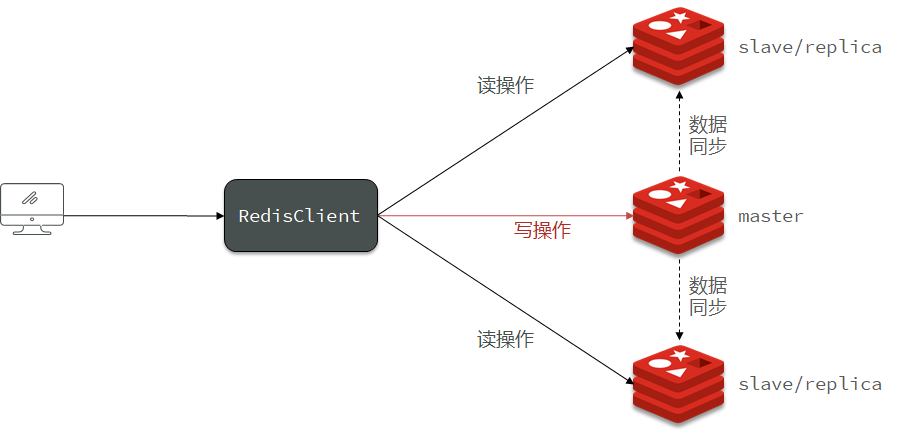

<br>

##### 例——搭建主从架构

###### 主从集群结构


共包含三个节点，一个主节点，两个从节点。

这里我们会在同一台虚拟机中开启3个redis实例，模拟主从集群，信息如下：

|       IP        | PORT |  角色  |
| :-------------: | :--: | :----: |
| 192.168.150.101 | 7001 | master |
| 192.168.150.101 | 7002 | slave  |
| 192.168.150.101 | 7003 | slave  |

###### 准备实例和配置

要在同一台虚拟机开启3个实例，必须准备三份不同的配置文件和目录，配置文件所在目录也就是工作目录。

1. 创建三个文件夹，名字分别叫7001、7002、7003：

```sh
# 进入/tmp目录
cd /tmp
# 创建目录
mkdir 7001 7002 7003
```


###### 恢复原始配置

修改redis-6.2.4/redis.conf文件，将其中的持久化模式改为默认的RDB模式，AOF保持关闭状态。

```properties
# 开启RDB
# save ""
save 3600 1
save 300 100
save 60 10000

# 关闭AOF
appendonly no
```

###### 拷贝配置文件到每个实例目录

然后将redis-6.2.4/redis.conf文件拷贝到三个目录中（在/tmp目录执行下列命令）：

```sh
# 方式一：逐个拷贝
cp redis-6.2.4/redis.conf 7001
cp redis-6.2.4/redis.conf 7002
cp redis-6.2.4/redis.conf 7003
# 方式二：管道组合命令，一键拷贝
echo 7001 7002 7003 | xargs -t -n 1 cp redis-6.2.4/redis.conf
```

###### 修改每个实例的端口、工作目录

修改每个文件夹内的配置文件，将端口分别修改为7001、7002、7003，将rdb文件保存位置都修改为自己所在目录（在/tmp目录执行下列命令）：

```sh
sed -i -e 's/6379/7001/g' -e 's/dir .\//dir \/tmp\/7001\//g' 7001/redis.conf
sed -i -e 's/6379/7002/g' -e 's/dir .\//dir \/tmp\/7002\//g' 7002/redis.conf
sed -i -e 's/6379/7003/g' -e 's/dir .\//dir \/tmp\/7003\//g' 7003/redis.conf
```

###### 修改每个实例的声明IP

虚拟机本身有多个IP，为了避免将来混乱，我们需要在redis.conf文件中指定每一个实例的绑定ip信息，格式如下：

```properties
# redis实例的声明 IP
replica-announce-ip 192.168.150.101
```

每个目录都要改，我们一键完成修改（在/tmp目录执行下列命令）：

```sh
# 逐一执行
sed -i '1a replica-announce-ip 192.168.150.101' 7001/redis.conf
sed -i '1a replica-announce-ip 192.168.150.101' 7002/redis.conf
sed -i '1a replica-announce-ip 192.168.150.101' 7003/redis.conf

# 或者一键修改
printf '%s\n' 7001 7002 7003 | xargs -I{} -t sed -i '1a replica-announce-ip 192.168.150.101' {}/redis.conf
```

###### 启动

为了方便查看日志，我们打开3个ssh窗口，分别启动3个redis实例，启动命令：

```sh
# 第1个
redis-server 7001/redis.conf
# 第2个
redis-server 7002/redis.conf
# 第3个
redis-server 7003/redis.conf
```

启动后：


###### 停止

如果要一键停止，可以运行下面命令：

```sh
printf '%s\n' 7001 7002 7003 | xargs -I{} -t redis-cli -p {} shutdown
```

###### 开启主从关系

现在三个实例还没有任何关系，要配置主从可以使用 replicaof 或者slaveof（5.0以前）命令。

有临时和永久两种模式：

- 修改配置文件（永久生效）

  - 在redis.conf中添加一行配置：```slaveof <masterip> <masterport>```

- 使用redis-cli客户端连接到redis服务，执行slaveof命令（重启后失效）：

  ```sh
  slaveof <masterip> <masterport>
  ```

<strong><font color='red'>注意</font></strong>：在5.0以后新增命令replicaof，与salveof效果一致。

这里我们为了演示方便，使用方式二。

通过redis-cli命令连接7002，执行下面命令：

```sh
# 连接 7002
redis-cli -p 7002
# 执行slaveof
slaveof 192.168.150.101 7001
```

通过redis-cli命令连接7003，执行下面命令：

```sh
# 连接 7003
redis-cli -p 7003
# 执行slaveof
slaveof 192.168.150.101 7001
```

然后连接 7001节点，查看集群状态：

```sh
# 连接 7001
redis-cli -p 7001
# 查看状态
info replication
```

结果：


###### 测试

执行下列操作以测试：

- 利用redis-cli连接7001，执行```set num 123```

- 利用redis-cli连接7002，执行```get num```，再执行```set num 666```

- 利用redis-cli连接7003，执行```get num```，再执行```set num 888```

可以发现，只有在7001这个master节点上可以执行写操作，7002和7003这两个slave节点只能执行读操作。

<br>

---

<div STYLE="page-break-after: always;">
    <br>
	<br>
	<br>
	<br>
	<br>
</div>

### 10.3.2	数据同步原理

##### 数据同步原理

master如何判断slave是不是第一次来同步数据？这里会用到两个很重要的概念：

- Replication Id：简称replid，是数据集的标记，id一致则说明是同一数据集。每一个master都有唯一的replid，slave则会继承master节点的replid
- offset：偏移量，随着记录在repl_baklog中的数据增多而逐渐增大。slave完成同步时也会记录当前同步的offset。如果slave的offset小于master的offset，说明slave数据落后于master，需要更新。

因此slave做数据同步，必须向master声明自己的replication id 和offset，master才可以判断到底需要同步哪些数据。

<br>

##### 全量同步

主从第一次同步是 **全量同步**：

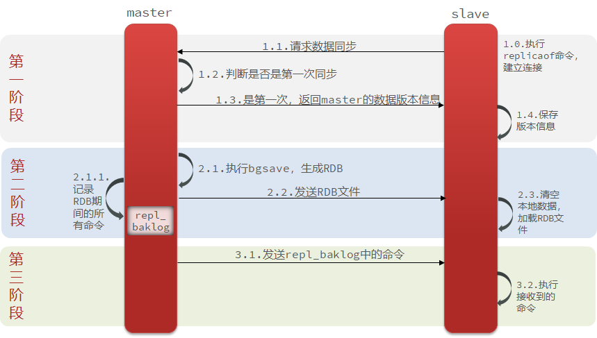

###### 流程

1. slave 节点请求增量同步
2. master 节点判断 replid，发现不一致，拒绝增量同步
3. master 将完整内存数据生成 RDB，发送 RDB 到 slave
4. slave 清空本地数据，加载 master 的 RDB
5. master 将 RDB 期间的命令记录在 repl_baklog，并持续将 log 中的命令发送给 slave
6. slave 执行接收到的命令，保持与 master 之间的同步

<br>

##### 增量同步

主从第一次同步是 **全量同步**，，但如果 slave 重启后同步，则执行 **增量同步**。总之，slave节点断开又恢复，并且在repl_baklog中能找到offset时，会进行增量同步。

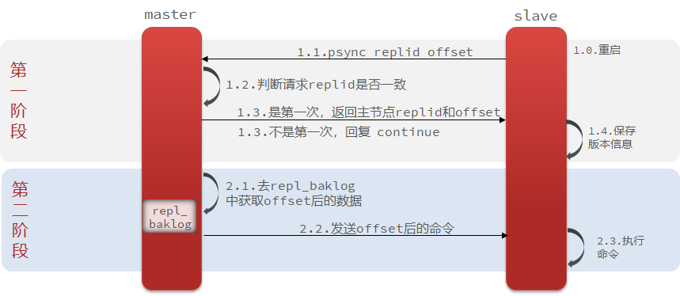

###### repl_baklog 大小上限

repl_baklog 大小有上限，写满后会覆盖最早的数据。如果slave断开时间过久，导致尚未备份的数据被覆盖，则无法基于log做增量同步，只能再次全量同步。

<br>

##### 优化 Redis 主从就集群

可以从以下几个方面来优化 Redis 主从就集群：

- 在 master 中配置 repl-diskless-sync yes 启用无磁盘复制，避免全量同步时的磁盘 IO。
- Redis 单节点上的内存占用不要太大，减少 RDB 导致的过多磁盘 IO
- 适当提高 repl_baklog 的大小，发现 slave 宕机时尽快实现故障恢复，尽可能避免全量同步
- 限制一个 master 上的 slave 节点数量，如果实在是太多 slave，则可以采用主-从-从链式结构，减少 master 压力

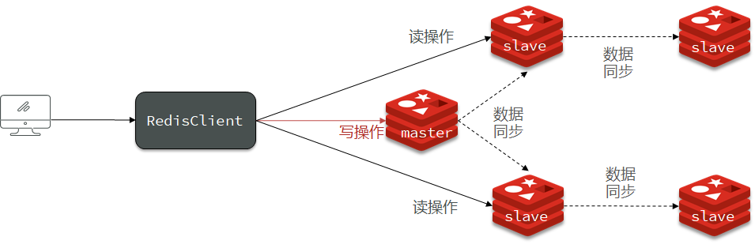

<br>

##### 全量同步和增量同步区别

- 全量同步——master将完整内存数据生成RDB，发送RDB到slave。后续命令则记录在repl_baklog，逐个发送给slave。
- 增量同步——slave提交自己的offset到master，master获取repl_baklog中从offset之后的命令给slave

<br>

---

<div STYLE="page-break-after: always;">
    <br>
	<br>
	<br>
	<br>
	<br>
</div>

## 10.4	Redis 哨兵

### 10.4.1	哨兵的作用和原理

##### Master 节点的故障恢复

slave节点宕机恢复后可以找master节点同步数据，那master节点宕机怎么办？

<br>

##### 哨兵的作用

Redis 提供了哨兵（Sentinel）机制来实现主从集群的自动故障恢复。哨兵作用如下：

- **监控**：Sentinel 会不断检查您的master和slave是否按预期工作

- **自动故障恢复**：如果master故障，Sentinel会将一个slave提升为master。当故障实例恢复后也以新的master为主

- **通知**：Sentinel充当Redis客户端的服务发现来源，当集群发生故障转移时，会将最新信息推送给Redis的客户端

<br>

##### 哨兵的结构

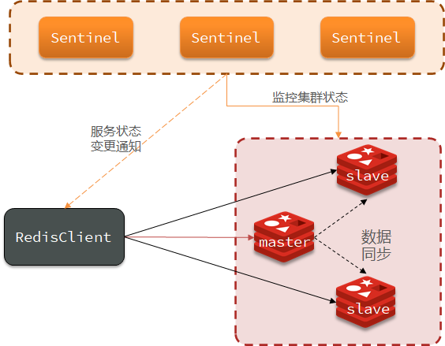

<br>

##### 服务状态监控

Sentinel基于心跳机制监测服务状态，每隔1秒向集群的每个实例发送ping命令：

- 主观下线：如果某sentinel节点发现某实例未在规定时间响应，则认为该实例**主观下线**。
- 客观下线：若超过指定数量（quorum）的sentinel都认为该实例主观下线，则该实例**客观下线**。quorum值最好超过Sentinel实例数量的一半。


<br>

##### 选举新的master

一旦发现master故障，sentinel需要在salve中选择一个作为新的master，选择的依据为：

1. 首先会判断slave节点与master节点断开时间长短，如果超过指定值（down-after-milliseconds * 10）则会排除该slave节点
2. 然后判断slave节点的slave-priority值，越小优先级越高，如果是0则永不参与选举
3. 如果slave-prority一样，则判断slave节点的offset值，越大说明数据越新，优先级越高
4. 最后是判断slave节点的运行id大小，越小优先级越高。

<br>

##### 实现故障转移

当选中了其中一个slave为新的master后（例如slave1），故障的转移的步骤如下：

1. sentinel给备选的slave1节点发送slaveof no one命令，让该节点成为master
2. sentinel给所有其它slave发送slaveof 192.168.150.101 7002 命令，让这些slave成为新master的从节点，开始从新的master上同步数据。
3. 最后，sentinel将故障节点标记为slave，当故障节点恢复后会自动成为新的master的slave节点


<br>

---

<div STYLE="page-break-after: always;">
    <br>
	<br>
	<br>
	<br>
	<br>
</div>

### 10.4.2	搭建哨兵集群

##### 集群结构

这里我们搭建一个三节点形成的Sentinel集群，来监管之前的Redis主从集群。如图：

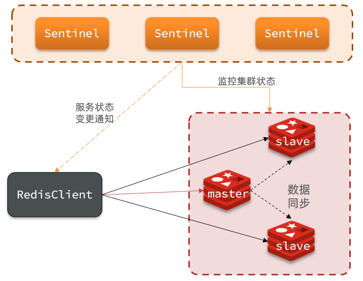


三个sentinel实例信息如下：

| 节点 |       IP        | PORT  |
| ---- | :-------------: | :---: |
| s1   | 192.168.150.101 | 27001 |
| s2   | 192.168.150.101 | 27002 |
| s3   | 192.168.150.101 | 27003 |

<br>

##### 准备实例和配置

要在同一台虚拟机开启3个实例，必须准备三份不同的配置文件和目录，配置文件所在目录也就是工作目录。

我们创建三个文件夹，名字分别叫s1、s2、s3：

```sh
# 进入/tmp目录
cd /tmp
# 创建目录
mkdir s1 s2 s3
```

如图：


然后我们在s1目录创建一个sentinel.conf文件，添加下面的内容：

```ini
port 27001
sentinel announce-ip 192.168.150.101
sentinel monitor mymaster 192.168.150.101 7001 2
sentinel down-after-milliseconds mymaster 5000
sentinel failover-timeout mymaster 60000
dir "/tmp/s1"
```

解读：

- `port 27001`：是当前sentinel实例的端口
- `sentinel monitor mymaster 192.168.150.101 7001 2`：指定主节点信息
  - `mymaster`：主节点名称，自定义，任意写
  - `192.168.150.101 7001`：主节点的ip和端口
  - `2`：选举master时的quorum值


然后将s1/sentinel.conf文件拷贝到s2、s3两个目录中（在/tmp目录执行下列命令）：

```sh
# 方式一：逐个拷贝
cp s1/sentinel.conf s2
cp s1/sentinel.conf s3
# 方式二：管道组合命令，一键拷贝
echo s2 s3 | xargs -t -n 1 cp s1/sentinel.conf
```


修改s2、s3两个文件夹内的配置文件，将端口分别修改为27002、27003：

```sh
sed -i -e 's/27001/27002/g' -e 's/s1/s2/g' s2/sentinel.conf
sed -i -e 's/27001/27003/g' -e 's/s1/s3/g' s3/sentinel.conf
```

<br>

##### 启动

为了方便查看日志，我们打开3个ssh窗口，分别启动3个redis实例，启动命令：

```sh
# 第1个
redis-sentinel s1/sentinel.conf
# 第2个
redis-sentinel s2/sentinel.conf
# 第3个
redis-sentinel s3/sentinel.conf
```


启动后：


<br>

##### 测试

尝试让master节点7001宕机，查看sentinel日志：


查看7003的日志：

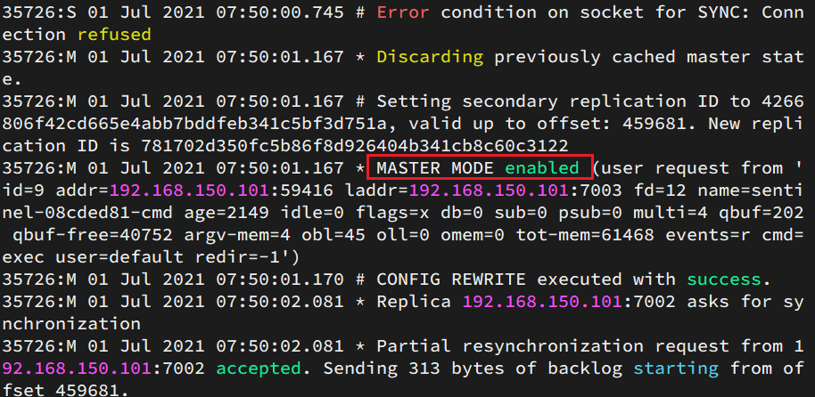

查看7002的日志：


<br>

---

<div STYLE="page-break-after: always;">
    <br>
	<br>
	<br>
	<br>
	<br>
</div>

### 10.4.3	RedisTemplate 的哨兵模式

##### Spring RedisTemplate 的哨兵模式

在 Sentinel 集群监管下的 Redis 主从集群，其节点会因为自动故障转移而发生变化，Redis 的客户端必须感知这种变化，及时更新连接信息。Spring 的 RedisTemplate 底层利用 lettuce 实现了节点的感知和自动切换。

<br>

##### 例——在微服务中引入 RedisTemplate 的哨兵模式

###### 引入示例项目

[redis-demo](attachment\redis-demo)

###### 实现步骤

1. 在微服务的 pom 文件中引入 redis 的 starter 依赖：

```
<dependency>
	<groupId>org.springframework.boot</groupId>
    <artifactId>spring-boot-starter-data-redis</artifactId>
</dependency>
```

2. 在配置文件 application.yml 中指定 Redis sentinel 相关信息：

```yaml
spring:
	redis:    
		sentinel:
    		master: mymaster # 指定master名称
            nodes: # 指定redis-sentinel集群信息 
            	- 192.168.150.101:27001
                - 192.168.150.101:27002
                - 192.168.150.101:27003
```

3. 配置主从读写分离

```java
@Bean
public LettuceClientConfigurationBuilderCustomizer configurationBuilderCustomizer(){
    return configBuilder -> configBuilder.readFrom(ReadFrom.REPLICA_PREFERRED);
}
```

这里的 ReadFrom 是配置 Redis 的读取策略，是一个枚举，包括下面选择：

- MASTER：从主节点读取
- MASTER_PREFERRED：优先从master节点读取，master不可用才读取replica
- REPLICA：从slave（replica）节点读取
- REPLICA _PREFERRED：优先从slave（replica）节点读取，所有的slave都不可用才读取master

<br>

---

<div STYLE="page-break-after: always;">
    <br>
	<br>
	<br>
	<br>
	<br>
</div>

## 10.5	Redis 分片集群

### 10.5.1	搭建分片集群

##### 分片集群结构

主从和哨兵可以解决高可用、高并发读的问题。但是依然有两个问题没有解决：

- 海量数据存储问题
- 高并发写的问题

使用分片集群可以解决上述问题，分片集群特征：

- 集群中有多个master，每个master保存不同数据
- 每个master都可以有多个slave节点
- master之间通过ping监测彼此健康状态
- 客户端请求可以访问集群任意节点，最终都会被转发到正确节点


<br>

##### 例——搭建简单的分片集群

分片集群需要的节点数量较多，这里我们搭建一个最小的分片集群，包含3个 master 节点，每个 master 包含一个 slave 节点，结构如下：


这里我们会在同一台虚拟机中开启6个redis实例，模拟分片集群，信息如下：

|       IP        | PORT |  角色  |
| :-------------: | :--: | :----: |
| 192.168.150.101 | 7001 | master |
| 192.168.150.101 | 7002 | master |
| 192.168.150.101 | 7003 | master |
| 192.168.150.101 | 8001 | slave  |
| 192.168.150.101 | 8002 | slave  |
| 192.168.150.101 | 8003 | slave  |

###### 准备实例和配置

删除之前的7001、7002、7003这几个目录，重新创建出7001、7002、7003、8001、8002、8003目录：

```sh
# 进入/tmp目录
cd /tmp
# 删除旧的，避免配置干扰
rm -rf 7001 7002 7003
# 创建目录
mkdir 7001 7002 7003 8001 8002 8003
```


在/tmp下准备一个新的redis.conf文件，内容如下：

```ini
port 6379
# 开启集群功能
cluster-enabled yes
# 集群的配置文件名称，不需要我们创建，由redis自己维护
cluster-config-file /tmp/6379/nodes.conf
# 节点心跳失败的超时时间
cluster-node-timeout 5000
# 持久化文件存放目录
dir /tmp/6379
# 绑定地址
bind 0.0.0.0
# 让redis后台运行
daemonize yes
# 注册的实例ip
replica-announce-ip 192.168.150.101
# 保护模式
protected-mode no
# 数据库数量
databases 1
# 日志
logfile /tmp/6379/run.log
```

将这个文件拷贝到每个目录下：

```sh
# 进入/tmp目录
cd /tmp
# 执行拷贝
echo 7001 7002 7003 8001 8002 8003 | xargs -t -n 1 cp redis.conf
```


修改每个目录下的redis.conf，将其中的6379修改为与所在目录一致：

```sh
# 进入/tmp目录
cd /tmp
# 修改配置文件
printf '%s\n' 7001 7002 7003 8001 8002 8003 | xargs -I{} -t sed -i 's/6379/{}/g' {}/redis.conf
```

###### 启动

因为已经配置了后台启动模式，所以可以直接启动服务：

```sh
# 进入/tmp目录
cd /tmp
# 一键启动所有服务
printf '%s\n' 7001 7002 7003 8001 8002 8003 | xargs -I{} -t redis-server {}/redis.conf
```

通过ps查看状态：

```sh
ps -ef | grep redis
```

发现服务都已经正常启动：


如果要关闭所有进程，可以执行命令：

```sh
ps -ef | grep redis | awk '{print $2}' | xargs kill
```

或者（推荐这种方式）：

```sh
printf '%s\n' 7001 7002 7003 8001 8002 8003 | xargs -I{} -t redis-cli -p {} shutdown
```

###### 创建集群

虽然服务启动了，但是目前每个服务之间都是独立的，没有任何关联。

我们需要执行命令来创建集群，在Redis5.0之前创建集群比较麻烦，5.0之后集群管理命令都集成到了redis-cli中。


1）Redis5.0之前

Redis5.0之前集群命令都是用redis安装包下的src/redis-trib.rb来实现的。因为redis-trib.rb是有ruby语言编写的所以需要安装ruby环境。

 ```sh
# 安装依赖
yum -y install zlib ruby rubygems
gem install redis
 ```


然后通过命令来管理集群：

```sh
# 进入redis的src目录
cd /tmp/redis-6.2.4/src
# 创建集群
./redis-trib.rb create --replicas 1 192.168.150.101:7001 192.168.150.101:7002 192.168.150.101:7003 192.168.150.101:8001 192.168.150.101:8002 192.168.150.101:8003
```


2）Redis5.0以后

我们使用的是Redis6.2.4版本，集群管理以及集成到了redis-cli中，格式如下：

```sh
redis-cli --cluster create --cluster-replicas 1 192.168.150.101:7001 192.168.150.101:7002 192.168.150.101:7003 192.168.150.101:8001 192.168.150.101:8002 192.168.150.101:8003
```

命令说明：

- `redis-cli --cluster`或者`./redis-trib.rb`：代表集群操作命令
- `create`：代表是创建集群
- `--replicas 1`或者`--cluster-replicas 1` ：指定集群中每个master的副本个数为1，此时`节点总数 ÷ (replicas + 1)` 得到的就是master的数量。因此节点列表中的前n个就是master，其它节点都是slave节点，随机分配到不同master


运行后的样子：


这里输入yes，则集群开始创建：


通过命令可以查看集群状态：

```sh
redis-cli -p 7001 cluster nodes
```


###### 测试

尝试连接7001节点，存储一个数据：

```sh
# 连接
redis-cli -p 7001
# 存储数据
set num 123
# 读取数据
get num
# 再次存储
set a 1
```

结果悲剧了：


集群操作时，需要给`redis-cli`加上`-c`参数才可以：

```sh
redis-cli -c -p 7001
```

这次可以了：


<br>

---

<div STYLE="page-break-after: always;">
    <br>
	<br>
	<br>
	<br>
	<br>
</div>

### 10.5.2	散列插槽

##### Master 节点映射

Redis 会把每一个master节点映射到0~16383共16384个插槽（hash slot）上，查看集群信息时就能看到：

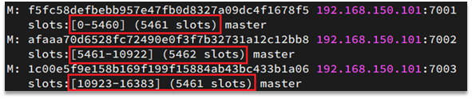

<br>

##### 数据与插槽绑定

数据 key 不是与节点绑定，而是与插槽绑定。redis 会根据 key 的有效部分计算插槽值，分两种情况：

- key中包含"{}"，且“{}”中至少包含1个字符，“{}”中的部分是有效部分
- key中不包含“{}”，整个key都是有效部分

例如：key是num，那么就根据num计算，如果是{itcast}num，则根据itcast计算。计算方式是利用CRC16算法得到一个hash值，然后对16384取余，得到的结果就是slot值。


<br>

##### 将同一类数据固定的保存在同一个Redis实例

这一类数据使用相同的有效部分，例如key都以{typeId}为前缀

<br>

---

<div STYLE="page-break-after: always;">
    <br>
	<br>
	<br>
	<br>
	<br>
</div>

### 10.5.3	集群伸缩

##### 添加一个节点到集群

redis-cli --cluster提供了很多操作集群的命令，可以通过下面方式查看：

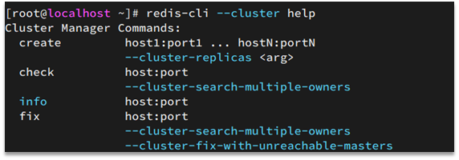

比如，添加节点的命令：

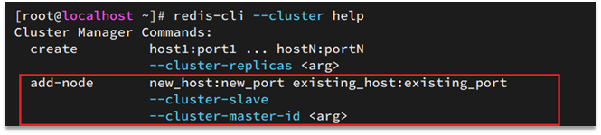

<br>

##### 例——向集群中添加一个新的master节点，并向其中存储 num = 10

###### 需求1

- 启动一个新的redis实例，端口为7004
- 添加7004到之前的集群，并作为一个master节点
- 给7004节点分配插槽，使得num这个key可以存储到7004实例

###### 需求2

- 删除该节点

###### 实现步骤

1. ……………………

<br>

---

<div STYLE="page-break-after: always;">
    <br>
	<br>
	<br>
	<br>
	<br>
</div>

### 10.5.4	故障转移

##### 集群中 master 宕机后会发生什么

1. 首先是该实例与其它实例失去连接
2. 然后是疑似宕机：

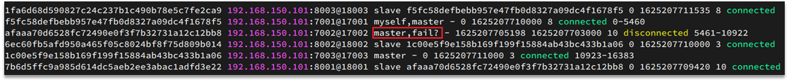

3. 最后是确定下线，自动提升一个slave为新的master：

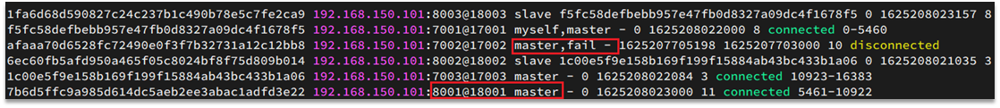

<br>

##### 数据迁移

利用cluster failover命令可以手动让集群中的某个master宕机，切换到执行cluster failover命令的这个slave节点，实现无感知的数据迁移。其流程如下：

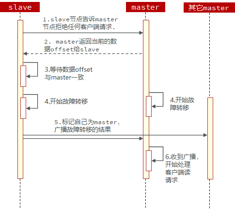

手动的Failover支持三种不同模式：

- 缺省：默认的流程，如图1~6歩
- force：省略了对offset的一致性校验
- takeover：直接执行第5歩，忽略数据一致性、忽略master状态和其它master的意见

<br>

##### 例——在7002这个slave节点执行手动故障转移，重新夺回master地位

###### 步骤

1.利用redis-cli连接7002这个节点

2.执行cluster failover命令

<br>

---

<div STYLE="page-break-after: always;">
    <br>
	<br>
	<br>
	<br>
	<br>
</div>

### 10.5.6	RedisTemplate访问分片集群

##### RedisTemplate 访问分片集群步骤

RedisTemplate底层同样基于lettuce实现了分片集群的支持，而使用的步骤与哨兵模式基本一致：

1. 引入redis的starter依赖
2. 配置分片集群地址
3. 配置读写分离

与哨兵模式相比，其中只有分片集群的配置方式略有差异，如下：

```yaml
spring:
	redis:
    	cluster:
        	nodes: # 指定分片集群的每一个节点信息
            	- 192.168.150.101:7001
                - 192.168.150.101:7002
                - 192.168.150.101:7003
                - 192.168.150.101:8001
                - 192.168.150.101:8002
                - 192.168.150.101:8003
```

<br>

---

<div STYLE="page-break-after: always;">
    <br>
	<br>
	<br>
	<br>
	<br>
</div>

