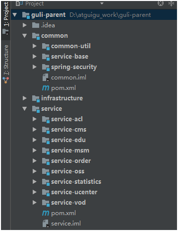

# 微服务工程构建

## 1	基本项目构建

##### 一般微服务的工程结构



**guli-parent：根目录（父工程），管理四个子模块：**

- **canal-client：canal数据库表同步模块（统计同步数据）**
- **common**：公共模块父节点
  - **common-util**：工具类模块，所有模块都可以依赖于它。
  - **service-base**：service 服务的 base 包，包含 service 服务的公共配置类，所有 service 模块依赖于它
  - **spring-security**：认证与授权模块，需要认证授权的 service 服务依赖于它

- **infrastructure**：基础服务模块父节点。

  - **api-gateway**：api网关服务

- **service**：api 接口服务的父节点
  - service-acl：用户权限管理api接口服务（用户管理、角色管理和权限管理等）
  - service-cms：cms api接口服务
  - service-edu：教学相关api接口服务
  - service-msm：短信api接口服务
  - service-order：订单相关api接口服务
  - service-oss：阿里云oss api接口服务
  - service-statistics：统计报表api接口服务
  - service-ucenter：会员api接口服务
  - service-vod：视频点播api接口服务

  <br>

##### 创建父工程

###### 第一步

在 idea 开发工具中，使用 Spring Initializr 快速初始化一个 Spring Boot 模块。

###### 第二步

删除 src 目录。

###### 第三步

将打包类型设置为 pom（默认为 pom，一般不需要设置）。

###### 第四步

删除 pom.xml 中的 \<dependencies> 内容：

```
    <!-- 以下内容删除 -->
    <dependencies>
        <dependency>
            <groupId>org.springframework.boot</groupId>
            <artifactId>spring-boot-starter</artifactId>
        </dependency>

        <dependency>
            <groupId>org.springframework.boot</groupId>
            <artifactId>spring-boot-starter-test</artifactId>
            <scope>test</scope>
        </dependency>
    </dependencies>
```

添加 \<properties> 确定依赖的版本

```xml
<properties>
    <java.version>1.8</java.version>
    <guli.version>0.0.1-SNAPSHOT</guli.version>
    <mybatis-plus.version>3.0.5</mybatis-plus.version>
    <velocity.version>2.0</velocity.version>
    <swagger.version>2.7.0</swagger.version>
    <aliyun.oss.version>2.8.3</aliyun.oss.version>
    <jodatime.version>2.10.1</jodatime.version>
    <poi.version>3.17</poi.version>
    <commons-fileupload.version>1.3.1</commons-fileupload.version>
    <commons-io.version>2.6</commons-io.version>
    <httpclient.version>4.5.1</httpclient.version>
    <jwt.version>0.7.0</jwt.version>
    <aliyun-java-sdk-core.version>4.3.3</aliyun-java-sdk-core.version>
    <aliyun-sdk-oss.version>3.1.0</aliyun-sdk-oss.version>
    <aliyun-java-sdk-vod.version>2.15.2</aliyun-java-sdk-vod.version>
    <aliyun-java-vod-upload.version>1.4.11</aliyun-java-vod-upload.version>
    <aliyun-sdk-vod-upload.version>1.4.11</aliyun-sdk-vod-upload.version>
    <fastjson.version>1.2.28</fastjson.version>
    <gson.version>2.8.2</gson.version>
    <json.version>20170516</json.version>
    <commons-dbutils.version>1.7</commons-dbutils.version>
    <canal.client.version>1.1.0</canal.client.version>
    <docker.image.prefix>zx</docker.image.prefix>
    <cloud-alibaba.version>0.2.2.RELEASE</cloud-alibaba.version>
</properties>
```

配置 \<dependencyManagement> 锁定依赖的版本：

```xml
<dependencyManagement>
    <dependencies>
        <!--Spring Cloud-->
        <dependency>
            <groupId>org.springframework.cloud</groupId>
            <artifactId>spring-cloud-dependencies</artifactId>
            <version>Hoxton.RELEASE</version>
            <type>pom</type>
            <scope>import</scope>
        </dependency>

        <dependency>
            <groupId>org.springframework.cloud</groupId>
            <artifactId>spring-cloud-alibaba-dependencies</artifactId>
            <version>${cloud-alibaba.version}</version>
            <type>pom</type>
            <scope>import</scope>
        </dependency>
        <!--mybatis-plus 持久层-->
        <dependency>
            <groupId>com.baomidou</groupId>
            <artifactId>mybatis-plus-boot-starter</artifactId>
            <version>${mybatis-plus.version}</version>
        </dependency>

        <!-- velocity 模板引擎, Mybatis Plus 代码生成器需要 -->
        <dependency>
            <groupId>org.apache.velocity</groupId>
            <artifactId>velocity-engine-core</artifactId>
            <version>${velocity.version}</version>
        </dependency>

        <!--swagger-->
        <dependency>
            <groupId>io.springfox</groupId>
            <artifactId>springfox-swagger2</artifactId>
            <version>${swagger.version}</version>
        </dependency>
        <!--swagger ui-->
        <dependency>
            <groupId>io.springfox</groupId>
            <artifactId>springfox-swagger-ui</artifactId>
            <version>${swagger.version}</version>
        </dependency>

        <!--aliyunOSS-->
        <dependency>
            <groupId>com.aliyun.oss</groupId>
            <artifactId>aliyun-sdk-oss</artifactId>
            <version>${aliyun.oss.version}</version>
        </dependency>

        <!--日期时间工具-->
        <dependency>
            <groupId>joda-time</groupId>
            <artifactId>joda-time</artifactId>
            <version>${jodatime.version}</version>
        </dependency>

        <!--xls-->
        <dependency>
            <groupId>org.apache.poi</groupId>
            <artifactId>poi</artifactId>
            <version>${poi.version}</version>
        </dependency>
        <!--xlsx-->
        <dependency>
            <groupId>org.apache.poi</groupId>
            <artifactId>poi-ooxml</artifactId>
            <version>${poi.version}</version>
        </dependency>

        <!--文件上传-->
        <dependency>
            <groupId>commons-fileupload</groupId>
            <artifactId>commons-fileupload</artifactId>
            <version>${commons-fileupload.version}</version>
        </dependency>

        <!--commons-io-->
        <dependency>
            <groupId>commons-io</groupId>
            <artifactId>commons-io</artifactId>
            <version>${commons-io.version}</version>
        </dependency>

        <!--httpclient-->
        <dependency>
            <groupId>org.apache.httpcomponents</groupId>
            <artifactId>httpclient</artifactId>
            <version>${httpclient.version}</version>
        </dependency>

        <dependency>
            <groupId>com.google.code.gson</groupId>
            <artifactId>gson</artifactId>
            <version>${gson.version}</version>
        </dependency>

        <!-- JWT -->
        <dependency>
            <groupId>io.jsonwebtoken</groupId>
            <artifactId>jjwt</artifactId>
            <version>${jwt.version}</version>
        </dependency>

        <!--aliyun-->
        <dependency>
            <groupId>com.aliyun</groupId>
            <artifactId>aliyun-java-sdk-core</artifactId>
            <version>${aliyun-java-sdk-core.version}</version>
        </dependency>
        <dependency>
            <groupId>com.aliyun.oss</groupId>
            <artifactId>aliyun-sdk-oss</artifactId>
            <version>${aliyun-sdk-oss.version}</version>
        </dependency>
        <dependency>
            <groupId>com.aliyun</groupId>
            <artifactId>aliyun-java-sdk-vod</artifactId>
            <version>${aliyun-java-sdk-vod.version}</version>
        </dependency>
        <dependency>
            <groupId>com.aliyun</groupId>
            <artifactId>aliyun-java-vod-upload</artifactId>
            <version>${aliyun-java-vod-upload.version}</version>
        </dependency>
        <dependency>
            <groupId>com.aliyun</groupId>
            <artifactId>aliyun-sdk-vod-upload</artifactId>
            <version>${aliyun-sdk-vod-upload.version}</version>
        </dependency>
        <dependency>
            <groupId>com.alibaba</groupId>
            <artifactId>fastjson</artifactId>
            <version>${fastjson.version}</version>
        </dependency>
        <dependency>
            <groupId>org.json</groupId>
            <artifactId>json</artifactId>
            <version>${json.version}</version>
        </dependency>

        <dependency>
            <groupId>commons-dbutils</groupId>
            <artifactId>commons-dbutils</artifactId>
            <version>${commons-dbutils.version}</version>
        </dependency>

        <dependency>
            <groupId>com.alibaba.otter</groupId>
            <artifactId>canal.client</artifactId>
            <version>${canal.client.version}</version>
        </dependency>
    </dependencies>
</dependencyManagement>
```


##### 创建 service 模块

###### 第一步

在父工程下创建子模块 service，选择 maven 类型。

###### 第二步

将 service 模块的打包类型设置为 pom，即在 \<artifactId> 节点后添加以下属性：

```
	...
	
    <artifactId>service</artifactId>
    <!-- 将打包类型设置为 pom -->
    <packaging>pom</packaging>
	...
```

###### 第三步

添加项目必要的依赖

```xml
<dependencies>
    <dependency>
        <groupId>org.springframework.cloud</groupId>
        <artifactId>spring-cloud-starter-netflix-ribbon</artifactId>
    </dependency>

    <!--hystrix依赖，主要是用  @HystrixCommand -->
    <dependency>
        <groupId>org.springframework.cloud</groupId>
        <artifactId>spring-cloud-starter-netflix-hystrix</artifactId>
    </dependency>

    <!--服务注册-->
    <dependency>
        <groupId>org.springframework.cloud</groupId>
        <artifactId>spring-cloud-starter-alibaba-nacos-discovery</artifactId>
    </dependency>
    <!--服务调用-->
    <dependency>
        <groupId>org.springframework.cloud</groupId>
        <artifactId>spring-cloud-starter-openfeign</artifactId>
    </dependency>

    <dependency>
        <groupId>org.springframework.boot</groupId>
        <artifactId>spring-boot-starter-web</artifactId>
    </dependency>

    <!--mybatis-plus-->
    <dependency>
        <groupId>com.baomidou</groupId>
        <artifactId>mybatis-plus-boot-starter</artifactId>
    </dependency>

    <!--mysql-->
    <dependency>
        <groupId>mysql</groupId>
        <artifactId>mysql-connector-java</artifactId>
    </dependency>

    <!-- velocity 模板引擎, Mybatis Plus 代码生成器需要 -->
    <dependency>
        <groupId>org.apache.velocity</groupId>
        <artifactId>velocity-engine-core</artifactId>
    </dependency>

    <!--swagger-->
    <dependency>
        <groupId>io.springfox</groupId>
        <artifactId>springfox-swagger2</artifactId>
    </dependency>
    <dependency>
        <groupId>io.springfox</groupId>
        <artifactId>springfox-swagger-ui</artifactId>
    </dependency>

    <!--xls-->
    <dependency>
        <groupId>org.apache.poi</groupId>
        <artifactId>poi</artifactId>
    </dependency>

    <dependency>
        <groupId>org.apache.poi</groupId>
        <artifactId>poi-ooxml</artifactId>
    </dependency>

    <dependency>
        <groupId>commons-fileupload</groupId>
        <artifactId>commons-fileupload</artifactId>
    </dependency>

    <!--httpclient-->
    <dependency>
        <groupId>org.apache.httpcomponents</groupId>
        <artifactId>httpclient</artifactId>
    </dependency>
    
    <!--commons-io-->
    <dependency>
        <groupId>commons-io</groupId>
        <artifactId>commons-io</artifactId>
    </dependency>
    
    <!--gson-->
    <dependency>
        <groupId>com.google.code.gson</groupId>
        <artifactId>gson</artifactId>
    </dependency>

    <dependency>
        <groupId>junit</groupId>
        <artifactId>junit</artifactId>
        <version>4.12</version>
    </dependency>
</dependencies>
```

<br>

##### 在 Service 下创建微服务子模块

###### 创建微服务子模块

在 service 模块下创建 service 子模块 service-module，选择 maven 类型。

###### 配置文件

application.yml

```yaml
profiles:
  active: dev

server:
  port: 8001 #配置端口号

# mybatis-plus 配置
mybatis-plus:
  configuration:
    log-impl: org.apache.ibatis.logging.stdout.StdOutImpl # mybatis-plus 日志
  mapper-locations: classpath:cn/nilnullnaught/service/*/mapper/*.xml
  global-config:
    db-config:
      logic-delete-value: 1
      logic-not-delete-value: 0

spring:
  application:
    name: service-edu #配置服务名
  #数据库配置
  datasource:
    type: com.zaxxer.hikari.HikariDataSource #使用 Hikari 数据库连接池
    driver-class-name: com.mysql.cj.jdbc.Driver
    url: jdbc:mysql://8.131.72.52:3306/edu?useSSL=false
    username: Outsider
    password: PASSWORDis1024
    hikari:
      connection-test-query: SELECT 1
      connection-timeout: 60000
      idle-timeout: 500000
      max-lifetime: 540000
      maximum-pool-size: 12
      minimum-idle: 10
      pool-name: EduHikariPool
      time-zone: GMT+8
  #统一返回的 json 时间格式
  jackson:
    date-format: yyyy-MM-dd HH:mm:ss
    time-zone: GMT+8 #默认情况下json时间格式带有时区，并且是世界标准时间，和我们的时间差了八个小时
```

<br>

##### 创建 common 模块

###### 第一步

在父工程下创建 maven 模块 common。

###### 第二步

在 common 中引入依赖：

```xml
<dependencies>
        <dependency>
            <groupId>org.springframework.boot</groupId>
            <artifactId>spring-boot-starter-web</artifactId>
            <scope>provided </scope>
        </dependency>

        <!--mybatis-plus-->
        <dependency>
            <groupId>com.baomidou</groupId>
            <artifactId>mybatis-plus-boot-starter</artifactId>
            <scope>provided </scope>
        </dependency>

        <!--lombok用来简化实体类：需要安装lombok插件-->
        <dependency>
            <groupId>org.projectlombok</groupId>
            <artifactId>lombok</artifactId>
            <scope>provided </scope>
        </dependency>

        <!--swagger-->
        <dependency>
            <groupId>io.springfox</groupId>
            <artifactId>springfox-swagger2</artifactId>
            <scope>provided </scope>
        </dependency>
        <dependency>
            <groupId>io.springfox</groupId>
            <artifactId>springfox-swagger-ui</artifactId>
            <scope>provided </scope>
        </dependency>

        <!-- redis -->
        <dependency>
            <groupId>org.springframework.boot</groupId>
            <artifactId>spring-boot-starter-data-redis</artifactId>
        </dependency>

        <!-- spring2.X集成redis所需common-pool2
        <dependency>
            <groupId>org.apache.commons</groupId>
            <artifactId>commons-pool2</artifactId>
            <version>2.6.0</version>
        </dependency>-->
    </dependencies>
```

<br>

##### 创建 common 的子模块 service-base

在该模块下创建包 cn.nilnullnaught.servicebase

<br>

##### 创建 common 的子模块 common-utils

在该模块下创建包 cn.nilnullnaught.commonutils

<br>


---

<div STYLE="page-break-after: always;">
    <br>
	<br>
	<br>
	<br>
	<br>
</div>
## 2	使用代码生成器

### 2.1	MP 代码生成器

##### 创建代码生成器

###### 前提条件

已经导入 mybatisplus 依赖。

###### 生成器代码

在 test/java 目录下创建包com.atguigu.eduservice，创建代码生成器：`CodeGenerator.java`

```java
package cn.nilnullnaught.eduservice;

import com.baomidou.mybatisplus.annotation.DbType;
import com.baomidou.mybatisplus.annotation.IdType;
import com.baomidou.mybatisplus.generator.AutoGenerator;
import com.baomidou.mybatisplus.generator.config.DataSourceConfig;
import com.baomidou.mybatisplus.generator.config.GlobalConfig;
import com.baomidou.mybatisplus.generator.config.PackageConfig;
import com.baomidou.mybatisplus.generator.config.StrategyConfig;
import com.baomidou.mybatisplus.generator.config.rules.DateType;
import com.baomidou.mybatisplus.generator.config.rules.NamingStrategy;
import org.junit.Test;

public class CodeGenerator {
    public class getCode {
        @Test
        public void main1() {
            // 1、创建代码生成器
            AutoGenerator mpg = new AutoGenerator();
            // 2、全局配置
            GlobalConfig gc = new GlobalConfig();
            String projectPath = System.getProperty("user.dir");
            System.out.println(projectPath);
            //建议修改，将 projectPath 手动替换为项目的绝对路径
            gc.setOutputDir(projectPath + "/src/main/java");
            //需要修改，数据表名
            gc.setAuthor("");
            gc.setOpen(false); //生成后是否打开资源管理器
            gc.setFileOverride(false); //重新生成时文件是否覆盖
            /*
             * mp生成service层代码，默认接口名称第一个字母有 I
             * UcenterService
             * */
            gc.setServiceName("%sService"); //去掉Service接口的首字母I
            gc.setIdType(IdType.ID_WORKER); //主键策略
            gc.setDateType(DateType.ONLY_DATE);//定义生成的实体类中日期类型
            gc.setSwagger2(true);//开启Swagger2模式
            mpg.setGlobalConfig(gc);
            // 3、数据源配置
            DataSourceConfig dsc = new DataSourceConfig();
            //需要修改，数据库 url
            dsc.setUrl("jdbc:mysql://localhost:3306/guli?serverTimezone=GMT%2B8");
            dsc.setDriverName("com.mysql.cj.jdbc.Driver");
            //需要修改，数据库访问名
            dsc.setUsername("root");
            //需要修改，数据库密码
            dsc.setPassword("root");
            dsc.setDbType(DbType.MYSQL);
            mpg.setDataSource(dsc);
            // 4、包配置
            PackageConfig pc = new PackageConfig();
            //需要修改，模块名
            pc.setModuleName("serviceedu"); 
            //需要修改，组织名
            pc.setParent("cn.nilnullnaught");
            pc.setController("controller");
            pc.setEntity("entity");
            pc.setService("service");
            pc.setMapper("mapper");
            mpg.setPackageInfo(pc);
            // 5、策略配置
            StrategyConfig strategy = new StrategyConfig();
            //需要修改，数据表名
            strategy.setInclude("edu_teacher");
            strategy.setNaming(NamingStrategy.underline_to_camel);//数据库表映射到实体的命名策略
            strategy.setTablePrefix(pc.getModuleName() + "_"); //生成实体时去掉表前缀
            strategy.setColumnNaming(NamingStrategy.underline_to_camel);//数据库表字段映射到实体的命名策略
            strategy.setEntityLombokModel(true); // lombok 模型 @Accessors(chain = true) setter链式操作
            strategy.setRestControllerStyle(true); //restful api风格控制器
            strategy.setControllerMappingHyphenStyle(true); //url中驼峰转连字符
            mpg.setStrategy(strategy);
            // 6、执行
            mpg.execute();
        }
    }
}

```

<br>

---

<div STYLE="page-break-after: always;">
    <br>
	<br>
	<br>
	<br>
	<br>
</div>

## 3	编写后台管理api接口

##### 创建 SpringBoot 启动类

```
@SpringBootApplication
public class EduApplication {

	public static void main(String[] args) {
		SpringApplication.run(EduApplication.class, args);
	}
}
```

<br>

##### 创建 SpringBoot 配置类

创建 config 包，在 config 创建配置类：

```java
/** 以 MyBatis-Plus 配置类为例 */
package cn.nilnullnaught.serviceedu.config;

@Configuration
@EnableTransactionManagement
@MapperScan("cn.nilnullnaught.serviceedu.mapper")
public class MyBatisPlusConfig {

}
```

<br>

##### 编写 controller 代码

```java
@Autowired
private TeacherService teacherService;

//测试代码，查询表中所有数据
@GetMapping
public List<Teacher> list(){
    return teacherService.list(null);
}
```

<br>

---

<div STYLE="page-break-after: always;">
    <br>
	<br>
	<br>
	<br>
	<br>
</div>

## 4	配置 Swagger2

##### 配置

###### 第一步

在 common > service-base 中创建 config 包，并创建swagger 的配置类

```java
package cn.nilnullnaught.servicebase.config;

import com.google.common.base.Predicates;

import org.springframework.context.annotation.Bean;
import org.springframework.context.annotation.Configuration;
import springfox.documentation.builders.ApiInfoBuilder;
import springfox.documentation.builders.PathSelectors;
import springfox.documentation.service.ApiInfo;
import springfox.documentation.service.Contact;
import springfox.documentation.spi.DocumentationType;
import springfox.documentation.spring.web.plugins.Docket;
import springfox.documentation.swagger2.annotations.EnableSwagger2;

@Configuration
@EnableSwagger2
public class SwaggerConfig {

    @Bean
    public Docket webApiConfig(){

        return new Docket(DocumentationType.SWAGGER_2)
                .groupName("webApi")
                .apiInfo(webApiInfo())
                .select()
                .paths(Predicates.not(PathSelectors.regex("/admin/.*")))
                .paths(Predicates.not(PathSelectors.regex("/error.*")))
                .build();

    }

    private ApiInfo webApiInfo(){

        return new ApiInfoBuilder()
                .title("网站-课程中心 API 文档")
                .description("本文档描述了课程中心微服务接口定义")
                .version("1.0")
                .contact(new Contact("java", "http://atguigu.com", "55317332@qq.com"))
                .build();
    }
}
```

###### 第二步

在 service 模块中引入 service-base

```xml
        <!--引入 service-base 模块-->
        <dependency>
            <groupId>cn.nilnullnaught</groupId>
            <artifactId>service-base</artifactId>
            <version>0.0.1-SNAPSHOT</version>
        </dependency>
```

###### 第三步

在微服务子模块（如 service-edu ）的启动类上添加注解，进行测试：

```java
@@SpringBootApplication
@ComponentScan(basePackages = {"cn.nilnullnaught"})
public class EduApplication {

    public static void main(String[] args) {
        SpringApplication.run(EduApplication.class, args);
    }
}
```

<br>

##### 定义接口说明和参数说明

- @Api：定义在类上。
- @ApiOperation：定义在方法上。
- @ApiParam：定义在参数上。

示例代码：

```xml
Api(description="讲师管理")
@RestController
@RequestMapping("/admin/edu/teacher")
public class TeacherAdminController {

	@Autowired
	private TeacherService teacherService;

	@ApiOperation(value = "所有讲师列表")
	@GetMapping
	public List<Teacher> list(){
		return teacherService.list(null);
	}

	@ApiOperation(value = "根据ID删除讲师")
	@DeleteMapping("{id}")
	public boolean removeById(
			@ApiParam(name = "id", value = "讲师ID", required = true)
			@PathVariable String id){
		return teacherService.removeById(id);
	}
}
```

<br>

---

<div STYLE="page-break-after: always;">
    <br>
	<br>
	<br>
	<br>
	<br>
</div>

## 5	统一返回数据格式

##### 统一返回数据格式的作用

项目中我们会将响应封装成 json 返回，所以一般我们会将所有接口的数据格式统一， 使前端（iOS Android, Web）对数据的操作更一致、轻松。

<br>

##### 统一返回数据格式的需求

一般情况下，统一返回数据格式没有固定的格式，只要能描述清楚返回的数据状态以及要返回的具体数据就可以。但是一般会包含状态码、返回消息、数据这几部分内容

例如，我们的系统要求返回的基本数据格式如下：

**列表：**

```
{
  "success": true,
  "code": 20000,
  "message": "成功",
  "data": {
    "items": [
      {
        "id": "1",
        "name": "刘德华",
        "intro": "毕业于师范大学数学系，热爱教育事业，执教数学思维6年有余"
      }
    ]
  }
}
```

**分页：**

```
{
  "success": true,
  "code": 20000,
  "message": "成功",
  "data": {
    "total": 17,
    "rows": [
      {
        "id": "1",
        "name": "刘德华",
        "intro": "毕业于师范大学数学系，热爱教育事业，执教数学思维6年有余"
      }
    ]
  }
}
```

**没有返回数据：**

```
{
  "success": true,
  "code": 20000,
  "message": "成功",
  "data": {}
}
```

**失败：**

```
{
  "success": false,
  "code": 20001,
  "message": "失败",
  "data": {}
}
```

因此，我们定义统一结果：

```
{
  "success": 布尔, //响应是否成功
  "code": 数字, //响应码
  "message": 字符串, //返回消息
  "data": HashMap //返回数据，放在键值对中
}
```

<br>

##### 实现统一返回数据格式

###### 第一步

在 common-utils 的 cn.nilnullnaught.commonutils 包下创建枚举类，定义返回码（也可以通过接口方式实现）：

```java
package cn.nilnullnaught.commonutils;

public enum ResultCode {


    SUCCESS(20000),
    ERROR(20001);
    
    public int code;

    ResultCode(int code) {
        this.code = code;
    }
}

```

###### 第二步

在 common-utils 的 cn.nilnullnaught.commonutils 包下创建结果类：

```java
public class ResponseResult {

    @ApiModelProperty(value = "是否成功")
    private Boolean success;

    @ApiModelProperty(value = "返回码")
    private Integer code;

    @ApiModelProperty(value = "返回消息")
    private String message;

    @ApiModelProperty(value = "返回数据")
    private Map<String, Object> data = new HashMap<String, Object>();

    private ResponseResult(){}

    public static ResponseResult ok(){
        ResponseResult r = new ResponseResult();
        r.setSuccess(true);
        r.setCode(ResultCode.SUCCESS.code);
        r.setMessage("成功");
        return r;
    }

    public static ResponseResult error(){
        ResponseResult r = new ResponseResult();
        r.setSuccess(false);
        r.setCode(ResultCode.ERROR.code);
        r.setMessage("失败");
        return r;
    }

    public ResponseResult success(Boolean success){
        this.setSuccess(success);
        return this;
    }

    public ResponseResult message(String message){
        this.setMessage(message);
        return this;
    }

    public ResponseResult code(Integer code){
        this.setCode(code);
        return this;
    }

    public ResponseResult data(String key, Object value){
        this.data.put(key, value);
        return this;
    }

    public ResponseResult data(Map<String, Object> map){
        this.setData(map);
        return this;
    }


    ......省略 getter 与 setter
}
```

<br>

##### 使用统一返回结果

###### 第一步

在 service 模块中添加 commonutils 依赖

```xml
        <dependency>
            <groupId>cn.nilnullnaught</groupId>
            <artifactId>common-utils</artifactId>
            <version>0.0.1-SNAPSHOT</version>
        </dependency>
```

###### 第二步

修改 Controller 中的返回结果

```java
@ApiOperation(value = "所有讲师列表")
@GetMapping
public R list(){
    List<Teacher> list = teacherService.list(null);
    return R.ok().data("items", list);
}
```


---

<div STYLE="page-break-after: always;">
    <br>
	<br>
	<br>
	<br>
	<br>
</div>

## 4	基本功能实现

### 4.1	逻辑删除

##### 实现步骤

###### 第一步

在配置文件中开启逻辑删除（已完成）。

###### 第二步

在 MyBatisPlusConfig 中配置逻辑删除插件：

```java
/** 逻辑删除插件 */
@Bean
public ISqlInjector sqlInjector() {
    return new LogicSqlInjector();
}
```

###### 第三步

在 Controler 中 添加删除方法

```java
@DeleteMapping("{id}")
public boolean removeById(@PathVariable String id){
    return teacherService.removeById(id);
}
```

<br>

---

<div STYLE="page-break-after: always;">
    <br>
	<br>
	<br>
	<br>
	<br>
</div>

### 5.2	自动填充

##### 步骤

###### 第一步

在需要进行自动填充的字段对应的实体类属性上添加 `@TableField` 注解

```java
@ApiModelProperty(value = "创建时间")
@TableField(fill = FieldFill.INSERT)
private Date gmtCreate;

@ApiModelProperty(value = "更新时间")
@TableField(fill = FieldFill.INSERT_UPDATE)
private Date gmtModified;
```

###### 第二步

在 common > service-base 模块下创建 handler 包。

###### 第三步

在 handler 包下实现元对象处理器接口 MyMetaObjectHandler.java

```
package com.atguigu.servicebase.handler;

import com.baomidou.mybatisplus.core.handlers.MetaObjectHandler;
import org.apache.ibatis.reflection.MetaObject;
import org.springframework.stereotype.Component;

import java.util.Date;

@Component
public class MyMetaObjectHandler implements MetaObjectHandler {
    @Override
    public void insertFill(MetaObject metaObject) {
        //属性名称，不是字段名称
        this.setFieldValByName("gmtCreate", new Date(), metaObject);
        this.setFieldValByName("gmtModified", new Date(), metaObject);
    }

    @Override
    public void updateFill(MetaObject metaObject) {
        this.setFieldValByName("gmtModified", new Date(), metaObject);
    }
}
```

<br>

---

<div STYLE="page-break-after: always;">
    <br>
	<br>
	<br>
	<br>
	<br>
</div>

### 4.2	跨域配置

##### 实现跨域

在 Controller 上添加注解 `@CrossOrigin`。

<br>

---

<div STYLE="page-break-after: always;">
    <br>
	<br>
	<br>
	<br>
	<br>
</div>
