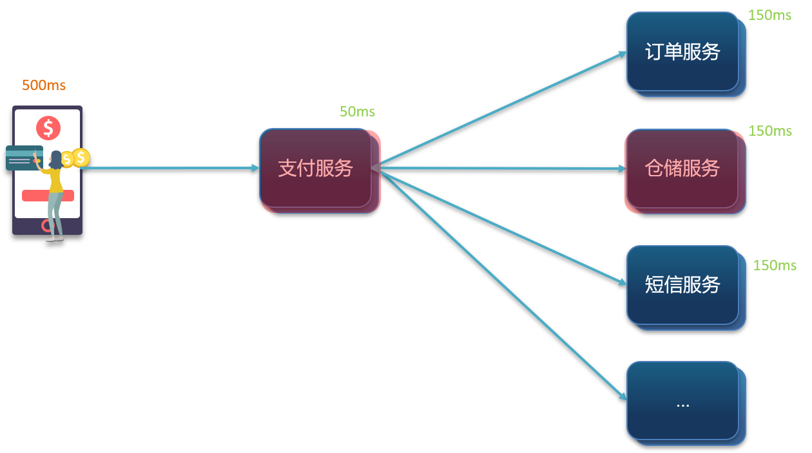
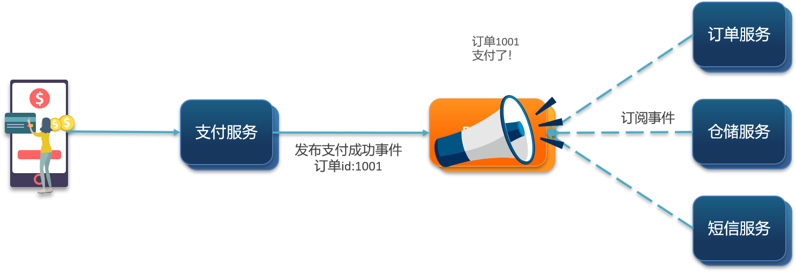

# 1	概述

## 1.1	同步通讯和异步通讯

##### 微服务之间的通讯两种通讯方式

微服务间通讯有同步和异步两种方式：

- **同步通讯**：就像打电话，需要实时响应。
- **异步通讯**：就像发邮件，不需要马上回复。

两种方式各有优劣，打电话可以立即得到响应，但是你却不能跟多个人同时通话。发送邮件可以同时与多个人收发邮件，但是往往响应会有延迟。  

 

##### 同步通讯的优缺点

微服务间基于 Feign 的调用就属于同步方式，存在一些问题。

###### 优点

- 时效性较强，可以立即得到结果

###### 缺点

- **耦合度高**：每次加入新的需求，都要修改原来的代码
- **性能下降**：调用者需要等待服务提供者响应，如果调用链过长则响应时间等于每次调用的时间之和。
- **资源浪费**：调用链中的每个服务在等待响应过程中，不能释放请求占用的资源，高并发场景下会极度浪费系统资源。
- **级联失败**：如果服务提供者出现问题，所有调用方都会跟着出问题，如同多米诺骨牌一样，迅速导致整个微服务群故障。

 

##### 异步通讯

###### 事件驱动模式

异步调用最常见的实现就是事件驱动模式。

###### 原理

为了解除事件发布者与订阅者之间的耦合，两者并不是直接通信，而是有一个中间人（Broker）。发布者发布事件到 Broker，不关心谁来订阅事件。订阅者从 Broker 订阅事件，不关心谁发来的消息。

Broker 是一个像数据总线一样的东西，所有的服务要接收数据和发送数据都发到这个总线上，这个总线就像协议一样，让服务间的通讯变得标准和可控。

###### 优点

- **吞吐量提升**：无需等待订阅者处理完成，响应更快速。
- **故障隔离**：服务没有直接调用，不存在级联失败问题。
- **耦合度极低**：每个服务都可以灵活插拔，可替换。
- **流量削峰**：不管发布事件的流量波动多大，都由Broker接收，订阅者可以按照自己的速度去处理事件。
- **无阻塞**：调用间没有阻塞，不会造成无效的资源占用。

###### 缺点

- 架构复杂，业务没有明显的流程线，不好管理。
- 需要依赖于 Broker的可靠性、安全性、吞吐能力。

 

---

     
     
     
     
     

## 1.2	MQ 概述

##### 什么是 MQ

MQ （MessageQueue），即消息队列，又称消息中间件，字面来看就是存放消息的队列。也就是事件驱动架构中的 Broker。

 

##### 几种常见的 MQ 实现

|            | **RabbitMQ**            | **ActiveMQ**                   | **RocketMQ** | **Kafka**  |
| ---------- | ----------------------- | ------------------------------ | ------------ | ---------- |
| 公司/社区  | Rabbit                  | Apache                         | 阿里         | Apache     |
| 开发语言   | Erlang                  | Java                           | Java         | Scala&Java |
| 协议支持   | AMQP，XMPP，SMTP，STOMP | OpenWire,STOMP，REST,XMPP,AMQP | 自定义协议   | 自定义协议 |
| 可用性     | **高**                  | 一般                           | **高**       | **高**     |
| 单机吞吐量 | 一般                    | 差                             | **高**       | **非常高** |
| 消息延迟   | **微秒级**              | 毫秒级                         | 毫秒级       | 毫秒以内   |
| 消息可靠性 | 高                      | 一般                           | 高           | 一般       |

 

---

     
     
     
     
     

