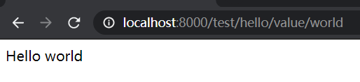
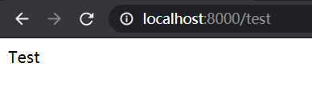
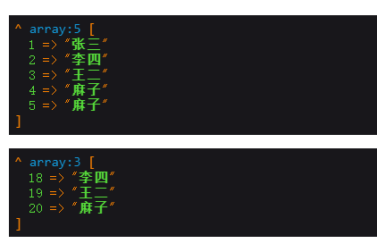
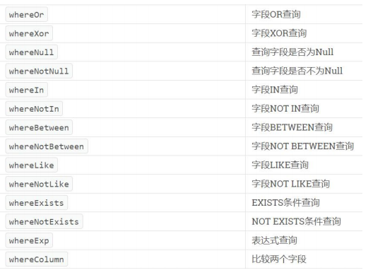

# 1	ThinkPHP

## 1.1	概述

##### ThinkPHP 简介

- ThinkPHP是一个免开源的、快速简单的、面向对象的 **轻量级PHP开发框架**，是为了敏捷 WEB 应用开发和简化企业应用开发而生。ThinkPHP从诞生以来一直秉承简洁实用的设计原则，在保持出色的性能和至简代码的同时，更注重易用性。

<br>

##### ThinkPHP 的开源协议

- ThinkPHP 遵循 `Apache2` 开源许可协议发布，意味着你可以免费使用 ThinkPHP，甚至允许把你基于 ThinkPHP 开发的应用开源或商业产品发布/销售。

<br>

##### ThinkPHP 6.0 主要新特性

1. 采用 PHP7 强类型（严格模式）
2. 支持更多的 PSR 规范
3. 多应用支持
4. `ORM` 组件独立
5. 改进的中间件机制
6. 更强大和易用的查询
7. 全新的事件系统
8. 支持容器 `invoke` 回调
9. 模板引擎组件独立
10. 内部功能中间件化
11. SESSION 机制改进
12. 缓存及日志支持多通道
13. 引入 `Filesystem` 组件
14. 对 `Swoole` 以及协程支持改进
15. 对 IDE 更加友好。
16. 统一和精简大量用法。

<br>

-------

<div STYLE="page-break-after: always;"></div>

## 1.2	Hello World

### 1.2.1	Windows 环境下安装 ThinkPHP6.0

##### 步骤

1. 下载并安装 Composer[^Composer]。

2. 如果是第一次安装，切换到 WEB 根目录下面并执行下面的命令：

   ```shell
   #安装稳定版 ThinkPHP
   composer create-project topthink/think tp
   ```

3. 开启调试模式。由于应用默认是部署模式，在开发阶段，可以修改环境变量 `APP_DEBUG` 开启调试模式，上线部署后切换到部署模式。


<br>

##### .env 文件

- **说明**：环境变量文件。本地开发时可以在应用根目录下面定义 `.env` 文件。
- **.example.env 文件**：通过 Composrer 的 `create-project` 命令安装 ThinkPHP 后，在根目录会自带一个 `.example.env` 文件（环境变量示例文件），你可以直接更名为 `.env` 文件并根据你的要求进行修改。*（该示例文件已经开启调试模式）*


<br>

---

<div STYLE="page-break-after: always;"></div>

### 1.2.2	测试运行

##### 步骤

1. 进入命令行下面，执行下面指令

   ```shell
   php think run
   ```

2. 在浏览器中输入地址：

   ```php
   http://localhost:8000/
   ```

3. 进入欢迎页面。


<br>

---

<div STYLE="page-break-after: always;"></div>

## 1.3	ThinkPHP 编程规范

##### 目录和文件

- 目录使用小写 + 下划线；
- 类库、函数文件统一以 `.php` 为后缀；
- 类的文件名均以命名空间定义，并且命名空间的路径和类库文件所在路径一致；
- 类*（包含接口和 Trait）*文件采用驼峰法命名*（首字母大写）*，其它文件采用小写 + 下划线命名；
- 类名*（包括接口和 Trait）*和文件名保持一致，统一采用驼峰法命名（首字母大写）；


<br>

##### 函数和类、属性命名

- 类的命名采用驼峰法*（首字母大写）*，例如 `User`、`UserType`；
- 函数的命名使用小写字母和下划线（小写字母开头）的方式，例如 `get_client_ip`；
- 方法的命名使用驼峰法（首字母小写），例如 `getUserName`；
- 属性的命名使用驼峰法（首字母小写），例如 `tableName`、`instance`；
- 特例：以双下划线`__`打头的函数或方法作为魔术方法，例如 `__call` 和 `__autoload`；


<br>

##### 常量和配置

- 常量以大写字母和下划线命名，例如 `APP_PATH`；
- 配置参数以小写字母和下划线命名，例如 `url_route_on` 和`url_convert`；
- 环境变量定义使用大写字母和下划线命名，例如 `APP_DEBUG`；


<br>

##### 数据表和字段

- 数据表和字段采用小写加下划线方式命名，并注意字段名不要以下划线开头，例如 `think_user` 表和 `user_name`字段，不建议使用驼峰和中文作为数据表及字段命名。


<br>

---

<div STYLE="page-break-after: always;"></div>

## 1.4	目录结构

### 1.4.0	ThinkPHP 目录结构

##### 📌ThinkPHP 6.0 多应用部署

- ThinkPHP 6.0 支持多应用模式部署，实际的目录结构取决于采用的是单应用还是多应用模式。


<br>

##### 📌ThinkPHP 部署注意事项

1. 在实际的部署中，请确保只有public目录可以对外访问。
2. 在 mac 或者 linux 环境下面，注意需要设置 runtime 目录权限为 777。


<br>

---

<div STYLE="page-break-after: always;"></div>

### 1.4.1	单应用模

##### 说明

- 默认安装后的目录结构就是一个单应用模式。


<br>

##### 应用结构

```
www  WEB部署目录（或者子目录）
├─app           应用目录
│  ├─controller      控制器目录
│  ├─model           模型目录
│  ├─ ...            更多类库目录
│  │
│  ├─common.php         公共函数文件
│  └─event.php          事件定义文件
│
├─config                配置目录
│  ├─app.php            应用配置
│  ├─cache.php          缓存配置
│  ├─console.php        控制台配置
│  ├─cookie.php         Cookie配置
│  ├─database.php       数据库配置
│  ├─filesystem.php     文件磁盘配置
│  ├─lang.php           多语言配置
│  ├─log.php            日志配置
│  ├─middleware.php     中间件配置
│  ├─route.php          URL和路由配置
│  ├─session.php        Session配置
│  ├─trace.php          Trace配置
│  └─view.php           视图配置
│
├─view            视图目录
├─route                 路由定义目录
│  ├─route.php          路由定义文件
│  └─ ...   
│
├─public                WEB目录（对外访问目录）
│  ├─index.php          入口文件
│  ├─router.php         快速测试文件
│  └─.htaccess          用于apache的重写
│
├─extend                扩展类库目录
├─runtime               应用的运行时目录（可写，可定制）
├─vendor                Composer类库目录
├─.example.env          环境变量示例文件
├─composer.json         composer 定义文件
├─LICENSE.txt           授权说明文件
├─README.md             README 文件
├─think                 命令行入口文件
```


<br>

---

<div STYLE="page-break-after: always;"></div>

### 1.4.2	多应用模式

##### 说明

- 如果你需要一个多应用的项目架构，目录结构可以参考下面的结构进行调整（关于配置文件的详细结构参考后面章节）。


<br>

##### 项目结构

```
www  WEB部署目录（或者子目录）
├─app           应用目录
│  ├─app_name           应用目录
│  │  ├─common.php      函数文件
│  │  ├─controller      控制器目录
│  │  ├─model           模型目录
│  │  ├─view            视图目录
│  │  ├─config          配置目录
│  │  ├─route           路由目录
│  │  └─ ...            更多类库目录
│  │
│  ├─common.php         公共函数文件
│  └─event.php          事件定义文件
│
├─config                全局配置目录
│  ├─app.php            应用配置
│  ├─cache.php          缓存配置
│  ├─console.php        控制台配置
│  ├─cookie.php         Cookie配置
│  ├─database.php       数据库配置
│  ├─filesystem.php     文件磁盘配置
│  ├─lang.php           多语言配置
│  ├─log.php            日志配置
│  ├─middleware.php     中间件配置
│  ├─route.php          URL和路由配置
│  ├─session.php        Session配置
│  ├─trace.php          Trace配置
│  └─view.php           视图配置
│
├─public                WEB目录（对外访问目录）
│  ├─index.php          入口文件
│  ├─router.php         快速测试文件
│  └─.htaccess          用于apache的重写
│
├─extend                扩展类库目录
├─runtime               应用的运行时目录（可写，可定制）
├─vendor                Composer类库目录
├─.example.env          环境变量示例文件
├─composer.json         composer 定义文件
├─LICENSE.txt           授权说明文件
├─README.md             README 文件
├─think                 命令行入口文件
```


<br>

##### 📌多应用部署的注意点

- 多应用模式部署后，需要删除 app 目录下的 controller 目录*（系统根据该目录作为判断是否单应用的依据）*。


<br>

---

<div STYLE="page-break-after: always;"></div>

### 1.4.3	默认应用文件

##### 说明

- 默认安装后，`app`目录下会包含以下文件：

  ```
  ├─app           应用目录
  │  │
  │  ├─BaseController.php    默认基础控制器类
  │  ├─ExceptionHandle.php   应用异常定义文件
  │  ├─common.php            全局公共函数文件
  │  ├─middleware.php        全局中间件定义文件
  │  ├─provider.php          服务提供定义文件
  │  ├─Request.php           应用请求对象
  │  └─event.php             全局事件定义文件
  ```


<br>

##### 📌默认配置文件使用注意点

1. `BaseController.php`、`Request.php` 和`ExceptionHandle.php`三个文件是系统默认提供的基础文件，位置你可以随意移动，但注意要同步调整类的命名空间。
2. 如果不需要使用`Request.php` 和`ExceptionHandle.php`文件，或者要调整类名，必须同步调整`provider.php`文件中的容器对象绑定。


<br>

##### 📌provider.php

- `provider.php`服务提供定义文件只能全局定义，不支持在应用下单独定义。


<br>

---

<div STYLE="page-break-after: always;"></div>

## 1.5	配置文件

### 1.5.0	概述

##### ThinkPHP 配置文件

- **ThinkPHP 的配置文件有两种形式**：
  1. **.env 文件**：. env 环境变量用于本地开发测试，部署后会被忽略
  2. **根目录下的 config**：有很多类型的配置，适用于部署;

<br>

---

<div STYLE="page-break-after: always;"></div>

### 1.5.1	开启调试模式

##### 开启调试模式的方法

- **第一种方法**：直接将根目录下的 `.example.env` 文件修改为 `.env` 文件，该文件中默认开启了调试模式。
- 第二种方法：在 `.env` 文件中修改 `APP_DEBUG` 属性为 `true` 。

<br>

##### 开启调试模式后的好处

1. 记录系统运行流程的执行过程;
2. 展示错误和调试信息，并开启日志记录;
3. 模版修改可以及时生效(不会被缓存干扰);
4. 启动右下角的Trace调试功能，更加强大;
5. 发生异常时，也会显示异常信息。

<br>

##### 📌关闭调试模式时，显示简要的错误提示信息

1. 首先，关闭调试模式 `APP_ DEBUG = false`;
2. 然后，根目录下 `config` 的 `app. php` 最后一项设置为: `show_ error_ msg => true`

<br>

---

<div STYLE="page-break-after: always;"></div>

### 1.5.2	获取配置文件的值

##### 例——获取 .env 文件的值

```php
<?php
namespace app\controller;
use think\facade\Env;

class test
{
    public function index(){
        return Env::get('database.hostname');
    }

    //判断 .env 配置文件是否存在
    public function has(){
        echo Env::has('database.hostname');
    }
}
```

<br>

##### 例——获取 config 文件中的值

```php
<?php
namespace app\controller;
use think\facade\Config;

class test
{
    public function index(){
        return Config::get('database.connections.mysql.hostname');
    }
    
    //判断 .env 配置文件是否存在
    public function has(){
        echo Config::has('database.connections.mysql.hostname');
    }
}
```

<br>

---

<div STYLE="page-break-after: always;"></div>

# 2	框架架构

## 2.1	请求流程

##### 说明

- 对于一个HTTP应用来说，从用户发起请求到响应输出结束，大致的标准请求流程如下：
  1. 载入 `Composer` 的自动加载 `autoload` 文件
  2. 实例化系统应用基础类 `think\App`
  3. 获取应用目录等相关路径信息
  4. 加载全局的服务提供 `provider.php` 文件
  5. 设置容器实例及应用对象实例，确保当前容器对象唯一
  6. 从容器中获取 `HTTP` 应用类 `think\Http`
  7. 执行 `HTTP` 应用类的 `run` 方法启动一个 `HTTP` 应用
  8. 获取当前请求对象实例（默认为 `app\Request` 继承 `think\Request`）保存到容器
  9. 执行 `think\App` 类的初始化方法 `initialize`
  10. 加载环境变量文件 `.env` 和全局初始化文件
  11. 加载全局公共文件、系统助手函数、全局配置文件、全局事件定义和全局服务定义
  12. 判断应用模式（调试或者部署模式）
  13. 监听 `AppInit` 事件
  14. 注册异常处理
  15. 服务注册
  16. 启动注册的服务
  17. 加载全局中间件定义
  18. 监听 `HttpRun` 事件
  19. 执行全局中间件
  20. 执行路由调度（`Route`类`dispatch`方法）
  21. 如果开启路由则检查路由缓存
  22. 加载路由定义
  23. 监听`RouteLoaded`事件
  24. 如果开启注解路由则检测注解路由
  25. 路由检测（中间流程很复杂 略）
  26. 路由调度对象`think\route\Dispatch`初始化
  27. 设置当前请求的控制器和操作名
  28. 注册路由中间件
  29. 绑定数据模型
  30. 设置路由额外参数
  31. 执行数据自动验证
  32. 执行路由调度子类的`exec`方法返回响应`think\Response`对象
  33. 获取当前请求的控制器对象实例
  34. 利用反射机制注册控制器中间件
  35. 执行控制器方法以及前后置中间件
  36. 执行当前响应对象的`send`方法输出
  37. 执行HTTP应用对象的`end`方法善后
  38. 监听`HttpEnd`事件
  39. 执行中间件的`end`回调
  40. 写入当前请求的日志信息


<br>

---

<div STYLE="page-break-after: always;"></div>

## 2.2	架构总览

##### 入口文件

- **说明**：用户请求的 PHP 文件，负责处理请求*（注意，不一定是 HTTP 请求）*的生命周期，入口文件位于 `public` 目录下面。最常见的入口文件是 `index.php`。
- **多应用多入口**：`6.0` 支持多应用多入口，你可以给每个应用增加入口文件，例如给后台应用单独设置的一个入口文件 `admin.php`。但是，如果开启自动多应用的话，一般只需要一个入口文件`index.php`。


<br>

##### 多应用

- `6.0` 版本提供了对多应用的良好支持，每个应用是一个 `app` 目录的子目录*（或者指定的 `composer` 库）*，每个应用具有独立的路由、配置，以及 MVC 相关文件，这些应用可以公用框架核心以及扩展。而且可以支持 `composer` 应用加载。


<br>

##### 容器

- **容器的作用：**ThinkPHP 使用 **容器（对象容器）**统一管理对象实例及依赖注入。
- **容器的实现原理**：容器类的工作由 `think\Container` 类完成，但大多数情况下我们都是通过应用类（`think\App`类）或是`app`助手函数来完成容器操作，容器中所有的对象实例都可以通过容器标识单例调用，你可以给容器中的对象实例绑定一个对象标识，如果没有绑定则使用类名作为容器标识。


<br>

##### 系统服务

- **说明**：系统服务指 **在执行框架的某些组件或者功能的时候需要依赖的一些基础服务**。服务类通常可以继承系统的 `think\Service` 类，但并不强制。
- **利用系统服务完成相关依赖的注入**：你可以在系统服务中注册一个对象到容器，或者对某些对象进行相关的依赖注入。由于系统服务的执行优先级问题，可以确保相关组件在执行的时候已经完成相关依赖注入。


<br>

##### 路由

- **说明**：路由是用于规划*（一般同时也会进行简化）*请求的访问地址，在访问地址和实际操作方法之间建立一个 `路由规则 => 路由地址的映射` 关系。
- **在 ThinkPHP 中使用路由**：ThinkPHP 并非强制使用路由，如果没有定义路由，则可以直接使用“控制器/操作”的方式访问，如果定义了路由，则该路由对应的路由地址就被不能直接访问了。一旦开启强制路由参数，则必须为每个请求定义路由（包括首页）。
- **使用路由的优点**：使用路由有一定的性能损失，但随之也更加安全，因为每个路由都有自己的生效条件，如果不满足条件的请求是被过滤的。远比在控制器的操作中进行各种判断要实用的多。路由的作用不只有规范 URL，还可以实现验证、权限、参数绑定及响应设置等功能。


<br>

##### 控制器

- **说明**：每个应用下拥有独立的类库及配置文件，一个应用下面有多个控制器负责响应请求，而每个控制器其实就是一个独立的控制器类。

- **控制器的作用**：控制器主要负责请求的接收，并调用相关的模型处理，并最终通过视图输出。严格来说，控制器不应该过多的介入业务逻辑处理。

- **通过路由跳过控制器**：事实上，控制器是可以被跳过的，通过路由我们可以直接把请求调度到某个模型或者其他的类进行处理。

- **ThinkPHP 的控制器**：`ThinkPHP` 的控制器类比较灵活，可以无需继承任何基础类库。但是，一般建议继承一个基础的控制器，方便扩展。系统默认提供了一个`app\BaseController`控制器类。

- **一个典型的 `Index` 控制器类（单应用模式）**：

  ```php
  <?php
  namespace app\controller;
  
  class Index 
  {
      public function index()
      {
          return 'hello,thinkphp!';
      }
  }
  ```


<br>

##### 操作

- **说明**：一个控制器包含多个操作（方法），操作方法是一个 URL 访问的最小单元。

- **一个典型的 `Index` 控制器的操作方法定义**

  ```php
  <?php
  namespace app\controller;
  
  //包含两个操作方法的控制器
  class Index 
  {
      public function index()
      {
          return 'index';
      }
      
      public function hello(string $name)
      {
          return 'Hello,'.$name;
      }
  }
  ```

- **操作方法的参数**：操作方法可以不使用任何参数，如果定义了一个非可选参数，并且不是对象类型，则该参数必须通过用户请求传入，如果是URL请求，则通常是通过当前的请求传入，操作方法的参数支持依赖注入。


<br>

##### 模型

- **说明**：模型类通常完成实际的业务逻辑和数据封装，并返回和格式无关的数据。*（模型类并不一定要访问数据库，而且在 ThinkPHP 的架构设计中，只有进行实际的数据库查询操作的时候，才会进行数据库的连接，是真正的惰性连接。）*

- **模型层分层设计**：ThinkPHP 的模型层支持多层设计，你可以对模型层进行更细化的设计和分工，例如把模型层分为逻辑层/服务层/事件层等等。

- **模型类通常需要继承 `think\Model` 类，一个典型的 `User` 模型器类如下**

  ```php
  <?php
  namespace app\model;
  
  use think\Model;
  
  class User extends Model
  {
  }
  ```


<br>

##### 视图

- **视图的作用**：控制器调用模型类后，返回的数据通过视图组装成不同格式的输出。视图根据不同的需求，来决定<u>直接输出</u>还是<u>调用模板引擎进行内容解析后输出</u>。
- **视图与模板**：视图通常会有一系列的模板文件对应不同的控制器和操作方法，并且支持动态设置模板目录。


<br>

##### 模板引擎

- **模板引擎的作用**：模板文件中可以使用一些特殊的模板标签，这些标签的解析通常由模板引擎负责实现。
- **ThinkPHP 新版本不再内置模板引擎**：新版不再内置 `think-template` 模板引擎，如果需要使用 ThinkPHP 官方模板引擎，需要单独安装 `think-view` 模板引擎驱动扩展。


<br>

##### 驱动

- **驱动的作用**：系统很多的组件都采用驱动式设计，从而可以更灵活的扩展，驱动类的位置默认是放入核心类库目录下面，也可以重新定义驱动类库的命名空间而改变驱动的文件位置。
- **ThinkPHP 6.0 的驱动**：`6.0` 版本的驱动采用 `Composer` 的方式安装和管理。


<br>

##### 中间件

- 中间件主要用于拦截或过滤应用的 `HTTP` 请求，并进行必要的业务处理。*（新版部分核心功能使用中间件处理，你可以灵活关闭。包括Session功能、请求缓存和多语言功能。）*


<br>

##### 事件

- `6.0` 已经使用事件机制替代原来的行为和 Hook 机制，可以在应用中使用事件机制的特性来扩展功能。此外数据库操作和模型操作在完成数据操作的回调机制，也使用了事件机制。


<br>

##### 助手函数

- 系统为一些常用的操作提供了助手函数支持。使用助手函数和性能并无直接影响，只是某些时候无法享受IDE自动提醒的便利，但是否使用助手函数看项目自身规范，在应用的公共函数文件中也可以对系统提供的助手函数进行重写。


<br>

---

<div STYLE="page-break-after: always;"></div>

## 2.3	入口文件

##### 说明

- ThinkPHP 6.0 采用单一入口模式进行项目部署和访问，一个应用都有一个统一（但不一定是唯一）的入口。如果采用自动多应用部署的话，一个入口文件还可以自动对应多个应用。


<br>

##### 入口文件定义

- **入口文件的默认位置**：默认的应用入口文件位于`public/index.php`

- **入口文件的默认内容如下**：

  ```php
  // [ 应用入口文件 ]
  namespace think;
  
  require __DIR__ . '/../vendor/autoload.php';
  
  // 执行HTTP应用并响应
  $http = (new App())->http;
  $response = $http->run();
  $response->send();
  $http->end($response);
  ```

- 📌**注意**：

  1. 如果你没有特殊的自定义需求，无需对入口文件做任何的更改。
  2. 入口文件位置的设计是为了让应用部署更安全，请尽量遵循 public 目录为唯一的 web 可访问目录，其他的文件都可以放到非 WEB 访问目录下面。


<br>

##### 控制台入口文件

- **说明**：除了应用入口文件外，系统还提供了一个控制台入口文件，即位于项目根目录的 `think`（注意该文件没有任何的后缀）。

- **控制台入口文件的代码如下**：

  ```php
  #!/usr/bin/env php
  <?php
  namespace think;
  
  // 加载基础文件
  require __DIR__ . '/vendor/autoload.php';
  
  // 应用初始化
  (new App())->console->run();
  ```

- **控制台入口文件的作用**：控制台入口文件用于执行控制台指令（如 `php think version`）。系统内置了一些常用的控制台指令，如果你安装了额外的扩展，也会增加相应的控制台指令，都是通过该入口文件执行的。


<br>

---

<div STYLE="page-break-after: always;"></div>

## 2.4	多应用模式

##### 单应用模式的优点

- 单应用模式的优势是简单灵活，URL地址完全通过路由可控。配合路由分组功能可以实现类似多应用的灵活机制。


<br>

##### 使用多应用模式

1. 安装多应用模式扩展 `think-multi-app`。

2. 对应用目录结构做出调整，主要区别在 `app` 目录下增加了应用子目录，然后将配置文件和路由定义文件都纳入应用目录下。

   ```
   ├─app 应用目录
   │  ├─index              主应用
   │  │  ├─controller      控制器目录
   │  │  ├─model           模型目录
   │  │  ├─view            视图目录
   │  │  ├─config          配置目录
   │  │  ├─route           路由目录
   │  │  └─ ...            更多类库目录
   │  │ 
   │  ├─admin              后台应用
   │  │  ├─controller      控制器目录
   │  │  ├─model           模型目录
   │  │  ├─view            视图目录
   │  │  ├─config          配置目录
   │  │  ├─route           路由目录
   │  │  └─ ...            更多类库目录
   │
   ├─public                WEB目录（对外访问目录）
   │  ├─admin.php          后台入口文件
   │  ├─index.php          入口文件
   │  ├─router.php         快速测试文件
   │  └─.htaccess          用于apache的重写
   │
   ├─config                全局应用配置目录
   ├─runtime               运行时目录
   │  ├─index              index应用运行时目录
   │  └─admin              admin应用运行时目录
   ```


<br>

##### 自动多应用部署

- **自动多应用部署的触发条件**：ThinkPHP 6.0 支持在同一个入口文件中访问多个应用，并且支持应用的映射关系以及自定义。如果你通过 `index.php` 入口文件访问的话，并且没有设置应用 `name`，系统自动采用自动多应用模式。

- **自动多应用模式的默认 URL 地址为** ：

  ```http
  // 访问admin应用
  http://serverName/index.php/admin
  // 访问shop应用
  http://serverName/index.php/shop
  ```

  - 即 `pathinfo` 地址的第一个参数就表示当前的应用名，后面才是该应用的路由或者控制器/操作。

- **通过配置文件 `app.php` 的配置参数 `default_app` 指定默认应用 URL 地址**：

  ```php
  // 设置默认应用名称
  'default_app' => 'home',
  ```

- 📌**注意**：

  - 自动多应用模式下，每个应用的路由是独立的，所以你没法省略URL里面的应用参数。但可以使用域名绑定解决。


<br>

##### 多应用自动识别

- **多应用自动识别机制**：如果在没有绑定入口或者域名的情况下，URL 里面的应用不存在，此时系统会自动切换到单应用模式；如果定义了全局的路由，则会进行路由匹配检查。

- **访问默认路由**：如果你希望  应用不存在的时候，直接访问默认应用的路由，可以在`app.php`中配置：

  ```php
  // 开启应用快速访问
  'app_express'    =>    true,
  // 默认应用
  'default_app'    =>    'home',
  ```


<br>

##### 增加应用入口

- **通过应用各自的入口文件访问应用**：ThinkPHP 6.0  允许为每个应用创建单独的入口文件而不通过  `index.php`  入口文件访问多个应用，例如创建一个 `admin.php` 入口文件来访问 `admin` 应用：

  ```php
  // [ 应用入口文件 ]
  namespace think;
  
  require __DIR__ . '/../vendor/autoload.php';
  
  // 执行HTTP应用并响应
  $http = (new  App())->http;
  $response = $http->run();
  $response->send();
  $http->end($response);
  ```

- **使用多应用入口时的应用名**：多应用使用不同的入口的情况下，每个入口文件的内容都是一样的，默认入口文件名（不含后缀）就是应用名。

- **应用名与应用入口文件名不同时，需要进行的操作**：

  ```php
  // [ 应用入口文件 ]
  namespace think;
  
  require __DIR__ . '/../vendor/autoload.php';
  
  // 执行HTTP应用并响应
  $http = (new  App())->http;
  $response = $http->name('admin')->run();//❗❗❗主要改动
  $response->send();
  $http->end($response);
  ```


<br>

##### 获取当前应用

- 如果需要获取当前的应用名，可以使用：

  ```php
  app('http')->getName();
  ```

<br>

##### 📌ThinkPHP 6.0 中的重要系统路径

- 单应用和多应用模式会影响一些系统路径的值，为了更好的理解 ThinkPHP 6.0，你可能需要理解下面几个系统路径所表示的位置：

  | 目录位置   | 目录说明                                                     | 获取方法（助手函数） |
  | :--------- | :----------------------------------------------------------- | :------------------- |
  | 根目录     | 项目所在的目录，默认自动获取，可以在入口文件实例化`App`类的时候传入。 | `root_path()`        |
  | 基础目录   | 根目录下的`app`目录                                          | `base_path()`        |
  | 应用目录   | 当前应用所在的目录，如果是单应用模式则同基础目录，如果是多应用模式，则是`app`/应用子目录 | `app_path()`         |
  | 配置目录   | 根目录下的`config`目录                                       | `config_path()`      |
  | 运行时目录 | 框架运行时的目录，单应用模式就是根目录的`runtime`目录，多应用模式为`runtime`/应用子目录 | `runtime_path()`     |

<br>

##### 应用目录获取

- 对于非自动多应用部署的情况，如果要加载 `composer` 应用，需要在入口文件中设置应用路径：

  ```PHP
  // [ 应用入口文件 ]
  namespace think;
  
  require __DIR__ . '/../vendor/autoload.php';
  
  // 执行HTTP应用并响应
  $http = (new  App())->http;
  $response = $http->path('path/to/app')->run();
  $response->send();
  $http->end($response);
  ```

- 📌**注意**：

  - 由于应用支持使用`composer`包，此时目录可能是 `composer` 包的类库所在目录。


<br>

##### 应用映射

-  **说明**

  - 自动多应用模式下，支持在 `config/app.php` 配置文件中进行应用的别名映射，例如：

    ```php
    'app_map' => [
        'think'  =>  'admin',  // 把admin应用映射为think
    ],
    ```

- **泛解析**：

  - 应用映射支持泛解析，例如：

    ```
    'app_map' => [
        'think' =>  'admin',  
        'home'  =>  'index',  
        '*'     =>  'index',  
    ],
    ```

- 📌**注意**

  - 应用映射后，原来的应用名将不能被访问，例如上面的 `admin` 应用不能直接访问，只能通过 `think` 应用访问。
  - 表示如果 URL 访问的应用不在当前设置的映射里面，则自动映射为`index`应用。

- **使用 `composer` 加载应用需要进行的设置**

  ```
  'app_map'    =>    [
      'think' => function($app) {
          $app->http->path('path/to/composer/app');
      },
  ],
  ```


<br>

##### 域名绑定应用

- 如果你的多应用使用多个子域名或者独立域名访问，你可以在 `config/app.php` 配置文件中定义域名和应用的绑定。

  ```php
  'domain_bind' => [
      'blog'        =>  'blog',  //  blog子域名绑定到blog应用
      'shop.tp.com' =>  'shop',  //  完整域名绑定
      '*'           =>  'home', // 二级泛域名绑定到home应用
  ],
  ```


<br>

##### 禁止应用访问

- 你如果不希望某个应用通过URL访问，例如，你增加了一个`common`子目录用于放置一些公共类库，你可以设置

  ```php
  'deny_app_list' =>    ['common']
  ```


<br>

##### 自定义多应用模式

- 多应用模式并非核心内置模式，官方提供的多应用扩展更多是抛砖引玉，你完全可以通过中间件来扩展适合自己的多应用模式。


<br>

---

<div STYLE="page-break-after: always;"></div>

## 2.6	容器和依赖注入

##### 说明

- ThinkPHP 使用容器来更方便的管理类依赖及运行依赖注入，新版的容器支持 PSR-11 规范。


<br>

##### 容器操作

- 容器类的工作由 `think\Container` 类完成，但大多数情况我们只需要通过 `app` 助手函数或者 `think\App` 类即可容器操作，如果在服务类中可以直接调用 `this->app` 进行容器操作。


<br>

##### 依赖注入的本质

- **说明**：依赖注入其实本质上是指对类的依赖通过构造器完成自动注入，例如在控制器架构方法和操作方法中一旦对参数进行对象类型约束则会自动触发依赖注入，由于访问控制器的参数都来自于 URL 请求，普通变量就是通过参数绑定自动获取，对象变量则是通过依赖注入生成。

- **例**

  ```php
  <?php
  namespace app\controller;
  
  use think\Request;
  
  class Index
  {
      protected $request;
  
      public function __construct(Request $request)
      {
          $this->request = $request;
      }
  
      public function hello($name)
      {
          return 'Hello,' . $name . '！This is '. $this->request->action();
      }
  }
  ```

- 📌**注意**：

  - 依赖注入的对象参数支持多个，并且和顺序无关。


<br>

##### 支持使用依赖注入的场景包括（但不限于）

- 控制器架构方法；
- 控制器操作方法；
- 路由的闭包定义；
- 事件类的执行方法；
- 中间件的执行方法；


<br>

##### 依赖注入自定义的类以及方法

- **说明**：对于自定义的类以及方法，如果需要使用依赖注入，需要使用系统提供的`invoke`助手函数调用。

- **例**：

  ```php
  class Foo 
  {
      public function __construct(Bar $bar)
      {
      }
  }
  ```

  ```php
  //直接通过 new 实例化
  
  $bar = new Bar(); 
  //需要手动传入Bar对象实例
  $foo = new Foo($bar);
  ```

  ```php
  //使用容器实例化
  $foo = invoke('Foo');//自动进行依赖注入
  ```

  ```php
  
  class Foo 
  {
      public function bar(Bar $bar)
      {
          // ...
      }
  }
  //对方法进行依赖注入
  $result = invoke(['Foo', 'bar']);
  ```

  ```php
  //对函数或者闭包使用依赖注入
  $result = invoke(function(Bar $bar) {
      // ...
  });
  ```


<br>

##### 绑定

- **说明**依赖注入的类统一由容器进行管理，大多数情况下是在自动绑定并且实例化的。不过你可以随时手动绑定类到容器中（通常是在服务类的 register 方法中进行绑定），支持多种绑定方式。

- **绑定类标识**：可以对已有的类库绑定一个唯一标识，便于快速调用。*（绑定的类标识可以自定义，只要不会发生冲突即可。）*

  ```php
  // 绑定类库标识
  $this->app->bind('think\Cache', 'app\common\Cache');
  ```

  或者使用助手函数

  ```php
  // 绑定类库标识
  bind('cache', 'think\Cache');
  ```

- **绑定闭包**：可以绑定一个闭包到容器中：

  ```php
  bind('sayHello', function ($name) {
      return 'hello,' . $name;
  });
  ```

- **绑定实例**：也可以直接绑定一个类的实例：

  ```php
  $cache = new think\Cache;
  // 绑定类实例
  bind('cache', $cache);
  ```

- **绑定至接口实现**：对于依赖注入使用接口类的情况，我们需要告诉系统使用哪个具体的接口实现类来进行注入，这个使用可以把某个类绑定到接口：

  ```php
  // 绑定think\LoggerInterface接口实现到think\Log
  bind('think\LoggerInterface','think\Log');
  ```

  使用接口作为依赖注入的类型：

  ```php
  <?php
  namespace app\index\controller;
  
  use think\LoggerInterface;
  
  class Index
  {
      public function hello(LoggerInterface $log)
      {
      	$log->record('hello,world!');
      }	
  }
  ```

- **批量绑定**：在实际应用开发过程，不需要手动绑定，我们只需要在`app`目录下面定义`provider.php`文件（只能在全局定义，不支持应用单独定义），系统会自动批量绑定类库到容器中。

  ```php
  return [
      'route'      => \think\Route::class,
      'session'    => \think\Session::class,
      'url'        => \think\Url::class,
  ];
  ```

- **系统内置绑定的核心常用类库**：对于系统已经内置绑定的核心常用类库，无需重复绑定。系统内置绑定到容器中的类库包括：

  | 系统类库         | 容器绑定标识 |
  | :-------------- | :----------- |
  | think\App        | app          |
  | think\Cache      | cache        |
  | think\Config     | config       |
  | think\Cookie     | cookie       |
  | think\Console    | console      |
  | think\Db         | db           |
  | think\Debug      | debug        |
  | think\Env        | env          |
  | think\Event      | event        |
  | think\Http       | http         |
  | think\Lang       | lang         |
  | think\Log        | log          |
  | think\Middleware | middleware   |
  | think\Request    | request      |
  | think\Response   | response     |
  | think\Filesystem | filesystem   |
  | think\Route      | route        |
  | think\Session    | session      |
  | think\Validate   | validate     |
  | think\View       | view         |


<br>

##### 解析

- **解析的作用**：使用 app 助手函数进行容器中的类解析调用，对于已经绑定的类标识，会自动快速实例化。

  ```php
  $cache = app('cache');
  
  //带参数实例化调用
  $cache = app('cache',['file']);
  
  //对于没有绑定的类，也可以直接解析
  $arrayItem = app('org\utils\ArrayItem');
  ```

- **类自动使用单例**：容器中已经调用过的类会自动使用单例，除非你使用下面的方式强制重新实例化。

  ```php
  // 每次调用都会重新实例化
  $cache = app('cache', [], true);
  ```


<br>

##### 对象化调用

- **使用 `app` 助手函数获取容器中的对象实例（支持依赖注入）**

  ```php
  $app = app();
  // 判断对象实例是否存在
  isset($app->cache);
  
  // 注册容器对象实例
  $app->cache = think\Cache::class;
  
  // 获取容器中的对象实例
  $cache = $app->cache;
  ```


<br>

##### 📌推荐使用依赖注入

- 也就是说，你可以在任何地方使用 `app()` 方法调用容器中的任何类，但大多数情况下，我们更建议使用依赖注入。

  ```
  // 调用配置类
  app()->config->get('app_name');
  // 调用session类
  app()->session->get('user_name');
  ```


<br>

##### 自动注入

- **说明**：容器主要用于依赖注入，依赖注入会首先检查容器中是否注册过该对象实例，如果没有就会自动实例化，然后自动注入。

- **例——给路由绑定模型对象实例，然后在操作方法中自动注入User模型**

  ```php
  //给路由绑定模型对象实例
  Route::get('user/:id','index/Index/hello')
  	->model('\app\index\model\User');
  ```

  ```php
  //在操作方法中自动注入 User 模型
  <?php
  namespace app\index\controller;
  
  use app\index\model\User;
  
  class Index
  {
  
      public function hello(User $user)
      {
          return 'Hello,'.$user->name;
      }
  
  }
  ```


<br>

##### 自定义实例化

- **说明**：容器中的对象实例化支持自定义，可以在你需要依赖注入的对象中增加 __make 方法进行自定义。

- **例——使用自定义实例化的方式依赖注入 User 模型类**

  ```php
  <?php
  namespace app\index\model;
  
  use think\Model;
  use think\db\Query;
  
  class User extends Model
  {
  	public static function __make(Query $query)
      {
      	return (new self())->setQuery($query);
      }
  }
  ```


<br>

##### 容器对象回调机制

- **说明**：容器中的对象实例化之后，支持回调机制，利用该机制可以实现诸如注解功能等相关功能。

- **通过 `resolving` 方法注册一个全局回调**：

  ```php
  Container::getInstance()->resolving(function($instance,$container) {
      // ...
  });
  ```

  - 回调方法支持两个参数，第一个参数是容器对象实例，第二个参数是容器实例本身。

- **单独注册某个容器对象的回调：**

  ```php
  Container::getInstance()->resolving(\think\Cache::class,function($instance,$container) {
      // ...
  });
  ```

<br>

---

<div STYLE="page-break-after: always;"></div>

## 2.7	服务

##### 系统服务

- **说明**：系统服务的概念是指在执行框架的某些组件或者功能的时候需要依赖的一些基础服务。服务类通常可以继承系统的`think\Service`类，但并不强制（如果继承 `think\Service` 的话可以直接调用 `this->app` 获取应用实例）。
- **系统服务的应用**
  - 你可以在系统服务中注册一个对象到容器，或者对某些对象进行相关的依赖注入。由于系统服务的执行优先级问题，可以确保相关组件在执行的时候已经完成相关依赖注入。


<br>

##### 服务定义

1. **通过命令行生成一个服务类：**

   ```php
   php think make:service  FileSystemService
   ```

   - 默认生成的服务类会继承系统的`think\Service`，并且自动生成系统服务类最常用的两个空方法：`register` 和 `boot` 方法。

2. **注册方法 register**（`register`方法通常用于注册系统服务，也就是将服务绑定到容器中）：

   ```php
   <?php
   namespace app\service;
   
   use my\util\FileSystem;
   
   class FileSystemService extends Service
   {
       public function register()
       {
           $this->app->bind('file_system', FileSystem::class);
       }
   }
   ```

3. **启动方法 boot**

   - `boot` 方法是在所有的系统服务注册完成之后调用，用于定义启动某个系统服务之前需要做的操作。例如：

     ```php
     <?php
     namespace think\captcha;
     
     use think\Route;
     use think\Service;
     use think\Validate;
     
     class CaptchaService extends Service
     {
         public function boot(Route $route)
         {
             $route->get('captcha/[:config]', "\\think\\captcha\\CaptchaController@index");
     
             Validate::maker(function ($validate) {
                 $validate->extend('captcha', function ($value) {
                     return captcha_check($value);
                 }, ':attribute错误!');
             });
         }
     }
     ```


<br>

##### 服务注册

- **说明**：定义好系统服务后，你还需要注册服务到你的应用实例中。

- **定义需要注册的系统服务**：可以在应用的全局公共文件 `service.php` 中定义需要注册的系统服务，系统会自动完成注册以及启动。例如：

  ```php
  return [w
      '\app\service\ConfigService',
      '\app\service\CacheService',
  ];
  ```

- **在扩展[^?1]中注册系统服务**：如果你需要在你的扩展中注册系统服务，首先在扩展中增加一个服务类，然后在扩展的`composer.json`文件中增加如下定义：

  ```php
  "extra": {
      "think": {
          "services": [
              "think\\captcha\\CaptchaService"
          ]
      }
  },
  ```

- **安装扩展后系统服务会自动注册**：在安装扩展后会系统会自动执行 `service:discover` 指令用于生成服务列表，并在系统初始化过程中自动注册。


<br>

##### 内置服务

- 为了更好的完成核心组件的单元测试，框架内置了一些系统服务类，主要都是用于核心类的依赖注入，包括 `ModelService`、`PaginatorService` 和 `ValidateService` 类。这些服务不需要注册，并且也不能卸载。


<br>

---

<div STYLE="page-break-after: always;"></div>

## 2.8	门面

##### 说明

- 门面为容器中的类（动态类）提供了一个静态调用接口，相比于传统的静态方法调用， 带来了更好的可测试性和扩展性，你可以为任何的非静态类库定义一个`facade`类。


<br>

##### Facade 的作用

- Facade 功能可以让类无需实例化而直接进行静态方式调用。


<br>

##### 例

```php
//app\common\Test 类
<?php
namespace app\common;

class Test
{
	//动态方法 hello
    public function hello($name)
    {
        return 'hello,' . $name;
    }
}
```

```
//给 Test 类定义一个静态代理类 app\facade\Test （这个类名不一定要和 Test 类一致，但通常为了便于管理，建议保持名称统一）
<?php
namespace app\facade;

use think\Facade;

//这个类库继承 think\Facade，就可以使用静态方式调用动态类`app\common\Test`的动态方法
class Test extends Facade
{
    protected static function getFacadeClass()
    {
    	return 'app\common\Test';
    }
}
```

```
// 无需进行实例化 直接以静态方法方式调用 hello
echo \app\facade\Test::hello('thinkphp');//输出 hello，thinkphp
```


<br>

##### 核心 Facade 类库

- **说明**：系统已经为大部分核心类库定义了 Facade，所以你可以通过 Facade 来访问这些系统类。

- **系统给内置的常用类库定义的 Facade类库**：

  | （动态）类库     | Facade类                |
  | :--------------- | :---------------------- |
  | think\App        | think\facade\App        |
  | think\Cache      | think\facade\Cache      |
  | think\Config     | think\facade\Config     |
  | think\Cookie     | think\facade\Cookie     |
  | think\Db         | think\facade\Db         |
  | think\Env        | think\facade\Env        |
  | think\Event      | think\facade\Event      |
  | think\Filesystem | think\facade\Filesystem |
  | think\Lang       | think\facade\Lang       |
  | think\Log        | think\facade\Log        |
  | think\Middleware | think\facade\Middleware |
  | think\Request    | think\facade\Request    |
  | think\Response   | think\facade\Response   |
  | think\Route      | think\facade\Route      |
  | think\Session    | think\facade\Session    |
  | think\Validate   | think\facade\Validate   |
  | think\View       | think\facade\View       |


<br>

##### 例——调用系统类库

```php
use think\facade\Cache;

Cache::set('name','value');
echo Cache::get('name');
```

<br>

##### 📌在进行依赖注入的时候，不要使用 `Facade` 类作为类型约束

- **说明**在进行依赖注入的时候，请不要使用 `Facade` 类作为类型约束，而是建议使用原来的动态类。

- **错误用法示例**：

  ```php
  <?php
  namespace app\index\controller;
  
  use think\facade\App;
  
  class Index
  {
      public function index(App $app)
      {
      }
  }
  ```

- **正确用法示例**：

  ```php
  <?php
  namespace app\index\controller;
  
  use think\App;
  
  class Index
  {
      public function index(App $app)
      {
      }
  }
  ```

- **依赖注入和 Facade 在效果大多情况下相同**：事实上，**依赖注入和使用 `Facade` 代理的效果大多数情况下是一样的**，都是从容器中获取对象实例。例如：

  ```
  <?php
  namespace app\index\controller;
  
  use think\Request;
  
  class Index
  {
      public function index(Request $request)
      {
          echo $request->controller();
      }
  }
  ```

  和下面的作用是一样的：

  ```
  <?php
  namespace app\index\controller;
  
  use think\facade\Request;
  
  class Index
  {
      public function index()
      {
          echo Request::controller();
      }
  }
  ```

- **依赖注入的优势**：依赖注入的优势是**支持接口的注入**，而`Facade`则无法完成。
- 📌**注意**
  
  - **两种方式之间的区别**：一定要注意两种方式的 `use` 引入类库的区别。


<br>

---

<div STYLE="page-break-after: always;"></div>

## 2.9	中间件

### 2.9.0	概述

##### 说明

- 中间件主要用于拦截或过滤应用的 `HTTP` 请求，并进行必要的业务处理。*（新版部分核心功能使用中间件处理，你可以灵活关闭。包括Session功能、请求缓存和多语言功能。）*


<br>

---

<div STYLE="page-break-after: always;"></div>

### 2.9.1	定义中间件

##### 通过命令行指令快速生成中间件

```shell
php think make:middleware Check
```

- 这个指令会 `app/middleware` 目录下面生成一个 `Check` 中间件。


<br>

##### 使用上述命令后指令生成的 Check 中间件

```php+HTML
<?php

namespace app\middleware;

class Check
{
    public function handle($request, \Closure $next)
    {
        if ($request->param('name') == 'think') {
            return redirect('index/think');
        }

        return $next($request);
    }
}
```

- 在这个中间件中我们判断当前请求的 `name` 参数等于`think`的时候进行重定向处理。否则，请求将进一步传递到应用中。要让请求继续传递到应用程序中，只需使用 `$request` 作为参数去调用回调函数 `$next` 。


<br>

##### 中间件的入口执行方法

- **说明**：中间件的入口执行方法必须是`handle`方法，而且第一个参数是 `Request` 对象，第二个参数是一个闭包。在默写需求下，可以使用第三个参数传入额外的参数。中间件 `handle` 方法的返回值必须是一个 `Response` 对象。

- **例——传入额外参数的 handle 方法**

  ```php
  <?php
  
  namespace app\middleware;
  
  class Check
  {
      public function handle($request, \Closure $next, $name)
      {
          if ($name == 'think') {
              return redirect('index/think');
          }
  
          return $next($request);
      }
  }
  ```


<br>

##### 结束调度

- **说明**：中间件支持定义请求结束前的回调机制，你只需要在中间件类中添加`end`方法。

- **例**

  ```php
  public function end(\think\Response $response)
  {
      // 回调行为
  }
  ```

- 📌**注意**

  - 在`end`方法里面不能有任何的响应输出。因为回调触发的时候请求响应输出已经完成了。


<br>

##### 前置/后置中间件

- **说明**：中间件是在请求具体的操作之前还是之后执行，完全取决于中间件的定义本身。

- **例——前置中间件**

  ```php
    <?php
    
    namespace app\middleware;
    
    class Before
    {
        public function handle($request, \Closure $next)
        {
            // 添加中间件执行代码
    
            return $next($request);
        }
    }
  ```
  
- **例——后置中间件**

  ```php
    <?php
    
    namespace app\middleware;
    
    class After
    {
        public function handle($request, \Closure $next)
        {
    		$response = $next($request);
    
            // 添加中间件执行代码
    
            return $response;
        }
    }
  ```

- **例——中间件方法使用依赖注入（判断当前浏览器环境）**

  ```php
  namespace app\middleware;
  
  /**
   * 访问环境检查，判断当前浏览器环境是微信还是支付宝等
   */
  class InAppCheck
  {
      public function handle($request, \Closure $next)
      {
          if (preg_match('~micromessenger~i', $request->header('user-agent'))) {
              $request->InApp = 'WeChat';
          } else if (preg_match('~alipay~i', $request->header('user-agent'))) {
              $request->InApp = 'Alipay';
          }
          return $next($request);
      }
  }
  ```

  ```php
  //在移动版的应用里添加一个 middleware.php 文件，例如 /path/app/mobile/middleware.php`
  return [
      app\middleware\InAppCheck::class,
  ];
  ```

  - 然后在你的 `controller` 中可以通过 `request()->InApp` 获取相关的值


<br>

##### 定义中间件别名

- **说明**：可以直接在应用配置目录下的`middleware.php`中先预定义中间件（其实就是增加别名标识），例如：

  ```
  return [
      'alias' => [
          'auth'  => app\middleware\Auth::class,
          'check' => app\middleware\Check::class,
      ],
  ];
  ```

- **Think PHP支持使用别名定义一组中间件，例如**：

  ```
  return [
      'alias' => [
          'check' => [
              app\middleware\Auth::class,
              app\middleware\Check::class,
          ],
      ],
  ];
  ```


<br>

---

<div STYLE="page-break-after: always;"></div>

### 2.9.2	中间件的分类与注册

**ThinkPHP 6.0 中间件**

- 新版的中间件分为全局中间件、应用中间件（多应用模式下有效）、路由中间件以及控制器中间件四个组。执行顺序分别为：`全局中间件 → 应用中间件 → 路由中间件 → 控制器中间件`。

- 📌**注意**
  - 中间件的注册应该使用完整的类名，如果已经定义了中间件别名（或者分组）则可以直接使用。


<br>

##### 全局中间件

- **定义全局中间件**：全局中间件在 `app` 目录下面 `middleware.php` 文件中定义，使用下面的方式

  ```
  <?php
  
  return [
  	\app\middleware\Auth::class,
      'check',
      'Hello',
  ];
  ```

- **全局中间件的执行顺序**：全局中间件的执行顺序就是定义顺序。可以在定义全局中间件的时候传入中间件参数，支持两种方式传入。

  ```
  <?php
  
  return [
  	[\app\http\middleware\Auth::class, 'admin'],
      'Check',
      ['hello','thinkphp'],
  ];
  ```

  - 上面的定义表示 给`Auth`中间件传入`admin`参数，给`Hello`中间件传入`thinkphp`参数。


<br>

##### 应用中间件

- **说明**：如果你使用了多应用模式，则支持应用中间件定义，你可以直接在应用目录下面增加`middleware.php`文件，定义方式和全局中间件定义一样，只是只会在该应用下面生效。


<br>

##### 路由中间件

- **说明**：最常用的中间件注册方式是注册路由中间件。

- **基本使用**：

  ```php
  Route::rule('hello/:name','hello')
  	->middleware(\app\middleware\Auth::class);
  ```

- **注册多个中间件**：

  ```php
  Route::rule('hello/:name','hello')
  	->middleware([\app\middleware\Auth::class, \app\middleware\Check::class]);
  ```

- **直接注册中间件：**

  ```php
  Route::rule('hello/:name','hello')
  	->middleware('check');
  ```

- **对路由分组注册中间件：**

  ```php
  Route::group('hello', function(){
  	Route::rule('hello/:name','hello');
  })->middleware('auth');
  ```

- **对某个域名注册中间件**：

  ```
  Route::domain('admin', function(){
  	// 注册域名下的路由规则
  })->middleware('auth');
  ```

- **向中间件传入额外参数**：

  ```php
  Route::rule('hello/:name','hello')
  	->middleware('auth', 'admin');
  ```

- **同时定义多个中间件**：

  ```php
  Route::rule('hello/:name','hello')
  	->middleware([Auth::class, 'Check']);
  ```

  可以统一传入同一个额外参数：

  ```php
  Route::rule('hello/:name','hello')
  	->middleware(['auth', 'check'], 'admin');
  ```

  或者分开多次调用，指定不同的参数：

  ```php
  Route::rule('hello/:name','hello')
  	->middleware('auth', 'admin')
          ->middleware('hello', 'thinkphp');
  ```

- **定义全局执行的路由中间件**：如果你希望某个路由中间件是全局执行（不管路由是否匹配），可以不需要在路由里面定义，支持直接在路由配置文件中定义，例如在 `config/route.php` 配置文件中添加：

  ```
  'middleware'    =>    [
      app\middleware\Auth::class,
      app\middleware\Check::class,
  ],
  ```

  - 这样，所有该应用下的请求都会执行`Auth`和`Check`中间件。


<br>

##### 使用闭包定义中间件

- **说明**：你不一定要使用中间件类，在某些简单的场合你可以使用闭包定义中间件，但闭包函数必须返回`Response`对象实例。

- **例**

  ```php
  Route::group('hello', function(){
  	Route::rule('hello/:name','hello');
  })->middleware(function($request,\Closure $next){
      if ($request->param('name') == 'think') {
          return redirect('index/think');
      }
      
  	return $next($request);
  });
  ```


<br>

##### 控制器中间件

- **说明**：支持为控制器定义中间件，只需要在控制器中定义`middleware`属性。

- **例**

  ```php
  <?php
  namespace app\controller;
  
  class Index
  {
      protected $middleware = ['auth'];
  
      public function index()
      {
          return 'index';
      }
  
      public function hello()
      {
          return 'hello';
      }
  }
  ```

  - 当执行 `index` 控制器的时候就会调用 `auth` 中间件，控制器中间件一样支持使用完整的命名空间定义。

- **例——设置控制器中间的生效操作**

  ```php
  <?php
  namespace app\controller;
  
  
  class Index
  {
      protected $middleware = [ 
      	'auth' 	=> ['except' 	=> ['hello'] ],
          'check' => ['only' 		=> ['hello'] ],
      ];
  
      public function index()
      {
          return 'index';
      }
  
      public function hello()
      {
          return 'hello';
      }
  }
  ```


<br>

##### 中间件向控制器传参

- **说明**：可以通过给请求对象赋值的方式传参给控制器（或者其它地方）。

- **例**

  ```
  <?php
  
  namespace app\middleware;
  
  class Hello
  {
      public function handle($request, \Closure $next)
      {
          $request->hello = 'ThinkPHP';
          
          return $next($request);
      }
  }
  ```

  ```
  //在控制器的方法里面可以直接使用
  public function index(Request $request)
  {
  	return $request->hello; // ThinkPHP
  }
  ```


<br>

##### 内置中间件

- 新版内置了几个系统中间件，包括：

  | 中间件类                           | 描述          |
  | :--------------------------------- | :------------ |
  | think\middleware\AllowCrossDomain  | 跨域请求支持  |
  | think\middleware\CheckRequestCache | 请求缓存      |
  | think\middleware\LoadLangPack      | 多语言加载    |
  | think\middleware\SessionInit       | Session初始化 |
  | think\middleware\FormTokenCheck    | 表单令牌      |

  - 这些内置中间件默认都没有定义，你可以在应用的`middleware.php`文件中、路由或者控制器中定义这些中间件，如果不需要使用的话，取消定义即可。


<br>

---

<div STYLE="page-break-after: always;"></div>

### 2.9.3	中间件的执行优先级

##### 说明

- 如果对中间件的执行顺序有严格的要求，可以定义中间件的执行优先级。在配置文件中添加：

  ```
  return [
      'alias'    => [
          'check' => [
              app\middleware\Auth::class,
              app\middleware\Check::class,
          ],
      ],
      'priority' => [
          think\middleware\SessionInit::class,
          app\middleware\Auth::class,
          app\middleware\Check::class,
      ],
  ];
  ```


<br>

---

<div STYLE="page-break-after: always;"></div>

## 2.10	事件

### 2.10.0	概述

##### 说明

- 新版的事件系统可以看成是 `5.1` 版本行为系统的升级版，事件系统相比行为系统强大的地方在于事件本身可以是一个类，并且可以更好的支持事件订阅者。


<br>

##### 事件相比中间件的优势

- 事件相比较中间件的优势是事件比中间件更加精准定位（或者说粒度更细），并且更适合一些业务场景的扩展。例如，我们通常会遇到用户注册或者登录后需要做一系列操作，通过事件系统可以做到不侵入原有代码完成登录的操作扩展，降低系统的耦合性的同时，也降低了BUG的可能性。


<br>

##### 事件的实现原理

- 事件系统的所有操作都通过`think\facade\Event`类进行静态调用


<br>

##### 事件不能关闭

- `V6.0.3+`版本开始，事件机制不能关闭


<br>

---

<div STYLE="page-break-after: always;"></div>

### 2.10.1	定义事件

##### 说明

- 事件系统使用了观察者模式，提供了解耦应用的更好方式。在你需要监听事件的位置，例如下面我们在用户完成登录操作之后添加如下事件触发代码：

  ```
  // 触发UserLogin事件 用于执行用户登录后的一系列操作
  Event::trigger('UserLogin');
  ```

  或者使用助手函数

  ```
  //这里UserLogin表示一个事件标识，如果你定义了单独的事件类，你可以使用事件类名（甚至可以传入一个事件类实例）。
  event('UserLogin');
  
  // 直接使用事件类触发
  event('app\event\UserLogin');
  ```

  你可以在`event`方法中传入一个事件参数

  ```
  // user是当前登录用户对象实例
  event('UserLogin', $user);
  ```

  如果是定义了事件类，可以直接传入事件对象实例

  ```
  // user是当前登录用户对象实例
  event(new UserLogin($user));
  ```


<br>

##### 生成事件类

- **说明**：事件类可以通过命令行快速生成。一般事件类无需继承任何其它类。

- **例**

  ```
  php think make:event UserLogin
  ```

  - 会默认生成一个 `app\event\UserLogin` 事件类，也可以指定完整类名生成。

- **给事件类添加方法**

  ```php
  namespace app\event;
  
  use app\model\User;
  
  class UserLogin
  {
      public $user;
  
      public function __construct(User $user)
      {
          $this->user = $user;
      }
  }
  ```


<br>

##### 事件标识

- **说明**：你可以给事件类绑定一个事件标识，一般建议直接在应用的 `event.php` 事件定义文件中批量绑定。

- **事件标识的作用**：ThinkPHP 的事件系统不依赖事件类，如果没有额外的需求，仅通过事件标识也可以使用，可以省去定义事件类的麻烦。如果你没有定义事件类的话，则无需绑定。对于大部分的场景，可能确实不需要定义事件类。

- **例**

  ```php
  return [
      'bind'    =>    [
          'UserLogin' => 'app\event\UserLogin',
          // 更多事件绑定
      ],
  ];
  ```

- **例——动态绑定事件标识**

  ```
  Event::bind(['UserLogin' => 'app\event\UserLogin']);
  ```


<br>

---

<div STYLE="page-break-after: always;"></div>

### 2.10.2	事件监听

##### 说明

- 注册事件监听有多种方式，包括：
  1. 手动注册事件监听
  2. 使用监听类执行监听


<br>

##### 手动注册事件监听

```
Event::listen('UserLogin', function($user) {
    // 
});
```


<br>

##### 使用监听类来执行监听

1. 生成事件监听类，可以通过命令行快速生成一个事件监听类

   ```
   php think make:listener UserLogin
   ```

   - 默认会生成一个`app\listener\UserLogin`事件监听类，也可以指定完整类名生成。

2. 事件监听类只需要定义一个`handle`方法，支持依赖注入。

   ```
   <?php
   namespace app\listener;
   
   class UserLogin
   {
       public function handle($user)
       {
           // 事件监听处理
       }   
   }
   ```

   - 在 `handle` 方法中如果返回了 `false`，则表示监听中止，将不再执行该事件后面的监听。

   - 一般建议直接在事件定义文件中定义对应事件的监听。

     ```php
     return [
         'bind'    =>    [
             'UserLogin' => 'app\event\UserLogin',
             // 更多事件绑定
         ],
         'listen'  =>    [
             'UserLogin'    =>    ['app\listener\UserLogin'],
             // 更多事件监听
         ],
     ];
     ```

3. 使用监听类来执行监听

   ```php
   Event::listen('UserLogin', 'app\listener\UserLogin');
   ```


<br>

---

<div STYLE="page-break-after: always;"></div>

### 2.10.3	事件订阅

##### 说明

- 通过事件订阅机制，可以在一个监听器中监听多个事件。


<br>

##### 生成事件订阅类

1. 通过命令行生成一个事件订阅类

   ```
   php think make:subscribe User
   ```

   - 默认会生成 `app\subscribe\User` 类，或者你可以指定完整类名生成。

2. 在事件订阅类中添加不同事件的监听方法，例如：

   ```php
   <?php
   namespace app\subscribe;
   
   class User
   {
       public function onUserLogin($user)
       {
           // UserLogin事件响应处理
       }
   
       public function onUserLogout($user)
       {
           // UserLogout事件响应处理
       }
   }
   ```


<br>

##### 📌监听事件的方法命名规范

- **说明**：监听事件的方法命名规范是`on`+事件标识（驼峰命名），如果希望统一添加事件前缀标识，可以定义 `eventPrefix` 属性。

- **例**

  ```php
  <?php
  namespace app\subscribe;
  
  class User
  {
      protected $eventPrefix = 'User';
  
      public function onLogin($user)
      {
          // UserLogin事件响应处理
      }
  
      public function onLogout($user)
      {
          // UserLogout事件响应处理
      }
  }
  ```


<br>

##### 自定义订阅方式

- **说明**：如果希望自定义订阅方式（或者方法规范），可以定义 `subscribe` 方法实现。

- **例**

  ```php
  <?php
  namespace app\subscribe;
  
  use think\Event;
  
  class User
  {
      public function onUserLogin($user)
      {
          // UserLogin事件响应处理
      }
  
      public function onUserLogout($user)
      {
          // UserLogout事件响应处理
      }
  
      public function subscribe(Event $event)
      {
          $event->listen('UserLogin', [$this,'onUserLogin']);
          $event->listen('UserLogout',[$this,'onUserLogout']);
      }
  }
  ```

  然后在事件定义文件注册事件订阅者

  ```php
  return [
      'bind'    =>    [
          'UserLogin' => 'app\event\UserLogin',
          // 更多事件绑定
      ],
      'listen'  =>    [
          'UserLogin'    =>    ['app\listener\UserLogin'],
          // 更多事件监听
      ],
      'subscribe'    =>    [
         'app\subscribe\User',
          // 更多事件订阅
      ],
  ];
  ```

  如果需要动态注册，可以使用

  ```php
  Event::subscribe('app\subscribe\User');
  ```


<br>

---

<div STYLE="page-break-after: always;"></div>

### 2.10.4	内置事件

##### 内置的系统事件包括

| 事件        | 描述                | 参数               |
| :---------- | :------------------ | :----------------- |
| AppInit     | 应用初始化标签位    | 无                 |
| HttpRun     | 应用开始标签位      | 无                 |
| HttpEnd     | 应用结束标签位      | 当前响应对象实例   |
| LogWrite    | 日志write方法标签位 | 当前写入的日志信息 |
| RouteLoaded | 路由加载完成        | 无                 |

- `AppInit`事件定义必须在全局事件定义文件中定义，其它事件支持在应用的事件定义文件中定义。

- 原来`5.1`的一些行为标签已经废弃，所有取消的标签都可以使用中间件更好的替代。可以把中间件看成处理请求以及响应输出相关的特殊事件。事实上，中间件的 `handler` 方法只是具有特殊的参数以及返回值而已。


<br>

##### 数据库操作回调

- **说明**：数据库操作的回调也称为查询事件，是针对数据库的CURD操作而设计的回调方法，主要包括：

  | 事件          | 描述                   |
  | :--- | :--- |
  | before_select | `select`查询前回调     |
  | before_find   | `find`查询前回调       |
  | after_insert  | `insert`操作成功后回调 |
  | after_update  | `update`操作成功后回调 |
  | after_delete  | `delete`操作成功后回调 |

  - 查询事件的参数就是当前的查询对象实例。


<br>

##### 模型事件包含

| 钩子          | 对应操作 |
| :--- | :----- |
| after_read    | 查询后   |
| before_insert | 新增前   |
| after_insert  | 新增后   |
| before_update | 更新前   |
| after_update  | 更新后   |
| before_write  | 写入前   |
| after_write   | 写入后   |
| before_delete | 删除前   |
| after_delete  | 删除后   |

- `before_write` 和 `after_write` 事件无论是新增还是更新都会执行。

<br>

---

<div STYLE="page-break-after: always;"></div>

# 3	URL 解析

## 3.0	概述

##### PHP 中的 URL

- ThinkPHP 框架中的很多操作都是通过 URL 来实现的。ThinkPHP 6.0 中的 URL 访问受路由影响，如果没有开启强制路由模式，并且没有定义或匹配路由，则使用 **默认的 URL 形式**。

<br>

---

<div STYLE="page-break-after: always;"></div>

## 3.1	默认 URL

##### 单应用模式下的默认 URL 的基本格式

```
http://serverName/index.php（或者其它入口文件）/控制器/操作/参数名/值…
```

- **`http://serverName`** ：域名地址。<font size=1>（例如 `http://localhost:8000` 或 `http://localhost/ThinkPHP/public`）</font>
- **index.php** ：public 目录下的 index. php 文件。
- **控制器**：app/controller 目录下的 .php 文件。
- **操作**：操作即控制器类里面的方法<font size=1>（比如 `index()` 或 `hello()`）</font>。
- **参数与值**：如果操作拥有参数，那么通过 **参数名/具体值** 的形式进行传参

<br>

##### 例——访问简单的 URL

```php
<?php
namespace app\controller;

class test
{
    public function index(){
        return request()->controller();//返回当前 Controller 的名称
    }

    public function hello($value = ''){
        echo "Hello ".$value;
        $value."!";
    }
}
```

- 输入地址 `http://localhost:8000/test/hello/value/world`：



- 输入地址 `http://localhost:8000/test`：



<br>

##### 自动多应用模式下的默认 URL格式

```
http://serverName/index.php/应用/控制器/操作/参数/值...
```

<br>

##### 📌对于不支持 PATHINFO 的服务器可以使用兼容模式的 URL

```
http://serverName/index.php?s=/控制器/操作/[参数名/参数值...]
```

<br>

---

<div style="page-break-after: always;"></div>

## 3.2	URL 重写

##### 作用

- URL 重写可以隐藏 URL 中的应用入口文件部分 `index.php`<font size=1>（虽然也可以是其它的入口文件，但 URL 重写通常只能设置一个入口文件）</font>。

<br>

##### Apache 服务器的 URL 重写

1. 在 `httpd.conf` 配置文件中加载 `mod_rewrite.so` 模块；

2. 在 `httpd.conf` 配置文件中将 `AllowOverride None` 将 `None` 改为 `All`<font size=1>（有多项 AllowOverride 需要全部修改）</font>；

3. 把下面的内容保存为 `.htaccess` 文件放到应用入口文件的同级目录下

   ```
   <IfModule mod_rewrite.c>
     Options +FollowSymlinks -Multiviews
     RewriteEngine On
   
     RewriteCond %{REQUEST_FILENAME} !-d
     RewriteCond %{REQUEST_FILENAME} !-f
     RewriteRule ^(.*)$ index.php/$1 [QSA,PT,L]
   </IfModule>
   ```

4. 重启服务器，完成修改。

<br>

##### IIS 服务器的 URL 重写

- 如果你的服务器环境支持 `ISAPI_Rewrite` 的话，可以配置`httpd.ini`文件，添加下面的内容：

  ```
  RewriteRule (.*)$ /index\.php\?s=$1 [I]
  ```

- 在IIS的高版本下面可以配置`web.Config`，在中间添加`rewrite`节点：

  ```
  <rewrite>
   <rules>
   <rule name="OrgPage" stopProcessing="true">
   <match url="^(.*)$" />
   <conditions logicalGrouping="MatchAll">
   <add input="{HTTP_HOST}" pattern="^(.*)$" />
   <add input="{REQUEST_FILENAME}" matchType="IsFile" negate="true" />
   <add input="{REQUEST_FILENAME}" matchType="IsDirectory" negate="true" />
   </conditions>
   <action type="Rewrite" url="index.php/{R:1}" />
   </rule>
   </rules>
   </rewrite>
  ```

<br>

##### Nginx 服务器下的 URL 重写

- 在 Nginx 低版本中，是不支持 PATHINFO 的，但是可以通过在 `Nginx.conf` 中配置转发规则实现：

  ```
  location / { // …..省略部分代码
     if (!-e $request_filename) {
     		rewrite  ^(.*)$  /index.php?s=/$1  last;
      }
  }
  ```

  - 其实内部是转发到了 ThinkPHP 提供的兼容 URL，利用这种方式，可以解决其他不支持 PATHINFO 的 WEB 服务器环境。

<br>

---

<div style="page-break-after: always;"></div>

# 4	控制器

## 4.0	概述

##### 控制器简介

- 控制器，即 controller，控制器文件存放在 controller 目录下;

<br>

##### 修改默认的控制器文件目录

- 如果想改变系统默认的控制器文件目录，可以在 config/route . php 中进行配置。

```php
<?php

return [
    ...
    // 访问控制器层名称
    'controller_layer'      => 'controller',
    ...
];
```

<br>

---

<div STYLE="page-break-after: always;"></div>

## 4.1	定义控制器

##### 语法——定义控制器

- **例——定义一个名为 Test 的 Controller**

  ```
  namespace app\controller;
  
  class Test {
      //默认操作
      public function index(){
          return request()->controller();//返回当前 Controller 的名称
      }
  }
  ```

- **控制器的命名规则**：类名和文件名大小写保持一致，并采用驼峰式（首字母大写）;

- **控制器的实际位置**：Test 控制器实际位置在 `app\controller\Test.php` 中。

- **默认操作**：直接访问该控制器时调用的操作（方法），该操作（方法）的名称为 index。

<br>

##### 📌控制器名由多个单词组成时，访问控制器的 URL

- **访问名为 HelloWorld 的控制器**：

  ```php
  namespace app\controller;
  
  class HelloWorld  {
      public function index(){
          return request()->controller();//返回当前 Controller 的名称
      }
  }
  ```

- **使用 URL 格式**：

  ```
  http://localhost:8000/helloworld
  或
  http://localhost:8000/hello_world
  ```

<br>

##### 📌避免同类名冲突

- 如果你想避免引入同类名时的冲突，可以在 config/route.php 中设置：

  ```php
  <?php
    return [
        ...
        // 是否使用控制器后缀
        'controller_suffix'     => false,
        ...
    ];
  ```

  - 此时，Test.php 文件就必须更名为 TestController.php，并且类名也需要增加后缀。

<br>

---

<div style="page-break-after: always;"></div>

## 4.2	控制器渲染输出

##### 说明

- 控制器使用 return 返回结果，但是对于对象、数组等数据结构无法直接返回<font size=1>（会报错）</font>。

<br>

##### 使用 JSON 函数输出

- **例——使用 JSON 函数输出数组**

  ```php
  class Test
  {
      public function index(){
          $arr = [1=>'a',2=>'b',3=>'c'];
          return json($arr);//返回当前 Controller 的名称
      }
  }
  ```

<br>

---

<div style="page-break-after: always;"></div>

## 4.3	基础控制器

##### 说明

- 一般来说，创建控制器后，推荐继承基础控制器来获得更多的方法。基础控制器仅仅提供了控制器验证功能，并注入了 think\App 对象和 think\Request 对象。

<br>

##### 例——使用基础控制器

```php
<?php
namespace app\controller;

use app\BaseController;

class Test extends BaseController
{
    public function index(){
        //返回控制器的绝对路径
        return $this->app->getBasePath();
    }

    public function hello(){
        //返回当前操作（方法）名
        return $this->request->action();
    }

}
```

<br>

---

<div style="page-break-after: always;"></div>

## 4.4	Error 控制器

##### 说明

- 在单应用模式下，我们可以给项目定义一个 Error 控制器类，用于提醒错误。

<br>

##### 例——定义 Error 控制器

```
<?php
namespace app\controller;

class Error{
	    public function index(){
        return "ERROR";//返回自定义的错误消息
    }
}
```

<br>

##### 📌Error 控制器会覆盖调试模式的错误信息

- 开启 Erro 控制器后，不管是生成环境还是开发环境下，都会显示 Error 控制器中的错误信息，DEBUG 模式将会被覆盖。

<br>

---

<div style="page-break-after: always;"></div>

## 4.5	多级控制器

##### 说明

- 在 controller 目录下创建子目录，子目录中创建的 Controller 就是多级控制器。

<br>

##### 语法——定义多级控制器

```php
<?php
//从命名空间可以看出，该控制器的位置为 app\controller\grroup\Test.php。
namespace app\controller\group;

class Test
{
    public function index(){
        return request()->controller();//返回当前 Controller 的名称
    }

    public function hello($value = 'World'){
        return "Hello ".$value;
    }
}
```

- **访问多级控制器**：多级控制器的目录名与类名之间采用 `.`进行连接。 访问该多级控制器使用的 URL 为 `http://localhost:8000/group.test`，访问该控制器下的 `hello()` 操作的 URL 为 `http://localhost:8000/group.test/hello`。

<br>

---

<div style="page-break-after: always;"></div>

# 5	数据库访问与模型

## 5.0	概述

##### ThinkPHP 连接数据库

- ThinkPHP 采用内置的抽象层将不同的数据库操作进行封装处理，数据抽象层基于 PDO 模式[^PDO 模式]，无须针对不同的数据库编写相应的代码。

<br>

##### 📌[本章节中使用的数据库文件][1]

<br>

---

<div style="page-break-after: always;"></div>

## 5.1	连接数据库

##### 步骤

1. 在 `config/database.php` 中可以设置生产环境下数据库连接信息，在根目录的 `.env` 文件中可以设置开发环境下的数据库连接信息。

2. 创建一个用于测试数据库连接的 Controller：

   ```php
   <?php
   namespace app\controller;
   
   
   use think\facade\Db;
   
   class DatabaseConnectionTest
   {
       public function index(){
           $person = Db::table('person')->select();
           return json($person);
       }
   }
   ```

<br>

##### 📌数据表前缀省略配置（❗待补充）

- 

<br>

##### 📌配置与使用多套数据连接信息

1. 可以在 config/database.php 中对 connecttions 进行配置，以数组的形式定义多套数据连接信息：

   ```php
   <?php
   
   return [
   	
   	...
   	
       // 数据库连接配置信息
       'connections'     => [
           'mysql' => [
           	...
           ],
           'anothermysql' => [
           	...
           ],
           // 更多的数据库配置信息
       ],
   ];
   ```

2. 使用特定的数据库配置：

   ```php
   //使用名为 mysql 的配置信息（默认配置信息）
   Db::connect('mysql')->table('person')->select();
   
   //使用名为 anothermysql
   Db::connect('anothermysql')->table('person')->select();
   ```

<br>

##### 📌config/database.php 配置信息

```php
<?php

return [
    // 默认使用的数据库连接配置
    'default'         => env('database.driver', 'mysql'),

    // 自定义时间查询规则
    'time_query_rule' => [],

    // 自动写入时间戳字段
    // true为自动识别类型 false关闭
    // 字符串则明确指定时间字段类型 支持 int timestamp datetime date
    'auto_timestamp'  => true,

    // 时间字段取出后的默认时间格式
    'datetime_format' => 'Y-m-d H:i:s',

    // 数据库连接配置信息
    'connections'     => [
        'mysql' => [
            // 数据库类型
            'type'            => env('database.type', 'mysql'),
            // 服务器地址
            'hostname'        => env('database.hostname', '127.0.0.1'),
            // 数据库名
            'database'        => env('database.database', ''),
            // 用户名
            'username'        => env('database.username', 'root'),
            // 密码
            'password'        => env('database.password', ''),
            // 端口
            'hostport'        => env('database.hostport', '3306'),
            // 数据库连接参数
            'params'          => [],
            // 数据库编码默认采用utf8
            'charset'         => env('database.charset', 'utf8'),
            // 数据库表前缀
            'prefix'          => env('database.prefix', ''),

            // 数据库部署方式:0 集中式(单一服务器),1 分布式(主从服务器)
            'deploy'          => 0,
            // 数据库读写是否分离 主从式有效
            'rw_separate'     => false,
            // 读写分离后 主服务器数量
            'master_num'      => 1,
            // 指定从服务器序号
            'slave_no'        => '',
            // 是否严格检查字段是否存在
            'fields_strict'   => true,
            // 是否需要断线重连
            'break_reconnect' => false,
            // 监听SQL
            'trigger_sql'     => env('app_debug', true),
            // 开启字段缓存
            'fields_cache'    => false,
        ],

        // 更多的数据库配置信息
    ],
];

```

<br>

##### 📌 `.env` 文件与数据库配置相关的配置信息

```
[DATABASE]
TYPE = mysql
HOSTNAME = 127.0.0.1
DATABASE = test
USERNAME = username
PASSWORD = password
HOSTPORT = 3306
CHARSET = utf8
DEBUG = true
```

<br>

---

<div style="page-break-after: always;"></div>

## 5.2	通过模型访问数据库

##### 说明

- 

<br>

##### 步骤——使用简单的模型访问数据库

1. 在 app 目录下创建 model 目录。

2. 在 model 目录下创建数据库表对应的类，并继承 model 类：

   ```php
   <?php
   namespace app\model;
   use think\Model;
   
   class person extends Model{
       //该类不需要任何内容
   }
   ```

3. 在 controller 中调用 person 类：

   ```php
   public function index(){
       return json(Person::select());
   }
   ```

<br>

---

<div style="page-break-after: always;"></div>

## 5.3	数据库查询基础

### 5.3.1	单数据查询

##### 说明

- 通过 `Db::table()` 指定数据表后，可以结合 `where()` 对单条数据进行查询，在 ThinkPHP 中可以使用三种方法进行单数据查询：

  1. find()
  2. findOrFail()
  3. findOrEmpty

  这三种方式在查询数据不存在时会返回不同的结果。

<br>

##### find()

- **说明**：如果希望只查询一条数据，可以使用 `find()` 方法。

- **查询数据不存在时的返回值**： `null`。

- <br>

##### 例——查询 person 表中 id 为 3 的数据

  ```php
  Db::table('person')->where('id',3)->find();
  ```

<br>

##### find0rFail()

- **说明**：如果希望只查询一条数据，可以使用 `find()` 方法。

- **查询数据不存在时的返回值**： `null`。

- <br>

##### 例——查询 person 表中 id 为 3 的数据

  ```php
  Db::table('person')->where('id',3)->find0rFail();
  ```

<br>

##### findOrEmpty()

- **说明**：如果希望只查询一条数据，可以使用 `find()` 方法。

- **查询数据不存在时的返回值**： `null`。

- <br>

##### 例——查询 person 表中 id 为 3 的数据

  ```php
  Db::table('person')->where('id',3)->findOrEmpty();
  ```

<br>

---

<div style="page-break-after: always;"></div>

### 5.3.2	数据集查询

##### 说明

- 想要获取多列数据，可以使用 `select()` 方法;

<br>

##### select() 与 selectOrFail()

- **说明**：select() 与 selectOrFail() 都用于多列数据查询，区别在于`select()` 在查询不到任何数据时返回空数组，`selectOrFail()`则抛出异常。

- **例——使用 select() 与 selectOrFail() 查询数据**

  ```php
  Db::table('tp_user')->select();
  
  Db::table('tp_user')->where('id', -1)->select0rFail();//查询结果为空，将抛出异常
  ```

<br>

##### 将数据集对象转化为数组

- **说明**：在 select() 方法后使用 toArry() 方法，可以将数据集对象转换为数组

- **例——使用 toArray() 将返回的数据集转换为数组**

  ```php
  $person = Db::table('person')->select()->toArray();
  dump($person);//dump 为 ThinkPHP 提供的方法，可以用更清晰的方式展示数组
  ```

<br>

##### 忽略数据表前缀

- **说明**：如果在配置文件中设置了忽略前缀，可以使用 name() 方法忽略数据表的前缀。

- <br>

##### 例——忽略 tb_person 的前缀

  ```php
  $person = Db::name('person')->select()->toArray();
  
  dump($person);//dump 为 ThinkPHP 提供的方法，可以用更清晰的方式展示数组
  ```

<br>

---

<div style="page-break-after: always;"></div>

### 5.3.3	时间查询

##### 使用查询表达式

- **例——使用 `>` 、`<`、`>=`、`<=`、`<>` 筛选时间**

  ```php
  Db::table('person')->where('create_time', '>', '2012-12-21')->select();
  echo Db::getLastSql()."<br>";
  
  Db::table('person')->where('create_time', '>', '2012-12-21')->select();
  echo Db::getLastSql()."<br>";
  
  Db::table('person')->where('create_time', '<>', '2012-12-21')->select();
  echo Db::getLastSql()."<br>";
  ```

- **例——使用 between 设置时间的区间**

  ```php
  Db::name('user')->where('create_time', 'between', ['2012-12-21','2012-12-31'])->select();
  ```

<br>

##### 使用快捷方式查询时间

- **说明**：时间查询的快捷方式为 `whereTime()`，可以使用查询表达式。除此之外还有 `whereBetweenTime()` 和 `whereNotBetweenTime()`。

- **默认的 whereTime()**：如果在 `whereTime()`  中使用不使用任何查询表达式，则默认使用了 `>`。

- **例——使用 whereTime() 进行查询**

  ```php
  Db::table('person')->whereTime('create_time', '>','2012-12-21')->select();
  
  Db::table('person')->whereTime('create_time', 'Between', ['2012-12-21','2012-12-31'])->select();
  
  Db::table('person')->whereTime('create_time', '2012-12-21')->select();
  
  Db::table('person')->whereBetweenTime('create_time','2018-1-1','2019-12-31')->select();
  ```

<br>

##### 固定查询

- **说明**：使用固定查询可以查询指定时间段的数据。

- **例——使用 whereYear 查询今年的数据、去年的数据和某一年的数据**

  ```php
  Db::table('person')->whereYear('create_time')->select();
  Db::table('person')->whereYear('create_time', 'last year')->select();
  Db::table('person')->whereYear('create_time', '2016')->select();
  ```

- **例——使用 whereMonth 查询当月的数据、上月的数据和某个月的数据**

  ```php
  Db::table('person')->whereMonth('create_time')->select();
  Db::table('person')->whereMonth('create_time', 'last month')->select();
  Db::table('person')->whereMonth('create_time', '2016-6')->select();
  ```

- **例——使用 whereDay 查询今天的数据、昨天的数据和某一天的数据**

  ```php
  Db::table('person')->whereDay('create_time')->select();
  Db::table('person')->whereDay('create_time', 'last day')->select();
  Db::table('person')->whereDay('create_time', '2016-6-27')->select();
  ```

<br>

##### 其他查询

- **例——查询指定时间的数据，比如两小时内的数据**

  ```php
  Db::table('person')->whereTime('create_time', '-2 hours')->select();
  ```

- **例——将当前时间与两个时间字段进行比较<font size=1>（可以用于查询有效期）</font>**

  ```php
  // 查询有效期内的活动
  Db::name('event')
  	->whereBetweenTimeField('start_time', 'end_time')
      ->select();
  上面的查询相当于
  
  // 查询有效期内的活动
  Db::name('event')
  	->whereTime('start_time', '<=', time())
      ->whereTime('end_time', '>=', time())
      ->select();
  ```

<br>

---

<div style="page-break-after: always;"></div>

### 5.3.4	其他查询

##### Db::getLastSql()

- **说明**：返回最近执行的一条 SQL 语句，可以用于测试。

<br>

##### value()

- **说明**：查询指定字段的值<font size=1>（单条数据）</font>。

- **例——查询 id 为 3 的数据 的 name 字段** 

  ```php
  Db::table('person')->when('id',3)->value('name');
  ```

<br>

##### column()

- **说明**：查询指定列的数据<font size=1>（多条数据）</font>。

- **例——查询表中 name 列的值**

  ```php
  Db::table('person')->column('name');
  ```

- 📌**column() 可以指定另一列作为索引**

  ```php
  Db::table('person')->column('name','id');
  Db::table('person')->column('name','age');
  ```

  - 在浏览器上输出：

    

  - 由于 php 数组的特性，如果多个列的项的索引相同，会导致只保留其中的一项，所以最好不要将 id 字段以外的列作为索引。

<br>

##### chunk()

- **说明**：如果处理的数据量巨大，一次性读取有可能会导致内存开销过大，此时可以使用 `chunk()` 方法分批处理数据。

- **例——每次处理 3 条数据**

  ```php
  Db::table('person')->chunk(3,function($person){
      foreach ($person as $person){
          dump($person);
      }
      echo "<hr>";//每次处理结束后打印分隔符
  });
  ```

<br>

##### cursor()

- **说明**：游标查询，可以大幅度减少海量数据的内存开销。

- **原理**：利用 PHP 生成器特性。每次查询只读取一行，再此查询时，自动定位到下一行继续读取。

- **例——使用游标查询**

  ```php
  $cursor = Db::table('person')->cursor();
  foreach($cursor as $person){
      dump($person);
  }
  ```

<br>

---

<div style="page-break-after: always;"></div>

### 5.3.5	链式操作

##### 说明

- `Db::table(`) 与 `Db::name()` 会返回 **数据库查询对象（query）**，而数据库查询对象可以连缀数据库对应的方法。每次执行一个数据库查询方法<font size=1>（比如 `where()`）</font>时，仍然会返回数据库查询对象，只要返回的还是数据库查询对象，就可以一直使用指向符号 `->` 进行链式操作。

<br>

##### 结果查询方法

- `find()`、 `select()` 等方法返回数组（Array）或数据集对象（Collection），属于结果查询方法，不能继续使用链式操作。

<br>

##### 📌增删改方法也可以使用链式操作

- 除了查询方法可以使用链式连贯操作，增删改方法也可以使用链式操作。

<br>

---

<div style="page-break-after: always;"></div>

### 5.3.6	保留查询对象[^?2]

##### 说明

- 如果多次使用数据库查询，那么每次静态创建都会创建查询对象，造成浪费。我们可以把对象保存下来，进行反复调用。

<br>

##### 步骤——保留查询对象

1. 保留对象：

   ```php
   $personQuery = Db::name('person');
   ```

2. 使用保存的对象

   ```php
   $dataFind = $personQuery->where('id',21)->find();
   
   $dataSelect = $personQuery->select();
   
   $dataOrder = $personQuery->order('id','desc')->select();
   ```

<br>

##### 📌清除上一次查询保留的查询结果

- 如果已经使用了一次保留的对象，那么查询结果会保留在对象中，需要进行清除：

  ```php
  $personQuery = Db::name('person');
  
  //对 $personQuery 进行排序
  $data1 = $personQuery->order('id','desc')->select();
  
  //此时仍将得到排序后的结果
  $data2 = $personQuery->select();
  
  //清除上一次查询保留的值
  $userQuery ->removeOption('order')-> select();
  ```


<br>

---

<div style="page-break-after: always;"></div>

## 5.4	数据增删改

### 5.4.1	单数据新增

##### 说明

- 使用 `insert()` 方法可以向数据表添加一条数据。如果插入成功，将会返回 1。

<br>

##### 例——使用 insert() 增加一条数据

```php
$person = [ 'name'=>'Tom',
            'age'=>11];

//插入数据
$flag = Db::table('person')->insert($person);

//新增成功则返回 1
echo $flag;

//查看插入的结果
dump(Db::table('person')->select());
```

<br>

##### insert() 异常

1. 如果增加一个不存的字段数据，将抛出异常。
2. 如果字段有默认值，且 insert() 在插入时没有对该字段赋值，会为该字段赋予默认值。但是，如果该字段没有默认值且不可为空，将会报错。

<br>

##### 使用 strick(false) 强行新增包含不存在字段的数据

```php
$person = [ 'name'=>'Jack',
            'age'=>20,
            'height'=>195];//height 字段在表中不存在

//插入数据
Db::table('person')->strick(false)->insert($person);

//查看插入的结果
dump(Db::table('person')->select());
```

<br>

##### insertGetid()

- **说明**：insertGetid() 方法可以在新增成功后返回新增数据的主键值（ID。）

- **例——使用 insertGetid() 新增数据**

  ```php
  $person = [ 'name'=>"Trump",
              'age'=>74];
  
  //插入数据
  $flag = Db::table('person')->insertGetId($person);
  echo $flag;
  //查看插入的结果
  dump(Db::table('person')->select());
  ```

<br>

---

<div style="page-break-after: always;"></div>

### 5.4.2	批量数据新增

##### 说明

- 使用 insertAll()方法，可以批量新增数据，前提是保持数组结构一致。

<br>

##### 例——一次新增多条数据

```php
$persons = [ 
	[ 'name' => '甲','age' => '22'],
	[ 'name' => '乙','age' => '21'],
	[ 'name' => '丙','age' => '23'],
	[ 'name' => '丁','age' => '23']
];

//插入数据
Db::table('person')->insertAll($persons);
//查看插入的结果
dump(Db::table('person')->select());
```

<br>

##### 📌replace()

- 批量新增也支持 `replace()` 方法。

<br>

---

<div style="page-break-after: always;"></div>

### 5.4.3	replace()  方法与使用 save() 新增

##### 📌使用 replace() 写入

- **说明**：如果我们采用的数据库是 mysql，可以支持 `replace()` 写入。如果表中存在主键相同的一条数据，直接使用 `insert()` 插入会报错，而如果使用了 `replace()` 会对这条数据进行修改。

- **使用**：`replace()` 必须与 `insert()` 、`insertAll()` 或 `insertGetId()` 一起使用。

- **例——使用 replace() 插入和删除数据**

  ```php
  $person = [ 'name'=>"Rose",
              'age'=>17];
  
  //插入数据
  Db::table('person')->replace()->insert($person);
  
  $person['age'] = 101;
  //修改的插入数据
  Db::table('person')->replace()->insert($person);
  
  //查看插入的结果
  dump(Db::table('person')->select());
  ```

<br>

##### save()[^?3]

- **说明**：`save()` 是一个 **通用方法**<font size=1>（不管是MySQL 还是其他数据库都可以使用）</font>，可以自行判断是新增还是修改（更新）数据。

- **原理**：`save()` 判断新增和修改的依据是 **插入数据是否存在主键**，如果对应主键的数据不存在，则修改失败。

- **例——使用 save() 插入和修改数据**

  ```php
  $person1 = ['name'=>"Rose",
              'age'=>17];
  
  //$person1 中没有 id 字段，插入数据
  Db::table('person')->save($person);
  
  $person['age'] = 101;
  
  $person2 = ['id'=>12,
      		'name'=>"Rose",
              'age'=>17];
  //$person2 中存在 id 字段，修改数据（如果对应 id 的数据不存在，则修改失败）
  Db::table('person')->save($person);
  
  //查看插入的结果
  dump(Db::table('person')->select());
  ```

<br>

---

<br>

### 5.4.4	数据修改

##### 说明

- 使用 `update()` 来修改数据，修改成功返回操作影响的行数，没有修改则返回 0。如果修改数据包含了主键信息<font size=1>（比如 id）</font>，那么可以省略掉 `where` 条件。

<br>

##### 例——使用 update 修改数据

```php
$person1 = ['gender' => 2];
echo(Db::table('person')->where('id', 1)->update($person1));//修改成功输出1

$person2 = ['id' => 2, 'gender' => 1];
echo(Db::table('person')->update($person2));//修改成功输出1
```

<br>

##### 使用 exp() 执行 SQL 函数操作

- **说明**：如果想在修改时执行 SQL 函数操作，可以使用 exp() 实现。

- **例——通过 exp() 使用 SQL UPPER 函数**

  ```php
  Db::table('person')->where('id',5)->exp('name', 'UPPER(name)')->update();
  ```

<br>

##### 使用 inc()/dec() 对字段进行自增/自减

- **说明**： 如果要自增/自减某个字段，可以使用 inc/dec 方法，`inc()`/`dec()` 支持自定义步长。

- **例——使用 inc()/dec() 修改字段**

  ```php
  Db::table('person')->where('id',5)
     ->inc('age',10)
     ->dec('gender')
     ->update([
         'name' => Db::row('LOWER(name)'),
         'age'  => Db::row('age+10'),
         'gender'  => Db::row('gender+1');
     ]);
  ```

<br>

##### 使用 raw() 简化 SQL 函数操作

- **说明**：raw() 可以简化 exp() 和 inc()/dec() 的使用。

- **例——使用 raw()**

  ```php
  Db::table('person')->where('id',5)
          ->update([
              'name'      => Db::raw('UPPER(name)'),
              'age'       => Db::raw('age+10'),
              'gender'    => Db::raw('gender+1')
      	]);
  ```

<br>

---

<div style="page-break-after: always;"></div>

### 5.4.5	数据删除

##### 说明

- 使用 `delete()` 删除数据。

<br>

##### 根据主键删除数据

```php
//删除 id 为 10 的数据
Db:table('person')->delete(10);

//删除 id 为 11、12、13 的数据
Db::table('person')->delete([11,12,13]);
```

<br>

##### 使用 where() 根据条件删除数据

```php
Db:table('person')->where('id',16)->delete();
```

<br>

##### 删除数据表中的所有数据

```php
Db:table('person')->delete(true);
```

<br>

---

<div style="page-break-after: always;"></div>

## 5.5	数据库查询表达式

### 5.5.0	概述

##### where()

- 在对查询数据进行筛选时，采用 where() ，where() 中可以使用查询表达式来对查询结果进行更细致的筛选。

<br>

##### 查询表达式

- 查询表达式支持大部分常用的 SQL 语句，语法格式如下：

  ```
  where('字段名','查询表达式','查询条件')
  ```

<br>

---

<div style="page-break-after: always;"></div>

### 5.5.1	比较查询

##### 说明

- 使用 `<>`（不等于）、`>`、`<`、`>=`、`<=` 可以筛选出符合条件得数据集。

<br>

##### 例——筛选出指定 id 范围内的数据

```php
$c1 = Db::table('person')->where('id','<>',1)->select();
dump($c1);

$c2 = Db::table('person')->where('id','>',3)->select();
dump($c2);

$c3 = Db::table('person')->where('id','>=',5)->select();
dump($c3);   
```

<br>

---

<div style="page-break-after: always;"></div>

### 5.5.2	like

##### 说明

- 使用 like 表达式进行模糊查询。

<br>

##### 多条件模糊查询

- 可以通过数组进行多条件的模糊查询，使用数组进行多条件查询时，默认以 `AND` 连接，如果需要以 `OR` 连接可以为 `where()` 添加字符串参数 `'or'`。

<br>

##### notlike

- 使用 `notlike` 对 `like` 的查询结果反选。

<br>

##### 例——使用 like 进行模糊查询

```php
$c1 = Db::table('person')->where('name','like','张%')->select();
echo Db::getLastSql()."<br>";

$c2 = Db::table('person')->where('name','like','%张%')->select();
echo Db::getLastSql()."<br>";

$c3 = Db::table('person')->where('name','notlike','%张%')->select();
echo Db::getLastSql()."<br>";

$c4 = Db::table('person')->where('name','like',['张%','李%','王%'])->select();
echo Db::getLastSql()."<br>";

$c5 = Db::table('person')->where('name','like',['张%','李%','王%'],'or')->select();
echo Db::getLastSql()."<br>";
```

- 上述操作执行的 SQL 语句：

  ```sql
  SELECT * FROM `person` WHERE `name` LIKE '张%'
  SELECT * FROM `person` WHERE `name` LIKE '%张%'
  SELECT * FROM `person` WHERE `name` NOT LIKE '%张%'
  SELECT * FROM `person` WHERE (`name` LIKE '张%' AND `name` LIKE '李%' AND `name` LIKE '王%')
  SELECT * FROM `person` WHERE (`name` LIKE '张%' OR `name` LIKE '李%' OR `name` LIKE '王%')
  ```

<br>

##### like 快捷方式

- like 表达式具有两个快捷方式 `whereLike()` 和 `whereNotLike()`，除了省略了  `where()` 中的表达式部分之外，与 `where()` 的用法相同。

<br>

---

<div style="page-break-after: always;"></div>

### 5.5.3	between

##### 说明

- 使用 `between` 获取一定范围内的数据集。

<br>

##### notbetween

- 使用 `notbetween` 对 `between` 的查询结果进行反选。

<br>

##### 例——between 简单使用示例

```php
Db::table('person')->where('id','between','19,25')->select();
echo Db::getLastSql()."<br>";

Db::table('person')->where('id','between',[19, 25])->select();
echo Db::getLastSql()."<br>";

Db::table('person')->whereBetween('id','19,25')->select();
echo Db::getLastSql()."<br>";

Db::table('person')->whereNotBetween('id','19,25')->select();
echo Db::getLastSql()."<br>";
```

- 上述操作执行的 SQL 语句：

  ```sql
  SELECT * FROM `person` WHERE `id` BETWEEN 19 AND 25
  SELECT * FROM `person` WHERE `id` BETWEEN 19 AND 25
  SELECT * FROM `person` WHERE `id` BETWEEN 19 AND 25
  SELECT * FROM `person` WHERE `id` NOT BETWEEN 19 AND 25
  ```

<br>

##### between 快捷方式

- between 表达式具有两个快捷方式 `whereBetween()` 和 `whereNotBetween()`，除了省略了  `where()` 中的表达式部分之外，与 `where()` 的用法相同。

<br>

---

<div style="page-break-after: always;"></div>

### 5.5.4	in

##### 说明

- 使用 `in` 获取指定的多个条件中的数据集。

<br>

##### notin

- 使用 `notin` 对 `in` 的查询结果进行反选。

<br>

##### 例——between 简单使用示例

```php
Db::table('person')->where('id','in', '19,21,29')->select();
echo Db::getLastSql()."<br>";

Db::table('person')->where('id','in', [19, 21, 29])->select();
echo Db::getLastSql()."<br>";

Db::table('person')->whereIn('id','19,21,29')->select();
echo Db::getLastSql()."<br>";

Db::table('person')->whereNotIn('id','19,21,29')->select();
echo Db::getLastSql()."<br>";
```

- 上述操作执行的 SQL 语句：

  ```sql
  SELECT * FROM `person` WHERE `id` IN (19,21,29)
  SELECT * FROM `person` WHERE `id` IN (19,21,29)
  SELECT * FROM `person` WHERE `id` IN (19,21,29)
  SELECT * FROM `person` WHERE `id` NOT IN (19,21,29)
  ```

<br>

##### in 快捷方式

- in 表达式具有两个快捷方式 `whereIn()` 和 `whereNotIn()`，除了省略了  `where()` 中的表达式部分之外，与 `where()` 的用法相同。

<br>

---

<div style="page-break-after: always;"></div>

### 5.5.5	null 与 not null

##### 说明

- 使用 `null` 获取指定字段为空的数据集。

<br>

##### notin

- 使用 `notnull` 对 `null` 的查询结果进行反选。

<br>

##### 例——between 简单使用示例

```php
Db::table('person')->where('gender','null')->select();
echo Db::getLastSql()."<br>";

Db::table('person')->where('gender','not null')->select();
echo Db::getLastSql()."<br>";

Db::table('person')->whereNull('gender')->select();
echo Db::getLastSql()."<br>";

Db::table('person')->whereNotNull('gender')->select();
echo Db::getLastSql()."<br>";
```

- 上述操作执行的 SQL 语句：

  ```sql
  SELECT * FROM `person` WHERE `gender` IS NULL
  SELECT * FROM `person` WHERE `gender` IS NOT NULL
  SELECT * FROM `person` WHERE `gender` IS NULL
  SELECT * FROM `person` WHERE `gender` IS NOT NULL
  ```

<br>

##### null 快捷方式

- null 表达式具有两个快捷方式 `whereNull()` 和 `whereNotNull()`，除了省略了  `where()` 中的表达式部分之外，与 `where()` 的用法相同。

<br>

---

<div style="page-break-after: always;"></div>

### 5.5.6	自定义查询表达式拼接 Exp

##### 说明

- 使用 `Exp` 可以自定义 `ThinkPHP` 执行的 `SQL` 语句的 `where` 字段后拼接的其他内容。

<br>

##### 例——Exp 简单使用

```php
Db::table('person')->where('id')->select();
echo Db::getLastSql()."<br>";

Db::table('person')->where('id','exp','IN (19,21,25)')->select();
echo Db::getLastSql()."<br>";

Db::table('person')->whereExp('id','IN (19,21,25)')->select();
echo Db::getLastSql()."<br>";
```

- 上述操作执行的 SQL 语句：

  ```sql
  SELECT * FROM `person` WHERE `id` IS NULL
  SELECT * FROM `person` WHERE ( `id` IN (19,21,25) )
  SELECT * FROM `person` WHERE ( `id` IN (19,21,25) )
  ```

<br>

---

<div style="page-break-after: always;"></div>

## 5.6	特殊查询方法

### 5.6.1	聚合查询

##### 说明

- 在应用中，我们经常会用到一些统计数据，例如当前所有（或者满足某些条件）的用户数、所有用户的最大积分、用户的平均成绩等等。这些数据的共同点是 **由多条数据进行计算得出，但是只返回单个结果**。ThinkPHP 为这种类型的统计操作提供了一系列的内置方法。

<br>

##### 聚合查询方法

| 方法    | 说明                                     |
| :--- | :--- |
| count() | 统计数量，参数是要统计的字段名（可选）   |
| max()   | 获取最大值，参数是要统计的字段名（必须） |
| min()   | 获取最小值，参数是要统计的字段名（必须） |
| avg()   | 获取平均值，参数是要统计的字段名（必须） |
| sum()   | 获取总分，参数是要统计的字段名（必须）   |

<br>

##### 📌max()/min() 的额外参数 field

- 如果你要获取的最大值/最小值不是一个数值<font size=1>（可能是时间或者字符）</font>，可以使用第二个参数关闭强制类型转换，该操作只对 max()/min() 有效。

<br>

##### 例——聚合查询简单使用

```php
Db::table('person')->count();
echo Db::getLastSql()."<br>";

Db::table('person')->count('id');
echo Db::getLastSql()."<br>";

Db::table('person')->max('id');
echo Db::getLastSql()."<br>";

Db::table('person')->max('id', false);
echo Db::getLastSql()."<br>";

Db::table('person')->min('id');
echo Db::getLastSql()."<br>";

Db::table('person')->avg('id');
echo Db::getLastSql()."<br>";

Db::table('person')->sum('id');
echo Db::getLastSql()."<br>";
```

- 上述操作执行的 SQL 语句：

  ```sql
  SELECT COUNT(*) AS think_count FROM `person`
  SELECT COUNT(`id`) AS think_count FROM `person`
  SELECT MAX(`id`) AS think_max FROM `person`
  SELECT MAX(`id`) AS think_max FROM `person`
  SELECT MIN(`id`) AS think_min FROM `person`
  SELECT AVG(`id`) AS think_avg FROM `person`
  SELECT SUM(`id`) AS think_sum FROM `person`
  ```

<br>

---

<div style="page-break-after: always;"></div>

### 5.6.2	子查询

##### 说明

- 很多时候可能需要根据 SQL 语句查询的结果进行查询，即子查询。ThinkPHP 提供了 `fetchSql()` 与 **buildSql()**，用于构造子查询 SQL 语句。除此之外，还可以使用闭包方式实现子查询。

<br>

##### fetchSql()

- **说明**：用于返回 Sql 语句。

- **例——使用 fetchSql() 返回 SQL 语句**

  ```php
  echo Db::table('person')->fetchSql(true)->select();
  ```

  - `fetchSql()` 的参数如果是 `false`，将会执行 SQL 语句。

  - 输出：

    ```
    SELECT * FROM `person`
    ```

<br>

##### buildSql()

- **说明**：也是返回 SQL 语句，不需要再执行 select()，且得到的 SQL 语句会被括号包裹。

- **例——使用 buildSql() 返回 SQL 语句**

  ```
  echo Db::table('person')->buildSql(true);
  ```

  - 输出：

    ```
    ( SELECT * FROM `person` )
    ```

<br>

##### 例——使用 buildSql() 实现子查询

```php
$subQuery = Db::table('table_two')->field('uid')->where('gender','男')->buildSql(true);
echo $subQuery 

$result = Db::name('table_one')->where('id','exp','IN '.$subQuery)->select();
echo Db::getLastSql()."<br>";
```

<br>

##### 使用闭包方式执行子查询

```php
$result = Db::name('one')->where('id', 'in', function ($query) {
	$query->name('two')->where('gender', '男')->field('uid');
})->select();
```

<br>

---

<div style="page-break-after: always;"></div>

### 5.6.3	原生查询

##### query()

- **说明**：通过 query() 使用原生的 SQL 语句进行 **查询操作**。

- **例——query() 简单使用示例**

  ```
  Db::query('select * from person');
  ```

<br>

##### execute()

- **说明**：通过 query() 使用原生的 SQL 语句进行 **增删改操作**。

- **例——execute() 简单使用示例**

  ```php
  Db::execute('update person set name="孙悟空",age="2400" );
  ```

<br>

---

<div style="page-break-after: always;"></div>

## 5.7	链式查询	

### 5.7.1	where()

##### 说明

- **where()** 用于限定查询语句的条件，除了之前使用的 `where()` 查询形式<font size=1>（即表达式查询）</font>，还有很多不同的写法。

<br>

##### 表达式查询

- **说明**：where() 最基本的查询方式，支持通过连缀和  `|` 与 `&`  构造复杂的查询条件。

- **例——基本使用示例**

  ```php
  Db::table('person')->where('id', '>', 70)->select();
  ```
  
- **例——复杂 where() 查询**

  ```php
  Db::table('person')
  	->where('name|gender', 'like', '%Tom%')
  	->where('price&uid', '>', 0)
  	->select();
  ```

  - 生成 SQL 语句：

    ```php
    SELECT * FROM `person` 
    	WHERE ( `name` LIKE '%Tom%' OR `gender` LIKE '%Tom%' ) 
    	AND ( `id` > 0 AND `age` > 0 )
    ```

<br>

##### 关联数组查询

- **说明**：通过数组键值对匹配的方式进行查询。

- **例——基本使用示例**

  ```php
  Db::table('person')->where([
  	'gender' => '男',
      'price' => [60,70,80]
  ])->select();
  
  Db::table('person')->where([
  	['id', '>', 0],
      ['name', 'like', '%xxx%'],
  	['age', '>=', 80],
      ['gender', '=', 1],
  ])->select();
  
  Db::table('person')->where([
  	['gender', '=', 1],
  	['age', 'exp', Db::raw('>80')]
  ])->select();
  
  ```

<br>

##### 索引数组查询

- **说明**：通过拼接二维数组中的一维数组进行查询。

- **例——简单的索引数组查询**

  ```php
  $user = Db::name('user')->where([
  	['gender', '=', '男'],
  	['price', '=', '100']
  ])->select();
  ```

- **例——将复杂的数组组装后通过变量传递**

  ```php
  $map[] = ['gender', '=', '男'];
  $map[] = ['price', 'in', [60, 70, 80]];
  $user = Db::name('user')->where($map)->select();
  ```
  
- **提高查询条件的优先级**：如果数组中的条件需要先进行判断，可以为数组加上 `[]`。

- **例——使用 [] 提升查询的优先级**

  ```php
  $map = [
      ['gender', '=', 1],
      ['age', 'exp', Db::raw('>80')]
  ];
  
  Db::table('person')
      ->where([$map])
  	->where('name', '=', '%xxx%')->select();
  ```

  - **生成的 SQL 语句**：

    ```php
    SELECT * FROM `person` WHERE ( `gender` = 1 AND ( `age` >80 ) ) AND `name` = '%xxx%'
    ```

<br>

##### 使用字符串形式传递查询条件 whereRaw()

- **说明**：通过字符串形式传递查询条件，whereRaw() 支持复杂字符串格式。如果 SQL 采用了预处理模式[^SQL 预处理模式]，也可以使用 `whereRaw()` 

- **例——简单使用**

  ```
  Db::name('user')->whereRaw('gender="男" AND price IN (60, 70, 80)')->select();
  ```

- **例——SQL 查询使用预处理模式时使用 whereRaw()**

  ```php
  Db::name('user')->whereRaw('id=:id', ['id'=>19])->select();
  ```
  
- **whereRaw() 支持参数绑定**：

  ```php
  Db::name('user')
  ->whereRaw('(username LIKE :username AND email LIKE :email) OR (price > :price)',
  ['username'=>'%小%', 'email'=>'%163%', 'price'=>80])
  ->select()
  ```

<br>

##### whereOr()

- **说明**：如果条件中多次出现同一个字段，并且需要 OR 来左右筛选时可以使用。

- **例——**

  ```php
  $map1 = [
  ['name', 'like', '%小%'],
  ['age', 'like', '%163%']
  ];
  $map2 = [
  ['name', 'like', '%孙%'],
  ['age', 'like', '%.com%']
  ];
  $user = Db::table('person')
  ->whereOr([$map1, $map2])->select();
  ```

  - 生成的 SQL：

    ```sql
    SELECT * FROM `person` 
    WHERE ( `name` LIKE '%小%' AND `age` LIKE '%163%' )
    OR ( `name` LIKE '%孙%' AND `age` LIKE '%.com%' )
    ```


<br>

##### 闭包查询

- **说明**： 闭包查询可以连缀，连缀时会自动加上括号，如果条件是 OR，在连缀时使用 whereOR() 即可。

- **例——**

  ```php
  $user = Db::name('user')->where(function ($query) {
  $query->where('id', '>', 10);
  })->whereOr(function ($query) {
  $query->where('username', 'like', '%小%');
  })->select();
  ```

<br>

---

<div style="page-break-after: always;"></div>

### 5.7.2	field()

##### 说明

- 使用 field() 方法，可以指定对字段进行操作<font size=1>（如指定要查询的字段或者给指定的字段设置别名等）</font>。

<br>

##### 例——使用 field() 指定要查询的字段

```php
Db::table('person')->field('id, name')->select();

Db::table('person')->field(['id', 'name', 'age'])->select();
```

<br>

##### 例——使用 field() 为指定的字段设置别名

```php
Db::table('person')->field('id, username, email')->select();

Db::table('person')->field(['id', 'username', 'email'])->select();
```

<br>

##### 📌fieldRow()

- **说明**：可以使用 fieldRaw() 为字段设置 Mysql 函数。

- **例——fieldRaw() 简单使用 **

  ```php
  Db::table('person')->fieldRaw('id')->select();//返回所有的 id 字段
      
  Db::table('person')->fieldRaw('SUM(age)')->select();//返回所有 age 字段的和
  
  Db::table('person')->fieldRaw('id,SUM(age)')->select();//该语句无法正常执行
  ```

  - `fieldRaw('id,SUM(age)')` 执行出现异常[^!2]。

<br>

##### 📌field(true)

- **说明**：使用 field(true)，可以显示的获取所有字段，而不是使用 * 获取所有的字段。

- **例——使用 field(true) 查询所有字段**

  ```php
  Db::table('person')->field(true)->select();
  ```

<br>

##### withoutField()

- **说明**：使用 withoutField() 时，查询结果会排除 withoutField() 中的字段。

- **例——withoutField() 简单使用**

  ```php
  Db::table('person')->withoutField('gender')->select();
  ```

<br>

##### 📌验证字段的合法性

- **说明**：在新增时使用 field()  ,可以验证字段的合法性<font size=1>（字段的值是否与数据库中该字段的数据类型相匹配）</font>。

- **例——使用 field 检验字段的合法性**

  ```php
  Db::table('person')->field('username, email, details')->insert($data)
  ```

<br>

---

<div style="page-break-after: always;"></div>

### 5.7.3	alias()

##### 说明

-  可以通过 `alias()` 给数据表起一个别名。

<br>

##### 例——为 person 表赋予别名 a

```php
Db::table('person')->alias('a')->select();
echo Db::getLastSql();
```

- 输出的 sql 语句为：

  ```sql
  SELECT * FROM `person` `a`
  ```

<br>

---

<div style="page-break-after: always;"></div>

### 5.7.4	limit() 与 page()

##### limit()

- **说明**：`limit()` 可以用于限制获取输出数据的个数，还可以进行分页查询。

- **例——使用 limit() 限制获取 5 条数据**

  ```php
  Db::table('person')->limit(5)-select();
  ```

- **例——使用 limit() 进行分页**

  ```php
  //从第 3 条数据开始，显示共 5 条数据
  Db::table('person')->limit(2,3)-select();
  
  //实现分页
  //第一页
  Db::name('user')->limit(0, 5)->select();
  //第二页
  Db::name('user')->limit(5, 5)->select();
  ```

<br>

##### page()

- **说明**：使用 `limit()` 进行分页，需要进行复杂的计算，而 `page()` 简化了 `limit()` 的使用。

- **例——使用 page() 进行分页**

  ```php
  //第一页
  Db::name('user')->page(1, 5)->select();
  //第二页
  Db::name('user')->page(2, 5)->select();
  ```

<br>

---

<div style="page-break-after: always;"></div>

### 5.7.5	order()

##### 说明

- `order()` 可以对查询结果进行排序。默认为顺序排序，可以通过参数指定排序方式。

<br>

##### 例——order() 基本使用

```php
Db::table('person')->order('id', 'desc')->select();
```

<br>

##### 例——使用数组方式对多个字段进行排序

```php
Db::table('person')->order(['id'=>'desc', 'age'=>'asc'])->select();
```

<br>

##### 📌orderRaw()

- **说明**：orderRaw() 可以在排序时指定 SQL 函数。

- **例——orderRaw() 基本使用**

  ```php
  //按住 name 进行字段进行降序排序，但是让王二位于顶端。
  Db::table('person')->orderRaw('FIELD(name,"王二") DESC')->select();
  ```

<br>

---

<div style="page-break-after: always;"></div>

### 5.7.6	group() 与 having()

##### group()

- **说明**：使用 group() 可以对查询结果进行分组。

- **例——使用 group() 对性别不同的人的 age字段的总和进行统计**

  ```php
  Db::table('person')->fieldRaw('gender, SUM(age)')->group('gender')->select();
  ```

- **例——使用 group() 对性别不同的人进行多字段的分组统计**

  ```php
  echo Db::table('person')->fieldRaw('gender, SUM(age)')->group('gender,name')->select();
  ```

  - 结果：返回两段结果，分别按照性别与姓名进行的分组。

<br>

##### having()

- **说明**：使用 group() 分组后，需要使用 having() 才能对分组结果进行筛选。

- **例——使用 having 对 group() 进行筛选**

  ```php
  Db::table('p'r')
  	->fieldRaw('gender, SUM(price)')
  	->group('gender')
  	->having('SUM(price)>50')
  	->select();
  ```

<br>

---

<div style="page-break-after: always;"></div>

## 5.8	快捷查询方法

##### 说明

- ThinkPHP 对于部分常用查询提供了快捷查询方法，方便使用。

##### ThinkPHP 6.0 全部快捷查询方法



##### 📌whereColumn()

- **说明**：`whereColumn()` 比较两个字段的值，并筛选出符合条件的结果。

- **例——基本使用**

  ```php
  Db::table("person")
  	->whereColumn('age', '>=', 'id')
  	->select();
  
  //相等可以简化，只需要两边的字段
  whereColumn('update_time', 'create_time')
  ```

  - 生成的 SQL 语句：

    ```sql
    //查询所有 age 字段大于 id 字段的数据
    SELECT * FROM `person` WHERE ( `age` >= `id` )
    ```

<br>

##### 📌针对字段查询提供的快捷查询

- **说明**：ThinkPHP 提供了针对字段的快捷查询。
- **ThinkPHP 提供的针对字段的快捷查询**：
  1. whereFieldName()：根据字段查询，注意 FileName 是字段名。如果字段由多个单词组成，使用驼峰式写法（例如 create_time 的快捷查询查询写成 whereCreateTime() ）
  2. getByFieldName()：根据字段查询，注意只能查询一条，和 whereFieldName() 相比不需要连缀 find()；
  3. getFieldByFieldName()：根据字段查询 **单个字段的值**。

- **例——基本使用示例**

  ```php
  Db::name('user')->whereEmail('xiaoxin@163.com')->find();
  Db::name('user')->whereUsername('蜡笔小新')->find();
  
  Db::name('user')->getByFieldName('蜡笔小新');
  
  Db::name('user')->getFieldByEmail('xiaoxin@163.com', 'username');
  ```

<br>

##### 📌when()

- **说明**：**when()** 可以通过条件判断，执行闭包里的分支查询。

- **例——基本使用示例**

  ```php
  Db::name('user')->when(false, 
  	function ($query) {
  		$query->where('id', '>', 0);
  	}, 
  	function ($query) {
  		$query->where('username', 'like', '%小%');
  	}
  )->select();
  ```

<br>

---

<div STYLE="page-break-after: always;"></div>

## 5.9	数据库事务

##### 使用数据库事务的前提条件

- 数据库的表引擎必须是 **InnoDB**。

<br>

##### ThinkPHP 事务处理

- ThinkPHP 提供了两种事务处理方式：
  1. 自动处理，出错自动回滚；
  2. 手动处理，基本和原生处理类似，可以自行输出错误信息。

<br>

##### 例——自动事务处理

```php
Db::transaction(function () {
	Db::name('user')->where('id', 19)->save(['price'=>Db::raw('price - 3')]);
	Db::name('user1')->where('id', 20)->save(['price'=>Db::raw('price + 3')]);
});
```

<br>

##### 例——手动事务处理

```php
//启动事务
Db::startTrans();
try {
	Db::name('user')->where('id', 19)->save(['price'=>Db::raw('price - 3')]);
	Db::name('user1')->where('id', 20)->save(['price'=>Db::raw('price + 3')]);
	//提交事务
	Db::commit();
} catch (\Exception $e) {
	echo '执行 SQL 失败！';
	//回滚
	Db::rollback();
}
```

<br>

---

<div STYLE="page-break-after: always;"></div>

## 5.10	获取器与数据集处理

##### 获取器

- ###### 说明

  获取器将数据的字段进行转换处理再进行操作。

- ###### 例——使用获取器将获得得到所有字段转换为大写

  ```php
  $user = Db::name('user')->withAttr('email', function ($value, $data) {
  	return strtoupper($value);
  })->select();
  	return json($user);
  ```

<br>

##### 数据集（❗待补充）

- ###### 什么是数据集

  数据集是从数据库中查询返回的结果集合，类型为 `think\Collection`。

- ###### 数据集方法

  数据集提供了很多额外的方法，用于对数据集中的数据进行处理（其中部分类似于数据库方法，注意不要混淆）。

- ###### ThinkPHP 数据集方法一览表

  |      |      |      |
  | ---- | ---- | ---- |
  |      |      |      |
  |      |      |      |
  |      |      |      |

---

<div STYLE="page-break-after: always;"></div>

## 5.11	模型基础

##### 定义模型

- ###### 语法

  ```php
  class [模型类名] extends Model{
  }
  ```

- ###### 说明

  1. 模型会自动对应数据表，并且有一套自己的命名规则；

2. 模型类名需要去除表前缀<font size=1>（如 tp_ 等）</font>，并采用驼峰式命名，首字母大写；

- ###### 例 

  ```php
  class User extends Model{
  }
  ```

- ###### 开启应用类后缀避免模型类名与 PHP 关键字冲突

  ```php
  class UserModel extends Model{
      //必须设置 $name 属性为指定表名(这里使 user)
  	protected $name = 'user';
  }
  ```

- ###### 设置表前缀

  由于模型类名中不能包含表前缀，所以需要在配置文件中对数据表的前缀进行配置。

<br>

##### 使用模型

- ###### 语法

  可以直接使用 `[模型类名]::` 的形式调用查询方法。

- ###### 例

  ```php
  class DataModel{
  	public function index(){
  		return json(User::select());
  	}
  }
  ```

<br>

##### 模型设置

- ###### 设置主键

  默认主键为 `id`，你可以设置其它主键。

  ```php
  //将 uid 设置为主键
  protected $pk = 'uid';
  ```

- ###### 设置模型别名

  控制器端调用模型操作，如果和控制器类名重复，可以设置别名。

  ```php
  use app\model\User as UserModel;
  ```

- ###### 设置其他的数据表

  在模型定义中，可以设置其它的数据表。

  ```php
  protected $table = 'tp_one';
  ```

- ###### 模型初始化

  模型和控制器一样，也有初始化，在这里必须设置 static 静态方法；

  ```php
  //模型初始化
  protected static function init()
  {
  	//第一次实例化的时候执行 init
  	echo '初始化';
  }       
  ```

---

<div STYLE="page-break-after: always;"></div>

## 5.12	使用模型进行增加、修改以及删除

### 5.12.1	增加

##### 使用模型新增数据

- ###### 使用实例化的方式增加一条数据

  ```php
  //方式一
  $user = new UserModel();
  
  //方式二
  $user = new \app\model\User();
  ```

<br>

##### 使用 save() 写入具体的数据

- ###### save() 

  模型的 save() 用于通将数据写入的数据库中，返回一个布尔值。

- ###### 例——使用 save() 写入数据

  ```php
  $user->username = '李白';
  $user->password = '123';
  $user->gender = '男';
  $user->email = 'libai@163.com';
  $user->price = 100;
  $user->details = '123';
  $user->uid = 1011;
  $user->save();
  ```

- ###### 例——通过向 save() 传递数据数组新增数据

  ```php
  $user = new UserModel();
  $user->save([
  'username' => '李白',
  'password' => '123',
  'gender' => '男',
  'email' => 'libai@163.com',
  'price' => 100,
  'details' => '123',
  'uid' => 1011
  ]);
  ```

<br>

##### 使用 allowField() 限制写入的数据字段

- ###### 说明

  通过向 allowField() 中传入允许写入字段的字段名数组，可以让其他的字段无法被写入

- ###### 例

  ```php
  $user->allowField(['username','email', 'password','details'])->save(...)
  ```

<br>

##### 使用 replace() 实现 REPLACE into 新增

- ###### 例

  ```
  $user->replace()->save();
  ```

<br>

##### 获得 id

- ###### 说明

  新增成功后，可以通过 `$模型对象->id` 获得 **自增 id**<font size=1>（主键需是 id）</font>。

- 例

  ```php
  $user->id;
  ```

<br>

##### 使用 saveAll() 批量新增

- ###### saveAll()

  saveAll() 可以批量新增数据，该方法会返回批量新增数据的数组。

- ###### 例

  ```php
  $dataAll = [
  [
  	'username' => '李白 1',
  	'password' => '123',
  	'gender' => '男',
  	'email' => 'libai@163.com',
  	'price' => 100,
  	'details' => '123',
  	'uid' => 1011
  ],
  [
  	'username' => '李白 2',
  	'password' => '123',
  	'gender' => '男',
  	'email' => 'libai@163.com',
  	'price' => 100,
  	'details' => '123',
  	'uid' => 1011
  ]
  ];
  $user = new UserModel();
  dump($user->saveAll($dataAll));
  ```

<br>

##### 使用静态方法 ::creat() 创建需要新增的数据

- ###### ::create()

  1. `::create()` 可以用于简化新增数据。
  2. `::create()` 的参数 1 是新增数据数组，必选；参数 2 是允许写入的字段，可选；参数 3 为是否 replace 写入，默认 false 为 Insert 。

- ###### 例

  ```php
  $user = UserModel::create([
  'username' => '李白',
  'password' => '123',
  'gender' => '男',
  'email' => 'libai@163.com',
  'price' => 100,
  'details' => '123',
  'uid' => 1011
  ], ['username', 'password', 'details'], false);
  ```

---

<div STYLE="page-break-after: always;"></div>

### 5.12.2	修改

##### 通过 save() 修改数据

- ###### 说明

  1. 模型的新增和修改都是 `save()` 进行执行的，它采用了自动识别体系来完成；
  2. 实例化模型后调用 `save()` 方法表示新增，查询数据后调用 `save()` 表示修改<font size=1>（使用 find() 获取数据，然后通过 save() 保存修改。）</font>；如果在 save()传入更新修改条件后也表示修改。

- ###### 例

  ```php
  $user = UserModel::find(118);
  $user->username = '李黑';
  $user->email = 'lihei@163.com';
  $user->save();
  ```

- ###### 例——使用 where() 与 find() 进行条件查询

  ```php
  $user = UserModel::where('username', '李黑')->find();
  $user->username = '李白';
  $user->email = 'libai@163.com';
  $user->save();
  ```

- ###### 使用 save() 新增数据与修改数据的不同

  使用 `save()` 新增数据通过 Model 的实例调用 `save()`，而修改数据不需要创建 Model 的实例，而是通过 `::find()` 从数据库中获取。

- ###### 强制数据更新

  save() 只会更新变化的数据，如果提交的数据没有变化，则不更新。但如果你想强制更新数据，即使数据一样，那么可以使用 `force()`方法；

  ```php
  $user->force()->save();
  ```

<br>

##### 使用 Db::raw 进行更新数据

- ###### 例

  ```php
  $user = UserModel::find(305);
  
  //使用 Db::raw() 实现 price 字段的自增
  $user->price    = Db::raw('price+1');
  
  $user->save();
  ```

<br>

##### 使用 allowField() 设置允许更新的数据

- ###### 说明

  使用 `allowField()` 设置允许更新的字段，其它字段将无法进行写入；

- ###### 例

  ```php
  $user->allowField(['username','email'])->save(...)
  ```

- ###### 📌使用 Db::raw 进行更新的字段不受 allwField() 限制

  ```php
  $user = UserModel::find(305);
  $user->username = '李黑';
  $user->password = '123';
  
  //使用 Db::raw() 实现 price 字段的自增
  $user->price    = Db::raw('price+1');
  $user->allowField(["username","password"])->force()->save();
  ```

  - 执行的 Sql 语句为：

    ```sql
    UPDATE `tp_user` SET `username` = '李黑' , `password` = '123' , `price` = price+1 , `create_time` = '2021-04-07 14:45:37' , `update_time` = '2021-04-07 15:14:04.576889' WHERE `id` = 305
    ```

<br>

##### 通过 saveAll() 批量修改数据

- ###### 说明

  通过 `saveAll()`，可以批量修改数据，`saveAll()` 返回被修改的数据集合；

- ###### 例

  ```php
  $list = [
  	['id'=>118, 'username'=>'李白', 'email'=>'libai@163.com'],	
  	['id'=>128, 'username'=>'李白', 'email'=>'libai@163.com'],
  	['id'=>129, 'username'=>'李白', 'email'=>'libai@163.com']
  ];
  $user->saveAll($list);
  ```

- ###### 📌saveAll() 只能以 id 为条件进行更新

<br>

##### 使用 update() 修改数据

- ###### 说明

  1. `::update()` 可以用于简化新增数据。
  2. `::update()` 的参数 1 是修改数据的数组，必选；参数 2 为修改条件，如果不指定，默认使用 id 为修改条件；参数 3 是允许写入的字段，可选 。

- ###### 例

  ```php
  UserModel::update([
  	'id' => 118,
  	'username' => '李黑',
  	'email' => 'lihei@163.com'
  ]);
  
  UserModel::update([
  	'username' => '李黑',
  	'email' => 'lihei@163.com'
  ],['id'=>118]);
  
  UserModel::update([
  	'username' => '李黑',
  	'email' => 'lihei@163.com'
  ], ['id'=>118], ['username']); //只更新 username
  ```

- ###### 📌update() 可以使用 id 之外的条件对数据进行批量修改。

<br>

---

<div STYLE="page-break-after: always;"></div>

### 5.12.3	删除

##### 通过 delete() 删除数据

- ###### 说明

  通过 delete()  删除数据需要先通过主键查询到想要删除的数据，然后再调用 delete() 方法将数据删除。delete() 返回布尔值，用于判断删除是否成功。

- ###### 例

  ```php
  //1.使用 find() 方法查询想要删除的数据；
  $user = UserModel::find(93);
  
  //2.通过 delete() 删除数据
  echo $user->delete();
  
  echo Db::getLastSql();
  ```

<br>

##### 使用静态方法 destory() 删除数据

- ###### 说明

  可以使用 **静态方法** `destroy()` 通过主键删除数据。

  `destroy()` 也可以批量删除数据。

- ###### 例

  ```php
  UserModel::destroy(1)
  ```

- ###### 例——批量删除数据

  ```php
  UserModel::destroy([80, 90, 91]);
  ```

<br>

##### 根据查询条件进行删除

- ###### 例

  ```php
  UserModel::where('id', '>', 80)->delete();
  ```

<br>

##### 使用闭包的方式进行删除

- ###### 例

  ```php
  UserModel::destroy(function ($query) {
  $query->where('id', '>', 80);
  });
  ```

---

<div STYLE="page-break-after: always;"></div>

## 5.13	使用模型查询数据

##### 使用 find() 查询数据

- ###### 说明

  1. 使用 `find()` 通过主键查询数据，也可以使用 `where()`  进行条件筛选。
  2. 如果数据不存在，则 `find()` 返回 `Null`；

- ###### 例——使用 find() 通过主键查询数据

  ```php
  $user = UserModel::find(129);
  return json($user);
  ```

- ###### 例——使用 where() 进行条件筛选

  ```php
  $user = UserModel::where('username', '辉夜')->find();
  return json($user);
  ```

- ###### findOrEmpty() 

  `findOrEmpty()`  与 `find()` 都用于查询数据，区别在于，如果数据不存在 `findOrEmpty()` 将**返回空模型**<font size=1>（ 可以通过 isEmpty() 判断，返回的数据是否为空模型）</font>。

  ```php
  $user = UserModel::findOrEmpty(1111);
  
  if ($user->isEmpty()) {
  	echo '空模型，无数据！';
  }
  ```

<br>

##### 通过 select() 查询多条数据

- ###### 说明

  可以使用 select() 查询所有数据，可以向 select() 中传入一个 id 数组，查询指定 id 的多条数据。

- ###### 例

  ```php
  $user = UserModel::select([19,20,21]);
  
  dump($user);
  ```

- 

<br>

##### 使用方法连缀进行复杂查询

- ###### 说明

  模型方法也可以使用 where 等连缀查询，和数据库查询方式一样

- ###### 例

  ```php
  $user = UserModel::where('status', 1)
  ->limit(5)
  ->order('id', 'desc')
  ->select();
  ```

- ###### 例——获取某个字段或者某个列的值

  ```php
  UserModel::where('id', 19)->value('username');
  UserModel::whereIn('id',[19,20,21])->column('username','id');
  ```

<br>

##### 动态查询

- ###### 说明

  模型支持动态查询 `getByElementName()`。

- ###### 例

  ```php
  UserModel::getByUsername('辉夜');
  UserModel::getByEmail('huiye@163.com');
  ```

<br>

##### 聚合查询

- ###### 说明

  模型支持聚合查询：max、min、sum、count、avg 等。

- ###### 例

  ```php
  UserModel::max('price'); 
  ```

<br>

##### 使用 chunk() 分批处理数据

- ###### 说明

  使用 chunk()方法可以分批处理数据，防止数据库一次性开销过大。

- ###### 例

  ```php
  UserModel::chunk(5, function ($users) { 
      foreach($users as $user) { 
          echo $user->username; 
      } 
      echo '<br>------<br>';
  });
  ```

<br>

##### 游标查询

- ###### 说明

  使用游标查询，可以大幅度减少海量数据的内存开销。游标查询每次查询只读一行，然后再读取时，自动定位到下一行继续读取。

- ###### 例

  ```php
  foreach (UserModel::where('status', 1)->cursor() as $user) { 
      echo $user->username; 
      echo '<br>------<br>';
  }
  ```

---

<div STYLE="page-break-after: always;"></div>

## 5.12	字段缓存

##### 模型字段获取

- 模型的数据字段和表字段是对应关系，在默认情况下会自动进行获取，包括字段的类型。

<br>

##### 自动获取字段的问题

- 自动获取字段会导致增加一次查询，如果在模型中配置字段信息，可以减少内存开销；

<br>

##### 通过 $schema 字段，手动定义字段信息

- ###### 说明

  可以在模型类中设置 `$schema` 字段，明确定义字段信息，字段需要对应表写完整。

- ###### 例

  ```php
  //设置字段信息，需要写完整的数据表字段
  protected $schema = [
  	'id' => 'int',
  	'username' => 'string',
  	'status' => 'int',
  	'create_time' => 'datetime',
  	...
  ];
  ```

- ###### 📌`$schema` 的局限性

  `$schema` 属性只对模型有效。可以直接使用 **字段缓存文件**，字段缓存文件同时对模型和数据库 Db 类有效。

<br>

##### 字段缓存文件

- ###### 说明

  ThinkPHP 提供了一条命令，用于生成一个字段信息缓存，生成后的字段缓存文件在 runtime/schema 目录下。

- ###### ThinkPHP 字段缓存生成命令

  ```shell
  php think optimize:schema
  ```

- ###### 生成的字段缓存文件内容示例

  ```php
  <?php 
  return array (
    'id' => 'int',
    'username' => 'string',
    'password' => 'string',
    'gender' => 'string',
    ...
  );
  ```

- ###### 开启字段缓存

  默认情况下不会自动生成字段缓存文件，需要在 config/database.php 中进行配置。

  ```php
  // 开启字段缓存
  'fields_cache' => true
  ```

---

<br>

## 5.13	在模型中封装数据

##### 对模型中的数据进行获取与赋值

- ###### 说明

  当数据获取到后，可以使用 `->` 和数组单独获取数据，也可以使用 `->` 和数组为字段赋值，从而将数据交给模型处理。

- ###### 例——获取字段中的数据

  ```php
  $user = UserModel::find(19);
  echo $user->username;
  echo $user['email'];
  ```

- ###### 例——为字段进行赋值

  ```php
  $user = new UserModel();
  $user->username = 'Mr.Lee';
  $user['email'] = 'lee@163.com';
  ```

- ###### 📌字段严格区分大小写

  默认情况下，字段严格区分大小写，也就是需要和数据表字段保持一致。可以将模型属性 `$strict` 设置为 `false` ，实现非严格字段；

  ```php
  //将 $strict 设置为 true 
  echo $user->create_time;
  
  ////将 $strict 设置为 fakse
  echo $user->createTime; //并非肆无忌惮的不严格，只能首字母大写
  ```

<br>

##### 在模型端对数据进行封装

- ###### 说明

  可以在模型端把数据整理好，直接交给控制器直接调用。

- ###### 例

  ```php
  //模型端
  public function getUsername($id)
  {
  	$obj = $this->find($id);
  	return $obj->getAttr('username');
  }
  ```

  ```php
  //控制器端调用
  $user = new UserModel();
  return $user->getUsername(19);
  ```

---

<div STYLE="page-break-after: always;"></div>

## 5.14	模型的获取器与修改器

### 5.14.1	获取器

##### 作用

- 获取器的作用是对模型实例的数据做出 **自动处理**。

<br>

##### 获取器的本质

- 每个获取器都对应模型中各自的一个特殊方法。该方法为 `public`，命名规范为 `getFieldAttr()`。

<br>

##### 例——使用获取器将 status 转换为对应的文字信息

```php
//User 模型
class User extends Model
{
    public function getStatusAttr($value){
		$status = [-1=>'删除', 0=>'禁用', 1=>'正常', 2=>'待审核'];
		return $status[$value];
	}
}
```

```php
//控制器端
class DemoController{
	public index(){
		$user = UserModel::find(19);
		return $user->status;
	}
}
```

<br>

##### 📌getFieldAttr() 中 Field 除了可以是字段值，也可以是自定义的虚拟字段

- ###### 例

  ```php
  //User 模型
  class User extends Model
  {
      public function getNothingAttr($value, $data){
  		$myGet = [-1=>'删除', 0=>'禁用', 1=>'正常', 2=>'待审核'];
  		return $myGet[$data['status']];
  	}
  }
  ```

  ```php
  //控制器端
  class DemoController{
  	public index(){
  		$user = UserModel::find(19);
  		return $user->nothing;
  	}
  }
  ```

  - 此时，Nothing 字段不存在，而参数 `$value` 只是为了占位，并未使用；
  - 第二个参数 `$data` 得到的是查询到的数据，通过 $data 获取具体的字段。

<br>

##### 定义获取器后，可通过 getData() 获取原始值

- ###### 说明

  定义获取器后，将无法再通过字段名获取字段的原始值<font size=1>（直接通过字段名进行调用，将返回获取器转换后的值）</font>。如果定义了获取器后，想要获取字段原始值，可以使用 getData()方法；

- ###### 例

  ```php
  return $user->getData('status');
  ```

<br>

##### 动态获取器

- ###### 说明

  使用 WithAttr() 可以 **在控制器端** 实现动态获取器。

- ###### 例——将 Email 字段转换为全大写形式

  ```php
  $user = UserModel::WithAttr('email', function ($value) {
  	return strtoupper($value);
  })->select();
  
  return json($user);
  ```

- ###### 例——将 status 转换为描述信息

  ```php
  $user = UserModel::WithAttr('status', function ($value) {
  	$status = [-1=>'删除', 0=>'禁用', 1=>'正常', 2=>'待审核'];
  	return $status[$value];
  })->select();
  
  return json($user);
  ```

- ###### 动态获取器的优先级

  如果同时定义了模型获取器和动态获取器，那么 **动态获取器优先级更高**。

---

<div STYLE="page-break-after: always;"></div>

### 5.14.2	修改器

##### 作用

- 模型修改器的作用，就是对模型设置对象的值进行处理<font size=1>（比如，我们要新增数据的时候，对数据就行格式化、过滤、转换等处理）</font>。新增、修改数据时都会触发修改器。

<br>

##### 定义修改器

- ###### 修改器的命名规则

  模型修改器的命名规则为 `setFieldAttr`。

- ###### 例——将邮箱转换为大写

  ```php
  public function setEmailAttr($value)
  {
  	return strtoupper($value);
  }
  ```

<br>

##### 模型修改器只对模型有效

- 模型修改器只对模型方法有效，如果直接调用数据库方法，那么修改器将失效，比如 `Db::table("user")->insert()`。

---

<div STYLE="page-break-after: always;"></div>

## 5.15	查询范围（查询封装）

##### 说明

- 可以在模型端创建封装的<u>查询或写入</u>方法，方便控制器端等调用。

<br>

##### 查询范围方法的命名规范

- 前缀 scope，后缀随意，调用时直接把后缀作为参数使用；

<br>

##### 例——封装一个筛选所有性别为男的查询、查询结果只显示部分字段且只有前 5 条

```php
//User 模型
class User extends Model
{
    public function scopeMale($query){
		$query->where('gender', '男')
			  ->field('id,username,gender,email')
			  ->limit(5);
	}
}
```

```php
//控制器端
class DemoController{
	public index(){
		$result = UserModel::scope('male')->select();
		//$result = UserModel::male()->select();
		return json($result);
	}
}
```

<br>

##### 带参数的查询范围方法

- ###### 说明

  查询封装可以传递参数。

- ###### 例——以邮箱为条件进行查询

  ```php
  //User 模型
  class User extends Model{
      public function scopeEmail($query, $value){
  		$query->where('email', 'like', '%'.$value.'%');
  	}
  }
  ```

  ```php
  //控制器端
  class DemoController{
  	public index(){
  		$result = UserModel::scope('email', 'xiao')->select();
  		//$result = UserModel::email('xiao')->select();
  		return json($result);
  	}
  }
  ```

<br>

##### 连缀调用查询范围方法

- ##### 说明

  查询范围方法会返回 $query 对象，因此可以进行连缀。

- ###### 例——查找所有分数大于 80 分的 user 的邮箱

  ```php
  //User 模型
  class User extends Model{
      public function scopePrice($query, $value){
  		$query->where('price', '>', $value);
  	}
      
      public function scopeEmail($query, $value){
  		$query->where('email', 'like', '%'.$value.'%');
  	}
  }
  ```

  ```php
  //控制器端
  class DemoController{
  	public index(){
  		$result = UserModel::scope('email', 'xiao')
  					 	->scope('price', 80)
  						->select();
          
  		//$result = UserModel::email('xiao')
  		// ->price(80)
  		// ->select();
  		
          return json($result);
  	}
  }
  ```

<br>

##### 📌查询范围方法的限制

- 查询范围只能使用 `find()` 和 `select()` 两种方法。

<br>

##### 全局查询范围方法

- ###### 说明

  如果定义了全局查询范围方法，那么在此模型上进行的所有查询都会加上全局条件。

- ###### 定义全局查询范围方法

  ```php
  protected $globalScope = ['status'];
  
  //全局范围
  public function scopeStatus($query)
  {
  	$query->where('status',1);
  }
  ```

- ###### 取消全局查询范围

  定义了全局查询后，如果想取消这个查询的所有全局查询，可以用下面方法：

  ```
  UserModel::withoutGlobalScope()
  ```

- ###### 定义多个全局查询后，取消部分全局查询

  可以通过在 withoutGlobalScope() 中添加参数，指定需要取消的全局查询：

  ```php
  UserModel::withoutGlobalScope(['status']
  ```

---

<div STYLE="page-break-after: always;"></div>

# 附录

##### 最后编辑时间

- 2021/03/25

##### 环境

- Apache 2.4.46 Win64
- php-7.4.15-Win32-vc15-x64
- PhpStorm 2020.3.2
- ThinkPHP v6.0.7
- MySQL 5.7

##### 参考资料

- 【李炎恢】【ThinkPHP6.x / PHP框架】【十天精品课堂系列】

##### 相关资料

- 

##### 代码链接

[1]: sql\test	"本章节中使用的数据库文件"

##### 锚点

[](#1) 

##### 质疑

[^!1]: 

##### 疑问

[^?1]: 什么是扩展

[^?2]: Db::Table 的原理是什么，推测应该是根据调用的方法构造数据库查询语句，如果这是对的，那么视频中的表达就是错误的。
[^?3]: 所谓的存在主键是否指的是

##### 脚注

[^Composer]: Composer 是 PHP 的一个依赖管理工具。它允许你申明项目所依赖的代码库，它会在你的项目中为你安装他们。
[^PDO 模式]: PDO 即 PHP 数据对象，PDO 提供了一个数据访问抽象层，这意味着，不管使用哪种数据库，都可以用相同的函数（方法）来查询和获取数据。

[^SQL 预处理模式]: 一种编译过的要执行的 SQL 语句模板，可以使用不同的变量参数对其进行定制。

