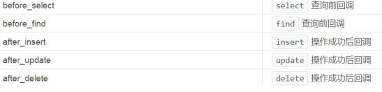
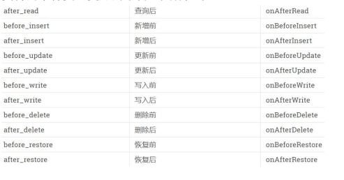
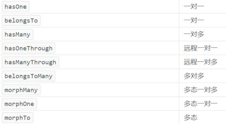
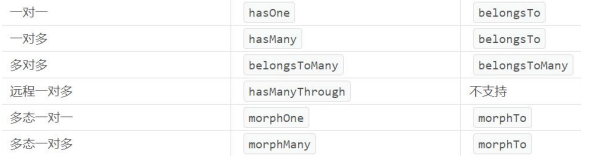

## 5.20	模型的数据类型与转换

##### 模型的数据类型转换

- ThinkPHP 可以通过模型进行设置，在写入或读取时对字段的数据类型进行转换。

<br>

##### 例

- 在模型端使用 `$type` 字段进行设置，`$type` 是一个数组。

  ```php
  //User模型
  class User extends Model{
      protected $type = [
  	'price' => 'integer',
  	'status' => 'boolean',
  	'create_time' => 'datetime:Y-m-d'
  	];
  }
  ```

  ```php
  // Controller
  class DemoController {
  	public function typeC(){
  		$user = UserModel::find(19);
  		var_dump($user->price);
  		var_dump($user->status);
  		var_dump($user->create_time);
  	}
  }
  ```

<br>

##### 可以转换的数据类型

- 数据库查询读取的字段很多都是字符串类型，我们可以转换成如下类型：
  1. integer(整型)
  2. float(浮点型)
  3. boolean(布尔型)
  4. array(数组)
  5. object(对象)
  6. serialize(序列化)
  7. json(json)
  8. timestamp(时间戳)
  9. datetime(日期)

<br>

##### 📌类型转换与获取器

- 类型转换会覆盖获取器的结果（类型转换的优先级更高），需要注意。

---

<div STYLE="page-break-after: always;"><br></div>

## 5.21	JSON 字符串

### 5.21.1	Db:: JSON

##### 说明

- 使用 `Db::` 写入 **JSON 格式** 的 **字符串类型** 数据。

<br>

##### Db:: 写入 JSON 字段

- 在写入时通过 json() 将指定字段标记，在写入时会自动将数据转换为 JSON 格式的字符串。

  ```php
  $data = [
  	'username' => '辉夜',
  	'password' => '123',
  	'gender' => '女',
  	'email' => 'huiye@163.com',
  	'price' => 90,
  	'details' => '123',
  	'uid' => 1011,
  	'status' => 1,
  	'list' => ['username'=>'辉夜', 'gender'=>'女',
  	'email'=>'huiye@163.com'],
  	];
  
  Db::name('user')->json(['list'])->insert($data);
  ```

<br>

##### Db:: 将查询结果转换为 JSON

```php
Db::name('user')->json(['list'])->find(278);
```

<br>

##### 使用 JSON 格式字符串中的数据作为查询条件

```php
$user = Db::name('user')->json(['list')->
where('list->username', '辉夜')->find();
```

<br>

##### 修改 JSON 格式字符串的数据

- ###### 完全修改 JSON 字符串

  ```php
  $data['list'] = ['username'=>'李白', 'gender'=>'男', 'email'=>'libai@163.com'];
  Db::name('user')->json(['list'])
  ->where('id', 278)->update($data);
  ```

- ###### 修改 JOSN 字符串的一个子项

  ```php
  $data['list->username'] = '李黑';
  Db::name('user')->json(['list'])
  ->where('id', 278)->update($data);
  ```

---

<div STYLE="page-break-after: always;"></div>

### 5.21.2	Model JSON

##### 说明

- 使用模型写入 JSON 格式的字符串。

<br>

##### 在模型中设置 $json 属性

```php
protected $json = ['list'];
```

<br>

##### 例——使用模型写入 JSON 格式的字符串。

```php
$user = new UserModel();

$user->username = '李白';
$user->password = '123';
$user->gender = '男';
$user->email = 'libai@163.com';
$user->price = 100;
$user->uid = 1011;
$user->status = 1;
$user->details = 123;

$user->list = ['username'=>'辉夜', 'gender'=>'女
','email'=>'huiye@163.com'];

$user->save();
```

<br>

##### 例——将对象转换为 JSON 格式的字符串然后写入

```php
$list = new \StdClass();
$list->username = '辉夜';
$list->gender = '女';
$list->email = 'huiye@163.com';
$list->uid = 1011;

$user->list = $list;
```

<br>

##### 获取与修改 JSON 格式字符串中的数据

- ###### 通过对象调用的方式获取

  ```php
  $user = UserModel::find(278);
  return $user->list->username;
  ```

- ###### 通过对象修改 JSON 数据

  ```php
  $user = UserModel::find(278);
  $user->list->username = '李白';
  $user->save()
  ```

- ###### 通过 JSON 的数据查询，获取一条数据

  ```php
  $user = UserModel::where('list->username', '辉夜')->find();
  return $user->list->email;
  ```

  - 该查询执行的 SQL 语句

    ```php
    SELECT * FROM `tp_user` WHERE json_extract(`list`, '$.username') = '辉夜' LIMIT 1
    ```

---

<div STYLE="page-break-after: always;"></div>

### 5.22	模型的软删除

##### 什么是软删除

- 软删除（又叫逻辑删除，标记删除）与我们常说的删除不同，并不是真的从数据库中将这条记录去除，通过设置一个字段，标记数据的删除状态<font size=1>（比如通过i sDelete 来标记删除状态。）</font>。

<br>

##### 官方推荐使用模型的软删除

- 由于 `Db::` 软删除没有太多的可操作的方法，官方手册推荐使用模型软操作；

<br>

##### 使用步骤

1. 首先，在模型端设置软删除的功能，引入 `SoftDelete`，它是一个 trait；

   ```php
   use think\Model;
   
   //引入 SoftDelete
   use think\model\concern\SoftDelete;
   class User extends Model{
       //使用 SoftDelete
       use SoftDelete;
       protected $deleteTime = 'delete_time';
   }
   ```

2. `delete_time` 的默认值是 NULL（数据没有标记为软删除时），可以修改这个默认值。

   ```php
   protected $defaultSoftDelete = 0;
   ```

3. 使用方法进行软删除：

   ```php
   UserModel::destroy(289);
   //或
   UserModel::find(287)->delete();
   ```

<br>

##### 开启软删除功能后的数据查询

- ###### 模型会自动屏蔽已经被软删除的数据

  默认情况下，开启软删除功能后，模型会自动屏蔽已经被软删除的数据：

  ```php
  $user = UserModel::select();
  return json($user);
  ```

  - 已经被软删除后的数据将不会被查询出来。

- ###### 开启软删除后，取消屏蔽已经被软删除的数据

  ```php
  $user = UserModel::withTrashed()->select();
  return json($user);
  ```

- ###### 只查询被软删除的数据

  ```php
  $user = UserModel::onlyTrashed()->select();
  return json($user);
  ```

<br>

##### 使用 restore() 将被软删除的数据复原

```php
$user = UserModel::onlyTrashed()->find();
$user->restore();
```

<br>

##### 将软删除的数据完全删除

- ###### 使用 force() 与 delete()

  先将已经软删除的数据 **复原**，并在删除时调用 `force()` 与 delete() 进行删除。

  ```php
  $user = UserModel::onlyTrashed()->find(193);
  $user->restore();
  $user->force()->delete(); 
  ```

- ######  使用 destroy() 删除

  ```php
  UserModel::destroy(288, true)
  ```

---

<div STYLE="page-break-after: always;"></div>

## 5.22	事件

### 5.22.0

##### 说明

- 执行增删改查时，可以触发一些事件来执行额外的操作；这些额外的操作事件，可以部署在构造方法里等待激活执行。

---

<div STYLE="page-break-after: always;"></div>

### 5.22.1	Db:: 事件

##### 使用 Db:: 事件

- 数据库事件方法为 `Db::event([事件名], [执行函数])`。

<br>

##### Db:: 支持的事件方法



<br>

##### 在控制器的初始化方法中创建事件

- ###### 为什么在初始化方法中创建事件

  在控制器端，事件一般可以写在初始化方法里，**方便统一管理**。

- ###### 例

  ```php
  class DemoController{
      public function initialize(){
  		Db::event('before_select', function ($query) {
  			echo '执行了批量查询操作！';
  		});
          
  		Db::event('after_update', function ($query) {
  			echo '执行了修改操作！';
  		});
  	}
  }
  ```

---

<div STYLE="page-break-after: always;"></div>

### 5.22.2	模型事件

##### 模型事件的优点

- 模型事件支持的事件类型更加的丰富。

<br>

##### 模型支持的事件方法



<br>

##### 模型事件的触发

- 在模型端使用静态方法调用即可完成事件触发。

  ```php
  protected static function onAfterRead($query){
  	echo '执行了查询方法';
  }
  
  protected static function onBeforeUpdate($query){
  	echo '准备修改中...';
  }
  
  protected static function onAfterUpdate($query){
      echo '修改完毕...';
  }
  ```

---

<div STYLE="page-break-after: always;"></div>

## 5.23	关联模型

### 5.23.0

##### 什么是关联模型

- 关联模型就是将表与表之间进行关联和对象化，更高效的操作数据。

---

<div STYLE="page-break-after: always;"></div>

### 5.23.1	关联模型定义

##### 例

```php
// User 模型
class User extends Model{
    
    //将 Profile 设置为 User 的关联模型
    public function profile(){
        //hasOne 表示一对一关联，参数一表示附表，参数二表示外键，默认 user_id
		return $this->hasOne(Profile::class,'user_id');
	}
}
```

```php
//Profile 模型
class Profile extends Model{}
```

```php
class DemoController{
	 public function index(){
        $user = UserModel::find(21);
		return json($user->profile);//SELECT * FROM `tp_profile` WHERE `user_id` = 21 LIMIT 1
		//return $user->profile->hobby;//SELECT * FROM `tp_profile` WHERE `user_id` = 21 LIMIT 1
        //❗上述两个查询指定的 LastSql 相同，但是返回的结果不同。
    }
}
```

<br>

##### ThinkPHP 的九种关联方案



<br>

##### 例——反向关联

```php
class Profile extends Model
{
	public function user(){
		return $this->belongsTo(User::class);
	}
}
```

```php
class Democontroller{
	$profile = ProfileModel::find(1);
	return $profile->user->email;
}
```

- 上例中执行的 SQL 语句为

  ```sql
  SELECT * FROM `tp_user` WHERE `id` = 19 LIMIT 1
  ```

<br>

##### 相对应的正反向关联



---

<div STYLE="page-break-after: always;"></div>

5.23.2	

##### 关联修改

- ###### 说明

  使用 `->[附表名]` 与 `save()` 方法，可以设置关联修改，通过主表修改附表字段的值。

- ###### 例

  ```php
  $user = UserModel::find(19);
  $user->profile->save(['hobby'=>'酷爱小姐姐']);
  ```

<br>

##### 关联新增

- ###### 说明

  使用 `->[附表名]()` 与 `save()` 可以新增数据。

- ###### 例

  ```php
  $user->profile()->save(['hobby'=>'不喜欢吃青椒']);
  ```

<br>

---

<div STYLE="page-break-after: always;"><br></div>

### 5.23.3	一对一关联

##### hasOne 模式

- ###### 适用

  hasOne 模式，适用于 **主表关联附表**

- ###### 语法

  ```php
  hasOne('关联模型',['外键','主键']);
  ```

  - 关联模型（必须）：关联的模型名或者类名。
  - 外键：默认的外键规则是当前模型名（不含命名空间，下同）+_id ，例如 user_id。
  - 主键：当前模型主键，默认会自动获取也可以指定传入。

- ###### 例

  ```php
  return $this->hasOne(Profile::class,'user_id', 'id');
  ```

<br>

##### belongsTo 模式

- ###### 适用

  belongsTo 模式适合于附表关联主表。

- ###### 语法

  ```php
  belongsTo('关联模型',['外键','关联主键']);
  ```

  - 关联模型（必须）：模型名或者模型类名
  - 外键：当前模型外键，默认的外键名规则是关联模型名+_id
  - 关联主键：关联模型主键，一般会自动获取也可以指定传入

- ###### 例

  ```php
  return $this->belongsTo(Profile::class,'user_id', 'id');
  ```

- ###### 例——使用 belongsTo 的子表进行查询

  ```php
  $profile = ProfileModel::find(1);
  return $profile->user->email;
  ```

<br>

##### 例——使用 hasOne 模拟 belongsTo 进行查询

```php
//参数一表示的是 User 模型类的 profile 方法，而非 Profile 模型类
$user = UserModel::hasWhere('profile', ['id'=>2])->find();
return json($user);

//采用闭包，这里是两张表操作，会导致 id 识别模糊，需要指明表
$user = UserModel::hasWhere('profile', function ($query) {
	$query->where('profile.id', 2);
})->select();
return json($user)
```

---

<div STYLE="page-break-after: always;"></div>