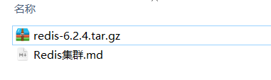

# 1	概述

## 1.1	

<br>

----

<div STYLE="page-break-after: always;">
    <br>
    <br>
    <br>
    <br>
    <br></div>
## 1.2	单机安装 Redis

# 单机安装Redis

首先需要安装Redis所需要的依赖：

```sh
yum install -y gcc tcl
```


然后将课前资料提供的Redis安装包上传到虚拟机的任意目录：



例如，我放到了/tmp目录：


解压缩：

```sh
tar -xvf redis-6.2.4.tar.gz
```

解压后：


进入redis目录：

```sh
cd redis-6.2.4
```


运行编译命令：

```sh
make && make install
```

如果没有出错，应该就安装成功了。

然后修改redis.conf文件中的一些配置：

```properties
# 绑定地址，默认是127.0.0.1，会导致只能在本地访问。修改为0.0.0.0则可以在任意IP访问
bind 0.0.0.0
# 数据库数量，设置为1
databases 1
```


启动Redis：

```sh
redis-server redis.conf
```

停止redis服务：

```sh
redis-cli shutdown
```


---

<div STYLE="page-break-after: always;">
    <br>
    <br>
    <br>
    <br>
    <br></div>
