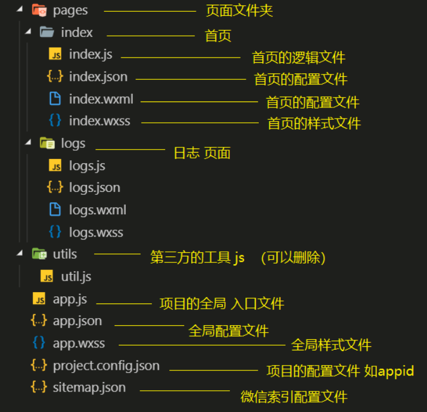
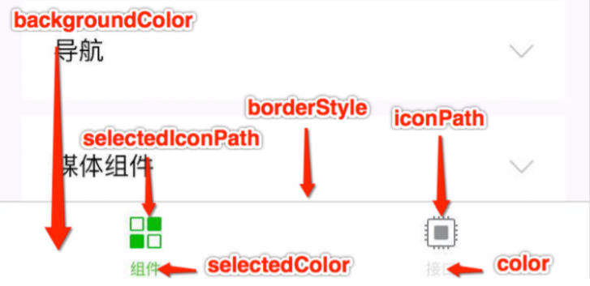

# 1	微信小程序

## 1.1	微信小程序概述

##### 什么是微信小程序

- 微信小程序，简称小程序，英文名 Mini Program ，是⼀种不需要下载安装即可使⽤的应⽤，它实现
  了应⽤“触手可及”的梦想，用户扫⼀扫或搜⼀下即可打开应⽤。

##### 微信小程序的优势

- 为什么是微信⼩程序 ？
- 微信有海量⽤⼾，⽽且粘性很⾼，在微信⾥开发产品更容易触达⽤⼾；
- 推⼴app 或公众号的成本太⾼。
- 开发适配成本低。
- 容易⼩规模试错，然后快速迭代。
- 跨平台。

---

<br>

## 1.2	开发环境搭建

##### 说明

- 由于腾讯发布的微信开发者工具编码体验较差，建议**使用 VS code 进行开发**，**使用微信开发者工具进行预览**。

---

<br>

## 1.3	微信小程序框架

### 1.3.0	微信小程序框架概述

##### 微信小程序框架的目标

- 小程序框架的目标是通过尽可能简单、高效的方式让开发者可以在微信中开发具有原生 APP 体验的服务。

##### 微信小程序框架的特点

- 小程序框架提供了自己的视图层描述语言 WXML 和 WXSS，使用 JavaScript 进行逻辑处理，并在视图层与逻
  辑层间提供了数据传输和事件系统，让开发者能够专注于数据与逻辑。

##### 小程序文件结构和传统 web 之间的对比

|      | 传统 web   | 微信小程序 |
| ---- | ---------- | ---------- |
| 结构 | HTML       | WXML       |
| 样式 | CSS        | WXSS       |
| 逻辑 | Javascript | Javascript |
| 配置 | 无         | JSON       |

---

<br>

### 1.3.1	小程序框架目录结构

##### 小程序框架结构图



---

<br>

### 1.3.2	全局配置文件

##### 说明

- ⼀个小程序应用程序会包括最基本的两种配置文件。⼀种是全局的 app.json 和 页面自己的page.json。
- app.json 包括了小程序的所有页面路径、界⾯表现、⽹络超时时间、底 部 tab 等。

##### app.json（稳定版 Stable Build (1.05.2102010)）

```json
{
  "pages":[
    "pages/index/index",
    "pages/logs/logs"
  ],
  "window":{
    "backgroundTextStyle":"light",
    "navigationBarBackgroundColor": "#fff",
    "navigationBarTitleText": "Weixin",
    "navigationBarTextStyle":"black"
  },
  "style": "v2",
  "sitemapLocation": "sitemap.json"
}
```

##### pages 字段

- 用于描述当前小程序所有页面路径，为了让微信客⼾端知道当前小程序页面定义在哪个⽬录。

##### window 字段

- 定义小程序所有页面的顶部背景颜色，文字颜色定义等。

##### tabbar 字段

- 用于定义页面导航栏.

- 常用属性如图：

  

##### 完整的配置信息

- 请参考 [全局配置|微信开发文档](https://developers.weixin.qq.com/miniprogram/dev/reference/configuration/app.html)。

---

<br>

### 1.3.3	页面配置文件 page.json

##### 说明

- 页面目录下的 page.json 用于进行和⼩程序⻚⾯相关的配置。 开发者可以独⽴定义每个⻚⾯的⼀些属性，如顶部颜⾊、是否允许下拉刷新等等。 
- 页面的配置只能设置 app.json 中部分 window 配置项的内容，**页面配置中配置项会覆盖 app.json 的 window 中相同的配置项**。

---

<br>

### 1.3.4	sitemap.json

##### 说明

- 微信现已开放小程序内搜索，开发者可以通过 `sitemap.json` 配置，或者管理后台页面收录开关来配置其小程序页面是否允许微信索引。当开发者允许微信索引时，微信会通过爬虫的形式，为小程序的页面内容建立索引。当用户的搜索词条触发该索引时，小程序的页面将可能展示在搜索结果中。

---

<BR>

# 2	常用标签

## 2.1	文字标签

##### \<sapn>

- 类似于 HTML 中的 \<span> 标签，属于行内标签。

---

<br>

## 2.2	布局标签

##### \<view>

- 类似于 HTML 中的 \<div> 标签，属于块标签。

---

<br>

## 2.3	block 标签

##### 说明

- 占位符标签，只在代码中存在，页面渲染时会把它移除。

##### 作用

- 渲染数据时，如果不想要添加额外的标签，可以使用 `block` 标签。

##### 例

```html
<view>
    <block>{{"测试1"}}</block>
    <block>{{"测试2"}}</block>
    <block>{{"测试3"}}</block>
    <block>{{"测试4"}}</block>
</view>
```

---

<br>

# 3	WXML 模板语法

## 3.1	数据绑定

##### 一般写法

```html
<view>{{字符串或/值}}</view>
或
<view>{{{data 中定义的属性名}}</view>
```

- **例**：

  ```
  //demo.js
  Page({
    data: {
      "name":"Hello World"
    },
  ```

  ```
  <view>{{name}}</view>
  <view>{{"你好世界"}}</view>
  ```

##### 组件属性 

```html
<view data-num="{{data 中定义的属性名}}"> </view>
```

- 例：

  ```html
  <checkbox checked = "{{false}}"></checkbox>
  ```

---

<br>

## 3.2	运算

##### 说明

- 在 `{{}}` 中可以插入表达式进行运算，可以插入的表达式包括：
  1. 算数表达式*（如加减乘除等）*。
  2. 字符串拼接
  3. 三元运算
  4. 逻辑判断

##### 例

```html
<!-- 算数表达式 -->
<view>{{1 + 1}}</view> 

<!-- 字符串拼接 -->
<view>{{'1'+'1'}}</view>

<!-- 三元运算 -->
<view> {{ true ? "真" : "假" }} </view>
```

- 输出结果：

  ```sh
  2
  11
  真
  ```

---

<br>

## 3.3	列表渲染 wx:for

##### 列表循环

- **说明**：遍历列表中的所有元素。

- **例**：

  ```js
  Page({
    data: {
  	demolist:[
  	{	id:"一",
  		name:"张三"
  	},
  	{	id:"二",
  		name:"李四"
  	},
  	{	id:"三",
  		name:"王二"
  	},
  	{	id:"四",
  		name:"麻子"
  	}]
  }
  )}
  ```

  ```html
  <view wx:for="{{demoList}}" vx:for-item="item" vx:for-index="index">
    <view>index:{{index}}</view> 
    <view>item.id:{{item.id}}</view>
    <view>item.name:{{item.name}}</view>
  </view>
  ```

- 📌**注意**：

  - 嵌套循环时，内循环和外循环的 `for-item` 属性 和 `for-index` 属性不能重名。
  - 如果只有单层循环，可以省略  `for-item` 属性 和 `for-index` 属性。

##### 对象循环

- **说明**：遍历对象中所有属性。

- **例**：

  ```
  Page({
    data: {
  	demoObject:{
  		name:"张三",
  		age:"18",
  		gender:"男"
  	}
  }
  )}
  ```

  ```html
  <view wx:for="{{demoObject}}">
    <text>{{index}}</text>
    <text>{{item}}</text>
  </view>
  ```

- 📌**注意**：

  - 此时的 `index` 代表对象的属性名， `item` 代表对象的属性值。
  - 循换对象时，建议使用  `for-item` 属性 和 `for-index` 属性将 index 和 item 的名称分别改为 `key` 和 `value`，防止混淆。 

##### wx:key

- **为什么需要使用 `wx:key`**：当数据改变触发渲染层重新渲染的时候，会校正带有 key 的组件，框架会确保他们被重新排序，而不是重新创建，以确保使组件保持自身的状态，并且提高列表渲染时的效率。

- **使用 wx:key**：

  - `wk:key="字符串"`，字符串代表在 `for` 循环的 `item` 的某个属性，该属性的值必须是整个列表中**唯一的值**，**且不会发生改变**，例：

    ```
    Page({
      data: {
    	demolist:[
    	{	id:"一",
    		name:"张三"
    	},
    	{	id:"二",
    		name:"李四"
    	},
    	{	id:"三",
    		name:"王二"
    	},
    	{	id:"四",
    		name:"麻子"
    	}]
    }
    )}
    ```

    ```html
    <view wx:for="{{demoList}}" vx:for-item="item" vx:for-index="index" vx:key = "id">
      <view>index:{{index}}</view> 
      <view>item.id:{{item.id}}</view>
      <view>item.name:{{item.name}}</view>
    </view>
    ```

  - `wk:key="*this"`,代表在 for 循环中使用的 key 是i tem 自身，此时 item 必须是唯一的字符串或者数字。

    ```
    Page({
      data: {
    	demolist2:[
    		"一",
    		"二",
    		"三",
    		"四"
    	]
    }
    )}
    ```

    ```html
    <view wx:for="{{demolist2}}" vx:key = "*item">
      <view>{{item}}</view> 
    </view>
    ```

---

<br>

## 3.4	条件渲染

### 3.4.1	wx:if

##### 实现原理与适用场景

- `wx:if`  通过将标签直接从页面结构移除来达到显示效果，对性能消耗较大，适用于切换不频繁的场景。

##### 例

```html
<view wx:if="{{true}}">显示</view>
<view wx:if="{{false}}">隐藏</view>

<view wx:if="{{false}}">1</view>
<view wx:elif="{{flase}}">2</view>
<view wx:else>3</view>
```

- **显示**：

  ```html
  显示
  3
  ```

---

<br>

### 3.4.2	hidden

##### 实现原理和适用场景

- `hidden` 通过为标签添加样式来实现隐藏，适用于需要频繁切换的场景。

##### 例

```html
<view hidden>1</view>
<view hidden = "{{true}}">2</view>
<view hidden = "{{false}}">3</view>
<view hidden = "{{1 + 1 != 2}}">4</view>
```

- **显示**：

  ```html
  3
  4
  ```

##### 📌hidden 的优先级

- hidden 的优先级低于标签 style 中设置的 display 样式，所以 不要把 hidden 和 display 放在一起使用，例：

  ```html
  <view hidden style="display:flex">不会被隐藏</view>
  ```

---

<br>

# 4	事件绑定

## 4.1	双向绑定

##### 📌微信小程序框架的赋值语法

- **说明**：微信小程序的赋值语法与 JavaScript 或 Vue 中的有很大的区别。

- **语法**：

  ```js
  this.setData({ 
   [变量名]:[赋予的值]
  })
  ```

##### 例

```js
Page({
  data: {
    num:0
  },
  handleInput(e){
    console.log(e);
    console.log(e.detail);
    console.log(e.detail.value);
      
    //微信小程序框架特有的赋值方法
    this.setData({ 
      num:e.detail.value
    })
  }
)}
```

```html
<input type="text" bindinput="handleInput" /><!-- 使用 bindinput 为 input 标签添加输入事件 -->
<view>{{num}}</view>
```

##### 📌微信小程序的传参语法

- 在微信小程序框架中，不能直接给函数的参数进行传值，因为小程序框架会将参数识别为函数名的一部分。*（比如 `fun1(1)` 会被识别为函数名  `fun(1)`，不会再调用  `fun(num)`）*

- **语法**：

  ```js
  page({
      data:{
          num:0
      },
    　handleTap(e){
      //获取自定义属性 operation
      console.log(e.currentTarget.dataset.operation)
      this.setData({
          num:this.data.num +　e.currentTarget.dataset.operation
      })
  })
  ```

  ```html
  <button bindtab="handleTab" data-operation="{{1}}"/><!-- 自定义属性 operation -->
  ```

---

<br>

# 5	样式

## 5.1	rpx

##### 说明

- rpx（responsive pixel）是微信小程序框架特有的长度单位，可以根据屏幕宽度进行自适应。
- 规定屏幕宽为 750rpx 。如在 iPhone6 上，屏幕宽度为 375px ，共有750个物理像素，则 750rpx = 375px = 750物理像 素 ， 1rpx = 0.5px = 1物理像素 。

##### rpx 换算

| 设备 |      |
| ---- | ---- |
|      |      |
|      |      |
|      |      |

设备 rpx换算px (屏幕宽度/750) px换算rpx (750/屏幕宽度) iPhone5 1rpx = 0.42px 1px = 2.34rpx iPhone6 1rpx = 0.5px 1px = 2rpx iPhone6 Plus 1rpx = 0.552px 1px = 1.81rpx

---

<br>

## 5.2	样式导入

##### 说明

- wxss 支持使用 @import 语句导入外联样式表*（import 语句只支持相对路径）*。

##### 例——导入 style 目录下的 wxss 文件

- wxss 文件位置


- 在需要该 wxss 文件的页面中引入

  ```css
  @import "../../style/s1.wxss";
  ```

---

<br>

## 5.3	选择器


---

 <br>

## 5.4	less


---

<br>

# 附录

##### 最后编辑时间

- 2021/03/09

##### 环境

- 

##### 参考

- 

##### 相关资料

- 

##### 脚注

[^xxx]: 

##### 代码链接

[1]:

##### 锚点

[](#1) 

##### 质疑

[^!1]: 

##### 疑问

[^?1]: 
