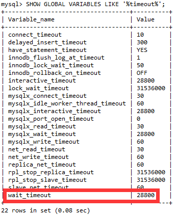

# Mysql 

## 手机号字段的设置

###### 问题

```
  `mobile` varchar(11) CHARACTER SET utf16 COLLATE utf16_general_ci DEFAULT '' COMMENT '手机号',
```

###### 出处

尚硅谷_谷粒学苑-微服务+全栈在线教育实战项目，mysql 数据表 `ucenter_member`

<br>

----

<div STYLE="page-break-after: always;">
    <br>
	<br>
	<br>
	<br>
	<br>
</div>
## 设置 Mysql 数据库默认连接超时时间

##### 数据库超时问题

MySQL数据库一般默认的连接超时time为28800s(即8小时)，超过8h，数据库会断开这个连接。后台程序出现类似“org.hibernate.exception.JDBCConnectionException: could not extract ResultSet”错误

<br>

##### 查询数据库连接超时时间

在mysql命令提示符下执行以下命令查询连接超时时间：

```sql
SHOW GLOBAL VARIABLES LIKE '%timeout%';
```



<br>

##### 解决方案

###### 方案1（临时方案）

在mysql命令提示符执行以下命令即可（临时方法，重启MySQL服务器会失效，恢复默认值）

```
SET GLOBAL wait_timeout=259200;
SET GLOBAL interactive_timeout=259200;
```

###### 方案2（慎用）

修改mysql的配置文件（慎用）.此方法要谨慎使用，如果这个值设置的太大，将导致空闲连接过多，白白消耗内存；如果设置的太小，就失去了mysql超时自动重连的作用。到底需要设置多大，难以界定。

###### 方案3（推荐）

通过设置数据库连接池的连接最大时长解决。

<br>

---

<div STYLE="page-break-after: always;">
    <br>
	<br>
	<br>
	<br>
	<br>
</div>

## SpringBoot 数据库连接池（Hikari）常用配置

##### Hikari pool

https://github.com/brettwooldridge/HikariCP

<br>

##### 常用配置

```properties
spring.datasource.type=com.zaxxer.hikari.HikariDataSource
# 连接池中允许的最小连接数。缺省值：10
spring.datasource.hikari.minimum-idle=10
# 连接池中允许的最大连接数。缺省值：10
spring.datasource.hikari.maximum-pool-size=100
# 自动提交
spring.datasource.hikari.auto-commit=true
# 一个连接idle状态的最大时长（毫秒），超时则被释放（retired），缺省:10分钟
spring.datasource.hikari.idle-timeout=30000
# 连接池名字，可以在日志或 JMX 中区分连接池和连接池设置，默认为 auto-generated
spring.datasource.hikari.pool-name=FlyduckHikariCP
# 一个连接的生命时长（毫秒），超时而且没被使用则被释放（retired），缺省:30分钟，建议设置比数据库超时时长少30秒
spring.datasource.hikari.max-lifetime=1800000
# 等待连接池分配连接的最大时长（毫秒），超过这个时长还没可用的连接则发生SQLException， 缺省:30秒
spring.datasource.hikari.connection-timeout=30000
# 数据库连接测试语句
spring.datasource.hikari.connection-test-query=SELECT 1
```

<br>

---

<div STYLE="page-break-after: always;">
    <br>
	<br>
	<br>
	<br>
	<br>
</div>
# 日志处理

## log 的 debug()、 error()、 info（）方法的区别

##### Debug

- 级别最低，一般在系统实际运行过程中不输出。

- 如果 log4j 的配置中开启debug级别日志，那么我们就打印输出debug日志，其在输出日志中会被标记为[DEBUG].

- 任何有利于在调试时更详细的了解系统运行状态的信息（如变量的值），都可以使用 debug() 输出。

- 可以随意的使用。

- 使用 log4j 时要加上 `if (log.isDebugEnabled())`。

  ```
  if (log.isDebugEnabled()) {
              log.debug(buildFullString());
  }
  ```

- 使用logback时，不需要代码里加 isDebugEnabled，logback 会自动处理

- 使用 logback 时，info 级别不会处理 debug 级别日志。

<br>

##### 为什么使用 debug() 时要加上 log.isDebugEnabled()

`log.debug()` 在没有指定输出级别为DEBUG时不会有输出，为什么还要在前面加一个 `isDebugEnabled()` 的判断？——这个方法一般用在认为 `buildFullString()` 效率不太高的情况下，那么如果直接写 `log.debug(buildFullString());` 的话，虽然它不会打印语句，但是 buildFullString 还是被执行了，这样就白费了功夫。

但是这主要是因为过去的某些日志框架是不支持的占位符 `{}` ，日志是这样输出的：

```
LOGGER.debug("name "+ name);
```

也就是用拼接字符串的方式。这样在程序执行到 LOGGER.debug() 时进行字符串拼接，会带来很多无意义的性能损耗。因此，以前的程序都会在外面包一层 if 判断

由于运行过程中 JIT 会进行语句优化，发现 LOGGER.isDebugEnabled() 为 false 后，会将整个语句块去除掉。这样，就避免了日志级别大于 debug 时会进行无意义的字符串拼接了。

**目前主流的一些日志框架都已经支持用占位符的形式输出日志，因此，if 判断带来的性能优化效果并不会太大。**

<br>

##### Info

- 一般用于反馈系统的当前状态给最终用户，所以这里输出的信息，应该对最终用户具有实际意义（最终用户能明白其含义）。
- 从某种角度上说，**Info 输出的信息可以看作是软件产品的一部分**（就像那些交互界面上的文字一样），所以需要谨慎对待。

<br>

#####     Warn、Error、Fatal

- Warn——警告、Error——错误、Fatal——严重错误
- 所谓警告，应该是这个时候进行一些修复性的工作，应该还可以把系统恢复到正常状态中来，系统应该可以继续运行下去。
- 所谓错误，就是说可以进行一些修复性的工作，但无法确定系统会正常的工作下去，系统在以后的某个阶段，很可能会因为当前的这个问题，导致一个无法修复的错误（例如宕机），但也可能一直工作到停止也不出现严重问题。
- 所谓Fatal，那就是相当严重的了，可以肯定这种错误已经无法修复，并且如果系统继续运行下去的话，可以肯定必然会越来越乱。这时候采取的最好的措施不是试图将系统状态恢复到正常，而是尽可能地保留系统有效数据并停止运行。
- 也就是说，选择 Warn、Error、Fatal 中的具体哪一个，是根据当前的这个问题对以后可能产生的影响而定的，如果对以后基本没什么影响，使用 Warn；如果肯定会出现严重问题，则使用 Fatal ；无法确定影响，则使用 Error。

<br>

---

<div STYLE="page-break-after: always;">
    <br>
	<br>
	<br>
	<br>
	<br>
</div>
