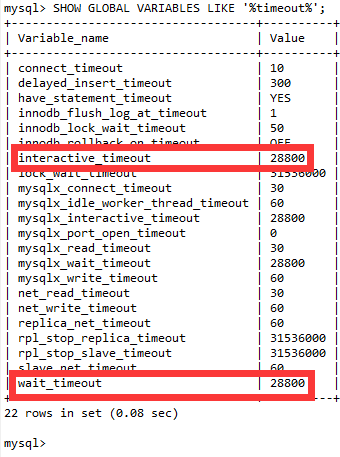
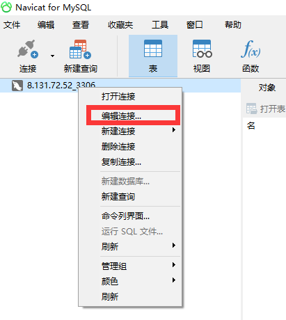
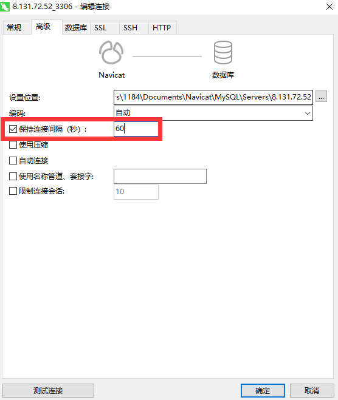
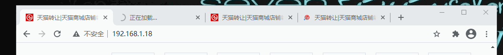
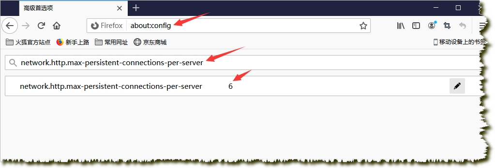
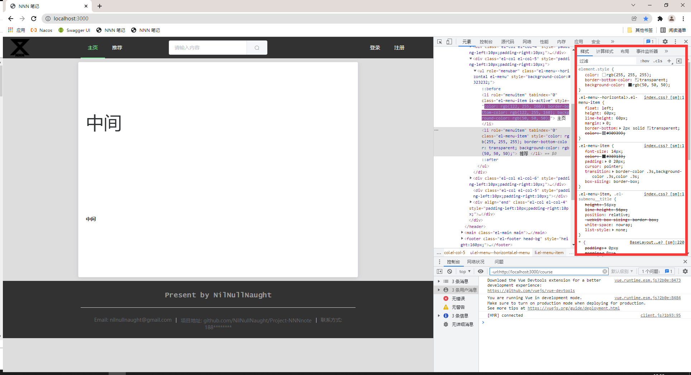

# Java

## 匿名函数

##### 匿名函数与闭包之间的区别

- 匿名函数：定义时未定义函数的名称
- 闭包： 创建时封装周围状态的函数，及时周围的环境不存在了，闭包中的状态还会存在。

从理论上讲 匿名函数和闭包属于两种概念，PHP中视为相同

<br>

### 匿名函数的好处

1. 非匿名函数在定义时就创建函数对象和作用域对象。之后就算未调用，也占空间。
2. 匿名函数只有在调用时，才会创建函数对象和作用域对象。调用完后立即释放，节省内存。适合做回调函数。

<br>

---

<div STYLE="page-break-after: always;">
    <br>
	<br>
	<br>
	<br>
	<br>
</div>

## ⭕使用 try with resource 关闭资源

##### 旧版的资源关闭方法

在旧版的写法中，资源都放在 finally 块里进行关闭，如下：

```java
        InputStream inputStream = null;
        try {
            inputStream = new FileInputStream("【ResourceLocation】");
            byte[] bytes = inputStream.readAllBytes();
        } catch (IOException e) {
            e.printStackTrace();
        } finally {
            if (inputStream != null) {
                try {
                    inputStream.close();
                } catch (IOException e) {
                    e.printStackTrace();
                }
            }
        }
```

这种写法的麻烦之处在于，我们需要在 finally 块中关闭资源，所以 inputStream 只能定义在 `try` 块的外面。关闭之前，还需要做一步判空，避免因为 inputStream 为空而导致的空指针异常。这种写法是很繁琐的。

<br>

##### try-with-resources

try-with-resources 是 JDK 7 中一个新的异常处理机制，它能够很容易地关闭在 `try-catch` 语句块中使用的资源。所谓的资源（resource）是指在程序完成后，必须关闭的对象。try-with-resources 语句确保了每个资源在语句结束时关闭。所有实现了 java.lang.AutoCloseable 接口（其中，它包括实现了 `java.io.Closeable` 的所有对象），可以使用作为资源。

try-with-resources 声明在 JDK 9 已得到改进。如果你已经有一个资源是 final 或等效于 final 变量,您可以在 try-with-resources 语句中使用该变量，而无需在 try-with-resources 语句中声明一个新变量。

<br>

##### 使用 try-with-resources 关闭资源

###### 例一

```java
   @Test
   public void test{
      try (
        Reader inputString = new StringReader(message);
      	BufferedReader br = new BufferedReader(inputString)
      ) {
         return br1.readLine();
      }
   }
```

###### 例二

在 Java 9 中，我们不需要声明资源 br1 就可以使用它，并得到相同的结果。

```java
   @Test
   public void test{
      Reader 
      BufferedReader br = new BufferedReader(inputString);
      try (
          inputString = new StringReader(message);
          br new BufferedReader(inputString)
      ) {
         String s = br.readLine();
          System.out.println(s);
      }
   }
```

###### try-with-resources 的语法

在 try 关键字的后面跟一个括号，把需要关闭的资源定义在括号内。在 try 块执行完之后会自动的释放掉资源。

###### 什么资源可以被 try-with-resources 自动关闭

并不是所有资源都可以被 try-with-resources 自动关闭的，只有实现了 java.lang.AutoCloseable 接口的类，才可以被自动关闭。如果没有实现 java.lang.AutoCloseable 的类定义在try的括号内，则会在编译器就报错。

<br>

##### 自定义可以被自动关闭的类

可以把自己的类编写为可以被 `try-with-resources` 自动关闭的类，只需实现 `java.lang.AutoCloseable` 接口即可。

```
class MyResource implements java.lang.AutoCloseable{
	
	@Override
	public void close() {
		...一些逻辑
		System.out.println("调用了close方法");
	}
}
```

<br>

---

<div STYLE="page-break-after: always;">
    <br>
	<br>
	<br>
	<br>
	<br>
</div>

# Mysql 

## ❓手机号字段的设置

###### 问题

```
  `mobile` varchar(11) CHARACTER SET utf16 COLLATE utf16_general_ci DEFAULT '' COMMENT '手机号',
```

###### 出处

尚硅谷_谷粒学苑-微服务+全栈在线教育实战项目，mysql 数据表 `ucenter_member`

<br>

----

<div STYLE="page-break-after: always;">
    <br>
	<br>
	<br>
	<br>
	<br>
</div>

## ⭕使用 java.time.LocalDateTime 类型存储时间时，与当前时间对不上

#####  前提条件

Mysql 版本 Mysql 8+

<br>

##### 修改 SqlURL

```yaml
jdbc:mysql://8.131.72.52:3306/NNNnote?useSSL=false&serverTimezone=Asia/Shanghai
```

<br>

---

<div STYLE="page-break-after: always;">
    <br>
	<br>
	<br>
	<br>
	<br>
</div>
## ⭕设置 Mysql 数据库默认连接超时时间

##### 数据库超时问题

MySQL数据库一般默认的连接超时时间为28800s(即8小时)，超过8h，数据库会断开这个连接。后台程序出现类似“org.hibernate.exception.JDBCConnectionException: could not extract ResultSet”错误

<br>

##### 查询数据库连接超时时间

在mysql命令提示符下执行以下命令查询连接超时时间：

```sql
SHOW GLOBAL VARIABLES LIKE '%timeout%';
```



<br>

##### 解决方案

###### 方案1（临时方案）

在mysql命令提示符执行以下命令即可（临时方法，重启MySQL服务器会失效，恢复默认值）

```
SET GLOBAL wait_timeout=259200;
SET GLOBAL interactive_timeout=259200;
```

###### 方案2（慎用）

修改mysql的配置文件（慎用）.此方法要谨慎使用，如果这个值设置的太大，将导致空闲连接过多，白白消耗内存；如果设置的太小，就失去了mysql超时自动重连的作用。到底需要设置多大，难以界定。

###### 方案3（推荐）

通过设置数据库连接池的连接最大时长解决。

<br>

---

<div STYLE="page-break-after: always;">
    <br>
	<br>
	<br>
	<br>
	<br>
</div>

## ⭕SpringBoot 数据库连接池（Hikari）常用配置

##### Hikari pool

https://github.com/brettwooldridge/HikariCP

<br>

##### 常用配置

```properties
spring.datasource.type=com.zaxxer.hikari.HikariDataSource
# 连接池中允许的最小连接数。缺省值：10
spring.datasource.hikari.minimum-idle=10
# 连接池中允许的最大连接数。缺省值：10
spring.datasource.hikari.maximum-pool-size=100
# 自动提交
spring.datasource.hikari.auto-commit=true
# 一个连接idle状态的最大时长（毫秒），超时则被释放（retired），缺省:10分钟
spring.datasource.hikari.idle-timeout=30000
# 连接池名字，可以在日志或 JMX 中区分连接池和连接池设置，默认为 auto-generated
spring.datasource.hikari.pool-name=FlyduckHikariCP
# 一个连接的生命时长（毫秒），超时而且没被使用则被释放（retired），缺省:30分钟，建议设置比数据库超时时长少30秒（此处为30分钟）
spring.datasource.hikari.max-lifetime=180000
# 等待连接池分配连接的最大时长（毫秒），超过这个时长还没可用的连接则发生SQLException， 缺省:30秒
spring.datasource.hikari.connection-timeout=30000
# 数据库连接测试语句
spring.datasource.hikari.connection-test-query=SELECT 1
```

<br>

---

<div STYLE="page-break-after: always;">
    <br>
	<br>
	<br>
	<br>
	<br>
</div>
## ⭕使用 Navicate 打开数据库慢

##### 问题

Mysql 服务器端会定时清理长时间不活跃空闲的数据库连接，以此优化数据库的性能。

Navicat 客户端有一个设置：保持连接间隔，默认是240秒！意思是，客户端在用户无任何交互性操作时，会每隔240秒给Mysql服务端发送一次数据请求。以此来保持数据库连接活跃！

然而Navicat设置的心跳包间隔太长了，Mysql服务端直接将连接清理掉了。当我们打开一张表的时候，Navicat还是使用旧的连接去请求数据，发现旧的连接超时不能用了，最后又申请了一个新的连接，再去请求数据！

所以导致我们打开一张表时间需要挺久的！

 <br>

##### 解决方案

选择数据库连接 → 编辑连接... → 高级 →。设置保持连接间隔为 60。





 <br>

---

<div STYLE="page-break-after: always;">
    <br>
	<br>
	<br>
	<br>
	<br>
</div>
# Mybatis-plus 

## 修改构造器 UpdateWrapper

---

<div STYLE="page-break-after: always;">
    <br>
	<br>
	<br>
	<br>
	<br>
</div>

# 日志处理

## ⭕log 的 debug()、 error()、 info（）方法的区别

##### Debug

- 级别最低，一般在系统实际运行过程中不输出。

- 如果 log4j 的配置中开启debug级别日志，那么我们就打印输出debug日志，其在输出日志中会被标记为[DEBUG].

- 任何有利于在调试时更详细的了解系统运行状态的信息（如变量的值），都可以使用 debug() 输出。

- 可以随意的使用。

- 使用 log4j 时要加上 `if (log.isDebugEnabled())`。

  ```
  if (log.isDebugEnabled()) {
              log.debug(buildFullString());
  }
  ```

- 使用logback时，不需要代码里加 isDebugEnabled，logback 会自动处理

- 使用 logback 时，info 级别不会处理 debug 级别日志。

<br>

##### 为什么使用 debug() 时要加上 log.isDebugEnabled()

`log.debug()` 在没有指定输出级别为DEBUG时不会有输出，为什么还要在前面加一个 `isDebugEnabled()` 的判断？——这个方法一般用在认为 `buildFullString()` 效率不太高的情况下，那么如果直接写 `log.debug(buildFullString());` 的话，虽然它不会打印语句，但是 buildFullString 还是被执行了，这样就白费了功夫。

但是这主要是因为过去的某些日志框架是不支持的占位符 `{}` ，日志是这样输出的：

```
LOGGER.debug("name "+ name);
```

也就是用拼接字符串的方式。这样在程序执行到 LOGGER.debug() 时进行字符串拼接，会带来很多无意义的性能损耗。因此，以前的程序都会在外面包一层 if 判断

由于运行过程中 JIT 会进行语句优化，发现 LOGGER.isDebugEnabled() 为 false 后，会将整个语句块去除掉。这样，就避免了日志级别大于 debug 时会进行无意义的字符串拼接了。

**目前主流的一些日志框架都已经支持用占位符的形式输出日志，因此，if 判断带来的性能优化效果并不会太大。**

<br>

##### Info

- 一般用于反馈系统的当前状态给最终用户，所以这里输出的信息，应该对最终用户具有实际意义（最终用户能明白其含义）。
- 从某种角度上说，**Info 输出的信息可以看作是软件产品的一部分**（就像那些交互界面上的文字一样），所以需要谨慎对待。

<br>

#####     Warn、Error、Fatal

- Warn——警告、Error——错误、Fatal——严重错误
- 所谓警告，应该是这个时候进行一些修复性的工作，应该还可以把系统恢复到正常状态中来，系统应该可以继续运行下去。
- 所谓错误，就是说可以进行一些修复性的工作，但无法确定系统会正常的工作下去，系统在以后的某个阶段，很可能会因为当前的这个问题，导致一个无法修复的错误（例如宕机），但也可能一直工作到停止也不出现严重问题。
- 所谓Fatal，那就是相当严重的了，可以肯定这种错误已经无法修复，并且如果系统继续运行下去的话，可以肯定必然会越来越乱。这时候采取的最好的措施不是试图将系统状态恢复到正常，而是尽可能地保留系统有效数据并停止运行。
- 也就是说，选择 Warn、Error、Fatal 中的具体哪一个，是根据当前的这个问题对以后可能产生的影响而定的，如果对以后基本没什么影响，使用 Warn；如果肯定会出现严重问题，则使用 Fatal ；无法确定影响，则使用 Error。

<br>

---

<div STYLE="page-break-after: always;">
    <br>
	<br>
	<br>
	<br>
	<br>
</div>
# 前端

## ⭕Nuxt 开发时浏览器标签个数限制导致卡顿

##### 问题



如图所示，当我们使用命令 npm run dev 构建nuxt项目之后，在浏览器打开多个标签页会出现卡死或一直转圈的问题。并且在Chome浏览器控制台和VsCode控制台都没有输出任何错误信息。

###### 官方说明

https://github.com/nuxt/nuxt.js/issues/8190#issuecomment-707059695

https://github.com/nuxt/nuxt.js/issues/6442

###### 原因描述

这是因为Chome浏览器对同一个主机有连接数限制，默认链接数量是5。

<br>

###### 解决方法

1. 如果使用的是 chome 浏览器，是没法解决的，chome 浏览器同一个主机连接数限制是硬编码的没办法修改，除非改 chome 浏览器源码。
2. 如果使用的是 firefox 浏览器可以进行修改，修改方法如下：打开FileFox->在浏览器输入about:config->在文本框输入network.http.max-persistent-connections-per-server->默认最大连接数是6，改成60保存



<br>

---

<div STYLE="page-break-after: always;">
    <br>
	<br>
	<br>
	<br>
	<br>
</div>
# Spring

## ❓BeanUtils


---

<div STYLE="page-break-after: always;">
    <br>
	<br>
	<br>
	<br>
	<br>
</div>

# Spring MVC

## ❓从路径中获取参数

---

<div STYLE="page-break-after: always;">
    <br>
	<br>
	<br>
	<br>
	<br>
</div>
## 从请求头中获取参数

##### 方式一 —— 通过请求参数 HttpServletRequest

```java
public String getUserInfo(HttpServletRequest request) {
    String token =  request.getHeader("token");
    return token;
}
```

<br>

##### 方式二 —— 通过 @RequestHeader 注解

###### 例

```java
@PostMapping("/deleteFile")
public String deleteFile(@RequestHeader("token")String token) {//获取 token 对应的请求头信息
    return urltoken;
}
```

<br>

---

<div STYLE="page-break-after: always;">
    <br>
	<br>
	<br>
	<br>
	<br>
</div>
## 从请求体中获取参数

---


## ❓SpringMVC 不支持同时上传文件和从请求体中获取数据

<div STYLE="page-break-after: always;">
    <br>
	<br>
	<br>
	<br>
	<br>
</div>

---

<div STYLE="page-break-after: always;">
    <br>
	<br>
	<br>
	<br>
	<br>
</div>
## 使用 @RequestParam 获取请求参数

##### 例——使用 post 请求方式获取参数

##### Vue

```js
//路径 api/test.js
import request from '@/utils/request'
export default {
  testRequestParam (data) {
    return request({
      url: `/testRequestParam`,
      method: 'post',
      data: data
    })
  }
}
```

```vue
//路径 page/test.vue
<template>
	<div/>
</template>
<script>
// 引入 qs（axios中有qs包，不需要 npm insatll qs，直接引入即可）
import qs from 'qs'
import testApi from '@/api/test'

export default {
    data () {
    	return {
            email:'xxxx@xx.com'
    	}
    }
    method
    submitAlterEmail () {
      // 封装数据
      const data = { email: this.email }
      testApi.testRequestParam(qs.stringify(data))
        .then((response) => {
          alert(response.data.data.data)
        })
    }
```

###### 后端

```java
@PostMapping("/testRequestParam")
public R testRequestParam(@RequestParam(name = "email",required = false)String email){
    return R.ok().data("data",email);
}
```


---

<div STYLE="page-break-after: always;">
    <br>
	<br>
	<br>
	<br>
	<br>
</div>

# IDEA

## ❓插件

##### Grep Console

<br>

##### Git Commit Template

<br>

---

<div STYLE="page-break-after: always;">
    <br>
	<br>
	<br>
	<br>
	<br>
</div>

## ❓窗口功能

##### Find

<br>

##### Git

<br>

##### 📌TODO

<br>

##### 📌Profiler

<br>

##### 📌Build

<br>

##### 📌Spring

<br>

##### 📌Structure

<br>

---

<div STYLE="page-break-after: always;">
    <br>
	<br>
	<br>
	<br>
	<br>
</div>
# Element UI

## 易错点

##### 在 Element UI 中使用一般的 HTML 标签，无法居中

<br>

##### 调整 Element UI 组件样式（去除 border、margin 等）

通过浏览器的 **检查** 功能，查找组件对应的 CSS 属性，进行修改。



<br>

##### Element UI 组件直接使用 v-if 与 v-show 会出现问题

使用 div 嵌套需要  `v-if/v-show` 的Element UI 组件。

<br>

---

<div STYLE="page-break-after: always;">
    <br>
	<br>
	<br>
	<br>
	<br>
</div>

# Vue

## ❓刷新导致 v-if 标签的闪烁与图片重新加载


---

<div STYLE="page-break-after: always;">
    <br>
	<br>
	<br>
	<br>
	<br>
</div>
## 在页面跳转、刷新或关闭时执行方法

##### 钩子函数 beforeDestroy()

`beforeDestroy()` 会在页面跳转前执行（仅限通过路由跳转？）

```vue
<template>
	<div/>
</template>

<script>
export default {
  beforeDestroy () {
    alert('！！！')
  },
}
</script>
```

<br>

##### window.onbeforeunload

`onbeforeunload` 事件可以用在页面刷新前、页面关闭前，进行提示判断等相关操作。

但是，如果页面首次渲染后不进行任何操作直接关闭浏览器 tab 或者刷新，此时页面不会有任何提示，**只有在页面渲染完毕、并对页面进行操作后才有提示效果**，如：

1. 页面加载完后在页面空白处进行一次点击，再执行 F5 刷新或执行关闭 tab 操作时，浏览器提示窗口弹出。
2. 直接点击页面中的 `<a>` 标签进行页面跳转，浏览器提示窗口弹出。

**注意**：浏览器将统一显示弹出框中的提示消息， 如 Chrome 将显示 “您是否要离开此网站？您所做的更改可能无法保存”

###### 在 vue 中使用 window.onbeforeunload

```vue
<template>
	<div/>
</template>

<script>
export default {
  beforeDestroy () {
    window.onbeforeunload = function (e) { // 刷新与关闭时弹出提示
      e = e || window.event
      // 兼容IE8和Firefox 4之前的版本
      if (e) {
        e.returnValue = '关闭提示'
      }
      // Chrome, Safari, Firefox 4+, Opera 12+ , IE 9+
      return '关闭提示'
    }
  },
}
</script>

```

- 在关闭页面或浏览器时，会弹出提示。
- `window.onbeforeunload` 页可以在其他钩子函数（`mount()` 或 `beforeRouteLeave()` 使用）
- `window.onbeforeunload()` 无法读取 Vue 中定义的值与函数，只能使用原生 ajax 发送请求，数据需要先通过 cookie 或者 localstorage 保存，才能在 `window.onbeforeunload()` 中获取。

<br>

---

<div STYLE="page-break-after: always;">
    <br>
	<br>
	<br>
	<br>
	<br>
</div>

## 使用 axios 上传文件

##### API

```js
import request from '@/utils/request'

const ApiName = '/oss/aliyun-oss'
export default {
  // 上传文件到临时目录
  uploadFileTemporary (file) {
    return request({
      url: `${ApiName}/uploadFileTemporary`,
      method: 'post',
      data: file,
      headers: {
        'content-type': 'multipart/form-data; boundary=<calculated when request is sent>'
      }
    })
  }

}

```

```js
<el-upload
  class="avatar-uploader"
  action="fakeaction"
  :http-request="uploadAvatar" ！！！！通过 http-request，覆盖默认的上传行为，自定义上传的实现
  :show-file-list="false"
  :on-success="handleAvatarSuccess"
  :before-upload="beforeAvatarUpload">
  
  <i v-else class="el-icon-plus avatar-uploader-icon"></i>
</el-upload>

<style>
  .avatar-uploader .el-upload {
    border: 1px dashed #d9d9d9;
    border-radius: 6px;
    cursor: pointer;
    position: relative;
    overflow: hidden;
  }
  .avatar-uploader .el-upload:hover {
    border-color: #409EFF;
  }
  .avatar-uploader-icon {
    font-size: 28px;
    color: #8c939d;
    width: 178px;
    height: 178px;
    line-height: 178px;
    text-align: center;
  }
  .avatar {
    width: 178px;
    height: 178px;
    display: block;
  }
</style>

<script>
  export default {
    data() {
      return {
        imageUrl: ''
      };
    },
    methods: {
      handleAvatarSuccess(res, file) {
        this.imageUrl = URL.createObjectURL(file.raw);
      },
      beforeAvatarUpload(file) {
        const isJPG = file.type === 'image/jpeg';
        const isLt2M = file.size / 1024 / 1024 < 2;

        if (!isJPG) {
          this.$message.error('上传头像图片只能是 JPG 格式!');
        }
        if (!isLt2M) {
          this.$message.error('上传头像图片大小不能超过 2MB!');
        }
        return isJPG && isLt2M;
      },
      // 自定义上传的实现
      uploadAvatar (params) {
      	const data = new FormData()
      	// 创建一个表单数据
      	data.append('file', params.file)
      	ossApi.uploadFileTemporary(data).then((response) => {
      	  if (response.data.code === 20000) {
      	    // 提示修改成功
      	    this.$message({
      	      type: 'success',
      	      message: '头像上传成功'
      	    })
      	    this.imageUrl = response.data.data.url
      	  } else {
      	    this.$message.error('头像上传失败')
      	  }
      	})
       }
    }
  }
</script>
// 上传头像
    
```

<br>

---

<div STYLE="page-break-after: always;">
    <br>
	<br>
	<br>
	<br>
	<br>
</div>
## 使用 window.logcation.href 刷新所有组件状态

##### 使用 window.logcation.href 跳转页面,可以刷新所有组件状态

对页面的一部分组件进行修改后，如果需要更新所有组件的状态，可以使用  `window.logcation.href` 。

###### 实例

在 <u>设置页面</u> 重设用户信息后，可以通过 `window.logcation.href` 刷新页面，从而使导航栏的用户信息也被刷新。

<br>
