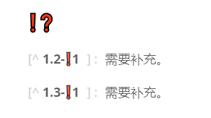

<div STYLE="page-break-after: always;">
	<br>
    <br>
    <br>
    <br>
    <br>
    <br>
    <br>
    <br>
    <br>
    <br>
	<center><h3><font size="20px">
        文档编辑标准
    </font></h3></center>
	<br>
    <br>
    <br>
    <br>
    <br>
    <br>
    <br>
    <br>
    <br>
    <br>
</div>

# 1		文档编辑基本事项

## 1.1	核心思想

#### 文档应该具备的功能

1. 类似于字典，可以快速的查阅相关的知识点；
2. 易于新增和修改。

<br>

#### 注意点

1. 在保证正确和易懂的前提下，尽可能地简化说明（单段文字最好不要超过三行，如果可以分段最好分段）。

<br>

<div STYLE="page-break-after: always;"></div>

## 1.2	文档结构

#### 文档名与 Markdown 文件名

文档名与 Markdown 文件名相同，但是如果在同一目录下存在多个 Markdown 文件，则需要在 Markdown 文件上添加序号，此时文档名不添加序号。

<br>

#### 章节与标题级别

1. 目录为二级；
2. 如果单章内容过多，则另开一个章节，新章节和原章节持有相同的主标题；
3. 标题必须进行编号；

<br>

#### 标题命名标准

1. 标题必须保证在长度不过长的前提下 ，清晰的描述章节的内容。

<br>

#### 知识点

1. 使用四号标题标记章节中的知识点；
2. 知识点中的如果包含多个子概念，则进行分段，分段采用六号标题；
3. 分段时，第一段为知识点的简介，且不添加标题；
4. 如果子节点中包含的概念过于复杂，应该创建新的子节点或者直接增加新的章节。

<br>

#### 标题间隔

如果标题中存在公共部分，如 `例`、`注意` 等，使用 `-` 分隔公共部分和独立部分。

###### 例 - 标题分隔

<br>

#### 步骤标题

对于分步骤的标题，采用数字作为序号，并且最好附带说明，序号和说明之间使用 `-` 隔开。

###### 1 - 这是第一步

###### 2 - 这是第二步

###### 3 - 这是第三步

<br>

---

<div STYLE="page-break-after: always;"></div>

## 1.3	章节内容

#### 知识点标记

1. 📌：标记重要知识点或章节；
2. ❓：标记没有理解或有疑问的知识点或章节。使用时需要附加说明（参考 [1.4 附录 - ❗❓](#❗❓)）；
3. ❗：标记可能存在错误，或者需要修改和补充的知识点或章节。使用时需要附加说明（参考 [1.4 附录 - ❗❓](#❗❓)）；
4. 🔗：标记与本章内容存在联系，但是严格来说不属于本章的知识点。需要使用脚注（脚注标注位置写在🔗符号后）标注该知识点的出处（一般是另一篇文档）。如果该知识点没有对应的文档，脚注中的内容为 `暂无所属文档。`。

<br>

#### 代码块

1. 代码块内部不要添加大段地说明（可以添加单行注释），可以在代码块的后面附加列表进行说明（因为在代码块中不能使用 md 语法，无法标记重点）
2. 对于多个文件组成的代码块，在第一行使用注释添加文件名
3. 对于过于巨大的代码块，使用外部链接形式展示

<br>

#### 图片

1. 图片存放在 md 文件同级的 /img 目录下，如果当前目录有多个 md 文件，则存放于 /img/{md 文件名} 目录下。
2. 每个章节的图片保存在对于的章节号的文件名下，并按照顺序重命名。

<br>

#### 补充说明

一般用于补充说明，如举例等。使用中文括号包裹。

<br>

#### 正文中的英文和数字

中文正文及标题中出现的英文及数字应该使用半角方式输入，并且在左右各留一个半角空格。如果这些这些半角英文及数字的左边或者右边紧接着任何的中文全角括号或者其他标点符号的话，则不需要加入半角空格。

<br>

#### 行内代码 ``` ` 的使用

需要使用 ``` ` 的内容：

1. 正文中的出现的行内代码；
1. 类名、对象名、关键字和保留字；

1. 虚拟机参数和命令；
2. shell 命令；
3. 不是超链接的文件路径或者文件名；
4. 特殊符号；
5. 快捷键。

###### 注意

1. 如果代码段是一个方法名，则在结尾处添加 ()，并添加简化的参数列表，如 setName(String)。

<br>

#### 特殊符号

在正文或标题中出现了单独的特殊符号，使用则添加转义符号 \\ 后，前后各留一个半角空格，如 \*。

<br>

#### 正文中的难以断句或容易出现歧义的内容

使用下划线 `<u></u>` 进行划分，并在左右添加空格。

<br>

#### 正文中的重点内容

进行加粗 `** **`，并在左右添加空格。

<br>

#### 脚注

脚注索引格式为 [章节编号-脚注序号]，如 [^1.2-4]。

<br>

#### 锚点

用于关联段落之间的跳转。

###### 定义锚

```markdown
<span id="1" style="display:none">&nbsp;</span>
```

###### 跳转

```markdown
[xxx](#1)
```

<br>

#### 正文中的难以段句或容易出现歧义的内容

使用下划线 <u></u> 进行划分，并在左右添加空格。

<br>

---

<div STYLE="page-break-after: always;"></div>


## 1.4	附录

#### 参考资料

当前文档引用的资料，包括使用了引用资料的章节、资料名、资料连接、资料发布时间、资料最后更新时间；

<br>

#### ❗❓

当前文档未完成的部分，❗一般表示需要补充的部分，❓表示未理解或有疑问的部分。

###### 格式

```
[^${章节号}-❗${序号}]：说明文字。
[^${章节号}-❓${序号}]：说明文字。
```

###### 例



<br>

---

<div STYLE="page-break-after: always;"></div>

## 1.5	章节结构参考

#### 出现的问题

<br>

### 解决思路

<br>

#### {知识点} 简介

对本章节知识点进行简要的介绍。

<br>

#### 为什么需要 {知识点}

本章节介绍的知识点所要解决的问题

<br>

#### {知识点} 的缺点

<br>

#### {知识点} 的语法

```

```

<br>

#### {知识点} 的实际场景举例

<br>

#### 例 - {本例说明}

```

```

<br>

---

<div STYLE="page-break-after: always;"></div>