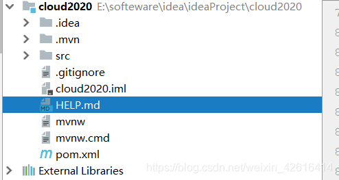

##### Idea新建项目文件解释

- **.idea 文件夹**：存放项目的配置信息，包括数据源，类库，项目字符编码，历史记录，版本控制信息等。

- **.mvn 文件夹**：存放着maven-wrapper.properties和相关jar包以及名为MavenWrapperDownloader的java文件

- **src 文件夹**：项目根目录

- **.gitignore**：分布式版本控制系统git的配置文件，意思为忽略提交，在 .gitingore 文件中，遵循相应的语法，即在每一行指定一个忽略规则。 如：.log、/target/、.idea（不用git的话可删除 没影响）

- **.iml文件**：intellij idea 的工程配置文件,里面包含当前 project 的一些配置信息，如模块开发的相关信息，比如 java 组件，maven 组件，插件组件等，还可能会存储一些模块路径信息，依赖信息以及一些别的信息。（删了程序重新导入后还会生成，但是由于配置丢失可能会造成程序异常）

- **HELP.md**： 项目的帮助文档（可删除 没影响）

- **mvnw与mvnw.cmd**：
  - 全名是maven wrapper的文件，它的作用是在 maven-wrapper.properties 文件中记录你要使用的maven版本，当用户执行mvnw clean 命令时，发现当前用户的maven版本和期望的版本不一致，那么就下载期望的版本，然后用期望的版本来执行mvn命令，比如mvn clean命令。linux上处理mevan版本兼容问题的脚本（可删除 没影响）
  - **mvnw.cmd**：执行mvnw命令的cmd入口windows 上处理 mevan 版本兼容问题的脚本（可删除 没影响）
  - mvnw 文件适用于Linux（bash），mvnw.cmd 适用于 Windows 环境。
- **pom.xml**：项目对象模型（核心重要），pom.xml主要描述了项目的maven坐标，依赖关系，开发者需要遵循的规则，缺陷管理系统，组织和licenses，以及其他所有的项目相关因素，是项目级别的配置文件。

 

----

     
	 
	 
	 
	 

