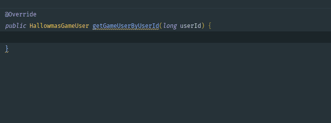
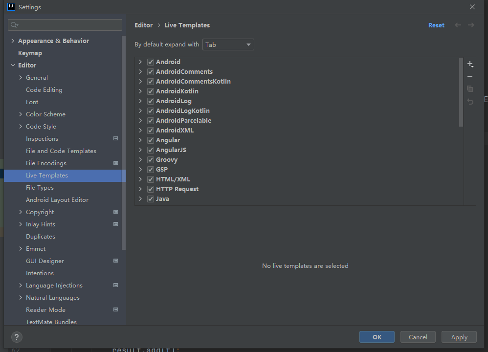
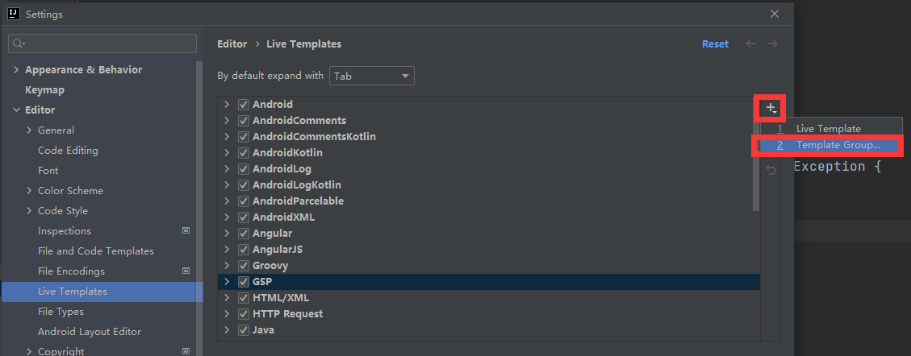
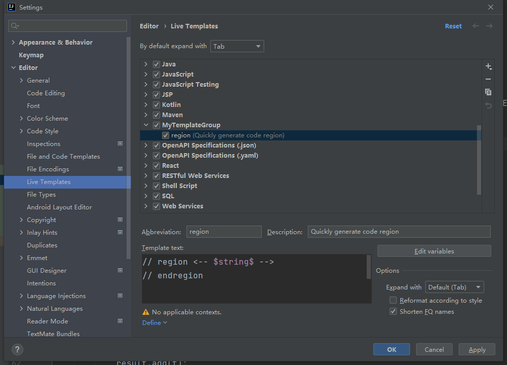
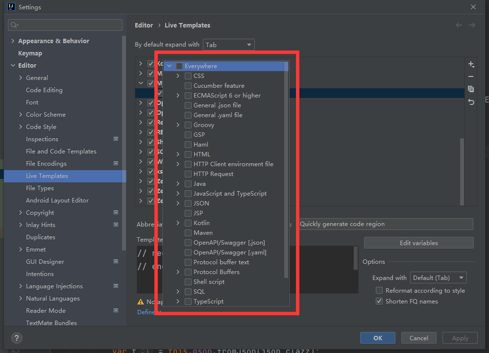

# 1	重要配置

## 1.1	在 IDEA 中统一设置字符编码

---


## 1.2	设置 properties 的字符编码

---


# 2	个性化配置

## 2.1	设置字体大小


---


## 2.2	设置主体

---


## 2.3	设置启动 IDEA 时不自动打开项目

- Appearance & Behavior → System Settings → 取消勾选 Reopen last project on start up

---


# 3	常用快捷键

| 快捷键         | 功能     |
| -------------- | -------- |
| CTRL + ALT + L | 代码排版 |
| ALT + ENTER    | 代码补全 |
|                |          |

---


# 4	创建项目

## 4.1	创建Maven项目


---


## 4.2	创建 Spring 项目

---


# 5	功能

## 5.1	调试

---

## 5.2	Live Template

##### 简介

Live Template 是一个预定义的代码模板，可以根据输入的内容快速生成相应模板的代码或注释。

效果如下：



<br>

##### 作用

1. 有更多的时间关注于业务逻辑，核心代码可以更优雅
2. 减少低级错误出现的可能，之前手写拼错和括号错位真是血和泪的教训


##### 自定义 Live Template

###### 1 - 打开 Settings，找到 Live Template



###### 2 - 添加 Template Group



创建 MyTemplateGroup


###### 3 - 在 MyTemplateGroup 下创建新的 Live Template


例如：



###### 4 - 设置模板的作用范围




##### 预定义变量（❗待补充）

<br>

##### 预定义函数（❗待补充）

<br>

---


## 5.2	代码折叠 region 与 end region

JetBrains全家桶中为我们提供了自定义代码块折叠的方式，只需要在需要折叠代码的上边写上region开头的注释，结束的地方写上endregion开头的注释即可。

```c
// region xxxxx
your code;
// endregion
复制代码
```

或者（注意，以下写法在 IntelliJ IDEA 2021.2.1 版本不可用）

```java
/* region xxxxx */
your code;
/* endregion */
```

---


# 6	在 Idea 的 Terminal 中使用 git

##### 说明

- 为了在 Idea 的 Terminal 中能直接使用 git 命令

##### 步骤

1. 打开 File → Setting
2. 在 Setting 中选择 Tool → Terminal
3. 修改 shellpath


##### 📌选择正确的 Shell path

- 使用 `..\Git\bin\bash.exe` ，不要使用 `..\Git\git-bash.exe`，否则每次打开将自动使用 git bash here 打开 gitbash 窗口。

---

