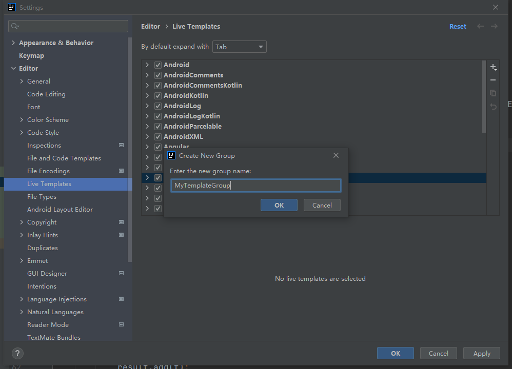
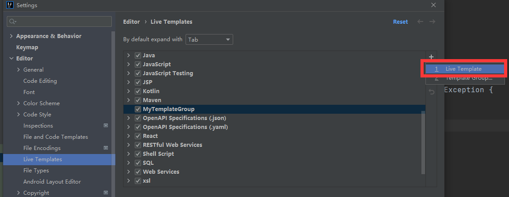
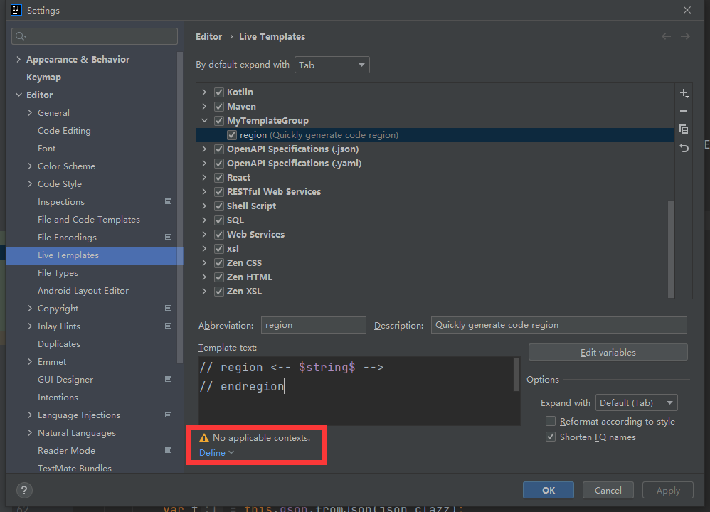

<div STYLE="page-break-after: always;">
	<br>
    <br>
    <br>
    <br>
    <br>
    <br>
    <br>
    <br>
    <br>
    <br>
	<center><h3><font size="20px">
        IntelliJ IDEA 使用手册与注意事项
    </font></h3></center>
	<br>
    <br>
    <br>
    <br>
    <br>
    <br>
    <br>
    <br>
    <br>
    <br>
</div>


# 1	配置

## 1.1	必要配置

#### 统一设置字符编码

1. 打开设置界面：

   1. 方式一：在项目选择界面选择 `Customize → All settings...`。

      

   2. 方式二：进入项目后选择 `File → Settings...` 。

      

2. 选择 `Editor → File ENcodings`：

   

3. 修改下列选项：

   1. Global Encodings：选择 `UTF-8`；

   2. Project Encodings：选择 `UTF-8；`

   3. Default encoding for properties files：选择 `UTF-8` 并勾选 `Transparent native-to-ascii conversion`。

      

4. 点击 Apply ，然后点击 OK。

<br>

---

<div STYLE="page-break-after: always;"><br>
<br>
<br>
<br>
<br>
<br>
<br>
<br>
<br>
<br></div>

## 1.2	个性化配置

#### 选择字体样式与大小

1. 打开设置界面
2. 依次点击 `Appearance & Behavior → Appearance`
3. 勾选 Use custom font，并设置字体大小

<br>

#### 设置启动 IDEA 时不自动打开项目

1. 打开设置界面
2. `Appearance & Behavior → System Settings`
3. 取消勾选 Reopen project on start up

<br>

---

<div STYLE="page-break-after: always;"><br>
<br>
<br>
<br>
<br>
<br>
<br>
<br>
<br>
<br></div>

## 1.3	配置导出与导入（❗未完成）

---

<div STYLE="page-break-after: always;"><br>
<br>
<br>
<br>
<br>
<br>
<br>
<br>
<br>
<br></div>

# 2	实用功能

## 2.1	常用快捷键

#### 快捷键

| 快捷键         | 功能     |
| -------------- | -------- |
| CTRL + ALT + L | 代码排版 |
| ALT + ENTER    | 代码补全 |

<br>

---

<div STYLE="page-break-after: always;"><br>
<br>
<br>
<br>
<br>
<br>
<br>
<br>
<br>
<br></div>

|      |      |
| ---- | ---- |
|      |      |
|      |      |
|      |      |

---


# 4	创建项目

## 4.1	创建Maven项目


---


## 4.2	创建 Spring 项目

---


# 5	功能

## 5.1	调试

---

## 5.2	Live Template

##### 简介

Live Template 是一个预定义的代码模板，可以根据输入的内容快速生成相应模板的代码或注释。

效果如下：


<br>

##### 作用

1. 有更多的时间关注于业务逻辑，核心代码可以更优雅
2. 减少低级错误出现的可能，之前手写拼错和括号错位真是血和泪的教训


##### 自定义 Live Template

###### 1 - 打开 Settings，找到 Live Template


###### 2 - 添加 Template Group


创建 MyTemplateGroup



###### 3 - 在 MyTemplateGroup 下创建新的 Live Template



例如：


###### 4 - 设置模板的作用范围




##### 预定义变量（❗待补充）

<br>

##### 预定义函数（❗待补充）

<br>

---


## 5.2	代码折叠 region 与 end region

JetBrains全家桶中为我们提供了自定义代码块折叠的方式，只需要在需要折叠代码的上边写上region开头的注释，结束的地方写上endregion开头的注释即可。

```c
// region xxxxx
your code;
// endregion
复制代码
```

或者（注意，以下写法在 IntelliJ IDEA 2021.2.1 版本不可用）

```java
/* region xxxxx */
your code;
/* endregion */
```

---


# 6	在 Idea 的 Terminal 中使用 git

##### 说明

- 为了在 Idea 的 Terminal 中能直接使用 git 命令

##### 步骤

1. 打开 File → Setting
2. 在 Setting 中选择 Tool → Terminal
3. 修改 shellpath


##### 📌选择正确的 Shell path

- 使用 `..\Git\bin\bash.exe` ，不要使用 `..\Git\git-bash.exe`，否则每次打开将自动使用 git bash here 打开 gitbash 窗口。

---


# 7	插件

## 7.1	Lombok

#### 在 IDEA 中使用 Lombok

如果项目中使用了 Lombok，必须在 IDEA 中安装 Lombok 插件。否者可能导致编译时无法找到 set 和 get 的问题。

---


## 7.2	Git Commit Template

---


https://blog.csdn.net/weixin_39818691/article/details/111252613
