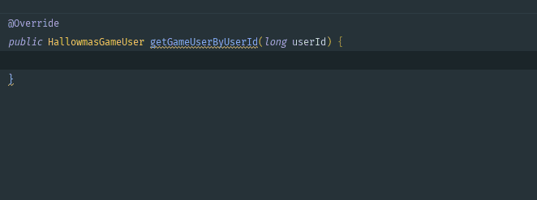
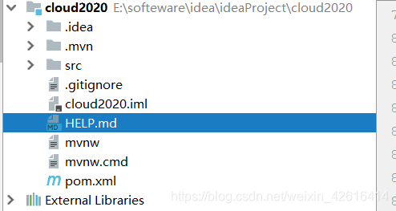

<div STYLE="page-break-after: always;">
	<br>
    <br>
    <br>
    <br>
    <br>
    <br>
    <br>
    <br>
    <br>
    <br>
	<center><h3><font size="20px">
        IntelliJ IDEA 使用手册与注意事项
    </font></h3></center>
	<br>
    <br>
    <br>
    <br>
    <br>
    <br>
    <br>
    <br>
    <br>
    <br>
</div>


# 1	配置

## 1.1	必要配置

#### 统一设置字符编码

1. 打开设置界面：

   1. 方式一：在项目选择界面选择 `Customize → All settings...`。

      

   2. 方式二：进入项目后选择 `File → Settings...` 。

      

2. 选择 `Editor → File ENcodings`：

   

3. 修改下列选项：

   1. Global Encodings：选择 `UTF-8`；

   2. Project Encodings：选择 `UTF-8；`

   3. Default encoding for properties files：选择 `UTF-8` 并勾选 `Transparent native-to-ascii conversion`。

      

4. 点击 Apply ，然后点击 OK。

<br>

#### Git 配置

<br>

#### 修改全局 Maven 版本

1. 在项目选择界面选择 `Customize → All settings...`。

2. 选择 `Build, Execution, Deployment → Build Tools → Maven`。

3. 修改下列选项：

   

<br>

---

<div STYLE="page-break-after: always;"></div>

## 1.2	Project 配置

#### 修改 Project 的 JDK 版本

1. 打开 `file → Project Structure...`；
2. 修改 Project 和 Module 的 JDK 版本；
3. 

<br>

---

<div STYLE="page-break-after: always;"></div>

## 1.2	个性化配置

#### 选择字体样式与大小

1. 打开设置界面
2. 依次点击 `Appearance & Behavior → Appearance`
3. 勾选 Use custom font，并设置字体大小

<br>

#### 设置启动 IDEA 时不自动打开项目

1. 打开设置界面
2. `Appearance & Behavior → System Settings`
3. 取消勾选 Reopen project on start up

<br>

---

<div STYLE="page-break-after: always;"></div>


## 1.3	配置导出与导入（❗未完成）

---

<div STYLE="page-break-after: always;"></div>


# 2	常用功能

## 2.1	快捷键

#### 常用快捷键

| 快捷键         | 功能     |
| -------------- | -------- |
| CTRL + ALT + L | 代码排版 |
| ALT + ENTER    | 代码补全 |

<br>

#### 📌修改快捷键


<br>

---

<div STYLE="page-break-after: always;"></div>

## 2.2	隐藏文件和文件夹


---

<div STYLE="page-break-after: always;"></div>

## 2.3	在项目中搜索

---

<div STYLE="page-break-after: always;"></div>

## 2.4	Live Template

#### 什么是 Live Template

Live Template 是一个预定义的代码模板，可以根据输入的内容快速生成相应模板的代码或注释，效果如下：



<br>

#### 作用

1. 有更多的时间关注于业务逻辑，核心代码可以更优雅；
2. 减少低级错误（比如手写拼错和括号错位）出现的可。

<br>

#### 自定义 Live Template

1. 打开 `File → Settings`；

2. 打开 `Editor → Live Templates`：

   

3. 添加 Template Group：

   

   

4. 在创建的 TemplateGroup 下创建新的 Live Template：

   

5. 填写 Abbreviation 和 Template text：

   

6. 设置模板的作用范围：

   

   

<br>

#### 预定义变量（❗待补充）

<br>

#### 预定义函数（❗待补充）

<br>

---

<div STYLE="page-break-after: always;"></div>

## 2.5	调试

---

<div STYLE="page-break-after: always;"></div>

## 2.6	代码折叠 region

#### region 的使用方法

JetBrains 提供了自定义代码块折叠的方式，只需要在需要折叠代码的上边写上 region 开头的注释，结束的地方写上 endregion 开头的注释即可。

```c
// region xxxxx
your code;
// endregion
```

<br>

---

<div STYLE="page-break-after: always;"></div>

# 3	插件

## 3.1	Lombok

#### 在 IDEA 中使用 Lombok

如果项目中使用了 Lombok，必须在 IDEA 中安装 Lombok 插件。否者可能导致编译时无法找到 set 和 get 的问题。

<br>

---

<div STYLE="page-break-after: always;"></div>

## 3.2	Git Commit Template

<br>

---

<div STYLE="page-break-after: always;"></div>

## 3.3	Grep Console

<br>

---

<div STYLE="page-break-after: always;"></div>

## 3.4	其它插件

https://blog.csdn.net/weixin_39818691/article/details/111252613

<br>

---

<div STYLE="page-break-after: always;"></div>

# 4	Project

## 4.1	Project 自动生成文件说明

#### 使用 IDEA 创建的 Spring 项目的基本结构



###### 说明

1. **.idea 文件夹**：存放项目的配置信息，包括数据源，类库，项目字符编码，历史记录，版本控制信息等；
2. **.mvn 文件夹**：存放着 maven-wrapper.properties 和相关 jar 包以及名为 MavenWrapperDownloader 的 java 文件；
3. **src 文件夹**：项目根目录；
4. **.gitignore**：分布式版本控制系统 git 的配置文件，意思为忽略提交，在 .gitingore 文件中，遵循相应的语法，即在每一行指定一个忽略规则。 如：.log、/target/、.idea。**如果项目不用 git ，可以删除**。
5. **.iml文件**：intellij idea 的工程配置文件,里面包含当前 project 的一些配置信息，如模块开发的相关信息，比如 java 组件，maven 组件，插件组件等，还可能会存储一些模块路径信息，依赖信息以及一些别的信息。**删除后 Project 重新导入后还会生成，但是由于配置丢失可能会造成程序异常**。
6. **HELP.md**： 项目的帮助文档，**可以删除**。
7. **mvnw** ：全称 maven wrapper ，作用是在 maven-wrapper.properties 文件中记录 project 使用的 maven 版本，当用户执行mvnw 命令（比如  mvn clean）时，如果发现当前用户的 maven 版本和期望的版本不一致，将会自动下载期望版本，并用期望版本执行 mvn 命令。主要用于在 linux 上处理 mevan 版本兼容问题的脚本。**可以删除**。
8. **mvnw.cmd**：执行 mvnw 命令的 cmd 入口，作用与 mvnw 相同，区别是用于处理 windows 上 mevan 版本兼容问题。**可以删除**。
9. **pom.xml**：项目对象模型，是 Maven 项目的 **核心文件，极其重要**。pom.xml 主要描述了项目的 maven 坐标，依赖关系，开发者需要遵循的规则，缺陷管理系统，组织和 licenses，以及其他所有的项目相关因素，是项目级别的配置文件。

<br>

----

<div STYLE="page-break-after: always;"></div>
