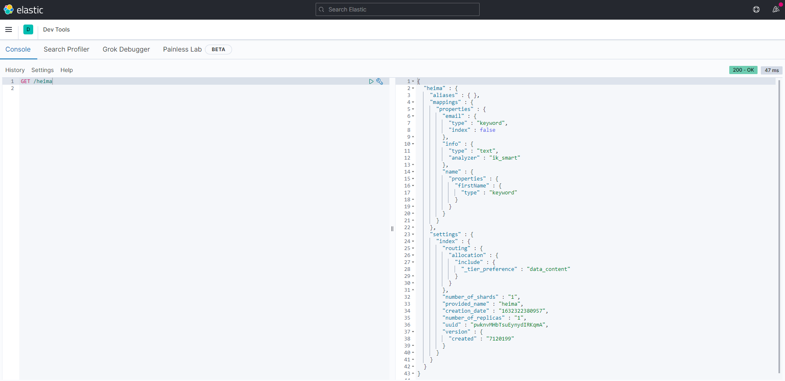
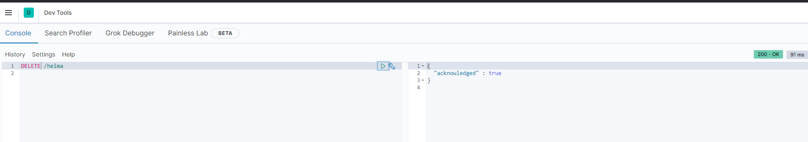

# 2	索引库操作

## 2.1	mapping 映射属性

#####  索引库和 mapping

索引库相当于数据表，而 mapping 映射相当于表的结构（DSL），是对索引库中文档的约束。

<br>

##### 常见的 mapping 属性

- **type**：字段数据类型，常见的简单类型有：
  - **字符串**：text（可分词的文本）、keyword（精确值，例如：品牌、国家、ip地址）
  - **数值**：long、integer、short、byte、double、float、
  - **布尔**：boolean
  - **日期**：date
  - **对象**：object
- **index**：是否创建索引，默认为true
- **analyzer**：使用哪种分词器
- **properties**：该字段的子字段

<br>

##### 示例 —— mapping 演示

例如下面的 json 文档：

```json
{
    "age": 21,
    "weight": 52.1,
    "isMarried": false,
    "info": "黑马程序员Java讲师",
    "email": "zy@itcast.cn",
    "score": [99.1, 99.5, 98.9],
    "name": {
        "firstName": "云",
        "lastName": "赵"
    }
}
```

对应的每个字段映射（mapping）：

- age：类型为 integer；参与搜索，因此需要index为true；无需分词器
- weight：类型为float；参与搜索，因此需要index为true；无需分词器
- isMarried：类型为boolean；参与搜索，因此需要index为true；无需分词器
- info：类型为字符串，需要分词，因此是text；参与搜索，因此需要index为true；分词器可以用ik_smart
- email：类型为字符串，但是不需要分词，因此是keyword；不参与搜索，因此需要index为false；无需分词器
- score：虽然是数组，但是我们只看元素的类型，类型为float；参与搜索，因此需要index为true；无需分词器
- name：类型为object，需要定义多个子属性
  - name.firstName；类型为字符串，但是不需要分词，因此是keyword；参与搜索，因此需要index为true；无需分词器
  - name.lastName；类型为字符串，但是不需要分词，因此是keyword；参与搜索，因此需要index为true；无需分词器

<br>

----

<div STYLE="page-break-after: always;">
    <br>
    <br>
    <br>
    <br>
    <br></div>

## 2.2	索引库的 CRUD

### 2.2.0

##### 📌本章节中统一使用 Kibana 编写 DSL 的方式来演示

<br>

----

<div STYLE="page-break-after: always;">
    <br>
    <br>
    <br>
    <br>
    <br></div>
### 2.2.1	创建索引库和映射

##### Mysql 数据类型与索引数据类型的对应关系

| MySQL数据类型     | Elasticsearch数据类型 | 说明                                                         |
| ----------------- | --------------------- | ------------------------------------------------------------ |
| tinyint           | short                 |                                                              |
| unsigned tinyint  | integer               |                                                              |
| mediumint         | integer               | -/-                                                          |
| smallint          | short                 |                                                              |
| unsigned smallint | integer               |                                                              |
| int               | integer               |                                                              |
| unsigned int      | long                  |                                                              |
| bigint            | long                  | -/-                                                          |
|                   | Bool                  |                                                              |
| Boolean           | boolean               | -/-                                                          |
| decimal           | double                | 如果decimal后面带小数点，Elasticsearch 6.7.1以下用text类型，6.7.1以上用BigDecimal |
| double            | double                | -/-                                                          |
| float             | float                 | -/-                                                          |
| char              | text                  | -/-                                                          |
| varchar           | text                  | -/-                                                          |
| longtext          | text                  | -/-                                                          |
| mediumtext        | text                  | -/-                                                          |
| tinytext          | text                  | -/-                                                          |
| blob              | binary                | -/-                                                          |
| binary            | binary                | -/-                                                          |
| bit               | long                  | bit(1)–&gt;boolean                                           |
| Date              | date                  | Elaticsearch默认格式：yyyy-MM-dd。                           |
| datetime          | date                  | Elaticsearch默认格式：yyyy-MM-dd’T’HH:mm:ss，如含微秒精度date_format为 yyyy-MM-dd’T’HH:mm:ss.S。 |
| timestamp         | date                  | Elaticsearch默认格式：yyyy-MM-dd’T’HH:mm:ss，如含微秒精度date_format为 yyyy-MM-dd’T’HH:mm:ss.S 。 |
| time              | date                  | Elaticsearch默认格式：HH:mm:ss,如含微秒精度date_format为 HH:mm:ss.S。 |
| year              | date                  | Elaticsearch默认格式：yyyy                                   |

##### 基本语法

- **请求方式**：PUT
- **请求路径**：/索引库名，可以自定义
- **请求参数**：mapping 映射

<br>

##### 格式

```json
PUT /索引库名称
{
  "mappings": {
    "properties": {
      "字段名":{
        "type": "text",
        "analyzer": "ik_smart"
      },
      "字段名2":{
        "type": "keyword",
        "index": "false"
      },
      "字段名3":{
        "properties": {
          "子字段": {
            "type": "keyword"
          }
        }
      },
      // ...略
    }
  }
}
```

<br>

##### 示例

```json
PUT /index_library_demo
{
  "mappings": {
    "properties": {
      "info":{
        "type":"text",
        "analyzer":"ik_smart"
      },
      "email":{
        "type":"text",
        "index":"false"
      },
      "name":{
        "properties":{
          "firstName":{
            "type":"keyword"
          },
          "lastName":{
            "type":"keyword"
          }
          }
      }
    }
  }
}
```

<br>

---

<div STYLE="page-break-after: always;">
    <br>
    <br>
    <br>
    <br>
    <br></div>

### 2.2.2	查询索引库

##### 基本语法

- 请求方式：GET
- 请求路径：/索引库名
- 请求参数：无

<br>

##### 格式

```
GET /索引库名
```

<br>

##### 示例



<br>

---

<div STYLE="page-break-after: always;">
    <br>
    <br>
    <br>
    <br>
    <br></div>

### 2.2.3	修改索引库

##### 📌mapping 无法修改已有字段

倒排索引结构虽然不复杂，但是一旦数据结构改变（比如改变了分词器），就需要重新创建倒排索引，这简直是灾难。因此索引库 **一旦创建，无法修改mapping**。

<br>

##### mapping 运行添加新的字段

虽然无法修改 mapping 中已有的字段，但是却允许添加新的字段到 mapping 中，因为不会对倒排索引产生影响。

<br>

##### 语法

```json
PUT /索引库名/_mapping
{
  "properties": {
    "新字段名":{
      "type": "integer"
    }
  }
}
```

<br>

---

<div STYLE="page-break-after: always;">
    <br>
    <br>
    <br>
    <br>
    <br></div>

### 2.2.4.删除索引库

##### 语法

- 请求方式：DELETE
- 请求路径：/索引库名
- 请求参数：无

<br>

##### 格式

```
DELETE /索引库名
```

<br>

##### 测试



---

<div STYLE="page-break-after: always;">
    <br>
    <br>
    <br>
    <br>
    <br></div>
