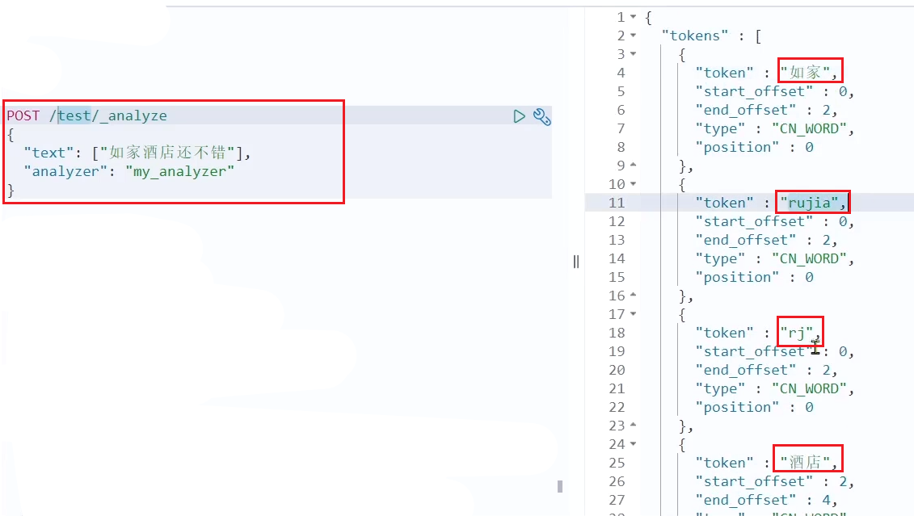

# 8	自动补全

## 8.1	自动补全概述

##### 什么是自动补全

​	当用户在搜索框输入字符时，我们应该提示出与该字符有关的搜索项，如图：


这种根据用户输入的字母，提示完整词条的功能，就是自动补全了。

<br>

##### 拼音分词器

要实现根据字母做补全，就必须对文档按照拼音分词。在GitHub上恰好有elasticsearch的拼音分词插件。地址：https://github.com/medcl/elasticsearch-analysis-pinyin 。

<br>

---

<div STYLE="page-break-after: always;">
    <br>
    <br>
    <br>
    <br>
    <br></div>

## 8.2	安装拼音分词器插件

##### 步骤

可以参考IK分词器的安装过程。

1. 解压
2. 上传到虚拟机中，elasticsearch的plugin目录
3. 重启elasticsearch
4. 测试：

```
POST /_analyze
{
  "text": "如家酒店还不错",
  "analyzer": "pinyin"
}
```

结果：


<br>

---

<div STYLE="page-break-after: always;">
    <br>
    <br>
    <br>
    <br>
    <br></div>

## 8.3	自定义分词器

##### 对拼音分词器做个性化定制

默认的拼音分词器会将每个汉字单独分为拼音，而我们希望的是每个词条形成一组拼音，需要对拼音分词器做个性化定制，形成自定义分词器。

<br>

##### elasticsearch 中分词器（analyzer）的组成

- character filters：在tokenizer之前对文本进行处理。例如删除字符、替换字符
- tokenizer：将文本按照一定的规则切割成词条（term）。例如keyword，就是不分词；还有ik_smart
- tokenizer filter：将tokenizer输出的词条做进一步处理。例如大小写转换、同义词处理、拼音处理等

<br>

##### 文档分词时的文档处理过程


<br>

##### 语法—声明自定义分词器的

```json
PUT /test
{
  "settings": {
    "analysis": {
      "analyzer": { // 自定义分词器
        "my_analyzer": {  // 分词器名称
          "tokenizer": "ik_max_word",
          "filter": "py"
        }
      },
      "filter": { // 自定义tokenizer filter
        "py": { // 过滤器名称
          "type": "pinyin", // 过滤器类型，这里是pinyin
		  "keep_full_pinyin": false,
          "keep_joined_full_pinyin": true,
          "keep_original": true,
          "limit_first_letter_length": 16,
          "remove_duplicated_term": true,
          "none_chinese_pinyin_tokenize": false
        }
      }
    }
  },
  "mappings": {
    "properties": {
      "name": {
        "type": "text",
        "analyzer": "my_analyzer",
        "search_analyzer": "ik_smart"
      }
    }
  }
}
```

<br>

##### 测试



<br>

##### 📌搜索时不要使用拼音分词器

为了避免搜索到同音字，搜索时不要使用拼音分词器。

<br>

---

<div STYLE="page-break-after: always;">
    <br>
    <br>
    <br>
    <br>
    <br></div>

## 8.4	自动补全查询

##### Completion Suggester 查询

elasticsearch 提供了 [Completion Suggester](https://www.elastic.co/guide/en/elasticsearch/reference/7.6/search-suggesters.html) 查询来实现自动补全功能。这个查询会匹配以用户输入内容开头的词条并返回。为了提高补全查询的效率，对于文档中字段的类型有一些约束：

- 参与补全查询的字段必须是 **completion 类型**。
- 字段的内容一般是**用来补全的多个词条形成的数组**。

<br>

##### 例

比如，一个这样的索引库：

```json
// 创建索引库
PUT test
{
  "mappings": {
    "properties": {
      "title":{
        "type": "completion"
      }
    }
  }
}
```

插入下面的数据：

```json
// 示例数据
POST test/_doc
{
  "title": ["Sony", "WH-1000XM3"]
}
POST test/_doc
{
  "title": ["SK-II", "PITERA"]
}
POST test/_doc
{
  "title": ["Nintendo", "switch"]
}
```

查询的 DSL 语句如下：

```json
// 自动补全查询
GET /test/_search
{
  "suggest": {
    "title_suggest": {
      "text": "s", // 关键字
      "completion": {
        "field": "title", // 补全查询的字段
        "skip_duplicates": true, // 跳过重复的
        "size": 10 // 获取前10条结果
      }
    }
  }
}
```

<br>

---

<div STYLE="page-break-after: always;">
    <br>
    <br>
    <br>
    <br>
    <br></div>

## 8.5	示例—实现酒店搜索框自动补全

##### 前提

现在，我们的 hotel 索引库还没有设置拼音分词器，需要修改索引库中的配置。但是我们知道索引库是无法修改的，只能删除然后重新创建。

另外，我们需要添加一个字段，用来做自动补全，将 brand、suggestion、city 等都放进去，作为自动补全的提示。

<br>

##### 待办事项

1. 修改hotel索引库结构，设置自定义拼音分词器
2. 修改索引库的name、all字段，使用自定义分词器
3. 索引库添加一个新字段suggestion，类型为completion类型，使用自定义的分词器
4. 给HotelDoc类添加suggestion字段，内容包含brand、business
5. 重新导入数据到hotel库

<br>

##### 修改酒店映射结构

```
// 酒店数据索引库
PUT /hotel
{
  "settings": {
    "analysis": {
      "analyzer": {
        "text_anlyzer": {
          "tokenizer": "ik_max_word",
          "filter": "py"
        },
        "completion_analyzer": {
          "tokenizer": "keyword",
          "filter": "py"
        }
      },
      "filter": {
        "py": {
          "type": "pinyin",
          "keep_full_pinyin": false,
          "keep_joined_full_pinyin": true,
          "keep_original": true,
          "limit_first_letter_length": 16,
          "remove_duplicated_term": true,
          "none_chinese_pinyin_tokenize": false
        }
      }
    }
  },
  "mappings": {
    "properties": {
      "id":{
        "type": "keyword"
      },
      "name":{
        "type": "text",
        "analyzer": "text_anlyzer",
        "search_analyzer": "ik_smart",
        "copy_to": "all"
      },
      "address":{
        "type": "keyword",
        "index": false
      },
      "price":{
        "type": "integer"
      },
      "score":{
        "type": "integer"
      },
      "brand":{
        "type": "keyword",
        "copy_to": "all"
      },
      "city":{
        "type": "keyword"
      },
      "starName":{
        "type": "keyword"
      },
      "business":{
        "type": "keyword",
        "copy_to": "all"
      },
      "location":{
        "type": "geo_point"
      },
      "pic":{
        "type": "keyword",
        "index": false
      },
      "all":{
        "type": "text",
        "analyzer": "text_anlyzer",
        "search_analyzer": "ik_smart"
      },
      "suggestion":{
          "type": "completion",
          "analyzer": "completion_analyzer"
      }
    }
  }
}
```

<br>

##### 修改 HotelDoc 实体

HotelDoc中要添加一个字段，用来做自动补全，内容可以是酒店品牌、城市、商圈等信息。按照自动补全字段的要求，最好是这些字段的数组。

因此我们在HotelDoc中添加一个suggestion字段，类型为`List<String>`，然后将brand、city、business等信息放到里面。

代码如下：

```
package cn.itcast.hotel.pojo;

import lombok.Data;
import lombok.NoArgsConstructor;

import java.util.ArrayList;
import java.util.Arrays;
import java.util.Collections;
import java.util.List;

@Data
@NoArgsConstructor
public class HotelDoc {
    private Long id;
    private String name;
    private String address;
    private Integer price;
    private Integer score;
    private String brand;
    private String city;
    private String starName;
    private String business;
    private String location;
    private String pic;
    private Object distance;
    private Boolean isAD;
    private List<String> suggestion;

    public HotelDoc(Hotel hotel) {
        this.id = hotel.getId();
        this.name = hotel.getName();
        this.address = hotel.getAddress();
        this.price = hotel.getPrice();
        this.score = hotel.getScore();
        this.brand = hotel.getBrand();
        this.city = hotel.getCity();
        this.starName = hotel.getStarName();
        this.business = hotel.getBusiness();
        this.location = hotel.getLatitude() + ", " + hotel.getLongitude();
        this.pic = hotel.getPic();
        // 组装suggestion
        if(this.business.contains("/")){
            // business有多个值，需要切割
            String[] arr = this.business.split("/");
            // 添加元素
            this.suggestion = new ArrayList<>();
            this.suggestion.add(this.brand);
            Collections.addAll(this.suggestion, arr);
        }else {
            this.suggestion = Arrays.asList(this.brand, this.business);
        }
    }
}
```

<br>

##### 重新导入

重新执行之前编写的导入数据功能，可以看到新的酒店数据中包含了suggestion：

<br>

##### 自动补全查询的 JavaAPI

示例：


而自动补全的结果也比较特殊，解析的代码如下：


<br>

##### 实现搜索框自动补全

查看前端页面，可以发现当我们在输入框键入时，前端会发起 ajax 请求：


返回值是补全词条的集合，类型为 `List<String>`

###### 步骤

1. 在`cn.itcast.hotel.web`包下的`HotelController`中添加新接口，接收新的请求：

```java
@GetMapping("suggestion")
public List<String> getSuggestions(@RequestParam("key") String prefix) {
    return hotelService.getSuggestions(prefix);
}
```

2. 在`cn.itcast.hotel.service`包下的`IhotelService`中添加方法：

```java
List<String> getSuggestions(String prefix);
```

3. 在`cn.itcast.hotel.service.impl.HotelService`中实现该方法：

```java
@Override
public List<String> getSuggestions(String prefix) {
    try {
        // 1.准备Request
        SearchRequest request = new SearchRequest("hotel");
        // 2.准备DSL
        request.source().suggest(new SuggestBuilder().addSuggestion(
            "suggestions",
            SuggestBuilders.completionSuggestion("suggestion")
            .prefix(prefix)
            .skipDuplicates(true)
            .size(10)
        ));
        // 3.发起请求
        SearchResponse response = client.search(request, RequestOptions.DEFAULT);
        // 4.解析结果
        Suggest suggest = response.getSuggest();
        // 4.1.根据补全查询名称，获取补全结果
        CompletionSuggestion suggestions = suggest.getSuggestion("suggestions");
        // 4.2.获取options
        List<CompletionSuggestion.Entry.Option> options = suggestions.getOptions();
        // 4.3.遍历
        List<String> list = new ArrayList<>(options.size());
        for (CompletionSuggestion.Entry.Option option : options) {
            String text = option.getText().toString();
            list.add(text);
        }
        return list;
    } catch (IOException e) {
        throw new RuntimeException(e);
    }
}
```

<br>

---

<div STYLE="page-break-after: always;">
    <br>
    <br>
    <br>
    <br>
    <br></div>

