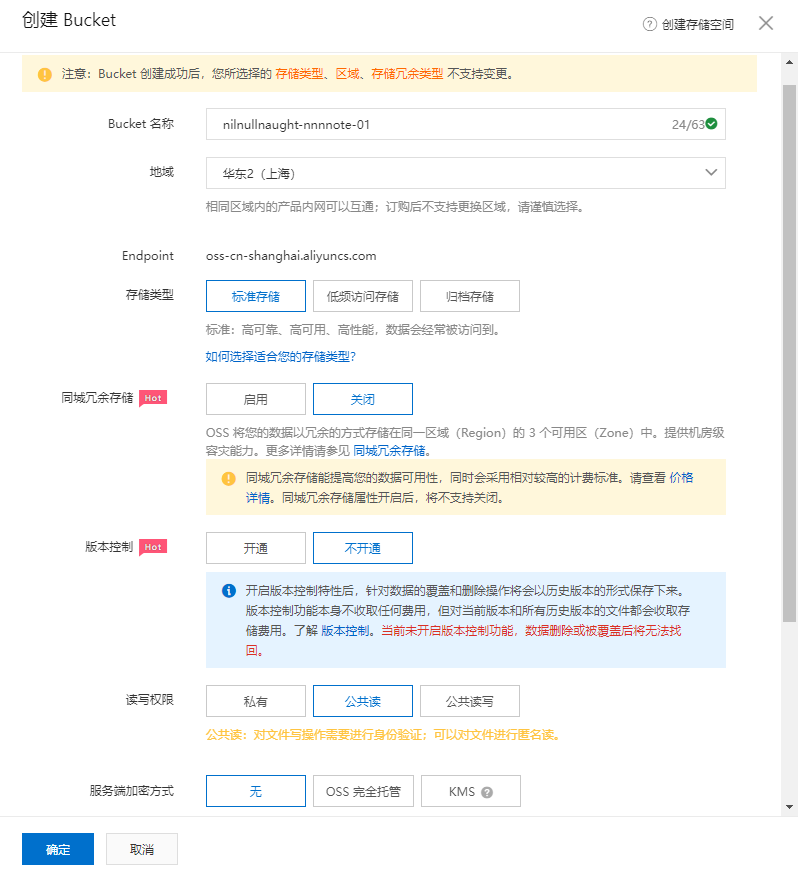

# 5	对象存储 OSS

## 5.1	阿里云 OSS

##### OSS 简介

对象存储服务（Object Storage Service，OSS）是一种海量、安全、低成本、高可靠的云存储服务，适合存放任意类型的文件。容量和处理能力弹性扩展，多种存储类型供选择，全面优化存储成本。

<br>

##### 阿里云 OSS 官方地址

https://www.aliyun.com/product/oss。

<br>

##### 基本使用

###### 开通“对象存储OSS”服务

1. 申请阿里云账号
2. 实名认证
3. 开通“对象存储OSS”服务
4. 进入管理控制台

###### 创建 bucket

打开阿里云 OSS 控制台，选择 bucket 列表，创建 bucket：




###### bucket 属性（待补充）

- 

###### RAM 访问控制（已过时，不推荐使用）

地址：https://ram.console.aliyun.com/manage/ak

<br>

##### SDK


<br>

----

<div STYLE="page-break-after: always;">
    <br>
	<br>
	<br>
	<br>
	<br>
</div>
## 5.2	微服务整合 OSS


##### 整合 OSS

###### 在 service 模块下创建子模块 service-oss

###### 引入依赖

```xml
    <!-- 阿里云oss依赖 -->
    <dependency>
        <groupId>com.aliyun.oss</groupId>
        <artifactId>aliyun-sdk-oss</artifactId>
    </dependency>

    <!-- 日期工具栏依赖 -->
    <dependency>
        <groupId>joda-time</groupId>
        <artifactId>joda-time</artifactId>
    </dependency>
```

- aliyun-sdk-oss 的版本需要 3.0 以上。

###### 配置application.properties、

```
#服务端口
server.port=8002
#服务名
spring.application.name=service-oss

#环境设置：dev、test、prod
spring.profiles.active=dev
        
#阿里云 OSS
#不同的服务器，地址不同
aliyun.oss.file.endpoint=your endpoint
aliyun.oss.file.keyid=your accessKeyId
aliyun.oss.file.keysecret=your accessKeySecret
#bucket可以在控制台创建，也可以使用java代码创建
aliyun.oss.file.bucketname=guli-file
```

###### 创建启动类

```java
package cn.nilnullnaught.oss;

@ComponentScan({"cn.nilnullnaught"})
@SpringBootApplication(exclude = DataSourceAutoConfiguration.class)
public class OssApplication {

    public static void main(String[] args) {
        SpringApplication.run(OssApplication.class, args);
    }
}
```

###### 创建常量读取工具类

使用 `@Value` 读取 application.properties 里的配置内容，用 spring 的 InitializingBean 的 afterPropertiesSet 来初始化配置信息，这个方法将在所有的属性被初始化后调用。

```java
/**
 * 常量类，读取配置文件application.properties中的配置
 */
@Component
//@PropertySource("classpath:application.properties")
public class ConstantPropertiesUtil implements InitializingBean {

	@Value("${aliyun.oss.file.endpoint}")
	private String endpoint;

	@Value("${aliyun.oss.file.keyid}")
	private String keyId;

	@Value("${aliyun.oss.file.keysecret}")
	private String keySecret;

	@Value("${aliyun.oss.file.bucketname}")
	private String bucketName;

	public static String END_POINT;
	public static String ACCESS_KEY_ID;
	public static String ACCESS_KEY_SECRET;
	public static String BUCKET_NAME;

	@Override
	public void afterPropertiesSet() throws Exception {
		END_POINT = endpoint;
		ACCESS_KEY_ID = keyId;
		ACCESS_KEY_SECRET = keySecret;
		BUCKET_NAME = bucketName;
	}
}
```

###### 实现文件上传服务接口

在 service 包下创建 OssService 接口与接口的实现类 OssServiceImpl：

```java
public interface OssService {

    /**
     * 文件上传至阿里云
     * @param file
     * @return
     */
    String uploadFileAvatar(MultipartFile file);
}
```

```java
@Service
public class OssServiceImpl implements OssService {

    //上传头像到oss
    @Override
    public String uploadFileAvatar(MultipartFile file) {
        // 工具类获取值
        String endpoint = ConstantPropertiesUtils.END_POINT;
        String accessKeyId = ConstantPropertiesUtils.ACCESS_KEY_ID;
        String accessKeySecret = ConstantPropertiesUtils.ACCESS_KEY_SECRET;
        String bucketName = ConstantPropertiesUtils.BUCKET_NAME;

        try {
            // 创建OSS实例。
            OSS ossClient = new OSSClientBuilder().build(endpoint, accessKeyId, accessKeySecret);

            //获取上传文件输入流
            InputStream inputStream = file.getInputStream();


            //将文件名修改为 UUID.扩展名 防止重复
            String uuid = UUID.randomUUID().toString();
            //获取文件名称
            String fileName = file.getOriginalFilename();
            //提取 文件的 .扩展名
            String fileType = fileName.substring(fileName.lastIndexOf("."));
            //修改文件名：uuid.扩展名
            fileName = UUID.randomUUID().toString() + fileType;

            //2 把文件按照日期进行分类
            //获取当前日期
            //   2019/11/12
            String datePath = new DateTime().toString("yyyy/MM/dd");
            //拼接
            //  2019/11/12/ewtqr313401.jpg
            fileName = datePath+"/"+fileName;

            //调用oss方法实现上传
            //第一个参数  Bucket名称
            //第二个参数  上传到oss文件路径和文件名称   aa/bb/1.jpg
            //第三个参数  上传文件输入流
            ossClient.putObject(bucketName,fileName , inputStream);

            // 关闭OSSClient。
            ossClient.shutdown();

            //把上传之后文件路径返回
            //需要把上传到阿里云oss路径手动拼接出来
            //  https://edu-guli-1010.oss-cn-beijing.aliyuncs.com/01.jpg
            String url = "https://"+bucketName+"."+endpoint+"/"+fileName;
            return url;
        }catch(Exception e) {
            e.printStackTrace();
            return null;
        }
    }
}
```

###### 实现文件上传 controller 接口

```java
@RestController
@RequestMapping("/eduoss/fileoss")
@CrossOrigin
public class OssController {
    @Autowired
    private OssService ossService;

    //上传头像的方法
    @PostMapping
    public ResponseResult uploadOssFile(MultipartFile file) {
        //获取上传文件  MultipartFile
        //返回上传到oss的路径
        String url = ossService.uploadFileAvatar(file);
        return ResponseResult.ok().data("url",url);
    }
}
```

<br>

---

<div STYLE="page-break-after: always;">
    <br>
	<br>
	<br>
	<br>
	<br>
</div>
