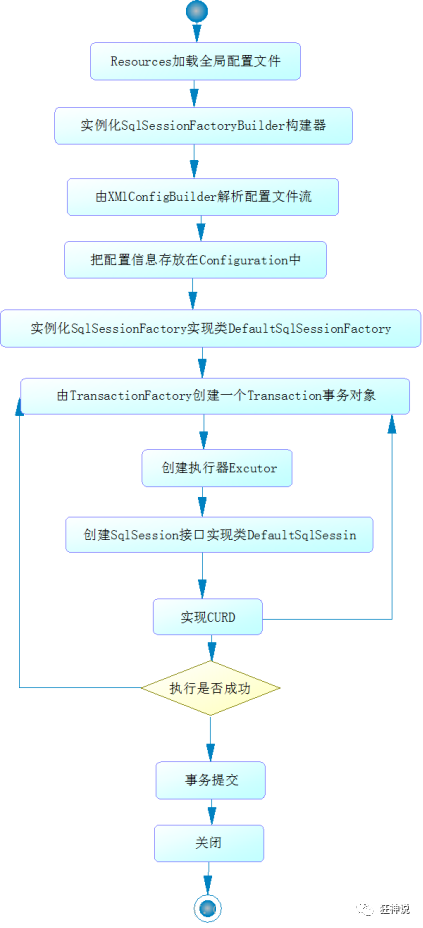

# 3	MyBatis

## 3.1	Mybatis 简介

##### 什么是 MyBatis

MyBatis 是一款优秀的 **持久层框架**，它支持自定义 SQL、存储过程以及高级映射。MyBatis 免除了几乎所有的 JDBC 代码以及设置参数和获取结果集的工作。MyBatis 可以通过简单的 XML 或注解来配置和映射 **原始类型**、**接口** 和 **Java POJO** 为数据库中的记录。

MyBatis 是一个半自动化的 **ORM（Object Relationship Mapping，对象关系映射）框架**。

<br>

##### Mybatis 官方中文文档

https://mybatis.org/mybatis-3/zh/index.html

<br>

---

<div STYLE="page-break-after: always;"><br>
    <br>
    <br>
    <br>
    <br>
    <br>
    <br>
    <br>
    <br>
    <br></div>
## 3.2	在 Maven 项目中引入 MyBatis

##### 实现步骤

###### 第一步——创建 Maven项目，导入相关依赖

```xml
<dependency>
   <groupId>org.mybatis</groupId>
   <artifactId>mybatis</artifactId>
   <version>3.5.2</version>
</dependency>
<dependency>
   <groupId>mysql</groupId>
   <artifactId>mysql-connector-java</artifactId>
   <version>5.1.47</version>
</dependency>
```

###### 第二步——编写 Mybatis 核心配置文件

```xml
<?xml version="1.0" encoding="UTF-8" ?>
<!DOCTYPE configuration
       PUBLIC "-//mybatis.org//DTD Config 3.0//EN"
       "http://mybatis.org/dtd/mybatis-3-config.dtd">
<configuration>
   <environments default="development">
       <environment id="development">
           <transactionManager type="JDBC"/>
           <dataSource type="POOLED">
               <property name="driver" value="com.mysql.jdbc.Driver"/>
               <property name="url" value="jdbc:mysql://localhost:3306/mybatis?useSSL=true&amp;useUnicode=true&amp;characterEncoding=utf8"/>
               <property name="username" value="root"/>
               <property name="password" value="123456"/>
           </dataSource>
       </environment>
   </environments>
   <mappers>
       <mapper resource="cn/nilnullnaught/MybatisTest/dao/userMapper.xml"/>
   </mappers>
</configuration>
```

###### 第三步——编写MyBatis工具类

```java
import org.apache.ibatis.io.Resources;
import org.apache.ibatis.session.SqlSession;
import org.apache.ibatis.session.SqlSessionFactory;
import org.apache.ibatis.session.SqlSessionFactoryBuilder;
import java.io.IOException;
import java.io.InputStream;

public class MybatisUtils {

   private static SqlSessionFactory sqlSessionFactory;

   static {
       try {
           String resource = "mybatis-config.xml";
           InputStream inputStream = Resources.getResourceAsStream(resource);
           sqlSessionFactory = new SqlSessionFactoryBuilder().build(inputStream);
      } catch (IOException e) {
           e.printStackTrace();
      }
  }

  //获取SqlSession连接
  public static SqlSession getSession(){
      return getSession(true); //事务自动提交
  }
 
  public static SqlSession getSession(boolean flag){
      return sqlSessionFactory.openSession(flag);
  }
}
```

###### 第四步——创建数据表对应的实体类

例如：

```java
public class User {
   
   private int id;  //id
   private String name;   //姓名
   private String pwd;   //密码
   
   //构造,有参,无参
   //set/get
   //toString()
   
}
```

###### 第五步——编写 Mapper 接口类

```java
import com.kuang.pojo.User;
import java.util.List;

public interface UserMapper {
   List<User> selectUser();
}
```

###### 第六步——编写 Mapper.xml 配置文件

```xml
<?xml version="1.0" encoding="UTF-8" ?>
<!DOCTYPE mapper
       PUBLIC "-//mybatis.org//DTD Mapper 3.0//EN"
       "http://mybatis.org/dtd/mybatis-3-mapper.dtd">
<!-- 配置文件中 namespace 中的名称为对应Mapper接口或者Dao接口的完整包名,必须一致 -->
<mapper namespace="cn.nilnullnaught.MybatisTest.dao.UserMapper">
 <select id="selectUser" resultType="com.kuang.pojo.User">
  select * from user
 </select>
</mapper>
```

###### 第七步——编写测试类

```java
public class MyTest {
   @Test
   public void selectUser() {
       SqlSession session = MybatisUtils.getSession();
       //方法一:
       //List<User> users = session.selectList("cn.nilnullnaught.MybatisTest.dao.UserMapper.selectUser");
       //方法二:
       UserMapper mapper = session.getMapper(UserMapper.class);
       List<User> users = mapper.selectUser();

       for (User user: users){
           System.out.println(user);
      }
       session.close();
  }
}
```

<br>

##### 📌Maven静态资源过滤问题

Maven 项目 build 后，生成的 target 文件中不包含 xml 文件。

###### 解决方法

在 pom.xml 文件中添加以下内容：

```xml
<resources>
   <resource>
       <directory>src/main/java</directory>
       <includes>
           <include>**/*.properties</include>
           <include>**/*.xml</include>
       </includes>
       <filtering>false</filtering>
   </resource>
   <resource>
       <directory>src/main/resources</directory>
       <includes>
           <include>**/*.properties</include>
           <include>**/*.xml</include>
       </includes>
       <filtering>false</filtering>
   </resource>
</resources>
```

<br>

---

<div STYLE="page-break-after: always;"><br>
    <br>
    <br>
    <br>
    <br>
    <br>
    <br>
    <br>
    <br>
    <br></div>
## 3.3	Mybatis 核心配置文件

##### 简介

Mybatis 的核心配置文件包含了会深深影响 MyBatis 行为的设置和属性信息。

<br>

#####  配置文档的顶层结构

注意元素节点的顺序，顺序不对会报错：

- configuration（配置）
  - properties（属性）
  - settings（设置）
  - typeAliases（类型别名）
  - typeHandlers（类型处理器）
  - objectFactory（对象工厂）
  - plugins（插件）
  - environments（环境配置）
    - environment（环境变量）
      - transactionManager（事务管理器）
      - dataSource（数据源）
  - databaseIdProvider（数据库厂商标识）
  - mappers（映射器）

<br>

##### `<properties>`

###### 功能

在 `<properties>` 中设置的属性，可以在整个配置文件中用来替换需要 **动态配置** 的属性值。

例：

```xml
<configuration>
	<properties resource="org/mybatis/example/config.properties">
	  <property name="driver" value="dev_user"/>
	  <property name="url" value="F2Fa3!33TYyg"/>
	  <property name="username" value="dev_user"/>
	  <property name="password" value="F2Fa3!33TYyg"/>
	</properties>

	<environments default="development">
		<environment id="development">
	    	<transactionManager type="JDBC"/>
			<dataSource type="POOLED">
				<property name="driver" value="${driver}"/>
				<property name="url" value="${url}"/>
				<property name="username" value="${username}"/>
				<property name="password" value="${password}"/>
			</dataSource>
		</environment>
	</environments>
</configuration>
```

###### 在核心配置文件外配置具体的 `<property>`

`<properties>` 中的属性可以在核心配置文件的外部进行配置，并可以动态进行替换：

```
<properties resource="org/mybatis/example/config.properties">
</properties>
```

org/mybatis/example/config.properties：

```xml
<property name="username" value="dev_user"/>
<property name="password" value="F2Fa3!33TYyg"/>
```

###### 使用代码方式传入属性值

在 `SqlSessionFactoryBuilder.build()` 方法中传入属性值。例如：

```java
SqlSessionFactory factory = new SqlSessionFactoryBuilder().build(reader, props);
// ... 或者 ...
SqlSessionFactory factory = new SqlSessionFactoryBuilder().build(reader, environment, props);
```

###### `<properties>` 的加载顺序

1. 首先读取`<properties>` 内指定的属性。
2. 然后根据 `<properties>` 中的 resource 属性读取类路径下属性文件，或根据 url 属性指定的路径读取属性文件，并覆盖之前读取过的同名属性。
3. 最后读取作为 SqlSessionFactoryBuilder.build() 方法参数传递的属性，并覆盖之前读取过的同名属性。

<br>

##### `<settings>`

MyBatis 中极为重要的调整设置，它们会改变 MyBatis 的运行时行为。 下表描述了设置中各项设置的含义、默认值等。

| 设置名                             | 描述                                                         | 有效值                                                       | 默认值                                                |
| :--------------------------------- | :----------------------------------------------------------- | :----------------------------------------------------------- | :---------------------------------------------------- |
| cacheEnabled                       | 全局性地开启或关闭所有映射器配置文件中已配置的任何缓存。     | true \| false                                                | true                                                  |
| lazyLoadingEnabled                 | 延迟加载的全局开关。当开启时，所有关联对象都会延迟加载。 特定关联关系中可通过设置 `fetchType` 属性来覆盖该项的开关状态。 | true \| false                                                | false                                                 |
| aggressiveLazyLoading              | 开启时，任一方法的调用都会加载该对象的所有延迟加载属性。 否则，每个延迟加载属性会按需加载（参考 `lazyLoadTriggerMethods`)。 | true \| false                                                | false （在 3.4.1 及之前的版本中默认为 true）          |
| multipleResultSetsEnabled          | 是否允许单个语句返回多结果集（需要数据库驱动支持）。         | true \| false                                                | true                                                  |
| useColumnLabel                     | 使用列标签代替列名。实际表现依赖于数据库驱动，具体可参考数据库驱动的相关文档，或通过对比测试来观察。 | true \| false                                                | true                                                  |
| useGeneratedKeys                   | 允许 JDBC 支持自动生成主键，需要数据库驱动支持。如果设置为 true，将强制使用自动生成主键。尽管一些数据库驱动不支持此特性，但仍可正常工作（如 Derby）。 | true \| false                                                | False                                                 |
| autoMappingBehavior                | 指定 MyBatis 应如何自动映射列到字段或属性。 NONE 表示关闭自动映射；PARTIAL 只会自动映射没有定义嵌套结果映射的字段。 FULL 会自动映射任何复杂的结果集（无论是否嵌套）。 | NONE, PARTIAL, FULL                                          | PARTIAL                                               |
| autoMappingUnknownColumnBehavior   | 指定发现自动映射目标未知列（或未知属性类型）的行为。`NONE`: 不做任何反应`WARNING`: 输出警告日志（`'org.apache.ibatis.session.AutoMappingUnknownColumnBehavior'` 的日志等级必须设置为 `WARN`）`FAILING`: 映射失败 (抛出 `SqlSessionException`) | NONE, WARNING, FAILING                                       | NONE                                                  |
| defaultExecutorType                | 配置默认的执行器。SIMPLE 就是普通的执行器；REUSE 执行器会重用预处理语句（PreparedStatement）； BATCH 执行器不仅重用语句还会执行批量更新。 | SIMPLE REUSE BATCH                                           | SIMPLE                                                |
| defaultStatementTimeout            | 设置超时时间，它决定数据库驱动等待数据库响应的秒数。         | 任意正整数                                                   | 未设置 (null)                                         |
| defaultFetchSize                   | 为驱动的结果集获取数量（fetchSize）设置一个建议值。此参数只可以在查询设置中被覆盖。 | 任意正整数                                                   | 未设置 (null)                                         |
| defaultResultSetType               | 指定语句默认的滚动策略。（新增于 3.5.2）                     | FORWARD_ONLY \| SCROLL_SENSITIVE \| SCROLL_INSENSITIVE \| DEFAULT（等同于未设置） | 未设置 (null)                                         |
| safeRowBoundsEnabled               | 是否允许在嵌套语句中使用分页（RowBounds）。如果允许使用则设置为 false。 | true \| false                                                | False                                                 |
| safeResultHandlerEnabled           | 是否允许在嵌套语句中使用结果处理器（ResultHandler）。如果允许使用则设置为 false。 | true \| false                                                | True                                                  |
| mapUnderscoreToCamelCase           | 是否开启驼峰命名自动映射，即从经典数据库列名 A_COLUMN 映射到经典 Java 属性名 aColumn。 | true \| false                                                | False                                                 |
| localCacheScope                    | MyBatis 利用本地缓存机制（Local Cache）防止循环引用和加速重复的嵌套查询。 默认值为 SESSION，会缓存一个会话中执行的所有查询。 若设置值为 STATEMENT，本地缓存将仅用于执行语句，对相同 SqlSession 的不同查询将不会进行缓存。 | SESSION \| STATEMENT                                         | SESSION                                               |
| jdbcTypeForNull                    | 当没有为参数指定特定的 JDBC 类型时，空值的默认 JDBC 类型。 某些数据库驱动需要指定列的 JDBC 类型，多数情况直接用一般类型即可，比如 NULL、VARCHAR 或 OTHER。 | JdbcType 常量，常用值：NULL、VARCHAR 或 OTHER。              | OTHER                                                 |
| lazyLoadTriggerMethods             | 指定对象的哪些方法触发一次延迟加载。                         | 用逗号分隔的方法列表。                                       | equals,clone,hashCode,toString                        |
| defaultScriptingLanguage           | 指定动态 SQL 生成使用的默认脚本语言。                        | 一个类型别名或全限定类名。                                   | org.apache.ibatis.scripting.xmltags.XMLLanguageDriver |
| defaultEnumTypeHandler             | 指定 Enum 使用的默认 `TypeHandler` 。（新增于 3.4.5）        | 一个类型别名或全限定类名。                                   | org.apache.ibatis.type.EnumTypeHandler                |
| callSettersOnNulls                 | 指定当结果集中值为 null 的时候是否调用映射对象的 setter（map 对象时为 put）方法，这在依赖于 Map.keySet() 或 null 值进行初始化时比较有用。注意基本类型（int、boolean 等）是不能设置成 null 的。 | true \| false                                                | false                                                 |
| returnInstanceForEmptyRow          | 当返回行的所有列都是空时，MyBatis默认返回 `null`。 当开启这个设置时，MyBatis会返回一个空实例。 请注意，它也适用于嵌套的结果集（如集合或关联）。（新增于 3.4.2） | true \| false                                                | false                                                 |
| logPrefix                          | 指定 MyBatis 增加到日志名称的前缀。                          | 任何字符串                                                   | 未设置                                                |
| logImpl                            | 指定 MyBatis 所用日志的具体实现，未指定时将自动查找。        | SLF4J \| LOG4J（3.5.9 起废弃） \| LOG4J2 \| JDK_LOGGING \| COMMONS_LOGGING \| STDOUT_LOGGING \| NO_LOGGING | 未设置                                                |
| proxyFactory                       | 指定 Mybatis 创建可延迟加载对象所用到的代理工具。            | CGLIB （3.5.10 起废弃） \| JAVASSIST                         | JAVASSIST （MyBatis 3.3 以上）                        |
| vfsImpl                            | 指定 VFS 的实现                                              | 自定义 VFS 的实现的类全限定名，以逗号分隔。                  | 未设置                                                |
| useActualParamName                 | 允许使用方法签名中的名称作为语句参数名称。 为了使用该特性，你的项目必须采用 Java 8 编译，并且加上 `-parameters` 选项。（新增于 3.4.1） | true \| false                                                | true                                                  |
| configurationFactory               | 指定一个提供 `Configuration` 实例的类。 这个被返回的 Configuration 实例用来加载被反序列化对象的延迟加载属性值。 这个类必须包含一个签名为`static Configuration getConfiguration()` 的方法。（新增于 3.2.3） | 一个类型别名或完全限定类名。                                 | 未设置                                                |
| shrinkWhitespacesInSql             | 从SQL中删除多余的空格字符。请注意，这也会影响SQL中的文字字符串。 (新增于 3.5.5) | true \| false                                                | false                                                 |
| defaultSqlProviderType             | 指定一个拥有 provider 方法的 sql provider 类 （新增于 3.5.6）. 这个类适用于指定 sql provider 注解上的`type`（或 `value`） 属性（当这些属性在注解中被忽略时）。 (e.g. `@SelectProvider`) | 类型别名或者全限定名                                         | 未设置                                                |
| nullableOnForEach                  | 为 'foreach' 标签的 'nullable' 属性指定默认值。（新增于 3.5.9） | true \| false                                                | false                                                 |
| argNameBasedConstructorAutoMapping | 当应用构造器自动映射时，参数名称被用来搜索要映射的列，而不再依赖列的顺序。（新增于 3.5.10） | true \| false                                                | false                                                 |

一个配置完整的 settings 元素的示例如下：

```xml
<settings>
  <setting name="cacheEnabled" value="true"/>
  <setting name="lazyLoadingEnabled" value="true"/>
  <setting name="multipleResultSetsEnabled" value="true"/>
  <setting name="useColumnLabel" value="true"/>
  <setting name="useGeneratedKeys" value="false"/>
  <setting name="autoMappingBehavior" value="PARTIAL"/>
  <setting name="autoMappingUnknownColumnBehavior" value="WARNING"/>
  <setting name="defaultExecutorType" value="SIMPLE"/>
  <setting name="defaultStatementTimeout" value="25"/>
  <setting name="defaultFetchSize" value="100"/>
  <setting name="safeRowBoundsEnabled" value="false"/>
  <setting name="mapUnderscoreToCamelCase" value="false"/>
  <setting name="localCacheScope" value="SESSION"/>
  <setting name="jdbcTypeForNull" value="OTHER"/>
  <setting name="lazyLoadTriggerMethods" value="equals,clone,hashCode,toString"/>
</settings>
```

<br>

##### `<typeAliases>`

类型别名可为 Java 类型设置一个缩写名字。 它仅用于 XML 配置，作用是降低冗余的全限定类名书写。

```
<!--配置别名,注意顺序-->
<typeAliases>
   <typeAlias type="cn.nilnullnaught.MybatisTest.pojo.User" alias="User"/>
</typeAliases>
```

当这样配置时，`User` 可以用在任何使用 `cn.nilnullnaught.MybatisTest.pojo.User` 的地方。

也可以指定一个包名，MyBatis 会在包名下面搜索需要的 Java Bean，比如:

```
<typeAliases>
   <package name="cn.nilnullnaught.MybatisTest.pojo"/>
</typeAliases>
```

每一个在包 `cn.nilnullnaught.MybatisTest.pojo` 中的 Java Bean，在没有注解的情况下，会使用 Bean 的首字母小写的非限定类名来作为它的别名。

若有注解，则别名为其注解值。见下面的例子：

```
@Alias("user")
public class User {
  ...
}
```

<br>

##### `<typeHandlers>`

MyBatis 在设置预处理语句（PreparedStatement）中的参数或从结果集中取出一个值时， 都会用类型处理器将获取到的值以合适的方式转换成 Java 类型。

你可以重写类型处理器或创建你自己的类型处理器来处理不支持的或非标准的类型。

了解即可。

<br>

##### `<objectFactory>`

每次 MyBatis 创建结果对象的新实例时，它都会使用一个对象工厂（ObjectFactory）实例来完成实例化工作。 

默认的对象工厂需要做的仅仅是实例化目标类，要么通过默认无参构造方法，要么通过存在的参数映射来调用带有参数的构造方法。如果想覆盖对象工厂的默认行为，可以通过创建自己的对象工厂来实现。

了解即可。

<br>

##### `<environments>`

MyBatis 可以配置成适应多种环境，这种机制有助于将 SQL 映射应用于多种数据库之中， 现实情况下有多种理由需要这么做。例如，开发、测试和生产环境需要有不同的配置；或者想在具有相同 Schema 的多个生产数据库中使用相同的 SQL 映射。

###### 基本格式

```xml
<environments default="development">
	<environment id="development">
		<transactionManager type="JDBC">
			<property name="..." value="..."/>
		</transactionManager>
		<dataSource type="POOLED">
			<property name="driver" value="${driver}"/>
			<property name="url" value="${url}"/>
			<property name="username" value="${username}"/>
			<property name="password" value="${password}"/>
		</dataSource>
	</environment>
</environments>
```

###### 子元素节点 `<dataSource>`

使用标准的 JDBC 数据源接口来配置 JDBC 连接对象的资源。

type 是 `<dataSource>` 的必须属性，有三种内建的数据源类型：

```xml
type="[UNPOOLED|POOLED|JNDI]"）
```

- **pooled**：这种数据源的实现利用“池”的概念将 JDBC 连接对象组织起来 , 这是一种使得并发 Web 应用快速响应请求的流行处理方式。
- unpooled：这个数据源的实现只是每次被请求时打开和关闭连接。
- jndi：这个数据源的实现是为了能在如 Spring 或应用服务器这类容器中使用，容器可以集中或在外部配置数据源，然后放置一个 JNDI 上下文的引用。

###### 子元素节点 `<transactionManager>`

事务管理器（transactionManager），在 MyBatis 中有两种类型的事务管理器：

- **JDBC**： 这个配置直接使用了 JDBC 的提交和回滚功能，它依赖从数据源获得的连接来管理事务作用域。

  默认情况下，为了与某些驱动程序兼容，它在关闭连接时启用自动提交。然而，对于某些驱动程序来说，启用自动提交不仅是不必要的，而且是一个代价高昂的操作。

  因此，从 3.5.10 版本开始，你可以通过将 "skipSetAutoCommitOnClose" 属性设置为 "true" 来跳过这个步骤。例如：

  ```
  <transactionManager type="JDBC">
    <property name="skipSetAutoCommitOnClose" value="true"/>
  </transactionManager>
  ```

- **MANAGED**：这个配置几乎没做什么。它从不提交或回滚一个连接，而是让容器来管理事务的整个生命周期（比如 JEE 应用服务器的上下文）。 

  默认情况下它会关闭连接。

  然而一些容器并不希望连接被关闭，因此需要将 closeConnection 属性设置为 false 来阻止默认的关闭行为。例如:

  ```
  <transactionManager type="MANAGED">
    <property name="closeConnection" value="false"/>
  </transactionManager>
  ```

注意， 如果使用 Spring + MyBatis 时，没有必要配置事务管理器，因为 Spring 模块会使用自带的管理器来覆盖前面的配置。

<br>

##### `<mappers>`

配置 SQL 映射语句路径。可以使用相对于类路径的资源引用，或完全限定资源定位符（包括 `file:///` 形式的 URL），或类名和包名等。

###### 引入 mapper 文件

```xml
<!-- 使用相对于类路径的资源引用 -->
<mappers>
 <mapper resource="org/mybatis/builder/PostMapper.xml"/>
</mappers>
```

```xml
<!-- 使用完全限定资源定位符（URL） -->
<mappers>
 <mapper url="file:///var/mappers/AuthorMapper.xml"/>
</mappers>
```

```xml
<!--
使用映射器接口实现类的完全限定类名
需要配置文件名称和接口名称一致，并且位于同一目录下
-->
<mappers>
 <mapper class="org.mybatis.builder.AuthorMapper"/>
</mappers>
```

```xml
<!--
将包内的映射器接口实现全部注册为映射器
但是需要配置文件名称和接口名称一致，并且位于同一目录下
-->
<mappers>
 <package name="org.mybatis.builder"/>
</mappers>
```

<br>

typeAliases

##### Mapper 文件

```
<?xml version="1.0" encoding="UTF-8" ?>
<!DOCTYPE mapper
       PUBLIC "-//mybatis.org//DTD Mapper 3.0//EN"
       "http://mybatis.org/dtd/mybatis-3-mapper.dtd">
<mapper namespace="cn.nilnullnaught.MybatisTest.mapper.UserMapper">
   
</mapper>
```

###### namespace 属性

- namespace 属性必须跟某个接口的全限定类名（包名 + 类名）相同，用于绑定 DAO 接口，接口中的方法与映射文件中 sql 语句 id 必须一一对应；
- namespace 和子元素的 id 都必须保证唯一 ，以区别不同的mapper

<br>

---

<div STYLE="page-break-after: always;"><br>
    <br>
    <br>
    <br>
    <br>
    <br>
    <br>
    <br>
    <br>
    <br></div>

## 3.4	Mybatis 的作用域和生命周期

##### Mybatis 的执行过程


<br>

##### Mybatis 详细的执行流程



<br>

##### SqlSessionFactoryBuilder

`SqlSessionFactoryBuilder` 的作用是创建 `SqlSessionFactory`。创建成功后，`SqlSessionFactoryBuilder` 就失去了作用，所以它只能存在于创建 `SqlSessionFactory` 的方法中，而不要让其长期存在。

因此 **`SqlSessionFactoryBuilder` 实例的最佳作用域是方法作用域**（也就是局部方法变量）。

<br>

##### SqlSessionFactory

`SqlSessionFactory` 可以被认为是一个数据库连接池，它的作用是创建 `SqlSession` 接口对象。因为 MyBatis 的本质就是 Java 对数据库的操作，所以 `SqlSessionFactory` 的生命周期存在于整个 MyBatis 的应用之中，所以一旦创建了 `SqlSessionFactory`，就要长期保存它，直至不再使用 MyBatis 应用，所以**可以认为 `SqlSessionFactory` 的生命周期就等同于 MyBatis 的应用周期**。

由于 SqlSessionFactory 是一个对数据库的连接池，所以它占据着数据库的连接资源。如果创建多个 SqlSessionFactory，那么就存在多个数据库连接池，这样不利于对数据库资源的控制，也会导致数据库连接资源被消耗光，出现系统宕机等情况，所以尽量避免发生这样的情况。

因此在一般的应用中我们往往希望 SqlSessionFactory 作为一个单例，让它在应用中被共享。所以说 **SqlSessionFactory 的最佳作用域是应用作用域。**

<br>

##### SqlSession

如果说 SqlSessionFactory 相当于数据库连接池，那么 SqlSession 就相当于一个数据库连接（Connection 对象），你可以在一个事务里面执行多条 SQL，然后通过它的 commit、rollback 等方法，提交或者回滚事务。所以它应该存活在一个业务请求中，处理完整个请求后，应该关闭这条连接，让它归还给 SqlSessionFactory，否则数据库资源就很快被耗费精光，系统就会瘫痪，所以用 try...catch...finally... 语句来保证其正确关闭。


**所以 SqlSession 的最佳的作用域是请求或方法作用域。**

<br>

---

<div STYLE="page-break-after: always;"><br>
    <br>
    <br>
    <br>
    <br>
    <br>
    <br>
    <br>
    <br>
    <br></div>

## 3.5	CRUD 操作

### 3.5.1	查询

##### `<select>` 

`<select>`  是 Mybatis 中最常用的标签之一。

###### `<select>` 的属性

`<select>` 有很多属性，以此详细配置每一条 SQL 语句：

| 属性名称          | 描 述                                                        | 备注                                                         |
| ----------------- | ------------------------------------------------------------ | ------------------------------------------------------------ |
| **id**            | 它和 Mapper 的命名空间组合起来使用，是唯一标识符，供 MyBatis 调用 | 如果命名空间 + id 不唯一，那么 MyBatis 将抛出异常。          |
| **parameterType** | 表示传入 SQL 语句传入参数类型的全限定名或别名。它是一个可选属性，MyBatis 能推断出具体传入语句的参数 | 支持基本数据类型和 JavaBean、Map 等复杂数据类型              |
| **resultType**    | SQL 语句执行后返回的类型（全限定名或者别名）。如果是集合类型，返回的是集合元素的类型。<br>返回时可以使用 resultType 或 resultMap 之一。 | -                                                            |
| **resultMap**     | 它是映射集的引用，与 `<resultMap>` 元素一起使用。<br/>返回时可以使用 resultType 或 resultMap 之一。 | 是 MyBatis 最复杂的元素，可以配置映射规则、级联、typeHandler 等 |
| timeout           | 用于设置超时参数，单位是秒（s），超时将抛出异常。            | -                                                            |
| fetchSize         | 获取记录的总条数设定。                                       | 默认值是数据库厂商提供的 JDBC 驱动所设置的条数               |
| statementType     | 告诉 MyBatis 使用哪个 JDBC 的 Statement 工作。<br/>取值为 STATEMENT（Statement）、 PREPARED（PreparedStatement）、CALLABLE（CallableStatement）。 | -                                                            |
| resultSetType     | 这是针对 JDBC 的 ResultSet 接口而言，其值可设置为 FORWARD_ONLY（只允许向前访问）、SCROLL_SENSITIVE（双向滚动，但不及时更新）、SCROLLJNSENSITIVE（双向滚动，及时更新） | -                                                            |
| flushCache        | 用于设置在调用 SQL 语句后是否要求 MyBatis 清空之前查询的本地缓存和二级缓存 | 默认值为 false，如果设置为 true，则任何时候只要 SQL 语句被调用都将清空本地缓存和二级缓存 |
| useCache          | 启动二级缓存的开关，默认值为 true，表示将査询结果存入二级缓存中 | -                                                            |

<br>

##### 例——根据 id 查询用户

1. 在 UserMapper 中添加对应方法：

   ```java
   public interface UserMapper {
      //根据id查询用户
      User selectUserById(int id);
      
      ...
   }
   ```

2. 在 UserMapper.xml 中添加 Select 语句：

   ```xml
   <select id="selectUserById" resultType="cn.nilnullnaught.MybatisTest.pojo.User">
   select * from user where id = #{id}
   </select>
   ```

3. 在测试类中测试：

   ```java
   @Test
   public void tsetSelectUserById() {
      SqlSession session = MybatisUtils.getSession();  //获取SqlSession连接
      UserMapper mapper = session.getMapper(UserMapper.class);
      User user = mapper.selectUserById(1);
      System.out.println(user);
      session.close();
   }
   ```

<br>

##### @Param

@Param 注解用于给方法参数起一个名字。

###### 使用原则

- 在方法只接受一个参数的情况下，可以不使用 `@Param`，但是为了规范代码，最好使用 `@Param`。
- 在方法接受多个参数的情况下，建议一定要使用 `@Param` 注解给参数命名。
- 如果参数是 JavaBean ， 则不能使用 `@Param`。
- 不使用 `@Param` 注解时，参数只能有一个。

<br>

##### \# 与 $ 的区别

\#{} 的作用主要是替换预编译语句(PrepareStatement)中的占位符? 【推荐使用】

```
INSERT INTO user (name) VALUES (#{name});
INSERT INTO user (name) VALUES (?);
```

${} 的作用是直接进行字符串替换

```
INSERT INTO user (name) VALUES ('${name}');
INSERT INTO user (name) VALUES ('kuangshen');
```

<br>

##### 多条件查询的参数传递

###### 方法一——通过 `@Param` 在方法定义中传递

```java
//通过密码和名字查询用户
User selectUserByNP(@Param("username") String username,@Param("pwd") String pwd);
```

`<select>` 中直接取 `@Param` 设置的值即可，不需要单独设置参数类型：

```java
<select id="selectUserByNP" resultType="cn.nilnullnaught.MybatisTest.pojo.User">
     select * from user where name = #{username} and pwd = #{pwd}
</select>
```

###### 方法二——使用 Map 作为参数类型

在接口方法中，参数直接传递 Map：

```java
User selectUserByNP2(Map<String,Object> map);
```

`<select>` 中设置 parameterType 为 map：

``` xml
<select id="selectUserByNP2" parameterType="map" resultType="cn.nilnullnaught.MybatisTest.pojo.User">
select * from user where name = #{username} and pwd = #{pwd}
</select>
```

调用时，Map 的 key 为 sql 语句中取的值即可，没有顺序要求：

```
Map<String, Object> map = new HashMap<String, Object>();
map.put("username","小明");
map.put("pwd","123456");
User user = mapper.selectUserByNP2(map);
```

###### 方法选择

如果参数过多，我们可以考虑直接使用 Map 实现，如果参数比较少，直接传递参数即可。

<br>

---

<div STYLE="page-break-after: always;"><br>
    <br>
    <br>
    <br>
    <br>
    <br>
    <br>
    <br>
    <br>
    <br></div>

### 3.5.2	新增

##### `<insert>`

使用 `<insert>` 标签进行新增。

<br>

##### 例——给数据库增加一个用户

1. 在 UserMapper 接口中添加对应的方法：

   ```java
   //添加一个用户
   int addUser(User user);
   ```

2. 在 UserMapper.xml 中添加 insert 语句：

   ```java
   <insert id="addUser" parameterType="com.kuang.pojo.User">
       insert into user (id,name,pwd) values (#{id},#{name},#{pwd})
   </insert>
   ```

3. 测试：

   ```java
   @Test
   public void testAddUser() {
      SqlSession session = MybatisUtils.getSession();
      UserMapper mapper = session.getMapper(UserMapper.class);
      User user = new User(5,"王五","zxcvbn");
      int i = mapper.addUser(user);
      System.out.println(i);
      session.close();
   }
   ```

<br>

---

<div STYLE="page-break-after: always;"><br>
    <br>
    <br>
    <br>
    <br>
    <br>
    <br>
    <br>
    <br>
    <br></div>

### 3.5.3	修改

##### `<update>`

使用 `<update>` 标签进行更新操作。

<br>

##### 例——修改用户的信息

1. 编写接口方法：

   ```java
   //修改一个用户
   int updateUser(User user);
   ```

2. 编写对应的配置文件SQL

   ```xml
   <update id="updateUser" parameterType="com.kuang.pojo.User">
     update user set name=#{name},pwd=#{pwd} where id = #{id}
   </update>
   ```

3. 测试：

   ```java
   @Test
   public void testUpdateUser() {
      SqlSession session = MybatisUtils.getSession();
      UserMapper mapper = session.getMapper(UserMapper.class);
      User user = mapper.selectUserById(1);
      user.setPwd("asdfgh");
      int i = mapper.updateUser(user);
      System.out.println(i);
      session.close();
   }
   ```

<br>

---

<div STYLE="page-break-after: always;"><br>
    <br>
    <br>
    <br>
    <br>
    <br>
    <br>
    <br>
    <br>
    <br></div>

### 3.5.4	删除

##### `<delete>`

使用 `<delete>` 标签进行删除操作。

<br>

##### 例——根据 id 删除一个用户

1. 编写接口方法：

   ```java
   //根据id删除用户
   int deleteUser(int id);
   ```

2. 编写对应的配置文件SQL：

   ```xml
   <delete id="deleteUser" parameterType="int">
     delete from user where id = #{id}
   </delete>
   ```

3. 测试：

   ```java
   @Test
   public void testDeleteUser() {
      SqlSession session = MybatisUtils.getSession();
      UserMapper mapper = session.getMapper(UserMapper.class);
      int i = mapper.deleteUser(5);
      System.out.println(i);
      session.close();
   }
   ```

<br>

---

<div STYLE="page-break-after: always;"><br>
    <br>
    <br>
    <br>
    <br>
    <br>
    <br>
    <br>
    <br>
    <br></div>

## 3.6	查询结果映射

##### \<select> 的 resultType 属性的映射问题

resultType 可以把查询结果封装到 pojo 类型中，但 **pojo 类的属性名必须和查询到的数据库表的字段名** 一致。

因为 Mybatis 会根据查询的列名（会将数据库列名统一转化为小写，因为数据库不区分大小写） , 从对应的实体类中查找列名对应的属性名，并使用 `setter()` 进行赋值。如果实体类的属性名和列名无法对应，那么该属性将会被赋予 `null`。

###### 简单解决方案

为列名指定别名，别名和 java 实体类的属性名一致：

```xml
<!-- 实体类中的属性名为 password，数据库中的列名为 pwd。-->
<select id="selectUserById" resultType="User">
  select id , name , pwd as password from user where id = #{id}
</select>
```

<br>

##### \<resultMap> 标签与 resultMap 属性

##### 作用

1. 如果 sql 查询到的字段与 pojo 的属性名不一致，可以使用 resultMap 将字段名和属性名对应起来，进行手动配置封装，将结果映射到 pojo 中。
2. \<resultMap> 可以实现将查询结果映射为复杂类型的 pojo，比如在查询结果映射对象中同时包括 pojo 和 list ，实现一对一查询或一对多查询。

<br>

##### 例——使用 resultMap 映射 pojo

```xml
<!-- 查询所有的订单数据 -->
    <!-- resultMap:填入配置的resultMap标签的id值 -->
    <select id="queryOrderAll" resultMap="orderResultMap">
        SELECT 
        	id, user_id,number,createtime,note 
        FROM `order`
    </select>

	<!-- 配置 resultMap 标签，映射不同的字段和属性名-->
	<!-- resultMap最终还是要将结果映射到pojo上，type就是指定映射到哪一个pojo -->
    <!-- id：设置ResultMap的id -->
    <resultMap type="cn.nilnullnaught.pojo.order" id="orderResultMap">
        <!-- 定义主键 -->
        <!-- property：主键在 pojo 中的属性名 -->
        <!-- jdbcType：主键在数据中的类型（该属性可以省略）（不需要设置长度，比如 varchar(50)）-->
        <!-- column：主键在数据库中的列名 -->
        <id property="id" jdbcType="VARCHAR" column="id" />

        <!-- 定义普通属性 -->
        <!-- property：属性在 pojo 中的属性名 -->
        <!-- jdbcType：属性在数据中的类型（该属性可以省略）（不需要设置长度，比如 varchar(50)）-->
        <!-- column：属性在数据库中的列名 -->
        <result property="userId" jdbcType="VARCHAR" column="user_id" />
        <result property="number" jdbcType="int" column="number" />
        <result property="createtime" jdbcType="datetime" column="createtime" />
        <result property="note" jdbcType="VARCHAR" column="note" />
    </resultMap>
```

<br>

##### 例——一对一查询

**需求**：查询订单和对应的用户信息。

**分析**：一个订单对应一个用户，所以从查询订单信息出发，关联查询用户信息，是一对一查询。

**实现步骤**：

1. 改造 pojo 类，在订单类中添加 User 属性，User 属性是一个引用类型，用于存储关联查询的用户信息，因为关联关系是一对一，所以只需要添加单个属性即可：

   

2. 修改 Mapper.xml 配置文件，先使用 id 和 result 属性，映射 order 类的结果集，然后在使用 association 映射关联对象 User 的结果集：

   ```xml
   <resultMap type="cn.nilnullnaught.pojo.order" id="orderUserResultMap">
       <id property="id" column="id" />
       <result property="userId" column="user_id" />
       <result property="number" column="number" />
       <result property="createtime" column="createtime" />
       <result property="note" column="note" />
   
       <!-- association ：配置一对一属性 -->
       <!-- property:order里面的User属性名 -->
           <!-- javaType:属性类型 -->
       <association property="user" javaType="user">
           <!-- id:声明主键，表示user_id是关联查询对象的唯一标识-->
           <id property="id" column="user_id" />
           <result property="username" column="username" />
           <result property="address" column="address" />
       </association>
   
   </resultMap>
   
   <!-- 一对一关联，查询订单，订单内部包含用户属性 -->
   <select id="queryOrderUserResultMap" resultMap="orderUserResultMap">
       SELECT
       o.id,
       o.user_id,
       o.number,
       o.createtime,
       o.note,
       u.username,
       u.address
       FROM
       `order` o
       LEFT JOIN `user` u ON o.user_id = u.id
   </select>
   ```

<br>

##### 例——一对多查询

**需求**：查询所有用户信息及相关订单。

**分析**：一个用户对应多个订单，属于一对多查询。

**实现步骤**：

1. 修改 pojo 类 User，在 pojo 类添加 Order 集合属性：

   

2. 修改 UserMapper.xml 配置文件，先使用 id 和 result 配置映射 User 类的结果，然后使用一对多关系的 collection 标签配置 Order 结果：

   ```xml
   <resultMap type="user" id="userOrderResultMap">
       <id property="id" column="id" />
       <result property="username" column="username" />
       <result property="birthday" column="birthday" />
       <result property="sex" column="sex" />
       <result property="address" column="address" />
   
       <!-- 配置一对多的关系
           property：填写pojo类中集合类类属性的名称
           javaType：填写集合类型的名称 
       -->
       <collection property="orders" javaType="list" ofType="order">
           <!-- 配置主键，是关联Order的唯一标识 -->
           <id property="id" column="oid" />
           <result property="number" column="number" />
           <result property="createtime" column="createtime" />
           <result property="note" column="note" />
       </collection>
   </resultMap>
   
   <!-- 一对多关联，查询订单同时查询该用户下的订单 -->
   <select id="queryUserOrder" resultMap="userOrderResultMap">
       SELECT
       u.id,
       u.username,
       u.birthday,
       u.sex,
       u.address,
       o.id oid,
       o.number,
       o.createtime,
       o.note
       FROM
       `user` u
       LEFT JOIN `order` o ON u.id = o.user_id
   </select>
   ```

<br>

---

<div STYLE="page-break-after: always;"><br>
    <br>
    <br>
    <br>
    <br>
    <br>
    <br>
    <br>
    <br>
    <br></div>

## 3.7	分页

##### 使用 SQL 子句 Limit 实现分页

###### 语法

```
SELECT * FROM table LIMIT stratIndex，pageSize
```

###### 例

```
SELECT * FROM table LIMIT 5,10; // 检索记录行 6-15  

#为了检索从某一个偏移量到记录集的结束所有的记录行，可以指定第二个参数为 -1：   
SELECT * FROM table LIMIT 95,-1; // 检索记录行 96-last.  

#如果只给定一个参数，它表示返回最大的记录行数目：   
SELECT * FROM table LIMIT 5; //检索前 5 个记录行  
```

###### 实现步骤

1. 修改 Mapper 文件：

```xml
<select id="selectUser" parameterType="map" resultType="user">
  select * from user limit #{startIndex},#{pageSize}
</select>
```

2. 修改 Mapper 接口：

```java
//选择全部用户实现分页
List<User> selectUser(Map<String,Integer> map);
```

3. 在测试类中传入参数测试：

```java
//分页查询 , 两个参数startIndex , pageSize
@Test
public void testSelectUser() {
   SqlSession session = MybatisUtils.getSession();
   UserMapper mapper = session.getMapper(UserMapper.class);

   int currentPage = 1;  //第几页
   int pageSize = 2;  //每页显示几个
   Map<String,Integer> map = new HashMap<String,Integer>();
   map.put("startIndex",(currentPage-1)*pageSize);
   map.put("pageSize",pageSize);

   List<User> users = mapper.selectUser(map);

   for (User user: users){
       System.out.println(user);
  }

   session.close();
}
```

<br>

##### RowBounds 分页

RowBounds 是在 Java 代码层面实现分页，实际上从数据库中查询出了整张表。

###### 实现步骤

1. mapper 接口：

```java
//选择全部用户RowBounds实现分页
List<User> getUserByRowBounds();
```

2. mapper 文件

```xml
<select id="getUserByRowBounds" resultType="user">
select * from user
</select>
```

3. 测试类：

```java
@Test
public void testUserByRowBounds() {
   SqlSession session = MybatisUtils.getSession();

   int currentPage = 2;  //第几页
   int pageSize = 2;  //每页显示几个
   RowBounds rowBounds = new RowBounds((currentPage-1)*pageSize,pageSize);

   //通过session.**方法进行传递rowBounds，[此种方式现在已经不推荐使用了]
   List<User> users = session.selectList("com.kuang.mapper.UserMapper.getUserByRowBounds", null, rowBounds);

   for (User user: users){
       System.out.println(user);
  }
   session.close();
}
```

<br>

##### Mybati 分页插件 PageHelper

###### 第一步——在项目中引入分页插件

```xml
<dependency>
    <groupId>com.github.pagehelper</groupId>
    <artifactId>pagehelper</artifactId>
    <version>版本号</version>
</dependency>
```

###### 第二步——配置拦截器插件

特别注意，新版拦截器是 `com.github.pagehelper.PageInterceptor`。 `com.github.pagehelper.PageHelper` 现在是一个特殊的 `dialect` 实现类，是分页插件的默认实现类，提供了和以前相同的用法。

在 MyBatis 配置 xml 中配置拦截器插件：

```xml
<!--
    plugins在配置文件中的位置必须符合要求，否则会报错，顺序如下:
    properties?, settings?,
    typeAliases?, typeHandlers?,
    objectFactory?,objectWrapperFactory?,
    plugins?,
    environments?, databaseIdProvider?, mappers?
-->
<plugins>
    <!-- com.github.pagehelper为PageHelper类所在包名 -->
    <plugin interceptor="com.github.pagehelper.PageInterceptor">
        <!-- 使用下面的方式配置参数，后面会有所有的参数介绍 -->
        <property name="param1" value="value1"/>
	</plugin>
</plugins>
```

在 Spring 配置文件中配置拦截器插件：

```xml
<bean id="sqlSessionFactory" class="org.mybatis.spring.SqlSessionFactoryBean">
  <!-- 注意其他配置 -->
  <property name="plugins">
    <array>
      <bean class="com.github.pagehelper.PageInterceptor">
        <property name="properties">
          <!--使用下面的方式配置参数，一行配置一个 -->
          <value>
            params=value1
          </value>
        </property>
      </bean>
    </array>
  </property>
</bean>
```

###### 第三步——在代码中使用分页插件

常用方式一——使用 RowBounds 方式的调用：

```java
List<Country> list = sqlSession.selectList("x.y.selectIf", null, new RowBounds(1, 10));
```

- 使用这种调用方式时，你可以使用 RowBounds 参数进行分页，这种方式侵入性最小，我们可以看到，通过 RowBounds 方式调用只是使用了这个参数，并没有增加其他任何内容。
- 分页插件检测到使用了RowBounds参数时，就会对该查询进行 **物理分页**。
- 关于这种方式的调用，有两个特殊的参数是针对 `RowBounds`。

常用方式二——`PageHelper.startPage` 静态方法调用：

- 在需要进行分页的 MyBatis 查询方法前调用 `PageHelper.startPage` 静态方法即可，紧跟在这个方法后的第一个**MyBatis 查询方法**会被进行分页。
- 除了 `PageHelper.startPage` 方法外，还提供了类似用法的 `PageHelper.offsetPage` 方法。

常用方式三——使用参数方式：

- 想要使用参数方式，需要配置 `supportMethodsArguments` 参数为 `true`，同时要配置 `params` 参数。 例如下面的配置：

```xml
<plugins>
    <!-- com.github.pagehelper为PageHelper类所在包名 -->
    <plugin interceptor="com.github.pagehelper.PageInterceptor">
        <!-- 使用下面的方式配置参数，后面会有所有的参数介绍 -->
        <property name="supportMethodsArguments" value="true"/>
        <property name="params" value="pageNum=pageNumKey;pageSize=pageSizeKey;"/>
	</plugin>
</plugins>
```

在 MyBatis 方法中：

```java
List<Country> selectByPageNumSize(
        @Param("user") User user,
        @Param("pageNumKey") int pageNum,
        @Param("pageSizeKey") int pageSize);
```

###### PageHelper 插件参数选择

详细情况参考官方文档 https://pagehelper.github.io/docs/howtouse/。

<br>

---

<div STYLE="page-break-after: always;"><br>
    <br>
    <br>
    <br>
    <br>
    <br>
    <br>
    <br>
    <br>
    <br></div>

## 3.8	使用注解开发

##### Mybatis 注解开发

Mybatis 2 的配置信息是基于 XML 的，映射语句（SQL）也只能定义在 XML 。但是，MyBatis 3 提供了新的基于注解的配置，不要 mapper.xml 映射文件。

但是受限于 Java 注解的的表达力和灵活性，**MyBatis 映射并不能用注解来构建**。

<br>

##### Mybatis 相关注解

- @select ()
- @update ()
- @Insert ()
- @delete ()

<br>

##### 例

###### 查询用户列表

1. 在接口中添加注解：

```java
//查询全部用户
@Select("select id,name,pwd password from user")
public List<User> getAllUser();
```

2. 在 mybatis 的核心配置文件中注入：

```xml
<!--使用class绑定接口-->
<mappers>
   <mapper class="cn.nilnullnaught.mybatistest.mapper.UserMapper"/>
</mappers>
```

3. 测试：

```java
@Test
public void testGetAllUser() {
   SqlSession session = MybatisUtils.getSession();
   //本质上利用了jvm的动态代理机制
   UserMapper mapper = session.getMapper(UserMapper.class);

   List<User> users = mapper.getAllUser();
   for (User user : users){
       System.out.println(user);
  }

   session.close();
}
```

###### 查询单个用户

1. 编写接口方法注解：

```java
//根据id查询用户
@Select("select * from user where id = #{id}")
User selectUserById(@Param("id") int id);
```

2. 测试：

```java
@Test
public void testSelectUserById() {
   SqlSession session = MybatisUtils.getSession();
   UserMapper mapper = session.getMapper(UserMapper.class);

   User user = mapper.selectUserById(1);
   System.out.println(user);

   session.close();
}
```

###### 新增用户

1. 编写接口方法注解

```java
//添加一个用户
@Insert("insert into user (id,name,pwd) values (#{id},#{name},#{pwd})")
int addUser(User user);
```

2. 测试

```java
@Test
public void testAddUser() {
   SqlSession session = MybatisUtils.getSession();
   UserMapper mapper = session.getMapper(UserMapper.class);

   User user = new User(6, "秦疆", "123456");
   mapper.addUser(user);

   session.close();
}
```

###### 修改用户

1. 编写接口方法注解

```java
//修改一个用户
@Update("update user set name=#{name},pwd=#{pwd} where id = #{id}")
int updateUser(User user);
```

2. 测试

```java
@Test
public void testUpdateUser() {
   SqlSession session = MybatisUtils.getSession();
   UserMapper mapper = session.getMapper(UserMapper.class);

   User user = new User(6, "秦疆", "zxcvbn");
   mapper.updateUser(user);

   session.close();
}
```

###### 删除

1. 编写接口方法注解：

```java
//根据id删除用
@Delete("delete from user where id = #{id}")
int deleteUser(@Param("id")int id);
```

2. 测试

```java
@Test
public void testDeleteUser() {
   SqlSession session = MybatisUtils.getSession();
   UserMapper mapper = session.getMapper(UserMapper.class);

   mapper.deleteUser(6);
   
   session.close();
}
```

<br>

---

<div STYLE="page-break-after: always;"><br>
    <br>
    <br>
    <br>
    <br>
    <br>
    <br>
    <br>
    <br>
    <br></div>

## 3.9	动态 SQL

##### 什么是动态 SQL

动态 SQL 指的是根据不同的查询条件 , 生成不同的 SQL 语句。

使用动态 SQL 并非一件易事，但借助可用于任何 SQL 映射语句中的强大的动态 SQL 语言，MyBatis 显著地提升了这一特性的易用性。

###### MyBatis 3 的动态 SQL 元素

借助功能强大的基于 OGNL 的表达式，MyBatis 3 替换了之前的大部分元素，大大精简了元素种类，现在要学习的元素种类比原来的一半还要少。

- if
- choose (when, otherwise)
- trim (where, set)
- foreach

<br>

##### if

根据条件包含 where 子句的一部分。

###### 例

```
<select id="findActiveBlogWithTitleLike"
     resultType="Blog">
  SELECT * FROM BLOG
  WHERE state = ‘ACTIVE’
  <if test="title != null">
    AND title like #{title}
  </if>
</select>
```

- 这条语句提供了可选的查找文本功能；
- 如果不传入 “title”，那么所有处于 “ACTIVE” 状态的 BLOG 都会返回；
- 如果传入了 “title” 参数，那么就会对 “title” 一列进行模糊查找并返回对应的 BLOG 结果。

如果希望通过 “title” 和 “author” 两个参数进行可选搜索，只需要加入另一个条件即可：

```xml
<select id="findActiveBlogLike"
     resultType="Blog">
  SELECT * FROM BLOG WHERE state = ‘ACTIVE’
  <if test="title != null">
    AND title like #{title}
  </if>
  <if test="author != null and author.name != null">
    AND author_name like #{author.name}
  </if>
</select>
```

<br>

##### choose、when、otherwise

有时候，我们不想使用所有的条件，而只是想从多个条件中选择一个使用。针对这种情况，MyBatis 提供了 choose 元素，类似于 Java 中的 switch 语句。

###### 例

还是上面的例子，但是策略变为：传入了 “title” 就按 “title” 查找，传入了 “author” 就按 “author” 查找的情形。若两者都没有传入，就返回标记为 featured 的 BLOG（这可能是管理员认为，与其返回大量的无意义随机 Blog，还不如返回一些由管理员精选的 Blog）。

```
<select id="findActiveBlogLike"
     resultType="Blog">
  SELECT * FROM BLOG WHERE state = ‘ACTIVE’
  <choose>
    <when test="title != null">
      AND title like #{title}
    </when>
    <when test="author != null and author.name != null">
      AND author_name like #{author.name}
    </when>
    <otherwise>
      AND featured = 1
    </otherwise>
  </choose>
</select>
```

<br>

##### trim、where、set

\<where> 只会在子元素返回任何内容的情况下才插入 “WHERE” 子句。而且，若子句的开头为 “AND” 或 “OR”，\<where> 也会将它们（“AND” 或 “OR”）去除。

###### 使用 if 拼接 SQL 时出现的问题

如果将 “state = ‘ACTIVE’” 也设置成动态条件：

```
<select id="findActiveBlogLike"
     resultType="Blog">
  SELECT * FROM BLOG
  WHERE
  <if test="state != null">
    state = #{state}
  </if>
  <if test="title != null">
    AND title like #{title}
  </if>
  <if test="author != null and author.name != null">
    AND author_name like #{author.name}
  </if>
</select>
```

会出现以下情况：

1. 如果没有匹配的条件，会生成如下错误语句：

```
SELECT * FROM BLOG
WHERE
```

2. 如果匹配的只是第二个条件，则会生成如下错误语句:

```
SELECT * FROM BLOG
WHERE
AND title like ‘someTitle’
```

###### where 的用法

对于上述问题，MyBatis 有一个简单且适合大多数场景的解决办法。只需要一处简单的改动：

```
<select id="findActiveBlogLike"
     resultType="Blog">
  SELECT * FROM BLOG
  <where>
    <if test="state != null">
         state = #{state}
    </if>
    <if test="title != null">
        AND title like #{title}
    </if>
    <if test="author != null and author.name != null">
        AND author_name like #{author.name}
    </if>
  </where>
</select>
```

###### set

用于动态更新语句的类似解决方案叫做 set。set 元素可以用于动态包含需要更新的列，忽略其它不更新的列。比如：

```
<update id="updateAuthorIfNecessary">
  update Author
    <set>
      <if test="username != null">username=#{username},</if>
      <if test="password != null">password=#{password},</if>
      <if test="email != null">email=#{email},</if>
      <if test="bio != null">bio=#{bio}</if>
    </set>
  where id=#{id}
</update>
```

这个例子中，set 元素会动态地在行首插入 SET 关键字，并会删掉额外的逗号（这些逗号是在使用条件语句给列赋值时引入的）。

###### trim 的用法

如果 where 元素与你期望的不太一样，你也可以通过自定义 trim 元素来定制 where 的功能。

和 where 元素等价的自定义 trim 元素为：

```
<trim prefix="WHERE" prefixOverrides="AND |OR ">
  ...
</trim>
```

- 在行首加上 WHERE。
- 如果行首以 `AND` 或 `OR` 开头（注意， `AND` 和 `OR` 的后面都有一个空格），则去除  `AND` 或 `OR`。

在 update 语句中通过使用 trim 元素可以达到 set 同样的效果：

```
<trim prefix="SET" suffixOverrides=",">
  ...
</trim>
```

- 在行首加上 SET。
- 如果行末以 `,` 结尾，则去除 `,`。

<br>

##### foreach

动态 SQL 的常见使用场景之一是对集合进行遍历（尤其是在构建 IN 条件语句的时候）。比如：

```
<select id="selectPostIn" resultType="domain.blog.Post">
  SELECT *
  FROM POST P
  <where>
    <foreach item="item" index="index" collection="list"
        open="ID in (" separator="," close=")" nullable="true">
          #{item}
    </foreach>
  </where>
</select>
```

- *foreach* 允许你指定一个集合，声明可以在元素体内使用的集合项（item）和索引（index）变量。

- 也允许你指定开头与结尾的字符串以及集合项迭代之间的分隔符，foreach 不会错误地添加多余的分隔符。

你可以将任何可迭代对象（如 List、Set 等）、Map 对象或者数组对象作为集合参数传递给 *foreach*：

- 当使用可迭代对象或者数组时，index 是当前迭代的序号，item 的值是本次迭代获取到的元素；
- 当使用 Map 对象（或者 Map.Entry 对象的集合）时，index 是键，item 是值。

<br>

##### SQL 片段

有时候可能某个 sql 语句我们用的特别多，为了增加代码的重用性，简化代码，我们需要将这些代码抽取出来，然后使用时直接调用。

###### 提取SQL片段

```
<sql id="if-title-author">
   <if test="title != null">
      title = #{title}
   </if>
   <if test="author != null">
      and author = #{author}
   </if>
</sql>
```

###### 引用SQL片段

```
<select id="queryBlogIf" parameterType="map" resultType="blog">
  select * from blog
   <where>
       <!-- 引用 sql 片段，如果refid 指定的不在本文件中，那么需要在前面加上 namespace -->
       <include refid="if-title-author"></include>
       <!-- 在这里还可以引用其他的 sql 片段 -->
   </where>
</select>
```

###### 注意

1. 最好基于 **单表** 来定义 sql 片段，提高片段的可重用性；
2. 在 sql 片段中不要包括 where。

<br>

---

<div STYLE="page-break-after: always;"><br>
    <br>
    <br>
    <br>
    <br>
    <br>
    <br>
    <br>
    <br>
    <br></div>

## 3.10	缓存

##### Mybatis 缓存

MyBatis 包含一个非常强大的查询缓存特性，它可以非常方便地定制和配置缓存。缓存可以极大的提升查询效率。

MyBatis 系统中默认定义了两级缓存，**一级缓存** 和 **二级缓存**：

- 默认情况下，只有一级缓存开启。（SqlSession 级别的缓存，也称为本地缓存）；
- 二级缓存需要手动开启和配置，他是基于 namespace 级别的缓存；
- 为了提高扩展性，MyBatis定义了缓存接口Cache。我们可以通过实现Cache接口来自定义二级缓存

<br>

##### 缓存原理图


<br>

##### 一级缓存

与数据库同一次会话期间查询到的数据会放在一级缓存（本地缓存）中，如果需要获取相同的数据，可以直接从缓存中获取，不必须再去查询数据库。

注意，一级缓存默认开启，且无法关闭。

<br>

##### 一级缓存失效的四种情况

###### sqlSession 不同

原因：**每个sqlSession中的缓存相互独立**。

例：

```
@Test
public void testQueryUserById(){
   SqlSession session = MybatisUtils.getSession();
   SqlSession session2 = MybatisUtils.getSession();
   UserMapper mapper = session.getMapper(UserMapper.class);
   UserMapper mapper2 = session2.getMapper(UserMapper.class);

   User user = mapper.queryUserById(1);
   System.out.println(user);
   User user2 = mapper2.queryUserById(1);
   System.out.println(user2);
   System.out.println(user==user2);

   session.close();
   session2.close();
}
```

###### sqlSession相同，查询条件不同

原因：**当前缓存中，不存在这个数据**

例：

```
@Test
public void testQueryUserById(){
   SqlSession session = MybatisUtils.getSession();
   UserMapper mapper = session.getMapper(UserMapper.class);
   UserMapper mapper2 = session.getMapper(UserMapper.class);

   User user = mapper.queryUserById(1);
   System.out.println(user);
   User user2 = mapper2.queryUserById(2);
   System.out.println(user2);
   System.out.println(user==user2);

   session.close();
}
```

###### sqlSession 相同，两次查询之间执行了增删改操作

原因：**因为增删改操作可能会对当前数据产生影响**。

例：

```
@Test
public void testQueryUserById(){
   SqlSession session = MybatisUtils.getSession();
   UserMapper mapper = session.getMapper(UserMapper.class);

   User user = mapper.queryUserById(1);
   System.out.println(user);

   HashMap map = new HashMap();
   map.put("name","kuangshen");
   map.put("id",4);
   mapper.updateUser(map);

   User user2 = mapper.queryUserById(1);
   System.out.println(user2);

   System.out.println(user==user2);

   session.close();
}
```

###### sqlSession相同，手动清除一级缓存

```
@Test
public void testQueryUserById(){
   SqlSession session = MybatisUtils.getSession();
   UserMapper mapper = session.getMapper(UserMapper.class);

   User user = mapper.queryUserById(1);
   System.out.println(user);

   session.clearCache();//手动清除缓存

   User user2 = mapper.queryUserById(1);
   System.out.println(user2);

   System.out.println(user==user2);

   session.close();
}
```

<br>

##### 二级缓存

二级缓存也叫全局缓存，因为一级缓存作用域太低，所以诞生了二级缓存。

二级缓存是基于 namespace 级别的缓存，一个名称空间，对应一个二级缓存。只要开启了二级缓存，我们在同一个 Mapper 中的查询，可以在二级缓存中拿到数据.

###### 二级缓存的工作机制

1. 查出的数据都会被默认先放在一级缓存中；
2. 会话提交或者关闭以后，一级缓存中的数据转移到二级缓存中；
3. 新的会话查询，可以直接从二级缓存中获取数据。

<br>

##### 二级缓存的使用步骤

###### 第一步——开启全局缓存

在 mybatis-config.xml 中进行配置：

```
<setting name="cacheEnabled" value="true"/>
```

###### 第二步——在每个 mapper.xml 中配置使用二级缓存

```xml
<?xml version="1.0" encoding="UTF-8" ?>
<!DOCTYPE mapper
  PUBLIC "-//mybatis.org//DTD Mapper 3.0//EN"
  "http://mybatis.org/dtd/mybatis-3-mapper.dtd">
<mapper namespace="org.mybatis.example.BlogMapper">
    
  <!-- 开启二级缓存 -->
  <cache/>
  
  ...
  
</mapper>
```

更高级的配置：

```xml
<?xml version="1.0" encoding="UTF-8" ?>
<!DOCTYPE mapper
  PUBLIC "-//mybatis.org//DTD Mapper 3.0//EN"
  "http://mybatis.org/dtd/mybatis-3-mapper.dtd">
<mapper namespace="org.mybatis.example.BlogMapper">

	<cache
	 eviction="FIFO"
	 flushInterval="60000"
	 size="512"
	 readOnly="true"/>
 
   ...
  
</mapper>
```

配置内容：

- 创建了一个 FIFO 缓存；
- 每隔 60 秒刷新；
- 最多可以存储结果对象或列表的 512 个引用；
- 返回的对象被认为是只读的（因此对它们进行修改可能会在不同线程中的调用者产生冲突）。

###### 测试代码

```
@Test
public void testQueryUserById(){
   SqlSession session = MybatisUtils.getSession();
   SqlSession session2 = MybatisUtils.getSession();

   UserMapper mapper = session.getMapper(UserMapper.class);
   UserMapper mapper2 = session2.getMapper(UserMapper.class);

   User user = mapper.queryUserById(1);
   System.out.println(user);
   session.close();

   User user2 = mapper2.queryUserById(1);
   System.out.println(user2);
   System.out.println(user==user2);

   session2.close();
}
```

<br>

##### 第三方缓存实现 EhCache

Ehcache是一种广泛使用的java分布式缓存，用于通用缓存。

###### 使用步骤

1. 导入相关依赖：

```
<!-- https://mvnrepository.com/artifact/org.mybatis.caches/mybatis-ehcache -->
<dependency>
   <groupId>org.mybatis.caches</groupId>
   <artifactId>mybatis-ehcache</artifactId>
   <version>1.1.0</version>
</dependency>
```

2. 编写ehcache.xml文件，如果在加载时未找到 /ehcache.xml 资源或出现问题，则将使用默认配置。

```
<?xml version="1.0" encoding="UTF-8"?>
<ehcache xmlns:xsi="http://www.w3.org/2001/XMLSchema-instance"
        xsi:noNamespaceSchemaLocation="http://ehcache.org/ehcache.xsd"
        updateCheck="false">
   <!--
      diskStore：为缓存路径，ehcache分为内存和磁盘两级，此属性定义磁盘的缓存位置。参数解释如下：
      user.home – 用户主目录
      user.dir – 用户当前工作目录
      java.io.tmpdir – 默认临时文件路径
    -->
   <diskStore path="./tmpdir/Tmp_EhCache"/>
   
   <defaultCache
           eternal="false"
           maxElementsInMemory="10000"
           overflowToDisk="false"
           diskPersistent="false"
           timeToIdleSeconds="1800"
           timeToLiveSeconds="259200"
           memoryStoreEvictionPolicy="LRU"/>

   <cache
           name="cloud_user"
           eternal="false"
           maxElementsInMemory="5000"
           overflowToDisk="false"
           diskPersistent="false"
           timeToIdleSeconds="1800"
           timeToLiveSeconds="1800"
           memoryStoreEvictionPolicy="LRU"/>
   <!--
      defaultCache：默认缓存策略，当ehcache找不到定义的缓存时，则使用这个缓存策略。只能定义一个。
    -->
   <!--
     name:缓存名称。
     maxElementsInMemory:缓存最大数目
     maxElementsOnDisk：硬盘最大缓存个数。
     eternal:对象是否永久有效，一但设置了，timeout将不起作用。
     overflowToDisk:是否保存到磁盘，当系统当机时
     timeToIdleSeconds:设置对象在失效前的允许闲置时间（单位：秒）。仅当eternal=false对象不是永久有效时使用，可选属性，默认值是0，也就是可闲置时间无穷大。
     timeToLiveSeconds:设置对象在失效前允许存活时间（单位：秒）。最大时间介于创建时间和失效时间之间。仅当eternal=false对象不是永久有效时使用，默认是0.，也就是对象存活时间无穷大。
     diskPersistent：是否缓存虚拟机重启期数据 Whether the disk store persists between restarts of the Virtual Machine. The default value is false.
     diskSpoolBufferSizeMB：这个参数设置DiskStore（磁盘缓存）的缓存区大小。默认是30MB。每个Cache都应该有自己的一个缓冲区。
     diskExpiryThreadIntervalSeconds：磁盘失效线程运行时间间隔，默认是120秒。
     memoryStoreEvictionPolicy：当达到maxElementsInMemory限制时，Ehcache将会根据指定的策略去清理内存。默认策略是LRU（最近最少使用）。你可以设置为FIFO（先进先出）或是LFU（较少使用）。
     clearOnFlush：内存数量最大时是否清除。
     memoryStoreEvictionPolicy:可选策略有：LRU（最近最少使用，默认策略）、FIFO（先进先出）、LFU（最少访问次数）。
     FIFO，first in first out，这个是大家最熟的，先进先出。
     LFU， Less Frequently Used，就是上面例子中使用的策略，直白一点就是讲一直以来最少被使用的。如上面所讲，缓存的元素有一个hit属性，hit值最小的将会被清出缓存。
     LRU，Least Recently Used，最近最少使用的，缓存的元素有一个时间戳，当缓存容量满了，而又需要腾出地方来缓存新的元素的时候，那么现有缓存元素中时间戳离当前时间最远的元素将被清出缓存。
  -->

</ehcache>
```

3. 在 mapper.xml 中使用对应的缓存即可：

```
<mapper namespace = “org.acme.FooMapper” >
   <cache type = “org.mybatis.caches.ehcache.EhcacheCache” />
</mapper>
```

<br>

---

<div STYLE="page-break-after: always;"><br>
    <br>
    <br>
    <br>
    <br>
    <br>
    <br>
    <br>
    <br>
    <br></div>