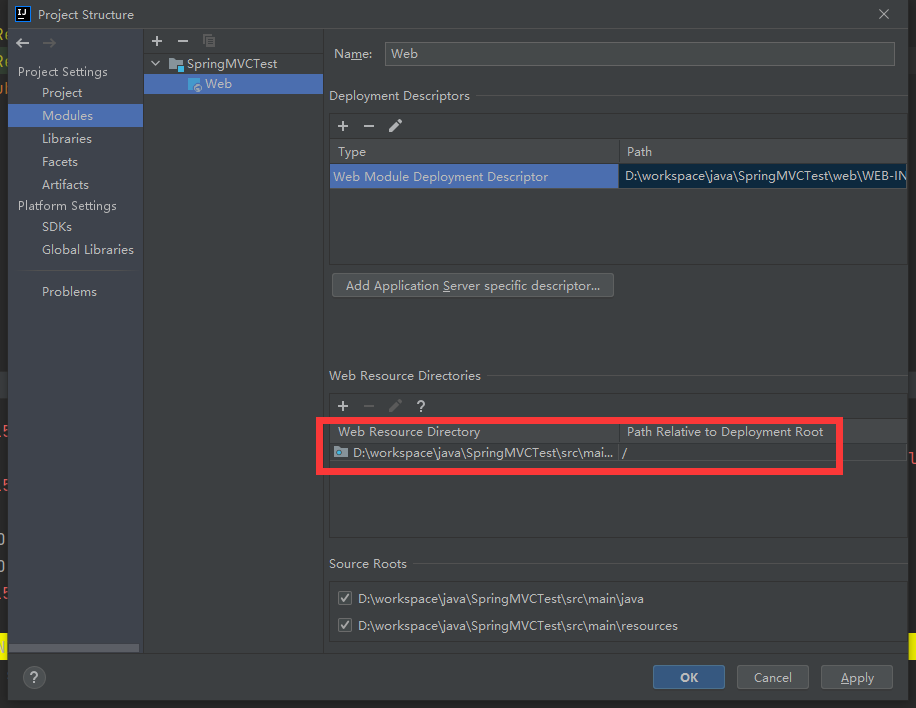
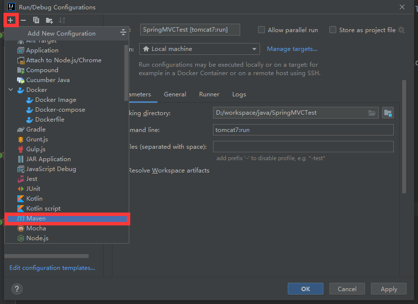
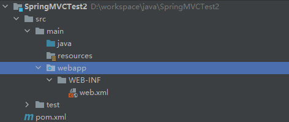
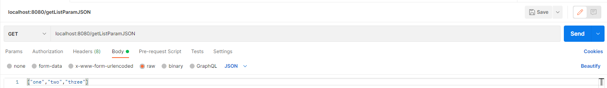
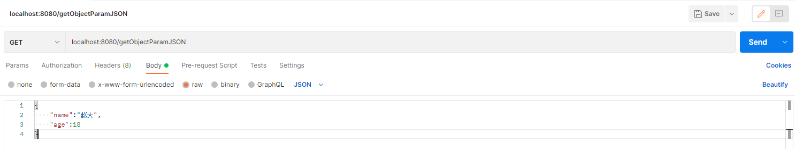
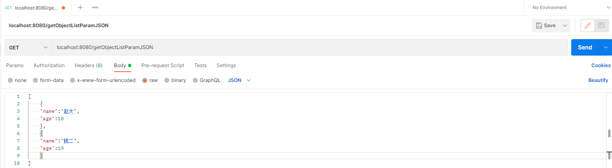

# 5	Spring MVC 

## 5.1	Spring MVC 概述

### 5.1.1	Spring MVC 简介

##### MVC 简介

MVC 是模型（Model）、视图（view）、控制器（controller）的简写，是一种软件设计规范，将业务逻辑、数据、视图在代码层面分离，划分软件结构，降低视图与业务逻辑间的双向偶合。

注意，MVC 不是一种设计模式，**而是一种架构模式**。而且不同的 MVC 之间存在差异。

- **Model（模型）**：数据模型，提供要展示的数据，因此包含数据和行为，可以认为是领域模型或JavaBean组件（包含数据和行为），不过现在一般都分离开来：Value Object（数据Dao） 和 服务层（行为Service）。也就是模型提供了模型数据查询和模型数据的状态更新等功能，包括数据和业务。
- **View（视图）**：负责进行模型的展示，一般就是我们见到的用户界面，客户想看到的东西。
- **Controller（控制器）**：接收用户请求，委托给模型进行处理（状态改变），处理完毕后把返回的模型数据返回给视图，由视图负责展示。也就是说控制器做了个调度员的工作。


<br>

##### Spring MVC 简介

Spring MVC 隶属于 Spring 框架，是一种基于 Java 实现 MVC 模型的轻量级 Web 框架。Spring MVC 是对 Servlet 功能的封装，比 Servlet 使用简单、开发便捷，灵活性强。从 Spring 2.5 开始，使用 Java 5 或者以上版本的用户可以采用基于注解形式进行开发，十分简洁。

<br>

#####  Spring MVC 的特点

1. 轻量级，简单易学
2. 高效 , 基于请求响应的MVC框架
3. 与 Spring 兼容性好，无缝结合
4. 约定优于配置
5. 功能强大：RESTful、数据验证、格式化、本地化、主题等
6. 简洁灵活

<br>

##### Spring MVC 框架完成的功能

1. 将请求 url 映射到 java 类或 java 类的方法；
2. 封装用户提交的数据；
3. 处理请求 → 调用相关的业务处理 → 封装响应数据；
4. 将响应的数据进行渲染 . jsp / html 等表示层数据。

<br>

---

<div STYLE="page-break-after: always;"><br>
    <br>
    <br>
    <br>
    <br>
    <br>
    <br>
    <br>
    <br>
    <br></div>

### 5.1.2	Spring MVC 的原理

##### Spring MVC 处理 Web 请求的基本流程

1. 浏览器发送请求到 Tomcat 服务器；
2. Tomcat 服务器接收到请求后，会将请求交给 SpringMVC 中的 **DispatcherServlet（前端控制器）**处理请求；
3. DispatcherServlet 不真正处理请求，只是按照对应的规则将请求分发到对应的 Bean 对象；
4. Bean 对象是由程序员编写，处理不同的请求，每个 Bean 中可以处理一个或多个不同的请求 url；
5. DispatcherServlet 和 Bean 对象都需要交给 Spring 容器来进行管理。

<br>

##### Spring MVC 的核心——DispatchServlet

Spring MVC 像许多其他 MVC 框架一样，**以请求为驱动**，**围绕一个中心 Servlet 分派请求及提供其他功能**。

Spring MVC  围绕 **`DispatcherServlet`（调度 Servlet）**设计，**DispatcherServlet 是一个实际的 Servlet（继承自 HttpServlet 基类）**。`DispatcherServlet` 的作用是将请求分发到不同的处理器。


<br>

#####  Spring MVC 在服务器启动时的初始化过程

1. 服务器启动，执行 ServletContainersInitConfig 类（实现了抽象类 `AbstractDispatcherServletInitializer`），初始化 web 容器；
2. 执行 `createServletApplicationContext()`：
   1. 初始化 `WebApplicationContext` 对象；
   2. 加载 SpringMVC 的配置类 `SpringMvcConfig` ，初始化 SpringMVC 的容器；
3. 通过 `SpringMvcConfig`  的 `@ComponentScan` 扫描指定包下、所有类上的注解（比如 Controller 类上的 `@Controller`）；
4. 加载 Controller，Controller 中的（不包括 Controller 类上的 `@RequestMapping`）每个 `@RequestMapping` 对应一个具体的方法；
5. 执行 `getServletMappings()`，使所有的请求都通过 Spring MVC。

<br>

##### Spring MVC 处理请求的过程

1. 用户通过请求路径发送请求；
2. 请求被 web 容器前置的控制器拦截；
3. 根据请求参数生成代理请求，并将请求交给 Spring MVC 处理；
4. 解析请求路径；
5. 将请求交给对应的实际控制器处理：
6. 控制器处理请求，创建数据模型，访问数据库，将模型响应给中心控制器；
   1. 如果检测到 `@ResponseBody`，直接将该方法的返回值作为响应求体返回给请求方。

7. 控制器使用模型与视图渲染视图结果，将结果返回给中心控制器，再将结果返回给请求者。


<br>

##### Spring MVC 执行原理


- 图为 Spring MVC 的一个较完整的流程图，实线表示 SpringMVC 框架提供的技术，不需要开发者实现，虚线表示需要开发者实现。

###### 执行流程

1. DispatcherServlet 接收请求并拦截请求；
2. DispatcherServlet 调用处理器映射 HandlerMapping；
3. HandlerMapping 根据请求 url 查找具体的 Handler，即 HandlerExecution；
4. HandlerExecution 的主要作用是根据 url 查找控制器（解析控制器映射），HandlerExecution 将解析后的信息传递给 DispatcherServlet；
5. HandlerAdapter 表示处理器适配器，其按照特定的规则去执行 Handler；
6. Handler 让具体的 Controller 执行；
7. Controller 将具体的执行信息返回给 HandlerAdapter，如 ModelAndView；
8. HandlerAdapter 将视图逻辑名或模型传递给 DispatcherServlet；
9. DispatcherServlet 调用视图解析器（ViewResolver）来解析 HandlerAdapter 传递的逻辑视图名；
10. 视图解析器将解析的逻辑视图名传给 DispatcherServlet；
11. DispatcherServlet 根据视图解析器解析的视图结果，调用具体的视图。
12. 最终视图呈现给用户。

<br>

---

<div STYLE="page-break-after: always;"><br>
    <br>
    <br>
    <br>
    <br>
    <br>
    <br>
    <br>
    <br>
    <br></div>
### 5.1.3	创建基本 Spring MVC 项目——方法一

##### 抽象类 AbstractDispatcherServletInitializer

AbstractDispatcherServletInitializer 类是 Spring MVC 提供的快速初始化 Web3.0 容器的抽象类，AbstractDispatcherServletInitializer 提供三个接口方法供用户实现：

* `createRootApplicationContext()` ：用于加载 Spring 环境，如果创建 Servlet 容器时需要加载非 SpringMVC 对应的 bean，使用当前方法进行，使用方式同 `createServletApplicationContext()`
* `createServletApplicationContext()`：用于加载 Spring MVC 环境，创建 Servlet 容器时，加载 SpringMVC 对应的 bean 并放入 `WebApplicationContext` 对象范围中，而 `WebApplicationContext` 的作用范围为 `ServletContext` 范围，即整个 web 容器范围；
* `ngetServletMappings()`：设定 SpringMVC 对应的请求映射路径，设置为 `/` 表示拦截所有请求，任意请求都将转入到 SpringMVC 进行处理。

<br>

##### 步骤

###### 第一步——创建 Maven 项目

1. 使用 IDEA 创建 Maven 项目；

2. 添加 Web Resource Directories（Project Structure → Modules → 双击红框位置）：、

   

3. 修改 pom.xml 文件：

```xml
<?xml version="1.0" encoding="UTF-8"?>
<project xmlns="http://maven.apache.org/POM/4.0.0" xmlns:xsi="http://www.w3.org/2001/XMLSchema-instance"
  xsi:schemaLocation="http://maven.apache.org/POM/4.0.0 http://maven.apache.org/xsd/maven-4.0.0.xsd">
  <modelVersion>4.0.0</modelVersion>
  <groupId>com.itheima</groupId>
  <artifactId>springmvc_01_quickstart</artifactId>
  <version>1.0-SNAPSHOT</version>
  <packaging>war</packaging>
  <properties>
        <project.build.sourceEncoding>UTF-8</project.build.sourceEncoding>
        <maven.compiler.source>1.8</maven.compiler.source>
        <maven.compiler.target>1.8</maven.compiler.target>
   </properties>
   <!--1. 导入SpringMVC与servlet的坐标--> 
  <dependencies>
    <dependency>
      <groupId>javax.servlet</groupId>
      <artifactId>javax.servlet-api</artifactId>
      <version>3.1.0</version>
      <scope>provided</scope>
    </dependency>
    <dependency>
      <groupId>org.springframework</groupId>
      <artifactId>spring-webmvc</artifactId>
      <version>5.2.10.RELEASE</version>
    </dependency>
  </dependencies>

  <build>
    <plugins>
      <plugin>
        <groupId>org.apache.tomcat.maven</groupId>
        <artifactId>tomcat7-maven-plugin</artifactId>
        <version>2.1</version>
        <configuration>
          <port>80</port>
          <path>/</path>
        </configuration>
      </plugin>
    </plugins>
  </build>
</project>
```

- **servlet 的坐标添加 `<scope>provided</scope>` 的理由**：scope 是 maven 中 jar 包依赖作用范围的描述，如果不设置默认是 `compile` 在编译、运行、测试时均有效。如果运行时有效的话就会和 tomcat 中的servlet-api包发生冲突，导致启动报错，provided代表的是该包只在编译和测试的时候用，运行的时候无效直接使用tomcat中的，就避免冲突。

###### 第二步——创建配置类

```java
// 定义配置类加载Controller对应的bean
@Configuration
@ComponentScan("cn.nilnullnaught.SpringMVCTest.controller")
public class SpringMvcConfig {
}
```

###### 第三步——创建控制器类

```java
//制作控制器类，等同于Servlet
//	必须是一个spring管理的bean
//	定义具体处理请求的方法
//	设置当前方法的访问路径
//	设置响应结果为json数据
@Controller
public class UserController {
    
    @RequestMapping("/save")
    @ResponseBody
    public String save(){
        System.out.println("user save ...");
        return "{'module':'springmvc'}";
    }
}
```

###### 第四步——创建 Tomcat 的 Servlet 容器配置类

```java
// 定义servlet容器的配置类
public class ServletContainersInitConfig extends AbstractDispatcherServletInitializer {
    //加载springMVC配置
    protected WebApplicationContext createServletApplicationContext() {
        //初始化WebApplicationContext对象
        AnnotationConfigWebApplicationContext ctx = new AnnotationConfigWebApplicationContext();
        //加载指定配置类
        ctx.register(SpringMvcConfig.class);
        return ctx;
    }

    //设置Tomcat接收的请求哪些归SpringMVC处理
    protected String[] getServletMappings() {
        return new String[]{"/"};
    }

    //设置spring相关配置
    protected WebApplicationContext createRootApplicationContext() {
        return null;
    }
}
```

###### 第五步——配置 Tomcat 环境




###### 第六步——启动

略。

<br>

##### 📌Servlet 容器配置类的另一种配置方式

Spring 提供了一种更简单的配置 Servlet 容器配置类的方式，可以不创建 `AnnotationConfigWebApplicationContext` 对象，不用手动  `register` 对应的配置类：

```java
public class ServletContainersInitConfig extends AbstractAnnotationConfigDispatcherServletInitializer {

    protected Class<?>[] getRootConfigClasses() {
        return new Class[]{SpringConfig.class};
    }

    protected Class<?>[] getServletConfigClasses() {
        return new Class[]{SpringMvcConfig.class};
    }

    protected String[] getServletMappings() {
        return new String[]{"/"};
    }
}
```

<br>

##### 请求路径拦截 / 和 /\* 的区别

- `/` 不会匹配到 .jsp， 只针对我们编写的请求；即：.jsp 不会进入spring的 DispatcherServlet类 。

- `/*`  会匹配 *.jsp，会出现返回 jsp 视图 时再次进入 spring 的 DispatcherServlet 类，导致找不到对应的 controller 所以报 404 错。

<br>

---

<div STYLE="page-break-after: always;"><br>
    <br>
    <br>
    <br>
    <br>
    <br>
    <br>
    <br>
    <br>
    <br></div>
### 5.1.4	创建基本 Spring MVC 项目——方法二

##### 第一步——创建 web 项目

1. 在 pom.xml 中添加

```xml
<packaging>war</packaging>
```

2. 完善项目目录结构：

   - 方式一：在 main 文件夹下创建 webapp 文件夹，并在 webapp 文件夹下创建 WEB-INF 文件夹，最后才在 WEB-INF 文件夹中创建 web. xml 文件。
   - 方式二：File → project structure，选择 facets，添加 deployment descriptors（即 web.xml 文件）和 web resource directories（即 webapp 文件夹）。

   

3. 添加 web 支持：

   - 方式一：点击file，点击project structure，点击modules，点击dependencies，点击添加，选择 library，选择 Tomcat（简单但适应性差，换环境可能就不行了）；

   - 方式二：在 pom.xml 添加 web 依赖：

     ```xml
     <!-- https://mvnrepository.com/artifact/javax.servlet/javax.servlet-api -->
     <dependency>
         <groupId>javax.servlet</groupId>
         <artifactId>javax.servlet-api</artifactId>
         <version>4.0.1</version>
         <scope>provided</scope>
     </dependency>
     
     <!-- https://mvnrepository.com/artifact/javax.servlet.jsp/javax.servlet.jsp-api -->
     <dependency>
         <groupId>javax.servlet.jsp</groupId>
         <artifactId>javax.servlet.jsp-api</artifactId>
         <version>2.3.3</version>
         <scope>provided</scope>
     </dependency>
     ```

4. 部署服务器：点击 add configurations，选择 Tomcat → local添加本地服务器，选择 development，点击添加，选择 exploded 版本，然后选择 server 更改on update action 和on frame deactivation 为 update classes and resource 实现热部署。（只有 exploded 才有这个 update classes and resource 选项）

   - 如果 Artifact 中没有东西：
     1. 点击菜单栏 File → project Structure → Artifacts → Web Application:Exploded → From Moudule；
     2. Artifacts 中的 Output directory 所对应的目录就是 Tomcat 部署时候用到的目录（..\apache-tomcat-8.5.82\webapps\ROOT）。从该目录下找到编译好的文件；
     3. 勾选 Show Content of Elements 则显示出静态资源文件夹。

<br>

##### 第二步——完善 web 项目

1. 导入 Spring MVC 相关依赖：

```xml
<dependency>
    <groupId>org.springframework</groupId>
    <artifactId>spring-webmvc</artifactId>
    <version>5.1.9.RELEASE</version>
</dependency>
```

2. 解决资源过滤问题：

```xml
<build>
   <resources>
       <resource>
           <directory>src/main/java</directory>
           <includes>
               <include>**/*.properties</include>
               <include>**/*.xml</include>
           </includes>
           <filtering>false</filtering>
       </resource>
       <resource>
           <directory>src/main/resources</directory>
           <includes>
               <include>**/*.properties</include>
               <include>**/*.xml</include>
           </includes>
           <filtering>false</filtering>
       </resource>
   </resources>
</build>
```

<br>

##### 第三步——配置 web.xml

```xml
<?xml version="1.0" encoding="UTF-8"?>
<!-- 注意 web.xml 版本问题，必须是最新版 -->
<web-app xmlns="http://xmlns.jcp.org/xml/ns/javaee"
         xmlns:xsi="http://www.w3.org/2001/XMLSchema-instance"
         xsi:schemaLocation="http://xmlns.jcp.org/xml/ns/javaee http://xmlns.jcp.org/xml/ns/javaee/web-app_4_0.xsd"
         version="4.0">


    <!--1.注册servlet-->
    <servlet>
        <servlet-name>SpringMVC</servlet-name>
        <!-- 注册 DispatcherServlet -->
        <servlet-class>org.springframework.web.servlet.DispatcherServlet</servlet-class>
        <!--通过初始化参数指定SpringMVC配置文件的位置，进行关联-->
        <init-param>
            <param-name>contextConfigLocation</param-name>
            <param-value>classpath:springmvc-servlet.xml</param-value>
        </init-param>
        <!-- 设置启动级别 -->
		<!-- 启动顺序，数字越小，启动越早 -->
        <!-- 设置启动级别为 1 -->
        <load-on-startup>1</load-on-startup>
    </servlet>

    <!-- 所有请求都会被springmvc拦截 -->
    <servlet-mapping>
        <servlet-name>SpringMVC</servlet-name>
        <!-- 映射路径为 / 【不要用/*，会404】 -->
        <url-pattern>/</url-pattern>
    </servlet-mapping>
    

</web-app>
```

<br>

##### 第四步——添加 Spring MVC 配置文件

在 resource 目录下添加 springmvc-servlet.xml 配置文件，配置的形式与 Spring 容器配置基本类似，为了支持基于注解的 IOC，设置了自动扫描包的功能，具体配置信息如下：

```xml
<?xml version="1.0" encoding="UTF-8"?>
<beans xmlns="http://www.springframework.org/schema/beans"
       xmlns:xsi="http://www.w3.org/2001/XMLSchema-instance"
       xmlns:context="http://www.springframework.org/schema/context"
       xmlns:mvc="http://www.springframework.org/schema/mvc"
       xsi:schemaLocation="http://www.springframework.org/schema/beans
       http://www.springframework.org/schema/beans/spring-beans.xsd
       http://www.springframework.org/schema/context
       https://www.springframework.org/schema/context/spring-context.xsd
       http://www.springframework.org/schema/mvc
       https://www.springframework.org/schema/mvc/spring-mvc.xsd">

    <!-- 自动扫描包，让指定包下的注解生效,由IOC容器统一管理 -->
    <context:component-scan base-package="cn.nilnullnaught.SpringMVCTest2"/>
    <!-- 让Spring MVC不处理静态资源 -->
    <mvc:default-servlet-handler />
    <!--
    支持mvc注解驱动
        在spring中一般采用@RequestMapping注解来完成映射关系
        要想使@RequestMapping注解生效
        必须向上下文中注册DefaultAnnotationHandlerMapping
        和一个AnnotationMethodHandlerAdapter实例
        这两个实例分别在类级别和方法级别处理。
        而annotation-driven配置帮助我们自动完成上述两个实例的注入。
     -->
    <mvc:annotation-driven />

    <!-- 视图解析器 -->
    <bean class="org.springframework.web.servlet.view.InternalResourceViewResolver"
          id="internalResourceViewResolver">
        <!-- 前缀 -->
        <property name="prefix" value="/WEB-INF/jsp/" />
        <!-- 后缀 -->
        <property name="suffix" value=".jsp" />
    </bean>

</beans>
```

<br>

##### 第五步——创建 Controller

```java
import org.springframework.stereotype.Controller;
import org.springframework.ui.Model;
import org.springframework.web.bind.annotation.RequestMapping;

@Controller // 让 Spring IOC 容器初始化时自动扫描到该类
@RequestMapping("hello_world")
public class HelloWorldController {
    
    
    @RequestMapping("test1")// 访问地址：localhost:8080/hello_world/test1
    // Model 参数是为了把 Action 中的数据带到视图中
    public String test1(Model model){
        // 向模型中添加属性msg与值，可以在JSP页面中取出并渲染
        model.addAttribute("msg","hello world");
        // 跳转到 web-inf/jsp/index.jsp
        return "index";
	}
    
}
```

<br>

##### 第六步——创建视图层

在 WEB-INF/jsp 目录中创建 index.jsp ， 视图可以直接取出并展示从 Controller 带回的信息；

```jsp
<%@ page contentType="text/html;charset=UTF-8" language="java" %>
<html>
<head>
   <title>SpringMVC</title>
</head>
<body>
    <!-- 通过EL表示取出Model中存放的值 -->
${msg}
</body>
</html>
```

<br>

---

<div STYLE="page-break-after: always;"><br>
    <br>
    <br>
    <br>
    <br>
    <br>
    <br>
    <br>
    <br>
    <br></div>

### 5.1.5	Spring MVC 集成 Spring FrameWork

##### 主要问题——避免 Spring 错误加载属于 SpringMVC 的 bean

###### bean 的加载控制

controller、service 和 dao 这些类都需要被容器管理成 bean 对象，其中：

- Spring MVC 加载表现层 bean，也就是 controller 包下的类；
- Spring 加载业务 bean（service）和功能 bean（DataSource,SqlSessionFactoryBean,MapperScannerConfigurer等）。

###### 问题

Spring MVC 配置类 `SpringMvcConfig` 中的 `@ComponentScan` 的扫描范围是 controller 包， 而Spring 配置类 `SpringConfig` 中的 `@ComponentScan` 的扫描范围包括了 controller。应该如何避免 Spring 错误加载到 SpringMVC 的 bean？

###### 解决思路

* **方式一**：Spring 加载的 bean 设定扫描范围为 cn.nilnullnaught.SpringMVCTest，排除掉 controller 包中的 bean；
* **方式二**：Spring 加载的 bean 设定扫描范围为精准范围，例如 service 包、dao 包等；
* **方式三**：不区分 Spring 与 SpringMVC 的环境，加载到同一个环境中。

<br>

##### 例

###### 第一步——创建项目

依赖：

```xml
<?xml version="1.0" encoding="UTF-8"?>

<project xmlns="http://maven.apache.org/POM/4.0.0" xmlns:xsi="http://www.w3.org/2001/XMLSchema-instance"
  xsi:schemaLocation="http://maven.apache.org/POM/4.0.0 http://maven.apache.org/xsd/maven-4.0.0.xsd">
  <modelVersion>4.0.0</modelVersion>

  <groupId>com.itheima</groupId>
  <artifactId>springmvc_02_bean_load</artifactId>
  <version>1.0-SNAPSHOT</version>
  <packaging>war</packaging>

  <dependencies>
    <dependency>
      <groupId>javax.servlet</groupId>
      <artifactId>javax.servlet-api</artifactId>
      <version>3.1.0</version>
      <scope>provided</scope>
    </dependency>
    <dependency>
      <groupId>org.springframework</groupId>
      <artifactId>spring-webmvc</artifactId>
      <version>5.2.10.RELEASE</version>
    </dependency>
    <dependency>
      <groupId>com.alibaba</groupId>
      <artifactId>druid</artifactId>
      <version>1.1.16</version>
    </dependency>

    <dependency>
      <groupId>org.mybatis</groupId>
      <artifactId>mybatis</artifactId>
      <version>3.5.6</version>
    </dependency>

    <dependency>
      <groupId>mysql</groupId>
      <artifactId>mysql-connector-java</artifactId>
      <version>5.1.47</version>
    </dependency>

    <dependency>
      <groupId>org.springframework</groupId>
      <artifactId>spring-jdbc</artifactId>
      <version>5.2.10.RELEASE</version>
    </dependency>

    <dependency>
      <groupId>org.mybatis</groupId>
      <artifactId>mybatis-spring</artifactId>
      <version>1.3.0</version>
    </dependency>
  </dependencies>

  <build>
    <plugins>
      <plugin>
        <groupId>org.apache.tomcat.maven</groupId>
        <artifactId>tomcat7-maven-plugin</artifactId>
        <version>2.1</version>
        <configuration>
          <port>80</port>
          <path>/</path>
        </configuration>
      </plugin>
    </plugins>
  </build>
</project>

```

###### 第二步——创建配置类

```java
public class ServletContainersInitConfig extends AbstractDispatcherServletInitializer {
    protected WebApplicationContext createServletApplicationContext() {
        AnnotationConfigWebApplicationContext ctx = new AnnotationConfigWebApplicationContext();
        ctx.register(SpringMvcConfig.class);
        return ctx;
    }
    protected String[] getServletMappings() {
        return new String[]{"/"};
    }
    protected WebApplicationContext createRootApplicationContext() {
      return null;
    }
}
```

```java
@Configuration
@ComponentScan("n.nilnullnaught.SpringMVCTest")
public class SpringConfig {
}
```

```java
@Configuration
@ComponentScan("n.nilnullnaught.SpringMVCTest.controller")
public class SpringMvcConfig {
}
```

###### 第三步——编写 Controller，Service，Dao，model 类

```java
@Controller
public class UserController {

    @RequestMapping("/save")
    @ResponseBody
    public String save(){
        System.out.println("user save ...");
        return "{'info':'springmvc'}";
    }
}
```

```java
public interface UserService {
    public void save(User user);
}
```

```java
@Service
public class UserServiceImpl implements UserService {
    public void save(User user) {
        System.out.println("user service ...");
    }
}
```

```java
public interface UserDao {
    @Insert("insert into tbl_user(name,age)values(#{name},#{age})")
    public void save(User user);
}
```

```java
public class User {
    private Integer id;
    private String name;
    private Integer age;
    //setter..getter..toString略
}
```

###### 第四步——设置bean加载控制

方式一——修改 Spring 配置类，设定扫描范围为精准范围：

```java
@Configuration
@ComponentScan({"cn.nilnullnaught.SpringMVCTest.service","cn.nilnullnaught.SpringMVCTest.dao"})
public class SpringConfig {
}
```

- 上述只是通过例子说明可以精确指定让Spring扫描对应的包结构，实际上，因为 Dao 最终是交给`MapperScannerConfigurer`对象来进行扫描处理的，我们只需要将其扫描到service包即可。

方式二——修改 Spring 配置类，设定扫描范围为 cn.nilnullnaught.SpringMVCTest，排除掉 controller 包中的 bean：

```java
@Configuration
@ComponentScan(value="com.itheima",
    excludeFilters=@ComponentScan.Filter(
    	type = FilterType.ANNOTATION,
        classes = Controller.class
    )
)
public class SpringConfig {
}
```

* excludeFilters属性：设置扫描加载bean时，排除的过滤规则

* type属性：设置排除规则，当前使用按照bean定义时的注解类型进行排除

  * ANNOTATION：按照注解排除
  * ASSIGNABLE_TYPE:按照指定的类型过滤
  * ASPECTJ:按照Aspectj表达式排除，基本上不会用
  * REGEX:按照正则表达式排除
  * CUSTOM:按照自定义规则排除

  大家只需要知道第一种ANNOTATION即可

* classes属性：设置排除的具体注解类，当前设置排除@Controller定义的bean

###### 第五步——在服务器启动时加载 Spring 配置类

修改 ServletContainersInitConfig：

```java
public class ServletContainersInitConfig extends AbstractDispatcherServletInitializer {
    protected WebApplicationContext createServletApplicationContext() {
        AnnotationConfigWebApplicationContext ctx = new AnnotationConfigWebApplicationContext();
        ctx.register(SpringMvcConfig.class);
        return ctx;
    }
    protected String[] getServletMappings() {
        return new String[]{"/"};
    }
    protected WebApplicationContext createRootApplicationContext() {
      AnnotationConfigWebApplicationContext ctx = new AnnotationConfigWebApplicationContext();
        ctx.register(SpringConfig.class);
        return ctx;
    }
}
```

<br>

---

<div STYLE="page-break-after: always;"><br>
    <br>
    <br>
    <br>
    <br>
    <br>
    <br>
    <br>
    <br>
    <br></div>
## 5.2	控制器 Controller

##### Controller 简介

- 控制器（Controller ）负责提供 Web 应用程序的行为，通常通过接口定义或注解定义两种方法实现；
- 控制器负责解析用户的请求并将其转换为一个模型；
- 在 Spring MVC 中一个控制器类可以包含多个方法；
- 在 Spring MVC 中，对于 Controller 的配置方式有很多种。

<br>

##### Spring MVC 的 Controller 接口

Controller 接口在 org.springframework.web.servlet.mvc 包下，实现该接口的类就能获得控制器功能：

```java
public interface Controller {
   // Controller 接口只定义了这一个方法
   // 处理请求并返回一个模型与视图对象
   ModelAndView handleRequest(HttpServletRequest var1, HttpServletResponse var2) throws Exception;
}
```

<br>

##### @Controller

声明当前类的实例是一个 Controller。

Spring 使用扫描机制（`@ComponentScan` 注解或 `<component-scan>` 标签）查找应用程序中所有基于注解的控制器类。为了保证 Spring 能找到控制器，需要在配置文件中声明组件扫描。

<br>

---

<div STYLE="page-break-after: always;"><br>
    <br>
    <br>
    <br>
    <br>
    <br>
    <br>
    <br>
    <br>
    <br></div>

## 5.3	请求与响应

### 5.3.1	请求路径映射

##### @RequestMapping

用于映射 URL 到控制器类或一个特定的处理程序方法。可用于类或方法上。用于类上，表示类中的所有响应请求的方法都是以该地址作为父路径。

###### 例

```java
@Controller
public class TestController {
   @RequestMapping("/h1")
   public String test(){
       return "test";
  }
}
```

<br>

##### 请求路径冲突问题

如果 UserController 中存在 /save 路径，OrderController 中也存在 /save 路径，如何解决它们之间的冲突问题？

###### 解决方案

以模块名作为当前模块统一的前置请求路径，比如：

- Order 模块的 save，访问路径为 `http://localhost:8080/order/save`；
- User 模块的 save，访问路径为 `http://localhost:8080/user/save`。

###### 例

```java
@Controller
@RequestMapping("/user")
public class UserController {

    @RequestMapping("/save")
    @ResponseBody
    public String save(){
        System.out.println("user save ...");
        return "{'module':'user save'}";
    }
    
    @RequestMapping("/delete")
    @ResponseBody
    public String save(){
        System.out.println("user delete ...");
        return "{'module':'user delete'}";
    }
}
```

```java
@Controller
@RequestMapping("/book")
public class BookController {

    @RequestMapping("/save")
    @ResponseBody
    public String save(){
        System.out.println("book save ...");
        return "{'module':'book save'}";
    }
}
```

<br>

---

<div STYLE="page-break-after: always;"><br>
    <br>
    <br>
    <br>
    <br>
    <br>
    <br>
    <br>
    <br>
    <br></div>

### 5.3.2	参数传递——基本参数传递

##### 通过方法形参获取请求参数

###### 获取 get 请求路径中的参数

请求 URL：

```http
http://localhost:8080/test/getparams?param1=111&param2=222
```

方法：

```java
@ResponseBody
@RequestMapping("/paramtest1")
public String demo(String param1,String param2) {
    System.out.println("canshu1 is:"+canshu1);
    System.out.println("canshu2 is:"+canshu2);
    return "success";
}
```

###### 获取 post 请求的请求头中的参数

```java
@ResponseBody
@RequestMapping("/paramtest2")
public String getUserInfo(HttpServletRequest request) {
    String token =  request.getHeader("token");
	System.out.println("token is:"+token);
    return "success";
}
```

###### 获取 post 请求的请求体中的参数

```java
@ResponseBody
@RequestMapping("/paramtest2")
public String getUserInfo(String param1,String param2) {
    System.out.println("canshu1 is:"+canshu1);
    System.out.println("canshu2 is:"+canshu2);
    return "success";
}
```

###### 缺点

传递的参数名必须与方法形参的变量名相同，否则会传送失败。

<br>

##### 请求参数中的中文乱码问题

###### get 请求的中文乱码问题

Tomcat 8.5 之前的版本会导致请求路径中出现的中文变成乱码[^5.3.2-1]，需要修改 pom.xml 中的配置解决该问题（仅限通过 pom.xml 插件集成 tomcat 时可以使用该方法）：

```xml
<build>
	<plugins>
		<plugin>
			<groupId>org.apache.tomcat.maven</groupId>
			<artifactId>tomcat7-maven-plugin</artifactId>
			<version>2.1</version>
			<configuration>
				<port>80</port><!--tomcat端口号-->
				<path>/</path> <!--虚拟目录-->
				<uriEncoding>UTF-8</uriEncoding><!--访问路径编解码字符集-->
			</configuration>
		</plugin>
	</plugins>
</build>
```

###### post 请求的中文乱码问题

配置过滤器：

```java
public class ServletContainersInitConfig extends AbstractAnnotationConfigDispatcherServletInitializer {
    protected Class<?>[] getRootConfigClasses() {
        return new Class[0];
    }

    protected Class<?>[] getServletConfigClasses() {
        return new Class[]{SpringMvcConfig.class};
    }

    protected String[] getServletMappings() {
        return new String[]{"/"};
    }

    //乱码处理
    @Override
    protected Filter[] getServletFilters() {
        CharacterEncodingFilter filter = new CharacterEncodingFilter();
        filter.setEncoding("UTF-8");
        return new Filter[]{filter};
    }
}
```

<br>

---

[^5.3.2-1]: 据说 8.5 之后的 Tomcat 已经解决了该问题，但是没有进行验证。

<div STYLE="page-break-after: always;"><br>
    <br>
    <br>
    <br>
    <br>
    <br>
    <br>
    <br>
    <br>
    <br></div>

### 5.3.3	参数传递——@RequestParam

##### @RequestParam

`@RequestParam` 的作用是绑定请求参数与处理器方法的形参，

###### 属性

- `value`：指定传入的参数名，该属性是 `@RequestParam` 的默认属性。
- `required`：该参数是否必需，默认值为 `true`；
- `defaultValue`：参数默认值，默认值为 `"\n\t\t\n\t\t\n\ue000\ue001\ue002\n\t\t\t\t\n"`；

<br>

##### 例——使用 @RequestParam 获取 get 请求参数

Vue

```js
//路径 api/test.js
import request from '@/utils/request'
export default {
  testRequestParam (data) {
    return request({
      url: `/testRequestParam`,
      method: 'post',
      params: data //使用 params 接收请求参数
    })
  }
}
```

```vue
//路径 page/test.vue
<template>
	<div/>
</template>
<script>
// 引入 qs（axios中有qs包，不需要 npm insatll qs，直接引入即可）
import qs from 'qs'
import testApi from '@/api/test'

export default {
    data () {
    	return {
            email:'xxxx@xx.com'
    	}
    }
    method
    submitAlterEmail () {
      // 封装数据
      const data = { email: this.email }
      testApi.testRequestParam(d)
        .then((response) => {
          alert(response.data.data.data)
        })
    }
```

后端接口：

```java
@GetMapping("/testRequestParam")// 注意，此时请求方式必须是 post
public R testRequestParam(@RequestParam(name = "email",required = false)String email){
    return R.ok().data("data",email);
}
```

<br>

##### 例——使用 @RequestParam 获取 post 请求参数

###### 获取 post 请求中的参数

Vue：

```js
//路径 api/test.js
import request from '@/utils/request'
export default {
  testRequestParam (data) {
    return request({
      url: `/testRequestParam`,
      method: 'post',
      data: data
    })
  }
}
```

```vue
//路径 page/test.vue
<template>
	<div/>
</template>
<script>
// 引入 qs（axios中有qs包，不需要 npm insatll qs，直接引入即可）
import qs from 'qs'
import testApi from '@/api/test'

export default {
    data () {
    	return {
            email:'xxxx@xx.com'
    	}
    }
    method
    submitAlterEmail () {
      // 封装数据
      const data = { email: this.email }
      testApi.testRequestParam(qs.stringify(data))
        .then((response) => {
          alert(response.data.data.data)
        })
    }
```

后端接口：

```java
@PostMapping("/testRequestParam")// 注意，此时请求方式必须是 post
public R testRequestParam(@RequestParam(name = "email",required = false)String email){
    return R.ok().data("data",email);
}
```

<br>

##### 例——获取请求体中的参数

```java
@PostMapping("/alterUserEmail")
public R alterUserEmail(
        HttpServletRequest request,
        @RequestParam(name = "email")String email,
        @RequestParam(name = "code")String code){
    String ID = JwtUtils.getIdByJwtToken(request);
    userCheckService.alterUserEmail(ID,email,code);
    return R.ok();
}
```

<br>

---

<div STYLE="page-break-after: always;"><br>
    <br>
    <br>
    <br>
    <br>
    <br>
    <br>
    <br>
    <br>
    <br></div>
### 5.3.4	参数传递——复杂类型参数

##### 使用 VO 传递参数

如果后台接收参数的时候就比较复杂，可以使用自定义的 POJO 接受参数，这种 POJO 也被称为 VO（value object）。

###### 前提条件

请求参数名与 VO 的属性名相对应。

###### 例

VO：

```java
@Data
public class UserVo {
    private String name;
    private int age;
}
```

请求 URL：

```http
http://localhost/test/getVOParam?name=赵大&age=18
```

controller 方法：

```java
@RequestMapping("/getVOParam")
@ResponseBody
public String pojoParam(UserVo userVo){
    System.out.println("pojo参数传递 user ==> "+userVo);
    return "success";
}
```

###### 例——使用嵌套 VO 传递参数

VO 中可以包含 POJO 类型属性。

```java
@Data
public class UserVO {
    private String name;
    private int age;
    private Address address;
}
```

```java
@Data
public class Address {
    private String province;
    private String city;
}
```

请求 URL：

```http
http://localhost/test/getVOParam?name=赵大&age=18&address.city=北京&address.province=无
```

controller 方法：

```java
//POJO参数：请求参数与形参对象中的属性对应即可完成参数传递
@RequestMapping("/getVOParam")
@ResponseBody
public String pojoParam(UserVo userVo){
    System.out.println("pojo参数传递 user ==> "+userVo);
    return "success";
}
```

<br>

##### 使用数组传递参数

###### 前提条件

- 请求参数名与 controller 方法的形参名相同；
- 同时存在多个参数名相同的请求参数；
- controller 方法的形参类型为数组。

###### 例

请求 URL：

```http
http://localhost/test/getArrayParam?likes=football&likes=basketball&likes=TableTennis
```

controller 方法：

```java
//POJO参数：请求参数与形参对象中的属性对应即可完成参数传递
@RequestMapping("/getArrayParam")
@ResponseBody
public String getArrayParam(String[] likes){
    System.out.println("数组参数传递 likes ==> "+ Arrays.toString(likes));
    return "success";
}
```

<br>

##### 使用集合传递参数

###### 前提条件

- 请求参数名与 controller 方法的形参名相同；
- 同时存在多个参数名相同的请求参数；
- controller 方法的形参类型为集合；
- controller 方法的形参必须使用 `@RequestParam` 注解。

###### 例

请求 URL：

```http
http://localhost/test/getListParam?likes=football&likes=basketball&likes=TableTennis
```

controller 方法：

```java
//POJO参数：请求参数与形参对象中的属性对应即可完成参数传递
@RequestMapping("/getArrayParam")
@ResponseBody
public String getListParam(@RequestParam List<String> likes){
    System.out.println("集合参数传递 likes ==> "+ likes);
    return "success";
}
```

<br>

---

<div STYLE="page-break-after: always;"><br>
    <br>
    <br>
    <br>
    <br>
    <br>
    <br>
    <br>
    <br>
    <br></div>

### 5.3.5	参数传递——JSON 格式数据

##### 使用 JSON 格式传递数据的前提条件

###### 第一步——引入 JSON 依赖

SpringMVC 默认使用的是 jackson 来处理 JSON 格式数据，在 pom.xml 中添加依赖

```xml
<dependency>
    <groupId>com.fasterxml.jackson.core</groupId>
    <artifactId>jackson-databind</artifactId>
    <version>2.9.0</version>
</dependency>
```

###### 第二步——开启 Spring MVC 注解支持

在 Spring MVC 的配置类中开启 Spring MVC 的注解支持，其中包含了将 JSON 转换成对象的功能：

```java
@Configuration
@ComponentScan("com.itheima.controller")
//开启json数据类型自动转换
@EnableWebMvc
public class SpringMvcConfig	 {
}
```

<br>

##### @EnableWebMvc

用于开启 SpringMVC 多项辅助功能。

###### 作用域

Spring MVC 配置类上。

<br>

##### 例——接收 JSON 格式的数组




接收数据：

```java

@ResponseBody
@RequestMapping("/getListParamJSON")
//使用 @RequestBody 注解将数据映射到 List 集合中
public String listParamForJson(@RequestBody List<String> likes){
    System.out.println("list common(json)参数传递 list ==> "+likes);
    return "success";
}
```

<br>

##### 例——接收 JSON 格式的对象

发送 JSON 格式的对象数据：



接收数据：

```java
@ResponseBody
@RequestMapping("/getObjectParamJSON")
//使用 @RequestBody 注解将数据映射到 List 集合中
public String listParamForJson(@RequestBody UserVo userVo){
    System.out.println("VO(json)参数传递 user ==> "+user);
    return "success";
}
```

<br>

##### 例——接收 JSON 格式的对象数组

发送 JSON 格式的对象数组数据：



接收数据：

```java
@ResponseBody
@RequestMapping("/getObjectParamJSON")
//使用 @RequestBody 注解将数据映射到 List 集合中
public String listParamForJson(@RequestBody UserVo userVo){
    System.out.println("VO(json)参数传递 user ==> "+user);
    return "success";
}
```

<br>

---

<div STYLE="page-break-after: always;"><br>
    <br>
    <br>
    <br>
    <br>
    <br>
    <br>
    <br>
    <br>
    <br></div>

### 5.3.6	参数传递——@RequestBody 与 @RequestHead

##### @RequestBody

接收请求体所包含的数据，此注解每个 Controller 方法只能使用一次。

`@requestBody` 注解常用来处理 content-type 不是默认 application/x-www-form-urlcoded 编码的内容，例如 application/json 或 application/xml。一般情况下常用于处理 application/json 类型。 通过 @requestBody 可以将请求体中的 JSON 字符串绑定到相应的 bean 上，也可以将其分别绑定到对应的字符串上。

###### 📌注意

一般的情况下，GET 请求不可以使用 `@RequestBody` 接收参数[^5.4.6-1]。

但是，如果接口是由服务调用（分布式系统）而非页面直接访问，那么是可以携带请求体的。

###### @RequestBody 与 @RequestParam 区别

- `@RequestParam` 可以接收 url 地址（或表单（get 请求携带的表单数据在 URL 中，post 请求则位于请求体中）传递的参数；
- `@RequestBody` 只能接收请求体中传递的数据。

###### @RequestBody 与 @RequestParam 的选择

* 后期开发中，发送 json 格式数据为主，`@RequestBody` 应用较广；
* 如果发送非 json 格式数据，选用 `@RequestParam` 接收请求参数。

<br>

##### @RequestHead

获取请求头中的参数。

###### 例——获取请求头中的参数

方式一 —— 通过请求参数 `HttpServletRequest`：

```java
public String getUserInfo(HttpServletRequest request) {
    String token =  request.getHeader("token");
    return token;
}
```

方式二 —— 通过 `@RequestHeader` 注解：

```java
@PostMapping("/deleteFile")
public String deleteFile(@RequestHeader("token")String token) {//获取 token 对应的请求头信息
    return urltoken;
}
```

<br>

---

[^5.4.6-1]: HTTP 协议没有为 GET 请求的 body 赋予语义，**即不要求也不禁止** GET 请求带 body。大多数 HTTP 实现从技术上都支持 HTTP GET 请求带 body，少数实现会禁止（google-chrome 浏览器、node-fetch），少数实现会不建议（Fiddler）。

<div STYLE="page-break-after: always;"><br>
    <br>
    <br>
    <br>
    <br>
    <br>
    <br>
    <br>
    <br>
    <br></div>

### 5.3.7	参数传递——日期类型

##### Spring MVC 的日期字符串转换

Spring MVC 默认支持的日期字符串转换格式为 `yyyy/MM/dd`，如果传入的日期字符串格式不符合该默认格式，将会出现 `ConversionFailedException`。可以使用 `@DateTimeFormat` 解决这个问题。

<br>

##### @DateTimeFormat

用于设置日期类型参数的格式。

###### 前提条件

在 Spring MVC 配置类中配置了 @EnableWebMvc 注解。

###### 属性

- **pattern**：指定日期时间格式字符串。

<br>

##### 例——传递日期数据

URL：

```http
http://localhost/dataParam?date=2088/08/08&date1=2088-08-08
```

后台接口：

```java
@RequestMapping("/dataParam")
@ResponseBody
public String dataParam(Date date,
                        @DateTimeFormat(pattern="yyyy-MM-dd") Date date1)
    System.out.println("参数传递 date ==> "+date);
	System.out.println("参数传递 date1(yyyy-MM-dd) ==> "+date1);
    return "success";
}
```

<br>

##### 例——传递携带小时和分钟的日期

URL：

```http
http://localhost/dataParam?date=2088/08/08&date1=2088-08-08&date2=2088/08/08 8:08:08
```

后台接口：

```java
@RequestMapping("/dataParam")
@ResponseBody
public String dataParam(Date date,
                        @DateTimeFormat(pattern="yyyy-MM-dd") Date date1,
                        @DateTimeFormat(pattern="yyyy/MM/dd HH:mm:ss") Date date2)
    System.out.println("参数传递 date ==> "+date);
	System.out.println("参数传递 date1(yyyy-MM-dd) ==> "+date1);
	System.out.println("参数传递 date2(yyyy/MM/dd HH:mm:ss) ==> "+date2);
    return "{'module':'data param'}";
}
```

<br>

---

<div STYLE="page-break-after: always;"><br>
    <br>
    <br>
    <br>
    <br>
    <br>
    <br>
    <br>
    <br>
    <br></div>

### 5.3.8	结果跳转

##### 方式一——使用 ModelAndView 进行页面跳转

设置 ModelAndView 对象 , 根据 view 的名称，和视图解析器跳到指定的页面，路径为 {视图解析器前缀} + viewName +{视图解析器后缀}。

##### 实现步骤

1. 在 Spring MVC 配置类或配置文件中配置识图解析器：

```
<!-- Spring MVC 配置文件 springmvc-servlet.xml -->
<!-- 视图解析器 -->
<bean class="org.springframework.web.servlet.view.InternalResourceViewResolver"
     id="internalResourceViewResolver">
   <!-- 前缀 -->
   <property name="prefix" value="/WEB-INF/jsp/" />
   <!-- 后缀 -->
   <property name="suffix" value=".jsp" />
</bean>
```

2. controller 类：

```java
public class ControllerTest1 implements Controller {

   public ModelAndView handleRequest(HttpServletRequest httpServletRequest, HttpServletResponse httpServletResponse) throws Exception {
       //返回一个模型视图对象
       ModelAndView mv = new ModelAndView();
       mv.addObject("msg","ControllerTest1");
       mv.setViewName("test");
       return mv;
  }
}
```

<br>

##### 方式二——使用 ServletAPI 进行页面跳转

通过设置 ServletAPI，不需要视图解析器。

###### 例

```java
@Controller
public class ResultGo {

   // 通过 HttpServletResponse 进行输出
	@RequestMapping("/result/t1")
	public void test1(HttpServletRequest req, HttpServletResponse rsp) throws IOException {
		rsp.getWriter().println("Hello,Spring BY servlet API");
  	}

    // 通过 HttpServletResponse 实现重定向
    @RequestMapping("/result/t2")
    public void test2(HttpServletRequest req, HttpServletResponse rsp) throws IOException {
		rsp.sendRedirect("/index.jsp");
    }
 
    // 通过HttpServletResponse 实现请求转发
	@RequestMapping("/result/t3")
    public void test3(HttpServletRequest req, HttpServletResponse rsp) throws Exception {
       	//转发
       	req.setAttribute("msg","/result/t3");
		req.getRequestDispatcher("/WEB-INF/jsp/test.jsp").forward(req,rsp);
	}
}
```

<br>

##### 📌方式三——通过 SpringMVC 进行页面跳转（常用）

无需视图解析器。

##### 例

```java
@Controller
public class ResultSpringMVC {
   @RequestMapping("/rsm/t1")
   public String test1(){
       // 请求转发
       return "/index.jsp";
  }

   @RequestMapping("/rsm/t2")
   public String test2(){
       // 请求转发二
       return "forward:/index.jsp";
  }

   @RequestMapping("/rsm/t3")
   public String test3(){
       // 重定向
       return "redirect:/index.jsp";
  }
}
```

<br>

---

<div STYLE="page-break-after: always;"><br>
    <br>
    <br>
    <br>
    <br>
    <br>
    <br>
    <br>
    <br>
    <br></div>

### 5.3.9	请求响应

##### @ResponseBody

设置当前控制器方法的响应内容为方法返回值，无需解析。

###### 作用域

位置  SpringMVC 控制器类或方法定义上方。

<br>

##### 页面响应

###### 前提条件

请求接口方法上不能添加 `@ResponseBody` 注解。

###### 例

```java
@Controller
public class UserController {
    
    @RequestMapping("/toJumpPage")
    // 注意：
    // 	1.此处不能添加 @ResponseBody,否则会将 page.jsp 作为字符串返回前端
    // 	2.方法需要返回String
    public String toJumpPage(){
        System.out.println("跳转页面");
        return "page.jsp";
    }
    
}
```

<br>

##### 返回文本数据

###### 前提条件

请求接口方法上必须添加 `@ResponseBody` 注解。

###### 例

```java
@Controller
public class UserController {
    
   	@RequestMapping("/toText")
	// 注意，此处的 @ResponseBody 不能省略，如果省略了,会把 response text 作为页面名称去查找，返回 404 错误（项目中不存在该页面）
    @ResponseBody
    public String toText(){
        System.out.println("返回纯文本数据");
        return "response text";
    }
    
}
```

<br>

##### 返回 JSON 格式数据

###### 前提条件

1. 请求接口方法上必须添加 `@ResponseBody` 注解。
2. Spring MVC 配置类上添加了 `@EnableWebMvc`。

<br>

---

<div STYLE="page-break-after: always;"><br>
    <br>
    <br>
    <br>
    <br>
    <br>
    <br>
    <br>
    <br>
    <br></div>

### 5.3.10	数据显示到前端

##### 方式一——通过 ModelAndView

```java
public class ControllerTest1 implements Controller {

   public ModelAndView handleRequest(HttpServletRequest httpServletRequest, HttpServletResponse httpServletResponse) throws Exception {
       //返回一个模型视图对象
       ModelAndView mv = new ModelAndView();
       mv.addObject("msg","ControllerTest1");
       mv.setViewName("test");
       return mv;
  }
}
```

<br>

##### 方式二——通过 ModelMap

```java
@RequestMapping("/hello")
public String hello(@RequestParam("username") String name, ModelMap model){
   //封装要显示到视图中的数据
   //相当于req.setAttribute("name",name);
   model.addAttribute("name",name);
   return "hello";
}
```

<br>

##### 方式三——通过 Model

```java
@RequestMapping("/ct2/hello")
public String hello(@RequestParam("username") String name, Model model){
   //封装要显示到视图中的数据
   //相当于req.setAttribute("name",name);
   model.addAttribute("msg",name);
   return "test";
}
```

<br>

##### 三种方式之间的对比

- Model 只适合储存数据，但是简化了新手对于 Model 对象的操作和理解；
- ModelMap 继承了 LinkedMap ，除了实现了自身的一些方法，同样的继承 LinkedMap 的方法和特性；
- ModelAndView 可以在储存数据的同时，可以进行设置返回的逻辑视图，进行控制展示层的跳转。

<br>

##### 📌注意

前后端分离项目中，Controller 不负责数据显示，而是由前端进行。本章节内容只在旧式项目中有效。

<br>

---

<div STYLE="page-break-after: always;"><br>
    <br>
    <br>
    <br>
    <br>
    <br>
    <br>
    <br>
    <br>
    <br></div>

## 5.4	Rest 风格

### 5.4.1	Rest 简介

##### 传统风格资源描述形式

当我们想表示一个网络资源的时候，需要通过不同的参数和请求路径进行：

- http://127.0.0.1/item/queryItem.action?id=1——GET，查询；
- http://127.0.0.1/item/saveItem.action——POST，新增；
- http://127.0.0.1/item/updateItem.action——POST，更新；
- http://127.0.0.1/item/deleteItem.action?id=1——GET或POST，删除。

###### 传统风格的缺点

一个请求 url 对应一种操作，麻烦且不安全。

<br>

##### REST

Restful就是一个资源定位及资源操作的风格。不是标准也不是协议，只是一种风格。基于这个风格设计的软件可以更简洁，更有层次，更易于实现缓存等机制。

###### REST 风格资源描述形式

- http://127.0.0.1/item/1——GET，查询；
- http://127.0.0.1/item——POST，新增；
- http://127.0.0.1/item——PUT，更新；
- http://127.0.0.1/item/1——DELETE，删除。

###### REST 通过请求方式区分操作

使用 REST 风格访问资源时，同一个 URL 地址即可以是新增，也可以是修改或者查询，但是通过 **行为动作（请求方式）** 区分对资源的操作

###### 📌注意

- **Rest 是约定而不是规范**，也可以用 GET 请求进行删除，或使用 POST 进行查询。但如果这么做，会使代码变得难以理解。

* 描述模块的名称通常使用复数，也就是加s的格式描述，表示此类资源，而非单个资源，例如：users、books、accounts。

<br>

---

<div STYLE="page-break-after: always;"><br>
    <br>
    <br>
    <br>
    <br>
    <br>
    <br>
    <br>
    <br>
    <br></div>

### 5.4.2	RESTful 风格接口基本实现

##### @RequestMapping 的 method 属性

实现 RESTful 风格接口的核心是通过请求方式区分相同的请求 URL，这一点可以通过 `@RequestMapping` 的 `method` 属性实现。

<br>

##### 例

```java
@Controller
@RequestMapping("/users")
public class UserController {

    // GET 请求，查询操作
    @RequestMapping(method = RequestMethod.GET)
    @ResponseBody
    public String getAll() {
        System.out.println("user getAll...");
        return "{'module':'user getAll'}";
    }
    
    // GET 请求，查询操作
    @RequestMapping(value = "/{id}" ,method = RequestMethod.GET)
    @ResponseBody
    public String getById(@PathVariable Integer id) {
        System.out.println("user getById...");
        return "{'module':'user getById'}";
    }
    
    // POST 请求，添加操作
    @RequestMapping(method = RequestMethod.POST)
    @ResponseBody
    public String add() {
        System.out.println("user add...");
        return "{'module':'user add'}";
    }
    
    // PUT 请求，修改操作
    @RequestMapping(method = RequestMethod.PUT)
    @ResponseBody
    public String alter(@RequestBody UserVo vo) {
        System.out.println("user alter...");
        return "{'module':'user alter'}";
    }
    
    // DELETE 请求，删除操作
    @RequestMapping(value = "/{id}" ,method = RequestMethod.DELETE)
    @ResponseBody
    public String delete(@PathVariable Integer id) {
        System.out.println("user delete...");
        return "{'module':'user delete'}";
    }
    
}
```

<br>

---

<div STYLE="page-break-after: always;"><br>
    <br>
    <br>
    <br>
    <br>
    <br>
    <br>
    <br>
    <br>
    <br></div>

### 5.4.3	Spring MVC Restful 风格注解

##### @RestController

使用 `@RestController` 相当于同时在 Controller 上 配置了 `@ResponseBody` 与 `@Controller`。

使用 `@RestController` 后，controller 中的方法会默认将Controller 方法的返回值作为响应体。同时 Controller 方法将无法进行页面跳转，视图解析器也将无法解析页面（对于传统的前后不分离项目来说）。

<br>

##### 请求方式注解

| 注解             | 作用                                                     | 对应的 @RequestMapping                           |
| ---------------- | -------------------------------------------------------- | ------------------------------------------------ |
| `@GetMapping`    | 表明是一个查询 URL 映射                                  | `@RequestMapping(method = RequestMethod.GET)`    |
| `@PostMapping`   | 表明是一个增加 URL 映射                                  | `@RequestMapping(method = RequestMethod.POST)`   |
| `@PutMapping`    | 表明是一个更新 URL 映射                                  | `@RequestMapping(method = RequestMethod.PUT)`    |
| `@DeleteMapping` | 表明是一个删除 URL 映射                                  | `@RequestMapping(method = RequestMethod.DELETE)` |
| `@PatchMapping`  | Patch 是对 Put 的补充，put 是整体更新，patch 是局部更新; | `@RequestMapping(method = RequestMethod.PATCH)`  |

<br>

##### 参数注解

| 注解              | 作用                                                         |
| ----------------- | ------------------------------------------------------------ |
| `@PathVariable`   | 获取路径参数。即 `url/{id}` 形式的参数。                     |
| `@ModelAttribute` | 在使用 RESTful 风格时，使用 get 请求，又想使用对象接收参数，就可以使用这个注解。<br>也适用于 put 和 delete 请求。 |

<br>

---

<div STYLE="page-break-after: always;"><br>
    <br>
    <br>
    <br>
    <br>
    <br>
    <br>
    <br>
    <br>
    <br></div>
## 5.5	拦截器

##### Spring MVC 的拦截器

Spring MVC 的拦截器类似于 Servlet 开发中的过滤器 Filter，用于对处理器进行预处理和后处理。开发者可以自己定义一些拦截器来实现特定的功能。

###### Spring MVC 拦截器与 Servlet 拦截器的区别

- **实现不同**：Spring MVC 的拦截器是通过 Spring AOP 实现的。
- **适用范围不同**：过滤器是 servlet 规范中的一部分，任何 java web 工程都可以使用。拦截器只有使用了 Spring MVC 框架的工程才能使用。
- **拦截范围不同**：过滤器对所有类型的资源（包括请求路径、页面和静态资源）进行拦截，拦截器只能拦截控制器方法。

<br>

##### 自定义 Spring MVC 拦截器

###### 第一步——创建 Spring MVC 项目

略。

###### 第二步——编写拦截器

自定义拦截器必须实现 HandlerInterceptor 接口：

```java
package cn.nilnullnaught.interceptor;

import org.springframework.web.servlet.HandlerInterceptor;
import org.springframework.web.servlet.ModelAndView;

import javax.servlet.http.HttpServletRequest;
import javax.servlet.http.HttpServletResponse;

public class MyInterceptor implements HandlerInterceptor {

   //在请求处理的方法之前执行
   //如果返回true执行下一个拦截器
   //如果返回false就不执行下一个拦截器
   public boolean preHandle(HttpServletRequest httpServletRequest, HttpServletResponse httpServletResponse, Object o) throws Exception {
       System.out.println("------------处理前------------");
       return true;
  }

   //在请求处理方法执行之后执行
   public void postHandle(HttpServletRequest httpServletRequest, HttpServletResponse httpServletResponse, Object o, ModelAndView modelAndView) throws Exception {
       System.out.println("------------处理后------------");
  }

   //在dispatcherServlet处理后执行,做清理工作.
   public void afterCompletion(HttpServletRequest httpServletRequest, HttpServletResponse httpServletResponse, Object o, Exception e) throws Exception {
       System.out.println("------------清理------------");
  }
}
```

###### 第三步——在 springmvc 的配置文件中配置拦截器

```xml
<!--关于拦截器的配置-->
<mvc:interceptors>
   <mvc:interceptor>
       <!--/** 包括路径及其子路径-->
       <!--/admin/* 拦截的是/admin/add等等这种 , /admin/add/user不会被拦截-->
       <!--/admin/** 拦截的是/admin/下的所有-->
       <mvc:mapping path="/**"/>
       <!--bean配置的就是拦截器-->
       <bean class="com.kuang.interceptor.MyInterceptor"/>
   </mvc:interceptor>
</mvc:interceptors>
```

###### 第四步——编写一个 Controller，接收请求

```java
package cn.nilnullnaught.controller;

import org.springframework.stereotype.Controller;
import org.springframework.web.bind.annotation.RequestMapping;
import org.springframework.web.bind.annotation.ResponseBody;

//测试拦截器的控制器
@Controller
public class InterceptorController {

   @RequestMapping("/interceptor")
   @ResponseBody
   public String testFunction() {
       System.out.println("控制器中的方法执行了");
       return "hello";
  }
}
```

<br>

---

<div STYLE="page-break-after: always;"><br>
    <br>
    <br>
    <br>
    <br>
    <br>
    <br>
    <br>
    <br>
    <br></div>

## 附录

##### 参考资料

- 主要参考资料——黑马程序员 2022版SSM框架（Spring框架+SpringMVC框架+Maven高级+SpringBoot框架+MyBatis-Plus）；
- 主要参考资料——[狂神说SSM框架系列连载](http://mp.weixin.qq.com/mp/homepage?search_click_id=13579268868935145225-1657979586946-938806&__biz=Mzg2NTAzMTExNg==&hid=3&sn=456dc4d66f0726730757e319ffdaa23e&scene=18#wechat_redirect)  发布于 2020/04/06；
- [5.2.2	创建基本 Spring MVC 项目——方法二](#5.2.2	创建基本 Spring MVC 项目——方法二)——[狂神说SpringMVC02：第一个MVC程序](https://mp.weixin.qq.com/s?__biz=Mzg2NTAzMTExNg==&mid=2247483978&idx=1&sn=6711110a3b2595d6bb987ca02ee0a728&scene=19#wechat_redirect) 发布于 2020/03/31；
- [5.2.2	创建基本 Spring MVC 项目——方法二](#5.2.2	创建基本 Spring MVC 项目——方法二)——[在intellij idea中为maven项目增加web支持](https://blog.csdn.net/m0_62520968/article/details/124649089) 发布于 2022/05/08；
- [5.4.3	Spring MVC Restful 风格注解](#5.4.3	Spring MVC Restful 风格注解)——[@RestController 详解](https://blog.csdn.net/qq_45793102/article/details/115696091) 发布于 2021/04/14；
- [5.4.3	Spring MVC Restful 风格注解](#5.4.3	Spring MVC Restful 风格注解)——[RESTful风格以及参数注解](https://blog.csdn.net/weixin_46047731/article/details/117108088) 发布于 2021/05/21。
