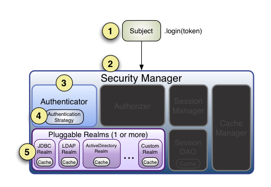
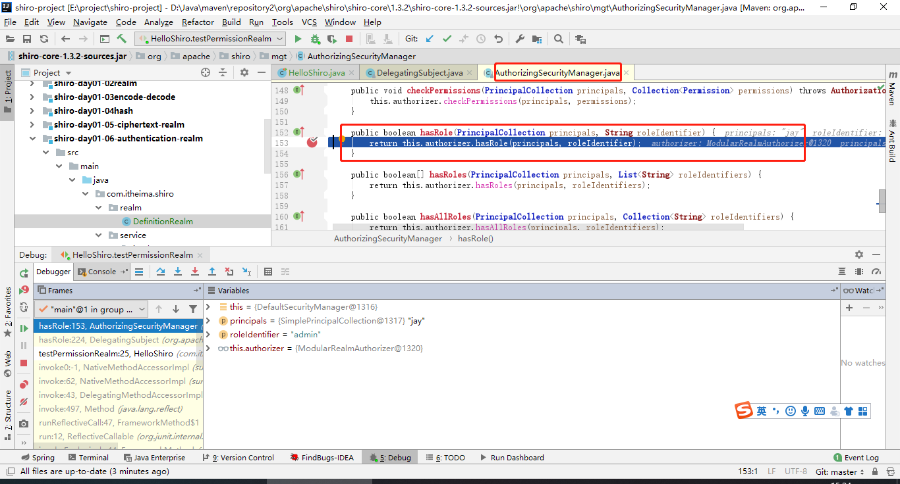
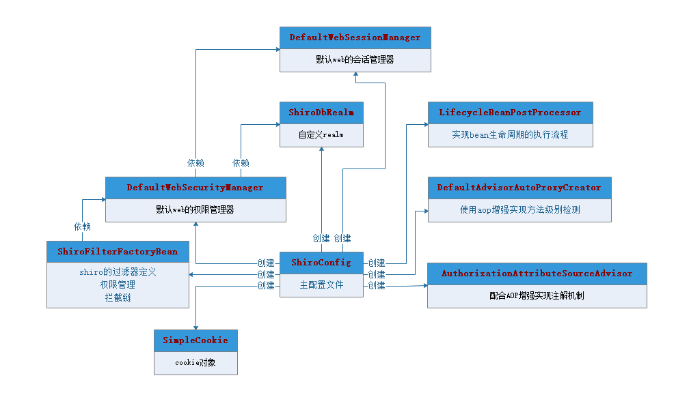

# 8	安全框架 Shiro

## 8.1	概述

##### Shiro 简介

Apache Shiro 是 Java 的一个安全框架。Shiro 可以非常容易的开发出足够好的应用，不仅可以用在 JavaSE 环境，也可以用在 JavaEE 环境。Shiro 可以帮助我们完成：认证、授权、加密、会话管理、与 Web 集成、缓存等功能。

<br>

##### 为什么选择 Shiro

目前，使用 Apache Shiro 的人越来越多，因为它比 Spring Security 更简单易用。虽然没有 Spring Security 功能强大，但是在实际工作时可能并不需要复杂的Spring Security ，使用 Shiro 能更简单的解决项目问题。

<br>

##### Shiro 基本功能点


- **Authentication**：身份认证 / 登录，验证用户是不是拥有相应的身份；
- **Authorization**：授权，即权限验证，验证某个已认证的用户是否拥有某个权限；即判断用户是否能做事情，常见的如：验证某个用户是否拥有某个角色。或者细粒度的验证某个用户对某个资源是否具有某个权限；
- **Session** **Management**：会话管理，即用户登录后就是一次会话，在没有退出之前，它的所有信息都在会话中；会话可以是普通 JavaSE 环境的，也可以是如 Web 环境的；
- **Cryptography**：加密，保护数据的安全性，如密码加密存储到数据库，而不是明文存储；
- **Web Support**：Web 支持，可以非常容易的集成到 Web 环境；
- **Caching**：缓存，比如用户登录后，其用户信息、拥有的角色 / 权限不必每次去查，这样可以提高效率；
- **Concurrency**：shiro 支持多线程应用的并发验证，即如在一个线程中开启另一个线程，能把权限自动传播过去；
- **Testing**：提供测试支持；
- **Run As**：允许一个用户假装为另一个用户（如果他们允许）的身份进行访问；
- **Remember Me**：记住我，这个是非常常见的功能，即一次登录后，下次再来的话不用登录了。

<br>

##### Shiro 工作流程


###### Subject

主体，代表了当前 “用户”[^8.1-1]。应用代码直接交互的对象是 Subject，也就是说 Shiro 的对外 API 核心就是 Subject。

###### SecurityManager

安全管理器，所有与安全有关的操作都会与 Security Manager 交互。SecurityManager 管理所有 Subject[^8.1-2]，负责与其他组件进行交互，是 Shiro 的核心。

###### Realm

域，Shiro 从 Realm 获取安全数据（如用户、角色、权限）[^8.1-3]。可以把 Realm 看成 DataSource，即 **安全数据源**。

###### Shiro 基本工作流程

1. 应用代码通过 Subject 来进行认证和授权，而 Subject 又委托给 SecurityManager；
2. 给 Shiro 的 SecurityManager 注入 Realm，从而让 SecurityManager 能得到合法的用户及其权限进行判断。

<br>

##### Shiro 内部架构


- **Subject**：主体，可以看到主体可以是任何可以与应用交互的 “用户”；
- **SecurityManager**：相当于 SpringMVC 中的 DispatcherServlet 或者 Struts2 中的 FilterDispatcher；是 Shiro 的心脏；所有具体的交互都通过 SecurityManager 进行控制；它管理着所有 Subject、且负责进行认证和授权、及会话、缓存的管理。
- **Authenticator**：认证器，负责主体认证，这是一个扩展点，如果用户觉得 Shiro 默认的不好，可以自定义实现；其需要认证策略（Authentication Strategy），即什么情况下算用户认证通过了；
- **Authorizer**：授权器，或者访问控制器，用来决定主体是否有权限进行相应的操作；即控制着用户能访问应用中的哪些功能；
- **Realm**：可以有 1 个或多个 Realm，可以认为是安全实体数据源，即用于获取安全实体的；可以是 JDBC 实现，也可以是 LDAP 实现，或者内存实现等等；由用户提供；注意：Shiro 不知道你的用户 / 权限存储在哪及以何种格式存储；所以我们一般在应用中都需要实现自己的 Realm；
- **SessionManager**：如果写过 Servlet 就应该知道 Session 的概念，Session 呢需要有人去管理它的生命周期，这个组件就是 SessionManager；而 Shiro 并不仅仅可以用在 Web 环境，也可以用在如普通的 JavaSE 环境、EJB 等环境；所以呢，Shiro 就抽象了一个自己的 Session 来管理主体与应用之间交互的数据；这样的话，比如我们在 Web 环境用，刚开始是一台 Web 服务器；接着又上了台 EJB 服务器；这时想把两台服务器的会话数据放到一个地方，这个时候就可以实现自己的分布式会话（如把数据放到 Memcached 服务器）；
- **SessionDAO**：DAO 大家都用过，数据访问对象，用于会话的 CRUD，比如我们想把 Session 保存到数据库，那么可以实现自己的 SessionDAO，通过如 JDBC 写到数据库；比如想把 Session 放到 Memcached 中，可以实现自己的 Memcached SessionDAO；另外 SessionDAO 中可以使用 Cache 进行缓存，以提高性能；
- **CacheManager**：缓存控制器，来管理如用户、角色、权限等的缓存的；因为这些数据基本上很少去改变，放到缓存中后可以提高访问的性能
- **Cryptography**：密码模块，Shiro 提供了一些常见的加密组件用于如密码加密 / 解密的。

<br>

---

[^8.1-1]: 这个用户不一定是一个具体的人，与当前应用交互的任何东西都是 Subject，如网络爬虫，机器人等，即一个抽象概念。
[^8.1-2]: 所有 Subject 都绑定到 Security Manager，且与 Subject 的所有交互都会被委托给 Security Manager。可以把 Subject 认为是一个门面，Security Manager 才是实际的执行者。
[^8.1-3]: SecurityManager 验证用户身份时，需要从 Realm 获取相应的用户进行比较以确定用户身份是否合法；验证用户是否能进行操作时，也需要从 Realm 得到用户相应的角色/权限。

<div STYLE="page-break-after: always;"><br>
    <br>
    <br>
    <br>
    <br>
    <br>
    <br>
    <br>
    <br>
    <br></div>
## 8.2	Shiro 基本使用

### 8.2.1	身份认证

##### Shiro 身份认证基本流程



1. Shiro 把用户的数据封装成标识 token，token 一般封装着用户名，密码等信息；
2. 使用 Subject 门面获取到封装着用户的数据的标识 token；
3. Subject 把标识 token 交给 SecurityManager，在 SecurityManager 安全中心中，SecurityManager 把标识 token 委托给认证器 Authenticator 进行身份验证。认证器的作用一般是用来指定如何验证，它规定本次认证用到哪些 Realm；
4. 认证器 Authenticator 将传入的标识token，与数据源 Realm 对比，验证 token 是否合法。

<br>

##### Shiro 基本使用具体步骤

###### 前提条件

在 resouces 目录下定义权限 ini 文件。

###### 代码

```java
//1.导入权限 ini 文件构建权限工厂
Factory<SecurityManager> factory = new IniSecurityManagerFactory("classpath:shiro.ini");
//2.工厂构建安全管理器
SecurityManager securityManager = factory.getInstance();
//3.使用 SecurityUtils 工具，使安全管理器生效
SecurityUtils.setSecurityManager(securityManager);
//4.使用 SecurityUtils 工具获得主体
Subject subject = SecurityUtils.getSubject();

//构建账号token
UsernamePasswordToken usernamePasswordToken = new UsernamePasswordToken("jay", "123");
//登录操作
// ...
subject.login(usernamePasswordToken);
```

<br>

##### Realm 接口结构


<br>

##### Realm 的使用

在项目中，一般不会实现 Realm 接口，而是选择继承 `AuthorizingRealm` 类，该类继承了认证与授权功能。它需要强制重写两个方法：

```java
public class DefinitionRealm extends AuthorizingRealm {
 
    /**
	 * @Description 认证
	 * @param authcToken token对象
	 * @return 
	 */
	public abstract AuthenticationInfo doGetAuthenticationInfo(AuthenticationToken authcToken) {
        return null;
    }

	/**
	 * @Description 鉴权
	 * @param principals 令牌
	 * @return
	 */
	public abstract AuthorizationInfo doGetAuthorizationInfo(PrincipalCollection principals){
        return null;
    }
}
```

<br>

##### 例——使用 Shiro 进行身份验证

###### 第一步——创建项目，导入相关依赖

```xml
<dependencies>

    <dependency>
      <groupId>org.apache.shiro</groupId>
      <artifactId>shiro-core</artifactId>
      <version>1.3.2</version>
    </dependency>
    
    <dependency>
      <groupId>junit</groupId>
      <artifactId>junit</artifactId>
      <version>4.11</version>
    </dependency>

    ...
</dependencies>
```

###### 第二步——编写 shiro.ini

```ini
#声明用户账号
[users]
Trump=123456789
```

###### 第三步——编写单元测试代码

```java
package com.itheima.shiro;

import org.apache.shiro.SecurityUtils;
import org.apache.shiro.authc.UsernamePasswordToken;
import org.apache.shiro.config.IniSecurityManagerFactory;
import org.apache.shiro.mgt.SecurityManager;
import org.apache.shiro.subject.Subject;
import org.apache.shiro.util.Factory;
import org.junit.Test;

/**
 * @Description：shiro的第一个例子
 */
public class HelloShiro {

    @Test
    public void shiroLogin() {
        //导入权限ini文件构建权限工厂
        Factory<SecurityManager> factory = new IniSecurityManagerFactory("classpath:shiro.ini");
        //工厂构建安全管理器
        SecurityManager securityManager = factory.getInstance();
        //使用SecurityUtils工具生效安全管理器
        SecurityUtils.setSecurityManager(securityManager);
        //使用SecurityUtils工具获得主体
        Subject subject = SecurityUtils.getSubject();
        
        //构建账号token
        UsernamePasswordToken usernamePasswordToken = new UsernamePasswordToken("Trump", "123456789");
        //登录操作
        subject.login(usernamePasswordToken);
        System.out.println("是否登录成功：" + subject.isAuthenticated());
    }
}
```

<br>

##### shiro 身份认证的内部逻辑

1. `Subject` 将包含用户名和密码的 `token` 委托给了 `securityManager`；

   

2. `securityManager` 将 `token` 委托给内部认证组件 `authenticator`；

   

3. `authenticator` 将 `token` 委托给数据源 `Realm` 进行对比：

   

4. 调用程序员实现的 `Realm` 的 `doGetAuthenticationInfo(token)` 方法（该方法从数据库中获得数据，并进行验证），如果验证通过，则返回一个正确的凭证 `info`：

   

<br>

##### 例——自定义 Realm

###### 第一步

创建项目并导入依赖。

###### 第二步

编辑 shiro.ini：

```ini
#声明自定义的 realm，且为安全管理器指定 realms
[main]
definitionRealm=cn.nilnullnaught.shiro.realm.DefinitionRealm
securityManager.realms=$definitionRealm
```

###### 第二步

创建 `SecurityService` 与 `SecurityServiceImpl`：

```java
package cn.nilnullnaught.shiro.dao;

public interface SecurityDao {

    String findPasswordByLoginName(String loginName);
}

```

```java
package cn.nilnullnaught.shiro.dao.impl;

import cn.nilnullnaught.shiro.dao.SecurityDao;

/**
 * @Description：权限服务层
 */
public class SecurityDaoImpl implements SecurityDao {

    @Override
    public String findPasswordByLoginName(String loginName) {
        if(loginName == 'Trump'){
            return "123456789";
        }
        return null;
    }
}
```

###### 第三步

定义 DefinitionRealm：

```java
package cn.nilnullnaught.shiro.realm;

import cn.nilnullnaught.dao.impl.SecurityDaoImpl;
import org.apache.shiro.authc.*;
import org.apache.shiro.authz.AuthorizationInfo;
import org.apache.shiro.realm.AuthorizingRealm;
import org.apache.shiro.subject.PrincipalCollection;

/**
 * @Description：声明自定义realm
 */
public class DefinitionRealm extends AuthorizingRealm {

    /**
     * @Description 认证接口
     * @param token 传递登录token
     * @return
     */
    @Override
    protected AuthenticationInfo doGetAuthenticationInfo(AuthenticationToken token) throws AuthenticationException {
        //从AuthenticationToken 中获得登录信息
        String loginName = (String) token.getPrincipal();
        
        //查询user对象
        var securityDao = new SecurityDaoImpl();
        String password = securityDao.findPasswordByLoginName(loginName);
        if ("".equals(password)||password==null){
            throw new UnknownAccountException("账户不存在");
        }
        
        //构建认证信息对象:1、令牌对象 2、密文密码  3、加密因子 4、当前realm的名称
        return  new SimpleAuthenticationInfo(loginName,password,getName());
    }


    @Override
    protected AuthorizationInfo doGetAuthorizationInfo(PrincipalCollection principals) {
        return null;
    }

}
```

<br>

##### shiro 保持登录状态

登录成功后，Shiro 会在响应头中向浏览器设置 cookie，这个 Cookie 也会在 Shiro 中进行保存：


这个 cookie 相当于当前登录用户的身份凭证，我们可以利用这个 cookie 去访问当前用户在这个系统中被授权的接口：


如果不携带这个 cookie 时，请求会被 shiro 过滤器过滤掉，访问失败。如果 Shiro 中的这个 Cookie 被删除了，也会访问失败。

<br>

---

<div STYLE="page-break-after: always;"><br>
    <br>
    <br>
    <br>
    <br>
    <br>
    <br>
    <br>
    <br>
    <br></div>

### 8.2.2	编码

##### Shiro 的编码/解码 API

Shiro 内部的一些数据的存储/表示使用了 base64 和 16 进制字符串。Shiro 也提供了 base64 和 16 进制字符串编码/解码的 API 支持，方便一些编码解码操作。

<br>

##### 例

###### 第一步

创建 `EncodesUtil` 类：

```java
package cn.nilnullnaught.tools;

import org.apache.shiro.codec.Base64;
import org.apache.shiro.codec.Hex;

/**
 * @Description：封装base64和16进制编码解码工具类
 */
public class EncodesUtil {

    /**
     * @Description HEX-byte[]--String转换
     * @param input 输入数组
     * @return String
     */
    public static String encodeHex(byte[] input){
        return Hex.encodeToString(input);
    }

    /**
     * @Description HEX-String--byte[]转换
     * @param input 输入字符串
     * @return byte数组
     */
    public static byte[] decodeHex(String input){
        return Hex.decode(input);
    }

    /**
     * @Description Base64-byte[]--String转换
     * @param input 输入数组
     * @return String
     */
    public static String encodeBase64(byte[] input){
        return Base64.encodeToString(input);
    }

    /**
     * @Description Base64-String--byte[]转换
     * @param input 输入字符串
     * @return byte数组
     */
    public static byte[] decodeBase64(String input){
        return Base64.decode(input);
    }

}
```

###### 第二步——创建 ClientTest 类

```java
package cn.nilnullnaught.client;

import cn.nilnullnaught.tools.EncodesUtil;
import org.junit.Test;

/**
 * @Description：测试
 */
public class ClientTest {

    /**
     * @Description 测试16进制编码
     */
    @Test
    public void testHex(){
        String val = "holle";
        String flag = EncodesUtil.encodeHex(val.getBytes());
        String valHandler = new String(EncodesUtil.decodeHex(flag));
        System.out.println("比较结果："+val.equals(valHandler));
    }

    /**
     * @Description 测试base64编码
     */
    @Test
    public void testBase64(){
        String val = "holle";
        String flag = EncodesUtil.encodeBase64(val.getBytes());
        String valHandler = new String(EncodesUtil.decodeBase64(flag));
        System.out.println("比较结果："+val.equals(valHandler));
    }


}
```

<br>

---

<div STYLE="page-break-after: always;"><br>
    <br>
    <br>
    <br>
    <br>
    <br>
    <br>
    <br>
    <br>
    <br></div>

### 8.2.3	加密与散列算法

##### 散列算法简介

散列算法一般用于生成数据的摘要信息，是一种不可逆的算法，一般适合存储密码之类的数据，常见的散列算法如 MD5、SHA 等。一般进行散列时最好提供一个 salt（盐），比如加密密码“admin”，产生的散列值是“21232f297a57a5a743894a0e4a801fc3”，可以到一些 md5 解密网站很容易的通过散列值得到密码“admin”，即如果直接对密码进行散列相对来说破解更容易，此时我们可以加一些只有系统知道的干扰数据，即 salt；这样散列的对象是“密码+salt”，这样生成的散列值相对来说更难破解。

<br>

##### shiro 支持的散列算法

Md2Hash、Md5Hash、Sha1Hash、Sha256Hash、Sha384Hash、Sha512Hash

<br>

##### 例——使用 shiro 提供的散列算法生成密文

###### 第一步——创建工具类

```java
package cn.nilnullnaught.shiro.tools;

import com.sun.org.apache.bcel.internal.generic.NEW;
import org.apache.shiro.crypto.SecureRandomNumberGenerator;
import org.apache.shiro.crypto.hash.SimpleHash;
import sun.security.util.Password;

import java.util.HashMap;
import java.util.Map;

public class DigestsUtil {

    // 加密算法
    private static final String SHA1 = "SHA-1";
    
    // 密码迭代次数
    private static final Integer ITERATIONS =512;

    //使用 generateSalt() 生成的 SALT
    private static final String SALT = "d71f876d2a61b9a280e0318cdd15a07c";


    //生成密文
    public static String entryptPassword(String passwordPlain) {
        // 调用 sha1() 生成密文
        return sha1(passwordPlain,SALT);
    }

	// 使用 SHA-1 算法生成密文
    public static String sha1(String input, String salt) {
        return new SimpleHash(SHA1, input, salt,ITERATIONS).toString();
    }


    //随机获得 salt 字符串
    public static String generateSalt(){
        SecureRandomNumberGenerator randomNumberGenerator = new SecureRandomNumberGenerator();
        return randomNumberGenerator.nextBytes().toHex();
    }
}
```

###### 第二步——创建测试类

```java
import cn.nilnullnaught.tools.DigestsUtil;
import org.junit.Test;

import java.util.Map;

/**
 * @Description：测试
 */
public class ClientTest {

    @Test
    public void testDigestsUtil(){
        var result =  DigestsUtil.entryptPassword("123456789");
        System.out.println("获得结果："+result);
    }

}
```

<br>

##### 例——在 Realm 中使用散列算法

###### 第一步——创建项目并添加依赖

略。

###### 第二步——编写持久层逻辑

创建 SecurityDao 与 SecurityDaoImpl（不连接数据库，只进行模拟）：

```java
package cn.nilnullnaught.dao;

import java.util.Map;

public interface SecurityDao {

    Map<String,String> findPasswordByLoginName(String loginName);
}

```

```java
package cn.nilnullnaught.dao.impl;

import cn.nilnullnaught.dao.SecurityDao;

import java.util.HashMap;
import java.util.Map;

/**
 * @Description：权限服务层
 */
public class SecurityDaoImpl implements SecurityDao {

    @Override
    public String findPasswordByLoginName(String loginName) {
        if("Trump".equals(loginName)){
			//模拟数据库中存储的密文信息
       		return  “836d7360a625449a97aa9551450408b53214eeef”;
        }
        return null;
    }
}

```

###### 第三步——指定密码匹配方式

为 `DefinitionRealm` 类添加如下构造方法：

```java
public DefinitionRealm() {
    //指定密码匹配方式为 sha1
    HashedCredentialsMatcher matcher = new HashedCredentialsMatcher(DigestsUtil.SHA1);
    //指定密码迭代次数
    matcher.setHashIterations(DigestsUtil.ITERATIONS);
    //使用父亲方法使匹配方式生效
    setCredentialsMatcher(matcher);
}
```

修改 `DefinitionRealm` 类的 `doGetAuthenticationInfo()` 方法如下：

```java
public class DefinitionRealm extends AuthorizingRealm {

    // 无参构造
    public DefinitionRealm() {
        //指定密码匹配方式为 sha1
        HashedCredentialsMatcher matcher = new HashedCredentialsMatcher(DigestsUtil.SHA1);
        //指定密码迭代次数
        matcher.setHashIterations(DigestsUtil.ITERATIONS);
        //使用父亲方法使匹配方式生效
        setCredentialsMatcher(matcher);
    }

    @Override
    protected AuthenticationInfo doGetAuthenticationInfo(AuthenticationToken token) throws AuthenticationException {
        //从 AuthenticationToken 中获得登录名称
        String loginName = (String) token.getPrincipal();
        var securityService = new SecurityDaoImpl();
        var password = securityService.findPasswordByLoginName(loginName);
        if (password.isEmpty()){
            throw new UnknownAccountException("账户不存在");
        }
        
        //传递账号和密码:
        //参数 1：缓存对象
        //参数 2：明文密码
        //参数三：字节 salt
        //参数 4：当前DefinitionRealm名称
        return  new SimpleAuthenticationInfo(loginName,password, ByteSource.Util.bytes(DigestsUtil.SALT),getName());
    }


    @Override
    protected AuthorizationInfo doGetAuthorizationInfo(PrincipalCollection principals) {
        return null;
    }

}
```

###### 第四步——编写测试代码

```java
public class ShiroTest {

    @Test
    public void shiroLogin() {
        //导入权限ini文件构建权限工厂
        var factory = new IniSecurityManagerFactory("classpath:shiro.ini");
        //工厂构建安全管理器
        var securityManager = factory.getInstance();
        //使用SecurityUtils工具生效安全管理器
        SecurityUtils.setSecurityManager(securityManager);
        //使用SecurityUtils工具获得主体
        Subject subject = SecurityUtils.getSubject();
        //构建账号token
        UsernamePasswordToken usernamePasswordToken = new UsernamePasswordToken("Trump", "123456789");
        //登录操作
        subject.login(usernamePasswordToken);
        System.out.println("是否登录成功：" + subject.isAuthenticated());
    }
}
```

<br>

---

<div STYLE="page-break-after: always;"><br>
    <br>
    <br>
    <br>
    <br>
    <br>
    <br>
    <br>
    <br>
    <br></div>

### 8.2.4	授权

##### Shiro 授权方式

Shiro 中对于后台授权提供了三种实现方式：

- 编程式

  ```java
  Subject subject = SecurityUtils.getSubject();
  if (subject.hasRole("admin")) {
      // 有权限
  } else {
      // 无权限
  }
  ```

- 注解式

  ```
  @RequiresRoles("admin")
  public void find() {
      // 有权限
  }
  ```

- 标签式（已淘汰，只能在JSP，Thymeleaf等模板引擎中使用）

<br>

##### 身份授权基本流程

###### 前提条件

用户已经通过认证

###### 步骤


1. 首先调用 Subject.isPermitted/hasRole 接口，其会委托给 SecurityManager。
2. SecurityManager 接着会委托给内部组件 Authorizer；
3. Authorizer 再将其请求委托给编程人员自定义的 `Realm`；
4. Realm 将用户请求的参数封装成权限对象。再从编程人员重写的 `doGetAuthorizationInfo(PrincipalCollection)` 方法中获取从数据库中查询到的权限集合。
5. Realm 将用户传入的权限对象，与从数据库中查出来的权限对象，进行对比。如果用户传入的权限对象在从数据库中查出来的权限对象中，则返回 true，否则返回 false。

<br>

##### 编程式鉴权相关方法

以 check 开头的会抛出异常，以 is 和 has 开头会返回布尔值。

###### 登录相关

| Subject 登录相关方法 | 描述                                   |
| -------------------- | -------------------------------------- |
| isAuthenticated()    | 返回true 表示已经登录，否则返回false。 |

###### 角色相关

| Subject 角色相关方法                     | 描述                                                         |
| ---------------------------------------- | ------------------------------------------------------------ |
| hasRole(String roleName)                 | 返回true 如果Subject 被分配了指定的角色，否则返回false。     |
| hasRoles(List<String> roleNames)         | 返回true 如果Subject 被分配了所有指定的角色，否则返回false。 |
| hasAllRoles(Collection<String>roleNames) | 返回一个与方法参数中目录一致的hasRole 结果的集合。有性能的提高如果许多角色需要执行检查（例如，当自定义一个复杂的视图）。 |
| checkRole(String roleName)               | 安静地返回，如果Subject 被分配了指定的角色，不然的话就抛出AuthorizationException。 |
| checkRoles(Collection<String>roleNames)  | 安静地返回，如果Subject 被分配了所有的指定的角色，不然的话就抛出AuthorizationException。 |
| checkRoles(String… roleNames)            | 与上面的checkRoles 方法的效果相同，但允许Java5 的var-args 类型的参数 |

###### 资源相关

| Subject 资源相关方法                           | 描述                                                         |
| ---------------------------------------------- | ------------------------------------------------------------ |
| isPermitted(Permission p)                      | 返回true 如果该Subject 被允许执行某动作或访问被权限实例指定的资源，否则返回false |
| isPermitted(List<Permission> perms)            | 返回一个与方法参数中目录一致的isPermitted 结果的集合。       |
| isPermittedAll(Collection<Permission>perms)    | 返回true 如果该Subject 被允许所有指定的权限，否则返回false有性能的提高如果需要执行许多检查（例如，当自定义一个复杂的视图） |
| isPermitted(String perm)                       | 返回true 如果该Subject 被允许执行某动作或访问被字符串权限指定的资源，否则返回false。 |
| isPermitted(String…perms)                      | 返回一个与方法参数中目录一致的isPermitted 结果的数组。有性能的提高如果许多字符串权限检查需要被执行（例如，当自定义一个复杂的视图）。 |
| isPermittedAll(String…perms)                   | 返回true 如果该Subject 被允许所有指定的字符串权限，否则返回false。 |
| checkPermission(Permission p)                  | 安静地返回，如果Subject 被允许执行某动作或访问被特定的权限实例指定的资源，不然的话就抛出AuthorizationException 异常。 |
| checkPermission(String perm)                   | 安静地返回，如果Subject 被允许执行某动作或访问被特定的字符串权限指定的资源，不然的话就抛出AuthorizationException 异常。 |
| checkPermissions(Collection<Permission> perms) | 安静地返回，如果Subject 被允许所有的权限，不然的话就抛出AuthorizationException 异常。有性能的提高如果需要执行许多检查（例如，当自定义一个复杂的视图） |
| checkPermissions(String… perms)                | 和上面的checkPermissions 方法效果相同，但是使用的是基于字符串的权限。 |

<br>

##### 身份鉴权的内部逻辑

1. 客户端调用 subject.hasRole("admin")，判断当前用户是否有"admin"角色权限。

   

2. Subject 门面对象接收到要被验证的角色信息 "admin"，并将其委托给 securityManager 中验证。

   

3. securityManager 将验证请求再次委托给内部组件 authorizer。

   

4. authorizer 通过自定义的 Realm 进行鉴权。

   

5. 获取 `principal` 对象，同时传入校验的角色进行循环校验，循环中先创建鉴权信息。

   

6. 查看缓存中是否已经有鉴权信息

   

   

7. 调用 自定义的 Realm 完成鉴权。

   

<br>

##### 例

###### 第一步——创建项目并添加依赖

略。

###### 第二步——编写持久层逻辑

创建 SecurityDao 与 SecurityDaoImpl（不连接数据库，只进行模拟）：

```java
public interface SecurityDao {
    String findPasswordByLoginName(String loginName);

    List<String> findRoleByloginName(String loginName);

    List<String>  findPermissionByloginName(String loginName);
}
```

```java
public class SecurityDaoImpl implements SecurityDao {

    // 从数据库获取加密后的密码
    @Override
    public String findPasswordByLoginName(String loginName) {
        if("Trump".equals(loginName)){
            return "836d7360a625449a97aa9551450408b53214eeef";
        }
        return null;
    }

    // 根据用户名查找用户角色
    @Override
    public List<String> findRoleByloginName(String loginName) {
        List<String> list = new ArrayList<>();
        list.add("admin");
        list.add("dev");
        return list;
    }

    // 根据用户名查找用户权限
    @Override
    public List<String> findPermissionByloginName(String loginName) {
        List<String> list = new ArrayList<>();
        list.add("order:add");
        list.add("order:query");
        list.add("order:del");
        return list;
    }
}
```

###### 第三步——编写 DefinitionRealm

```java
public class DefinitionRealm extends AuthorizingRealm {

    // 无参构造
    public DefinitionRealm() {
        //指定密码匹配方式为 sha1
        HashedCredentialsMatcher matcher = new HashedCredentialsMatcher(DigestsUtil.SHA1);
        //指定密码迭代次数
        matcher.setHashIterations(DigestsUtil.ITERATIONS);
        //使用父亲方法使匹配方式生效
        setCredentialsMatcher(matcher);
    }

    // 用户认证
    @Override
    protected AuthenticationInfo doGetAuthenticationInfo(AuthenticationToken token) throws AuthenticationException {
        //从 AuthenticationToken 中获得登录名称
        String loginName = (String) token.getPrincipal();
        var securityService = new SecurityDaoImpl();
        var password = securityService.findPasswordByLoginName(loginName);
        if (password.isEmpty()){
            throw new UnknownAccountException("账户不存在");
        }

        //传递账号和密码:
        //参数 1：缓存对象
        //参数 2：明文密码
        //参数三：字节 salt
        //参数 4：当前DefinitionRealm名称
        return  new SimpleAuthenticationInfo(loginName,password, ByteSource.Util.bytes(DigestsUtil.SALT),getName());
    }

    // 身份授权
    @Override
    protected AuthorizationInfo doGetAuthorizationInfo(PrincipalCollection principals) {
        //获取用户认证凭证信息
        String loginName = (String) principals.getPrimaryPrincipal();
        //从数据库中查询对应的角色和资源
        var securityDao = new SecurityDaoImpl();
        var roles = securityDao.findRoleByloginName(loginName);
        var permissions = securityDao.findPermissionByloginName(loginName);
        //构建资源校验
        var authorizationInfo = new SimpleAuthorizationInfo();
        authorizationInfo.addRoles(roles);
        authorizationInfo.addStringPermissions(permissions);
        return authorizationInfo;
    }
}
```

###### 第四步——编写测试代码

```java
public class HelloShiro {

 	@Test
    public void testPermissionRealm() {
        Subject subject = shiroLogin("Trump", "123456789");
        //判断用户是否已经登录
        System.out.println("是否登录成功：" + subject.isAuthenticated());

        //---------检查当前用户的角色信息------------
        System.out.println("是否有管理员角色："+subject.hasRole("admin"));
        //---------如果当前用户有此角色，无返回值。若没有此权限，则抛 UnauthorizedException------------
        try {
            subject.checkRole("coder");
            System.out.println("有coder角色");
        }catch (Exception e){
            System.out.println("没有coder角色");
        }

        //---------检查当前用户的权限信息------------
        System.out.println("是否有查看订单列表资源："+subject.isPermitted("order:list"));
        //---------如果当前用户有此权限，无返回值。若没有此权限，则抛 UnauthorizedException------------
        try {
            subject.checkPermissions("order:add", "order:del");
            System.out.println("有添加和删除订单资源");
        }catch (Exception e){
            System.out.println("没有有添加和删除订单资源");
        }

    }

    public Subject shiroLogin(String loginName,String password) {
        //导入权限ini文件构建权限工厂
        var factory = new IniSecurityManagerFactory("classpath:shiro.ini");
        //工厂构建安全管理器
        var securityManager = factory.getInstance();
        //使用SecurityUtils工具生效安全管理器
        SecurityUtils.setSecurityManager(securityManager);
        //使用SecurityUtils工具获得主体
        Subject subject = SecurityUtils.getSubject();
        //构建账号token
        UsernamePasswordToken usernamePasswordToken = new UsernamePasswordToken(loginName, password);
        //登录操作
        subject.login(usernamePasswordToken);
        return subject;
    }

}
```

<br>

---

<div STYLE="page-break-after: always;"><br>
    <br>
    <br>
    <br>
    <br>
    <br>
    <br>
    <br>
    <br>
    <br></div>

### 8.2.5	基于资源的访问控制

##### Shiro 权限字符串

###### 组成规则

在Shiro中使用权限字符串必须按照Shiro指定的规则。

权限字符串组合规则为：**"资源类型标识符 : 操作 : 资源实例标识符"**：

- **资源类型标识符：** 一般会按模块，对系统划分资源。比如user模块，product模块，order模块等，对应的资源类型标识符就是：user，product，order。
- **操作：** 一般为增删改查（create，delete，update，find），还有 * 标识统配。
- **资源实例标识符：** 如果Subject控制的是资源类型，那么资源实例标识符就是 "*" ；如果Subject控制的是资源实例，那么就需要在资源实例标识符就是该资源的唯一标识（ID等）。

###### 例

**" \* : \* : \* "** 表示Subject对所有类型的所有实例有所有操作权限，相当于超级管理员。

**" order: create : \* "** 表示Subject对order类型的所有实例有创建的权限，可以简写为：" user : create "。

**" order: update : 001 "** 表示Subject对ID为001的order实例有修改的权限。

**" order: \* : 001 "** 表示Subject对ID为001的order实例有所有权限。

<br>

##### ❓

shiro 如何识别资源？

权限字符串存储在数据库中，和角色对应？

---

<div STYLE="page-break-after: always;"><br>
    <br>
    <br>
    <br>
    <br>
    <br>
    <br>
    <br>
    <br>
    <br></div>

## 8.3	Spring Boot 集成 Shiro

### 8.3.1	项目基础

##### 数据库

- **sh_user**：用户表，一个用户可以有多个角色；
- **sh_role**：角色表，一个角色可以有多个资源；
- **sh_resource**：资源表；
- **sh_user_role**：用户角色中间表；
- **sh_role_resource**：角色资源中间表。

###### 表关系


###### 数据库脚本

sh_user

```sql
CREATE TABLE `sh_user` (
  `ID` varchar(36) NOT NULL COMMENT '主键',
  `LOGIN_NAME` varchar(36) DEFAULT NULL COMMENT '登录名称',
  `PASS_WORD` varchar(150) DEFAULT NULL COMMENT '密码',
  PRIMARY KEY (`ID`)
) ENGINE=InnoDB DEFAULT CHARSET=utf8 ROW_FORMAT=COMPACT COMMENT='用户表';

```

sh_role

```sql
CREATE TABLE `sh_role` (
  `ID` varchar(36) NOT NULL COMMENT '主键',
  `ROLE_NAME` varchar(36) DEFAULT NULL COMMENT '角色名称',
  `LABEL` varchar(36) DEFAULT NULL COMMENT '角色标识',
  `DESCRIPTION` varchar(200) DEFAULT NULL COMMENT '角色描述',
  PRIMARY KEY (`ID`)
) ENGINE=InnoDB DEFAULT CHARSET=utf8 ROW_FORMAT=COMPACT COMMENT='用户角色表';
```

sh_resource

```sql
CREATE TABLE `sh_resource` (
  `ID` varchar(36) NOT NULL COMMENT '主键',
  `PARENT_ID` varchar(36) DEFAULT NULL COMMENT '父资源',
  `RESOURCE_NAME` varchar(36) DEFAULT NULL COMMENT '资源名称',
  `REQUEST_PATH` varchar(200) DEFAULT NULL COMMENT '资源路径',
  `LABEL` varchar(200) DEFAULT NULL COMMENT '资源标签',
  `ICON` varchar(20) DEFAULT NULL COMMENT '图标',
  `IS_LEAF` varchar(18) DEFAULT NULL COMMENT '是否叶子节点',
  `RESOURCE_TYPE` varchar(36) DEFAULT NULL COMMENT '资源类型',
  `SORT_NO` int(11) DEFAULT NULL COMMENT '排序',
  `DESCRIPTION` varchar(200) DEFAULT NULL COMMENT '描述',
  `SYSTEM_CODE` varchar(36) DEFAULT NULL COMMENT '系统code',
  `IS_SYSTEM_ROOT` varchar(18) DEFAULT NULL COMMENT '是否根节点',
  PRIMARY KEY (`ID`)
) ENGINE=InnoDB DEFAULT CHARSET=utf8 ROW_FORMAT=COMPACT COMMENT='资源表';

```

sh_role_resource

```sql
CREATE TABLE `sh_role_resource` (
  `ID` varchar(36) NOT NULL,
  `ENABLE_FLAG` varchar(18) DEFAULT NULL,
  `ROLE_ID` varchar(36) DEFAULT NULL,
  `RESOURCE_ID` varchar(36) DEFAULT NULL,
  PRIMARY KEY (`ID`)
) ENGINE=InnoDB DEFAULT CHARSET=utf8 ROW_FORMAT=COMPACT COMMENT='角色资源表';
```

sh_user_role

```sql
CREATE TABLE `sh_user_role` (
  `ID` varchar(36) NOT NULL,
  `ENABLE_FLAG` varchar(18) DEFAULT NULL,
  `USER_ID` varchar(36) DEFAULT NULL,
  `ROLE_ID` varchar(36) DEFAULT NULL,
  PRIMARY KEY (`ID`)
) ENGINE=InnoDB DEFAULT CHARSET=utf8 ROW_FORMAT=COMPACT COMMENT='用户角色表';
```

<br>

##### 项目依赖

```xml
  <properties>
    <project.build.sourceEncoding>UTF-8</project.build.sourceEncoding>
    <!--jstl标签版本 -->
    <jstl.version>1.2</jstl.version>
    <!--servlet版本-->
    <servlet.version>4.0.1</servlet.version>
    <!--jdk版本-->
    <java.version>1.8</java.version>
    <!--mybatis版本-->
    <mybatis.version>2.0.0</mybatis.version>
    <!--分页工具版本-->
    <pagehelper.version>4.1.1</pagehelper.version>
    <!--druid版本-->
    <druid.version>1.1.20</druid.version>
    <!--spring-boot版本-->
    <spring.boot.version>2.1.6.RELEASE</spring.boot.version>
    <!--系统版本-->
    <itheima.version>1.0-SNAPSHOT</itheima.version>
    <!--dubbo版本-->
    <dubbo.version>2.7.3</dubbo.version>
    <!--zookeeper-->
    <zookeeper.version>3.4.6</zookeeper.version>
    <!--mysql-->
    <mysql-connector-java.version>5.1.44</mysql-connector-java.version>
    <!--mybatis版本-->
    <mybatis.version>2.0.0</mybatis.version>
    <!--lombok-->
    <lombok.version>1.18.8</lombok.version>
    <!--fastjson-->
    <fastjson.version>1.2.47</fastjson.version>
    <!--shiro-->
    <shiro.version>1.3.2</shiro.version>
    <!--junit-->
    <junit.version>4.12</junit.version>
    <!--jackson版本-->
    <jackson.version>2.9.0</jackson.version>
    <!--tomcat-->
    <tomcat.embed.version>9.0.21</tomcat.embed.version>
    <!--lang3-->
    <commons.lang3.version>3.8.1</commons.lang3.version>
    <!-- slf4j2日志版本 -->
    <log4j.version>2.8.2</log4j.version>

  </properties>

  <dependencies>

    <!--jstl-->
    <dependency>
      <groupId>javax.servlet</groupId>
      <artifactId>jstl</artifactId>
      <version>${jstl.version}</version>
    </dependency>

    <!--servlet-->
    <dependency>
      <groupId>javax.servlet</groupId>
      <artifactId>javax.servlet-api</artifactId>
      <version>${servlet.version}</version>
      <scope>provided</scope>
    </dependency>

    <dependency>
      <groupId>org.apache.commons</groupId>
      <artifactId>commons-lang3</artifactId>
      <version>${commons.lang3.version}</version>
    </dependency>

    <!--JTA事务-->
    <dependency>
      <groupId>org.springframework.boot</groupId>
      <artifactId>spring-boot-starter-jta-atomikos</artifactId>
      <version>${spring.boot.version}</version>
    </dependency>

    <!--springboot组件-->
    <dependency>
      <groupId>org.springframework.boot</groupId>
      <artifactId>spring-boot-starter</artifactId>
      <version>${spring.boot.version}</version>
    </dependency>

    <dependency>
      <groupId>org.springframework.boot</groupId>
      <artifactId>spring-boot-starter-web</artifactId>
      <version>${spring.boot.version}</version>
      <exclusions>
        <exclusion>
          <artifactId>spring-boot-starter-logging</artifactId>
          <groupId>org.springframework.boot</groupId>
        </exclusion>
      </exclusions>
    </dependency>

    <dependency>
      <groupId>org.springframework.boot</groupId>
      <artifactId>spring-boot-starter-aop</artifactId>
      <version>${spring.boot.version}</version>
    </dependency>

    <dependency>
      <groupId>org.springframework.boot</groupId>
      <artifactId>spring-boot-configuration-processor</artifactId>
      <version>${spring.boot.version}</version>
    </dependency>

    <dependency>
      <groupId>org.springframework.boot</groupId>
      <artifactId>spring-boot-starter-tomcat</artifactId>
      <version>${spring.boot.version}</version>
      <scope>provided</scope>
    </dependency>

    <dependency>
      <groupId>org.apache.tomcat.embed</groupId>
      <artifactId>tomcat-embed-jasper</artifactId>
      <version>${tomcat.embed.version}</version>
    </dependency>

    <!-- SECURITY begin -->
    <dependency>
      <groupId>org.apache.shiro</groupId>
      <artifactId>shiro-core</artifactId>
      <version>${shiro.version}</version>
    </dependency>
    <dependency>
      <groupId>org.apache.shiro</groupId>
      <artifactId>shiro-spring</artifactId>
      <version>${shiro.version}</version>
    </dependency>
    <dependency>
      <groupId>org.apache.shiro</groupId>
      <artifactId>shiro-web</artifactId>
      <version>${shiro.version}</version>
    </dependency>
    <dependency>
      <groupId>org.apache.shiro</groupId>
      <artifactId>shiro-ehcache</artifactId>
      <version>${shiro.version}</version>
    </dependency>
    <!-- SECURITY end -->

    <!--druid数据源-->
    <dependency>
      <groupId>com.alibaba</groupId>
      <artifactId>druid</artifactId>
      <version>${druid.version}</version>
    </dependency>

    <!--springboot关于druid-->
    <dependency>
      <groupId>com.alibaba</groupId>
      <artifactId>druid-spring-boot-starter</artifactId>
      <version>${druid.version}</version>
    </dependency>

    <!--mysql数据源-->
    <dependency>
      <groupId>mysql</groupId>
      <artifactId>mysql-connector-java</artifactId>
      <version>${mysql-connector-java.version}</version>
    </dependency>

    <dependency>
      <groupId>org.mybatis.spring.boot</groupId>
      <artifactId>mybatis-spring-boot-starter</artifactId>
      <version>${mybatis.version}</version>
    </dependency>

    <!--分页插件-->
    <dependency>
      <groupId>com.github.pagehelper</groupId>
      <artifactId>pagehelper</artifactId>
      <version>${pagehelper.version}</version>
    </dependency>

    <!--fastjson-->
    <dependency>
      <groupId>com.alibaba</groupId>
      <artifactId>fastjson</artifactId>
      <version>${fastjson.version}</version>
    </dependency>

    <!--jackson依赖包-->
    <dependency>
      <groupId>com.fasterxml.jackson.core</groupId>
      <artifactId>jackson-core</artifactId>
      <version>${jackson.version}</version>
    </dependency>
    <dependency>
      <groupId>com.fasterxml.jackson.core</groupId>
      <artifactId>jackson-databind</artifactId>
      <version>${jackson.version}</version>
    </dependency>
    <dependency>
      <groupId>com.fasterxml.jackson.core</groupId>
      <artifactId>jackson-annotations</artifactId>
      <version>${jackson.version}</version>
    </dependency>

    <!--lombok-->
    <dependency>
      <groupId>org.projectlombok</groupId>
      <artifactId>lombok</artifactId>
      <version>${lombok.version}</version>
    </dependency>

    <!-- log4j2驱动依赖 -->
    <dependency>
      <groupId>org.apache.logging.log4j</groupId>
      <artifactId>log4j-api</artifactId>
      <version>${log4j.version}</version>
    </dependency>

    <dependency>
      <groupId>org.apache.logging.log4j</groupId>
      <artifactId>log4j-core</artifactId>
      <version>${log4j.version}</version>
    </dependency>

    <dependency>
      <groupId>org.apache.logging.log4j</groupId>
      <artifactId>log4j-web</artifactId>
      <version>${log4j.version}</version>
    </dependency>


  </dependencies>
```

<br>

##### ❗项目结构

---

<div STYLE="page-break-after: always;"><br>
    <br>
    <br>
    <br>
    <br>
    <br>
    <br>
    <br>
    <br>
    <br></div>

### 8.3.2	核心类

##### 代码逻辑

`ShiroDbRealmImpl` 继承 `ShiroDbRealm`，并向上继承 `AuthorizingRealm`。

`ShiroDbRealmImpl` 实例化时会创建密码匹配器 `HashedCredentialsMatcher` 实例，`HashedCredentialsMatcher` 指定 hash 次数与方式，交于`AuthenticatingRealm`。

调用 `login()` 方法后，最终调用 `doGetAuthenticationInfo(AuthenticationToken)` 方法，获取 `SimpleToken` 的对象，调用 `UserBridgeService` 的查找用户方法，把 `ShiroUser` 对象、密码和 salt 交于 `SimpleAuthenticationInfo` 认证。

访问需要鉴权时，调用 `doGetAuthorizationInfo(PrincipalCollection)` 方法，然后调用 `UserBridgeService` 的授权验证。


<br>

##### ShiroDbRealm

```java
public abstract class ShiroDbRealm extends AuthorizingRealm {
	
	// 认证
	public abstract AuthenticationInfo doGetAuthenticationInfo(AuthenticationToken authcToken) ;

	// 鉴权
	public abstract AuthorizationInfo doGetAuthorizationInfo(PrincipalCollection principals);
	
	// 密码匹配器
	@PostConstruct
	public abstract void initCredentialsMatcher() ;

	
}
```

<br>

##### ShiroDbRealmImpl

```java
public class ShiroDbRealmImpl extends ShiroDbRealm {

    @Autowired
    private UserBridgeService userBridgeService;


    // 认证方法
    @Override
    public AuthenticationInfo doGetAuthenticationInfo(AuthenticationToken authcToken) {
        SimpleToken token = (SimpleToken)authcToken;
        User user  = userBridgeService.findUserByLoginName(token.getUsername());
        if(EmptyUtil.isNullOrEmpty(user)){
            throw new UnknownAccountException("账号不存在");
        }
        ShiroUser shiroUser = BeanConv.toBean(user, ShiroUser.class);
        shiroUser.setResourceIds(userBridgeService.findResourcesIdsList(user.getId()));
        String salt = user.getSalt();
        String password = user.getPassWord();
        return new SimpleAuthenticationInfo(shiroUser, password, ByteSource.Util.bytes(salt), getName());
    }

    // 授权方法
    @Override
    public AuthorizationInfo doGetAuthorizationInfo(PrincipalCollection principals) {
        ShiroUser shiroUser = (ShiroUser) principals.getPrimaryPrincipal();
        return userBridgeService.getAuthorizationInfo(shiroUser);
    }

    // 加密方式
    @Override
    public void initCredentialsMatcher() {
        HashedCredentialsMatcher matcher = new HashedCredentialsMatcher(SuperConstant.HASH_ALGORITHM);
        matcher.setHashIterations(SuperConstant.HASH_INTERATIONS);
        setCredentialsMatcher(matcher);

    }
}
```

<br>

##### SimpleToken

```java
@Getter
@Setter
public class SimpleToken extends UsernamePasswordToken {
	
	/** serialVersionUID */
	private static final long serialVersionUID = -4849823851197352099L;

	private String tokenType;
	
	private String quickPassword;

	public SimpleToken(String tokenType, String username,String password) {
		super(username,password);
		this.tokenType = tokenType;
	}
	
	public SimpleToken(String tokenType, String username,String password,String quickPassword) {
		super(username,password);
		this.tokenType = tokenType;
		this.quickPassword = quickPassword;
	}
	
}
```

<br>

##### ShiroUser

```java
// 自定义 Authentication 对象，使得 Subject 除了携带用户的登录名外还可以携带更多信息
@Data
public class  ShiroUser extends ToString {

	/** serialVersionUID */
	private static final long serialVersionUID = -5024855628064590607L;

	/** 主键 */
	private String id;

	/** 登录名称 */
	private String loginName;

	/** 密码 */
	private String passWord;
    
	private List<String> resourceIds;
}
```

<br>

##### UserBridgeService

```java
/**
 * @Description：用户信息桥接
 */
public interface UserBridgeService {


    /**
     * @Description 查找用户信息
     * @param loginName 用户名称
     * @return user对象
     */
    User findUserByLoginName(String loginName);

    /**
     * @Description 鉴权方法
     * @param shiroUser 令牌对象
     * @return 鉴权信息
     */
    AuthorizationInfo getAuthorizationInfo(ShiroUser shiroUser);

    /**
     * @Description 查询用户对应角色标识list
     * @param userId 用户id
     * @return 角色标识集合
     */
    List<String> findRoleList(String userId);

    /**
     * @Description 查询用户对应资源标识list
     * @param userId 用户id
     * @return 资源标识集合
     */
    List<String> findResourcesList(String userId);

    /**
     * @Description 查询资源ids
     * @param userId 用户id
     * @return 资源id集合
     */
    List<String> findResourcesIds(String userId);
}
```

<br>

##### UserBridgeServiceImpl

从类名推测使用了桥接模式，桥接模式是将多个 **需要一起工作的关联的接口** 的 **不同实现** 进行组合，从而完成业务。这里之所以用桥接是为了将用户的角色与权限一起返回给 ShiroUser。

```java
/**
 * @Description：用户信息桥接
 */
@Component("userBridgeService")
public class UserBridgeServiceImpl implements UserBridgeService {

    @Autowired
    UserAdapter userAdapter;

    @Override
    public User findUserByLoginName(String loginName) {
        return userAdapter.findUserByLoginName(loginName);
    }

    @Override
    public AuthorizationInfo getAuthorizationInfo(ShiroUser shiroUser) {
        //查询用户对应的角色标识
        List<String> roleList = this.findRoleList(shiroUser.getId());
        //查询用户对于的资源标识
        List<String> resourcesList = this.findResourcesList(shiroUser.getId());
        //构建鉴权信息对象
        SimpleAuthorizationInfo simpleAuthorizationInfo = new SimpleAuthorizationInfo();
        simpleAuthorizationInfo.addRoles(roleList);
        simpleAuthorizationInfo.addStringPermissions(resourcesList);
        return simpleAuthorizationInfo;
    }

    @Override
    public List<String> findRoleList(String userId){
        List<Role> roles = userAdapter.findRoleByUserId(userId);
        List<String> roleLabel = new ArrayList<>();
        for (Role role : roles) {
            roleLabel.add(role.getLabel());
        }
        return roleLabel;
    }

    @Override
    public List<String> findResourcesList(String userId){
        List<Resource> resources = userAdapter.findResourceByUserId(userId);
        List<String> resourceLabel = new ArrayList<>();
        for (Resource resource : resources) {
            resourceLabel.add(resource.getLabel());
        }
        return resourceLabel;
    }

    @Override
    public List<String> findResourcesIds(String userId) {
        List<Resource> resources = userAdapter.findResourceByUserId(userId);
        List<String> ids = new ArrayList<>();
        for (Resource resource : resources) {
            ids.add(resource.getId());
        }
        return ids;
    }

}
```

<br>

##### UserAdapter

```java
/**
 * @Description 后台登陆用户适配器接口
 */
public interface UserAdapter {
	
	/**
	 * @Description 按用户名查找用户
	 * @param loginName 登录名
	 * @return
	 */
	User findUserByLoginName(String loginName);

	/**
	 * @Description 查找用户所有角色
	 * @param userId 用户Id
	 * @return
	 */
	List<Role> findRoleByUserId(String userId);

	/**
	 * @Description 查询用户有哪些资源
	 * @param userId 用户Id
	 * @return
	 */
	List<Resource> findResourceByUserId(String userId);

}

```

<br>

##### UserAdapterImpl

通过 `Example` 类构建查询条件，并交由持久层进行查询。

```java
package com.itheima.shiro.core.adapter.impl;

import com.itheima.shiro.constant.SuperConstant;
import com.itheima.shiro.core.adapter.UserAdapter;
import com.itheima.shiro.mapper.UserMapper;
import com.itheima.shiro.mappercustom.UserAdapterMapper;
import com.itheima.shiro.pojo.Resource;
import com.itheima.shiro.pojo.Role;
import com.itheima.shiro.pojo.User;
import com.itheima.shiro.pojo.UserExample;
import org.springframework.beans.factory.annotation.Autowired;
import org.springframework.stereotype.Component;

import java.util.HashMap;
import java.util.List;
import java.util.Map;
import java.util.concurrent.TimeUnit;


/**
 * @Description 后台登陆用户适配器接口实现
 */
@Component("userAdapter")
public class UserAdapterImpl implements UserAdapter {

	@Autowired
	private UserMapper userMapper;

	@Autowired
	private UserAdapterMapper userAdapterMapper;

	@Override
	public User findUserByLoginName(String loginName) {
		UserExample userExample = new UserExample();
		userExample.createCriteria().andEnableFlagEqualTo(SuperConstant.YES).andLoginNameEqualTo(loginName);
		List<User> userList = userMapper.selectByExample(userExample);
		if (userList.size()==1) {
			return userList.get(0);
		}else {
			return null;
		}
	}

	@Override
	public List<Role> findRoleByUserId(String userId) {
		Map<String, Object> values = new HashMap<String, Object>();
		values.put("userId", userId);
		values.put("enableFlag", SuperConstant.YES);
		List<Role> list = userAdapterMapper.findRoleByUserId(values);
		return list;
	}

	@Override
	public List<Resource> findResourceByUserId(String userId) {
		Map<String, Object> values = new HashMap<String, Object>();
		values.put("userId", userId);
		values.put("enableFlag", SuperConstant.YES);
		List<Resource> list=userAdapterMapper.findResourceByUserId(values);
		return list;
	}
}

```

<br>

##### ❗为什么会有 UserAdapterImpl 和 UserAdapter？

UserAdapterImpl 和 UserAdapter 封装了查询条件 Example 并调用了持久层方法进行数据访问，但是这完全可以交给 UserBridgeService 完成，没有必要使用。

从类名中的 Adapter 可以推测使用了适配器模式，但是该模式的作用是解决接口不兼容问题，难道 UserBridgeService 与 持久层不兼容？

<br>

##### 为什么使用桥接


---

<div STYLE="page-break-after: always;"><br>
    <br>
    <br>
    <br>
    <br>
    <br>
    <br>
    <br>
    <br>
    <br></div>

### 8.3.3	ShiroConfig 配置

##### ShiroConfig 分析

1. 创建 SimpleCookie，访问项目时，会在客户端中 cookie 中存放 ShiroSession 的键值对；
2. 创建 DefaultWebSessionManager 会话管理器，定义 cookie 机制、定时刷新、全局会话超时时间然后交于 DefaultWebSecurityManager 权限管理器管理；
3. 创建自定义 ShiroDbRealm 实现，用于权限认证、授权、加密方式的管理，同时从数据库中取得相关的角色、资源、用户的信息，然后交于 DefaultWebSecurityManager 权限管理器管理；
4. 创建 DefaultWebSecurityManager 权限管理器用于管理 DefaultWebSessionManager 会话管理器、ShiroDbRealm；
5. 创建 lifecycleBeanPostProcessor 和 DefaultAdvisorAutoProxyCreator 相互配合事项注解的权限鉴权；
6. 创建 ShiroFilterFactoryBean 的 shiro 过滤器指定权限管理器、同时启动连接链及登录 URL、未登录的 URL 的跳转。



##### ShiroConfig 

```java
// 权限配置类
@Configuration
@ComponentScan(basePackages = "cn.nilnullnuaght.shirospringboottest.shiro")
public class ShiroConfig {

    // 创建cookie对象
    @Bean(name="sessionIdCookie")
    public SimpleCookie simpleCookie(){
        SimpleCookie simpleCookie = new SimpleCookie();
        simpleCookie.setName("ShiroSession");
        return simpleCookie;
    }

    // 创建权限管理器
    @Bean(name="securityManager")
    public DefaultWebSecurityManager defaultWebSecurityManager(){
        DefaultWebSecurityManager securityManager = new DefaultWebSecurityManager();
        securityManager.setRealm(shiroDbRealm());
        securityManager.setSessionManager(shiroSessionManager());
        return securityManager;
    }

    // 创建自定义 RealmImpl
    @Bean(name="shiroDbRealm")
    public ShiroDbRealm shiroDbRealm(){
        return new ShiroDbRealmImpl();
    }

    // 创建会话管理器
    @Bean(name="sessionManager")
    public DefaultWebSessionManager shiroSessionManager(){
        DefaultWebSessionManager sessionManager = new DefaultWebSessionManager();
        sessionManager.setSessionValidationSchedulerEnabled(false);
        sessionManager.setSessionIdCookieEnabled(true);
        sessionManager.setSessionIdCookie(simpleCookie());
        sessionManager.setGlobalSessionTimeout(3600000);
        return sessionManager;
    }

    // 保证实现了Shiro内部lifecycle函数的bean执行
    @Bean(name = "lifecycleBeanPostProcessor")
    public static LifecycleBeanPostProcessor getLifecycleBeanPostProcessor() {
        return new LifecycleBeanPostProcessor();
    }

    // AOP式方法级权限检查
    @Bean
    @DependsOn("lifecycleBeanPostProcessor")
    public DefaultAdvisorAutoProxyCreator getDefaultAdvisorAutoProxyCreator() {
        DefaultAdvisorAutoProxyCreator defaultAdvisorAutoProxyCreator = new DefaultAdvisorAutoProxyCreator();
        defaultAdvisorAutoProxyCreator.setProxyTargetClass(true);
        return defaultAdvisorAutoProxyCreator;
    }

    // 配合DefaultAdvisorAutoProxyCreator事项，开启注解权限校验
    @Bean
    public AuthorizationAttributeSourceAdvisor getAuthorizationAttributeSourceAdvisor() {
        AuthorizationAttributeSourceAdvisor aasa = new AuthorizationAttributeSourceAdvisor();
        aasa.setSecurityManager(defaultWebSecurityManager());
        return new AuthorizationAttributeSourceAdvisor();
    }

    // 配置 shiro 过滤器工厂
    @Bean("shiroFilter")
    public ShiroFilterFactoryBean shiroFilterFactoryBean(){
        //1、创建过滤器工厂
        ShiroFilterFactoryBean shiroFilter = new ShiroFilterFactoryBean();
        //2、设置安全管理器
        shiroFilter.setSecurityManager(defaultWebSecurityManager());
        //3、通用配置（跳转登录页面，为授权跳转的页面）
        shiroFilter.setLoginUrl("/login");//授权成功，跳转的url地址
        shiroFilter.setUnauthorizedUrl("/login");//未授权的跳转页面
        
        //4、设置过滤器链
        /**
         * 设置所有过滤器，使用有顺序的 map
         *  key->拦截url地址
         *  value-> 过滤器类型
         */
        Map<String,String> filterMap = new LinkedHashMap<>();
        // 从 authentication.properties 中获取过滤器链
		List<Object> list  = PropertiesUtil.propertiesShiro.getKeyList();
        for (Object object : list) {
            String key = object.toString();
            String value = PropertiesUtil.getShiroValue(key);
            map.put(key, value);
        }
        shiroFilter.setFilterChainDefinitionMap(filterMap);
        
        return shiroFilter;
    }

}
```

<br>

---

<div STYLE="page-break-after: always;"><br>
    <br>
    <br>
    <br>
    <br>
    <br>
    <br>
    <br>
    <br>
    <br></div>

### 8.3.4	默认过滤器

##### Shiro 默认过滤器

Shiro 内置了很多默认的过滤器，比如身份验证、授权等相关的。默认过滤器可以参考 org.apache.shiro.web.filter.mgt.DefaultFilter 中的枚举过滤器。


<br>

##### 认证相关的默认过滤器

| 过滤器 | 过滤器类                 | 说明                                                         | 默认 |
| ------ | ------------------------ | ------------------------------------------------------------ | ---- |
| authc  | FormAuthenticationFilter | 基于表单的过滤器；如“/**=authc”，如果没有登录会跳到相应的登录页面登录 | 无   |
| logout | LogoutFilter             | 退出过滤器，主要属性：redirectUrl：退出成功后重定向的地址，如“/logout=logout” | /    |
| anon   | AnonymousFilter          | 匿名过滤器，即不需要登录即可访问；一般用于静态资源过滤；示例“/static/**=anon” | 无   |

<br>

##### 授权相关的默认过滤器

| 过滤器 | 过滤器类                       | 说明                                                         | 默认 |
| ------ | ------------------------------ | ------------------------------------------------------------ | ---- |
| roles  | RolesAuthorizationFilter       | 角色授权拦截器，验证用户是否拥有所有角色；主要属性： loginUrl：登录页面地址（/login.jsp）；unauthorizedUrl：未授权后重定向的地址；示例“/admin/**=roles[admin]” | 无   |
| perms  | PermissionsAuthorizationFilter | 权限授权拦截器，验证用户是否拥有所有权限；属性和roles一样；示例“/user/**=perms["user:create"]” | 无   |
| port   | PortFilter                     | 端口拦截器，主要属性：port（80）：可以通过的端口；示例“/test= port[80]”，如果用户访问该页面是非80，将自动将请求端口改为80并重定向到该80端口，其他路径/参数等都一样 | 无   |
| rest   | HttpMethodPermissionFilter     | rest风格拦截器，自动根据请求方法构建权限字符串（GET=read, POST=create,PUT=update,DELETE=delete,HEAD=read,TRACE=read,OPTIONS=read, MKCOL=create）构建权限字符串；示例“/users=rest[user]”，会自动拼出“user:read,user:create,user:update,user:delete”权限字符串进行权限匹配（所有都得匹配，isPermittedAll） | 无   |
| ssl    | SslFilter                      | SSL拦截器，只有请求协议是https才能通过；否则自动跳转会https端口（443）；其他和port拦截器一样； | 无   |

<br>

##### 例——配置默认过滤器链

###### 步骤一——从 classpath 中加载 authentication.properties

```java
// @Description 读取Properties的工具类
@Log4j2
public class PropertiesUtil {

    public static LinkProperties propertiesShiro = new LinkProperties();

    /**
     * 读取properties配置文件信息
     */
    static {
        String sysName = System.getProperty("sys.name");
        if (EmptyUtil.isNullOrEmpty(sysName)) {
            sysName = "application.properties";
        } else {
            sysName += ".properties";
        }
        try {
            propertiesShiro.load(PropertiesUtil.class.getClassLoader()
                    .getResourceAsStream("authentication.properties"));
        } catch (Exception e) {
            log.warn("资源路径中不存在authentication.properties权限文件，忽略读取！");
        }
    }

    /**
     * 根据key得到value的值
     */
    public static String getShiroValue(String key) {
        return propertiesShiro.getProperty(key);
    }

}

```

###### 步骤二——保证 Properties 类的有序

```java
// 有序Properties类
public class LinkProperties extends Properties{

	/** serialVersionUID */
	private static final long serialVersionUID = 7573016303908223266L;
	
	private List<Object> keyList = new ArrayList<Object>();  
    
    /** 
     * 默认构造方法 
     */  
    public LinkProperties() {  
          
    }  
      
    /** 
     * 从指定路径加载信息到Properties 
     * @param path 
     */  
    public LinkProperties(String path) {  
        try {  
            InputStream is = new FileInputStream(path);  
            this.load(is);  
        } catch (FileNotFoundException e) {  
            e.printStackTrace();  
            throw new RuntimeException("指定文件不存在！");  
        } catch (IOException e) {  
            e.printStackTrace();  
        }  
    }  
      
    /** 
     * 重写put方法，按照property的存入顺序保存key到keyList，遇到重复的后者将覆盖前者。 
     */  
    @Override  
    public synchronized Object put(Object key, Object value) {  
        this.removeKeyIfExists(key);  
        keyList.add(key);  
        return super.put(key, value);  
    }  
      
  
    /** 
     * 重写remove方法，删除属性时清除keyList中对应的key。 
     */  
    @Override  
    public synchronized Object remove(Object key) {  
        this.removeKeyIfExists(key);  
        return super.remove(key);  
    }  
      
    /** 
     * keyList中存在指定的key时则将其删除 
     */  
    private void removeKeyIfExists(Object key) {  
        keyList.remove(key);  
    }  
      
    /** 
     * 获取Properties中key的有序集合 
     * @return 
     */  
    public List<Object> getKeyList() {  
        return keyList;  
    }  
      
    /** 
     * 保存Properties到指定文件，默认使用UTF-8编码 
     * @param path 指定文件路径 
     */  
    public void store(String path) {  
        this.store(path, "UTF-8");  
    }  
      
    /** 
     * 保存Properties到指定文件，并指定对应存放编码 
     * @param path 指定路径 
     * @param charset 文件编码 
     */  
    public void store(String path, String charset) {  
        if (path != null && !"".equals(path)) {  
            try {  
                OutputStream os = new FileOutputStream(path);  
                BufferedWriter bw = new BufferedWriter(new OutputStreamWriter(os, charset));  
                this.store(bw, null);  
                bw.close();  
            } catch (FileNotFoundException e) {  
                e.printStackTrace();  
            } catch (IOException e) {  
                e.printStackTrace();  
            }  
        } else {  
            throw new RuntimeException("存储路径不能为空!");  
        }  
    }  
  
    /** 
     * 重写keys方法，返回根据keyList适配的Enumeration，且保持HashTable keys()方法的原有语义， 
     * 每次都调用返回一个新的Enumeration对象，且和之前的不产生冲突 
     */  
    @Override  
    public synchronized Enumeration<Object> keys() {  
        return new EnumerationAdapter<Object>(keyList);  
    }  
      
    /** 
     * List到Enumeration的适配器 
     */  
    private class EnumerationAdapter<T> implements Enumeration<T> {  
        private int index = 0;  
        private final List<T> list;  
        private final boolean isEmpty;  
          
        public EnumerationAdapter(List<T> list) {  
            this.list = list;  
            this.isEmpty = list.isEmpty();  
        }  
          
        public boolean hasMoreElements() {  
            //isEmpty的引入是为了更贴近HashTable原有的语义，在HashTable中添加元素前调用其keys()方法获得一个Enumeration的引用，  
            //之后往HashTable中添加数据后，调用之前获取到的Enumeration的hasMoreElements()将返回false，但如果此时重新获取一个  
            //Enumeration的引用，则新Enumeration的hasMoreElements()将返回true，而且之后对HashTable数据的增、删、改都是可以在  
            //nextElement中获取到的。  
            return !isEmpty && index < list.size();  
        }  
  
        public T nextElement() {  
            if (this.hasMoreElements()) {  
                return list.get(index++);  
            }  
            return null;  
        }  
          
    }  
}

```

###### 步骤三——创建 authentication.properties

在 Resource 目录下创建 authentication.properties：

```ini
#静态资源不过滤
/static/**=anon
#登录链接不过滤
/login/**=anon
#其他链接是需要登录的
/**=authc
```

###### 📌其他方法

在 springboot 中，可以通过将过滤器写在 application.yml 文件中，然后由读取 springboot 来简化操作（但是 Spring Boot 读取配置文件不能保证顺序，如果需要保证顺序需要自定义 PropertySourceFactory）。

<br>

---

<div STYLE="page-break-after: always;"><br>
    <br>
    <br>
    <br>
    <br>
    <br>
    <br>
    <br>
    <br>
    <br></div>

### 8.3.5	自定义过滤器

##### 例——实现只要有其中一个角色，则可访问对应路径的自定义过滤器

###### 步骤一——新建类 RolesOrAuthorizationFilter

在 cn.nilnullnaught.shirospringboottest.shiro.myfileter bao下新建类 RolesOrAuthorizationFilter：

```java
/**
 * @Description：角色或关系
 */
public class RolesOrAuthorizationFilter extends AuthorizationFilter {

    //TODO - complete JavaDoc

    @SuppressWarnings({"unchecked"})
    public boolean isAccessAllowed(ServletRequest request, ServletResponse response, Object mappedValue) throws IOException {

        Subject subject = getSubject(request, response);
        String[] rolesArray = (String[]) mappedValue;

        if (rolesArray == null || rolesArray.length == 0) {
            //no roles specified, so nothing to check - allow access.
            return true;
        }

        Set<String> roles = CollectionUtils.asSet(rolesArray);
        //循环roles判断只要有角色则返回true
        for (String role : roles) {
            if(subject.hasRole(role)){
                return true;
            }
        }
        return false;
    }

}
```

###### 步骤二——编辑 ShiroConfig

在 ShiroConfig 类中修改 `shiroFilterFactoryBean()`，添加 `myFilters()`：

```java
    // 配置 shiro 过滤器工厂
    @Bean("shiroFilter")
    public ShiroFilterFactoryBean shiroFilterFactoryBean(){
        //1. 创建过滤器工厂
        ShiroFilterFactoryBean shiroFilter = new ShiroFilterFactoryBean();
        //2. 设置安全管理器
        shiroFilter.setSecurityManager(defaultWebSecurityManager());
        //3. 通用配置（跳转登录页面，为授权跳转的页面）
        shiroFilter.setLoginUrl("/login");//授权成功，跳转的url地址
        shiroFilter.setUnauthorizedUrl("/login");//未授权的跳转页面

        //4. 使自定义过滤器生效
        shiroFilter.setFilters(this.myFilters());
        
        //5. 设置过滤器链
        shiroFilter.setFilterChainDefinitionMap(this.filterChainDefinitionMap());
        
        return shiroFilter;
    }

    /**
     * @Description 自定义过滤器定义
     */
    private Map<String, Filter> myFilters() {
        Map<String, Filter> map = new HashMap<String, Filter>();
        map.put("role-or", new RolesOrAuthorizationFilter());
        return map;
    }
```

###### 步骤三——在配置文件中添加新的过滤器

```properties
#静态资源不过滤
/static/**=anon
#登录链接不过滤
/login/**=anon
#访问/resource/**需要有admin的角色
/resource/**=role-or[admin]
#其他链接是需要登录的
/**=authc
```

<br>

---

<div STYLE="page-break-after: always;"><br>
    <br>
    <br>
    <br>
    <br>
    <br>
    <br>
    <br>
    <br>
    <br></div>

### 8.3.6	注解方式鉴权

##### Shiro 常用鉴权注解

| 注解                    | 说明                               |
| ----------------------- | ---------------------------------- |
| @RequiresAuthentication | 表明当前用户需是经过认证的用户     |
| @ RequiresGuest         | 表明该用户需为”guest”用户          |
| @RequiresPermissions    | 当前用户需拥有指定权限             |
| @RequiresRoles          | 当前用户需拥有指定角色             |
| @ RequiresUser          | 当前用户需为已认证用户或已记住用户 |

<br>

##### 例

```java
// 跳转到角色的初始化页面
@RequiresRoles(value ={"SuperAdmin","dev"},logical = Logical.OR)//SuperAdmin 或 dev 角色可访问
@RequestMapping(value = "listInitialize")
public ModelAndView listInitialize(){
	return  new ModelAndView("/role/role-listInitialize");
}
```

<br>

---

<div STYLE="page-break-after: always;"><br>
    <br>
    <br>
    <br>
    <br>
    <br>
    <br>
    <br>
    <br>
    <br></div>
## 8.4	Realm 缓存机制

##### Realm 缓存机制的作用

在进行身份认证和授权时，需要频繁访问数据库，为了减轻数据库的访问压力，可以将数据存入缓存中，减少数据库的访问词素。

<br>

##### Realm 缓存机制的实现思路

1. 集成 Redis 服务器，作为集中存储认证和鉴权信息；
2. 改写 `UserBridgeServiceImpl` ，使其优先从缓存中读取数据。

<br>

##### 实现步骤

###### 第一步——在项目中引入 Redis

设置 Shiro 的 Redis 配置（与项目使用的 Redis 配置分开）：

```yaml
my:
  shiro:
    redis:
      nodes: redis://8.131.72.52:6379
      password: PASSWORDis1024
      connect-timeout: 6000
      connect-pool-size: 150
      connection-minimumidle-size: 30
      timeout: 6000
      global-session-timeout: 360000
```

需要导入 Redisson 依赖（Redis 已被 Spring Boot 默认导入）

```
<!-- https://mvnrepository.com/artifact/org.redisson/redisson -->
<dependency>
    <groupId>org.redisson</groupId>
    <artifactId>redisson</artifactId>
    <version>3.16.8</version>
</dependency>
```

###### 第二步——创建 `ShiroRedisProperties` 类

该类主要负责从 yaml 文件中获取配置信息：

```java
@Data
//读取为 shiro 单独设置 Redis 配置
@ConfigurationProperties(prefix = "my.shiro.redis")
public class ShiroRedisProperties  implements Serializable {
    // redis 连接地址
    private String nodes ;

    // 访问密码
    private String password;

    // 获取连接超时时间
    private int connectTimeout ;

    // 连接池大小
    private int connectPoolSize;

    // 初始化连接数
    private int connectionMinimumidleSize ;

    // 等待数据返回超时时间
    private int timeout ;

    // 全局超时时间
    private long globalSessionTimeout;
}
```

###### 第三步——修改 `ShiroConfig`

集成 redisson 的相关配置，同时启用 ShiroRedisProperties 的配置：

```java
/**
 * @Description 权限配置类
 */
@Configuration
@ComponentScan(basePackages = "cn.nilnullnaught.shirospringboottest.shiro")
@EnableConfigurationProperties({ShiroRedisProperties.class})
@Log4j2
public class ShiroConfig {

    @Autowired
    private ShiroRedisProperties shiroRedisProperties;

    /**
     * @Description redission客户端
     */
    @Bean("redissonClientForShiro")
    public RedissonClient redissonClient() {
        String[] nodeList = shiroRedisProperties.getNodes().split(",");
        Config config = new Config();
        if (nodeList.length == 1) {
            config.useSingleServer().setAddress(nodeList[0])
                    .setPassword(shiroRedisProperties.getPassword())
                    .setConnectTimeout(shiroRedisProperties.getConnectTimeout())
                    .setConnectionMinimumIdleSize(shiroRedisProperties.getConnectionMinimumidleSize()
                    .setConnectionPoolSize(shiroRedisProperties.getConnectPoolSize())
                    .setTimeout(shiroRedisProperties.getTimeout());
        } else {
            config.useClusterServers().addNodeAddress(nodeList)
                    .setConnectTimeout(shiroRedisProperties.getConnectTimeout())
                    .setMasterConnectionMinimumIdleSize(shiroRedisProperties.getConnectionMinimumidleSize())
                    .setMasterConnectionPoolSize(shiroRedisProperties.getConnectPoolSize())
                	.setTimeout(shiroRedisProperties.getTimeout());
        }
        RedissonClient redissonClient = Redisson.create(config);
        return redissonClient;
    }

	...

}
```

###### 第四步——创建缓存实现类

缓存实现类 `SimpleMapCache`，实现了 `Serializable` 接口， 该类的作用是以键值对形式将对象存储于第三方容器（即 Redis）：

```java
public class SimpleMapCache implements Cache<Object, Object>, Serializable {

    private final Map<Object, Object> attributes;

    private final String name;

    public SimpleMapCache(String name, Map<Object, Object> backingMap) {
        if (name == null)
            throw new IllegalArgumentException("Cache name cannot be null.");
        if (backingMap == null) {
            throw new IllegalArgumentException("Backing map cannot be null.");
        } else {
            this.name = name;
            attributes = backingMap;
        }
    }

    public Object get(Object key) throws CacheException {
        return attributes.get(key);
    }

    public Object put(Object key, Object value) throws CacheException {
        return attributes.put(key, value);
    }

    public Object remove(Object key) throws CacheException {
        return attributes.remove(key);
    }

    public void clear() throws CacheException {
        attributes.clear();
    }

    public int size() {
        return attributes.size();
    }

    public Set<Object> keys() {
        Set<Object> keys = attributes.keySet();
        if (!keys.isEmpty())
            return Collections.unmodifiableSet(keys);
        else
            return Collections.emptySet();
    }

    public Collection<Object> values() {
        Collection<Object> values = attributes.values();
        if (values != null)
            return Collections.unmodifiableCollection(values);
        else
            return Collections.emptySet();
    }

    @Override
    public String toString() {
        return "SimpleMapCache [attributes=" + attributes + ", name=" + name
                + ", keys()=" + keys() + ", size()=" + size() + ", values()="
                + values() + "]";
    }
}

```

###### 第五步——创建序列化工具接口

实现 shiro 会话的序列化存储：

```java
public class ShiroRedissionSerialize {

    public static Object deserialize(String str) {
        if (str == null || str == "") {
            return null;
        }
        ByteArrayInputStream bis = null;
        ObjectInputStream ois = null;
        Object object=null;
        try {
            bis = new ByteArrayInputStream(Base64.decode(str));
            ois = new ObjectInputStream(bis);
            object = ois.readObject();
        } catch (IOException |ClassNotFoundException e) {
            e.printStackTrace();
        } finally {
            try {
                bis.close();
                ois.close();
            } catch (IOException e) {
                e.printStackTrace();
            }
        }
        return object;
    }

    public static String serialize(Object obj) {

        if (obj == null) {
            return null;
        }
        ByteArrayOutputStream bos = null;
        ObjectOutputStream oos = null;
        String base64String = null;
        try {
            bos = new ByteArrayOutputStream();
            oos = new ObjectOutputStream(bos);
            oos.writeObject(obj);
            base64String = Base64.encodeToString(bos.toByteArray());
        } catch (IOException e) {
            e.printStackTrace();
        } finally {
            try {
                bos.close();
                oos.close();
            } catch (IOException e) {
                e.printStackTrace();
            }
        }
        return base64String;
    }
}

```

###### 第六步——创建缓存 Service

```java
// 简单的缓存管理接口
public interface SimpleCacheService {

    // 新增缓存堆到管理器
	void createCache(String cacheName, Cache<Object, Object> cache) throws CacheException;

    //获取缓存堆
	Cache<Object, Object> getCache(String cacheName) throws CacheException;

    //移除缓存
    void removeCache(String cacheName) throws CacheException;

	//更新缓存堆
    void updateCahce(String cacheName, Cache<Object, Object> cache) throws CacheException;
}
```

```java
@Component
public class SimpleCacheServiceImpl implements SimpleCacheService {

    @Resource(name = "redissonClientForShiro")
    RedissonClient redissonClient;

    @Override
    public void createCache(String name, Cache<Object, Object> cache){
        RBucket<String> bucket =  redissonClient.getBucket(name);
        bucket.trySet(
            ShiroRedissionSerialize.serialize(cache),
            SecurityUtils.getSubject().getSession().getTimeout()/1000,
            TimeUnit.SECONDS);
    }

    @SuppressWarnings("unchecked")
    @Override
    public Cache<Object, Object> getCache(String name) throws CacheException {
        RBucket<String> bucket =  redissonClient.getBucket(name);
        return (Cache<Object, Object>) ShiroRedissionSerialize.deserialize(bucket.get());
    }

    @Override
    public void removeCache(String name) throws CacheException {
        RBucket<String> bucket =  redissonClient.getBucket(name);
        bucket.delete();
    }

    @Override
    public void updateCahce(String name, Cache<Object, Object> cache){
        RBucket<String> bucket =  redissonClient.getBucket(name);
        bucket.set(
            ShiroRedissionSerialize.serialize(cache), 
            SecurityUtils.getSubject().getSession().getTimeout()/1000, 
            TimeUnit.MILLISECONDS);
    }
}

```

###### 第七步——修改桥接器

修改 `UserBridgeService`，添加以下方法：

```java
public interface UserBridgeService {
    
     /**
     * @Description 查找用户信息
     * @param loginName 用户名称
     * @return user对象
     */
    User findUserByLoginName(String loginName);

    /**
     * @Description 鉴权方法
     * @param shiroUser 令牌对象
     * @return 鉴权信息
     */
    AuthorizationInfo getAuthorizationInfo(ShiroUser shiroUser);

    /**
     * @Description 查询用户对应角色标识list
     * @param userId 用户id
     * @return 角色标识集合
     */
    List<String> findRoleList(String key,String userId);

    /**
     * @Description 查询用户对应资源标识list
     * @param userId 用户id
     * @return 资源标识集合
     */
    List<String> findResourcesList(String key,String userId);

    /**
     * @Description 查询资源ids
     * @param userId 用户id
     * @return 资源id集合
     */
    List<String> findResourcesIds(String userId);
    
    /**
     * @Description 加载缓存
     * @param shiroUser 令牌对象
     * @return
     */
    void loadUserAuthorityToCache(ShiroUser shiroUser);
}
```

```java
@Service
public class UserBridgeServiceImpl implements UserBridgeService {
    @Autowired
    private UserMapper userMapper;

    @Autowired
    SimpleCacheService simpleCacheService;

    @Override
    public User findUserByLoginName(String loginName) {
        return userMapper.findUserByLoginName(loginName);
    }

    @Override
    public AuthorizationInfo getAuthorizationInfo(ShiroUser shiroUser) {
        String sessionId = SecurityUtils.getSubject().getSession().getId().toString();
        String roleKey = "group_shiro:role_key:"+sessionId;
        String resourcesKey = "group_shiro:resources_key:"+sessionId;

        //查询用户对应的角色标识
        List<String> roleList = this.findRoleList(roleKey,shiroUser.getId());
        //查询用户对于的资源标识
        List<String> resourcesList = this.findResourcesList(resourcesKey,shiroUser.getId());
        //构建鉴权信息对象
        SimpleAuthorizationInfo simpleAuthorizationInfo = new SimpleAuthorizationInfo();
        simpleAuthorizationInfo.addRoles(roleList);
        simpleAuthorizationInfo.addStringPermissions(resourcesList);
        return simpleAuthorizationInfo;
    }

    @Override
    public List<String> findRoleList(String key,String userId){
        List<Role> roles;
        //获得缓存
        Cache<Object, Object> cache = simpleCacheService.getCache(key);
        //缓存存在
        if (cache !=null){
            roles = (List<Role>) cache.get(key);
        }else {
            //缓存不存在
            var qw = new HashMap<String,Object>();
            qw.put("userId", userId);
            qw.put("enableFlag", "YES");
            roles = userMapper.findRoleByUserId(qw);
            if (roles!=null){
                // 向 Redis 中添加缓存
                Map<Object,Object> map = new HashMap<>();
                map.put(key, roles);
                SimpleMapCache simpleMapCache = new SimpleMapCache(key, map);
                simpleCacheService.createCache(key,simpleMapCache);
            }
        }

        List<String> roleLabel = new ArrayList<>();
        for (Role role : roles) {
            roleLabel.add(role.getLabel());
        }
        return roleLabel;
    }

    @Override
    public List<String> findResourcesList(String key,String userId){
        List<Resource> resources;

        // 获取缓存
        Cache<Object, Object> cache = simpleCacheService.getCache(key);

        // 缓存存在
        if (cache!=null){
            resources = (List<Resource>) cache.get(key);
        }else {
            //缓存不存在
            var qw = new HashMap<String,Object>();
            qw.put("userId", userId);
            qw.put("enableFlag", "YES");
            resources = userMapper.findResourceByUserId(qw);
            if (resources !=null){
                Map<Object,Object> map = new HashMap<>();
                map.put(key, resources);
                SimpleMapCache simpleMapCache = new SimpleMapCache(key, map);
                simpleCacheService.createCache(key,simpleMapCache);
            }
        }


        List<String> resourceLabel = new ArrayList<>();
        for (Resource resource : resources) {
            resourceLabel.add(resource.getLabel());
        }
        return resourceLabel;
    }

    @Override
    public List<String> findResourcesIds(String userId) {
        var qw = new HashMap<String,Object>();
        qw.put("userId", userId);
        qw.put("enableFlag", "YES");

        List<Resource> resources = userMapper.findResourceByUserId(qw);
        List<String> ids = new ArrayList<>();
        for (Resource resource : resources) {
            ids.add(resource.getId());
        }
        return ids;
    }

    @Override
    public void loadUserAuthorityToCache(ShiroUser shiroUser) {
        String sessionId = SecurityUtils.getSubject().getSession().getId().toString();
        String roleKey = "group_shiro:role_key:"+sessionId;
        String resourcesKey = "group_shiro:resources_key:"+sessionId;
        //查询用户对应的角色标识
        List<String> roleList = this.findRoleList(roleKey,shiroUser.getId());
        //查询用户对于的资源标识
        List<String> resourcesList = this.findResourcesList(resourcesKey,shiroUser.getId());
    }
}

```

<br>

##### 退出登录后的缓存的清理

用户退出后如果不把缓存清理掉，会导致大量的垃圾信息在 Redis 中存在，在用户量大的时候，有可能导致性能问题。

###### 重写 ShiroConfig 清理缓存

```java
/**
 * @Description：自定义realm的抽象类实现
 */
public class ShiroDbRealmImpl extends ShiroDbRealm {

    @Autowired
    UserBridgeService userBridgeService;

    @Autowired
    SimpleCacheService simpleCacheService;

    @Override
    public AuthenticationInfo doGetAuthenticationInfo(AuthenticationToken token) throws AuthenticationException {
        //token令牌信息
        SimpleToken simpleToken = (SimpleToken) token;
        //查询user对象
        User user = userBridgeService.findUserByLoginName(simpleToken.getUsername());
        if (EmptyUtil.isNullOrEmpty(user)){
            throw new UnknownAccountException("账号不存在！");
        }
        //构建认证令牌对象
        ShiroUser shiroUser = BeanConv.toBean(user, ShiroUser.class);
        shiroUser.setResourceIds(userBridgeService.findResourcesIds(shiroUser.getId()));
        String slat  = shiroUser.getSalt();
        String password = shiroUser.getPassWord();
        //构建认证信息对象:1、令牌对象 2、密文密码  3、加密因子 4、当前realm的名称
        return new SimpleAuthenticationInfo(shiroUser, password, ByteSource.Util.bytes(slat), getName());
    }

    @Override
    public AuthorizationInfo doGetAuthorizationInfo(PrincipalCollection principals) {
        ShiroUser shiroUser = (ShiroUser) principals.getPrimaryPrincipal();
        return userBridgeService.getAuthorizationInfo(shiroUser);
    }

    @Override
    protected void doClearCache(PrincipalCollection principals) {
        ShiroUser shiroUser = (ShiroUser) principals.getPrimaryPrincipal();
        String sessionId = ShiroUtil.getShiroSessionId();
        String roleKey = CacheConstant.ROLE_KEY+sessionId;
        String resourcesKey = CacheConstant.RESOURCES_KEY+sessionId;
        String loginNamekey = CacheConstant.FIND_USER_BY_LOGINNAME + shiroUser.getLoginName();
        String resourcesIdKey = CacheConstant.RESOURCES_KEY_IDS+sessionId;
        simpleCacheService.removeCache(roleKey);
        simpleCacheService.removeCache(resourcesKey);
        simpleCacheService.removeCache(loginNamekey);
        simpleCacheService.removeCache(resourcesIdKey);
        super.doClearCache(principals);
    }

    @Override
    public void initCredentialsMatcher() {
        //指定密码算法
        HashedCredentialsMatcher hashedCredentialsMatcher = new HashedCredentialsMatcher(SuperConstant.HASH_ALGORITHM);
        //指定迭代次数
        hashedCredentialsMatcher.setHashIterations(SuperConstant.HASH_INTERATIONS);
        //生效密码比较器
        setCredentialsMatcher(hashedCredentialsMatcher);
    }
}
```


---

<div STYLE="page-break-after: always;"><br>
    <br>
    <br>
    <br>
    <br>
    <br>
    <br>
    <br>
    <br>
    <br></div>

## 8.5	分布式会话 Session Manager

##### 分布式的会话不共享问题


<br>

##### 分布式会话实现思路

​	所有服务器的 session 信息都存储到了同一个 Redis 集群中，即所有的服务都将 Session 的信息存储到 Redis 集群中，无论是对 Session 的注销、更新都会同步到集群中，达到了 Session 共享的目的。


​		Cookie 保存在客户端浏览器中，而 Session 保存在服务器上。客户端浏览器访问服务器的时候，服务器把客户端信息以某种形式记录在服务器上，这就是 Session。客户端浏览器再次访问时只需要从该 Session 中查找该客户的状态就可以了。

​		在实际工作中我们建议使用外部的缓存设备（比如 Redis）来共享 Session，避免单个服务器节点挂掉而影响服务，共享数据都会放到外部缓存容器中。

<br>

##### 实现步骤

###### 第一步——创建 RedisSessionDao

RedisSessionDao继承AbstractSessionDAO，重写了会话的创建、读取、修改等操作，全部缓存与redis中

```java
import com.itheima.shiro.constant.CacheConstant;
import com.itheima.shiro.utils.ShiroRedissionSerialize;
import lombok.extern.log4j.Log4j2;
import org.apache.shiro.session.Session;
import org.apache.shiro.session.mgt.eis.AbstractSessionDAO;
import org.redisson.api.RBucket;
import org.redisson.api.RedissonClient;

import javax.annotation.Resource;
import java.io.Serializable;
import java.util.Collection;
import java.util.Collections;
import java.util.concurrent.TimeUnit;

/**
 * @Description 实现shiro session的memcached集中式管理~
 */
@Log4j2
public class RedisSessionDao extends AbstractSessionDAO {

	@Resource(name = "redissonClientForShiro")
	RedissonClient redissonClient;

	private Long globalSessionTimeout;

	@Override
	protected Serializable doCreate(Session session) {
		Serializable sessionId = generateSessionId(session);
		assignSessionId(session, sessionId);
//		log.info("=============创建sessionId:{}",sessionId);
		RBucket<String> sessionIdRBucket = redissonClient.getBucket(CacheConstant.GROUP_CAS+sessionId.toString());
		sessionIdRBucket.trySet(ShiroRedissionSerialize.serialize(session), globalSessionTimeout, TimeUnit.SECONDS);
		return sessionId;
	}

	@Override
	protected Session doReadSession(Serializable sessionId) {
		RBucket<String> sessionIdRBucket = redissonClient.getBucket(CacheConstant.GROUP_CAS+sessionId.toString());
		Session session = (Session) ShiroRedissionSerialize.deserialize(sessionIdRBucket.get());
//		log.info("=============读取sessionId:{}",session.getId().toString());
		return session;
	}

	@Override
	public void delete(Session session) {
//		log.info("=============删除sessionId:{}",session.getId().toString());
		RBucket<String> sessionIdRBucket = redissonClient.getBucket(CacheConstant.GROUP_CAS+session.getId().toString());
		sessionIdRBucket.delete();
	}

	@Override
	public Collection<Session> getActiveSessions() {
		return Collections.emptySet();  
	}

	@Override
	public void update(Session session) {
		RBucket<String> sessionIdRBucket = redissonClient.getBucket(CacheConstant.GROUP_CAS+session.getId().toString());
		sessionIdRBucket.set(ShiroRedissionSerialize.serialize(session), globalSessionTimeout, TimeUnit.SECONDS);
//		log.info("=============修改sessionId:{}",session.getId().toString());
	}

	public void setGlobalSessionTimeout(Long globalSessionTimeout) {
		this.globalSessionTimeout = globalSessionTimeout;
	}
}
```

###### 第二步——重写 ShiroConfig

```java
import com.itheima.shiro.core.ShiroDbRealm;
import com.itheima.shiro.core.impl.RedisSessionDao;
import com.itheima.shiro.core.impl.ShiroCacheManager;
import com.itheima.shiro.core.impl.ShiroDbRealmImpl;
import com.itheima.shiro.filter.RolesOrAuthorizationFilter;
import com.itheima.shiro.properties.PropertiesUtil;
import lombok.extern.log4j.Log4j2;
import org.apache.shiro.session.mgt.eis.SessionDAO;
import org.apache.shiro.spring.LifecycleBeanPostProcessor;
import org.apache.shiro.spring.security.interceptor.AuthorizationAttributeSourceAdvisor;
import org.apache.shiro.spring.web.ShiroFilterFactoryBean;
import org.apache.shiro.web.mgt.DefaultWebSecurityManager;
import org.apache.shiro.web.servlet.SimpleCookie;
import org.apache.shiro.web.session.mgt.DefaultWebSessionManager;
import org.redisson.Redisson;
import org.redisson.api.RedissonClient;
import org.redisson.config.Config;
import org.springframework.aop.framework.autoproxy.DefaultAdvisorAutoProxyCreator;
import org.springframework.beans.factory.annotation.Autowired;
import org.springframework.boot.context.properties.EnableConfigurationProperties;
import org.springframework.context.annotation.Bean;
import org.springframework.context.annotation.ComponentScan;
import org.springframework.context.annotation.Configuration;
import org.springframework.context.annotation.DependsOn;

import javax.servlet.Filter;
import java.util.HashMap;
import java.util.LinkedHashMap;
import java.util.List;
import java.util.Map;

/**
 * @Description 权限配置类
 */
@Configuration
@ComponentScan(basePackages = "com.itheima.shiro.core")
@EnableConfigurationProperties({ShiroRedisProperties.class})
@Log4j2
public class ShiroConfig {

    @Autowired
    private ShiroRedisProperties shiroRedisProperties;

    /**
     * @Description redission客户端
     */
    @Bean("redissonClientForShiro")
    public RedissonClient redissonClient() {
        log.info("=====初始化redissonClientForShiro开始======");
        String[] nodeList = shiroRedisProperties.getNodes().split(",");
        Config config = new Config();
        if (nodeList.length == 1) {
            config.useSingleServer().setAddress(nodeList[0])
                    .setConnectTimeout(shiroRedisProperties.getConnectTimeout())
                    .setConnectionMinimumIdleSize(shiroRedisProperties.getConnectionMinimumidleSize())
                    .setConnectionPoolSize(shiroRedisProperties.getConnectPoolSize()).setTimeout(shiroRedisProperties.getTimeout());
        } else {
            config.useClusterServers().addNodeAddress(nodeList)
                    .setConnectTimeout(shiroRedisProperties.getConnectTimeout())
                    .setMasterConnectionMinimumIdleSize(shiroRedisProperties.getConnectionMinimumidleSize())
                    .setMasterConnectionPoolSize(shiroRedisProperties.getConnectPoolSize()).setTimeout(shiroRedisProperties.getTimeout());
        }
        RedissonClient redissonClient =  Redisson.create(config);
        log.info("=====初始化redissonClientForShiro完成======");
        return redissonClient;
    }

    /**
     * @Description 创建cookie对象
     */
    @Bean(name="sessionIdCookie")
    public SimpleCookie simpleCookie(){
        SimpleCookie simpleCookie = new SimpleCookie();
        simpleCookie.setName("ShiroSession");
        return simpleCookie;
    }
    /**
     * @Description 权限管理器
     * @param
     * @return
     */
    @Bean(name="securityManager")
    public DefaultWebSecurityManager defaultWebSecurityManager(){
        DefaultWebSecurityManager securityManager = new DefaultWebSecurityManager();
        securityManager.setRealm(shiroDbRealm());
        securityManager.setSessionManager(shiroSessionManager());
        return securityManager;
    }

    /**
     * @Description 自定义RealmImpl
     */
    @Bean(name="shiroDbRealm")
    public ShiroDbRealm shiroDbRealm(){
        return new ShiroDbRealmImpl();
    }


    /**
     * @Description 自定义session会话存储的实现类 ，使用Redis来存储共享session，达到分布式部署目的
     */
    @Bean("redisSessionDao")
    public SessionDAO redisSessionDao(){
        RedisSessionDao sessionDAO =   new RedisSessionDao();
        sessionDAO.setGlobalSessionTimeout(shiroRedisProperties.getGlobalSessionTimeout());
        return sessionDAO;
    }

    /**
     * @Description 会话管理器
     */
    @Bean(name="sessionManager")
    public DefaultWebSessionManager shiroSessionManager(){
        DefaultWebSessionManager sessionManager = new DefaultWebSessionManager();
        sessionManager.setSessionDAO(redisSessionDao());
        sessionManager.setSessionValidationSchedulerEnabled(false);
        sessionManager.setSessionIdCookieEnabled(true);
        sessionManager.setSessionIdCookie(simpleCookie());
        sessionManager.setGlobalSessionTimeout(shiroRedisProperties.getGlobalSessionTimeout());
        return sessionManager;
    }

    /**
     * @Description 保证实现了Shiro内部lifecycle函数的bean执行
     */
    @Bean(name = "lifecycleBeanPostProcessor")
    public static LifecycleBeanPostProcessor getLifecycleBeanPostProcessor() {
        return new LifecycleBeanPostProcessor();
    }

    /**
     * @Description AOP式方法级权限检查
     */
    @Bean
    @DependsOn("lifecycleBeanPostProcessor")
    public DefaultAdvisorAutoProxyCreator getDefaultAdvisorAutoProxyCreator() {
        DefaultAdvisorAutoProxyCreator defaultAdvisorAutoProxyCreator = new DefaultAdvisorAutoProxyCreator();
        defaultAdvisorAutoProxyCreator.setProxyTargetClass(true);
        return defaultAdvisorAutoProxyCreator;
    }

    /**
     * @Description 配合DefaultAdvisorAutoProxyCreator事项注解权限校验
     */
    @Bean
    public AuthorizationAttributeSourceAdvisor getAuthorizationAttributeSourceAdvisor() {
        AuthorizationAttributeSourceAdvisor aasa = new AuthorizationAttributeSourceAdvisor();
        aasa.setSecurityManager(defaultWebSecurityManager());
        return new AuthorizationAttributeSourceAdvisor();
    }

    /**
     * @Description 过滤器链
     */
    private Map<String, String> filterChainDefinition(){
        List<Object> list  = PropertiesUtil.propertiesShiro.getKeyList();
        Map<String, String> map = new LinkedHashMap<>();
        for (Object object : list) {
            String key = object.toString();
            String value = PropertiesUtil.getShiroValue(key);
            log.info("读取防止盗链控制：---key{},---value:{}",key,value);
            map.put(key, value);
        }
        return map;
    }

    /**
     * @Description 自定义过滤器定义
     */
    private Map<String, Filter> filters() {
        Map<String, Filter> map = new HashMap<String, Filter>();
        map.put("roleOr", new RolesOrAuthorizationFilter());
        return map;
    }

    /**
     * @Description Shiro过滤器
     */
    @Bean("shiroFilter")
    public ShiroFilterFactoryBean shiroFilterFactoryBean(){
        ShiroFilterFactoryBean shiroFilter = new ShiroFilterFactoryBean();
        shiroFilter.setSecurityManager(defaultWebSecurityManager());
        //使自定义过滤器生效
        shiroFilter.setFilters(filters());
        shiroFilter.setFilterChainDefinitionMap(filterChainDefinition());
        shiroFilter.setLoginUrl("/login");
        shiroFilter.setUnauthorizedUrl("/login");
        return shiroFilter;
    }

}
```

<br>

---

<div STYLE="page-break-after: always;"><br>
    <br>
    <br>
    <br>
    <br>
    <br>
    <br>
    <br>
    <br>
    <br></div>


## 8.6	限制密码重试次数

##### 实现原理

###### 基本逻辑

1. 获取系统中是否已有登录次数缓存,缓存对象结构预期为："用户名--登录次数"；
2. 如果之前没有登录缓存，则创建一个登录次数缓存；
3. 如果缓存次数已经超过限制，则驳回本次登录请求；
4. 将缓存记录的登录次数加 1,设置指定时间内有效；
5. 验证用户本次输入的帐号密码，如果登录登录成功，则清除掉登录次数的缓存。

###### 计数实现

- **单系统**：使用 AtomicLong 计数。
- **集群系统**：RedissionClient 提供的 RAtomicLong 计数。

###### 具体实现

通过自定义 Shiro 的 `AuthenticatingRealm` 中的密码比较方法 `doCredentialsMatch()` ，在其中添加计数器以及缓存操作，完成该功能。

<br>

##### 实现步骤

###### 第一步——自定义密码重试比较器

```java
import com.itheima.shiro.core.base.ShiroUser;
import org.apache.shiro.authc.AuthenticationInfo;
import org.apache.shiro.authc.AuthenticationToken;
import org.apache.shiro.authc.ExcessiveAttemptsException;
import org.apache.shiro.authc.credential.HashedCredentialsMatcher;
import org.redisson.api.RAtomicLong;
import org.redisson.api.RedissonClient;

import java.util.concurrent.TimeUnit;

/**
 * @Description：密码重试比较器
 */
public class RetryLimitCredentialsMatcher extends HashedCredentialsMatcher {

    private RedissonClient redissonClient;

    private static Long RETRY_LIMIT_NUM = 4L;

    /**
     * @Description 构造函数
     * @param hashAlgorithmName 匹配次数
     * @return
     */
    public RetryLimitCredentialsMatcher(String hashAlgorithmName,RedissonClient redissonClient) {
        super(hashAlgorithmName);
        this.redissonClient = redissonClient;
    }

    @Override
    public boolean doCredentialsMatch(AuthenticationToken token, AuthenticationInfo info) {
        //获得登录吗
        String loginName = (String) token.getPrincipal();
        //获得缓存
        RAtomicLong atomicLong = redissonClient.getAtomicLong(loginName);
        long retryFlag = atomicLong.get();
        //判断次数
        if (retryFlag>RETRY_LIMIT_NUM){
            //超过次数设计10分钟后重试
            atomicLong.expire(10, TimeUnit.MICROSECONDS);
            throw new ExcessiveAttemptsException("密码错误5次，请10分钟以后再试");
        }
        //累加次数
        atomicLong.incrementAndGet();
        atomicLong.expire(10, TimeUnit.MICROSECONDS);
        //密码校验
        boolean flag =  super.doCredentialsMatch(token, info);
        if (flag){
            //校验成功删除限制
            atomicLong.delete();
        }
        return flag;
    }

}
```

###### 第二步——重写 ShiroDbRealmImpl

修改 `initCredentialsMatcher()` 方法，使用 `RetryLimitCredentialsMatcher`：

```java
import com.itheima.shiro.constant.CacheConstant;
import com.itheima.shiro.constant.SuperConstant;
import com.itheima.shiro.core.SimpleCacheManager;
import com.itheima.shiro.core.base.ShiroUser;
import com.itheima.shiro.core.base.SimpleToken;
import com.itheima.shiro.core.ShiroDbRealm;
import com.itheima.shiro.core.bridge.UserBridgeService;
import com.itheima.shiro.pojo.User;
import com.itheima.shiro.utils.*;
import org.apache.shiro.authc.AuthenticationInfo;
import org.apache.shiro.authc.AuthenticationToken;
import org.apache.shiro.authc.SimpleAuthenticationInfo;
import org.apache.shiro.authc.UnknownAccountException;
import org.apache.shiro.authc.credential.HashedCredentialsMatcher;
import org.apache.shiro.authz.AuthorizationInfo;
import org.apache.shiro.subject.PrincipalCollection;
import org.apache.shiro.util.ByteSource;
import org.redisson.api.RedissonClient;
import org.springframework.beans.factory.annotation.Autowired;

import javax.annotation.Resource;

/**
 * @Description：自定义shiro的实现
 */
public class ShiroDbRealmImpl extends ShiroDbRealm {

    @Autowired
    private UserBridgeService userBridgeService;

    @Autowired
    private SimpleCacheManager simpleCacheManager;

    @Resource(name = "redissonClientForShiro")
    private RedissonClient redissonClient;


    /**
     * @Description 认证方法
     * @param authcToken 校验传入令牌
     * @return AuthenticationInfo
     */
    @Override
    public AuthenticationInfo doGetAuthenticationInfo(AuthenticationToken authcToken) {
        SimpleToken token = (SimpleToken)authcToken;
        User user  = userBridgeService.findUserByLoginName(token.getUsername());
        if(EmptyUtil.isNullOrEmpty(user)){
            throw new UnknownAccountException("账号不存在");
        }
        ShiroUser shiroUser = BeanConv.toBean(user, ShiroUser.class);
        String sessionId = ShiroUserUtil.getShiroSessionId();
        String cacheKeyResourcesIds = CacheConstant.RESOURCES_KEY_IDS+sessionId;
        shiroUser.setResourceIds(userBridgeService.findResourcesIdsList(cacheKeyResourcesIds,user.getId()));
        String salt = user.getSalt();
        String password = user.getPassWord();
        return new SimpleAuthenticationInfo(shiroUser, password, ByteSource.Util.bytes(salt), getName());
    }

    /**
     * @Description 授权方法
     * @param principals SimpleAuthenticationInfo对象第一个参数
     * @return
     */
    @Override
    public AuthorizationInfo doGetAuthorizationInfo(PrincipalCollection principals) {
        ShiroUser shiroUser = (ShiroUser) principals.getPrimaryPrincipal();
        return userBridgeService.getAuthorizationInfo(shiroUser);
    }

    /**
     * @Description 清理缓存
     */
    @Override
    public void doClearCache(PrincipalCollection principalcollection) {
        String sessionId = ShiroUtil.getShiroSessionId();
        simpleCacheManager.removeCache(CacheConstant.ROLE_KEY+sessionId);
        simpleCacheManager.removeCache(CacheConstant.RESOURCES_KEY+sessionId);
        simpleCacheManager.removeCache(CacheConstant.TOKEN+sessionId);
    }

    /**
     * @Description 加密方式
     */
    @Override
    public void initCredentialsMatcher() {
        RetryLimitCredentialsMatcher matcher = new RetryLimitCredentialsMatcher(SuperConstant.HASH_ALGORITHM,redissonClient);
        matcher.setHashIterations(SuperConstant.HASH_INTERATIONS);
        setCredentialsMatcher(matcher);

    }
}

```

<br>

---

<div STYLE="page-break-after: always;"><br>
    <br>
    <br>
    <br>
    <br>
    <br>
    <br>
    <br>
    <br>
    <br></div>

## 8.7	在线并发登录人数控制

##### 功能描述

一个账号只允许同时一个在线，当账号在其他地方登陆的时候，弹出之前登陆的账号，

<br>

##### 实现原理

###### 基本逻辑

1. 只针对登录用户处理，首先判断是否登录；
2. 使用 RedissionClien 创建队列；
3. 判断当前 sessionId 是否存在于此用户的队列=key:登录名 value：多个sessionId；
4. 不存在则放入队列尾端==>存入sessionId；
5. 判断当前队列大小是否超过限定此账号的可在线人数：
   - 超过：
     1. 从队列头部拿到用户 sessionId；
     2. 从 sessionManger 根据 sessionId 拿到 session；
     3. 从 sessionDao 中移除 session 会话。
   - 未超过：放过操作。

###### 具体实现

1. 自定义过滤器；
2. 使用 redis 队列控制账号在线数目。

<br>

##### 实现步骤

###### 第一步——自定义登录过滤器

```java
import com.itheima.shiro.core.impl.RedisSessionDao;
import com.itheima.shiro.utils.EmptyUtil;
import com.itheima.shiro.utils.ShiroUserUtil;
import lombok.extern.log4j.Log4j2;
import org.apache.shiro.session.ExpiredSessionException;
import org.apache.shiro.session.Session;
import org.apache.shiro.session.UnknownSessionException;
import org.apache.shiro.session.mgt.DefaultSessionKey;
import org.apache.shiro.session.mgt.eis.SessionDAO;
import org.apache.shiro.subject.Subject;
import org.apache.shiro.web.filter.AccessControlFilter;
import org.apache.shiro.web.session.mgt.DefaultWebSessionManager;
import org.redisson.api.RDeque;
import org.redisson.api.RedissonClient;
import org.springframework.beans.factory.annotation.Autowired;
import org.springframework.stereotype.Component;

import javax.annotation.Resource;
import javax.servlet.ServletRequest;
import javax.servlet.ServletResponse;

/**
 * @Description：
 */
@Log4j2
public class KickedOutAuthorizationFilter extends AccessControlFilter {

    private RedissonClient redissonClient;

    private SessionDAO redisSessionDao;

    private DefaultWebSessionManager sessionManager;

    public KickedOutAuthorizationFilter(RedissonClient redissonClient, SessionDAO redisSessionDao, DefaultWebSessionManager sessionManager) {
        this.redissonClient = redissonClient;
        this.redisSessionDao = redisSessionDao;
        this.sessionManager = sessionManager;
    }

    @Override
    protected boolean isAccessAllowed(ServletRequest servletRequest, ServletResponse servletResponse, Object o) throws Exception {
        return false;
    }

    @Override
    protected boolean onAccessDenied(ServletRequest servletRequest, ServletResponse servletResponse) throws Exception {
        Subject subject = getSubject(servletRequest, servletResponse);
        if (!subject.isAuthenticated()) {
            //如果没有登录，直接进行之后的流程
            return true;
        }
        //存放session对象进入队列
        String sessionId = ShiroUserUtil.getShiroSessionId();
        String LoginName = ShiroUserUtil.getShiroUser().getLoginName();
        RDeque<String> queue = redissonClient.getDeque("KickedOutAuthorizationFilter:"+LoginName);
        //判断sessionId是否存在于此用户的队列中
        boolean flag = queue.contains(sessionId);
        if (!flag) {
            queue.addLast(sessionId);
        }
        //如果此时队列大于1，则开始踢人
        if (queue.size() > 1) {
            sessionId = queue.getFirst();
            queue.removeFirst();
            Session session = null;
            try {
                session = sessionManager.getSession(new DefaultSessionKey(sessionId));
            }catch (UnknownSessionException ex){
                log.info("session已经失效");
            }catch (ExpiredSessionException expiredSessionException){
                log.info("session已经过期");
            }
            if (!EmptyUtil.isNullOrEmpty(session)){
                redisSessionDao.delete(session);
            }
        }
        return true;
    }
}

```

###### 第二步——修改 ShiroConfig

```java
/**
  * @Description 自定义过滤器定义
  */
private Map<String, Filter> filters() {
    Map<String, Filter> map = new HashMap<String, Filter>();
    map.put("roleOr", new RolesOrAuthorizationFilter());
    map.put("kickedOut", new KickedOutAuthorizationFilter(redissonClient(), redisSessionDao(), shiroSessionManager()));
    return map;
}
```

###### 第三步——修改 authentication.properties

```properties
#静态资源不过滤
/static/**=anon
#登录链接不过滤
/login/**=anon
#访问/resource/**需要有admin的角色
/resource/**=role-or[MangerRole,SuperAdmin]
#其他链接是需要登录的
/**=kickedOut,auth
```

<br>

---

<div STYLE="page-break-after: always;"><br>
    <br>
    <br>
    <br>
    <br>
    <br>
    <br>
    <br>
    <br>
    <br></div>

## 8.8	前后端分离鉴权

##### 前后端分离项目的鉴权问题

Shiro 的会话缓存功能基于浏览器的 cookie 机制，也就是说用户禁用 cookie 后，系统会产生会话不同的问题。

<br>

##### 解决方案

######  需求

前端可能是 web、Android、ios 等应用，所以每一个接口都需要提供 **无状态**[^8.8-1] 的应答方式。

###### 实现方案

采用基于 JWT 的 token 生成方案。

###### 基本思路

1. 用户登陆之后，获得此时会话的 sessionId，使用 JWT 根据 sessionId 颁发签名（token）并设置过期时间（与 session 过期时间相同），返回 token；
2. 将 token 保存到客户端本地，并且每次发送请求时都在 header 上携带 JwtToken；
3. `ShiroSessionManager` 继承 `DefaultWebSessionManager`，重写 `getSessionId()` 方法，从 request header 上检查是否携带 JwtToken，如果携带，则进行解码 JwtToken，使用 JwtToken 中的 jti 作为 SessionId；
4. 重写 shiro 的默认过滤器，使其支持 jwtToken 有效期校验以及对 JSON 格式数据的返回支持：
   - JwtAuthcFilter：实现是否需要登录的过滤，如果 header 上携带 JwtToken，则返回对应 json 数据；
   - JwtPermsFilter：实现是否有对应资源的过滤，如果 header 上携带 JwtToken，则返回对应 json 数据；
   - JwtRolesFilter：实现是否有对应角色的过滤，如果 header 上携带 JwtToken，则返回对应 json 数据。

<br>

##### JWT

JWT（JSON WEB TOKEN），即 JSON 网络令牌，JWT 是一个轻便的安全跨平台传输格式，定义了一个以 JSON 格式、紧凑的、自包含的、在不同实体之间的、安全的传输信息方式。它是在Web环境下两个实体之间传输数据的一项标准。实际上传输的就是一个字符串。

- 广义上：JWT 是一个标准的名称；
- 狭义上：JWT 指的就是用来传递的那个token字符串。

###### 构成

JWT 由三部分构成：header（头部）、payload（载荷）和signature（签名）。

- **Header**：存储两个变量：
  -  **秘钥**（可以用来比对）；
  -  **算法**（也就是下面将 Header 和 payload 加密成 Signature）；
- **payload**：存储很多东西，基础信息有如下几个：
  - 签发人，也就是这个“令牌”归属于哪个用户。一般是 `userId`；
  - 创建时间，也就是这个令牌是什么时候创建的；
  - 失效时间，也就是这个令牌什么时候失效（session 的失效时间）；
  - 唯一标识，一般可以使用算法生成一个唯一标识（jti==>sessionId）
- **Signature**：经过 Header 中的算法加密生成的，用于比对信息，防止篡改 Header 和 payload。

这三个部分的信息经过加密生成一个 `JwtToken` 的字符串，发送给客户端，客户端保存在本地。当客户端发起请求的时候携带这个到服务端（可以是在`cookie`，可以是在`header`），在服务端进行验证并解密 payload 的内容。

<br>

##### 实现步骤

###### 第一步——导入 JWT 相关依赖，并修改配置文件

略。

###### 第二步——创建 JWT 配置读取类

用于支持 yaml 文件配置的配置类

```java
import lombok.Data;
import org.springframework.boot.context.properties.ConfigurationProperties;

import java.io.Serializable;

/**
 * @Description：jw配置文件
 */
@Data
@ConfigurationProperties(prefix = "my.jwt")
public class JwtProperties implements Serializable {

    /**
     * @Description 签名密码
     */
    private String hexEncodedSecretKey;
}

```

###### 第三步——创建 JwtTokenManager

JwtTokenManager 负责令牌的颁发、解析、校验

```java
import com.auth0.jwt.JWT;
import com.auth0.jwt.JWTVerifier;
import com.auth0.jwt.algorithms.Algorithm;
import com.itheima.shiro.config.JwtProperties;
import com.itheima.shiro.utils.EncodesUtil;
import io.jsonwebtoken.Claims;
import io.jsonwebtoken.JwtBuilder;
import io.jsonwebtoken.Jwts;
import io.jsonwebtoken.SignatureAlgorithm;
import org.springframework.beans.factory.annotation.Autowired;
import org.springframework.boot.context.properties.EnableConfigurationProperties;
import org.springframework.stereotype.Service;

import java.util.Date;
import java.util.HashMap;
import java.util.Map;
import java.util.UUID;

@Service("jwtTokenManager")
@EnableConfigurationProperties({JwtProperties.class})
public class JwtTokenManager {

    @Autowired
    JwtProperties jwtProperties;


    /**
     * @Description 签发令牌
     *      jwt字符串包括三个部分
     *        1. header
     *            -当前字符串的类型，一般都是“JWT”
     *            -哪种算法加密，“HS256”或者其他的加密算法
     *            所以一般都是固定的，没有什么变化
     *        2. payload
     *            一般有四个最常见的标准字段（下面有）
     *            iat：签发时间，也就是这个jwt什么时候生成的
     *            jti：JWT的唯一标识
     *            iss：签发人，一般都是username或者userId
     *            exp：过期时间
     * @param iss 签发人
     * @param ttlMillis 有效时间
     * @param claims jwt中存储的一些非隐私信息
     * @return
     */
    public String IssuedToken(String iss, long ttlMillis,String sessionId, Map<String, Object> claims) {
        if (claims == null) {
            claims = new HashMap<>();
        }
        long nowMillis = System.currentTimeMillis();

        String base64EncodedSecretKey = EncodesUtil.encodeHex(jwtProperties.getBase64EncodedSecretKey().getBytes());

        JwtBuilder builder = Jwts.builder()
                .setClaims(claims)
                .setId(sessionId)//2. 这个是JWT的唯一标识，一般设置成唯一的，这个方法可以生成唯一标识,此时存储的为sessionId,登录成功后回写
                .setIssuedAt(new Date(nowMillis))//1. 这个地方就是以毫秒为单位，换算当前系统时间生成的iat
                .setSubject(iss)//3. 签发人，也就是JWT是给谁的（逻辑上一般都是username或者userId）
                .signWith(SignatureAlgorithm.HS256, base64EncodedSecretKey);//这个地方是生成jwt使用的算法和秘钥
        if (ttlMillis >= 0) {
            long expMillis = nowMillis + ttlMillis;
            Date exp = new Date(expMillis);//4. 过期时间，这个也是使用毫秒生成的，使用当前时间+前面传入的持续时间生成
            builder.setExpiration(exp);
        }
        return builder.compact();
    }

    /**
     * @Description 解析令牌
     * @param jwtToken 令牌
     * @return
     */
    public Claims decodeToken(String jwtToken) {

        String base64EncodedSecretKey = EncodesUtil.encodeHex(jwtProperties.getBase64EncodedSecretKey().getBytes());

        // 得到 DefaultJwtParser
        return Jwts.parser()
                // 设置签名的秘钥
                .setSigningKey(base64EncodedSecretKey)
                // 设置需要解析的 jwt
                .parseClaimsJws(jwtToken)
                .getBody();
    }

    /**
     * @Description 判断令牌是否合法
     * @param jwtToken 令牌
     * @return
     */
    public boolean isVerifyToken(String jwtToken) {

        String base64EncodedSecretKey = EncodesUtil.encodeHex(jwtProperties.getBase64EncodedSecretKey().getBytes());

        //这个是官方的校验规则，这里只写了一个”校验算法“，可以自己加
        Algorithm algorithm = Algorithm.HMAC256(EncodesUtil.decodeBase64(base64EncodedSecretKey));
        JWTVerifier verifier = JWT.require(algorithm).build();
        verifier.verify(jwtToken);  // 校验不通过会抛出异常
        //判断合法的标准：1. 头部和荷载部分没有篡改过。2. 没有过期
        return true;
    }

}
```

###### 第四步——重写 DefaultWebSessionManager

ShiroSessionManager 主要是添加 jwtToken 的 jti 作为会话的唯一标识

```java
package com.itheima.shiro.core.impl;

import com.itheima.shiro.utils.EmptyUtil;
import io.jsonwebtoken.Claims;
import org.apache.shiro.web.servlet.ShiroHttpServletRequest;
import org.apache.shiro.web.session.mgt.DefaultWebSessionManager;
import org.apache.shiro.web.util.WebUtils;
import org.springframework.beans.factory.annotation.Autowired;

import javax.servlet.ServletRequest;
import javax.servlet.ServletResponse;
import java.io.Serializable;

/**
 * @Description 重写Jwt会话管理
 */

public class ShiroSessionManager extends DefaultWebSessionManager {
	
	private static final String AUTHORIZATION = "jwtToken";

    private static final String REFERENCED_SESSION_ID_SOURCE = "Stateless request";

    public ShiroSessionManager(){
        super();
    }

    @Autowired
    JwtTokenManager jwtTokenManager;

    @Override
    protected Serializable getSessionId(ServletRequest request, ServletResponse response){
        String jwtToken = WebUtils.toHttp(request).getHeader(AUTHORIZATION);
        if(EmptyUtil.isNullOrEmpty(jwtToken)){
            //如果没有携带id参数则按照父类的方式在cookie进行获取
            return super.getSessionId(request, response);
        }else{
            //如果请求头中有 authToken 则其值为jwtToken，然后解析出会话session
        	request.setAttribute(ShiroHttpServletRequest.REFERENCED_SESSION_ID_SOURCE,REFERENCED_SESSION_ID_SOURCE);
            Claims decode = jwtTokenManager.decodeToken(jwtToken);
            String id = (String) decode.get("jti");
            request.setAttribute(ShiroHttpServletRequest.REFERENCED_SESSION_ID,id);
            request.setAttribute(ShiroHttpServletRequest.REFERENCED_SESSION_ID_IS_VALID,Boolean.TRUE);
            return id;
        }
    }

}
```

###### 第五步——统一返回 JSON 数据的格式

BaseResponse 返回统一的 JSON数据对象：

```java
import com.itheima.shiro.utils.ToString;
import lombok.AllArgsConstructor;
import lombok.Data;

/**
 * @Description 基础返回封装
 */
@Data
public class BaseResponse extends ToString {
    private Integer code ;

    private String msg ;

    private String date;

    private static final long serialVersionUID = -1;

    public BaseResponse(Integer code, String msg) {
        this.code = code;
        this.msg = msg;
    }

    public BaseResponse(Integer code, String msg, String date) {
        this.code = code;
        this.msg = msg;
        this.date = date;
    }
}
```

###### 第六步——自定义过滤器

1. JwtAuthcFilter：使用 `jwtTokenManager.isVerifyToken(jwtToken)` 校验颁发 jwtToken 是否合法，同时在拒绝的时候返回对应的 json 数据格式：

```java
package com.itheima.shiro.core.filter;

import com.alibaba.fastjson.JSONObject;
import com.itheima.shiro.constant.ShiroConstant;
import com.itheima.shiro.core.base.BaseResponse;
import com.itheima.shiro.core.impl.JwtTokenManager;
import com.itheima.shiro.core.impl.ShiroSessionManager;
import com.itheima.shiro.utils.EmptyUtil;
import org.apache.shiro.web.filter.authc.FormAuthenticationFilter;
import org.apache.shiro.web.util.WebUtils;

import javax.servlet.ServletRequest;
import javax.servlet.ServletResponse;

/**
 * @Description：自定义登录验证过滤器
 */
public class JwtAuthcFilter extends FormAuthenticationFilter {

    private JwtTokenManager jwtTokenManager;

    public JwtAuthcFilter(JwtTokenManager jwtTokenManager) {
        this.jwtTokenManager = jwtTokenManager;
    }

    /**
     * @Description 是否允许访问
     */
    @Override
    protected boolean isAccessAllowed(ServletRequest request, ServletResponse response, Object mappedValue) {
        //判断当前请求头中是否带有jwtToken的字符串
        String jwtToken = WebUtils.toHttp(request).getHeader("jwtToken");
        //如果有：走jwt校验
        if (!EmptyUtil.isNullOrEmpty(jwtToken)){
            boolean verifyToken = jwtTokenManager.isVerifyToken(jwtToken);
            if (verifyToken){
                return super.isAccessAllowed(request, response, mappedValue);
            }else {
                return false;
            }
        }
        //没有没有：走原始校验
        return super.isAccessAllowed(request, response, mappedValue);
    }

    /**
     * @Description 访问拒绝时调用
     */
    @Override
    protected boolean onAccessDenied(ServletRequest request, ServletResponse response) throws Exception {
        //判断当前请求头中是否带有jwtToken的字符串
        String jwtToken = WebUtils.toHttp(request).getHeader("jwtToken");
        //如果有：返回json的应答
        if (!EmptyUtil.isNullOrEmpty(jwtToken)){
            BaseResponse baseResponse = new BaseResponse(ShiroConstant.NO_LOGIN_CODE,ShiroConstant.NO_LOGIN_MESSAGE);
            response.setCharacterEncoding("UTF-8");
            response.setContentType("application/json; charset=utf-8");
            response.getWriter().write(JSONObject.toJSONString(baseResponse));
            return false;
        }
        //如果没有：走原始方式
        return super.onAccessDenied(request, response);
    }
}

```

2. JwtPermsFilter：

```java
package com.itheima.shiro.core.filter;

import com.alibaba.fastjson.JSONObject;
import com.itheima.shiro.constant.ShiroConstant;
import com.itheima.shiro.core.base.BaseResponse;
import com.itheima.shiro.utils.EmptyUtil;
import org.apache.shiro.web.filter.authz.PermissionsAuthorizationFilter;
import org.apache.shiro.web.util.WebUtils;

import javax.servlet.ServletRequest;
import javax.servlet.ServletResponse;
import java.io.IOException;

/**
 * @Description：自定义jwt的资源校验
 */
public class JwtPermsFilter extends PermissionsAuthorizationFilter {

    /**
     * @Description 访问拒绝时调用
     */
    @Override
    protected boolean onAccessDenied(ServletRequest request, ServletResponse response) throws IOException {
        //判断当前请求头中是否带有jwtToken的字符串
        String jwtToken = WebUtils.toHttp(request).getHeader("jwtToken");
        //如果有：返回json的应答
        if (!EmptyUtil.isNullOrEmpty(jwtToken)){
            BaseResponse baseResponse = new BaseResponse(ShiroConstant.NO_AUTH_CODE,ShiroConstant.NO_AUTH_MESSAGE);
            response.setCharacterEncoding("UTF-8");
            response.setContentType("application/json; charset=utf-8");
            response.getWriter().write(JSONObject.toJSONString(baseResponse));
            return false;
        }
        //如果没有：走原始方式
        return super.onAccessDenied(request, response);
    }
}

```

3. JwtRolesFilter：

```java
package com.itheima.shiro.core.filter;

import com.alibaba.fastjson.JSONObject;
import com.itheima.shiro.constant.ShiroConstant;
import com.itheima.shiro.core.base.BaseResponse;
import com.itheima.shiro.utils.EmptyUtil;
import org.apache.shiro.web.filter.authz.RolesAuthorizationFilter;
import org.apache.shiro.web.util.WebUtils;

import javax.servlet.ServletRequest;
import javax.servlet.ServletResponse;
import java.io.IOException;

/**
 * @Description：自定义jwt角色校验
 */
public class JwtRolesFilter extends RolesAuthorizationFilter {

    /**
     * @Description 访问拒绝时调用
     */
    @Override
    protected boolean onAccessDenied(ServletRequest request, ServletResponse response) throws IOException {
        //判断当前请求头中是否带有jwtToken的字符串
        String jwtToken = WebUtils.toHttp(request).getHeader("jwtToken");
        //如果有：返回json的应答
        if (!EmptyUtil.isNullOrEmpty(jwtToken)){
            BaseResponse baseResponse = new BaseResponse(ShiroConstant.NO_ROLE_CODE,ShiroConstant.NO_ROLE_MESSAGE);
            response.setCharacterEncoding("UTF-8");
            response.setContentType("application/json; charset=utf-8");
            response.getWriter().write(JSONObject.toJSONString(baseResponse));
            return false;
        }
        //如果没有：走原始方式
        return super.onAccessDenied(request, response);
    }
}

```

###### 第七步——重写 ShiroConfig

主要修改为使用 ShiroSessionManager 替换 DefaultWebSessionManager，并使过滤器生效：

```java
package com.itheima.shiro.config;

import com.itheima.shiro.core.ShiroDbRealm;
import com.itheima.shiro.core.impl.*;
import com.itheima.shiro.filter.*;
import com.itheima.shiro.properties.PropertiesUtil;
import lombok.extern.log4j.Log4j2;
import org.apache.shiro.session.mgt.eis.SessionDAO;
import org.apache.shiro.spring.LifecycleBeanPostProcessor;
import org.apache.shiro.spring.security.interceptor.AuthorizationAttributeSourceAdvisor;
import org.apache.shiro.spring.web.ShiroFilterFactoryBean;
import org.apache.shiro.web.mgt.DefaultWebSecurityManager;
import org.apache.shiro.web.servlet.SimpleCookie;
import org.apache.shiro.web.session.mgt.DefaultWebSessionManager;
import org.redisson.Redisson;
import org.redisson.api.RedissonClient;
import org.redisson.config.Config;
import org.springframework.aop.framework.autoproxy.DefaultAdvisorAutoProxyCreator;
import org.springframework.beans.factory.annotation.Autowired;
import org.springframework.boot.context.properties.EnableConfigurationProperties;
import org.springframework.context.annotation.Bean;
import org.springframework.context.annotation.ComponentScan;
import org.springframework.context.annotation.Configuration;
import org.springframework.context.annotation.DependsOn;

import javax.servlet.Filter;
import java.util.HashMap;
import java.util.LinkedHashMap;
import java.util.List;
import java.util.Map;

/**
 * @Description 权限配置类
 */
@Configuration
@ComponentScan(basePackages = {"com.itheima.shiro.core"})
@EnableConfigurationProperties({ShiroRedisProperties.class})
@Log4j2
public class ShiroConfig {

    @Autowired
    private ShiroRedisProperties shiroRedisProperties;

    @Autowired
    JwtTokenManager jwtTokenManager;

    /**
     * @Description redission客户端
     */
    @Bean("redissonClientForShiro")
    public RedissonClient redissonClient() {
        log.info("=====初始化redissonClientForShiro开始======");
        String[] nodeList = shiroRedisProperties.getNodes().split(",");
        Config config = new Config();
        if (nodeList.length == 1) {
            config.useSingleServer().setAddress(nodeList[0])
                    .setConnectTimeout(shiroRedisProperties.getConnectTimeout())
                    .setConnectionMinimumIdleSize(shiroRedisProperties.getConnectionMinimumidleSize())
                    .setConnectionPoolSize(shiroRedisProperties.getConnectPoolSize()).setTimeout(shiroRedisProperties.getTimeout());
        } else {
            config.useClusterServers().addNodeAddress(nodeList)
                    .setConnectTimeout(shiroRedisProperties.getConnectTimeout())
                    .setMasterConnectionMinimumIdleSize(shiroRedisProperties.getConnectionMinimumidleSize())
                    .setMasterConnectionPoolSize(shiroRedisProperties.getConnectPoolSize()).setTimeout(shiroRedisProperties.getTimeout());
        }
        RedissonClient redissonClient =  Redisson.create(config);
        log.info("=====初始化redissonClientForShiro完成======");
        return redissonClient;
    }

    /**
     * @Description 创建cookie对象
     */
    @Bean(name="sessionIdCookie")
    public SimpleCookie simpleCookie(){
        SimpleCookie simpleCookie = new SimpleCookie();
        simpleCookie.setName("ShiroSession");
        return simpleCookie;
    }

    /**
     * @Description 缓存管理器
     * @param
     * @return
     */
    @Bean(name="shiroCacheManager")
    public ShiroCacheManager shiroCacheManager(){
        return new ShiroCacheManager();
    }

    /**
     * @Description 权限管理器
     * @param
     * @return
     */
    @Bean(name="securityManager")
    public DefaultWebSecurityManager defaultWebSecurityManager(){
        DefaultWebSecurityManager securityManager = new DefaultWebSecurityManager();
        securityManager.setRealm(shiroDbRealm());
        securityManager.setSessionManager(shiroSessionManager());
        securityManager.setCacheManager(shiroCacheManager());
        return securityManager;
    }

    /**
     * @Description 自定义RealmImpl
     */
    @Bean(name="shiroDbRealm")
    public ShiroDbRealm shiroDbRealm(){
        return new ShiroDbRealmImpl();
    }


    /**
     * @Description 自定义session会话存储的实现类 ，使用Redis来存储共享session，达到分布式部署目的
     */
    @Bean("redisSessionDao")
    public SessionDAO redisSessionDao(){
        RedisSessionDao sessionDAO =   new RedisSessionDao();
        sessionDAO.setGlobalSessionTimeout(shiroRedisProperties.getGlobalSessionTimeout());
        return sessionDAO;
    }

    /**
     * @Description 会话管理器
     */
    @Bean(name="sessionManager")
    public ShiroSessionManager shiroSessionManager(){
        ShiroSessionManager sessionManager = new ShiroSessionManager();
        sessionManager.setSessionDAO(redisSessionDao());
        sessionManager.setSessionValidationSchedulerEnabled(false);
        sessionManager.setSessionIdCookieEnabled(true);
        sessionManager.setSessionIdCookie(simpleCookie());
        sessionManager.setGlobalSessionTimeout(shiroRedisProperties.getGlobalSessionTimeout());
        return sessionManager;
    }

    /**
     * @Description 保证实现了Shiro内部lifecycle函数的bean执行
     */
    @Bean(name = "lifecycleBeanPostProcessor")
    public static LifecycleBeanPostProcessor getLifecycleBeanPostProcessor() {
        return new LifecycleBeanPostProcessor();
    }

    /**
     * @Description AOP式方法级权限检查
     */
    @Bean
    @DependsOn("lifecycleBeanPostProcessor")
    public DefaultAdvisorAutoProxyCreator getDefaultAdvisorAutoProxyCreator() {
        DefaultAdvisorAutoProxyCreator defaultAdvisorAutoProxyCreator = new DefaultAdvisorAutoProxyCreator();
        defaultAdvisorAutoProxyCreator.setProxyTargetClass(true);
        return defaultAdvisorAutoProxyCreator;
    }

    /**
     * @Description 配合DefaultAdvisorAutoProxyCreator事项注解权限校验
     */
    @Bean
    public AuthorizationAttributeSourceAdvisor getAuthorizationAttributeSourceAdvisor() {
        AuthorizationAttributeSourceAdvisor aasa = new AuthorizationAttributeSourceAdvisor();
        aasa.setSecurityManager(defaultWebSecurityManager());
        return new AuthorizationAttributeSourceAdvisor();
    }

    /**
     * @Description 过滤器链
     */
    private Map<String, String> filterChainDefinition(){
        List<Object> list  = PropertiesUtil.propertiesShiro.getKeyList();
        Map<String, String> map = new LinkedHashMap<>();
        for (Object object : list) {
            String key = object.toString();
            String value = PropertiesUtil.getShiroValue(key);
            log.info("读取防止盗链控制：---key{},---value:{}",key,value);
            map.put(key, value);
        }
        return map;
    }


    /**
     * @Description 自定义过滤器定义
     */
    private Map<String, Filter> filters() {
        Map<String, Filter> map = new HashMap<String, Filter>();
        map.put("roleOr", new RolesOrAuthorizationFilter());
        map.put("kicked-out", new KickedOutAuthorizationFilter(redissonClient(), redisSessionDao(), shiroSessionManager()));
        map.put("jwt-authc", new JwtAuthcFilter(jwtTokenManager));
        map.put("jwt-perms", new JwtPermsFilter());
        map.put("jwt-roles", new JwtRolesFilter());
        return map;
    }

    /**
     * @Description Shiro过滤器
     */
    @Bean("shiroFilter")
    public ShiroFilterFactoryBean shiroFilterFactoryBean(){
        ShiroFilterFactoryBean shiroFilter = new ShiroFilterFactoryBean();
        shiroFilter.setSecurityManager(defaultWebSecurityManager());
        //使自定义过滤器生效
        shiroFilter.setFilters(filters());
        shiroFilter.setFilterChainDefinitionMap(filterChainDefinition());
        shiroFilter.setLoginUrl("/login");
        shiroFilter.setUnauthorizedUrl("/login");
        return shiroFilter;
    }

}

```

###### 第八步——重写登录接口

在 Controller 中添加 `LoginForJwt()` 方法：

```java
/**
	 * @Description jwt的json登录方式
	 * @param loginVo
	 * @return
	 */
	@RequestMapping("login-jwt")
	@ResponseBody
	public BaseResponse LoginForJwt(@RequestBody LoginVo loginVo){
		return loginService.routeForJwt(loginVo);
	}
```

在 Service 中添加 `routeForJwt()` 方法：

```java
package com.itheima.shiro.service;

import com.itheima.shiro.core.base.BaseResponse;
import com.itheima.shiro.vo.LoginVo;
import org.apache.shiro.authc.IncorrectCredentialsException;
import org.apache.shiro.authc.UnknownAccountException;

import java.util.Map;

/**
 * @Description 登陆业务接口
 */

public interface LoginService {
	
	/**
	 * @Description 登陆路由
	 * @param loginVo 登录参数
	 * @return
	 */
	public Map<String, String> route(LoginVo loginVo) throws UnknownAccountException,IncorrectCredentialsException;

	/**
	 * @Description jwt方式登录
	 @param loginVo 登录参数
	 * @return
	 */
	public BaseResponse routeForJwt(LoginVo loginVo) throws UnknownAccountException,IncorrectCredentialsException;

}
```

```java
import com.alibaba.fastjson.JSONObject;
import com.itheima.shiro.constant.CacheConstant;
import com.itheima.shiro.constant.ShiroConstant;
import com.itheima.shiro.core.base.BaseResponse;
import com.itheima.shiro.core.base.ShiroUser;
import com.itheima.shiro.core.base.SimpleToken;
import com.itheima.shiro.core.bridge.UserBridgeService;
import com.itheima.shiro.core.impl.JwtTokenManager;
import com.itheima.shiro.pojo.User;
import com.itheima.shiro.service.LoginService;
import com.itheima.shiro.utils.BeanConv;
import com.itheima.shiro.utils.ShiroUserUtil;
import com.itheima.shiro.utils.ShiroUtil;
import com.itheima.shiro.vo.LoginVo;
import lombok.extern.log4j.Log4j2;
import org.apache.shiro.SecurityUtils;
import org.apache.shiro.authc.IncorrectCredentialsException;
import org.apache.shiro.authc.UnknownAccountException;
import org.apache.shiro.subject.Subject;
import org.redisson.api.RedissonClient;
import org.springframework.beans.factory.annotation.Autowired;
import org.springframework.stereotype.Service;

import javax.annotation.Resource;
import java.util.HashMap;
import java.util.Map;
import java.util.concurrent.TimeUnit;

/**
 * @Description 登陆业务实现
 */
@Service("loginService")
@Log4j2
public class LoginServiceImpl implements LoginService {

    @Resource(name = "redissonClientForShiro")
    RedissonClient redissonClient;

    @Autowired
    UserBridgeService userBridgeService;

    @Autowired
    JwtTokenManager jwtTokenManager;

    /* (non-Javadoc)
     * @see LoginService#route(com.yz.commons.vo.LoginVo)
     */
    @Override
    public Map<String, String> route(LoginVo loginVo) throws UnknownAccountException, IncorrectCredentialsException {
        Map<String, String> map = new HashMap<>();
        try {
            SimpleToken token = new SimpleToken(null, loginVo.getLoginName(), loginVo.getPassWord());
            Subject subject = SecurityUtils.getSubject();
            subject.login(token);
            //创建缓存
            this.loadAuthorityToCache();
        } catch (UnknownAccountException ex) {
            log.error("登陆异常:{}", ex);
            throw new UnknownAccountException(ex);
        } catch (IncorrectCredentialsException ex) {
            log.error("登陆异常:{}", ex);
            throw new IncorrectCredentialsException(ex);
        }
        return map;
    }

    @Override
    public BaseResponse routeForJwt(LoginVo loginVo) throws UnknownAccountException, IncorrectCredentialsException {
        Map<String, String> map = new HashMap<>();
        String jwtToken = null;
        try {
            SimpleToken token = new SimpleToken(null, loginVo.getLoginName(), loginVo.getPassWord());
            Subject subject = SecurityUtils.getSubject();
            subject.login(token);
            String shiroSessionId = ShiroUserUtil.getShiroSessionId();
            //登录后颁发的令牌
            ShiroUser shiroUser = ShiroUserUtil.getShiroUser();
            Map<String, Object> claims = new HashMap<>();
            claims.put("shiroUser", JSONObject.toJSONString(shiroUser));
            jwtToken = jwtTokenManager.IssuedToken("system", subject.getSession().getTimeout(),shiroSessionId,claims);
            map.put("jwtToken",jwtToken );
            log.info("jwtToken:{}",map.toString());
            //创建缓存
            this.loadAuthorityToCache();
        } catch (Exception ex) {
            BaseResponse baseResponse = new BaseResponse(ShiroConstant.LOGIN_FAILURE_CODE, ShiroConstant.LOGIN_FAILURE_MESSAGE);
            return baseResponse;
        }
        BaseResponse baseResponse = new BaseResponse(ShiroConstant.LOGIN_SUCCESS_CODE,ShiroConstant.LOGIN_SUCCESS_MESSAGE,jwtToken);
        return baseResponse;
    }

    /**
     *
     * <b>方法名：</b>：loadAuthorityToCache<br>
     * <b>功能说明：</b>：加载缓存<br>
     */
    private void loadAuthorityToCache(){
        //登陆成功后缓存用户的权限信息进入缓存
        ShiroUser shiroUser = ShiroUserUtil.getShiroUser();
        User user = BeanConv.toBean(shiroUser, User.class);
        userBridgeService.loadUserAuthorityToCache(user);

    }

}

```

###### 第九步——修改 authentication.properties

```properties
#静态资源不过滤
/static/**=anon
#登录链接不过滤
/login/**=anon
#访问/resource/**需要有admin的角色
#/resource/**=roleOr[MangerRole,SuperAdmin]
/role/** =jwt-roles[SuperAdmin]
/resource/** =jwt-perms[role:listInitialize]
#其他链接是需要登录的
/**=kicked-out,jwt-authc
```

<br>

---

[^8.8-1]: 无状态指的是对于请求方的每个请求，接收方都当这次请求是第一次请求。无状态（Stateless）服务实例不存储与上一个请求有关的任何信息，新传入的请求可发送至服务的任何实例。

<div STYLE="page-break-after: always;"><br>
    <br>
    <br>
    <br>
    <br>
    <br>
    <br>
    <br>
    <br>
    <br></div>
## 8.9	分布式统一权限系统

### 8.9.1	分布式统一权限系统基础

##### 分布式统一权限系统的需求

###### 认证与鉴权服务化

通过缓存机制，将认证与鉴权信息保存在 Redis 服务集群中[^8.9.1-1]。

###### 集中式会话

将会话统一保存在 Redis 服务集群中[^8.9.1-2]。

###### 前后端分离

使用 JWT 实现无状态的服务接口[^8.9.1-3]。

###### 动态管理过滤器链

在统一鉴权系统中，我们不可能每次发布新的过滤器链，就去重启服务器，我们更希望可以动态管理过滤器链。

###### 权限客户端

shiro-client作为 jar 的依赖，满足以下需求：

1. **非侵入式**：使用者只需要对jar依赖和做少量的配置，就可以达到统一鉴权的目标。
2. **可扩展性**：用户除使用提供的过滤器外，可以轻松安自己的业务去定义过滤器。
3. **集中式管理**：依赖 jar 之后，shiro-mgt 后台可以同时管控多个平台的权限的认证、鉴权、及动态配置过滤器链。

###### 网关平台

springboot-shiro-gateway：

1. 依赖 shiro-client 项目作为权限的被控制层；
2. 实现 dubbo 传输协议到 HTTP 传输协议的转化，当然这里提供的为通用的转换方式；
3. 可复制、复制后只需要在 shiro-mgt 后台中做简单的配置，就可以实现一个新网关的接入。

<br>

##### 分布式统一权限系统的架构设计

- 网关服务集群化，同时实现会话的统一管理；
- 鉴权服务集群化，提供统一鉴权服务。


<br>

##### 分布式统一权限系统的模块依赖关系


###### springboot-shiro-gateway-handler

- dubbo 业务服务转换 http 通讯；
- 认证与鉴权服务化消费者；
- 生成业务服务化消费者。


###### springboot-shiro-producer

认证与鉴权服务化的生产者。


###### springboot-shiro-mgt

认证与鉴权服务化消费者


###### springboot-shiro-dubbo-app-handler

生产业务服务化生产者


<br>

---

[^8.9.1-1]: 参考【8.4 Realm 缓存机制】。
[^8.9.1-2]: 参考【8.5 分布式会话 Session Mananger】。
[^8.9.1-3]: 参考【8.8 前后端分离鉴权】。

<div STYLE="page-break-after: always;"><br>
    <br>
    <br>
    <br>
    <br>
    <br>
    <br>
    <br>
    <br>
    <br></div>

### 8.9.2	认证鉴权服务化

##### 图解


<br>

##### 需求

用户在认证与鉴权时通过 shiro 相关服务进行，**实际业务项目中不会再去操作鉴权相关的内容**，

<br>

##### 实现步骤

###### 第一步——在 springboot-shiro-face 模块中创建 UserAdapterFace

```java
import com.itheima.shiro.vo.ResourceVo;
import com.itheima.shiro.vo.RoleVo;
import com.itheima.shiro.vo.UserVo;

import java.util.List;

/**
 * @Description：用户服务接口定义
 */
public interface UserAdapterFace {

    /**
     * @Description 按用户名查找用户
     * @param loginName 登录名
     * @return
     */
    UserVo findUserByLoginName(String loginName);

    /**
     * @Description 查找用户所有角色
     * @param userId 用户Id
     * @return
     */
    List<RoleVo> findRoleByUserId(String userId);

    /**
     * @Description 查询用户有那些资源
     * @param userId 用户Id
     * @return
     */
    List<ResourceVo> findResourceByUserId(String userId);

}
```

```java
import com.itheima.shiro.adapter.UserAdapter;
import com.itheima.shiro.face.UserAdapterFace;
import com.itheima.shiro.pojo.Resource;
import com.itheima.shiro.pojo.Role;
import com.itheima.shiro.pojo.User;
import com.itheima.shiro.utils.BeanConv;
import com.itheima.shiro.utils.EmptyUtil;
import com.itheima.shiro.vo.ResourceVo;
import com.itheima.shiro.vo.RoleVo;
import com.itheima.shiro.vo.UserVo;
import org.apache.dubbo.config.annotation.Service;
import org.springframework.beans.factory.annotation.Autowired;

import java.util.List;

/**
 * @Description：
 */
@Service(version = "1.0.0", retries = 3,timeout = 5000)
public class UserAdapterFaceImpl implements UserAdapterFace {

    @Autowired
    UserAdapter userAdapter;


    @Override
    public UserVo findUserByLoginName(String loginName) {
        User user = userAdapter.findUserByLoginName(loginName);
        if (!EmptyUtil.isNullOrEmpty(user)){
            return BeanConv.toBean(user,UserVo.class);
        }
        return null;
    }

    @Override
    public List<RoleVo> findRoleByUserId(String userId) {
        List<Role> list = userAdapter.findRoleByUserId(userId);
        if (!EmptyUtil.isNullOrEmpty(list)){
            return BeanConv.toBeanList(list, RoleVo.class);
        }
        return null;
    }

    @Override
    public List<ResourceVo> findResourceByUserId(String userId) {
        List<Resource> list = userAdapter.findResourceByUserId(userId);
        if (!EmptyUtil.isNullOrEmpty(list)){
            return BeanConv.toBeanList(list, ResourceVo.class);
        }
        return null;
    }
}

```

###### 第二步——在 springboot-shiro-handler 模块中创建消费者 UserBridgeServiceImpl

```java
import com.itheima.shiro.constant.CacheConstant;
import com.itheima.shiro.core.SimpleCacheManager;
import com.itheima.shiro.core.base.ShiroUser;
import com.itheima.shiro.core.base.SimpleMapCache;
import com.itheima.shiro.core.base.SimpleToken;
import com.itheima.shiro.core.bridge.UserBridgeService;
import com.itheima.shiro.face.UserAdapterFace;
import com.itheima.shiro.utils.BeanConv;
import com.itheima.shiro.utils.EmptyUtil;
import com.itheima.shiro.utils.ShiroUserUtil;
import com.itheima.shiro.vo.ResourceVo;
import com.itheima.shiro.vo.RoleVo;
import com.itheima.shiro.vo.UserVo;
import lombok.extern.slf4j.Slf4j;
import org.apache.dubbo.config.annotation.Reference;
import org.apache.shiro.authc.AuthenticationInfo;
import org.apache.shiro.authc.AuthenticationToken;
import org.apache.shiro.authc.SimpleAuthenticationInfo;
import org.apache.shiro.authc.UnknownAccountException;
import org.apache.shiro.authz.SimpleAuthorizationInfo;
import org.apache.shiro.util.ByteSource;
import org.redisson.api.RBucket;
import org.redisson.api.RedissonClient;
import org.springframework.beans.factory.annotation.Autowired;
import org.springframework.stereotype.Component;

import java.util.ArrayList;
import java.util.HashMap;
import java.util.List;
import java.util.Map;
import java.util.concurrent.TimeUnit;


/**
 * @Description 权限桥接器
 */
@Slf4j
@Component("userBridgeService")
public class UserBridgeServiceImpl implements UserBridgeService {

    @Reference(version = "1.0.0")
    private UserAdapterFace userAdapterFace;

    @Autowired
    private SimpleCacheManager simpleCacheManager;

    @javax.annotation.Resource(name = "redissonClientForShiro")
    private RedissonClient redissonClient;

    public AuthenticationInfo doGetAuthenticationInfo(AuthenticationToken authcToken,String realmName) {
        SimpleToken token = (SimpleToken)authcToken;
        UserVo user  = this.findUserByLoginName(token.getUsername());
        if(EmptyUtil.isNullOrEmpty(user)){
            throw new UnknownAccountException("账号不存在");
        }
        ShiroUser shiroUser = BeanConv.toBean(user, ShiroUser.class);
        String sessionId = ShiroUserUtil.getShiroSessionId();
        String cacheKeyResourcesIds = CacheConstant.RESOURCES_KEY_IDS+sessionId;
        shiroUser.setResourceIds(this.findResourcesIdsList(cacheKeyResourcesIds,user.getId()));
        String salt = user.getSalt();
        String password = user.getPassWord();
        return new SimpleAuthenticationInfo(shiroUser, password, ByteSource.Util.bytes(salt), realmName);
    }

    @Override
    public SimpleAuthorizationInfo getAuthorizationInfo(ShiroUser shiroUser) {
        UserVo user = BeanConv.toBean(shiroUser, UserVo.class);
        SimpleAuthorizationInfo info = new SimpleAuthorizationInfo();
        String sessionId = ShiroUserUtil.getShiroSessionId();
        //查询用户拥有的角色
        String cacheKeyRole = CacheConstant.ROLE_KEY + sessionId;
        info.addRoles(this.findRoleList(cacheKeyRole, user.getId()));

        //查询用户拥有的资源
        String cacheKeyResources = CacheConstant.RESOURCES_KEY + sessionId;
        info.addStringPermissions(this.findResourcesList(cacheKeyResources, user.getId()));
        return info;
    }


    @Override
    public List<String> findRoleList(String cacheKeyRole, String userId) {
        List<RoleVo> roles = new ArrayList<RoleVo>();
        if (simpleCacheManager.getCache(cacheKeyRole) != null) {
            roles = (List<RoleVo>) simpleCacheManager.getCache(cacheKeyRole).get(cacheKeyRole);
        } else {
            roles = userAdapterFace.findRoleByUserId(userId);
            if (roles.size() > 0) {
                //用户角色存放到map
                Map<Object, Object> mapRole = new HashMap<Object, Object>();
                mapRole.put(cacheKeyRole, roles);
                //新建SimpleMapCache实例并放入缓存管理器
                SimpleMapCache cacheRole = new SimpleMapCache(cacheKeyRole, mapRole);
                simpleCacheManager.createCache(cacheKeyRole, cacheRole);
            }
        }
        List<String> rolesLabel = new ArrayList<String>();
        for (RoleVo role : roles) {
            rolesLabel.add(role.getLabel());
        }
        return rolesLabel;
    }


    @Override
    public List<String> findResourcesList(String cacheKeyResources,String userId) {
        List<ResourceVo> resourcesList = new ArrayList<ResourceVo>();
        if (simpleCacheManager.getCache(cacheKeyResources) != null) {
            resourcesList = (List<ResourceVo>) simpleCacheManager.getCache(cacheKeyResources).get(cacheKeyResources);
        } else {
            resourcesList = userAdapterFace.findResourceByUserId(userId);
            if (resourcesList.size() > 0) {
                //用户资源存放到map
                Map<Object, Object> mapResource = new HashMap<Object, Object>();
                mapResource.put(cacheKeyResources, resourcesList);
                //新建SimpleMapCache实例并放入缓存管理器
                SimpleMapCache cacheResource = new SimpleMapCache(cacheKeyResources, mapResource);
                simpleCacheManager.createCache(cacheKeyResources, cacheResource);
            }
        }
        List<String> resourcesLabel = new ArrayList<String>();
        for (ResourceVo resources : resourcesList) {
            resourcesLabel.add(resources.getLabel());
        }
        return resourcesLabel;
    }


    @Override
    public UserVo findUserByLoginName(String loginName) {
        String key = CacheConstant.FIND_USER_BY_LOGINNAME+loginName;
        RBucket<UserVo> rBucket = redissonClient.getBucket(key);
        UserVo user = rBucket.get();
        if (!EmptyUtil.isNullOrEmpty(user)) {
            return user;
        }else {
            user = userAdapterFace.findUserByLoginName(loginName);
            if (!EmptyUtil.isNullOrEmpty(user)) {
                rBucket.set(user, 300, TimeUnit.SECONDS);
                return user;
            }
        }
        rBucket.set(new UserVo(), 3, TimeUnit.SECONDS);
        return null;
    }

    @Override
    public List<String> findResourcesIdsList(String cacheKeyResources,String userId) {
        List<ResourceVo> resourcesList = new ArrayList<ResourceVo>();
        if (simpleCacheManager.getCache(cacheKeyResources) != null) {
            resourcesList = (List<ResourceVo>) simpleCacheManager.getCache(cacheKeyResources).get(cacheKeyResources);
        } else {
            resourcesList = userAdapterFace.findResourceByUserId(userId);
            if (resourcesList.size() > 0) {
                //用户资源存放到map
                Map<Object, Object> mapResource = new HashMap<Object, Object>();
                mapResource.put(cacheKeyResources, resourcesList);
                //新建SimpleMapCache实例并放入缓存管理器
                SimpleMapCache cacheResource = new SimpleMapCache(cacheKeyResources, mapResource);
                simpleCacheManager.createCache(cacheKeyResources, cacheResource);
            }
        }
        List<String> resourcesLabel = new ArrayList<String>();
        for (ResourceVo resources : resourcesList) {
            resourcesLabel.add(resources.getId());
        }
        return resourcesLabel;
    }

    @Override
    public void loadUserAuthorityToCache(ShiroUser user) {
        String sessionId = user.getSessionId();
        List<RoleVo> roles = userAdapterFace.findRoleByUserId(user.getId());
        //创建角色cachaeKey
        String cacheKeyRole = CacheConstant.ROLE_KEY + sessionId;
        //用户角色存放到map
        Map<Object, Object> mapRole = new HashMap<Object, Object>();
        mapRole.put(cacheKeyRole, roles);
        //新建SimpleMapCache实例并放入缓存管理器
        SimpleMapCache cacheRole = new SimpleMapCache(cacheKeyRole, mapRole);
        simpleCacheManager.createCache(cacheKeyRole, cacheRole);

        List<ResourceVo> resourcesList = userAdapterFace.findResourceByUserId(user.getId());
        if (resourcesList.size() > 0) {
            //创建资源cachaeKey
            String cacheKeyResources = CacheConstant.RESOURCES_KEY + sessionId;
            //用户资源存放到map
            Map<Object, Object> mapResource = new HashMap<Object, Object>();
            mapResource.put(cacheKeyResources, resourcesList);
            //新建SimpleMapCache实例并放入缓存管理器
            SimpleMapCache cacheResource = new SimpleMapCache(cacheKeyResources, mapResource);
            simpleCacheManager.createCache(cacheKeyResources, cacheResource);
        }
    }
}
```

<br>

---

<div STYLE="page-break-after: always;"><br>
    <br>
    <br>
    <br>
    <br>
    <br>
    <br>
    <br>
    <br>
    <br></div>

### 8.9.3	动态过滤器链

##### 动态过滤器链的需求

1. **持久化**：将 authentication.properties 中的内容存入数据库；
2. **有序性**：因过滤器链有序加载的特性，读取过滤器链的时保证其有序性；
3. **服务化**：过滤器链的服务做成单独的服务模块，做到集中式管理；
4. **同步性**：不同业务模块对于过滤器链的加载需要同步；
5. **热加载**：过滤器链修改之后，各个业务系统不需要重启服务，即可使用新的过滤器链。

<br>

##### 动态过滤器链模块结构


<br>

##### 实现步骤

###### 第一步

创建 FilterChain 相关数据表，注意，过滤器之间存在顺序，所以必须有排序字段 sort。

###### 第二步

实现 FilterChain 相关的基本 CRUD 功能。

###### 第三步——实现 FilterChain 的服务化

FilterChainFace接口

```java
package com.itheima.shiro.face;

import com.itheima.shiro.vo.FilterChainVo;

import java.util.List;

/**
 * @Description：过滤器查询接口
 */
public interface FilterChainFace {

    public List<FilterChainVo> findFilterChainList();
}

```

FilterChainFaceImpl

```java
package com.itheima.shiro.faceImpl;

import com.itheima.shiro.face.FilterChainFace;
import com.itheima.shiro.pojo.FilterChain;
import com.itheima.shiro.service.FilterChainService;
import com.itheima.shiro.utils.BeanConv;
import com.itheima.shiro.utils.EmptyUtil;
import com.itheima.shiro.vo.FilterChainVo;
import org.apache.dubbo.config.annotation.Service;
import org.springframework.beans.factory.annotation.Autowired;

import java.util.List;

/**
 * @Description：
 */
@Service(version = "1.0.0", retries = 3,timeout = 5000)
public class FilterChainFaceImpl implements FilterChainFace {

    @Autowired
    FilterChainService filterChainService;

    @Override
    public List<FilterChainVo> findFilterChainList() {
        List<FilterChain> filterChainList = filterChainService.findFilterChainList();
        if (!EmptyUtil.isNullOrEmpty(filterChainList)){
            return BeanConv.toBeanList(filterChainList, FilterChainVo.class);
        }
        return null;
    }
}
```

###### 第四步——实现 FilterChain 服务同步

FilterChainBridgeService，过滤器链桥接器service接口层：

```java
package com.itheima.shiro.core.bridge;

import com.itheima.shiro.vo.FilterChainVo;

import java.lang.reflect.InvocationTargetException;
import java.util.List;

/**
 * @Description 过滤器链service接口层
 */
public interface FilterChainBridgeService {

    /**
     * @Description 查询所有有效的过滤器链
     * @return
     */
    List<FilterChainVo> findFilterChainList();


}
```

FilterChainBridgeServiceImpl，过滤器链桥接器 service 接口层实现：

```java
package com.itheima.shiro.client;

import com.itheima.shiro.core.bridge.FilterChainBridgeService;
import com.itheima.shiro.face.FilterChainFace;
import com.itheima.shiro.vo.FilterChainVo;
import org.apache.dubbo.config.annotation.Reference;
import org.springframework.stereotype.Component;

import java.util.List;

/**
 * @Description：
 */
@Component("filterChainBridgeService")
public class FilterChainBridgeServiceImpl implements FilterChainBridgeService {

    @Reference(version = "1.0.0")
    private FilterChainFace filterChainFace;

    @Override
    public List<FilterChainVo> findFilterChainList() {

        return filterChainFace.findFilterChainList();
    }
}

```

ShiroFilerChainService 过滤器链同步接口（shiro 过滤器链服务加载接口）

```java
package com.itheima.shiro.service;

import com.itheima.shiro.vo.FilterChainVo;

import javax.annotation.PostConstruct;
import java.util.List;

/**
 * @Description：过滤器链同步接口
 */
public interface ShiroFilerChainService {

    /**
     * @Description 启动时加载数据库中的过滤器链
     */
    void init();

    /**
     * @Description 初始化过滤器链
     * @param
     * @return
     */
    void initFilterChains(List<FilterChainVo> FilterChainVos);
}

```

ShiroFilerChainServiceImpl 过滤器链同步接口实现（shiro 过滤器链服务加载接口实现）：

```java
package com.itheima.shiro.service.impl;

import com.itheima.shiro.core.impl.CustomDefaultFilterChainManager;
import com.itheima.shiro.service.ShiroFilerChainService;
import com.itheima.shiro.core.bridge.FilterChainBridgeService;
import com.itheima.shiro.vo.FilterChainVo;
import lombok.extern.log4j.Log4j2;
import org.apache.shiro.web.filter.mgt.DefaultFilterChainManager;
import org.apache.shiro.web.filter.mgt.NamedFilterList;
import org.springframework.beans.factory.annotation.Autowired;
import org.springframework.stereotype.Service;

import javax.annotation.PostConstruct;
import java.util.LinkedHashMap;
import java.util.List;
import java.util.Map;
import java.util.concurrent.Executors;
import java.util.concurrent.ScheduledExecutorService;
import java.util.concurrent.TimeUnit;

/**
 * @Description：过滤器链同步接口实现
 */
@Service("shiroFilerChainManager")
@Log4j2
public class ShiroFilerChainServiceImpl implements ShiroFilerChainService {

    //此时注入的为CustomDefaultFilterChainManager
    @Autowired
    private CustomDefaultFilterChainManager filterChainManager;

    @Autowired
    FilterChainBridgeService filterChainBridgeService;

    private Map<String, NamedFilterList> defaultFilterChains;

    private ScheduledExecutorService executor = Executors.newScheduledThreadPool(1);

    /**
     * @Description 启动定时器，间隔2分钟同步数据库的过滤器链
     */
    @Override
    @PostConstruct
    public void init() {
        defaultFilterChains = new LinkedHashMap<>();
        executor.scheduleAtFixedRate(new Runnable() {
            @Override
            public void run() {
                try {
                    initFilterChains(filterChainBridgeService.findFilterChainList());
                } catch (Exception e) {
                    log.error(e.getMessage(), e);
                }
            }
        }, 0, 120, TimeUnit.SECONDS);

    }

    @Override
    public void initFilterChains(List<FilterChainVo> FilterChainVos) {

        //1、首先删除以前老的filter chain并注册默认的
        filterChainManager.getFilterChains().clear();

        //2、循环URL Filter 注册filter chain
        for (FilterChainVo urlFilterVo : FilterChainVos) {
            String url = urlFilterVo.getUrl();
            String filterName = urlFilterVo.getFilterName();
            String[] filterNames = filterName.split(",");
            for (String name : filterNames) {
                //注册所有filter，包含自定义的过滤器
                switch(name){
                    case "anon":
                        filterChainManager.addToChain(url, name);
                        break;
                    case "authc":
                        filterChainManager.addToChain(url, name);
                        break;
                    case "roles":
                        filterChainManager.addToChain(url, name, urlFilterVo.getRoles());
                        break;
                    case "perms":
                        filterChainManager.addToChain(url, name,urlFilterVo.getPermissions());
                        break;
                    case "role-or":
                        filterChainManager.addToChain(url, name,urlFilterVo.getRoles());
                        break;
                    case "kicked-out":
                        filterChainManager.addToChain(url, name);
                        break;
                    case "jwt-authc":
                        filterChainManager.addToChain(url, name);
                        break;
                    case "jwt-roles":
                        filterChainManager.addToChain(url, name, urlFilterVo.getRoles());
                        break;
                    case "jwt-perms":
                        filterChainManager.addToChain(url, name,urlFilterVo.getPermissions());
                        break;
                    default:
                        break;
                }
            }
        }
    }
}

```

###### 第五步——实现热加载


为了实现热加载我们需要定义以下3个类

```properties
CustomDefaultFilterChainManager:自定义的默认过滤器链管理者
CustomPathMatchingFilterChainResolver:自定义的路径匹配过滤器链解析器
CustomShiroFilterFactoryBean:自定义shiro过滤器工厂bean
```

###### 【2.4.1】CustomDefaultFilterChainManager


咱们来看下顶级接口FilterChainManager 

```java
package com.itheima.shiro.core.impl;

import org.apache.shiro.config.Ini;
import org.apache.shiro.util.CollectionUtils;
import org.apache.shiro.util.Nameable;
import org.apache.shiro.util.StringUtils;
import org.apache.shiro.web.config.IniFilterChainResolverFactory;
import org.apache.shiro.web.filter.AccessControlFilter;
import org.apache.shiro.web.filter.authc.AuthenticationFilter;
import org.apache.shiro.web.filter.authz.AuthorizationFilter;
import org.apache.shiro.web.filter.mgt.DefaultFilterChainManager;
import org.apache.shiro.web.filter.mgt.NamedFilterList;
import org.apache.shiro.web.filter.mgt.SimpleNamedFilterList;

import javax.annotation.PostConstruct;
import javax.servlet.Filter;
import javax.servlet.FilterChain;
import java.util.LinkedHashMap;
import java.util.List;
import java.util.Map;

/**
 * @Description：自定义默认过滤器管理者
 */
public class CustomDefaultFilterChainManager extends DefaultFilterChainManager {

    //登录地址
    private String loginUrl;

    //登录成功后默认跳转地址
    private String successUrl;

    //未授权跳转地址
    private String unauthorizedUrl;

    public CustomDefaultFilterChainManager() {
        //构建过滤器
        setFilters(new LinkedHashMap<String, Filter>());
        //构建过滤器链
        setFilterChains(new LinkedHashMap<String, NamedFilterList>());
        //构建默认过滤器
        addDefaultFilters(true);
    }


    /**
     * @Description 注册我们自定义的过滤器，相当于ShiroFilterFactoryBean的filters属性
     * @param customFilters 过滤器
     * @return
     */
    public void setCustomFilters(Map<String, Filter> customFilters) {
        for(Map.Entry<String, Filter> entry : customFilters.entrySet()) {
            addFilter(entry.getKey(), entry.getValue(), false);
        }
    }


    /**
     * @Description Spring容器启动时调用
     */
    @PostConstruct
    public void init() {
        //配置默认过滤器
        Map<String, Filter> filters = getFilters();

        //为过滤器链配置全局URL处理属性
        for (Filter filter : filters.values()) {
            applyGlobalPropertiesIfNecessary(filter);
        }
    }

    /**
     * @Description 此时交于spring容器出事化，这里忽略
     */
    @Override
    protected void initFilter(Filter filter) {
    }

    private void applyGlobalPropertiesIfNecessary(Filter filter) {
        applyLoginUrlIfNecessary(filter);
        applySuccessUrlIfNecessary(filter);
        applyUnauthorizedUrlIfNecessary(filter);
    }

    private void applyLoginUrlIfNecessary(Filter filter) {
        String loginUrl = getLoginUrl();
        if (StringUtils.hasText(loginUrl) && (filter instanceof AccessControlFilter)) {
            AccessControlFilter acFilter = (AccessControlFilter) filter;
            //only apply the login url if they haven't explicitly configured one already:
            String existingLoginUrl = acFilter.getLoginUrl();
            if (AccessControlFilter.DEFAULT_LOGIN_URL.equals(existingLoginUrl)) {
                acFilter.setLoginUrl(loginUrl);
            }
        }
    }

    private void applySuccessUrlIfNecessary(Filter filter) {
        String successUrl = getSuccessUrl();
        if (StringUtils.hasText(successUrl) && (filter instanceof AuthenticationFilter)) {
            AuthenticationFilter authcFilter = (AuthenticationFilter) filter;
            //only apply the successUrl if they haven't explicitly configured one already:
            String existingSuccessUrl = authcFilter.getSuccessUrl();
            if (AuthenticationFilter.DEFAULT_SUCCESS_URL.equals(existingSuccessUrl)) {
                authcFilter.setSuccessUrl(successUrl);
            }
        }
    }

    private void applyUnauthorizedUrlIfNecessary(Filter filter) {
        String unauthorizedUrl = getUnauthorizedUrl();
        if (StringUtils.hasText(unauthorizedUrl) && (filter instanceof AuthorizationFilter)) {
            AuthorizationFilter authzFilter = (AuthorizationFilter) filter;
            //only apply the unauthorizedUrl if they haven't explicitly configured one already:
            String existingUnauthorizedUrl = authzFilter.getUnauthorizedUrl();
            if (existingUnauthorizedUrl == null) {
                authzFilter.setUnauthorizedUrl(unauthorizedUrl);
            }
        }
    }


    public String getLoginUrl() {
        return loginUrl;
    }

    public void setLoginUrl(String loginUrl) {
        this.loginUrl = loginUrl;
    }

    public String getSuccessUrl() {
        return successUrl;
    }

    public void setSuccessUrl(String successUrl) {
        this.successUrl = successUrl;
    }

    public String getUnauthorizedUrl() {
        return unauthorizedUrl;
    }

    public void setUnauthorizedUrl(String unauthorizedUrl) {
        this.unauthorizedUrl = unauthorizedUrl;
    }

}

```

CustomDefaultFilterChainManager：主要是把原来对象的创建交于spring容器，同时指定过滤器，然后构建过滤器链

```java
package com.itheima.shiro.core.impl;

import org.apache.shiro.config.Ini;
import org.apache.shiro.util.CollectionUtils;
import org.apache.shiro.util.Nameable;
import org.apache.shiro.util.StringUtils;
import org.apache.shiro.web.config.IniFilterChainResolverFactory;
import org.apache.shiro.web.filter.AccessControlFilter;
import org.apache.shiro.web.filter.authc.AuthenticationFilter;
import org.apache.shiro.web.filter.authz.AuthorizationFilter;
import org.apache.shiro.web.filter.mgt.DefaultFilterChainManager;
import org.apache.shiro.web.filter.mgt.NamedFilterList;
import org.apache.shiro.web.filter.mgt.SimpleNamedFilterList;

import javax.annotation.PostConstruct;
import javax.servlet.Filter;
import javax.servlet.FilterChain;
import java.util.LinkedHashMap;
import java.util.List;
import java.util.Map;

/**
 * @Description：自定义默认过滤器管理者
 */
public class CustomDefaultFilterChainManager extends DefaultFilterChainManager {

    //登录地址
    private String loginUrl;

    //登录成功后默认跳转地址
    private String successUrl;

    //未授权跳转地址
    private String unauthorizedUrl;

    public CustomDefaultFilterChainManager() {
        //构建过滤器
        setFilters(new LinkedHashMap<String, Filter>());
        //构建过滤器链
        setFilterChains(new LinkedHashMap<String, NamedFilterList>());
        //构建默认过滤器
        addDefaultFilters(true);
    }


    /**
     * @Description 注册我们自定义的过滤器，相当于ShiroFilterFactoryBean的filters属性
     * @param customFilters 过滤器
     * @return
     */
    public void setCustomFilters(Map<String, Filter> customFilters) {
        for(Map.Entry<String, Filter> entry : customFilters.entrySet()) {
            addFilter(entry.getKey(), entry.getValue(), false);
        }
    }


    /**
     * @Description Spring容器启动时调用
     */
    @PostConstruct
    public void init() {
        //配置默认过滤器
        Map<String, Filter> filters = getFilters();
        if (!CollectionUtils.isEmpty(filters)) {
            //注册过滤器
            for (Map.Entry<String, Filter> entry : filters.entrySet()) {
                //过滤器名称
                String name = entry.getKey();
                //过滤器
                Filter filter = entry.getValue();
                if (filter instanceof Nameable) {
                    ((Nameable) filter).setName(name);
                }
                //配置3个URL
                applyGlobalPropertiesIfNecessary(filter);
            }
        }
    }

    /**
     * @Description 此时交于spring容器出事化，这里忽略
     */
    @Override
    protected void initFilter(Filter filter) {
    }

    private void applyGlobalPropertiesIfNecessary(Filter filter) {
        applyLoginUrlIfNecessary(filter);
        applySuccessUrlIfNecessary(filter);
        applyUnauthorizedUrlIfNecessary(filter);
    }

    private void applyLoginUrlIfNecessary(Filter filter) {
        String loginUrl = getLoginUrl();
        if (StringUtils.hasText(loginUrl) && (filter instanceof AccessControlFilter)) {
            AccessControlFilter acFilter = (AccessControlFilter) filter;
            //only apply the login url if they haven't explicitly configured one already:
            String existingLoginUrl = acFilter.getLoginUrl();
            if (AccessControlFilter.DEFAULT_LOGIN_URL.equals(existingLoginUrl)) {
                acFilter.setLoginUrl(loginUrl);
            }
        }
    }

    private void applySuccessUrlIfNecessary(Filter filter) {
        String successUrl = getSuccessUrl();
        if (StringUtils.hasText(successUrl) && (filter instanceof AuthenticationFilter)) {
            AuthenticationFilter authcFilter = (AuthenticationFilter) filter;
            //only apply the successUrl if they haven't explicitly configured one already:
            String existingSuccessUrl = authcFilter.getSuccessUrl();
            if (AuthenticationFilter.DEFAULT_SUCCESS_URL.equals(existingSuccessUrl)) {
                authcFilter.setSuccessUrl(successUrl);
            }
        }
    }

    private void applyUnauthorizedUrlIfNecessary(Filter filter) {
        String unauthorizedUrl = getUnauthorizedUrl();
        if (StringUtils.hasText(unauthorizedUrl) && (filter instanceof AuthorizationFilter)) {
            AuthorizationFilter authzFilter = (AuthorizationFilter) filter;
            //only apply the unauthorizedUrl if they haven't explicitly configured one already:
            String existingUnauthorizedUrl = authzFilter.getUnauthorizedUrl();
            if (existingUnauthorizedUrl == null) {
                authzFilter.setUnauthorizedUrl(unauthorizedUrl);
            }
        }
    }


    public String getLoginUrl() {
        return loginUrl;
    }

    public void setLoginUrl(String loginUrl) {
        this.loginUrl = loginUrl;
    }

    public String getSuccessUrl() {
        return successUrl;
    }

    public void setSuccessUrl(String successUrl) {
        this.successUrl = successUrl;
    }

    public String getUnauthorizedUrl() {
        return unauthorizedUrl;
    }

    public void setUnauthorizedUrl(String unauthorizedUrl) {
        this.unauthorizedUrl = unauthorizedUrl;
    }

}

```

###### 【2.4.2】CustomPathMatchingFilterChainResolver


```java
package org.apache.shiro.web.filter.mgt;

import javax.servlet.FilterChain;
import javax.servlet.ServletRequest;
import javax.servlet.ServletResponse;


public interface FilterChainResolver {

	//根据请求获得对应的过滤器链
    FilterChain getChain(ServletRequest request, ServletResponse response, FilterChain originalChain);

}

```

CustomPathMatchingFilterChainResolver

这里主要核心内容是：

```java
package com.itheima.shiro.core.impl;

import org.apache.shiro.web.filter.mgt.FilterChainManager;
import org.apache.shiro.web.filter.mgt.PathMatchingFilterChainResolver;
import org.springframework.beans.factory.annotation.Autowired;

import javax.servlet.FilterChain;
import javax.servlet.ServletRequest;
import javax.servlet.ServletResponse;
import java.util.ArrayList;
import java.util.List;


public class CustomPathMatchingFilterChainResolver extends PathMatchingFilterChainResolver {

    private CustomDefaultFilterChainManager customDefaultFilterChainManager;

    public void setCustomDefaultFilterChainManager(CustomDefaultFilterChainManager customDefaultFilterChainManager) {
        this.customDefaultFilterChainManager = customDefaultFilterChainManager;
    }

    public CustomDefaultFilterChainManager getCustomDefaultFilterChainManager() {
        return customDefaultFilterChainManager;
    }

    @Override
    public FilterChain getChain(ServletRequest request, ServletResponse response, FilterChain originalChain) {
        //指定使用过滤器链管理器为自己定的过滤器管理器
        FilterChainManager filterChainManager = getCustomDefaultFilterChainManager();
        if (!filterChainManager.hasChains()) {
            return null;
        }

        String requestURI = getPathWithinApplication(request);

        List<String> chainNames = new ArrayList<String>();
        //the 'chain names' in this implementation are actually path patterns defined by the user.  We just use them
        //as the chain name for the FilterChainManager's requirements
        for (String pathPattern : filterChainManager.getChainNames()) {

            // If the path does match, then pass on to the subclass implementation for specific checks:
            if (pathMatches(pathPattern, requestURI)) {
                return filterChainManager.proxy(originalChain, pathPattern);
            }
        }
        return null;
    }
}

```

###### 【2.4.3】CustomShiroFilterFactoryBean


```java
protected AbstractShiroFilter createInstance() throws Exception {

        log.debug("Creating Shiro Filter instance.");

        SecurityManager securityManager = getSecurityManager();
        if (securityManager == null) {
            String msg = "SecurityManager property must be set.";
            throw new BeanInitializationException(msg);
        }

        if (!(securityManager instanceof WebSecurityManager)) {
            String msg = "The security manager does not implement the WebSecurityManager interface.";
            throw new BeanInitializationException(msg);
        }

        FilterChainManager manager = createFilterChainManager();

        //Expose the constructed FilterChainManager by first wrapping it in a
        // FilterChainResolver implementation. The AbstractShiroFilter implementations
        // do not know about FilterChainManagers - only resolvers:
        PathMatchingFilterChainResolver chainResolver = new PathMatchingFilterChainResolver();
        chainResolver.setFilterChainManager(manager);

        //Now create a concrete ShiroFilter instance and apply the acquired SecurityManager and built
        //FilterChainResolver.  It doesn't matter that the instance is an anonymous inner class
        //here - we're just using it because it is a concrete AbstractShiroFilter instance that accepts
        //injection of the SecurityManager and FilterChainResolver:
        return new SpringShiroFilter((WebSecurityManager) securityManager, chainResolver);
    }
```

ShiroFilterFactoryBean源码我们发现PathMatchingFilterChainResolver未暴露set方法，我们改写一下

```java
package com.itheima.shiro.core.impl;

import org.apache.shiro.mgt.SecurityManager;
import org.apache.shiro.spring.web.ShiroFilterFactoryBean;
import org.apache.shiro.web.filter.mgt.FilterChainManager;
import org.apache.shiro.web.filter.mgt.FilterChainResolver;
import org.apache.shiro.web.filter.mgt.PathMatchingFilterChainResolver;
import org.apache.shiro.web.mgt.WebSecurityManager;
import org.apache.shiro.web.servlet.AbstractShiroFilter;
import org.springframework.beans.factory.BeanInitializationException;

/**
 * @Description：
 */
public class CustomShiroFilterFactoryBean extends ShiroFilterFactoryBean {

    PathMatchingFilterChainResolver chainResolver ;

    public void setChainResolver(PathMatchingFilterChainResolver chainResolver) {
        this.chainResolver = chainResolver;
    }

    @Override
    protected AbstractShiroFilter createInstance() throws Exception {


        SecurityManager securityManager = getSecurityManager();
        if (securityManager == null) {
            String msg = "SecurityManager property must be set.";
            throw new BeanInitializationException(msg);
        }

        if (!(securityManager instanceof WebSecurityManager)) {
            String msg = "The security manager does not implement the WebSecurityManager interface.";
            throw new BeanInitializationException(msg);
        }

        FilterChainManager manager = createFilterChainManager();


        chainResolver.setFilterChainManager(manager);

        //Now create a concrete ShiroFilter instance and apply the acquired SecurityManager and built
        //FilterChainResolver.  It doesn't matter that the instance is an anonymous inner class
        //here - we're just using it because it is a concrete AbstractShiroFilter instance that accepts
        //injection of the SecurityManager and FilterChainResolver:
        return new SpringShiroFilter((WebSecurityManager) securityManager, chainResolver);
    }

    private static final class SpringShiroFilter extends AbstractShiroFilter {

        protected SpringShiroFilter(WebSecurityManager webSecurityManager, FilterChainResolver resolver) {
            super();
            if (webSecurityManager == null) {
                throw new IllegalArgumentException("WebSecurityManager property cannot be null.");
            }
            setSecurityManager(webSecurityManager);
            if (resolver != null) {
                setFilterChainResolver(resolver);
            }
        }
    }
}

```

###### 【2.4.4】ShiroConfig改造

```java
package com.itheima.shiro.config;


import com.itheima.shiro.constant.SuperConstant;
import com.itheima.shiro.core.ShiroDbRealm;
import com.itheima.shiro.core.filter.*;
import com.itheima.shiro.core.impl.*;
import lombok.extern.log4j.Log4j2;
import org.apache.shiro.authc.credential.HashedCredentialsMatcher;
import org.apache.shiro.session.mgt.eis.SessionDAO;
import org.apache.shiro.spring.LifecycleBeanPostProcessor;
import org.apache.shiro.spring.security.interceptor.AuthorizationAttributeSourceAdvisor;
import org.apache.shiro.web.mgt.DefaultWebSecurityManager;
import org.apache.shiro.web.servlet.SimpleCookie;
import org.redisson.Redisson;
import org.redisson.api.RedissonClient;
import org.redisson.config.Config;
import org.springframework.aop.framework.autoproxy.DefaultAdvisorAutoProxyCreator;
import org.springframework.beans.factory.annotation.Autowired;
import org.springframework.boot.context.properties.EnableConfigurationProperties;
import org.springframework.context.annotation.Bean;
import org.springframework.context.annotation.ComponentScan;
import org.springframework.context.annotation.Configuration;
import org.springframework.context.annotation.DependsOn;

import javax.servlet.Filter;
import java.util.HashMap;
import java.util.Map;

/**
 * @Description 权限配置类
 */
@Configuration
@ComponentScan(basePackages = {"com.itheima.shiro.core"})
@EnableConfigurationProperties({ShiroRedisProperties.class})
@Log4j2
public class ShiroConfig {

    @Autowired
    private ShiroRedisProperties shiroRedisProperties;

    @Autowired
    JwtTokenManager jwtTokenManager;

    /**
     * @Description redission客户端
     */
    @Bean("redissonClientForShiro")
    public RedissonClient redissonClient() {
        log.info("=====初始化redissonClientForShiro开始======");
        String[] nodeList = shiroRedisProperties.getNodes().split(",");
        Config config = new Config();
        if (nodeList.length == 1) {
            config.useSingleServer().setAddress(nodeList[0])
                    .setConnectTimeout(shiroRedisProperties.getConnectTimeout())
                    .setConnectionMinimumIdleSize(shiroRedisProperties.getConnectionMinimumidleSize())
                    .setConnectionPoolSize(shiroRedisProperties.getConnectPoolSize()).setTimeout(shiroRedisProperties.getTimeout());
        } else {
            config.useClusterServers().addNodeAddress(nodeList)
                    .setConnectTimeout(shiroRedisProperties.getConnectTimeout())
                    .setMasterConnectionMinimumIdleSize(shiroRedisProperties.getConnectionMinimumidleSize())
                    .setMasterConnectionPoolSize(shiroRedisProperties.getConnectPoolSize()).setTimeout(shiroRedisProperties.getTimeout());
        }
        RedissonClient redissonClient =  Redisson.create(config);
        log.info("=====初始化redissonClientForShiro完成======");
        return redissonClient;
    }

    /**
     * @Description 创建cookie对象
     */
    @Bean(name="sessionIdCookie")
    public SimpleCookie simpleCookie(){
        SimpleCookie simpleCookie = new SimpleCookie();
        simpleCookie.setName("ShiroSession");
        return simpleCookie;
    }

    /**
     * @Description 缓存管理器
     * @param
     * @return
     */
    @Bean(name="shiroCacheManager")
    public ShiroCacheManager shiroCacheManager(){
        return new ShiroCacheManager(shiroRedisProperties.getGlobalSessionTimeout());
    }

    /**
     * @Description 权限管理器
     * @param
     * @return
     */
    @Bean(name="securityManager")
    public DefaultWebSecurityManager defaultWebSecurityManager(){
        DefaultWebSecurityManager securityManager = new DefaultWebSecurityManager();
        securityManager.setRealm(shiroDbRealm());
        securityManager.setSessionManager(shiroSessionManager());
        securityManager.setCacheManager(shiroCacheManager());
        return securityManager;
    }

    /**
     * @Description 密码比较器
     */
    @Bean
    public HashedCredentialsMatcher hashedCredentialsMatcher (){
        RetryLimitCredentialsMatcher matcher = new RetryLimitCredentialsMatcher(SuperConstant.HASH_ALGORITHM);
        matcher.setHashIterations(SuperConstant.HASH_INTERATIONS);
        return matcher;
    }
    /**
     * @Description 自定义RealmImpl
     */
    @Bean(name="shiroDbRealm")
    public ShiroDbRealm shiroDbRealm(){
        ShiroDbRealm shiroDbRealm =new ShiroDbRealmImpl();
        shiroDbRealm.setCredentialsMatcher(hashedCredentialsMatcher());
        return shiroDbRealm;
    }


    /**
     * @Description 自定义session会话存储的实现类 ，使用Redis来存储共享session，达到分布式部署目的
     */
    @Bean("redisSessionDao")
    public SessionDAO redisSessionDao(){
        RedisSessionDao sessionDAO =   new RedisSessionDao();
        sessionDAO.setGlobalSessionTimeout(shiroRedisProperties.getGlobalSessionTimeout());
        return sessionDAO;
    }

    /**
     * @Description 会话管理器
     */
    @Bean(name="sessionManager")
    public ShiroSessionManager shiroSessionManager(){
        ShiroSessionManager sessionManager = new ShiroSessionManager();
        sessionManager.setSessionDAO(redisSessionDao());
        sessionManager.setSessionValidationSchedulerEnabled(false);
        sessionManager.setSessionIdCookieEnabled(true);
        sessionManager.setSessionIdCookie(simpleCookie());
        sessionManager.setGlobalSessionTimeout(shiroRedisProperties.getGlobalSessionTimeout());
        return sessionManager;
    }

    /**
     * @Description 保证实现了Shiro内部lifecycle函数的bean执行
     */
    @Bean(name = "lifecycleBeanPostProcessor")
    public static LifecycleBeanPostProcessor getLifecycleBeanPostProcessor() {
        return new LifecycleBeanPostProcessor();
    }

    /**
     * @Description AOP式方法级权限检查
     */
    @Bean
    @DependsOn("lifecycleBeanPostProcessor")
    public DefaultAdvisorAutoProxyCreator getDefaultAdvisorAutoProxyCreator() {
        DefaultAdvisorAutoProxyCreator defaultAdvisorAutoProxyCreator = new DefaultAdvisorAutoProxyCreator();
        defaultAdvisorAutoProxyCreator.setProxyTargetClass(true);
        return defaultAdvisorAutoProxyCreator;
    }

    /**
     * @Description 配合DefaultAdvisorAutoProxyCreator事项注解权限校验
     */
    @Bean
    public AuthorizationAttributeSourceAdvisor getAuthorizationAttributeSourceAdvisor() {
        AuthorizationAttributeSourceAdvisor aasa = new AuthorizationAttributeSourceAdvisor();
        aasa.setSecurityManager(defaultWebSecurityManager());
        return new AuthorizationAttributeSourceAdvisor();
    }

    /**
     * @Description 自定义拦截器定义
     */
    private Map<String, Filter> filters() {
        Map<String, Filter> map = new HashMap<String, Filter>();
        map.put("role-or", new RolesOrAuthorizationFilter());
        map.put("kicked-out", new KickedOutAuthorizationFilter(redissonClient(), redisSessionDao(), shiroSessionManager()));
        map.put("jwt-authc", new JwtAuthcFilter(jwtTokenManager));
        map.put("jwt-perms", new JwtPermsFilter());
        map.put("jwt-roles", new JwtRolesFilter());
        return map;
    }

    /**
     * @Description Shiro过滤器
     */
    @Bean("shiroFilter")
    public CustomShiroFilterFactoryBean shiroFilterFactoryBean(){
        CustomShiroFilterFactoryBean shiroFilter = new CustomShiroFilterFactoryBean();
        shiroFilter.setSecurityManager(defaultWebSecurityManager());
        shiroFilter.setChainResolver(filterChainResolver());
        return shiroFilter;
    }

    @Bean
    public CustomDefaultFilterChainManager defaultFilterChainManager(){
        CustomDefaultFilterChainManager filterChainManager = new CustomDefaultFilterChainManager();
        filterChainManager.setLoginUrl("/login");
        filterChainManager.setUnauthorizedUrl("/login");
        filterChainManager.setCustomFilters(filters());
        return filterChainManager;
    }

    @Bean
    CustomPathMatchingFilterChainResolver filterChainResolver(){
        CustomPathMatchingFilterChainResolver pathMatchingFilterChainResolver = new CustomPathMatchingFilterChainResolver();
        pathMatchingFilterChainResolver.setCustomDefaultFilterChainManager(defaultFilterChainManager());
        return pathMatchingFilterChainResolver;
    }

}

```

<br>

---

<div STYLE="page-break-after: always;"><br>
    <br>
    <br>
    <br>
    <br>
    <br>
    <br>
    <br>
    <br>
    <br></div>

### 8.9.4	shiro-client客户端

##### 需求

1. 非侵入式：使用者只需要对jar依赖和做少量的配置，就可以达到统一鉴权的目标；
2. 可扩展性：用户除使用提供的过滤器外，可以轻松按照自己的业务区定义过滤器；
3. 集中式管理：依赖jar之后，shiro-mgt 后台可以同时管控多个平台的权限的认证、鉴权、及动态配置过滤器链

<br>

#### 原理分析

springboot-shiro-framework-client项目向上继承了springboot-shiro-framework-core项目，springboot-shiro-framework-core是主要实现认证、鉴权、过滤器定义、会话统一、realm缓存的核心项目。

springboot-shiro-framework-client项目以jar的方式被需要做权限控制的gateway项目所依赖，再由gateway通过对springboot-shiro-producer的dubbo消费，以达到统一认证、鉴权

springboot-shiro-framework-client模块实现了springboot-shiro-framework-core接口的3个类：

```properties
UserBridgeServiceImpl:提供用户基本资源操作的业务实现
FilterChainBridgeServiceImpl:提供过滤器链接口的查询
ResourceBridgeServiceImpl:提供资源查询
```

UserBridgeServiceImpl

```java
package com.itheima.shiro.client;

import com.itheima.shiro.constant.CacheConstant;
import com.itheima.shiro.core.SimpleCacheManager;
import com.itheima.shiro.core.base.ShiroUser;
import com.itheima.shiro.core.base.SimpleMapCache;
import com.itheima.shiro.core.base.SimpleToken;
import com.itheima.shiro.core.bridge.UserBridgeService;
import com.itheima.shiro.face.UserAdapterFace;
import com.itheima.shiro.utils.BeanConv;
import com.itheima.shiro.utils.EmptyUtil;
import com.itheima.shiro.utils.ShiroUserUtil;
import com.itheima.shiro.vo.ResourceVo;
import com.itheima.shiro.vo.RoleVo;
import com.itheima.shiro.vo.UserVo;
import lombok.extern.slf4j.Slf4j;
import org.apache.dubbo.config.annotation.Reference;
import org.apache.shiro.authc.AuthenticationInfo;
import org.apache.shiro.authc.AuthenticationToken;
import org.apache.shiro.authc.SimpleAuthenticationInfo;
import org.apache.shiro.authc.UnknownAccountException;
import org.apache.shiro.authz.SimpleAuthorizationInfo;
import org.apache.shiro.util.ByteSource;
import org.redisson.api.RBucket;
import org.redisson.api.RedissonClient;
import org.springframework.beans.factory.annotation.Autowired;
import org.springframework.stereotype.Component;

import java.util.ArrayList;
import java.util.HashMap;
import java.util.List;
import java.util.Map;
import java.util.concurrent.TimeUnit;


/**
 * @Description 权限桥接器
 */
@Slf4j
@Component("userBridgeService")
public class UserBridgeServiceImpl implements UserBridgeService {

    @Reference(version = "1.0.0")
    private UserAdapterFace userAdapterFace;

    @Autowired
    private SimpleCacheManager simpleCacheManager;

    @javax.annotation.Resource(name = "redissonClientForShiro")
    private RedissonClient redissonClient;

    public AuthenticationInfo doGetAuthenticationInfo(AuthenticationToken authcToken,String realmName) {
        SimpleToken token = (SimpleToken)authcToken;
        UserVo user  = this.findUserByLoginName(token.getUsername());
        if(EmptyUtil.isNullOrEmpty(user)){
            throw new UnknownAccountException("账号不存在");
        }
        ShiroUser shiroUser = BeanConv.toBean(user, ShiroUser.class);
        String sessionId = ShiroUserUtil.getShiroSessionId();
        String cacheKeyResourcesIds = CacheConstant.RESOURCES_KEY_IDS+sessionId;
        shiroUser.setResourceIds(this.findResourcesIdsList(cacheKeyResourcesIds,user.getId()));
        String salt = user.getSalt();
        String password = user.getPassWord();
        return new SimpleAuthenticationInfo(shiroUser, password, ByteSource.Util.bytes(salt), realmName);
    }

    @Override
    public SimpleAuthorizationInfo getAuthorizationInfo(ShiroUser shiroUser) {
        UserVo user = BeanConv.toBean(shiroUser, UserVo.class);
        SimpleAuthorizationInfo info = new SimpleAuthorizationInfo();
        String sessionId = ShiroUserUtil.getShiroSessionId();
        //查询用户拥有的角色
        String cacheKeyRole = CacheConstant.ROLE_KEY + sessionId;
        info.addRoles(this.findRoleList(cacheKeyRole, user.getId()));

        //查询用户拥有的资源
        String cacheKeyResources = CacheConstant.RESOURCES_KEY + sessionId;
        info.addStringPermissions(this.findResourcesList(cacheKeyResources, user.getId()));
        return info;
    }


    @Override
    public List<String> findRoleList(String cacheKeyRole, String userId) {
        List<RoleVo> roles = new ArrayList<RoleVo>();
        if (simpleCacheManager.getCache(cacheKeyRole) != null) {
            roles = (List<RoleVo>) simpleCacheManager.getCache(cacheKeyRole).get(cacheKeyRole);
        } else {
            roles = userAdapterFace.findRoleByUserId(userId);
            if (roles.size() > 0) {
                //用户角色存放到map
                Map<Object, Object> mapRole = new HashMap<Object, Object>();
                mapRole.put(cacheKeyRole, roles);
                //新建SimpleMapCache实例并放入缓存管理器
                SimpleMapCache cacheRole = new SimpleMapCache(cacheKeyRole, mapRole);
                simpleCacheManager.createCache(cacheKeyRole, cacheRole);
            }
        }
        List<String> rolesLabel = new ArrayList<String>();
        for (RoleVo role : roles) {
            rolesLabel.add(role.getLabel());
        }
        return rolesLabel;
    }


    @Override
    public List<String> findResourcesList(String cacheKeyResources,String userId) {
        List<ResourceVo> resourcesList = new ArrayList<ResourceVo>();
        if (simpleCacheManager.getCache(cacheKeyResources) != null) {
            resourcesList = (List<ResourceVo>) simpleCacheManager.getCache(cacheKeyResources).get(cacheKeyResources);
        } else {
            resourcesList = userAdapterFace.findResourceByUserId(userId);
            if (resourcesList.size() > 0) {
                //用户资源存放到map
                Map<Object, Object> mapResource = new HashMap<Object, Object>();
                mapResource.put(cacheKeyResources, resourcesList);
                //新建SimpleMapCache实例并放入缓存管理器
                SimpleMapCache cacheResource = new SimpleMapCache(cacheKeyResources, mapResource);
                simpleCacheManager.createCache(cacheKeyResources, cacheResource);
            }
        }
        List<String> resourcesLabel = new ArrayList<String>();
        for (ResourceVo resources : resourcesList) {
            resourcesLabel.add(resources.getLabel());
        }
        return resourcesLabel;
    }


    @Override
    public UserVo findUserByLoginName(String loginName) {
        String key = CacheConstant.FIND_USER_BY_LOGINNAME+loginName;
        RBucket<UserVo> rBucket = redissonClient.getBucket(key);
        UserVo user = rBucket.get();
        if (!EmptyUtil.isNullOrEmpty(user)) {
            return user;
        }else {
            user = userAdapterFace.findUserByLoginName(loginName);
            if (!EmptyUtil.isNullOrEmpty(user)) {
                rBucket.set(user, 300, TimeUnit.SECONDS);
                return user;
            }
        }
        rBucket.set(new UserVo(), 3, TimeUnit.SECONDS);
        return null;
    }

    @Override
    public List<String> findResourcesIdsList(String cacheKeyResources,String userId) {
        List<ResourceVo> resourcesList = new ArrayList<ResourceVo>();
        if (simpleCacheManager.getCache(cacheKeyResources) != null) {
            resourcesList = (List<ResourceVo>) simpleCacheManager.getCache(cacheKeyResources).get(cacheKeyResources);
        } else {
            resourcesList = userAdapterFace.findResourceByUserId(userId);
            if (resourcesList.size() > 0) {
                //用户资源存放到map
                Map<Object, Object> mapResource = new HashMap<Object, Object>();
                mapResource.put(cacheKeyResources, resourcesList);
                //新建SimpleMapCache实例并放入缓存管理器
                SimpleMapCache cacheResource = new SimpleMapCache(cacheKeyResources, mapResource);
                simpleCacheManager.createCache(cacheKeyResources, cacheResource);
            }
        }
        List<String> resourcesLabel = new ArrayList<String>();
        for (ResourceVo resources : resourcesList) {
            resourcesLabel.add(resources.getId());
        }
        return resourcesLabel;
    }

    @Override
    public void loadUserAuthorityToCache(ShiroUser user) {
        String sessionId = user.getSessionId();
        List<RoleVo> roles = userAdapterFace.findRoleByUserId(user.getId());
        //创建角色cachaeKey
        String cacheKeyRole = CacheConstant.ROLE_KEY + sessionId;
        //用户角色存放到map
        Map<Object, Object> mapRole = new HashMap<Object, Object>();
        mapRole.put(cacheKeyRole, roles);
        //新建SimpleMapCache实例并放入缓存管理器
        SimpleMapCache cacheRole = new SimpleMapCache(cacheKeyRole, mapRole);
        simpleCacheManager.createCache(cacheKeyRole, cacheRole);

        List<ResourceVo> resourcesList = userAdapterFace.findResourceByUserId(user.getId());
        if (resourcesList.size() > 0) {
            //创建资源cachaeKey
            String cacheKeyResources = CacheConstant.RESOURCES_KEY + sessionId;
            //用户资源存放到map
            Map<Object, Object> mapResource = new HashMap<Object, Object>();
            mapResource.put(cacheKeyResources, resourcesList);
            //新建SimpleMapCache实例并放入缓存管理器
            SimpleMapCache cacheResource = new SimpleMapCache(cacheKeyResources, mapResource);
            simpleCacheManager.createCache(cacheKeyResources, cacheResource);
        }
    }
}

```

FilterChainBridgeServiceImpl

```java
package com.itheima.shiro.client;

import com.itheima.shiro.core.bridge.FilterChainBridgeService;
import com.itheima.shiro.face.FilterChainFace;
import com.itheima.shiro.vo.FilterChainVo;
import org.apache.dubbo.config.annotation.Reference;
import org.springframework.stereotype.Component;

import java.util.List;

/**
 * @Description：过滤器链查询
 */
@Component("filterChainBridgeService")
public class FilterChainBridgeServiceImpl implements FilterChainBridgeService {

    @Reference(version = "1.0.0")
    private FilterChainFace filterChainFace;


    @Override
    public List<FilterChainVo> findFilterChainList() {

        return filterChainFace.findFilterChainList();
    }
}

```

ResourceBridgeServiceImpl

```java
package com.itheima.shiro.client;

import com.itheima.shiro.core.bridge.ResourceBridgeService;
import com.itheima.shiro.face.ResourceAdapterFace;
import com.itheima.shiro.vo.ResourceVo;
import org.apache.dubbo.config.annotation.Reference;
import org.springframework.beans.factory.annotation.Value;
import org.springframework.stereotype.Component;

import java.util.List;

/**
 * @Description：查询资源
 */
@Component("resourceBridgeService")
public class ResourceBridgeServiceImpl implements ResourceBridgeService {

    @Value("${itheima.resource.systemcode}")
    private String systemCode;

    @Reference(version = "1.0.0")
    ResourceAdapterFace resourceAdapterFace;

    @Override
    public List<ResourceVo> findValidResourceVoAll(String systemCode) {
        return resourceAdapterFace.findValidResourceVoAll(systemCode);
    }
}

```

从中我们可以看到3个类调用了springboot-shiro-handler中提供的dubbo鉴权服务化内容

---

<div STYLE="page-break-after: always;"><br>
    <br>
    <br>
    <br>
    <br>
    <br>
    <br>
    <br>
    <br>
    <br></div>

### 8.9.5	shiro-gateway网关

#### 【1】原理分析


​	1、依赖springboot-shiro-framework-client实现认证、鉴权、过滤器定义、会话统一、realm缓存等功能

​	2、springboot-shiro-mgt管理后台持久化网关资源

​	3、springboot-shiro-handler实现网关资源查询服务化

​	4、gateway-service依据持久化的网关资源，动态创建消费端服务

#### 【2】代码实现

##### 【2.1】网关资源持久化

这里在原有资源的基础上，增加的网关资源的管理：

​		1、定义网关systemcode，用以区分不同网关系统

​		2、定义访问的路径

​		3、定义资源的唯一标识，作为权限控制的标识

​		4、定义业务端dubbo服务端接口、目标方法、传入阐述、轮训算法、超时时间、重试次数等参数，这些内容会在gateway-service项目中解析


##### 【2.2】网关资源服务化

```properties
ResourceAdapterFace:网关资源服务接口
ResourceAdapterFaceImpl:网关资源服务接口实现

ResourceBridgeService:网关资源桥接器接口
ResourceBridgeServiceImpl:网关资源桥接器接口实现
```

ResourceAdapterFace

```java
package com.itheima.shiro.face;

import com.itheima.shiro.vo.ResourceVo;

import java.util.List;

/**
 * @Description：网关资源服务接口
 */
public interface ResourceAdapterFace {

    /**
     * @Description 获得当前系统是由有效的dubbo的资源
     */
    List<ResourceVo> findValidResourceVoAll(String systemCode);
}

```

ResourceAdapterFaceImpl

```java
package com.itheima.shiro.faceImpl;

import com.itheima.shiro.face.ResourceAdapterFace;
import com.itheima.shiro.pojo.Resource;
import com.itheima.shiro.service.ResourceService;
import com.itheima.shiro.utils.BeanConv;
import com.itheima.shiro.utils.EmptyUtil;
import com.itheima.shiro.vo.ResourceVo;
import org.apache.dubbo.config.annotation.Service;
import org.springframework.beans.factory.annotation.Autowired;

import java.util.List;

/**
 * @Description：网关资源服务接口实现
 */
@Service(version = "1.0.0", retries = 3,timeout = 5000)
public class ResourceAdapterFaceImpl implements ResourceAdapterFace {

    @Autowired
    ResourceService resourceService;

    @Override
    public List<ResourceVo> findValidResourceVoAll(String systemCode) {
        List<Resource> resourceList =  resourceService.findValidResourceVoAll(systemCode);
        if (!EmptyUtil.isNullOrEmpty(resourceList)){
            return BeanConv.toBeanList(resourceList, ResourceVo.class);
        }
        return  null;
    }
}

```

ResourceBridgeService

```java
package com.itheima.shiro.core.bridge;

import com.itheima.shiro.vo.ResourceVo;

import java.util.List;

/**
 * @Description：网关资源桥接器接口
 */
public interface ResourceBridgeService {

    /**
     * @Description 查询当前系统所有有效的DUBBO类型的服务
     * @param systemCode 系统编号：与mgt添加系统编号相同
     * @return
     */
    public List<ResourceVo> findValidResourceVoAll(String systemCode);
}

```

ResourceBridgeServiceImpl

```java
package com.itheima.shiro.client;

import com.itheima.shiro.core.bridge.ResourceBridgeService;
import com.itheima.shiro.face.ResourceAdapterFace;
import com.itheima.shiro.vo.ResourceVo;
import org.apache.dubbo.config.annotation.Reference;
import org.springframework.beans.factory.annotation.Value;
import org.springframework.stereotype.Component;

import java.util.List;

/**
 * @Description：网关资源桥接器接口实现
 */
@Component("resourceBridgeService")
public class ResourceBridgeServiceImpl implements ResourceBridgeService {

    @Value("${itheima.resource.systemcode}")
    private String systemCode;

    @Reference(version = "1.0.0")
    ResourceAdapterFace resourceAdapterFace;

    @Override
    public List<ResourceVo> findValidResourceVoAll(String systemCode) {
        return resourceAdapterFace.findValidResourceVoAll(systemCode);
    }
}

```


##### 【2.3】动态消费端


```properties
CacheWare:缓存仓库

CacheWareService:缓存仓库服务接口
CacheWareServiceImpl:缓存仓库服务接口实现

CacheWareSyncService:缓存仓库同步服务接口
CacheWareSyncServiceImpl:缓存仓库同步服务接口实现

LoginAction:登录相应接口
GateWayController:相应层的统一入口
```


###### 【2.3.1】CacheWareService

其主要负责：

1、缓存的清除

2、向map容器中创建缓存

3、获得缓存仓库执行对象

```java
package com.itheima.shiro.cache;

import com.google.common.collect.Multimap;
import com.itheima.shiro.pojo.CacheWare;

/**
 * @Description：缓存仓库服务
 */
public interface CacheWareService {

    /**
     * @Description 清除缓存
     */
    void clearCacheWare();

    /**
     * @Description 向map容器中创建缓存
     * @param CacheWareMap
     */
    void createCacheWare(Multimap<String, CacheWare> CacheWareMap);

    /**
     * @Description 获得缓存仓库执行对象
     * @param serviceName 服务名
     * @param methodName  方法名
     * @return {@link CacheWare}
     *
     */
    CacheWare queryCacheWare(String serviceName, String methodName);


}


```

CacheWareServiceImpl

```java
package com.itheima.shiro.cache.impl;

import com.google.common.collect.ArrayListMultimap;
import com.google.common.collect.Multimap;
import com.itheima.shiro.cache.CacheWareService;
import com.itheima.shiro.pojo.CacheWare;
import com.itheima.shiro.utils.EmptyUtil;
import org.springframework.stereotype.Service;

import java.util.Collection;
import java.util.concurrent.locks.ReentrantLock;

/**
 * @Description：
 */
@Service("cacheWareService")
public class CacheWareServiceImpl implements CacheWareService {

    private Multimap<String, CacheWare> cacheWareMaps = ArrayListMultimap.create();

    /**
     * 数据锁
     */
    private static ReentrantLock reentrantLock = new ReentrantLock();


    @Override
    public void clearCacheWare() {
        try {
            reentrantLock.lock();
            cacheWareMaps.clear();
        } finally {
            reentrantLock.unlock();
        }
    }


    @Override
    public void createCacheWare(Multimap<String, CacheWare> CacheWareMap) {
        try {
            reentrantLock.lock();
            this.cacheWareMaps = CacheWareMap;
        } finally {
            reentrantLock.unlock();
        }
    }

    @Override
    public CacheWare queryCacheWare(String serviceName, String methodName) {
        if (EmptyUtil.isNullOrEmpty(serviceName) || EmptyUtil.isNullOrEmpty(serviceName)) {
            return null;
        }
        StringBuffer serviceNameStringBuffer = new StringBuffer(serviceName);
        StringBuffer methodNameStringBuffer = new StringBuffer(methodName);
        String key = serviceNameStringBuffer.append(":").append(methodName).toString();
        Collection<CacheWare> cacheWares = cacheWareMaps.get(key);
        return EmptyUtil.isNullOrEmpty(cacheWares) ? null : cacheWares.iterator().next();
    }

}


```

###### 【2.3.2】CacheWareSyncService

其主要职责：

1、启动时、调用CacheWareService的创建缓存方法初始化缓存仓库

2、同步缓存仓库

3、网关资源转化缓存仓库可执行对象

4、从dubbo中，初始化代理对象

注意：为了在多个网关系统下，接口转换的无干扰，读取的只是本网关所对应的资源

```java
package com.itheima.shiro.cache;

import com.itheima.shiro.pojo.CacheWare;
import com.itheima.shiro.vo.ResourceVo;

/**
 * @Description：缓存仓库同步刷新
 */
public interface CacheWareSyncService {

    /**
     * @Description 初始化缓存仓库
     */
    void initCacheWare();

    /**
     * @Description 同步缓存仓库
     */
    void refreshCacheWare();

    /**
     * @Description 资源转换缓存仓库对象
     */
    CacheWare resourceConvCacheWare(ResourceVo resource);

    /**
     * @Description 初始化代理对象
     * @param interfaceClass 接口
     * @param loadbalance 算法
     * @param version 版本
     * @param timeout 超时时间
     * @param retries 重试次数
     */
    Object initProxy(Class<?> interfaceClass,
                     String loadbalance,
                     String version,
                     Integer timeout,
                     Integer retries);

    /**
     * @Description 回收资源
     */
    void destoryCacheWare();
}


```

CacheWareSyncServiceImpl

```java
package com.itheima.shiro.cache.impl;

import com.google.common.collect.ArrayListMultimap;
import com.google.common.collect.Multimap;
import com.itheima.shiro.cache.CacheWareService;
import com.itheima.shiro.cache.CacheWareSyncService;
import com.itheima.shiro.core.bridge.ResourceBridgeService;
import com.itheima.shiro.face.ResourceAdapterFace;
import com.itheima.shiro.pojo.CacheWare;
import com.itheima.shiro.utils.EmptyUtil;
import com.itheima.shiro.vo.ResourceVo;
import lombok.extern.log4j.Log4j2;
import org.apache.dubbo.config.ApplicationConfig;
import org.apache.dubbo.config.ReferenceConfig;
import org.apache.dubbo.config.RegistryConfig;
import org.apache.dubbo.config.annotation.Reference;
import org.apache.dubbo.config.utils.ReferenceConfigCache;
import org.springframework.beans.factory.annotation.Autowired;
import org.springframework.beans.factory.annotation.Value;
import org.springframework.stereotype.Service;
import org.springframework.util.CollectionUtils;

import javax.annotation.PostConstruct;
import javax.annotation.PreDestroy;
import java.lang.reflect.Method;
import java.util.List;
import java.util.concurrent.Executors;
import java.util.concurrent.ScheduledExecutorService;
import java.util.concurrent.TimeUnit;

/**
 * @Description：
 */
@Service("cacheWareSyncService")
@Log4j2
public class CacheWareSyncServiceImpl implements CacheWareSyncService {

    @Value("${itheima.resource.systemcode}")
    private String systemCode;

    @Autowired
    ResourceBridgeService resourceBridgeService;

    @Autowired
    CacheWareService cacheWareService;

    @Autowired
    private ApplicationConfig applicationConfig;

    @Autowired
    private RegistryConfig registryConfig;

    private ScheduledExecutorService executor = Executors.newScheduledThreadPool(1);


    @Override
    @PostConstruct
    public void initCacheWare() {
        executor.scheduleAtFixedRate(new Runnable() {
            @Override
            public void run() {
                try {
                    refreshCacheWare();
                } catch (Exception e) {
                    log.error(e.getMessage(), e);
                }
            }
        }, 0, 2, TimeUnit.MINUTES);
    }

    @Override
    public void refreshCacheWare()  {
        List<ResourceVo> resources = resourceBridgeService.findValidResourceVoAll(systemCode);
        //如果当前系统没有资源，则清空
        if (CollectionUtils.isEmpty(resources)) {
            log.warn("No apis can be used.");
            cacheWareService.clearCacheWare();
            return;
        }
        //构建执行集合
        Multimap<String, CacheWare> cacheWareMaps = ArrayListMultimap.create();
        for (ResourceVo resource : resources) {
            if (EmptyUtil.isNullOrEmpty(resource.getServiceName())
            ||EmptyUtil.isNullOrEmpty(resource.getMethodName())){
                log.warn("{} not found serviceName or methodName",resources.toString());
                continue;
            }
            CacheWare cacheWare = resourceConvCacheWare(resource);
            if (!EmptyUtil.isNullOrEmpty(cacheWare)){
                cacheWareMaps.put(cacheWare.getServiceName()+":"+cacheWare.getMethodName(), cacheWare);
            }
        }
        cacheWareService.createCacheWare(cacheWareMaps);
    }

    @Override
    public CacheWare resourceConvCacheWare(ResourceVo resource)  {
        //获得类型
        Class<?> serviceClass = null;
        try {
            serviceClass = Class.forName(resource.getServiceName());
        } catch (ClassNotFoundException e) {
            log.error("容器中未发现：{}接口类",resource.getServiceName());
            return null;
        }
        String serviceName = resource.getServiceName().substring(resource.getServiceName().lastIndexOf(".")+1).toLowerCase();
        Method[] methods = serviceClass.getDeclaredMethods();
        Method methodTarget = null;
        //获得方法
        for (Method method : methods) {
            if (method.getName().equals(resource.getMethodName())) {
                methodTarget = method;
                break;
            }
        }
        // 未在接口类中找到方法
        if (methodTarget == null) {
            log.warn("{} not found in {}", resource.getMethodName(), resource.getServiceName());
            return null;
        }
        //获得方法上的参数
        Class<?>[] methodParamsClasss = methodTarget.getParameterTypes();
        Class<?> methodParamClasssTarget = null;
        for (Class<?> methodParamsClass : methodParamsClasss) {
            if (methodParamsClass.getName().equals(resource.getMethodParam())) {
                methodParamClasssTarget = methodParamsClass;
                break;
            }
        }
        //初始化代理类
        Object proxy = initProxy(serviceClass, resource.getLoadbalance(), resource.getDubboVersion(), resource.getTimeout(), resource.getRetries());
        if (proxy == null) {
            log.warn("{} not found in proxy", resource.getServiceName());
            return null;
        }
       	//构建CacheWare对象
        CacheWare cacheWare = CacheWare.builder()
                .serviceName(serviceName)
                .methodName(resource.getMethodName())
                .method(methodTarget)
                .methodParamsClass(methodParamClasssTarget)
                .proxy(proxy)
                .build();
        return cacheWare;
    }

    @Override
    public Object initProxy(Class<?> interfaceClass,
                            String loadbalance,
                            String version,
                            Integer timeout,
                            Integer retries) {
        ReferenceConfig<Object> reference = new ReferenceConfig<Object>();
        reference.setApplication(applicationConfig);
        reference.setRegistry(registryConfig);
        reference.setLoadbalance(EmptyUtil.isNullOrEmpty(loadbalance)?"random":loadbalance);
        reference.setInterface(interfaceClass);
        reference.setVersion(version);
        reference.setTimeout(EmptyUtil.isNullOrEmpty(timeout)?20000:timeout);
        reference.setCheck(false);
        reference.setRetries(EmptyUtil.isNullOrEmpty(retries)?0:retries);
        ReferenceConfigCache cache = ReferenceConfigCache.getCache();
        return cache.get(reference);
    }

    @Override
    @PreDestroy
    public void destoryCacheWare() {
        executor.shutdownNow();
    }
}


```

##### 【2.4】网关资源解析

其主要负责：

1、传入参数处理

2、获得可执行缓存仓库

3、执行远程服务

4、处理返回结果

```java
package com.itheima.shiro.web;

import com.alibaba.fastjson.JSON;
import com.alibaba.fastjson.JSONObject;
import com.itheima.shiro.base.BaseRequest;
import com.itheima.shiro.cache.CacheWareService;
import com.itheima.shiro.constant.GateWayConstant;
import com.itheima.shiro.pojo.CacheWare;
import com.itheima.shiro.response.MultiResponse;
import com.itheima.shiro.response.PageResponse;
import com.itheima.shiro.response.SingleResponse;
import com.itheima.shiro.utils.EmptyUtil;
import com.itheima.shiro.view.JsonResult;
import lombok.extern.log4j.Log4j2;
import org.springframework.beans.BeanUtils;
import org.springframework.beans.factory.annotation.Autowired;
import org.springframework.stereotype.Controller;
import org.springframework.web.bind.annotation.*;

import javax.servlet.http.HttpServletRequest;
import javax.websocket.server.PathParam;
import java.lang.reflect.Method;

/**
 * @Description：网关统一入口
 */
@Controller
@Log4j2
public class GateWayController {

    @Autowired
    CacheWareService cacheWareService;


    @RequestMapping(value = "{serviceName}/{methodName}", method = RequestMethod.POST)
    @ResponseBody
    public JsonResult postGateWay(@PathVariable("serviceName") String serviceName,
                                  @PathVariable("methodName") String methodName,
                                  @RequestBody BaseRequest baseRequest) throws Exception {
        Object datas = baseRequest.getDatas();
        JsonResult jsonResult = null;
        if (EmptyUtil.isNullOrEmpty(serviceName)||EmptyUtil.isNullOrEmpty(methodName)){
            jsonResult = JsonResult.builder()
                    .result(GateWayConstant.FAIL)
                    .msg("参数缺失")
                    .code(GateWayConstant.PARAMETERS_MISSING)
                    .build();
            return jsonResult;
        }
        //1、传入参数处理
        JSONObject datasJson = null;
        if (!EmptyUtil.isNullOrEmpty(datas)){
            datasJson = JSONObject.parseObject(JSONObject.toJSONString(datas));
        }
        //2、获得可执行缓存仓库可执行对象
        CacheWare cacheWare = cacheWareService.queryCacheWare(serviceName, methodName);
        if (EmptyUtil.isNullOrEmpty(serviceName)||EmptyUtil.isNullOrEmpty(methodName)){
            jsonResult = JsonResult.builder()
                    .result(GateWayConstant.FAIL)
                    .msg("请求链接异常")
                    .code(GateWayConstant.URL_MISSING)
                    .build();
            return jsonResult;
        }
        //3、执行远程服务
        Object proxy = cacheWare.getProxy();
        Method method = cacheWare.getMethod();
        Class<?> methodParamsClass = cacheWare.getMethodParamsClass();
        Object result;
        if (EmptyUtil.isNullOrEmpty(methodParamsClass)){
            result = method.invoke(proxy);
        }else {
            Object arguments = JSONObject.toJavaObject(datasJson, methodParamsClass);
            result = method.invoke(proxy,arguments);
        }
        //4、处理返回结果
        return convResult(result);
    }

    /**
     * @Description 处理请求结果
     */
    private JsonResult convResult(Object result) {
        JsonResult jsonResult = JsonResult.builder()
                .result(GateWayConstant.SUCCEED)
                .msg("相应正常")
                .code(GateWayConstant.SUCCEED_CODE)
                .build();
        if (EmptyUtil.isNullOrEmpty(result)) {
            jsonResult = JsonResult.builder()
                    .result(GateWayConstant.FAIL)
                    .msg("返回结果为空")
                    .code(GateWayConstant.RESULT_ISNULLOREMPTY)
                    .build();
            return jsonResult;
        }
        if (result instanceof SingleResponse) {
            BeanUtils.copyProperties(result, jsonResult);
            @SuppressWarnings("rawtypes")
            SingleResponse singleResponse = (SingleResponse) result;
            jsonResult.setDatas(singleResponse.getValue());
        } else if (result instanceof MultiResponse) {
            BeanUtils.copyProperties(result, jsonResult);
            @SuppressWarnings("rawtypes")
            MultiResponse multiResponse = (MultiResponse) result;
            jsonResult.setDatas(multiResponse.getValues());
        } else if (result instanceof PageResponse) {
            BeanUtils.copyProperties(result, jsonResult);
            PageResponse pageResponse = (PageResponse)result;
            jsonResult.setDatas( pageResponse.getValues());
        } else {
            jsonResult = JsonResult.builder()
                    .result(GateWayConstant.FAIL)
                    .msg("返回结果格式不正确")
                    .code(GateWayConstant.RESULT_MISSING)
                    .build();
            return jsonResult;
        }
        return jsonResult;
    }
}

```

<br>

---

<div STYLE="page-break-after: always;"><br>
    <br>
    <br>
    <br>
    <br>
    <br>
    <br>
    <br>
    <br>
    <br></div>

### 8.9.6	shiro-mgt管理平台

#### 【1】模块依赖关系


#### 【2】原理分析

​		通过上面的模块依赖关系，我们可以看出，shiro-mgt管理平台也是依赖springboot-shiro-framework-client项目实现权限的校验，而他本身主要是负责对角色、资源、用户、过滤器链的CRUD，来实现各个网关平台的权限控制。

资源：


1、定义了网关systemcode，用以区分不同网关、系统

2、定义了访问的路径

3、定义了资源的唯一标识，作为过滤器过滤的标记

4、定义dubbo服务端接口的解析、同时为每个服务定义：轮训算法、超时时间、重试次数等参数，这些参数会在shiro-gateway中解析

角色：


1、定义角色的唯一标识，作为过滤器过滤的标记

2、为角色定义多个资源

用户：


1、用户基本信息

2、为用户定义多个角色

过滤器链：


1、为所有系统定义统一的过滤器链路管理（可以扩展：按资源类型那样为每个网关系统定义过滤器链）

2、保证过滤器器链的有序性

---

