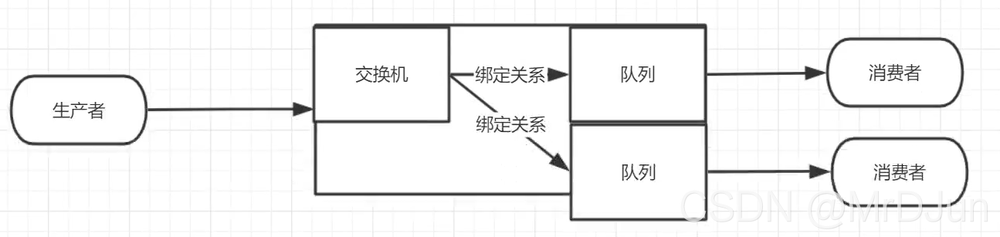
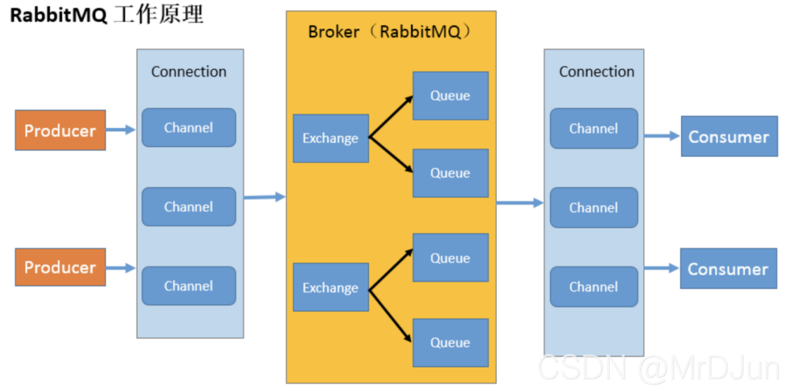

	 
     
     
     
     
     
     
     
     
     
	
<h3>
        消息中间件
    </h3>

	 
     
     
     
     
     
     
     
     
     

# 1	消息中间件基础

## 1.1	消息中间件简介

#### 消息中间件简介

消息中间件也称为消息队列（Message Queue，以下简称 MQ），消息队列是跨进程（应用程序和应用程序之间）的通信机制。MQ 本质上是个队列（FIFO 先入先出），队列中存放的内容是消息内容。

在分布式系统中，MQ 是关注于数据的发送和接收的一个子系统。利用高效可靠的异步消息传递机制对分布式系统中的其余各个子系统进行集成。在分布式项目中，可以通过消息中间件将一些无需即时返回且耗时的操作提取出来，进行 **异步处理**，而这种异步处理的方式大大的节省了服务器的请求响应时间，从而 **提高了系统的吞吐量**。

总之，消息中间件不生产消息，只是消息的搬运工。

 

#### MQ 的三个重要属性

1. **高效**：对于消息的处理处理速度快。
2. **可靠**：一般消息中间件都会有消息持久化机制和其他的机制确保消息不丢失。
3. **异步**：指发送完一个请求，不需要等待返回，随时可以再发送下一个请求，既不需要等待。 

 

#### MQ 的主要作用

1. **任务异步处理**：将不需要同步处理且耗时长的操作，交由消息队列通知消息接收方，进行异步处理。提高应用程序的响应时间。
2. **应用解耦**：MQ 相当于一个中介，生产方通过 MQ 与消费方交互，它将应用程序进行解耦合。
3. **削峰填谷**：在高并发大流量场景下，请求接收速度超过服务器的处理速度。这时可以通过消息中间件保存请求，保证系统在不被冲溃的前提下，请求不至于丢失（当然，这可能会造成部分请求的响应过慢甚至超时）。

 

#### MQ 的实际应用场景

1. **日志处理**：日志分析是大规模分布式系统不可避免的一个环节，用于快速定位系统问题，高效运维，实现高可靠的系统。一般来说，日志分布在若干台机器上，借助于消息中间件，收集多台机器上的日志数据，统一到日志分析平台作处理
2. **分布式事务**：分布式事务往往由多个参与者和一个协调者组成，它们之间通过 MQ 进行通信。
3. **分布式锁**：可以通过消息中间件请求分布式锁。
4. **商品秒杀**。

 

#### 消息中间件的基本流程

在 MQ 领域中，producer 将 msg 发送到 queue，然后 consumer 通过消费 queue，完成 producer 和 consumer 之间的解耦。

 

---

 
     
     
     
     
     
     
     
     
     

## 1.2	消息队列的底层实现方式

#### AMQP 和 JMS 是什么？

简单的说，AMQP 和 JMS 是实现消息队列的两种主流方式。

 

#### AMQP 简介

AMQP （Advanced Message Queuing Protocol，高级消息队列协议）是一种协议，更准确的说是一种 binary wire-level protocol（链接协议）。这是其和 JMS 的本质差别，AMQP 不从 API 层进行限定，而是直接定义网络交换的数据格式。

 

#### JMS 简介

JMS（Java Message Service，Java 消息服务）是一组 Java 应用程序接口（Java API），用于在两个应用程序之间（或分布式系统中）创建、发送、接收、读取消息，进行异步通信。

 

#### AMQP 与 JMS 区别

1. JMS 是定义了统一的接口，来对消息操作进行统一；AMQP 是通过规定协议来统一数据交互的格式；
2. JMS 限定了必须使用 Java 语言；AMQP 只是协议，不规定实现方式，因此是跨语言的；
3. JMS 规定了两种消息模式；而 AMQP 的消息模式更加丰富。

 

---

 
     
     
     
     
     
     
     
     
     

## 1.3	四种常用的消息中间件

#### 四大常用消息中间件

|            | ActiveMQ                                                     | RabbitMQ                                                     | RocketMQ                                                     | Kafka                                                        |
| ---------- | ------------------------------------------------------------ | ------------------------------------------------------------ | ------------------------------------------------------------ | ------------------------------------------------------------ |
| 公司/社区  | Apache                                                       | Rabbit                                                       | 阿里巴巴                                                     | Apache                                                       |
| 开发语言   | Java                                                         | Erlang                                                       | Java                                                         | Scala&Java                                                   |
| 多语言支持 | 支持                                                         | 支持                                                         | 相对较少[^1.3-1]                                             | 支持                                                         |
| 社区活跃度 | 高                                                           | 高                                                           | 中                                                           | 高                                                           |
| 协议支持   | AMQP、OpenWire、STOMP、REST、XMP                             | AMQP、XMPP、SMTP、STOMP                                      | 自定义协议                                                   | 自定义协议                                                   |
| 可用性     | 一般                                                         | **高**                                                       | **高**                                                       | **高**                                                       |
| 单机吞吐量 | 差                                                           | 一般                                                         | **高**                                                       | **非常高**                                                   |
| 消息延迟   | 毫秒级                                                       | **微秒级**                                                   | 毫秒级                                                       | 毫秒以内                                                     |
| 消息可靠性 | 一般                                                         | 高                                                           | 高                                                           | 一般                                                         |
| 优点       | 1. 成熟，已经在很多公司得到应用。2. 较多的文档。3. 各种协议支持较好，有多个语言的成熟客户端。 | 1. 性能较好。2. 管理界面较丰富。3. 在互联网公司也有较大规模应用。4. 有多个语言的成熟客户端。 | 1. 模型简单，接口易用。2. 在阿里有大规模应用。3. 在分布式系统中性能优秀。4. 版本更新很快。 | 1.综合性能最高。2. 为分布式而生，常见于大数据领域。          |
| 缺点       | 1. 性能较弱。2. 缺乏大规模吞吐的场景的应用。3. 发展前景差。  | 1. 内部机制很难了解，导致难以定制和掌控。2. 集群不支持动态扩展。 | 1. 文档少。2. 支持的语言较少                                 | 1. 运维难度大。2. 偶尔有数据混乱的情况。3. 对 ZooKeeeper 强依赖。4. 多副本机制下对带宽有一定的要求。 |

 

---

[^1.3-1]: 暂时只支持 Java、C++、.NET、Go、Python、Nodejs、PHP。

 
     
     
     
     
     
     
     
     
     

# 2	ActiveMQ

## 2.1	ActiveMQ 概述

#### ActiveMQ 简介

ActiveMQ 是 Apache 出品的一款开源消息中间件，旨在为应用程序提供高效、可扩展、稳定、安全的企业级消息通信。

 

#### 主要特性

1. **多语言支持**：支持 Java、C、C++、C#、Ruby、Perl、Python、PHP 等多种语言；
2. **支持多种通信协议**：支持 OpenWire、STOMP、AMQP、MQTT 协议；
3. **REST API 接口**：ActiveMQ 提供了技术和语言中立的 REST API 接口。
4. **适合 Java 开发**：完全支持 JMS 1.1 和 J2EE 1.4 规范 (包括持久化、分布式事务消息、事务)，支持 Spring 框架，ActiveMQ 可以通过 Spring 的配置文件方式很容易嵌入 Spring 应用中；
5. **连接方式多样化**：ActiveMQ 提供了 **多种连接方式**，例如 in-VM、TCP、SSL、NIO、UDP、多播、JGroups、JXTA。
6. **支持消息持久化**：支持通过使用 JDBC 和 Journal 实现消息的快速持久化。
7. **支持 AJAX 方式调用**：支持以 AJAX 方式调用 ActiveMQ。
8. **适合  JMS 单元测试**：ActiveMQ 可以作为内存中的 JMS 提供者，非常适合 JMS 单元测试。
9. **其他高级特性**：还提供了 JMX 管理、主从管理、消息队列、监控消息组通信、消息优先级、延迟接收消息、虚拟接收者等高级特性。

 

#### 使用 Active MQ 时的注意事项

1. ActiveMQ 默认的配置性能偏低，需要优化配置，但是配置文件复杂；
2. ActiveMQ 本身不提供管理工具。

 

---

 
     
     
     
     
     
     
     
     
     

# 3	RabbitMQ

## 3.1	RabbitMQ 概述

#### RabbitMQ 简介

 RabbitMQ 是一个由 **Erlang语言开发** 的 **基于 AMQP 标准** 的开源框架。RabbitMQ 最初起源于金融系统，用于在分布式系统中存储转发消息，在 **易用性、扩展性、高可用性、可靠性等方面表现不俗**。

但是由于 AMQP 协议本身导致它的实现非常重量级，且为了保证消息的可靠性在吞吐量上做了取舍，从而使得与其他 MQ (比如 Kafka) 对比其吞吐量处于下风。

 

#### 主要特性

1. **多语言支持**
2. **支持多种协议**：除支持 AMQP 协议之外，还可以通过插件的方式支持其他消息队列协议，如 STOMP、MQTT；
3. **灵活的路由**：RabbitMQ 提供了比较灵活的消息路由策略；
4. **支持消息集群**
5. **提供跟踪机制**
6. **提供管理界面**
7. **提供插件机制**：RabbitMQ 提供了许多插件，用户也可以编写自己的插件。

 

#### RabbitMQ 四大核心概念

1. **Producer**：消息生产者，即产生数据发送消息的程序。
2. **Exchange**：消息交换机，它指定消息按什么规则，路由到哪个队列。交换机是 RabbitMQ 非常重要的一个部件，一方面它接收来自生产者的消息，另一方面它将消息推送到队列中。交换机必须确切知道如何处理它接收到的消息，是将这些消息推送到特定队列还是推送到多个队列，亦或者是把消息丢弃，这由交换机的类型决定。
3. **Queue**：队列是 RabbitMQ 内部使用的一种数据结构，尽管消息流经 RabbitMQ 和应用程序，但它们只能存储在队列中。队列仅受主机的内存和磁盘限制的约束，本质上是一个大的消息缓冲区。许多生产者可以将消息发送到一个队列，许多消费者可以尝试从一个队列接收数据。
4. **Consumer**：消息消费者[^3.1-1]，消费者大多时候是一个等待接收消息的程序。

请注意生产者、消费者和消息中间件很多时候并不在同一机器上。同一个应用程序可以既是生产者又是消费者。

###### 四大核心的相互关联

 

#### RoutingKey 

服务器发送消息不会直接发送到队列中（Queue），而是直接发送给交换机（Exchange），Exchange 根据确定的规则决定消息该投递到哪个队列。这些规则称为路由键 routing key。

###### RoutingKey 语法

RoutingKey 可以采用通配符，如：`*` 或 `#`。

RoutingKey 在命名时采用 `.` 分隔多个词。

 

#### RabbitMQ 的工作原理

1. **Broker**：接收和分发消息的应用，RabbitMQ Server 就是 Message Broker。
2. **Virtual host**：虚拟主机，出于多租户和安全因素设计的，把 AMQP 的基本组件划分到一个虚拟的分组中，类似于 namespace 概念。当多个不同的用户使用同一个 RabbitMQserver 提供的服务时，可以划分出多个 vhost，每个用户在自己的 vhost 创建 exchange／queue 等。
3. **Connection**：publisher/consumer 和 broker 之间的 TCP 连接；
4. **Channel**：如果每一次访问 RabbitMQ 都建立一个 Connection，在消息量大的时候建立 TCP Connection 的开销将是巨大的，效率也较低。Channel 是在 connection 内部建立的逻辑连接，如果应用程序支持多线程，通常每个 thread 创建单独的 channel 进行通讯，AMQP method 包含了 channel id 帮助客户端和 message broker 识别 channel，所以 channel 之间是完全隔离的。Channel 作为轻量级的 Connection 极大减少了操作系统建立 TCP connection 的开销。
5. **Exchange**：message 到达 broker 的第一站，根据分发规则，匹配查询表中的 routing key，分发消息到 queue 中去。
6. **Queue**：消息最终被送到这里等待 consumer 取走。
7. **Binding**：exchange 和 queue 之间的虚拟连接，binding 中可以包含 routing key，Binding 信息被保存到 exchange中 的查询表中，用于 message 的分发依据。

 

#### RabbitMQ 的五种 Exchange

###### 默认 Exchange

如果用空字符串去声明一个 Exchange，那么系统就会使用 ”amq.direct” 这个 Exchange。我们创建一个 queue 时，默认会有一个和新建 queue 同名的 routingKey 绑定到这个默认的 exchange 上去。

###### Direct Exchange

直接匹配，通过 Exchange 名称 + RountingKey 来发送与接收消息。

###### Fanout Exchange

广播订阅，向所有的消费者发布消息，但是只有消费者将队列绑定到该路由器才能收到消息，忽略 Routing Key。

###### Topic Exchange

主题匹配订阅，这里的主题指的是 RoutingKey。

###### Headers Exchange

消息头订阅，消息发布前，为消息定义一个或多个键值对的消息头，然后消费者接收消息同时需要定义类似的键值对请求头：（如：x-mactch=all 或者 x_match=any），只有请求头与消息头匹配，才能接收消息，忽略 RoutingKey。

 

---

[^3.1-1]: 消费与接收在消息中间件中具有相似的含义。

 
     
     
     
     
     
     
     
     
     

## 3.2	RabbitMQ 的消息确认机制

#### RabbitMQ 的两种消息确认

1. **对生产端发送消息的确认**：用于确认生产者将消息发送给交换器，交换器传递给队列的过程中，消息是否成功投递。发送确认分为两步，一是确认是否到达交换器，二是确认是否到达队列。
2. **对消费端消费消息的确认**：确认消费者是否成功消费了队列中的消息。

 

#### 对生产端发送消息的确认机制

rabbitmq 对生产端发送消息的确认分为事务和实现 confirm 机制。不过一般不使用事务，性能消耗太大。

###### confirm 机制

参见：https://www.cnblogs.com/alan6/p/11483419.html

 

#### 对消费端消费消息的确认机制

为了保证消息能可靠到达消费端，RabbitMQ 也提供了消费端的消息确认机制。

消费者在声明队列时，可以指定 noAck 参数，当 noAck=false 时，RabbitMQ 会等待消费者显式发回 ack 信号后才从内存（和磁盘，如果是持久化消息的话）中移去消息。否则，RabbitMQ 会在队列中消息被消费后立即删除它。

采用消息确认机制后，只要令 noAck=false，消费者就有足够的时间处理消息(任务)，不用担心处理消息过程中消费者进程挂掉后消息丢失的问题，因为 RabbitMQ 会一直持有消息直到消费者显式调用 basicAc k为止。

 

#### 消息端消息的三种确认方式

1. 自动确认（默认）
2. 手动确认
3. 不确认

 

#### 消息端消息手动确认详述（❗日后再补充，参考资料见附录）

 

---

 
     
     
     
     
     
     
     
     
     

## 3.3	RabbitMQ 事务消息的原理

#### 发送方事务

开启事务后，发送多条数据，事务提交或回滚是原子的，要么都提交，要么都回滚。

 

#### 消费方事务

rabbitmq 的消费行为会触发 queue 中 msg 的是否删除、是否重新放回队列等行为。所以，此时消费方的 ack 必须手动提交的，且最终确认以事务的提交和回滚决定。

 

---

 
     
     
     
     
     
     
     
     
     

## 3.4	RabbitMQ 的延时队列实现

#### 死信队列

队列中的消息被拒绝、或过期后就成为了死信。死信可以被重新发布到另一个交换器，也就是 DLX（Dead Letter Exchange，死信交换器），与 DLX 绑定的队列称为死信队列。

###### 造成死信的原因

1. 信息被拒绝
2. 信息超时
3. 超过了队列的最大长度

 

#### 延迟队列

延迟队列是用于存储延迟消息的队列。延迟消息指 **发布后并不立即投递给消费者，而是在指定时间投递的消息**。

###### rabbitMq 中的延迟队列实现

**rabbitMq 没有直接支持延迟队列，但可以通过死信队列和消息过期机制实现**。

在死信队列中，可以为普通交换器绑定多个消息队列，假设绑定过期时间为 5 分钟，10 分钟和 30 分钟，3 个消息队列，然后为每个消息队列设置 DLX，为每个DLX 关联一个死信队列。

当消息过期之后，被转存到对应的死信队列中，然后投递给指定的消费者消费。

###### 📌EXTRA rabbitmq 如何设置消息的过期时间

在 rabbitmq 中可以通过两种方式设置消息的过期时间：

1. **队列设置**：在队列申明的时候使用 x-message-ttl 参数（单位毫秒）设置过期时间。设置后，该队列中所有的消息都存在相同的过期时间。
2. **单个消息设置**：设置消息属性的 expiration 参数（单位毫秒）的值，每条消息的过期时间都是独立的。

 

---

 
     
     
     
     
     
     
     
     
     

# 4	RocketMQ

## 4.1	RocketMQ 概述

#### 什么是 RocketMQ

RocketMQ 是阿里巴巴于 2012 年开源的分布式消息中间件，后来捐赠给 Apache 软件基金会，并于 2017 年 9 月 25 日成为 Apache 的顶级项目。在阿里集团被广泛应用于交易、充值、流计算、促销秒杀活动、消息推送、日志流式处理、binglog 分发等场景，相同环境下，吞吐量在11.6w/s。

RocketMQ 使用 Java 语言开发，具有高吞吐量、高可用性、适合大规模分布式系统应用的特点。RocketMQ 思路起源于Kafka，但并不是 Kafka 的一个Copy，它对消息的可靠传输及事务性做了优化。

 

#### 主要特性

1. **具有灵活的可扩展性**：RocketMQ 天然支持集群，其核心四大组件（NameServer、Broker、Producer、Consumer）的每一个都可以在没有单点故障的情况下进行水平扩展。
2. **具有海量消息堆积能力**。 RocketMQ 采用零拷贝原理实现了超大量消息的堆积能力，据说单机已经可以支持亿级消息堆积，而且在堆积了这么多消息后依然保持写入低延迟。
3. **支持顺序消息**：RocketMQ 可以保证消息消费者按照消息发送的顺序对消息进行消费。
4. **支持多种消息过滤方式**：消息过滤分为 **在服务器端过滤** 和 **在消费端过滤**。在服务器端过滤时可以按照消息消费者的要求进行过滤，优点是减少了不必要的消息传输，缺点是增加了消息服务器的负担，实现相对复杂。消费端过滤则完全由具体应用自定义实现，这种方式更加灵活，缺点是很多无用的消息会被传输给消息消费者。
5. **支持事务消息**：RocketMQ 除支持普通消息、顺序消息之外，还支持事务消息，这个特性对于分布式事务来说提供了另一种解决思路。
6. **支持回溯消费**：回溯消费是指对于消费者已经消费成功的消息，由于业务需求需要重新消费。RocketMQ 支持按照时间回溯消费，时间维度精确到毫秒，可以向前回溯，也可以向后回溯。

 

---

[^4.1-1]: 顺序消息分为全局有序消息和局部有序消息，一般推荐使用局部有序消息，即生产者通过将某一类消息按顺序发送至同一个队列中来实现。

 
     
     
     
     
     
     
     
     
     

# 5	kafka 

## 5.1	kafka 概述

##### KAFKA 简介

Kafka 最早是由 LinkedIn 开发的分布式发布/订阅消息系统，后来成为 Apache 的顶级项目。

Kafka主要特点是基于 Pull 的模式来处理消息消费，追求高吞吐量，一开始的目的就是用于日志收集和传输。0.8 版本开始支持复制，不支持事务，对消息的重复、丢失、错误没有严格要求，适合产生大量数据的互联网服务的数据收集业务。相同环境下，Kafka 的吞吐量高达 17.3w/s。

 

#### 主要特性

1. **消息持久化**：以时间复杂度为 O(1) 的方式提供消息持久化能力，即使对 TB 级以上的数据也能保证常数时间复杂度的访问性能。
2. **高吞吐**：在廉价的商用机器上也能支持单机每秒 10 万条以上的吞吐量。
3. **分布式**：支持消息分区以及分布式消费，并保证分区内的消息顺序。
4. **跨平台**：支持不同技术平台的客户端（如 Java、PHP、Python 等）。
5. **实时性**：支持实时数据处理和离线数据处理。
6. **伸缩性**：支持水平扩展。

 

---

 
     
     
     
     
     
     
     
     
     

## 5.2	kafka 的架构设计

##### 核心概念

###### broker

Kafka 集群包含一个或多个服务器，服务器节点称为 broker：

1. broker 存储 topic 的数据。如果某 topic 有 N 个 partition，集群有 N 个 broker，那么每个 broker 存储该 topic 的一个 partition。
2. 如果某 topic 有 N 个 partition，集群有 (N+M) 个broker，那么其中有 N 个broker存储该topic的一个partition，剩下的M个broker不存储该topic的partition数据。
3. 如果某 topic 有 N 个 partition，集群中 broker 数目少于N个，那么一个 broker 存储该topic的一个或多个partition。在实际生产环境中，尽量避免这种情况的发生，这种情况容易导致Kafka集群数据不均衡。

###### Topic

每条发布到Kafka集群的消息都有一个类别，这个类别被称为 Topic（类似于数据库的表名）。物理上不同 Topic 的消息分开存储，逻辑上一个Topic的消息虽然保存于一个或多个broker上但用户只需指定消息的Topic即可生产或消费数据而不必关心数据存于何处）

######  Partition

topic中的数据分割为一个或多个partition。每个topic至少有一个partition。每个partition中的数据使用多个segment文件存储。partition中的数据是有序的，不同partition间的数据丢失了数据的顺序。如果topic有多个partition，消费数据时就不能保证数据的顺序。在需要严格保证消息的消费顺序的场景下，需要将partition数目设为1。

###### Leader

每个partition有多个副本，其中有且仅有一个作为Leader，Leader是当前负责数据的读写的partition。

###### Follower

Follower跟随Leader，所有写请求都通过Leader路由，数据变更会广播给所有Follower，Follower与Leader保持数据同步。如果Leader失效，则从Follower中选举出一个新的Leader。当Follower与Leader挂掉、卡住或者同步太慢，leader会把这个follower从“in sync replicas”（ISR）列表中删除，重新创建一个Follower。

###### Producer

生产者即数据的发布者，该角色将消息发布到Kafka的topic中。broker接收到生产者发送的消息后，broker将该消息追加到当前用于追加数据的segment文件中。生产者发送的消息，存储到一个partition中，生产者也可以指定数据存储的partition。

###### Consumer

消费者可以从broker中读取数据。消费者可以消费多个topic中的数据。

###### Consumer Group

每个Consumer属于一个特定的Consumer Group（可为每个Consumer指定group name，若不指定group name则属于默认的group）。这是kafka用来实现一个topic消息的广播（发给所有的consumer）和单播（发给任意一个consumer）的手段。一个topic可以有多个CG。topic的消息会复制-给consumer。如果需要实现广播，只要每个consumer有一个独立的CG就可以了。要实现单播只要所有的consumer在同一个CG。用CG还可以将consumer进行自由的分组而不需要多次发送消息到不同的topic。

###### Offset

kafka的存储文件都是按照 offset.kafka 来命名，用 offset 做名字的好处是方便查找。例如你想找位于2049的位置，只要找到2048.kafka的文件即可。当然the first offset就是00000000000.kafka

 

---

 
     
     
     
     
     
     
     
     
     

## 5.3	Kafka 消息丢失的场景有哪些

##### Kafka 消息丢失的三种场景

1. 生产者在生产过程中的消息丢失；
2. broker 在故障后的消息丢失；
3. 消费者在消费过程中的消息丢失；

 

##### Kafka 的 ACK 机制

ack 有 3 个可选值，分别是1，0，-1：

1. ack=0：生产者在生产过程中的消息丢失，简单来说就是，producer发送一次就不再发送了，不管是否发送成功。

2. ack=1：broker在故障后的消息丢失，简单来说就是，producer只要收到一个分区副本成功写入的通知就认为推送消息成功了。这里有一个地方需要注意，这个副本必须是leader副本。只有leader副本成功写入了，producer才会认为消息发送成功。

   注意，ack 的默认值就是1。这个默认值其实就是吞吐量与可靠性的一个折中方案。生产上我们可以根据实际情况进行调整，比如如果你要追求高吞吐量，那么就要放弃可靠性。

3. ack=-1：生产侧和存储侧不会丢失数据，简单来说就是，producer 只有收到分区内所有副本的成功写入的通知才认为推送消息成功了。

 

##### Offset机制

kafka 消费者的三种消费语义：

1. at-most-once：最多一次，可能丢数据
2. at-least-once：最少一次，可能重复消费数据
3. exact-once message：精确一次

 

---

 
     
     
     
     
     
     
     
     
     

## 3.3	kafka customer 的消息获取方式

#### 消费者的获取消息的两种方式

1. push 方式：brokers 将消息推送到 consumer，customer 被动接收消息。
2. pull 方式：customer 主动从 brokes 拉取消息。

 

#### push 模式的缺点

一些消息系统比如 Scribe 和 Apache Flume 采用了 push 模式，将消息推送到下游的 consumer，这么做的好处是可以由 broker 决定消息推送的速率。

在 push 模式下，必须在不知道下游 consumer 消费能力和消费策略的情况下决定是立即推送每条消息还是缓存之后批量推送，但是，一般消息系统都致力于让 consumer 以最大的速率最快速的消费消息。这导致以下问题：

1. 当 broker 推送的速率远大于 consumer 消费的速率时，consumer 恐怕就要崩溃了。
2. 如果为了避免 consumer 崩溃而采用较低的推送速率，将可能导致一次只推送较少的消息而造成浪费。

 

#### Kafka 选择了 pull 模式 

因为上述缺点，最终 Kafka 还是选取了传统的 pull 模式。即 producer 将消息推送到 broker，consumer 从 broker 拉取消息。

Pull 模式下，consumer 可以根据自己的消费能力去决定消费策略。Pull 模式的另外一个好处是 consumer 可以自主决定是否批量的从 broker 拉取数据。

###### Pull 模式的缺点和 Kafka 的解决方案

如果 broker 没有可供消费的消息，将导致 consumer 不断在循环中轮询，直到新消息到达。

为了避免这点，Kafka 提供了一个参数，可以让 consumer 阻塞直到新消息到达（当然也可以保持阻塞，直到消息的数量达到某个特定的量，以实现批量拉取）。

 

---

 
     
     
     
     
     
     
     
     
     

## 3.4	Kafka 中 zk 的作用是什么

#### Kafka 中 zk 的作用

1. kafka 中使用了 zookeeper 的分布式锁、分布式配置及统一命名的分布式协调解决方案。
2. 在 kafka 的 broker 集群中的 controller 的选择，是通过 zk 的临时节点争抢获得的。
3. 自增模式的 brokerID 是通过 zk 的节点 version 实现全局唯一的；
4. kafka 中 broker 的状态数据存储在 zk 中，不过要注意，zk不 是数据库，所以存储的是元数据。
5. 过去的版本中，Kafka 的 offset 也存储在 zk 中，但是后续版本已将 offset 从 zk 中移除

 

---

 
     
     
     
     
     
     
     
     
     

## 3.5	Kafka 如何保障高性能

#### Kafka 保障高性能的手段

1. **I/O**：I/O 是性能最大的瓶颈，为了提升 I/O 速度，broker 在持久化数据的时候已经最大努力的使用了 **磁盘的顺序读写**，并采用了 **零拷贝**[^3.5-1]
2. **在性能和可靠性之间进行了取舍**：和大多数分布式系统一样，总要做 tradeoff，在速度与可用性/可靠性中挣扎。ACK 的 0，1，-1 级别就是在性能和可靠间进行权衡。

 

---

[^3.5-1]: ，零拷贝也就是从磁盘日志到消费者客户端的数据传递，因为kafka是mq，对于msg不具备加工处理，所以得以实现

 
     
     
     
     
     
     
     
     
     

## 3.6	kafka 的 rebalance 机制是什么

#### 消费者分区分配策略

1. Range 范围分区(默认的)

2. RoundRobin 轮询分区

3. Sticky 策略

 

#### 触发 Rebalance 的时机

Rebalance 的触发条件有 3 个：

1. 组成员个数发生变化。例如有新的 consumer 实例加入该消费组或者离开组。
2. 订阅的 Topic 个数发生变化。
3. 订阅 Topic 的分区数发生变化。

 

#### Coordinator 协调过程

1. 消费者如何发现协调者

2. 消费者如何确定分配策略

3. 如果需要再均衡分配策略的影响

 

---

 
     
     
     
     
     
     
     
     
     

# 附录

##### 参考资料

- 主要参考资料——[2022年最新【Java经典面试题300问】面试必备，查漏补缺；多线程+spring+JVM调优+分布式+redis+算法](https://www.bilibili.com/video/BV15v4y1T7fz?p=80&spm_id_from=pageDriver&vd_source=87ed5edcdc8042ca0c34ee5bbeeda7b3) 发布于 2022/06/29
- [1.1	消息中间件简介](#1.1	消息中间件简介)——[什么是消息中间件](https://juejin.cn/post/6952509198722662407) 发布于 2021/04/18；
- [1.1	消息中间件简介](#1.1	消息中间件简介)——[消息中间件的相关概念以及如何选型](https://blog.csdn.net/qq_42697508/article/details/123628491) 发布于 2022/03/28 最后修改于 2022/08/26；
- [1.2	消息队列的底层实现方式](#1.2	消息队列的底层实现方式)——[什么是消息中间件](https://juejin.cn/post/6952509198722662407) 发布于 2021/04/18；
- [1.3	四种常用的消息中间件](#1.3	四种常用的消息中间件)——[消息中间件的相关概念以及如何选型](https://blog.csdn.net/qq_42697508/article/details/123628491) 发布于 2022/03/28 最后修改于 2022/08/26；
- [1.3	四种常用的消息中间件](#1.3	四种常用的消息中间件)——[四种常用消息中间件比较分析(RabbitMQ、ActiveMQ、Kafka、RocketMQ)](https://www.cnblogs.com/JonaLin/p/12673779.html) 发布于 2020/04/10；
- [2.1	ActiveMQ 概述](#2.1	ActiveMQ 概述)——[四种常用消息中间件比较分析(RabbitMQ、ActiveMQ、Kafka、RocketMQ)](https://www.cnblogs.com/JonaLin/p/12673779.html) 发布于 2020/04/10；
- [3.1	RabbitMQ 概述](#3.1	RabbitMQ 概述)——[消息中间件 - RabbitMQ 四大核心概念](https://blog.csdn.net/qq_41647999/article/details/119900542) 发布于 2021/08/24；
- [3.1	RabbitMQ 概述](#3.1	RabbitMQ 概述)——[四种常用消息中间件比较分析(RabbitMQ、ActiveMQ、Kafka、RocketMQ)](https://www.cnblogs.com/JonaLin/p/12673779.html) 发布于 2020/04/10；
- [3.2	RabbitMQ 的消息确认机制](#3.2	RabbitMQ 的消息确认机制)——[RabbitMQ的消息确认机制](https://www.cnblogs.com/alan6/p/11516773.html) 发布于 2019/09/13；
- [4.1	RocketMQ 概述](#4.1	RocketMQ 概述)——[四种常用消息中间件比较分析(RabbitMQ、ActiveMQ、Kafka、RocketMQ)](https://www.cnblogs.com/JonaLin/p/12673779.html) 发布于 2020/04/10；

 

