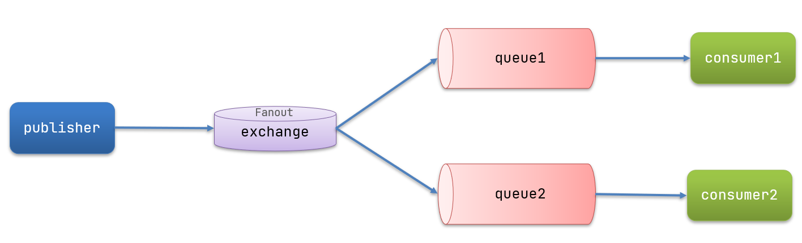

# 2	RabbitMQ

## 2.1	RabbitMQ 概述

##### RabbitMQ 简介

RabbitMQ 是实现了高级消息队列协议（AMQP）的开源消息代理软件（亦称面向消息的中间件）。RabbitMQ 服务器是用 Erlang 语言编写的，而群集和故障转移是构建在开放电信平台框架上的。所有主要的编程语言均有与代理接口通讯的客户端库。

<br>

#####   官方网站

https://www.rabbitmq.com/

<br>

##### RabbitMQ 的基本结构


<br>

##### RabbitMQ 中的一些角色

- publisher：生产者
- consumer：消费者
- exchange个：交换机，负责消息路由
- queue：队列，存储消息
- virtualHost：虚拟主机，隔离不同租户的exchange、queue、消息的隔离

<br>

----

<div STYLE="page-break-after: always;">
    <br>
    <br>
    <br>
    <br>
    <br></div>
## 2.2	安装 RabbitMQ

### 2.2.1	单机部署

##### 使用 Docker 安装

1. 拉取镜像

```
docker pull rabbitmq:3-management
```

2. 执行下面的命令来运行MQ容器

```shell
docker run \
 -e RABBITMQ_DEFAULT_USER=itcast \
 -e RABBITMQ_DEFAULT_PASS=123321 \
 --name mq \
 --hostname mq1 \
 -p 15672:15672 \
 -p 5672:5672 \
 -d \
 rabbitmq:3-management
```

<br>

---

<div STYLE="page-break-after: always;">
    <br>
    <br>
    <br>
    <br>
    <br></div>

### 2.2.2	集群部署

##### 集群分类

在 RabbitMQ 的官方文档中，讲述了两种集群的配置方式：

- **普通模式**：普通模式集群不进行数据同步，每个MQ都有自己的队列、数据信息（其它元数据信息如交换机等会同步）。例如我们有2个MQ：mq1，和mq2，如果你的消息在mq1，而你连接到了mq2，那么mq2会去mq1拉取消息，然后返回给你。如果mq1宕机，消息就会丢失。
- **镜像模式**：与普通模式不同，队列会在各个mq的镜像节点之间同步，因此你连接到任何一个镜像节点，均可获取到消息。而且如果一个节点宕机，并不会导致数据丢失。不过，这种方式增加了数据同步的带宽消耗。

<br>

##### 部署普通模式集群


----

<div STYLE="page-break-after: always;">
    <br>
    <br>
    <br>
    <br>
    <br></div>

## 2.3	RabbitMQ 消息模型

##### RabbitMQ 的五种消息模型

- 基本消息队列（BasicQueue）
- 工作消息队列（WorkQueue）
- 广播 Fanout Exchange
- 路由 Direct Exchange
- 主题 Topic Exchange

<br>

##### 基本消息队列


###### 基本消息队列的消息发送流程

1. 建立 connection

2. 创建 channel

3. 利用 channel 声明队列

4. 利用 channel 向队列发送消息

###### 基本消息队列的消息接收流程

1. 建立 connection

2. 创建 channel

3. 利用 channel 声明队列

4. 定义 consumer 的消费行为 handleDelivery()

5. 利用 channel 将消费者与队列绑定

<br>

##### 工作消息队列

Work queues，也被称为（Task queues），任务模型。简单来说就是 **让多个消费者绑定到一个队列，共同消费队列中的消息，同一条消息只会被一个消费者处理。**。


###### 适用场景

当消息处理比较耗时的时候，可能生产消息的速度会远远大于消息的消费速度。长此以往，消息就会堆积越来越多，无法及时处理。此时就可以使用 work 模型，多个消费者共同处理消息处理，速度就能大大提高了。

<br>

##### 发布/订阅

发布订阅的模型如图：


可以看到，在订阅模型中，多了一个 exchange 角色，而且过程略有变化：

- **Publisher**：生产者，也就是要发送消息的程序，但是不再发送到队列中，而是发给X（交换机）
- **Exchange**：交换机，图中的X。一方面，接收生产者发送的消息。另一方面，知道如何处理消息，例如递交给某个特别队列、递交给所有队列、或是将消息丢弃。到底如何操作，取决于Exchange的类型。Exchange 有以下3种类型：
  - Fanout：广播，将消息交给所有绑定到交换机的队列
  - Direct：定向，把消息交给符合指定routing key 的队列
  - Topic：通配符，把消息交给符合routing pattern（路由模式） 的队列
- **Consumer**：消费者，与以前一样，订阅队列，没有变化
- **Queue**：消息队列也与以前一样，接收消息、缓存消息。

###### 📌Exchange（交换机）只负责转发消息，不具备存储消息的能力

**Exchange（交换机）只负责转发消息，不具备存储消息的能力**，因此如果没有任何队列与 Exchange 绑定，或者没有符合路由规则的队列，那么消息会丢失

<br>

##### Fanout 

Fanout，意味扇出，在 MQ 中叫广播更合适。



###### 消息发送流程

1. 可以设置多个队列，每个队列都要绑定到 Exchange（交换机）
2. 生产者发送的消息，只能发送到交换机，交换机来决定要发给哪个队列，生产者无法决定
3.  交换机把消息发送给绑定过的所有队列
4. 订阅队列的消费者都能拿到消息

<br>

##### Direct

在 Fanout 模式中，一条消息，会被所有订阅的队列都消费。但是，在某些场景下，我们希望不同的消息被不同的队列消费。这时就要用到 Direct 类型的 Exchange。


###### 消息发送流程

 在 Direct 模型下：

1. 队列与交换机的绑定，不能是任意绑定了，而是要指定一个`RoutingKey`（路由key）
2. 消息的发送方在 向 Exchange发送消息时，也必须指定消息的 `RoutingKey`。
3. Exchange不再把消息交给每一个绑定的队列，而是根据消息的`Routing Key`进行判断，只有队列的`Routingkey`与消息的 `Routing key`完全一致，才会接收到消息

###### Direct交换机与Fanout交换机的差异？

- Fanout 交换机将消息路由给每一个与之绑定的队列
- Direct 交换机根据 RoutingKey 判断路由给哪个队列
- 如果多个队列具有相同的 RoutingKey，则与 Fanout 功能类似

<br>

##### Topic

`Topic` 类型的 `Exchange` 与 `Direct` 相比，都可以根据 `RoutingKey` 把消息路由到不同的队列。只不过 `Topic` 类型`Exchange`可以 **让队列在绑定 `Routing key`  的时候使用通配符**。


- Queue1：绑定的是 `china.#` ，因此凡是以 `china.`开头的 `routing key`  都会被匹配到。包括 china.news 和 china.weather
- Queue2：绑定的是 `#.news` ，因此凡是以 `.news`结尾的 `routing key` 都会被匹配。包括 china.news 和 japan.news

###### Routingkey 语法

`Routingkey` 一般都是有一个或多个单词组成，多个单词之间以”.”分割，例如： `item.insert`

######  通配符规则

- `#`：匹配一个或多个词，例如 `item.#` 能够匹配`item.spu.insert` 或者 `item.spu`

- `*`：匹配不多不少恰好1个词，例如 `item.*`只能匹配`item.spu` 

<br>

---

<div STYLE="page-break-after: always;">
    <br>
    <br>
    <br>
    <br>
    <br></div>
