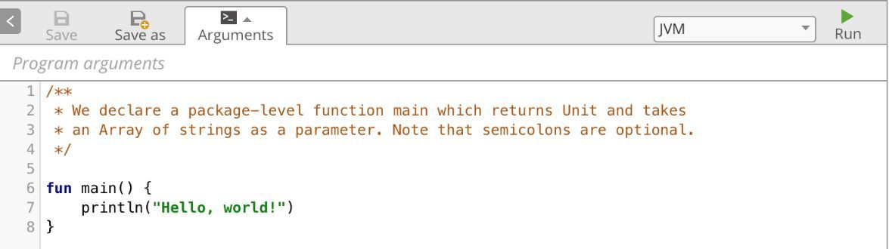
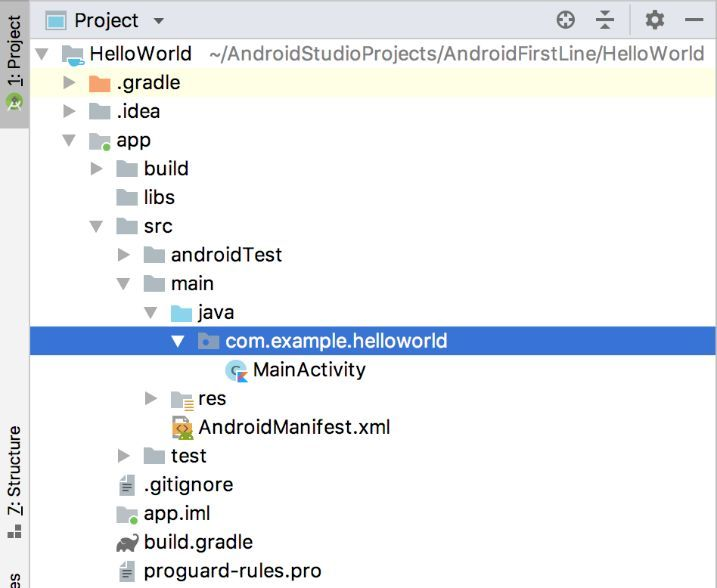
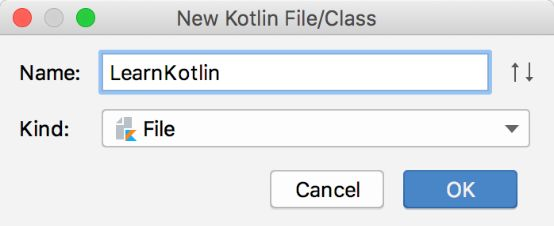
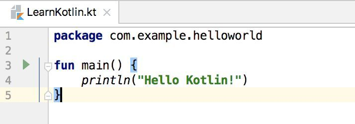
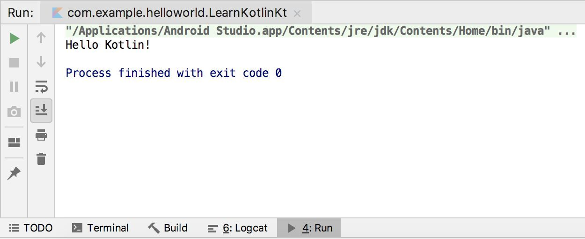

## 1	Kotlin 概述

## 1.1	简介

##### Kotlin 与 Android

Google 在 2017 年的 I/O 大会上宣布，Kotlin 正式成为 Android 的一级开发语言，和 Java 平起平坐，Android Studio 也对 Kotlin 进行了全面的支持。两年之后，Google 又在2019年的 I/O 大会上宣布，Kotlin 已经成为 Android 的第一开发语言，虽然 Java 仍然可以继续使用，但 **Google 更加推荐开发者使用 Kotlin 来编写 Android 应用程序，并且未来提供的官方 API 也将会优先考虑 Kotlin 版本**。

 

##### Android 开发现状

###### 国内

由于学习一门新语言的时间成本，再加上国内不少公司对于新技术比较保守，不敢冒然改用新语言去承担一份额外的风险，因此目前 Kotlin 在国内的普及程度并不高。

###### 国外

在海外，Kotlin 的发展速度已是势如破竹。根据统计，Google Play 商店中排名前 1000 的 App 里，有超过 60% 的 App 已使用了 Kotlin 语言，并且这个比例每年还在不断上升。Android 官网文档的代码已优先显示 Kotlin 版本，官方的视频教程以及 Google 的一些开源项目，也改用了 Kotlin 来实现。

 

##### Kotlin 的发展历程

Kotlin 并不是一门很新的语言。Kotlin 是由 JetBrains 公司开发与设计的，早在 2011 年，JetBrains 就公布了 Kotlin 的第一个版本，并在 2012 年将其开源，但在早期，它并没有受到太多的关注。

2016年，Kotlin发布了 1.0 正式版，这代表着 Kotlin 已经足够成熟和稳定了，并且 JetBrains 也在自家的旗舰 IDE 开发工具 IntelliJ IDEA 中加入了对 Kotlin 的支持，自此 Android 开发语言终于有了另外一种选择，Kotlin 逐渐受到广泛的关注。

接下来，在 2017 年 Google 宣布 Kotlin 正式成为 Android 一级开发语言，Android Studio 也加入了对 Kotlin 的支持，Kotlin 自此开始大放异彩。

 

##### Kotlin 在 JVM 平台上的运行原理

Kotlin 的编译器将 Kotlin 的代码编译成与 Java 代码被编译后同样规格的 class 文件。因为 Java 虚拟机不关心 class 文件是从 Java 编译来的，还是从 Kotlin 编译来的，只要是符合规格的 class 文件，它都能识别，所以 Kotlin 可以完美的运行在 JVM 平台上。

 

##### Kotlin 的优势

###### 语法简洁

与 Java 相比 Kotlin 的语法更加简洁，对于同样的功能，使用 Kotlin 开发的代码量可能会比使用 Java 开发的减少5 0% 甚至更多。

###### 现代语法特性

另外，Kotlin 的语法更加高级，相比于 Java 比较老旧的语法，Kotlin 增加了很多现代高级语言的语法特性，使得开发效率大大提升。

###### 安全性

还有，Kotlin 在语言安全性方面下了很多工夫，几乎杜绝了空指针这个全球崩溃率最高的异常。

###### 与 Java 代码完全兼容

Kotlin 最为重要的特性，那就是它和 Java 是100% 兼容的。**Kotlin 可以直接调用使用 Java 编写的代码，也可以无缝使用 Java 第三方的开源库。**这使得 Kotlin 在加入了诸多新特性的同时，还继承了 Java 的全部财富。

 

---

     
     
     
     
     

## 1.2	运行Kotlin代码

本章的目标是快速入门Kotlin编程，因此我只会讲解Kotlin方面的知识，整个章节都不会涉及Android开发。既然暂时和Android无关了，那么我们首先要解决的一个问题就是怎样独立运行一段Kotlin代码。

方法大概有以下3种，下面逐个进行介绍。

第一种方法是使用IntelliJ IDEA。这是JetBrains的旗舰IDE开发工具，对Kotlin支持得非常好。在IntelliJ IDEA里直接创建一个Kotlin项目，就可以独立运行Kotlin代码了。但是这种方法的缺点是你还要再下载安装一个IDE工具，有点麻烦，因此这里我们就不使用这种方法了。

第二种方法是在线运行Kotlin代码。为了方便开发者快速体验Kotlin编程，JetBrains专门提供了一个可以在线运行Kotlin代码的网站，地址是：https://try.kotlinlang.org，打开网站之后的页面如图2.1所示。

**图2.1　在线运行Kotlin的网站**

只要点击一下右上方的“Run”按钮就可以运行这段Kotlin代码了，非常简单。但是在线运行Kotlin代码有一个很大的缺点，就是使用国内的网络访问这个网站特别慢，而且经常打不开，因此为了学习的稳定性着想，我们也不准备使用这种方法。

第三种方法是使用Android Studio。遗憾的是，Android Studio作为一个专门用于开发Android应用程序的工具，只能创建Android项目，不能创建Kotlin项目。但是没有关系，我们可以随便打开一个Android项目，在里面编写一个Kotlin的`main()`函数，就可以独立运行Kotlin代码了。

这里就直接打开上一章创建的HelloWorld项目吧，首先找到MainActivity所在的位置，如图2.2所示。

**图2.2　HelloWorld项目结构**

接下来在MainActivity的同级包结构下创建一个LearnKotlin文件。右击com.example.helloworld包→New→Kotlin File/Class，在弹出的对话框中输入“LearnKotlin”，如图2.3所示。点击“OK”即可完成创建。

**图2.3　新建Kotlin文件对话框**

接下来，我们在这个LearnKotlin文件中编写一个`main()`函数，并打印一行日志，如图2.4所示。

**图2.4　一段最简单的Kotlin代码**

你会发现，`main()`函数的左边出现了一个运行标志的小箭头。现在我们只要点击一下这个小箭头，并且选择第一个Run选项，就可以运行这段Kotlin代码了。运行结果会在Android Studio下方的Run标签中显示，如图2.5所示。

**图2.5　代码的运行结果**

可以看到，这里成功打印出了Hello Kotlin!这句话，这说明我们的代码执行成功了。

可能你会问，上一章刚刚说到打印日志尽量不要使用`println()`，而是应该使用Log，为什么这里却还是使用了`println()`呢？这是因为Log是Android中提供的日志工具类，而我们现在是独立运行的Kotlin代码，和Android无关，所以自然是无法使用Log的。

这就是在Android Studio中独立运行Kotlin代码的方法，后面我们都会使用这种方法来对本章所学的内容进行运行和测试。那么接下来，就让我们正式进入Kotlin的学习吧。

---

     
     
     
     
     
