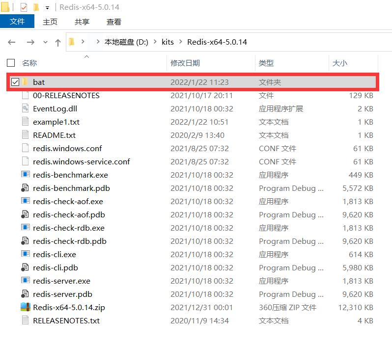
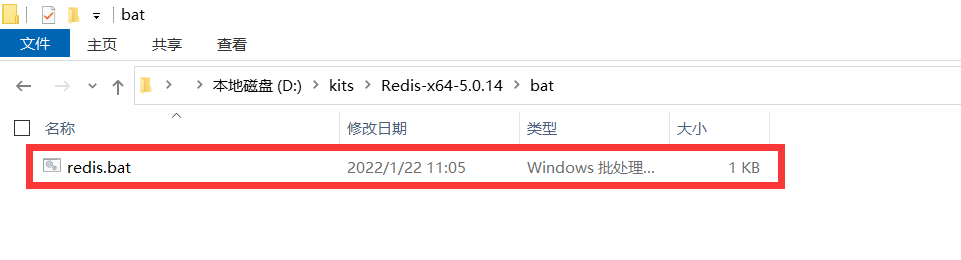
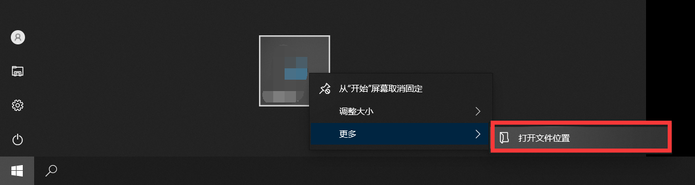
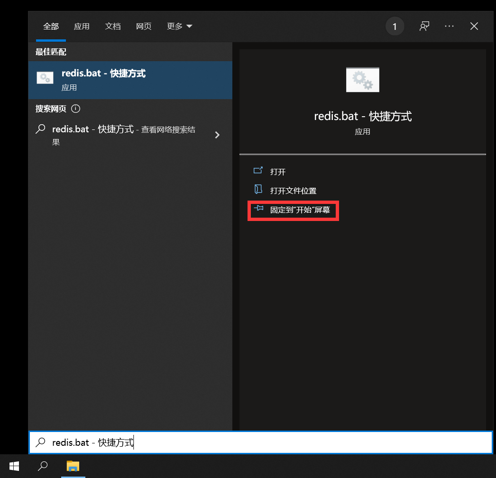

# 在 windows 开始屏幕中打开 redis 客户端

##### 步骤

###### 第一步

在 redis 根目录下创建新文件夹。



###### 第二步

在上述文件夹中创建 bat 脚本

```
@ECHO OFF
rem 返回上一级目录
cd ..
rem 登录 redis 客户端
redis-cli.exe -h 【IP 地址】 -p 6379 -a 【密码】
```



###### 第三步

创建上述 bat 脚本的快捷方式。

###### 第四步

将快捷方式放入 StartMenu/Programs 目录（右键已经固定到开始屏幕的图标，选择打开文件位置即可进入该目录）。



###### 第五步

使用 win10 搜索 bat 脚本的快捷方式。

###### 第五步

将搜索到的快捷方式固定到开始屏幕。



<br>

----

<div STYLE="page-break-after: always;">
    <br>
	<br>
	<br>
	<br>
	<br>
</div>
