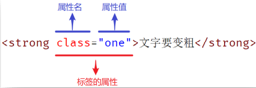
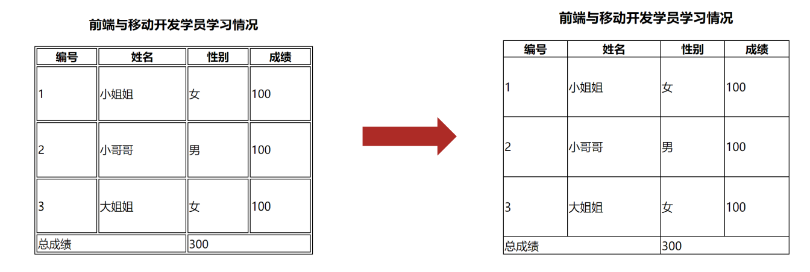
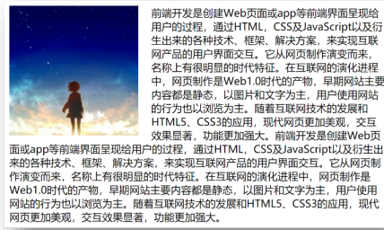
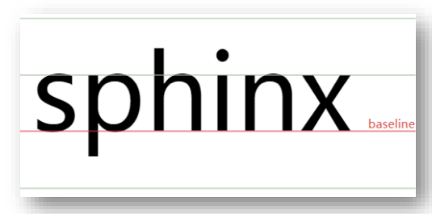
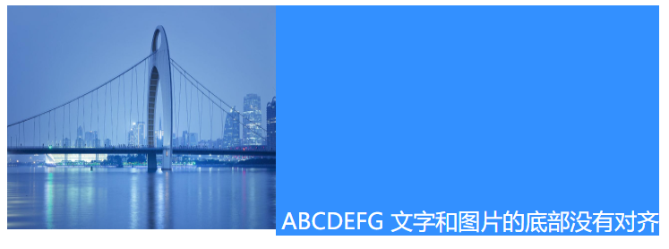

<div STYLE="page-break-after: always;">
	<br>
    <br>
    <br>
    <br>
    <br>
    <br>
    <br>
    <br>
    <br>
    <br>
	<center><h3><font size="20px">
        CSS
    </font></h3></center>
	<br>
    <br>
    <br>
    <br>
    <br>
    <br>
    <br>
    <br>
    <br>
    <br>
</div>


# 1	CSS 概述

## 1.1	CSS 简介

#### 什么是 CSS

CSS 即层叠样式表（Cascading style sheets），CSS 能够对网页中元素位置的排版进行像素级的精确控制，支持几乎所有的字体字号样式，拥有对网页对象和模型样式编辑的能力。CSS 不仅可以静态地修饰网页，还可以配合各种脚本语言动态地对网页各元素进行格式化。

<br>

----

<div STYLE="page-break-after: always;"><br>
<br>
<br>
<br>
<br>
<br>
<br>
<br>
<br>
<br></div>
## 1.2	CSS3

---

<div STYLE="page-break-after: always;"><br>
<br>
<br>
<br>
<br>
<br>
<br>
<br>
<br>
<br></div>
# 2	CSS 基础

## 2.1	CSS 的三种引入方式与基本语法

#### 行内式

将 CSS 写在标签的 style 属性中。

###### 例

###### 作用范围

当前标签。

###### 适合场景

<br>

#### 内嵌式

将 CSS 写在业内的 `<style>` 标签中，`<style>` 标签虽然可以写在页面任意位置，但是通常约定写在 `<head>` 标签中。

###### 例

###### 作用范围

当前页面。

###### 适合场景

<br>

#### 外链式

将 css 写在一个 .css 文件中，并通过 `<link>` 标签引入。

###### 例

###### 作用范围

所有引入了该 .css 文件的页面。

###### 适合场景

<br>

#### CSS 书写注意

1. CSS 中的标点符号都是英文符号
2. 每一个样式键值对写完之后，都需要加分号。

<br>

---

<div STYLE="page-break-after: always;"><br>
<br>
<br>
<br>
<br>
<br>
<br>
<br>
<br>
<br></div>

## 2.2	CSS 基本属性

#### CSS 中的基本属性

| 属性             | 作用     |
| ---------------- | -------- |
| color            | 文字颜色 |
| font-size        | 字体大小 |
| background-color | 背景颜色 |
| width            | 宽度     |
| height           | 高度     |

<br>

#### 🔗[^2.2-1]颜色相关属性的属性值写法

| 颜色表示方式   | 表示含义                                       | 示例                                           |
| -------------- | ---------------------------------------------- | ---------------------------------------------- |
| 关键词         | 预定义的颜色名                                 | red、green、blue、 yellow...                   |
| rgb 表示法     | 红绿蓝三原色。每项取值范围: 0~255              | rgb(0,0,0)、rgb(255,255,255)...                |
| rgba 表示法    | 红绿蓝三原色+a。a 表示透明度，取值范围是 0~1。 | rgba(255,255,255,0.5)、rgb(255,0,0,0.3)...     |
| 十六进制表示法 | #开头，将 rgb 的数字转换成十六进制表示         | #000000、#ff0000、 #e92322， 简写: #000、 #f00 |

<br>

---

[^2.2-1]: 暂无所属文档。

<div STYLE="page-break-after: always;"><br>
<br>
<br>
<br>
<br>
<br>
<br>
<br>
<br>
<br></div>

## 2.3	基本标签选择器

#### 选择器的作用

选择页面中对应的标签，方便后续设置样式。

<br>

####  标签选择器

为页面中所有指定类型的标签设置样式。

注意点：

1. 标签选择器选择的是一类标签，而不是单独某一个；
2. 标签选择器无论嵌套关系有多深，都能找到对应的标签。

###### 语法结构

```
标签名 { css属性名：属性值； } 
```

###### 例

```html
<head>
    ...
<style>
p{
    color: red;
}
</style> 
</head>

<body>
   <p>
       标签选择器示例
   </p>
</body>
```

<br>

#### 类选择器

为页面中所有带有指定类名的标签设置样式。

注意点：

1. 所有标签都可以设置 class 属性，class 属性的属性值称为类名（类似于名字）
2. 类名可以由数字、字母、下划线、中划线组成，但不能以数字或者中划线开头
3. 一个标签可以同时有多个类名，类名之间以空格隔开
4. 类名可以重复，一个类选择器可以同时选中多个标签

###### 语法结构

```
.类名 { css属性名：属性值； }
```

###### 例

```html
<head>
    ...
<style>
.one{
    color: red;
}
</style> 
</head>

<body>
   <div class="one">
       类选择器示例
   </div>
</body>
```

<br>

#### id 选择器

为页面中带有指定 id 的标签设置样式。

 注意点：

1. 所有标签上都有 id 属性；
2. 每个 id 在一个页面中是唯一的，不可重复；
3. 一个标签上只能有一个id属性值；
4. 一个 id 选择器只能选中一个标签；
5. id 一般配合 js 使用，除非特殊情况，否则不要使用 id 设置样式。

###### 语法结构

```
#id属性值 { css属性名：属性值; }
```

###### 例

```html
<head>
    ...
<style>
#first{
    color: red;
}
</style> 
</head>

<body>
   <div id="first">
       id 选择器示例
   </div>
</body>
```

<br>

#### 通配符选择器

为页面中所有的标签设置样式。

注意点：

1. 只会在特殊情况下才会用到，一般用于去除标签的默认样式（比如 margin 和 padding）。

<br>

---

<div STYLE="page-break-after: always;"><br>
<br>
<br>
<br>
<br>
<br>
<br>
<br>
<br>
<br></div>

## 2.4	字体和文本样式

#### 字体样式

###### font-size

字体大小。

注意：

1. 谷歌浏览器默认文字大小是 16px；
2. 必须设置单位，否则无效。

font-size 的长度单位汇总:

1. 像素单位（px）、em、rem
2. 百分比（%）
3. 视窗单位（vw,vh,vmin,vmax）
4. 绝对以及相对关键字设置字体大小(small,x-small等) 
5. 其他（英寸-in、厘米-cm等) 

###### font-weight

字体粗细。

注意点：

1. 不是所有字体都提供了九种粗细，因此部分取值页面中无变化 
2. 实际开发中以正常、加粗两种取值使用最多。

取值：

1. 关键字：normal（正常）、bolder（加粗）
2. 纯数字：100~900 的整百数字（如 400（正常），700 加粗）

###### font-style

字体样式，一般用于设置字体是否倾斜。

取值：

1. 正常（默认值）：normal；
2. 倾斜：italic。

###### font-family

字体类型，可以同时设置多个字体类型。

渲染规则：

1. 从左往右按照顺序查找，如果电脑中未安装该字体，则显示下一个字体
2. 如果都不支持，此时会根据操作系统，显示最后字体系列的默认字体

 注意点：

1. 如果字体名称中存在多个单词，推荐使用引号包裹，但是最后一项字体系列不需要引号包裹；
2. 网页开发时，尽量使用系统常见自带字体，保证不同用户浏览网页都可以正确显示。

<br>

#### 🔗[^2.4-1]常见的字体系列

###### 无衬线字体（sans-serif）

特点：文字笔画粗细均匀，并且首尾无装饰

场景：网页中大多采用无衬线字体

常见该系列字体：黑体、Arial

###### 衬线字体（serif）

特点：文字笔画粗细不均，并且首尾有笔锋装饰

场景：报刊书籍中应用广泛

常见该系列字体：宋体、Times New Roman

######  等宽字体（monospace）

特点：每个字母或文字的宽度相等

场景：一般用于程序代码编写，有利于代码的阅读和编写

常见该系列字体：Consolas、fira code

<br>

#### 字体相关属性的连写

通过符合属性 font 可以实现在一个属性中同时设置字体的大小、粗细等属性。

###### 语法结构

```
font : style weight size family;
```

1. style 和 weight 可以省略，此时相当于使用默认值。

<br>

#### 文本样式

###### text-indent

文本缩进。

取值：

1. 数字 + px
2. 数字 + em（1 em = 当前标签的 font-size 的大小）（推荐使用该方式）。

###### text-align

文本水平对齐方式。

取值：

1. left：左对齐
2. center：居中对齐。可以让 `<span>`、`<a>`、`<input>`、`` 等行内元素（或行内块元素）水平居中，但是需要在这些标签的父元素上进行设置。
3. right：右对齐

###### text-decoration

文本修饰。

取值：

1. none（默认）：无装饰线。开发中会使用 `text-decoration : none;` 清除 `<a>` 标签默认的下划线；
2. underline（常用）：下划线；
3. line-through（不常用）：删除线；
4. overline（几乎不用）：上划线。

<br>

#### 行高

line-height 属性用于控制行高，即一行的上下行间距。

###### 取值

1. 数字+px
2. 纯数字（当前标签 font-size 的倍数）

###### 应用

1. 通过为当前标签设置 `line-height : 文字父元素高度;` ，可以让单行文本垂直居中；
2. 网页精准布局时，可以设置 `line-height : 1;` 取消上下间距。

<br>

---

[^2.4-1]: 暂无所属文档。

<div STYLE="page-break-after: always;"><br>
<br>
<br>
<br>
<br>
<br>
<br>
<br>
<br>
<br></div>
## 2.4	背景相关属性

#### 背景颜色

background-color（简写为 bgc）用于设置背景颜色。

注意点：

1. 背景颜色默认值是透明： rgba(0,0,0,0) 、transparent；
2. 背景颜色不会影响盒子大小，并且还能看清盒子的大小和位置，一般在布局中会习惯先给盒子设置背景颜色进行参考。

<br>

#### 背景图片

background-image（简写为 bgi）用于设置背景图片。

###### 语法

```css
background-image:url('图片的路径')
```

<br>

#### 背景平铺

background-repeat（简写为 bgr）和 background-image 联用，用于设置背景图片的平铺模式。

###### 属性值

1. repeat（默认值）：水平和垂直方向都平铺；
2. no-repeat：不平铺；
3. repeat-X；沿着水平方向（x 轴）平铺；
4. repeat-y：沿着垂直方向（y 轴）平铺。

<br>

#### 背景位置

background-position 和 background-image 联用，用于设置背景图片的位置。

###### 语法

```css
background-position：水平方向位置 垂直方向位置;
```

###### 属性值

1. 方位名词：只使用方位名词只能表示 左上、左中、左下、中上、正中、中下、右上、右中、右下 九个位置。有如下方位名词：
   1. 水平方向：left、center、right
   2. 垂直方向：top、center、bottom
2. 数字+px（坐标）：(0,0) 为原点，即盒子的左上角。

方位名词取值和坐标取值可以混用。

<br>

#### 背景相关属性的连写形式

可以通过 background 属性合写所有背景相关的属性值。

###### 书写顺序

推荐顺序：`background：color image repeat position;`

<br>

---

<div STYLE="page-break-after: always;"><br>
<br>
<br>
<br>
<br>
<br>
<br>
<br>
<br>
<br></div>
## 2.5	光标类型

#### cursor 属性

cursor 属性可以设置鼠标光标在元素上时显示的样式。

<br>

#### cursor 常见的属性值

1. default：默认值，通常是箭头；
2. pointer：小手效果，提示用户可以点击；
3. text：Ⅰ 型，提示用户可以选择文字；
4. move：十字光标，提示用户可以移动。

<br>

---

<div STYLE="page-break-after: always;"><br>
<br>
<br>
<br>
<br>
<br>
<br>
<br>
<br>
<br></div>

## 2.6	元素隐藏

#### visibility 和 display

`visibility: hidden` 和 `display: none` 可以让某元素本身在屏幕中不可见。

<br>

#### visibility 和 display 的区别

1. `visibility: hidden` 隐藏的元素会保留在文档流中的位置；
2. `display: none` 隐藏的元素相当于从文档流中删除了。

<br>

---

<div STYLE="page-break-after: always;"><br>
<br>
<br>
<br>
<br>
<br>
<br>
<br>
<br>
<br></div>

## 2.7	元素透明度

#### opacity 属性

opacity 属性可以让某元素整体（包括内容）一起变透明。

opacity 属性的值为 0~1 之间的数字，1 表示完全不透明， 0 表示完全透明。

<br>

---

<div STYLE="page-break-after: always;"><br>
<br>
<br>
<br>
<br>
<br>
<br>
<br>
<br>
<br></div>

## 2.8	结构选择器与交并集选择器

#### 后代选择器

根据 HTML 标签的嵌套关系，选择父元素 **后代中** （包括子元素以及子元素的后代元素）满足条件的元素。

###### 语法

```css
选择器1 选择器2 { css }
```

1. 在选择器 1 所找到标签的后代（儿子、孙子、重孙子…）中，找到满足选择器 2 的标签，设置样式；
2. 选择器 1 和选择器 2 之间通过 **空格** 隔开。

<br>

#### 子代选择器

根据 HTML 标签的嵌套关系，选择父元素 **子代中**（只包括子元素，不包括子元素的后代元素） 满足条件的元素。

###### 语法

```css
选择器1 > 选择器2 { css }
```

1. 在选择器 1 所找到标签的子代（儿子）中，找到满足选择器 2 的标签，设置样式；
2. 选择器 1 和选择器 2 之间通过 `>` 隔开。

<br>

#### 紧邻兄弟元素选择器（❗需要补充）

<br>

#### 后面兄弟元素选择器（❗需要补充）

<br>

#### 并集选择器

**同时选择** 多组标签，设置相同的样式。

###### 语法

```
选择器1 ， 选择器2 { css }
```

1. 找到选择器 1 和选择器 2 选中的标签，设置样式；
2. 并集选择器中的每组选择器之间通过 `,` 分隔；
3. 并集选择器中的每组选择器可以是基础选择器或者复合选择器；
4. 并集选择器中的每组选择器通常一行写一个，提高代码的可读性。

<br>

#### 交集选择器

选中页面中 **同时满足** 多个选择器的标签。

###### 语法

```css
选择器1选择器2 { css }
```

1. 找到页面中 既 能被选择器1选中，又 能被选择器2选中的标签，设置样式；
2. 交集选择器中的选择器之间是紧挨着的，没有分隔；
3. 交集选择器中如果有标签选择器，标签选择器必须写在最前面。

<br>

---

<div STYLE="page-break-after: always;"><br>
<br>
<br>
<br>
<br>
<br>
<br>
<br>
<br>
<br></div>

## 2.9	伪类选择器（❗需要补充）

#### hover 伪类选择器

选中鼠标悬停在元素上的状态，设置样式。hover 伪类选择器本质上选中的是 **元素的悬停状态**。

###### 语法

```css
选择器:hover { css }
```

<br>

#### 结构伪类选择器

根据元素在 HTML 中的结构关系查找元素，常用于查找某父级选择器中的子元素。可以减少对于 HTML 中类的依赖，有利于保持代码整洁。

###### 主要结构伪类选择器

| 选择器                   | 说明                                         | 示例                                                         |
| ------------------------ | -------------------------------------------- | ------------------------------------------------------------ |
| `E:first-child {}`       | 匹配父元素中第一个子元素，并且是 E 元素      | `ul li:first-child` 表示为父元素 ul 中的第一个 li 元素设置样式 |
| `E:last-child {}`        | 匹配父元素中最后一个子元素，并且是 E 元素    | `ul li:last-child` 表示为父元素 ul 中的最后一个 li 元素设置样式 |
| `E:nth-chi1d(n) {}`      | 匹配父元素中第 n 个子元素，并且是 6 元素     | `ul li:3th-child` 表示为父元素 ul 中的第三个 li 元素设置样式 |
| `E:nth-last-chi1d(n) {}` | 匹配父元素中倒数第 n 个子元素，并且是 E 元素 | `ul li:3th-last-child` 表示为父元素 ul 中的倒数第三个 li 元素设置样式 |

1. 结构伪类选择器一般和其他选择器联合使用，解耦
2. n 可以是自然数：0、1、2、3、4、5、6、……
3. n 可以组成常见公式：

| 功能          | 公式            |
| ------------- | --------------- |
| 偶数          | 2n、even        |
| 奇数          | 2n+1、2n-1、odd |
| 前 5 个       | -n+5            |
| 从第 5 个开始 | n+5             |

###### nth-of-type 结构伪类选择器

`E:nth-of-type(n){}` 用于只在父元素的同类型（E）子元素范围中，匹配第 n 个元素。

`nth-of-type` 与 `:nth-child` 的区别：

1. `:nth-child`：直接在所有孩子中数个数
2. `:nth-of-type`：先通过指定 **类型** 找到符合的一堆子元素，然后在这一堆子元素中数个数

<br>

#### 链接伪类选择器

链接伪类选择器常用于选中超链接的不同状态。

###### 语法

| 选择器语法    | 功能                      |
| ------------- | ------------------------- |
| a:link{ }     | 选中 a 链接未访问过的状态 |
| a:visited { } | 选中 a 链接访问之后的状态 |
| a:hover { }   | 选中鼠标悬停的状态        |
| a:active{ }   | 选中鼠标按下的状态        |

<br>

#### 焦点伪类选择器

焦点伪类选择器用于选中元素获取焦点时状态，常用于表单控件。

###### 语法

```css
input:focus{
	background-color: skyblue;
}
```

1. 效果：表单控件获取焦点时默认会显示外部轮廓线。

<br>

---

<div STYLE="page-break-after: always;"><br>
<br>
<br>
<br>
<br>
<br>
<br>
<br>
<br>
<br></div>
## 2.11	属性选择器

#### 属性选择器简介

通过元素上的 HTML 属性来选择元素，常用于选择 input 标签。




<br>

#### 语法

| 选择器        | 功能                                             |
| ------------- | ------------------------------------------------ |
| E[attr]       | 选择具有 `attr` 属性的 E 元愫                    |
| E[attr="val"] | 选择具有 `attr` 属性并且属性值等于 val 的 E 元素 |

<br>

---

<div STYLE="page-break-after: always;"><br>
<br>
<br>
<br>
<br>
<br>
<br>
<br>
<br>
<br></div>

## 2.10	伪元素

#### 什么是伪元素

CSS 伪元素用于设置元素指定部分的样式。例如，它可用于：

1. 设置元素的首字母、首行的样式；
2. 在元素的内容之前或之后插入内容。

请注意伪元素的双冒号表示法，例如 `::first-line` 与 `:first-line`：

1. 在 CSS3 中，双冒号取代了伪元素的单冒号表示法。这是 W3C 试图区分伪类和伪元素的尝试。
2. 在 CSS2 和 CSS1 中，伪类和伪元素都使用了单冒号语法。

<br>

#### 语法

```css
selector::pseudo-element {
  property: value;
}
```

<br>

#### 所有 CSS 伪元素

| 选择器         | 示例            | 示例说明                        |
| -------------- | --------------- | ------------------------------- |
| ::after        | p::after        | 在每个 `<p>` 元素之后插入内容。 |
| ::before       | p::before       | 在每个 `<p>` 元素之前插入内容。 |
| ::first-letter | p::first-letter | 选择每个 `<p>` 元素的首字母。   |
| ::first-line   | p::first-line   | 选择每个 `<p>` 元素的首行。     |
| ::selection    | p::selection    | 选择用户选择的元素部分。        |

<br>

#### Content 属性

通过设置伪元素 `::after` 和 `::before` 的 content 属性

<br>

#### 例——向文本的首行添加特殊样式

```
<!DOCTYPE html>
<html>
<head>
<style>
p::first-line {
  color: #ff0000;
  font-variant: small-caps;
}
</style>
</head>
<body>

<p>您可以使用 ::first-line 伪元素将特殊效果添加到文本的第一行。一些更多的文字。
越来越多，越来越多，越来越多，越来越多，越来越多，越来越多，越来越多，越来越多，越来越多，越来越多。</p>

</body>
</html>
```


<br>

---

<div STYLE="page-break-after: always;"><br>
<br>
<br>
<br>
<br>
<br>
<br>
<br>
<br>
<br></div>
# 3	布局

## 3.1	元素的显示模式与标准流

#### 块级元素

###### 显示特点

1. 独占一行（一行只能显示一个）
2. 宽度默认是父元素的宽度，高度默认由内容撑开
3. 可以设置宽高

###### 代表标签

`<div>`、`<p>`、`<h系列>`、`<ul>`、`<li>`、`<dl>`、`<dt>`、`<dd>`、`<form>`、`<header>`、`<nav>`、`<footer>`……

<br>

#### 行内元素

###### 显示特点

1. 一行可以显示多个 
2. 宽度和高度默认由内容撑开
3. 不可以设置宽高

###### 代表标签

**`<a>`**、**`<span>`** 、`<b>`、`<u>`、`<i>`、`<s>`、`<strong>`、`<ins>`、`<em>`、`<del>`……

<br>

#### 行内块元素

###### 显示特点

1. 一行可以显示多个
2. 可以设置宽高

###### 代表标签

`<input>`、`<textarea>`、`<button>`、`<select>`……

###### 特殊情况

img 标签有行内块元素特点，但是 Chrome 调试工具中显示结果是 inline。

<br>

#### 元素显示模式转换

通过 display 属性，可以改变元素默认的显示特点，让元素符合布局要求。

###### 语法

| 属性                 | 效果             | 使用频率 |
| -------------------- | ---------------- | -------- |
| display:block        | 转换成块级元素   | 较多     |
| display:inline-block | 转换成行内块元素 | 较多     |
| display:inline       | 转换成行内元素   | 极少     |

<br>

#### 标准流

 标准流又称文档流，是浏览器在渲染显示网页内容时默认采用的排版规则，规定了应该以何种方式排列元素。

###### 常见标准流排版规则

1. **块级元素**：从上往下，垂直布局，独占一行；
2. **行内元素** 或 **行内块元素**：从左往右，水平布局，空间不够自动折行。

<br>

#### HTML 嵌套规范注意点

1. 块级元素一般作为大容器，可以嵌套：文本、块级元素、行内元素、行内块元素等。但是，`<p>` 标签中不要嵌套块级元素；
2. `<a>` 标签内部可以嵌套任意元素。但是，`<a>` 标签不能嵌套 `<a>` 标签。

<br>

---

<div STYLE="page-break-after: always;"><br>
<br>
<br>
<br>
<br>
<br>
<br>
<br>
<br>
<br></div>

## 3.2	CSS 三大特性

#### 继承性

如果不设置属性，子元素会默认继承父元素的样式。继承性可以在一定程度上减少代码。

###### 可以继承的常见属性

1. 基本属性：color
2. 字体样式：font-style、font-weight、font-size、font-family
3. 文本样式：text-indent、text-align
4. 行高：line-height

###### 具体应用场景

1. 可以直接给 `<ul>` 设置 `list-style:none` 属性，从而去除列表默认的小圆点样式；
2. 直接给 `<body>` 标签设置统一的 `font-size`，从而统一不同浏览器默认文字大小。

###### 继承失效的特殊情况

如果元素有浏览器默认样式，此时继承性依然存在，但是优先显示浏览器的默认样式，例如：

1. `<a>` 标签的 color 会继承失效：其实 color 属性继承下来了，但是被浏览器默认设置的样式给覆盖掉了；
2. `<h>` 系列标签的 font-size 会继承失效：其实 font-size 属性继承下来了，但是被浏览器默认设置的样式给覆盖掉了。

###### 小技巧

可以通过调试工具判断样式是否可以继承。

<br>

#### 层叠性

层叠性即：

1. 给同一个标签设置不同的样式时，样式会层叠叠加，最终共同作用在标签上；
2. 给同一个标签设置相同的样时，样式会层叠覆盖，最终写在最后的样式会生效。

当样式冲突时，只有当选择器优先级相同时，才能通过层叠性判断结果。

<br>

#### 优先级

不同选择器具有不同的优先级，优先级高的选择器样式会覆盖优先级低选择器样式。

###### 优先级顺序

继承 < 通配符选择器 < 标签选择器 < 类选择器 < id选择器 < 行内样式 < !important

###### !important 相关注意点

1. `!important` 写在属性值的后面，分号的前面，例如 `color:black!important;`；
2. 如果一个属性被设置为 `!important`，那么这个属性被继承后， `!important` 会丢失。即 `!important` 不能提升继承的优先级，只要是继承优先级最低。
3. 实际开发中不建议使用 `!important`。

###### 权重叠加计算

如果是复合选择器，此时需要通过权重叠加计算方法，判断最终哪个选择器优先级最高会生效。

权重叠加计算公式（每一级之间不存在进位）：


比较规则：

1. 先比较第一级数字，如果比较出来了，之后的统统不看；
2. 如果第一级数字相同，此时再去比较第二级数字，以此类推；
3. 如果最终所有数字都相同，表示优先级相同，则比较层叠性；

<br>

---

<div STYLE="page-break-after: always;"><br>
<br>
<br>
<br>
<br>
<br>
<br>
<br>
<br>
<br></div>

## 3.3	盒子模型

#### 什么是盒子

浏览器在渲染（显示）网页时，会将网页中的元素看做是一个个的矩形区域，我们也形象的称之为 **盒子**。通过将页面中的每一个标签看作一个盒子，可以更方便的进行布局。

<br>

#### 什么是盒子模型

CSS 中规定每个盒子分别由：内容区域（content）、内边距区域（padding）、边框区域（border）、外边距区域（ margin）构成，这就是盒子模型。

<br>

#### 内容区域的宽度和高度

利用 width 和 height 属性设置是盒子内容区域的大小。

<br>

#### 边框（border）

给设置边框粗细、边框样式、边框颜色效果。

###### 边框相关属性

| 作用     | 属性名       | 属性值                                    |
| -------- | ------------ | ----------------------------------------- |
| 边框粗细 | border-width | 数字+px                                   |
| 边框样式 | border-style | solid（）、虚线（dashed）、dotted（点线） |
| 边框颜色 | border-color | 颜色取值                                  |

###### 连写形式

```css
border : 10px solid red;
```

###### 单方向设置

可以通过 `border-方位名词` 只给盒子的某个方向单独设置边框，例如 `border-top:10px solid red`。

###### 边框圆角

border-radius 属性可以让盒子四个角变得圆润，增加页面细节，提升用户体验。

常见取值：

1. 数字 + px
2. 百分比（推荐使用）。

赋值规则：从左上角开始赋值，以顺时针方向赋值，没有赋值的则与对角相同。

###### 边框合并

可以使用 `border-collapse: collapse;` 让相邻表格边框进行合并，得到细线边框效果。



<br>

#### 内边距（padding）

设置 **边框** 与 **内容区域** 之间的距离

###### 常见取值

| 取值   | 示例                          | 含义                                                        |
| ------ | ----------------------------- | ----------------------------------------------------------- |
| 一个值 | padding: 10px;                | 上右下左都设置为 10px                                       |
| 两个值 | padding: 10px 20px;           | 上下设置为 10px、左右设置为 20px                            |
| 三个值 | padding: 10px 20px 30px;      | 上设置为 10px、左右设置为 20px、下设置为 30px               |
| 四个值 | padding: 10px 20px 30px 40px; | 上设置为 10px、右设置为 20px、下设置为 30px、 左设置为 40px |

###### 单方向设置

可以通过 `padding-方位名词` 只给盒子的某个方向单独设置边框，例如 `padding-top:10px`。

<br>

#### 外边距（margin）

设置 **边框** 与 **内容区域** 之间的距离

###### 常见取值

| 取值   | 示例                         | 含义                                                        |
| ------ | ---------------------------- | ----------------------------------------------------------- |
| 一个值 | margin: 10px;                | 上右下左都设置为 10px                                       |
| 两个值 | margin: 10px 20px;           | 上下设置为 10px、左右设置为 20px                            |
| 三个值 | margin: 10px 20px 30px;      | 上设置为 10px、左右设置为 20px、下设置为 30px               |
| 四个值 | margin: 10px 20px 30px 40px; | 上设置为 10px、右设置为 20px、下设置为 30px、 左设置为 40px |

###### 单方向设置

可以通过 `margin-方位名词` 只给盒子的某个方向单独设置边框，例如 `margin-top:10px`。

###### 应用

1. 可以通过 margin 的单方向设置，让 box 向指定方向移动，例如 `margin-top:10px` 可以让盒子模型向下移动；
2. 可以通过 `margin:0 auto` 让 box 在父元素中居中。

<br>

#### 行内元素的 margin 和 padding 无效情况

给行内元素设置 margin 和 padding 时， 水平方向的 margin 和 padding 布局中有效，垂直方向的无效。

<br>

---

<div STYLE="page-break-after: always;"><br>
<br>
<br>
<br>
<br>
<br>
<br>
<br>
<br>
<br></div>
## 3.4	浮动

#### 什么是浮动

浮动是 CSS 中一种使元素脱离普通标准流控制的方法，元素会根据 float 的值向左或向右移动，直到它的外边界碰到父元素的内边界或另一个浮动元素的外边界为止，其周围的元素也会重新排列。浮动是一种非常有用的布局方式，能够改变页面中对象的前后流动顺序。

<br>

#### 浮动的应用场景

1. 图文环绕：



2. 让垂直布局的盒子变成水平布局，例如一个在左，一个在右。

<br>

#### 浮动的语法

通过设置标签的 float 属性实现浮动。

###### 浮动的属性值

1. left：左浮动；
2. right：右浮动。

<br>

#### 浮动的特点

1. 浮动元素会脱离标准流（简称：脱标），在标准流中不占位置（相当于从地面飘到了空中）；
2. 浮动元素比标准流高半个级别，可以覆盖标准流中的元素；
3. 浮动找浮动，下一个浮动元素会在上一个浮动元素后面左右浮动；
4. 浮动元素有特殊的显示效果（相当于行内块元素）：
   1. 一行可以显示多个
   2. 可以设置宽高
5. 浮动的元素不能通过 `text-align:center` 或者 `margin:0 auto` 居中。

<br>

#### 清除浮动

###### 浮动带来的影响

如果子元素浮动了，此时子元素不能撑开标准流的块级父元素。因为子元素浮动后脱标，不占位置。

###### 清除浮动的目的

保证父元素的高度，从而不影响其他网页元素的布局。

###### 清除浮动的方法一——直接设置父元素高度

优点：简单粗暴，方便

缺点：有些布局中不能固定父元素高度。如：新闻列表、京东推荐模块

###### 清除浮动的方法二——额外标签法

用法：

1. 在父元素内容的最后添加一个块级元素；
2. 给添加的块级元素设置 `clear:both`。

缺点：会在页面中添加额外的标签，会让页面的 HTML 结构变得复杂。

###### 清除浮动的方法三——单伪元素清除法

基本用法：

```css
.clearfix::after{
    content: '';
    display: block;
    clear: both;
}
```

补充用法：

```css
.clearfix::after{
    content: '';
    display: block;
    clear: both;
    /* 补充代码：使在网页中看不到伪元素 */
	height: 0;
	visibility: hidden;
}
```

优点：常在项目中使用，直接给标签加类即可清除浮动。

###### 清除浮动的方法四——双伪元素清除法

用法：

```css
.clearfix::before,
.clearfix::after{
	content: '';
	display: table;
}
.clearfix::after {
	clear: both;
}
```

优点：项目中使用，直接给标签加类即可清除浮动。

❓这种方法与单位元素清楚法有什么区别？

###### 清除浮动的方法——为父元素设置 overflow : hidden

直接给父元素设置 `overflow : hidden`。

优点：方便。

<br>

#### 块格式化上下文

块格式化上下文（Block Formatting Context，简称BFC）是一个独立渲染的区域，内部的布局不会影响到外面。

浮动元素和绝对定位元素，非块级盒子的块级容器（例如 inline-blocks, table-cells, 和 table-captions），以及 overflow 值不为“visiable”的块级盒子，都会为他们的内容创建新的 BFC（块级格式上下文）。

###### BFC 的作用

1. **解决垂直布局的块级盒子上下外边距折叠**：如果有垂直布局的盒子，上盒子设置下外边距 20px，下盒子设置上外边距 30px，那么最后的布局只会让较大的外边距生效，不会一起生效（如果上下盒子的外边距设置相同，那么不会合并）；
2. **解决父子元素上外边距塌陷问题**：若有互相嵌套的块级元素，父子元素紧贴，给子元素设置上外边距，不会作用在子元素上，上外边距会作用在父元素上，把父元素拉下来；
3. **清除浮动**

###### 创建 BFC 方法

1. 浮动元素，即 float 属性值不为 none 的元素；
2. overflow 属性值不为 visiable 的块级盒子；
3. position 属性值是 absolute 或 fixed 的元素；
4. 非块级盒子的块级容器：`display=inline-block;table;table-cell`。

<br>

---

<div STYLE="page-break-after: always;"><br>
<br>
<br>
<br>
<br>
<br>
<br>
<br>
<br>
<br></div>

## 3.5	overflow 属性

#### Overflow 属性简介

overflow 为意为溢出，当内容超出容器时只需添加 overflow 属性值为 hidden， 就可以把超出容器的部分隐藏起来。如果内容超出容器却又不想其隐藏时可以将其属性值设置为 auto，如果有超出部分就会出现滚动条。

<br>

#### Overflow 的常见属性值

Overflow 有四个常见属性值：

1. visible 为 overflow 的默认值，为超出显示；
2. hidden 为超出隐藏；
3. auto 为自动，即超出会出现滚动条， 不超出就没有滚动条；
4. scroll 为内容会被修剪，但是浏览器会显示滚动条以便查看其余的内容。

<br>

#### 单独设置水平或垂直方向上的 Overflow

滚动条也可以单独设置，例如 `overflow-x: hidden；overflow-y: auto;` 这样就只能看见垂直方向的滚动条了。

注意，单独设置 x 轴或者 y 轴的 Overflow 时，`overflow-x` 和 `overflow-y` 都需设置属性值。

<br>

#### overflow 的用途

1. **隐藏超出部分**：overflow 的基本用法。

2. **解决 margin-top 的传递问题**：子元素的 margin-top 会把父元素一起带下来，给父元素加 overflow:hidden 即可解决；

3. **清除浮动带来的影响**：浮动导致的父元素高度塌陷，可以通过在父元素上设置 `overflow: hidden;clear: both;` 解决；

4. **单行文本超出省略**：

   ```css
   .sl{
   	white-space:nowrap;/*不换行*/
   	overflow:hidden;/*超出隐藏*/
   	text-overflow:ellipsis;/*超出省略*/
   	width: ;
   }
   ```

<br>

---

<div STYLE="page-break-after: always;"><br>
<br>
<br>
<br>
<br>
<br>
<br>
<br>
<br>
<br></div>

## 3.6	定位

#### 网页常见布局方式

1. 标准流
2. 浮动
3. 定位

<br>

#### 定位的应用场景

1. 定位可以解决盒子与盒子之间的层叠问题：定位之后的元素层级最高，可以层叠在其他盒子上面；
2. 定位可以让盒子始终固定在屏幕中的某个位置，例如将导航栏固定在浏览器最上方。

<br>

#### 定位的基本使用

通过标签的 **position 属性** 和 **方位属性（偏移值）** 设置定位。

###### position 的属性值

| 属性值   | 定位方式 | 相对于谁移动                       | 是否占位置       |
| -------- | -------- | ---------------------------------- | ---------------- |
| static   | 静态定位 | -                                  | 占位置           |
| relative | 相对定位 | 相对于自己原来的位置               | 占位置           |
| absolute | 绝对定位 | 相对于最近的且有定位的祖先元素移动 | 不占位置（脱标） |
| fixed    | 固定定位 | 相对于浏览器可视区域               | 不占位置（脱标） |

###### 方位属性

| 属性名 | 方向     | 属性值      | 含义           |
| ------ | -------- | ----------- | -------------- |
| left   | 水平向左 | 水平数字+px | 距离左边的距离 |
| right  | 水平向右 | 数字+px     | 距离右边的距离 |
| top    | 垂直向上 | 数字+px     | 距离上边的距离 |
| bottom | 垂直向下 | 数字+px     | 距离下边的距离 |

<br>

#### 静态定位

静态定位是默认定位，即按照标准流定位。静态定位不能通过方位属性进行移动。

<br>

#### 相对定位

相对于元素之前的位置进行移动。

###### 特点

1. 需要配合方位属性实现移动；
2. 相对于自己原来位置进行移动； 
3. 在页面中占位置，即没有脱标 。

###### 应用场景

1. 配合绝对定位使用；
2. 用于小范围的移动。

<br>

#### 绝对定位

相对于最近的非静态定位的祖先元素进行定位移动。

###### 特点

1. 默认相对于浏览器可视区域进行移动（此时的父元素为 `<body>`）；
1. 如果祖先元素中有设置了定位的元素，则相对于 **最近的**、**有定位** 的祖先元素进行移动；
1. 需要配合方位属性实现移动；
1. 在页面中不占位置，已经脱标 。

###### 应用场景

配合绝对定位。

<br>

#### 子绝父相

即让子元素相对于父元素进行自由移动，此时子元素使用绝对定位，父元素使用相对定位。

###### 好处

父元素是相对定位，对网页布局影响最小。

<br>

#### 固定定位

相对于浏览器可视区域口进行定位。

###### 特点

1. 需要配合方位属性实现移动；
2. 相对于浏览器可视区域进行移动；
3. 在页面中不占位置，已经脱标。

###### 应用场景

让盒子固定在屏幕中的某个位置。

<br>

#### 元素的层级

位置相同（显示区域相同）的元素会重叠，此时需要通过层级决定哪个元素在上，哪个元素在下。

###### 不同布局方式元素的层级关系

标准流 < 浮动 < 定位

###### 不同定位之间的层级关系

相对、绝对、固定默认层级相同，此时 HTML 中写在下面的元素层级更高，会覆盖上面的元素。

###### 更改定位元素的层级

使用 z-index 属性可以改变定位元素的层级。z-index 的属性值是数字，数字越大，层级越高。

<br>

---

<div STYLE="page-break-after: always;"><br>
<br>
<br>
<br>
<br>
<br>
<br>
<br>
<br>
<br></div>

## 3.7	垂直对齐方式

#### 基线

浏览器文字类型元素排版中存在用于对齐的基线（baseline）。



可以看到，基线并不在文字的最底部。

<br>

#### vertical-align

可以通过设置 `vertical-align` 属性使置行内/行内块元素垂直对齐。

`vertical-align` 的常见取值：

1. baseline：默认，基线对齐
2. top：顶部对齐
3. middle：中部对齐
4. bottom：底部对齐

<br>

#### vertical-align 属性可以解决的问题

1. 文本框和表单按钮无法对齐问题；

2.  input 和 img 无法对齐问题；

3. div 中的文本框，文本框无法贴顶问题 ；

4. div 不设高度而是由 img 标签撑开，此时 img 标签下面会存在额外间隙问题；

5. 使用 line-height 让 img 标签垂直居中问题；

6. 行内/行内块元素的垂直对齐问题，例如当图片和文字在一行中显示时，其实底部不是对齐的：

   

<br>


---

<div STYLE="page-break-after: always;"><br>
<br>
<br>
<br>
<br>
<br>
<br>
<br>
<br>
<br></div>

# 附录

##### 参考资料

1. 主要参考资料——[前端开发入门教程，web前端零基础html5 +css3+前端项目视频教程](https://www.bilibili.com/video/BV1Kg411T7t9/?p=2&spm_id_from=pageDriver&vd_source=87ed5edcdc8042ca0c34ee5bbeeda7b3) 发布于 2021/11/16；
2. [3.5	overflow 属性](#3.5	overflow 属性)——[CSS3：overflow属性详解](https://blog.csdn.net/qq_45947497/article/details/109387674) 发布于 2020/10/30；

<br>