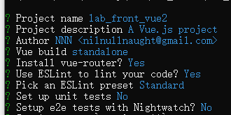

<div STYLE="page-break-after: always;">
	<br>
    <br>
    <br>
    <br>
    <br>
    <br>
    <br>
    <br>
    <br>
    <br>
	<center><h3><font size="20px">
        Vue
    </font></h3></center>
	<br>
    <br>
    <br>
    <br>
    <br>
    <br>
    <br>
    <br>
    <br>
    <br>
</div>

# 1	Vue 概述

## 1.1	Vue 简介

<br>

----

<div STYLE="page-break-after: always;"></div>

## 1.2	使用 Vue-cli 构建 Vue 项目

#### 步骤

1. 全局安装 Vue-cli：

   ```npm
   npm install --global vue-cli 
   ```

2. 在任意路径下使用以下命令：

   ```
   vue init webpack ${项目名称}
   ```

3. 项目基本设置：

   

<br>

---

<div STYLE="page-break-after: always;"></div>

## vue

#### this.$set

#### render 函数

#### 混入模式

#### asynic 和 synchro

#### watch 与 computed

---

<div STYLE="page-break-after: always;"></div>

# 附录

##### 参考资料

1. 主要参考资料——[参考资料名](地址) 发布于 【0000/00/00】最后更新于【0000/00/00】；
1. [1.1	二级标题](#1.1	二级标题)——[参考资料名](地址) 发布于 【0000/00/00】；

<br>

#### ❗❓

