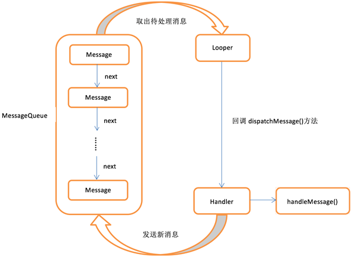

# 1	概述（需要修复）

<br>

## AndroidX与Android Support Library的区别


---

<br>

# 2	Activity（需要修复）

---

<br>

# 3	UI控件（需要修复）

## ConstraintLayout

---

<br>

---

<br>

# 4	Fragment（需要修复）

---

<br>

# 5	广播机制（需要修复）

---

<br>

# 6	数据持久化（需要修复）

## 6.0	概述

---

<br>

## 6.1	文件存储fun SharedPreferences.open(block: SharedPreferences.Editor.() -> Unit) {

  val editor = edit()

  editor.block()

  editor.apply()

}

---

<br>

## 6.2	SharedPreferences 存储

### 6.2.1	将数据存储到 SharedPreferences 中

---

<br>

### 6.2.2	从 SharedPreferences 中读取数据

---

<br>

### 6.2.3	通过高阶函数简化 SharedPreferences 的使用

**步骤**

1. 新建 SharedPreferences.kt 文件，加入以下代码

   ```kotlin
   /**
    * 1.通过扩展函数的方式向 SharedPreferences 中添加了一个 open 函数
    * 2.open 函数接受一个 SharedPreferences.Editor 的函数类型参数，因此这里需要调用 editor.block 对函数类型参数进行调用
    */
   fun SharedPreferences.open(block: SharedPreferences.Editor.() -> Unit) {
       val editor = edit()
       editor.block()
       editor.apply()
   }
   ```

2. 使用例：

   ```kotlin
   getSharedPreferences("data", Context.MODE_PRIVATE).open {
       putString("name", "Tom")
       putInt("age", 28)
       putBoolean("married", false)
   }
   ```

**注意**

- Google 提供的 KTX 扩展库中已经包含了上述 SharedPreferences 的简化用法，这个扩展库会在 Android Studio 创建项目的时候自动引入 build.gradle 的 dependencies 中。因此，我们可以在项目中使用如下写法来向 SharedPreferences 中存储数据：

  ```kotlin
  getSharedPreferences("data", Context.MODE_PRIVATE).edit {
      putString("name", "Tom")
      putInt("age", 28)
      putBoolean("married", false)
  }
  ```

---

<br>

## 6.3	SQLite 数据库存储

### 6.3.1	创建数据库

---

<br>

### 6.3.2	升级数据库

---

<br>

### 6.3.3	添加数据

---

<br>

### 6.3.4	更新数据

---

<br>

### 6.3.5	删除数据

---

<br>

### 6.3.6	查询数据

---

<br>

### 6.3.7	使用 SQL 操作数据库

---

<br>

### 6.3.8	使用事务

---

<br>

### 6.3.9	升级数据库的最佳写法

---

<br>

### 6.3.10	简化 ContentValues 的写法

**步骤**

1. 新建一个 ContentValues.kt 文件，然后在里面定义一个 cvOf() 方法。

   ```kotlin
   fun cvOf(vararg pairs: Pair<String, Any?>): ContentValues {
       val cv = ContentValues()
       for (pair in pairs) {
           val key = pair.first
           val value = pair.second
           when (value) {
               is Int -> cv.put(key, value)
               is Long -> cv.put(key, value)
               is Short -> cv.put(key, value)
               is Float -> cv.put(key, value)
               is Double -> cv.put(key, value)
               is Boolean -> cv.put(key, value)
               is String -> cv.put(key, value)
               is Byte -> cv.put(key, value)
               is ByteArray -> cv.put(key, value)
               null -> cv.putNull(key)
           }
       }
       return cv
   }
   ```

2. 使用 apply 函数进一步简化

   ```kotlin
   /**
    * 由于 apply 函数的返回值是它调用的对象本身，所以可以使用单行代码函数的语法糖，使用等号替代返回值的声明。
    * 
    */
   fun cvOf(vararg pairs: Pair<String, Any?>) = ContentValues().apply {
       for (pair in pairs) {
           val key = pair.first
           val value = pair.second
           when (value) {
               is Int -> put(key, value)
               is Long -> put(key, value)
               is Short -> put(key, value)
               is Float -> put(key, value)
               is Double -> put(key, value)
               is Boolean -> put(key, value)
               is String -> put(key, value)
               is Byte -> put(key, value)
               is ByteArray -> put(key, value)
               null -> putNull(key)
           }
       }
   }
   ```

3. **使用例**

   ```kotlin
   val values = cvOf("name" to "Game of Thrones", "author" to "George Martin", "pages" to 720, "price" to 20.85)
   db.insert("Book", null, values)
   ```

**注意**

- Google 提供的 KTX 扩展库中已经包含相同作用的 contentValuesOf() 方法。我们可以在项目中使用如下写法：

  ```
  val values = contentValuesOf("name" to "Game of Thrones", "author" to "George Martin", "pages" to 720, "price" to 20.85)
  db.insert("Book", null, values)
  ```


---

<br>

## 作用域存储（未完成）

---

<br>

# 7	ContentProvider

## 7.0	概述

**Android 中的数据共享**

- 不管是使用文件存储、Sharedpreferences 存储还是数据库存储，使用这些数据保存的数据都只能在当前应用程序中访问， 无法进行共享（Android 官方并不推荐直接的跨程序数据共享功能）。
- Android 推荐使用更安全的可靠的 ContentProvider 技术实现跨程序的数据共享。

**什么是 ContentProvider**

- ContentProvider 主要用于**在不同的应用程序之间实现数据共享的功能**，它提供了一套完整的机制，允许一个程序访问另一个程序中的数据，同时还能保证被访问数据的安全性。
- 目前，使用 ContentProvider 是 Android 实现跨程序共享数据的标准方式。
- 不同于文件存储和SharedPreferences存储中的两种全局可读写操作模式，**ContentProvider 可以选择只对哪一部分数据进行共享**，从而保证我们程序中的隐私数据不会有泄漏的风险。

---

<br>

## 7.1	运行时权限

### 7.1.0	概述

**权限声明**

- 在 AndroidManifest.xml 文件中可以为应用程序设置权限声明。
- 设置权限声明后，其实用户主要在两个方面得到了保护：
  - 一方面，如果用户在低于 Android 6.0系统的设备上安装该程序，会在安装界面给出提醒。这样用户就可以清楚地知晓该程序一共申请了哪些权限，从而决定是否要安装这个程序。
  - 另一方面，用户可以随时在应用程序管理界面查看任意一个程序的权限申请情况。这样该程序申请的所有权限就尽收眼底，什么都瞒不过用户的眼睛，以此保证应用程序不会出现各种滥用权限的情况。
- **问题**
  - 常用应用程序普遍存在着滥用权限的情况，而如果不开放应用程序所需要的所有权限，那么应用程序甚至无法被安装。
  - 为了解决这个问题，Android 开发团队在 Android 6.0 系统中加入了运行时权限功能。

**什么是运行时权限**

- 用户不需要在安装软件的时候一次性授权所有申请的权限，而是可以在软件的使用过程中再对某一项权限申请进行授权。比如一款相机应用在运行时申请了地理位置定位权层。就算我拒绝了这个权限，也应该可以使用这个应用的其他功能，而不是像之前那样直接无法安装。

**普通权限和危险权限**

- 并不是所有权限都需要在运行时申请，对于用户来说，不停地授权也很烦琐。Andoid 现在将常用的权限大致归成了两类，一类是普通权限，一类是危险权限。（准确地讲，其实还有一些特殊权限，不过这些权限使用得相对较少，因此暂不讨论。）

- **普通权限**普通权限指的是那些不会直接威胁到用户的安全和隐私的权限，对于这部分权限申请，系统会自动帮我们进行授权。

- **危险权限**危险权限则表示那些可能会触及用户隐私或者对设备安全性造成影响的权限，如获取设备联系人信息、定位设备地理位置等，对于这部分权限申请，必须由用户手动授权才可以，否则程序就无法使用施功能。

- 到 Android 10 系统为止所有的危险权限（11 组 30 个权限）：

  | 权限名                     | 权限组               | 解释                                                         |
  | -------------------------- | -------------------- | ------------------------------------------------------------ |
  | ACCEPT_HANDOVER            | PHONE(电话组)        | 允许呼叫应用继续在另一个应用中启动的呼叫                     |
  | ACCESS_BACKGROUND_LOCATION | LOCATION(定位组)     | 允许应用程序在后台访问位置                                   |
  | ACCESS_COARSE_LOCATION     | LOCATION(定位组)     | 允许程序通过WiFi或移动基站的方式获取用户错略的经纬度信息     |
  | ACCESS_FINE_LOCATION       | LOCATION(定位组)     | 允许程序通过GPS芯片接收卫星的定位信息                        |
  | ACTIVITY_RECOGNITION       |                      | 允许应用程序识别物理活动                                     |
  | ADD_VOICEMAIL              | PHONE(电话组)        | 允许程序添加语音邮件系统                                     |
  | ANSWER_PHONE_CALLS         | PHONE(电话组)        | 允许程序接听来电                                             |
  | BODY_SENSORS               | SENSORS(传感器组)    | 允许应用程序访问用户用来测量身体内部情况的传感器数据，例如心率 |
  | CALL_PHONE                 | PHONE(电话组)        | 允许程序从非系统拨号器里拨打电话                             |
  | CAMERA                     | CAMERA(相机拍照组)   | 允许程序访问摄像头进行拍照                                   |
  | GET_ACCOUNTS               | CONTACTS(联系人组)   | 允许程序访问账户Gmail列表                                    |
  | PROCESS_OUTGOING_CALLS     | PHONE(电话组)        | 允许程序监视，修改或放弃播出电话                             |
  | READ_CALENDAR              | CALENDAR(日历组)     | 允许程序读取用户的日程信息                                   |
  | READ_CALL_LOG              | PHONE(电话组)        | 允许程序读取通话记录                                         |
  | READ_CONTACTS              | CONTACTS(联系人组)   | 允许程序访问联系人通讯录信息                                 |
  | READ_PHONE_NUMBERS         | PHONE(电话组)        | 允许程序读取设备的电话号码                                   |
  | READ_PHONE_STATE           | PHONE(电话组)        | 允许程序访问电话状态                                         |
  | READ_SMS                   | SMS(手机短信服务组)  | 允许程序读取短信内容                                         |
  | RECEIVE_MMS                | SMS(手机短信服务组)  | 允许程序接收彩信                                             |
  | RECEIVE_SMS                | SMS(手机短信服务组)  | 允许程序接收短信                                             |
  | RECEIVE_WAP_PUSH           | SMS(手机短信服务组)  | 允许程序接收WAP PUSH信息                                     |
  | RECORD_AUDIO               | MICROPHONE(麦克风组) | 允许程序录制声音通过手机或耳机的麦克                         |
  | SEND_SMS                   | SMS(手机短信服务组)  | 允许程序发送短信                                             |
  | USE_SIP                    | PHONE(电话组)        | 允许程序使用SIP视频服务                                      |
  | WRITE_CALENDAR             | CALENDAR(日历组)     | 允许程序写入日程，但不可读取                                 |
  | WRITE_CALL_LOG             | PHONE(电话组)        | 允许程序写入（但是不能读）用户的联系人数据                   |
  | WRITE_CONTACTS             | CONTACTS(联系人组)   | 允许程序写入联系人,但不可读取                                |
  | READ_EXTERNAL_STORAGE      | STORAGE(存储组)      | 允许程序可以读取设备外部存储空间                             |
  | WRITE_EXTERNAL_STORAGE     | STORAGE(存储组)      | 允许程序写入外部存储,如SD卡上写                              |

**注意**

- 每当要使用一个权限时，可以先到表中查一下，如果是危险权限，就需要进行运行时权限处理，否则，只需要在 AndroidManifest.xml 文件中添加权限说明即可。
- 每个危险权限都属于一个权限组，虽然在进行运行时权限处理时使用的是权限名，但是原则上，**一旦用户同意了某个权限申请后，同组的其他权限也会被系统自动授权。**
- **不要基于上述规则来实现任何功能逻辑！**因为 Android 系统随时有可能调整权限的分组。

---

<br>

### 7.1.1	在程序运行时申请权限

**步骤**

1. 判断用户是否已经赋予权限
2. 如果已经授权，则直接执行逻辑操作
3. 如果没有授权，则需要调用 ActivityCompat.requestPermissions() 方法向用户申请授权。
4. 调用 上述 方法后，系统会弹出一个权限申请对话框，用户可以选择同意或拒绝我们的权限申请。无论是否拒绝，最终都会回调到 onRequestPermissionResult() 方法中。

**例一：在低于 Android 6.0 系统的手机上实现拨打电话功能**

```kotlin
/**MainActivity.kt**/
class MainActivity : AppCompatActivity() {

    override fun onCreate(savedInstanceState: Bundle?) {
        super.onCreate(savedInstanceState)
        setContentView(R.layout.activity_main)

        call.setOnClickListener {
            try {
                val intent = Intent(Intent.ACTION_CALL)
                intent.data = Uri.parse("tel:10086")
                startActivity(intent)
            }catch (e:SecurityException){
                e.printStackTrace()
            }
        }
    }
}
```

```xml
<!--activity_main-->
	...

	<Button
        android:id="@+id/call"
        android:text="call"
        ..
        />
    
    ...
```

```xml
<!--AndroidMainifest.xml-->

<manifest xmlns:android="http://schemas.android.com/apk/res/android"
    package="cn.nnn.runtimepermissiondemo">

    <uses-permission android:name="android.permission.CALL_PHONE"/>
    
    ...
    
</manifest>
```

**例二：在 Android 6.0 之后的系统上实现拨打电话功能**

```kotlin
/**MainActivity.kt**/
//在例一上进行修改
class MainActivity : AppCompatActivity() {

    override fun onCreate(savedInstanceState: Bundle?) {
        super.onCreate(savedInstanceState)
        setContentView(R.layout.activity_main)

        call.setOnClickListener {
            if(ContextCompat.checkSelfPermission(this,Manifest.permission.CALL_PHONE)
                != PackageManager.PERMISSION_GRANTED){

                //第一个参数要求是 Activity 的实力
                //第二个参数是一个 String 数组
                //第三个参数是请求码，只要是唯一值就可以了。
                ActivityCompat.requestPermissions(this, arrayOf(Manifest.permission.CALL_PHONE),1)
            }
        }
    }

    override fun onRequestPermissionsResult(
        requestCode: Int,
        permissions: Array<out String>,
        grantResults: IntArray
    ) {
        super.onRequestPermissionsResult(requestCode, permissions, grantResults)

        when(requestCode){
            1 ->{
                if (grantResults.isNotEmpty() && grantResults[0] == PackageManager.PERMISSION_GRANTED){
                    call()
                }else{
                    Toast.makeText(this,"FIELD",Toast.LENGTH_SHORT).show()
                }
            }
        }
    }

    private fun call(){
        try {
            val intent = Intent(Intent.ACTION_CALL)
            intent.data = Uri.parse("tel:10086")
            startActivity(intent)
        }catch (e:SecurityException){
            e.printStackTrace()
        }
    }
}
```

---

<br>

## 7.2	访问其他程序中的数据

### 7.2.0	概述

**ContentProvider 的用法**

- ContentProvider 的用法一般有两种：
  1. 使用现有的 ContentProvider 读取和操作相应程序中的数据；
  2. 创建自己的 ContentProvider，给程序的数据提供外部访问接口。
- 如果一个应用程序通过 ContentProvider 对其数据提供了外部访问接口，那么任何其他的应用都可以对这部分代码数据进行访问。Android 系统中自带的通讯录、短信、媒体库等程序都提供了类似的访问接口，这就使得第三方应用程序可以充分地利用这部分数据实现更好的功能。

---

<br>

### 7.2.1	ContentResolver 基本用法

**ContentResolver**

- 对于每一个应用程序来说，如果想要访问 ContentProvider 中共享的是数据，就一定要借助 ContentResolver 类。
- 可以通过 Context 中的 getContentResolver() 方法获取该类的实例。
- ContentResolver 中提供了一系列的方法用于对数据进行增删改查操作，其中 insert() 方法用于添加数据，update() 方法用于更新数据，delete() 方法用于删除数据，query() 方法用于查询数据。

**内容 Uri**

- 内容 Uri 给 ContentProvider 中的数据建立了唯一标识符，它主要由两部分组成：authority 和 path：

  - authority 用于对不同的应用程序做区分，一般为了避免冲突，会采用应用包名的方式进行命名。
  - path 则是用于同一应用程序中不同的表做区分的，通常会添加到 Authority 后面。

- 除了 authority 和 path，还需要在字符串的头部加上协议声明。

- **内容 Uri 的标准格式示例**

  ```kotlin
  //应用包名为 cn.nnn.appname，一般会添加 .provider
  content://cn.nnn.appname.provider/table1
  content://cn.nnn.appname.provider/table1
  
  //除此之外，内容 Uri 还可以携带 id 参数
  content://cn.nnn.appname.provider/table1/1
  ```

  以路径结尾的内容 Uri 表示期望访问该表中所有的数据，以 id 结尾表示期望访问该表中拥有相应 id 的数据。

**Uri 对象**

- 得到内容 Uri 后，还需要将它解析成 Uri 对象才可以作为参数传入。

- 只需要调用 Uri.parse() 方法就可以将内容 URI 字符串解析成 Uri 对象了，例：

  ```uri
  val uri = Uri.parse("content://cn.nnn.appname.provider/table1")
  ```

- 使用 Uri 对象查询 table1 表中的数据：

  ```kotlin
  val cursor = contentResolver.query{
  	uri, //指定查询某个应用程序下的某一张表
  	projection,//指定查询的列名
  	selection,//where 的约束条件
  	selectionArgs,//为 where 中的占位符提供具体的值
  	sortOrder//指定查询结果的排序方式
  }
  ```

**例：读取系统联系人**

```

```

---

<br>

## 7.3	创建自己的 ContentProvider

**说明**

- 想要实现跨程序共享数据的功能，可以通过新建一个类去继承ContentProvider的方式来实现。

- ContentProvider 类中有 6 个抽象方法，我们在使用子类继承它的时候，需要将这 6 个方法全部重写：

  ```kotlin
  class MyProvider:ContentProvider() {
  
      /**
       * 向 ContentProvider 中添加一条数据。
       * @uri: 数用于确定要添加到的表
       * @values: 参数保存待添加的数据
       *
       * @return:添加完成后，返回一个用于表示这条新纪录的URI
       */
      override fun insert(uri: Uri, values: ContentValues?): Uri? {
          return null
      }
  
  
      /**
       * 从 ContentProvider 中查询数据。
       * @uri 用于确定查询哪张表
       * @projection 用于确定查询哪些列
       * @selection 用于约束查询哪些行
       * @selectionArgs 同样用于约束查询哪些行
       * @sortOrder 用于对查询结果排序
       *
       * @return
       */
      override fun query(
          uri: Uri,
          projection: Array<out String>?,
          selection: String?,
          selectionArgs: Array<out String>?,
          sortOrder: String?
      ): Cursor? {
          return null
      }
  
      /**
       * 初始化 ContentProvider 的时候调用。通常会在这里完成对数据库的创建和升级等操作
       *
       * @return 返回 true 表示创建成功，返回 false 表示创建失败
       */
      override fun onCreate(): Boolean {
          return false
      }
  
      /**
       * 更新 ContentProvider 中已有的数据
       *
       * @uri 用于确定更新哪一张表中的数据
       * @values 保存新数据
       * @selection 用于约束查询哪些行
       * @selectionArgs 同样用于约束查询哪些行
       *
       * @return 返回受影响的行数
       */
      override fun update(
          uri: Uri,
          values: ContentValues?,
          selection: String?,
          selectionArgs: Array<out String>?
      ): Int {
          return 0
      }
  
      /**
       * 从 ContentProvider 中删除数据。
       * @uri 用于确定删除哪一张表中的数据
       * @selection 用于约束查询哪些行
       * @selectionArgs 同样用于约束查询哪些行
       *
       * @return 返回受影响的行数
       */
      override fun delete(uri: Uri, selection: String?, selectionArgs: Array<out String>?): Int {
          return 0
      }
  
      /**
       * 根据传入的内容 URI 返回相对应的 MIME　类型
       */
      override fun getType(uri: Uri): String? {
          TODO("not implemented") //To change body of created functions use File | Settings | File Templates.
      }
  
  }
  
  ```

**匹配内容 Uri**

- 使用 UriMatcher 类可以实现匹配内容 URI 的功能。UriMatcher 中提供了一个 addURI() 方法，这个方法接收 3 个参数，可以分别把 anthority、path 和一个自定义代码传进去。

- 当调用 UriMatcher 的 match() 方法时，就可以将一个 Uri 对象传入，返回值是某个能够匹配这个 Uri 对象所对应的自定义代码，利用这个代码，我们就可以判断出调用方期望访问的是哪张表中的数据了。

- 使用通配符匹配 Uri：

  ```
  // * 表示匹配任意长度的任意字符
  // # 表示匹配任意长度的数字 
  
  //匹配任意表的内容的URI
  content://cn.nnn.appname.provider/*
  //匹配 table1 表中任意一行数据
  content://cn.nnn.appname.provider/table1/#
  ```

**MIME类型**

- ContentProvider 都必须提供的 getType() 方法，该方法用于获取 Uri 对象所对应的 MIME 类型。

- 一个内容 URI 所对应的 MIME 字符串主要由 3 部分组成，Android 对这 3 个部分做了如下格式规定：

  - 必须以 vnd 开头。
  - 如果内容 URI 以路径结尾，则后接 `android.cursor.dir/`；如果内容 URI 以 id 结尾，则后接 `android.cursor.item/`
  - 最后接上 `vnd.<authority>.<path>`

- **例**

  ```kotlin
  对于 content://cn.nnn.appname.provider/table1 这个内容 URI 可以写成
  vnd.android.cursor.dir/vnd.cn.nnn.appname.provider.table1
  
  对于 content://cn.nnn.appname.provider/table1/1 这个内容 URI 可以写成
  vnd.android.cursor.item/vnd.cn.nnn.appname.provider.table1
  ```

**注意**

- 因为所有的增删改查操作都一定要匹配到相应的内容 URI 格式 才能进行，而我们不可能向 UriMatcher 中添加隐私数据的 URI，所以这部分数据根本无法被外部程序访问，安全问题也就不存在了。

**例：一个完整的 ContentProvider**

```kotlin
class MyProvider : ContentProvider() {

    private val table1Dir = 0

    private val table1Item = 1

    private val table2Dir = 2

    private val table2Item = 3

    private val uriMatcher = UriMatcher(UriMatcher.NO_MATCH)

    init {
        uriMatcher.addURI("com.example.app.provider", "table1", table1Dir)
        uriMatcher.addURI("com.example.app.provider ", "table1/#", table1Item)
        uriMatcher.addURI("com.example.app.provider ", "table2", table2Dir)
        uriMatcher.addURI("com.example.app.provider ", "table2/#", table2Item)
    }

    override fun onCreate(): Boolean {
        return false
    }

    override fun query(uri: Uri, projection: Array<String>?, selection: String?, selectionArgs: Array<String>?, sortOrder: String?): Cursor? {
        when (uriMatcher.match(uri)) {
            table1Dir -> {
                // 查询table1表中的所有数据
            }
            table1Item -> {
                // 查询table1表中的单条数据
            }
            table2Dir -> {
                // 查询table2表中的所有数据
            }
            table2Item -> {
                // 查询table2表中的单条数据
            }
        }
        return null
    }

    override fun insert(uri: Uri, values: ContentValues?): Uri? {
        return null
    }

    override fun update(uri: Uri, values: ContentValues?, selection: String?, selectionArgs: Array<String>?): Int {
        return 0
    }

    override fun delete(uri: Uri, selection: String?, selectionArgs: Array<String>?): Int {
        return 0
    }

override fun getType(uri: Uri) = when (uriMatcher.match(uri)) {
    table1Dir -> "vnd.android.cursor.dir/vnd.com.example.app.provider.table1"
    table1Item -> "vnd.android.cursor.item/vnd.com.example.app.provider.table1"
    table2Dir -> "vnd.android.cursor.dir/vnd.com.example.app.provider.table2"
    table2Item -> "vnd.android.cursor.item/vnd.com.example.app.provider.table2"
    else -> null
}

}
```

---

<br>

## 7.4	实现跨程序数据共享

**注意**

- 跨程序访问时，不能直接使用 Toast。
- ContentProvider 一定要在 AndroidManifest.xml 文件中注册才可以使用。

---

<br>

# 8	手机多媒体

## 8.1	通知

### 8.1.0	概述

**什么是通知**

- 通知（notification）是 Android 中比较有特色的一个功能，当某个应用程序希望向用户发出一些提示信息，而该应用程序又不在前台运行时，就可以借助通知来实现。
- 发出一条通知后，手机最上方的状态栏中会显示一个通知的图标，下拉状态栏后可以看到通知的详细内容。

---

<br>

### 8.1.1	创建通知渠道

**问题——通知的滥用**

- 每发出一条通知，意味着应用程序会拥有更改的打开率，因此有太多太多的应用会想尽办法给用户发送通知，以博取更多的展示机会。如果每个应用都这么做的话，那么用户手机的状态栏会被各种各样的通知信息堆满，不胜其烦。
- 虽然 Android 系统允许我们将某个应用程序的通知完全屏蔽，以防止它一直给我们发送垃圾信息，但是这些信息中，可能会有我们所关心的内容。在过去，用户无法对这些信息进行区分，要么同意接受所有信息，要么屏蔽所有信息。
- 为了解决这个问题，Android 8.0 系统引入了通知渠道这个概念。

**什么是通知渠道**

- 每条通知都要属于一个对应的渠道。每个应用程序都可以自由地创建当前应用拥有哪些渠道，但是，**这些通知渠道的控制权是掌握在用户手上的**，用户可以自由地控制这些通知渠道的重要程度（是否响铃、是否振动、或者是否关闭这个渠道的通知）。

**创建通知渠道**

1. 首先需要一个 NotificationManager 对通知进行管理，可以通过调用 Context 的 getSystemService() 方法获取。getSystemService() 方法接受一个字符串参数用于确定获取系统的哪个服务，这里我们传入 `Context.NOTIFICATION_SERVICE` 即可。

   ```kotlin
   val manager = getSystemService(Context.NOTIFICATION_SERVICE) as NotificationManager 
   ```

2. 接下来要使用 NotificationChannel 类构建一个通知渠道，并调用 NotificationManager 的 createNotificationChannel() 方法完成创建。由于 NotificationChannel 类和 createNotification() 方法都是 Android 8.0 中新增的 API，因此在使用时还需要进行版本判断才可以。

   ```kotlin
   if(Build.VERSION.SDK_INT >= Build.VERSION_CODES.O){
       //创建一个通知渠道至少需要 渠道ID、渠道名称以及重要等级这 3 个参数
       //渠道ID 可以随意定义，保证全局唯一性即可
       //渠道名称需要可以清楚地表达这个渠道的用途（用户通过渠道名称了解渠道的作用）
       //重要等级有多种，用户可以随时手动更改某个通知渠道的重要等级，开发者无法干预。
   	val channel = NotificationChannel(channelId,channelName,importance)
   	manager.createNotificationChannel(channel)
   }
   ```

**注意**

- 创建通知渠道的代码只在第一次执行的时候才会执行，当下次再执行创建代码时，系统会检测到该通知渠道已经存在了，因此不会重复创建，也不会运行效率。通知渠道一旦被创建之后将无法被程序修改，只有用户可以进行修改。

---

<br>

### 8.1.2	通知的基本用法

**灵活的创建通知**

- 通知可以在 Activity 中创建，可以在 Broadcast 中创建，也可以在BroadcastReceiver 里创建，当然也可以在 service 里创建。

**创建通知——步骤**

1. 首先使用一个 Builder 构造器来创建 Notification 对象。由于 Android 系统的每一个版本都会对通知功能进行或多或少的修改，API 不稳定的问题在通知上凸显得尤其严重。这个问题可以使用 AndroidX 中提供的兼容 API 解决。

   ```kotlin
   val notification = NotificationCompat.Builder(context,channelId)
   	//设置通知标题
   	.setContentTitle("This is content title")
   	//设置通知正文
   	.setContentText("This is content text")
   	//设置通知的小图标，只能用纯 alpha 图层的图片进行设置
   	.setSmallIcon(R.drawable.small_icon)
   	//设置通知的大图标，当下拉系统状态栏时，就可以看到设置的大图标了。
   	.setLargeIcon(BitmapFactory.decodeResource(getResources(),R.drawable.large_icon))
   	.build()
   ```

   2.调用 NotifacationManager 的 notify() 方法就可以让通知显示出来了

   ```kotlin
   //第一个参数是 id，要保证为每个通知指定的 id 都是不同的
   //第二个参数是 notification 对象，这里直接将刚才创建好的 Notification 对象传入即可。
   manager.notify(1,notification)
   ```

**PendingIntent**

- 创建通知后，直接点击通知会发现没有任何效果，而一般的通知被点击后都有所反应。
- 想要实现上述效果，需要在代码中通过 PendingIntent 进行相应设置。
- **什么是 PendingIntent**PendingIntent 和 Intent 有些类似，都可以用于启动 Activity、启动 Service 以及发送广播等。但是 Intent 倾向于立即执行某个动作，而 PendingIntent 倾向于在某个合适的时机执行某个动作（可以把 PendingIntent 简单理解为延迟执行的 Intent）
- **使用**
  - PendingIntent 提供了几个静态方法用于获取 PendingIntent 的实例，可以根据需求来选择是使用 getActivity() 方法、getBroadcast() 方法，还是 getService() 方法。这几个方法接受的参数都是相同的：
    1. 第一个参数 Context
    2. 第二个参数是一般用不到，传入 0 即可
    3. 第三个参数是一个 Intent 对象，我们可以通过这个对象构建出 PendingIntent 的 “意图”
    4. 第四个参数用于确定 PendingIntent 的行为，有 FLAG_ONE_SHOT、FLAG_NO_CREATE、FLAG_CANCEL_CURRENT 和 FLAG_UPDATE_CURRENT 这四种值可选，通常情况下这个参数传入 0 即可。
  - 通过 NotificationCompat.Builder 可以连缀一个 setContentIntent() 方法，接受的参数正是一个 PendingIntent 对象。因此可以通过 PendingIntent  构建一个延迟执行的 “意图”，当用户点击这条通知时就会执行相应的逻辑。

**注意**

- 渠道 ID 和 NotificationCompat.Builder() 中传入的渠道 ID 必须相同，如果传入了一个不存在的渠道 ID，那么通知将无法显示出来。
- 如果没有在代码中对通知进行取消，那么通知会一直显示在系统的状态栏上，解决方法有两种：
  1. 在 NotificationCompat.Builder 上连缀一个 setAutoCancel() 方法。
  2. 显示的调用 NotificationManager 的 cancel 方法将 它取消。

**例：发送通知**

```xml
<!-- activity_main.xml -->

	...

    <Button
        android:id="@+id/sendNotice"
        android:text="Send Notice"
        android:layout_width="wrap_content"
        android:layout_height="wrap_content"
        />

	...
```

```kotlin
/* MainActivity.kt */
class MainActivity : AppCompatActivity() {

    override fun onCreate(savedInstanceState: Bundle?) {
        super.onCreate(savedInstanceState)
        setContentView(R.layout.activity_main)

        val manager = getSystemService(Context.NOTIFICATION_SERVICE) as NotificationManager

        //创建通知渠道
        if(Build.VERSION.SDK_INT >= Build.VERSION_CODES.O){
            val channel = NotificationChannel("norma", "", NotificationManager.IMPORTANCE_DEFAULT)
            manager.createNotificationChannel(channel)
        }
        sendNotice.setOnClickListener {
            //创建 PendingIntent
            val intent = Intent(this,NotificationActivity::class.java)
            val pi = PendingIntent.getActivity(this,0,intent,0)
            
            val notification = NotificationCompat.Builder(this, "normal")
                    .setContentTitle("This is content title")
                    .setContentText("This is content text")
                    .setSmallIcon(R.drawable.small_icon)
                    .setLargeIcon(BitmapFactory.decodeResource(resources, R.drawable.large_icon))
                    .setContentIntent(pi) //设置 PendingIntent
                    .setAutoCancel(true) //设置通知点击后自动取消
                    .build()
            manager.notify(1,notification)
        }
    }
}
```

---

<br>

### 8.1.3	通知的进阶技巧

**setStyle() 方法**

- 该方法允许我们构建出富文本的通知内容。

- setStyle() 方法接受一个 NotificationCompaat.Style 参数，这个参数就是用来构建具体的富文本信息的，例如长文字[^1]、图片等。

- 例一：使用 setStyle() 显示长文本

  ```kotlin
  val notification = NotificationCompat.Builder(this, "normal")
          
          ...
          
          .setStyle(NotificationCompat.BigTextStyle().bigText("LONG LONG LONG LONG LONG LONG LONG LONG LONG LONG LONG LONG LONG LONG LONG LONG LONG LONG LONG LONG LONG LONG LONG LONG LONG LONG LONG LONG LONG LONG LONG LONG LONG LONG LONG LONG"))
          .build()
  ```

- 例二：显示大图片

  ```kotlin
  val notification = NotificationCompat.Builder(this, "normal")
          
          ...
          
          .setStyle(NotificationCompat.BigPictureStyle().bigPicture{
              BitmapFactory.decodeResource(resources,R.drawable,big_image)
          })
          .build()
  ```

**通知渠道的重要等级**

- 通知渠道的重要等级会影响通知的显示方式，以及通知发出时的行为（提示音和振动等）。

---

<br>

## 8.2	调用摄像头和相册

### 8.2.1	调用摄像头

**应用关联缓存目录**

- 指 SD 卡中专门用于存放当前应用缓存数据的位置，调用 getExternalCacheDir() 方法可以得到这个目录。
- 从 Android 6.0 系统开始，读写 SD 卡被列为了危险权限，所以将图片存放在 SD 卡的任何其他目录，都要进行运行时权限处理才行，而使用应用关联目录则可以跳过这一步。
- 此外，从 Android 10.0 系统开始，公有的 SD 卡目录已经不再允许被应用程序直接访问了，而是要使用作用域存储才行。

**FileProvider**

- 在 Android 7.0 系统以下，可以直接调用 Uri 的 fromFile() 方法将 File 对象转换成 Uri 对象，这个 Uri 对象标识着文件的本地真实路径。

- 从 Android 7.0 开始，直接使用本地真实路径的Urine被认为是不安全的，会排除一个 FileUriExposedException 异常。

- **什么是 FileProvider**

  - FileProvider 是一种特殊的 ContentProvider，它使用了和 ContentProvider 类似的机制来对数据进行保护，可以选择性的将封装过的 Uri 共享给外部，从而提高了应用的安全性。

- **使用 FileProvider 封装 Uri 对象**

  - 通过 FileProvider 的 getUriForFile() 方法将 File 对象转换成一个封装过的 Uri 对象。
  - getUriForFile() 方法接受三个参数：
    1. 第一个参数要求传入 Context 对象
    2. 第二个参数可以是任意唯一的字符串
    3. 第三个参数是 File 对象

- **注册 FileProvider**FileProvider 作为特殊的 ContentProvider，必须要在 AndroidManifest.xml 文件中进行注册。

  ```xml
  <!-- android:authorities 的值必须和 FileProvider 的 getUriForFile() 方法中的第二个参数一致-->
  <provider
          android:name="androidx.core.content.FileProvider"
          android:authorities="com.example.cameraalbumtest.fileprovider"
          android:exported="false"
          android:grantUriPermissions="true">
          
      <!-- meta-data 指定 Uri 的共享路径，并引用了一个 @xml.file_paths 资源文件（该资源用于指定 Uri 共享，需要自己创建）-->
      <meta-data
              android:name="android.support.FILE_PROVIDER_PATHS"
              android:resource="@xml/file_paths" />
  </provider>
  ```

**注意**

- 调用照相机去拍照有可能会在一些手机上发生照片旋转的情况。这是因为这些手机认为打开摄像头进行拍摄时，手机就应该是横屏的，因此回到竖屏的情况下就会发送 90 都的旋转。所以需要加上判断图片方向的代码，如果发现图片需要进行旋转，那么就先将图片旋转相应的角度，然后再显示到界面上。

**例：[！！！！！][1]**

---

<br>

### 8.2.2	从相册中选择图片

**步骤**

1. 在布局文件中添加按钮，在 activity 中为按钮添加点击事件。
2. 在点击事件中构建一个 Intent 对象，并将它的 action 指定为 Intent.ACTION_OPEN_DOCUMENT，表示打开系统的文件选择器。
3. 给 Intent 对象设置一些条件过滤，只允许可打开的图片文件显示出来，然后调用 startActivityResult() 方法即可。在调用startActivityResult() 方法时，给第二参数传入的值为 fromAlbum，这样当选择完图片回到 onActivityResult() 方法时，就会进入 fromAlbum 的条件下处理图片。
4. 调用返回 intent 的getData()  方法来获取选中图片的 Uri，然后再调用 getBitmapFromUri() 方法将 Uri 转换成 Bitmap 对象，追钟将图片显示到界面上。

**注意**

- 如果某些图片的像素过高，直接加载到内存中就有可能会导致程序崩溃，更好的做法是根据项目的需求先对图片进行适当的压缩，然后再加载到内存中。

---

<br>

## 8.3	播放多媒体文件

### 8.3.1	播放音频

**MediaPlayer 类**

- 在 Android 中播放音频文件一般是使用 MediaPlayer 类实现的，它对多种格式的阴平文件提供了非常全面的控制方法，从而使播放音乐的工作变得十分简单。
- MediaPlayer 可以用于播放网络、本地以及应用程序安装包[^2]中的音频。

**MediaPlayer 类中一些较为常用的控制方法**

| **方法名**      | **功能描述**                                        |
| --------------- | --------------------------------------------------- |
| setDataSource() | 设置要播放的音频文件的位置                          |
| prepare()       | 在开始播放之前调用，以完成准备工作                  |
| start()         | 开始或继续播放音频                                  |
| pause()         | 暂停播放音频                                        |
| reset()         | 将MediaPlayer对象重置到刚刚创建的状态               |
| seekTo()        | 从指定的位置开始播放音频                            |
| stop()          | 停止播放音频。调用后的MediaPlayer对象无法再播放音频 |
| release()       | 释放与MediaPlayer对象相关的资源                     |
| isPlaying()     | 判断当前MediaPlayer是否正在播放音频                 |
| getDuration()   | 获取载入的音频文件的时长                            |

**MediaPlayer 的工作流程**

1. 创建一个 MediaPlayer 对象；
2. 调用 setDAtaSource() 方法设置音频文件的路径；
3. 再调用 prepare() 方法使 MediaPlayer 进入准备状态；
4. 接下来调用 start() 方法就可以开始播放音频。
5. 调用 pause() 方法就会暂停播放，调用 reset()  方法就会停止播放。

**asset 目录**

- Android Studio 允许我们在项目工程中创建一个 assets 目录，并在这个目录下存放任意文件和子目录，这些文件和子目录在项目打包时会一并被打包到安装文件中，然后我们在程序中就可以借助 AssetManager 这个类提供的接口对 assets 目录下的文件进行读取。

**例：简单的音频播放器**

```kotlin
class MainActivity : AppCompatActivity() {

    private val mediaPlayer = MediaPlayer()


    override fun onCreate(savedInstanceState: Bundle?) {
        super.onCreate(savedInstanceState)
        setContentView(R.layout.activity_main)
        
        initMediaPlayer()
        
        play.setOnClickListener {
            if (!mediaPlayer.isPlaying) {
                mediaPlayer.start() // 开始播放
            }
        }

        pause.setOnClickListener {
            if (mediaPlayer.isPlaying) {
                mediaPlayer.pause() // 暂停播放
            }
        }

        stop.setOnClickListener {
            if (mediaPlayer.isPlaying) {
                mediaPlayer.reset() // 停止播放
                initMediaPlayer()
            }
        }

    }

    private fun initMediaPlayer() {
        val assetManager = assets
        val fd = assetManager.openFd("music.mp3")
        mediaPlayer.setDataSource(fd.fileDescriptor, fd.startOffset, fd.length) 
        mediaPlayer.prepare()
    }

	
    override fun onDestroy() {
        super.onDestroy()
        
        //将于 MediaPlayer 相关的资源释放掉
        mediaPlayer.stop()
        mediaPlayer.release()
    }
·	
}
```

---

<br>

### 8.3.2	播放视频

**VideoView 类**

- 播放视频主要使用 VidioView 类来实现。这个类将视频的显示和控制集于一身，我们仅仅借助它就可以完成一个简易的视频播放器。
- VideoView 的用法和 MediaPlayer 比较类似。

**VideoView 的常用方法**

| **方　法　名** | **功能描述**               |
| -------------- | -------------------------- |
| setVideoPath() | 设置要播放的视频文件的位置 |
| start()        | 开始或继续播放视频         |
| pause()        | 暂停播放视频               |
| resume()       | 将视频从头开始播放         |
| seekTo()       | 从指定的位置开始播放视频   |
| isPlaying()    | 判断当前是否正在播放视频   |
| getDuration()  | 获取载入的视频文件的时长   |

**注意**

- VideoView 不支持直接播放 asset 目录下的视频资源。但是，res 目录下允许我们再创建一个 raw 目录，诸如音频、视频之类的资源文件可以放在这里，并且 VideoView 是可以直接播放这个目录下的视频资源的。
- VideoView 并不是一个万能的视频播放工具类，它在视频格式的支持以及播放效率方面都存在着较大的不足。

**例：简单的视频播放器**

```kotlin
class MainActivity : AppCompatActivity() {

    override fun onCreate(savedInstanceState: Bundle?) {
        super.onCreate(savedInstanceState)
        setContentView(R.layout.activity_main)

        val uri = Uri.parse("android.resource://$packageName/${R.raw.video}")

        videoView.setVideoURI(uri)

        play.setOnClickListener {
            if (!videoView.isPlaying) {
                videoView.start() // 开始播放
            }
        }

        pause.setOnClickListener {
            if (videoView.isPlaying) {
                videoView.pause() // 暂停播放
            }
        }

        replay.setOnClickListener {
            if (videoView.isPlaying) {
                videoView.resume() // 重新播放
            }
        }

    }

    override fun onDestroy() {
        super.onDestroy()
        videoView.suspend()
    }

}
```

---

<br>

# 9	Service

## 9.0	概述

**Service 是什么**

- Service 是 Android 中实现 **程序后台运行** 的解决方案，它非常适合执行那些不需要和用户交互而且还要求长期运行的任务。
- Service 的运行不依赖于任何用户界面，即使程序被切换到后台，或者用户打开了另外一个应用程序，Service 仍然能够保持正常运行。
- 但是，Service 并不是运行再一个独立的进程当中的，而是依赖于创建 Service 时所在的应用程序进程。当某个应用程序进程被杀掉时，所有依赖于该进程的 Service 也会停止运行。
- 实际上，Service 并不会自动开启线程，所有的代码都是默认运行在主线程当中的。也就是说，我们需要在 Service 的内部手动创建子线程，并在这里执行具体的任务，否则就有可能出现主线程被阻塞的情况。

---

<br>

## 9.1	Android 多线程编程

### 9.1.1	线程的基本用法

**语法**

- 继承 Thread 类：

  ```kotlin
  class MyThread: Thread(){
  	
      override fun run(){
          //编写具体的逻辑
      }
  }
  
  //启动线程
  //创建 MyThread 的实例，然后调用它的 start() 方法即可
  Mythread().start()
  ```

-  runnable 接口：

  ```kotlin
  class MyThread: Runnable{
  	
      override fun run(){
          //编写具体的逻辑
      }
  }
  
  //启动线程
  //先创建 MyThread 的实例，然后将它传入 Thread 的构造函数里
  val myThread = MyThread()
  Thread(myThread).start()
  ```

-  lambda 的方式：

  ```kotlin
  //不需要专门再定义一个类去实现 Runnable 接口或者继承 Thread 类
  //更为常用
  Thread{
  	//编写具体的逻辑
  }.start() 
  ```

- 使用 Kotlin 内置的顶层函数：

  ```kotlin
  thread{
  	//编写具体的逻辑
  }
  ```

---

<br>

### 9.1.2	在子线程中更新 UI

**问题**

- 和许多其他的 GUI 库一样，Android 的 UI 也是线程不安全的。也就是说，如果想要更新应用程序里的 UI 元素，必须在主线程中进行，否则就会出现异常。
- 为了解决这个问题，Android 提供了一套异步消息处理机制，完美地解决了在子线程中进行 UI 操作的问题。

**例：点击按钮修改 TextView 中的内容**

```xml
<!--activity_main-->
	<TextView
        android:id="@+id/textView"
        android:text="Hello World"
        android:layout_width="wrap_content"
        android:layout_height="wrap_content"
        />

    <Button
        android:id="@+id/changeTextBtn"
        android:text="change"
        android:layout_width="match_parent"
        android:layout_height="wrap_content"
        />
```

```kotlin
/**MainActivity.kt**/
class MainActivity : AppCompatActivity() {

    val updateText = 1

    val handler = object :Handler(){
        override fun handleMessage(msg: Message) {
            when(msg.what){
                updateText -> textView.text = "Now changed"
            }
        }
    }

    override fun onCreate(savedInstanceState: Bundle?) {
        super.onCreate(savedInstanceState)
        setContentView(R.layout.activity_main)

        changeTextBtn.setOnClickListener {
            thread {
                val msg = Message()
                msg.what = updateText
                handler.sendMessage(msg)//将 Message 对象发送出去
            }
        }
    }
}
```

---

<br>

### 9.1.3	解析异步消息处理机制

**Android中的异步消息处理主要由4个部分组成**

- Message
- Handler
- MessageQueue
- Looper

**Message**

- Message 用于**在线程之间传递的消息**，它可以在内部携带少量的信息，用于在不同线程之间传递数据。

**Handler**

- Handler 主要用于**发送和处理消息**，发送消息一般是使用 Handler 的 sendMessage() 方法、post()方法等，而发出的消息经过一系列地辗转处理后，最终会传递到Handler的handleMessage()方法中。


**MessageQueue**

- MessageQueue 是消息队列的意思，它主要用于**存放所有通过 Handler 发送的消息**。这部分消息会一直存在于消息队列中，等待被处理。**每个线程中只会有一个 MessageQueue 对象**。

**Looper**

- Looper 是每个线程中的 MessageQueue 的管家，调用 Looper 的 loop() 方法后，就会进入一个无限循环当中，然后**每当发现 MessageQueue 中存在一条消息时，Looper 就会将它取出**，并传递到 Handler 的 handleMessage() 方法中。**每个线程中只会有一个 Looper 对象**。

**异步消息处理的完整流程**

1. 首先在主线程当中创建一个 Handler 对象，并重写 handleMessage() 方法。
2. 当子线程中需要进行 UI 操作时，就创建一个 Message 对象，并通过 Handler 将这条消息发送出去。
3. 被发送出去的消息会被添加到 MessageQueue 的队列中等待被处理。
4.  Looper 一直尝试从 MessageQueue 中取出待处理消息，最后分发回 Handler 的 handleMessage() 方法中。
5. 由于 Handler 是在主线程中创建的，所以此时 handleMessage() 方法中的代码也会在主线程中运行。

**异步消息处理机制流程示意图**



---

<br>

### 9.1.4	使用 AsyncTask

**说明**

- Android 提供了一些更好的工具用来在子线程中对 UI 进行操作，比如 AsyncTask。
- 借助 AsyncTask 哪怕对异步消息处理机制完全不了解，也可以十分简单地从子线程切换到主线程。
- AsyncTask 的实现原理也是基于异步消息处理机制的，只是 Android 帮我们做了很好的封装。

**AsyncTask 的基本用法**

- AsyncTask 是一个抽象类，所以必须使用时必须创建一个子类去继承它。

- 在继承时可以指定 3 个泛型参数，这 3 个参数的用途如下：

  - Params：在执行 AsyncTask 时需要传入的参数，可用于在后台任务中使用。
  - Progress：在后台任务执行时，如果需要在界面上显示当前的进度，则使用这里指定的泛型作为进度单位。
  - Result：当任务执行完毕后，如果需要对结果进行返回，则使用这里指定的泛型作为返回值类型。

- 最简单的自定义 AsyncTask 可以写成如下形式：

  ```
  //Unit 表示在执行 AsyncTask 时不需要传入参数给后台任务
  //int 表示用整形数据作为进度显示单位
  //Boolean 表示使用布尔类型数据来反馈执行结果
  class DownloadTask: AsyncTask<Unit,Int,Boolean>(){
  	...
  }
  ```

- AsyncTask 中经常需要重写的重要方法有以下 4 个：

  1. **onPreExecute() **这个方法会在后台任务开始执行之前调用，用于进行一些界面上的初始化操作，比如显示一个进度条对话框等。
  2. **doInBackgroud(Params...)**这个方法中的所有代码都会在子线程中运行，我们应该在这里去处理所有的耗时任务。任务一旦完成，就可以通过 return 语句将任务的执行结果返回，如果 AsyncTask 的第三个泛型参数指定的是 Unit，就可以不返回任务执行结果。**注意，在这个方法中不可以进行 UI 操作，如果需要更新 UI 元素，可以调用 publishProgress(Progress...) 方法来完成**
  3. **onProgressUpdate(Progress...)**当在后台任务中调用了 ProgressUpdate(Progress...) 方法后，onProgressUpdate(Progress...) 就会很快被调用，该方法中携带的参数就是后台任务中传递过来的。在这个方法中可以对 UI 进行操作，利用参数中的数值就可以对界面元素进行相应的更新。
  4. **onPostExecute(Result)**当后台任务执行完毕并通过 return 语句进行返回时，这个方法就很快会被调用。返回的数据会作为参数传递到此方法中，可以利用返回的数据进行一些 UI 操作，比如提醒任务执行的结果，以及关闭进度条对话框等。

**例**

```kotlin
class DownloadTask:AsyncTask<Unit,Int,Boolean>() {
    override fun onProgressUpdate(vararg values: Int?) {
        //更新下载进度
        progressDialog.setMessage("Now is ${values[0]}%")
    }

    override fun onPostExecute(result: Boolean?) {
        progressDialog.dismis()//关闭进度对话框
        //在这里提示下载结果
        if(result){
            Toast.makeText(context,"successded",Toast.LENGTH_SHORT).show()
        }else{
            Toast.makeText(context,"failed",Toast.LENGTH_SHORT).show()
        }
    }

    override fun doInBackground(vararg params: Unit?)= try {
        while(true){
            val downloadPercent = doDownload() //这是一个不存在的虚构的方法，仅用于演示
            publishProgress(downloadPercent)
            if (downloadPercent >= 100){
                break
            }
        }
        true
    }catch (e:Exception){
        false
    }

    override fun onPreExecute() {
        progressDialog.show()//显示进度对话框
    }
}
```

```kotlin
//启动上述任务
DownloadTask().execute()
```

---

<br>

### 9.1.5	runOnUiThread()

**说明**

- handle 和 AsyncTask 在 Android 11 中都已经过时。

---

<br>

## 9.2	Service 的基本用法

### 9.2.1	定义一个Service

**步骤**

1. 右键包，选择 New → Service →  Service

   

   

   Export 属性表示是否将这个 Service 暴露给外部其他程序访问，Enable 属性表示是否启用这个 Service。

2. 创建完成的 Service

   ```kotlin
   class MyService : Service() {
   
       override fun onBind(intent: Intent): IBinder {
           TODO("Return the communication channel to the service.")
       }
   }
   ```

**Service 中最常用的 3 个方法**

```kotlin
class MyService : Service() {
    …
    //在Service 创建时调用
    override fun onCreate() {
        super.onCreate()
    }

    //在每次 Service 启动的时候调用
    //可以将启动时需要执行的动作逻辑写在该方法中
    override fun onStartCommand(intent: Intent, flags: Int, startId: Int): Int {
        return super.onStartCommand(intent, flags, startId)
    }

    //在 Service 销毁的时候调用
    //可以在该方法中回收不再使用的资源
    override fun onDestroy() {
        super.onDestroy()
    }

}
```

---

<br>

### 9.2.2	启动和停止 Service

**说明**

- 启动和停止 Service 主要借助 Intent 来实现。
- startService() 和 stopService() 方法都是定义在 Context 类中的，所以我们在 Activity 里可以直接调用这两个方法。

**注意**

- 可以在安卓系统的 Setting → System → Advanced → Develop options → Running services 中查看启动的Service（不同手机路径可能不同，甚至有可能无此选项）
- 从 Android 8.0 开始，应用的后台功能被大幅削减。现在只有当应用保持在前台可见状态的请款下，Service 才能保证稳定运行，**一旦应用进入后台之后，Service 随时都有可能被系统回收**。

**例**

```kotlin
class MainActivity : AppCompatActivity() {

    override fun onCreate(savedInstanceState: Bundle?) {
        super.onCreate(savedInstanceState)
        setContentView(R.layout.activity_main)
        
        startServiceBtn.setOnClickListener {
            val intent = Intent(this, MyService::class.java)
            startService(intent) // 启动Service
        }
        stopServiceBtn.setOnClickListener {
            val intent = Intent(this, MyService::class.java)
            stopService(intent) // 停止Service
        }
    }
    
}
```

---

<br>

### 9.2.3	Activity 和 Service 进行通信

**说明**

- 虽然 Service 是在 Activity 中启动的，但是在启动了 Service 之后，Activity 与 Service 基本就没有什么关系了。
- 通过 Service 的 onBind() 方法，可以使 Activity 和 Service 之间的联系更紧密。当一个Activity和Service绑定了之后，就可以调用该Service里的Binder提供的方法了。

**例：创建一个专门的Binder对象来对下载功能进行管理**

```kotlin
class MyService : Service() {

    private val mBinder = DownloadBinder()

    //继承自 Binder 的内部类 DownloadBinder
    class DownloadBinder : Binder() {

        //模拟开始下载
        fun startDownload() {
            Log.d("MyService", "startDownload executed")
        }

        //模拟查看下载进度
        fun getProgress(): Int {
            Log.d("MyService", "getProgress executed")
            return 0
        }

    }

    override fun onBind(intent: Intent): IBinder {
        return mBinder
    }
    …
}
```

```kotlin
class MainActivity : AppCompatActivity() {

    lateinit var downloadBinder: MyService.DownloadBinder

    //创建 ServiceConnection 的匿名类实现
    private val connection = object : ServiceConnection {

        //该方法会在 Service 与 Activity 成功绑定的时候调用
        override fun onServiceConnected(name: ComponentName, service: IBinder) {
            //向下转型，得到 DwonloadBinder 的实例，然后就可以在 Activity 中根据具体的场景来调用 DwonloadBinder 中的任何 public 方法。
            downloadBinder = service as MyService.DownloadBinder
            downloadBinder.startDownload()
            downloadBinder.getProgress()
        }

        //该方法只有在 Service 的创建进程崩溃或者被杀掉时才会调用（不常用）
        override fun onServiceDisconnected(name: ComponentName) {
        }

    }

    override fun onCreate(savedInstanceState: Bundle?) {
        …
        bindServiceBtn.setOnClickListener {
            val intent = Intent(this, MyService::class.java)
            
            //该方法的第三个参数是一个标志位，这里传入 BIND_AUTO_CREATE 表示在 Activity 和 Service 进行绑定后自动创建 Service（这会使得 MyService 中的 onCreate() 方法得到执行，但 onStartCommand() 方法不会执行）
            bindService(intent, connection, Context.BIND_AUTO_CREATE) // 绑定Service
        }
        unbindServiceBtn.setOnClickListener {
            unbindService(connection) // 解绑Service
        }
    }

}
```

---

<br>

### 9.2.4	Service 的生命周期[^!1]

**说明**

- Service 有自己的生命周期。

**启动 Service**

- 一旦在项目的任何位置调用了 Context 的 startService() 方法，相应的 Service 就会启动，并回调onStartCommand()方法。
- 如果这个 Service 之前还没有创建过，onCreate() 方法会先于 onStartCommand() 方法执行。

**停止 Service**

- Service 启动了之后会一直保持运行状态，直到 stopService() 或 stopSelf() 方法被调用，或者被系统回收。
- 注意，虽然每调用一次 startService() 方法，onStartCommand() 就会执行一次，但实际上**每个 Service 只会存在一个实例**。所以不管你调用了多少次startService()方法，只需调用一次stopService()或stopSelf()方法，Service就会停止。

**获取 Service 的持久连接**

- 可以调用 Context 的 bindService() 来获取一个 Service 的持久连接，这时就会回调 Service 中的 onBind() 方法。（类似地，如果这个Service之前还没有创建过，onCreate()方法会先于onBind()方法执行）
- 之后，调用方可以获取到 onBind() 方法里返回的 IBinder 对象的实例，这样就能自由地和 Service 进行通信了。只要调用方和 Service 之间的连接没有断开，Service 就会一直保持运行状态，直到被系统回收。

**销毁 Service**

- 当调用了 startService() 方法后，再去调用 stopService() 方法。这时 Service 中的 onDestroy() 方法就会执行，表示 Service 已经销毁了。
- 类似地，当调用了 bindService() 方法后，再去调用 unbindService() 方法，onDestroy()方法也会执行。
- 但是需要注意，我们是完全有可能**对一个 Service 既调用了 startService() 方法，又调用了 bindService() 方法**，在这种情况下该如何让Service销毁呢？
- 根据 Android 系统的机制，一个 Service 只要被启动或者被绑定了之后，就会处于运行状态，必须要让以上两种条件同时不满足，Service 才能被销毁。所以，这种情况下**要同时调用 stopService() 和 unbindService() 方法，onDestroy() 方法才会执行**。

---

<br>

## 9.3	Service 的更多技巧

### 9.3.1	前台 Service

**说明**

- **作用**从 Android 8.0 系统开始，只有当应用保持在前台可见状态的情况下，Service 才能保证稳定运行，一旦应用进入后台之后，Service 随时都有可能被系统回收。如果你 **希望 Service 能够一直保持运行状态**，就可以考虑使用前台 Service。
- **前台 Service 和普通 Service 的区别** **前台 Service 一直会有一个正在运行的图标在系统的状态栏显示**，下拉状态栏后可以看到更加详细的信息（类似于通知的效果）。
- **原理**由于状态栏中一直有一个正在运行的图标，**相当于我们的应用以另外一种形式保持在前台可见状态**，所以系统不会倾向于回收前台 Service。另外，用户也可以通过下拉状态栏清楚地知道当前什么应用正在运行，因此也不存在某些恶意应用长期在后台偷偷占用手机资源的情况。

**创建前台 Service** 

```kotlin
class MyService : Service() {
    …
    override fun onCreate() {
        super.onCreate()
        
        //创建前台 Service 的方法和创建通知的方法基本相同
        //唯一的区别在于,构建 Notification 对象后并没有使用 NotificationManager 将通知显示出来，
        //而是调用了 startForground() 方法
        val manager = getSystemService(Context.NOTIFICATION_SERVICE) as NotificationManager
        if (Build.VERSION.SDK_INT >= Build.VERSION_CODES.O) {
            val channel = NotificationChannel("my_service", "前台Service通知", NotificationManager.IMPORTANCE_DEFAULT)
            manager.createNotificationChannel(channel)
        }
        val intent = Intent(this, MainActivity::class.java)
        val pi = PendingIntent.getActivity(this, 0, intent, 0)
        val notification = NotificationCompat.Builder(this, "my_service")
            .setContentTitle("This is content title")
            .setContentText("This is content text")
            .setSmallIcon(R.drawable.small_icon)
            .setLargeIcon(BitmapFactory.decodeResource(resources, R.drawable.large_icon))
            .setContentIntent(pi)
            .build()
        
        //调用 startForeground() 方法后就会让 Service 变成一个前台 Service，并在系统状态栏显示出来
        startForeground(1, notification)
    }
    …
}
```

**注意**

- 从 Android 9.0 系统开始，使用前台 Service 必须在 AndroidManifest.xml 文件中进行权限声明才行：

  ```xml
  <manifest 
  	xmlns:android="http://schemas.android.com/apk/res/android" 
  	package="com.example.servicetest"> 
  	
  	<uses-permission android:name="android.permission.FOREGROUND_SERVICE"/> 
  	... 
  </manifest>
  ```

---

<br>

### 9.3.2	IntentService

**问题**

- 为了直接在 Service 里处理一些耗时的逻辑，而不出现 ANR（ Application Not Responding），需要使用 Android 多线程编程技术。所以标准的 Service 应该在每个具体的方法里开启一个子线程，然后在这里处理那些耗时的逻辑。并且，为了让 Service 在执行完毕后自动停止，还需要调用 用 stopService() 或 stopSelf() 方法。

- **例：一个比较标准的 Service 实现**

  ```kotlin
  class MyService : Service() { 
  	... 
  	override fun onStartCommand( intent: Intent, flags: Int, startId: Int): Int {
      	thread {
          	//处理具体的逻辑 
          	stopSelf() 
          } 
          return super.onStartCommand( intent, flags, startId) 
      } 
  }
  ```

- 但是，总会有一些程序员忘记开启线程，或者忘记调用 stopSelf() 方法。为了可以**简单地创建一个异步的、会自动停止的 Service**，Android 专门提供了一个 IntentService 类，这个类就很好地解决了前面所提到的两种尴尬。

**例**

```kotlin
//先调用父类的构造函数，并传入一个字符串，这个字符串可以随意指定，只在调试的时候有用。
class MyIntentService : IntentService("MyIntentService") {

    //该方法中可以处理一些耗时的逻辑，而不需要担心 ANR 问题
    override fun onHandleIntent(intent: Intent?) {
        // 打印当前线程的id
        Log.d("MyIntentService", "Thread id is ${Thread.currentThread().name}")
    }

    //根据 IntentService 的特性，它会在运行结束后自动停止。
    override fun onDestroy() {
        super.onDestroy()
        Log.d("MyIntentService", "onDestroy executed")
    }

}
```

---

<br>

# 10	网络技术

## 10.1	WebView

**作用**

- 借助 WebView 我们可以在自己的应用程序里嵌入一个浏览器，从而非常轻松地展示各种各样的网页。

**例**

```xml
<!-- activity_main.xml -->
	...

	 <WebView
        android:id="@+id/webView"
        android:layout_width="match_parent"
        android:layout_height="match_parent" />
	
	...
```

```kotlin
/* MainActivity.kt */
class MainActivity : AppCompatActivity() {
    override fun onCreate(savedInstanceState: Bundle?) {
        super.onCreate(savedInstanceState)
        setContentView(R.layout.activity_main)
        
        //开启 JavaScript 脚本支持
        webView.settings.javaScriptEnabled=true
        //当需要从一个网页跳转到另一个网页时，让目标网页仍然在当前 WebView 中显示。
        webView.webViewClient = WebViewClient()
        //传入网址
        webView.loadUrl("https://www.baidu.com")
    }
}
```

```xml
<!-- AndroidManifest.xml -->
<manifest xmlns:android="http://schemas.android.com/apk/res/android"
    package="com.example.webviewtest">
    
    <!-- 声明访问网络权限-->
    <uses-permission android:name="android.permission.INTERNET" />
    ...
</manifest>
```

---

<br>

## 10.2	使用 HTTP 访问网络

### 10.2.1	HttpURLConnection

**HttpClient**

- 在过去，Android上发送HTTP请求一般有两种方式：HttpURLConnection 和 HttpClien。但是由于 HttpClient 存在 API 数量过多、扩展困难等缺点，Android团队越来越不建议我们使用这种方式。终于在Android 6.0系统中，HttpClient的功能被完全移除了，标志着此功能被正式弃用。

**HttpURLConnection 的步骤**

1. 首先需要获取 HttpURLConnection 的实例，一般只需创建一个 URL 对象，并传入目标的网络地址，然后调用一下 openConnection()方法即可：

   ```kotlin
   val url = URL("https://www.baidu.com")
   val connection = url.openConnection() as HttpURLConnection
   ```

2. 在得到了HttpURLConnection的实例之后，我们可以设置一下 HTTP 请求所使用的方法。常用的方法主要有两个：GET
   和POST。

   ```kotlin
   connection.requestMethod = "GET"
   ```

3. 接下来就可以进行一些自由的定制了，比如设置连接超时、读取超时的毫秒数，以及服务器希望得到的一些消息头等。这部分内容根据自己的实际情况进行编写，示例写法如下：

   ```kotlin
   connection.connectTimeout = 8000
   connection.readTimeout = 8000
   ```

4. 之后再调用 getInputStream() 方法就可以获取到服务器返回的输入流了，剩下的任务就是对输入流进行读取：

   ```kotlin
   val input = connection.inputStream
   ```

5. 最后可以调用disconnect()方法将这个HTTP连接关闭

   ```kotlin
   connection.disconnect()
   ```

**提交数据**

- HTTP请求的方法改成POST，并在获取输入流之前把要提交的数据写出即可。

  ```kotlin
  connection.requestMethod = "POST"
  val output = DataOutputStream(connection.outputStream)
  output.writeBytes("username=admin&password=123456")
  ```

- 注意，每条数据都要以键值对的形式存在，数据与数据之间用“&”符号隔开。

**例一：请求数据**

```xml
<!-- activity_main.xml -->
<LinearLayout xmlns:android="http://schemas.android.com/apk/res/android"
    android:orientation="vertical"
    android:layout_width="match_parent"
    android:layout_height="match_parent" >
    <Button
        android:id="@+id/sendRequestBtn"
        android:layout_width="match_parent"
        android:layout_height="wrap_content"
        android:text="Send Request" />
    <ScrollView
        android:layout_width="match_parent"
        android:layout_height="match_parent" >
        <TextView
            android:id="@+id/responseText"
            android:layout_width="match_parent"
            android:layout_height="wrap_content" />
    </ScrollView>
</LinearLayout>
```

```kotlin
/* MainActivity.kt */
class MainActivity : AppCompatActivity() {
    override fun onCreate(savedInstanceState: Bundle?) {
        super.onCreate(savedInstanceState)
        setContentView(R.layout.activity_main)
        sendRequestBtn.setOnClickListener {
            sendRequestWithHttpURLConnection()
        }
    }
    private fun sendRequestWithHttpURLConnection() {
        // 开启线程发起网络请求
        thread {
            var connection: HttpURLConnection? = null
            try {
                val response = StringBuilder()
                val url = URL("https://www.baidu.com")
                connection = url.openConnection() as HttpURLConnection
                connection.connectTimeout = 8000
                connection.readTimeout = 8000
                val input = connection.inputStream
                // 下面对获取到的输入流进行读取
                val reader = BufferedReader(InputStreamReader(input))
                reader.use {
                    reader.forEachLine {
                        response.append(it)
                    }
                }
                showResponse(response.toString())
            } catch (e: Exception) {
                e.printStackTrace()
            } finally {
                connection?.disconnect()
            }
        }
    }
    private fun showResponse(response: String) {
        runOnUiThread {
            // 在这里进行UI操作，将结果显示到界面上
            responseText.text = response
        }
    }
}
```

**例二：提交数据**

```ky
connection.requestMethod = "POST"
val output = DataOutputStream(connection.outputStream)
output.writeBytes("username=admin&password=123456")
```

---

<br>

### 10.2.2	OkHttp

**说明**

- OkHttp 是 Square 公司开发的网络通信库，kHttp不仅在接口封装上做得简单易用，就连在底层实现上也是自成一派，比起原生的 HttpURLConnection，可以说是有过之而无不及，现在已经成了广大 Android 开发者首选的网络通信库。
- **OkHttp 项目主页**https://github.com/square/okhttp

**项目中添加OkHttp库的依赖**

```groovy
// 编辑 app/build.gradle 文件

dependencies {
    ...
    implementation 'com.squareup.okhttp3:okhttp:4.1.0'
}
```

**OkHttp 的具体用法**

**get 请求**

1. 首先需要创建一个 OkHttpClient 的实例

   ```kotlin
   val client = OkHttpClient()
   ```

2. 接下来如果想要发起一条HTTP请求，就需要创建一个 Request 对象：

   ```kotlin
   val request = Request.Builder().build()
   ```

3. 上述代码只是创建了一个空的 Request 对象，并没有什么实际作用，我们可以在最终的 build() 方法之前连缀很多其他方法来丰富这个 Request 对象。比如可以通过 url() 方法来设置目标的网络地址，如下所示：

   ```kotlin
   val request = Request.Builder()
           .url("https://www.baidu.com")
           .build()
   ```

4. 之后调用 OkHttpClient 的 newCall() 方法来创建一个 Call 对象，并调用它的 execute() 方法来发送请求并获取服务器返回的数据，写法如下：

   ```
   val response = client.newCall(request).execute()
   ```

5. Response对象就是服务器返回的数据了，我们可以使用如下写法来得到返回的具体内容：

   ```
   val responseData = response.body?.string()
   ```

**Post请求**

1. POST请求会比 GET请求稍微复杂一点，我们需要先构建一个 Request Body 对象来存放待提交的参数，如下所示：

   ```kotlin
   val requestBody = FormBody.Builder()
           .add("username", "admin")
           .add("password", "123456")
           .build()
   ```

2. 然后在 Request.Builder 中调用一下 post() 方法，并将 RequestBody 对象传入：

   ```kotlin
   val request = Request.Builder()
           .url("https://www.baidu.com")
           .post(requestBody)
           .build()
   ```

3. 接下来的操作就和 GET 请求一样了，调用 execute() 方法来发送请求并获取服务器返回的数据即可。

---

<br>

## 10.3	解析 XML 数据

### 10.3.1	Pull 解析方式

**例**

```xml
<!-- get_data.xml -->
<!-- 将该文件放入本机服务器的 \htdocs 目录下 -->
<apps>
    <app>
        <id>1</id>
        <name>Google Maps</name>
        <version>1.0</version>
    </app>
    <app>
        <id>2</id>
        <name>Chrome</name>
        <version>2.1</version>
    </app>
    <app>
        <id>3</id>
        <name>Google Play</name>
        <version>2.3</version>
    </app>
</apps>
```

```kotlin

class MainActivity : AppCompatActivity() {
    ...
    private fun sendRequestWithOkHttp() {
        thread {
            try {
                val client = OkHttpClient()
                val request = Request.Builder()
                    // 指定访问的服务器地址是计算机本机
                    .url("http://10.0.2.2/get_data.xml")
                    .build()
                val response = client.newCall(request).execute()
                val responseData = response.body?.string()
                if (responseData != null) {
                    parseXMLWithPull(responseData)
                }
            } catch (e: Exception) {
                e.printStackTrace()
            }
        }
    }
    ...
    //返回数据后，调用 parseXMLWithPull() 解析数据
    private fun parseXMLWithPull(xmlData: String) {
        try {
            //创建一个 XmlPullParserFactory 的实例
            val factory = XmlPullParserFactory.newInstance()
            //借助 XmlPullParserFactory 的实例得到 XmlPullParser对象
            val xmlPullParser = factory.newPullParser()
            //调用 XmlPullParser 的 setInput()方法将服务器返回的XML数据设置进去，之后就可以开始解析了
            xmlPullParser.setInput(StringReader(xmlData))
            
            //通过 getEventType() 得到当前的解析事件
            var eventType = xmlPullParser.eventType
            var id = ""
            var name = ""
            var version = ""
            
            //在一个 while 循环中不断地进行解析，如果当前的解析事件不等于 XmlPullParser.END_DOCUMENT，说明解析工作还没完成，调用 next() 方法后可以获取下一个解析事件。
            while (eventType != XmlPullParser.END_DOCUMENT) {
           		//通过getName()方法得到了当前节点的名字
                val nodeName = xmlPullParser.name
                when (eventType) {
                    XmlPullParser.START_TAG -> {
                        //如果发现节点名等于id、name或version，就调用nextText()方法来获取节点内具体的内容
                        when (nodeName) {
                            "id" -> id = xmlPullParser.nextText()
                            "name" -> name = xmlPullParser.nextText()
                            "version" -> version = xmlPullParser.nextText()
                        }
                    }
                    // 当解析完一个app节点，就将获取到的内容打印出来
                    XmlPullParser.END_TAG -> {
                        if ("app" == nodeName) {
                            Log.d("MainActivity", "id is $id")
                            Log.d("MainActivity", "name is $name")
                            Log.d("MainActivity", "version is $version")
                        }
                    }
                }
                eventType = xmlPullParser.next()
            }
        } catch (e: Exception) {
            e.printStackTrace()
        }
    }
}
```

**注意**

- Android 9.0 系统开始，应用程序默认只允许使用 HTTPS 类型的网络请求，HTTP 类型的网络请求因为有安全隐患默认不再被支持。

---

<br>

### 10.3.2	SAX 解析方式

**说明**

- SAX 解析也是一种特别常用的 XML 解析方式，虽然**它的用法比 Pull 解析要复杂一些，但在语义方面会更加清楚**。

- 要使用 SAX 解析，通常情况下我们会新建一个类继承自 DefaultHandler，并重写父类的5个方法。

  ```kotlin
  class MyHandler : DefaultHandler() {
      
      //在开始XML解析的时候调
      override fun startDocument() {
      }
      
      //在开始解析某个节点的时候调用
      override fun startElement(uri: String, localName: String, qName: String,attributes:Attributes) {
      }
      
      //在获取节点中内容的时候调用
      override fun characters(ch: CharArray, start: Int, length: Int) {
      }
  
      //在完成解析某个节点的时候调用
      override fun endElement(uri: String, localName: String, qName: String) {
      }
      
      //在完成整个XML解析的时候调用
      override fun endDocument() {
      }
  }
  ```

  startElement()、characters() 和 endElement() 这3个方法是有参数的，从 XML 中解析出的数据就会以参数的形式传入这些方法中。

- 注意：在获取节点中的内容时，characters() 方法可能会被调用多次，**一些换行符也被当作内容解析出来**，我们需要针对这种情况在代码中做好控制。

**例**

```kotlin
class ContentHandler : DefaultHandler() {
    private var nodeName = ""
    private lateinit var id: StringBuilder
    private lateinit var name: StringBuilder
    private lateinit var version: StringBuilder
    
    override fun startDocument() {
        id = StringBuilder()
        name = StringBuilder()
        version = StringBuilder()
    }
    
    override fun startElement(uri: String, localName: String, qName: String,attributes:Attributes) {
        // 记录当前节点名
        nodeName = localName
        Log.d("ContentHandler", "uri is $uri")
        Log.d("ContentHandler", "localName is $localName")
        Log.d("ContentHandler", "qName is $qName")
        Log.d("ContentHandler", "attributes is $attributes")
    }
    
    override fun characters(ch: CharArray, start: Int, length: Int) {
        // 根据当前节点名判断将内容添加到哪一个StringBuilder对象中
        when (nodeName) {
            "id" -> id.append(ch, start, length)
            "name" -> name.append(ch, start, length)
            "version" -> version.append(ch, start, length)
        }
    }
    
    override fun endElement(uri: String, localName: String, qName: String) {
        if ("app" == localName) {
            //因为 id、name和 version 中都可能是包括回车或换行符的，因此在打印之前我们还需要调用一下 trim() 方法去除
            Log.d("ContentHandler", "id is ${id.toString().trim()}")
            Log.d("ContentHandler", "name is ${name.toString().trim()}")
            Log.d("ContentHandler", "version is ${version.toString().trim()}")
            // 最后要将StringBuilder清空，否则会影响下一次打印的结果
            id.setLength(0)
            name.setLength(0)
            version.setLength(0)
        }
    }
    
    override fun endDocument() {
    }
}
```

```kotlin
class MainActivity : AppCompatActivity() {
    
    ...
    
    private fun sendRequestWithOkHttp() {
        thread {
            try {
                val client = OkHttpClient()
                val request = Request.Builder()
                    // 指定访问的服务器地址是计算机本机
                    .url("http://10.0.2.2/get_data.xml")
                    .build()
                val response = client.newCall(request).execute()
                val responseData = response.body?.string()
                if (responseData != null) {
                    parseXMLWithSAX(responseData)
                }
            } catch (e: Exception) {
                e.printStackTrace()
            }
        }
    }
    
    ...
    
    private fun parseXMLWithSAX(xmlData: String) {
        try {
            val factory = SAXParserFactory.newInstance()
            val xmlReader = factory.newSAXParser().XMLReader
            val handler = ContentHandler()
            // 将ContentHandler的实例设置到XMLReader中
            xmlReader.contentHandler = handler
            // 开始执行解析
            xmlReader.parse(InputSource(StringReader(xmlData)))
        } catch (e: Exception) {
            e.printStackTrace()
        }
    }
}
```

---

<br>

## 10.4	解析 JSON 数据

### 10.4.1	使用 JSONObject

**例**

```json
//Apache\htdocs 目录中新建一个 get_data.json 文件
[{"id":"5","version":"5.5","name":"Clash of Clans"},
{"id":"6","version":"7.0","name":"Boom Beach"},
{"id":"7","version":"3.5","name":"Clash Royale"}]
```

```kotlin
class MainActivity : AppCompatActivity() {
    ...
    private fun sendRequestWithOkHttp() {
        thread {
            try {
                val client = OkHttpClient()
                val request = Request.Builder()
                    // 指定访问的服务器地址是计算机本机
                    .url("http://10.0.2.2/get_data.json")
                    .build()
                val response = client.newCall(request).execute()
                val responseData = response.body?.string()
                if (responseData != null) {
                    parseJSONWithJSONObject(responseData)
                }
            } catch (e: Exception) {
                e.printStackTrace()
            }
        }
    }
    ...

    private fun parseJSONWithJSONObject(jsonData: String) {
        try {
            //由于我们在服务器中定义的是一个JSON数组，因此这里首先将服务器返回的数据传入一个 JSONArray 对象中
            val jsonArray = JSONArray(jsonData)
            
            //循环遍历这个 JSONArray，从中取出的每一个元素都是一个 JSONObject 对象
            for (i in 0 until jsonArray.length()) {
                
                //每个 JSONObject 对象中包含 id、name 和 version 这些数据
                //调用 getString() 方法将数据取出，并打印出来即可
                val jsonObject = jsonArray.getJSONObject(i)
                val id = jsonObject.getString("id")
                val name = jsonObject.getString("name")
                val version = jsonObject.getString("version")
                Log.d("MainActivity", "id is $id")
                Log.d("MainActivity", "name is $name")
                Log.d("MainActivity", "version is $version")
            }
        } catch (e: Exception) {
            e.printStackTrace()
        }
    }
}
```

---

<br>

### 10.4.2	使用 GSON

**说明**

- google 提供的 GSON 开源库可以让解析 JSON 数据的工作更加简单。

- 使用 GSON 必须在项目中添加GSON库的依赖。编辑app/build.gradle文件，在dependencies闭包中添加如下内容：

  ```groovy
  dependencies {
      ...
      implementation 'com.google.code.gson:gson:2.8.5'
  }
  ```

- GSON 可以将一段 JSON 格式的字符串自动映射成一个对象，从而不需要我们再手动编写代码进行解析。

- **例一：将 JSON 数据解析成一个 Person对象**

  ```kotlin
  val gson = Gson()
  val person = gson.fromJson(jsonData, Person::class.java)
  ```

- **例二：解析一段 JSON 数组**

  ```kotlin
  //借助 TypeToken 将期望解析成的数据类型传入 fromJson() 方法中
  val typeOf = object : TypeToken<List<Person>>() {}.type
  val people = gson.fromJson<List<Person>>(jsonData, typeOf)
  ```

**例**

```kotlin
/* App 类*/
class App(val id: String, val name: String, val version: String)
```

```kotlin
class MainActivity : AppCompatActivity() {
    ...
    private fun sendRequestWithOkHttp() {
        thread {
            try {
                val client = OkHttpClient()
                val request = Request.Builder()
                    // 指定访问的服务器地址是计算机本机
                    .url("http://10.0.2.2/get_data.json")
                    .build()
                val response = client.newCall(request).execute()
                val responseData = response.body?.string()
                if (responseData != null) {
                    parseJSONWithGSON(responseData)
                }
            } catch (e: Exception) {
                e.printStackTrace()
            }
        }
    }
    ...
    private fun parseJSONWithGSON(jsonData: String) {
        val gson = Gson()
        val typeOf = object : TypeToken<List<App>>() {}.type
        val appList = gson.fromJson<List<App>>(jsonData, typeOf)
        for (app in appList) {
            Log.d("MainActivity", "id is ${app.id}")
            Log.d("MainActivity", "name is ${app.name}")
            Log.d("MainActivity", "version is ${app.version}")
        }
    }
}
```

---

<br>

## 10.5	实现网络请求回调

**说明**

- 因为一个应用程序很可能会在许多地方都使用到网络功能，而发送 HTTP 请求的代码基本是相同的，如果我们每次都去编写一遍发送 HTTP 请求的代码，这显然是非常差劲的做法。通常情况下我们应该将这些通用的网络操作提取到一个公共的类里，并提供一个通用方法，当想要发起网络请求的时候，只需简单地调用一下这个方法即可。

- **例**

  ```kotlin
  object HttpUtil {
      fun sendHttpRequest(address: String): String {
          var connection: HttpURLConnection? = null
          try {
              val response = StringBuilder()
              val url = URL(address)
              connection = url.openConnection() as HttpURLConnection
              connection.connectTimeout = 8000
              connection.readTimeout = 8000
              val input = connection.inputStream
              val reader = BufferedReader(InputStreamReader(input))
              reader.use {
                  reader.forEachLine {
                      response.append(it)
                  }
              }
              return response.toString()
          } catch (e: Exception) {
              e.printStackTrace()
              return e.message.toString()
          } finally {
              connection?.disconnect()
          }
      }
  }
  
  //需要发起 HTTP 请求的时，调用该类中的方法
  val address = "https://www.baidu.com"
  val response = HttpUtil.sendHttpRequest(address)
  ```

- 问题在于，网络请求通常属于耗时操作，而 sendHttpRequest() 方法的内部并没有开启线程，这样就有可能导致在调用 sendHttpRequest() 方法的时候**主线程被阻塞**。

  而**如果直接在 sendHttpRequest()  中开启一个线程来发起 HTTP 请求，服务器响应的数据是无法进行返回的**。这是由于所有的耗时逻辑都在子线程里进行，sendHttpRequest() 方法会在服务器还没来得及响应的时候就执行结束了，当然也就无法返回响应的数据了。

- **解决**

  - 使用编程语言的回调机制可以解决上述问题。

**使用 HttpURLConnection 实现**

1. 首先需要定义一个接口，比如将它命名成HttpCallbackListener，代码如下所示：

   ```kotlin
   interface HttpCallbackListener {
       //onFinish()方法表示当服务器成功响应我们请求的时候调用
       //该方法的参数代表服务器返回的数据
       fun onFinish(response: String)
       
       //onError()表示当进行网络操作出现错误的时候调用。
       //该方法的参数记录着错误的详细信息
       fun onError(e: Exception)
   }
   ```

2. 修改 HttpUtil：

   ```kotlin
   object HttpUtil {
       //添加一个 HttpCallbackListener 参数
       fun sendHttpRequest(address: String, listener: HttpCallbackListener) {
           thread {
               
               var connection: HttpURLConnection? = null
               try {
                   val response = StringBuilder()
                   val url = URL(address)
                   connection = url.openConnection() as HttpURLConnection
                   connection.connectTimeout = 8000
                   connection.readTimeout = 8000
                   val input = connection.inputStream
                   val reader = BufferedReader(InputStreamReader(input))
                   reader.use {
                       reader.forEachLine {
                           response.append(it)
                       }
                   }
                   // 回调onFinish()方法,因为子线程中是无法通过 return 语句返回数据的，因此这里我们将服务器响应的数据传入了 HttpCallbackListener 的 onFinish() 方法中
                   listener.onFinish(response.toString())
               } catch (e: Exception) {
                   e.printStackTrace()
                   // 回调onError()方法,如果出现了异常，就将异常原因传入 onError() 方法中。
                   listener.onError(e)
               } finally {
                   connection?.disconnect()
               }
           }
       }
   }
   ```

3. 因为 sendHttpRequest() 方法接收两个参数，因此我们在调用它的时候还需要将 HttpCallbackListener 的实例传入：

   ```kotlin
   HttpUtil.sendHttpRequest(address, object : HttpCallbackListener {
       override fun onFinish(response: String) {
           // 得到服务器返回的具体内容
       }
       override fun onError(e: Exception) {
           // 在这里对异常情况进行处理
       }
   })
   ```

**使用 OKHttp 实现**

1. 在 httpUtil 中加入一个 sendOkHttpRequest() 方法

   ```kotlin
   object HttpUtil {
       ...
       //参数 okhttp3.Callback 是 OkHttp 库中自带的回调接口，类似于使用 HttpURLConnection 实现中自己编写的 HttpCallbackListener
       fun sendOkHttpRequest(address: String, callback: okhttp3.Callback) {
           val client = OkHttpClient()
           val request = Request.Builder()
               .url(address)
               .build()
           
           //OkHttp 在 enqueue() 方法的内部帮我们开好子线程，然后会在子线程中执行 HTTP 请求，并将最终的请求结果回调到 okhttp3.Callback 当中
           client.newCall(request).enqueue(callback)
       }
   }
   ```

2. 在调用sendOkHttpRequest()方法的时候就可以这样写

   ```kotlin
   HttpUtil.sendOkHttpRequest(address, object : Callback {
       override fun onResponse(call: Call, response: Response) {
           // 得到服务器返回的具体内容
           val responseData = response.body?.string()
       }
        override fun onFailure(call: Call, e: IOException) {
           // 在这里对异常情况进行处理
       }
   })
   ```

**注意**

- 用 HttpURLConnection 还是 OkHttp，最终的回调接口都还是在子线程中运行的，因此我们不可以在这里执行任何的 UI 操作，除非借助 runOnUiThread() 方法来进行线程转换。

---

<br>

## 10.6	最好用的网络库——Retrofit

### 10.6.1	Retrofit 的基本用法

**Retrofit 的设计基于以下几个事实**

1. 同一款应用程序中所发起的网络请求绝大多数指向的是同一个服务器域名。因为任何公司的产品，客户端和服务器都是配套的，很难想象一个客户端一会去这个服务器获取数据，一会又要去另外一个服务器获取数据吧？
2. 另外，服务器提供的接口通常是可以根据功能来归类的。比如新增用户、修改用户数据、查询用户数据这几个接口就可以归为一类，上架新书、销售图书、查询可供销售图书这几个接口也可以归为一类。将服务器接口合理归类能够让代码结构变得更加合理，从而提高可阅读性和可维护性。
3. 最后，开发者肯定更加习惯于“调用一个接口，获取它的返回值”这样的编码方式，但当调用的是服务器接口时，却很难想象该如何使用这样的编码方式。其实大多数人并不关心网络的具体通信细节，但是传统网络库的用法却需要编写太多网络相关的代码。

**Retrofit 的用法**

1. 首先我们可以**配置好一个根路径，然后在指定服务器接口地址时只需要使用相对路径即可**，这样就不用每次都指定完整的 URL 地址了。
2. 另外，Retrofit 允许我们对服务器接口进行归类，**将功能同属一类的服务器接口定义到同一个接口文件当中**，从而让代码结构变得更加合理。
3. 最后，我们也完全不用关心网络通信的细节，**只需要在接口文件中声明一系列方法和返回值，然后通过注解的方式指定该方法对应哪个服务器接口，以及需要提供哪些参数**。当我们在程序中调用该方法时，Retrofit 会自动向对应的服务器接口发起请求，并将响应的数据解析成返回值声明的类型。这就使得我们可以用更加面向对象的思维来进行网络操作。

**添加 Retrofit 依赖**

```groovy
//编辑app/build.gradle文件，在dependencies闭包中添加如下内容
dependencies{
    ...
    //该依赖将 Retrofit、OkHttp 和 Okio 这几个库一起下载，我们无须再手动引入 OkHttp 库。
    implementation 'com.squareup.retrofit2:retrofit:2.6.1'
    
    //Retrofit 还会将服务器返回的JSON数据自动解析成对象，该依赖就是一个Retrofit的转换库，它是借助GSON来解析JSON数据的，所以会自动将GSON库一起下载下来，这样我们也不用手动引入GSON库了。（除了GSON之外，Retrofit还支持各种其他主流的JSON解析库，包括Jackson、Moshi等）
    implementation 'com.squareup.retrofit2:converter-gson:2.6.1'
}
```

**注意**

- 通常 Retrofit 的接口文件建议以具体的功能种类名开头，并以 Service 结尾，这是一种比较好的命名习惯。
- Retrofit 还提供了强大的 CallAdapters 功能来允许我们自定义方法返回值的类型，比如 Retrofit 结合 RxJava 使用就可以将返回值声明成 Observable、Flowable 等类型。

**例**

```kotlin
//请求返回数据对象
class App( val id: String, val name: String, val version: String)
```

```kotlin
interface AppService { 
    //@GET注解，表示当调用 getAppData() 方法时,Retrofit 会发起一条GET请求，请求的地址就是我们在@GET注解中传入的具体参数。注意，这里只需要传入请求地址的相对路径即可，根路径我们会在稍后设置。
    @GET(" get_data.json") 
    fun getAppData(): Call<List<App>>//getAppData()方法的返回值必须声明成Retrofit中内置的Call类型，并通过泛型来指定服务器响应的数据应该转换成什么对象。由于服务器响应的是一个包含App数据的JSON数组，因此这里我们将泛型声明成List<App>。
}
```

```xml
<!-- android_mian.xml -->
	...
	
	<Button
		android:id ="@+id/getAppDataBtn" 
		android:layout_width ="match_parent" 
		android:layout_height =" wrap_content" 
		android:text =" Get App Data" />
	
	...
```

```kotlin
//设置按钮点击事件
getAppDataBtn.setOnClickListener{
    //构建 Retrofit 对象
	val retrofit = Retrofit.Builder()
	    .baseUrl("http://10.0.2.2/") //指定所有请求的根路径
	    .addConverterFactory(GsonConverterFactory.create())//指定 Retrofit 在解析数据时的所使用的转换库
	    .build()
    
    //创建接口的动态代理对象，有了动态代理对象之后，我们就可以随意调用接口中定义的所有方法，而 Retrofit 会自动执行具体的处理。
	val appService = retrofit.create(AppService::class.java)
    
    //当调用了 AppService 的 getAppData() 方法时，会返回一个 Call<List<App>> 对象，这时我们再调用一下它的 enqueue() 方法，Retrofit 就会根据注解中配置的服务器接口地址去进行网络请求了
	appService.getAppData().enqueue(object : Callback<List<App>> {
	    override fun onResponse(call: Call<List<App>>,
	        response: Response<List<App>>) {
            //调用response.body()方法，可以获取 Retrofit 解析后的对象
	        val list = response.body()
	        if (list != null) {
	            for (app in list) {
	                Log.d("MainActivity", "id is ${app.id}")
	                Log.d("MainActivity", "name is ${app.name}")
	                Log.d("MainActivity", "version is ${app.version}")
	            }
	        }
	    }
	
	    override fun onFailure(call: Call<List<App>>, t: Throwable) {
	        t.printStackTrace()
	    }
	})
}

```

---

<br>

### 10.6.2	处理复杂的接口类型（未完成）

**说明**

- 在真实的开发环境当中，服务器所提供的接口地址不可能一直简单不变。如果你在使用浏览器上网时观察一下浏览器上的网址，你会发现这些网址可能会是千变万化的。在很多场景下，接口地址中的部分内容可能是会动态变化的。

**例一**

```http
//在这个接口当中，<page>部分代表页数，我们传入不同的页数，服务器返回的数据也会不同。
GET http://example.com/<page>/get_data.json
```

```kotlin
//这种接口地址对应到 Retrofit 当中应该这么写：
interface ExampleService {
    @GET("{page}/get_data.json")
    fun getData(@Path("page") page: Int): Call<Data>//当调用 getData() 方法发起请求时，Retrofit 就会自动将page 参数的值替换到占位符的位置，从而组成一个合法的请求地址
}
```

**例二**

```http
//很多服务器接口还会要求我们传入一系列的参数，格式如下：
GET http://example.com/get_data.json?u=<user>&t=<token>
```

```kotlin
interface ExampleService {
    @GET("get_data.json")
    fun getData(@Query("u") user: String, @Query("t") token: String):Call<Data>
}
```

---

<br>

### 10.6.3	Retrofit 构建器的最佳写法（未完成）

---

<br>

# 11	Material Design

## 11.0	概述

**什么是 Material Design**

- Material Design 是由 Google 的设计工程师们基于传统优秀的设计原则，结合丰富的创意和科学技术所开发的一套全新的**界面设计语言**，包含了视觉、运动、互动效果等特性。
- Google 从 Android 5.0 系统开始，就将所有内置的应用都使用 Material Design 风格进行设计。

**Material Design 过去的问题**

- 在推出后，Material Design 的普及程度却不是特别理想。因为这只是一个推荐的设计规范，主要是面向 UI 设计人员的，而不是面向开发者的。很多开发者可能根本就搞不清楚什么样的界面和效果才叫 Material Design，就算搞清楚了，实现起来也会很费劲，因为不少 Material Design 的效果是很难实现的，而Android中几乎没有提供相应的API支持，基本需要靠开发者自己从零写起。

**Design Support 库与 Material 库**

- 基于上述问题，在2015年的 Google I/O 大会上推出了一个 Design Support 库，这个库将 Material Design 中最具代表性的一些控件和效果进行了封装，使得开发者即使在不了解 Material Design 的情况下，也能非常轻松地将自己的应用 Material 化。后来 Design Support 库又改名成了 Material 库，用于给 Google 全平台类的产品提供 Material Design 的支持。

---

<br>

## 11.1	Toolbar

**ActionBar**

- **什么是 ActionBar**每个 Activity 最顶部默认的标题栏其实就是 ActionBar。
- **ActionBar 的问题**ActionBar 由于其设计的原因，**被限定只能位于 Activity 的顶部**，从而不能实现一些 Material Design 的效果，因此官方已经不再建议使用 ActionBar。

**Toolbar**

- Toolbar 的强大之处在于，它不仅 **继承了 ActionBar 的所有功能，而且灵活性很高**，可以配合其他控件完成一些Material Design的效果。

**清除默认的 ActionBar**

1. 打开 AndroidManifest.xml 文件

   ```xml
   <application
       android:allowBackup="true"
       android:icon="@mipmap/ic_launcher"
       android:label="@string/app_name"
       android:roundIcon="@mipmap/ic_launcher_round"
       android:supportsRtl="true"
       android:theme="@style/AppTheme"><!-- 这里使用 android:theme 属性指定了一个 AppTheme 的主题 -->
       ...
   </application>
   ```

2. android:theme 属性指定的主题定义在 res/values/styles.xml 文件中：

   ```xml
   <resources>
   
       <!-- Base application theme. -->
       <style name="AppTheme" parent="Theme.AppCompat.Light.DarkActionBar">
           <!-- Customize your theme here. -->
           <item name="colorPrimary">@color/colorPrimary</item>
           <item name="colorPrimaryDark">@color/colorPrimaryDark</item>
           <item name="colorAccent">@color/colorAccent</item>
       </style>
   
   </resources>
   ```

3. styles.xml 文件中定义了一个叫 AppTheme 的主题，然后指定它的 parent 主题是 Theme.AppCompat.Light. DarkActionBar。这个 DarkActionBar 是一个深色的 ActionBar 主题，我们之前所有的项目中自带的 ActionBar 就是因为指定了这个主题才出现的。

4. 为了使用 Toolbar 来替代 ActionBar **需要指定一个不带 ActionBar 的主题**，通常有 `Theme.AppCompat.NoActionBar`[^2]和 `Theme.AppCompat.Light.NoActionBar`[^3]这两种主题可选，例：

   ```xml
   <resources>
   
       <!-- Base application theme. -->
       <!-- 修改为浅色不附带 ActionBar的主题 -->
       <style name="AppTheme" parent="Theme.AppCompat.Light.NoActionBar">
           <!-- Customize your theme here. -->
           <item name="colorPrimary">@color/colorPrimary</item>
           <item name="colorPrimaryDark">@color/colorPrimaryDark</item>
           <item name="colorAccent">@color/colorAccent</item>
       </style>
   
   </resources>
   ```

**AppTheme 中的属性颜色重写**

- AppTheme 中重写了 `colorPrimary`、`colorPrimaryDark `和 `colorAccent` 这3个属性的颜色，在三个属性分别代表下列位置的颜色：

  

- 除了上述3个属性之外，我们还可以通过 `textColorPrimary`、`windowBackground` 和 `navigationBarColor` 等属性控制更多位置的颜色。不过唯独 `colorAccent` 这个属性比较难理解，它不只是用来指定这样一个按钮的颜色，而是更多表达了一种强调的意思，比如一些控件的选中状态也会使用 `colorAccent` 的颜色。

**使用 Toolbar 来替代 ActionBar**

1. 修改 activity_main.xml 中的代码，如下所示：

   ```xml
   <FrameLayout xmlns:android="http://schemas.android.com/apk/res/android"
       xmlns:app="http://schemas.android.com/apk/res-auto"
       android:layout_width="match_parent"
       android:layout_height="match_parent">
   
       <androidx.appcompat.widget.Toolbar
           android:id="@+id/toolbar"
           android:layout_width="match_parent"
           android:layout_height="?attr/actionBarSize"
           android:background="@color/colorPrimary"
           android:theme="@style/ThemeOverlay.AppCompat.Dark.ActionBar"
           app:popupTheme="@style/ThemeOverlay.AppCompat.Light" />
   
   </FrameLayout>
   ```

   - 上述代码第二行使用 xmlns:app 指定了一个新的命名空间。（由于每个布局文件都会使用 xmlns:android 来指定一个命名空间，我们才能一直使用 android:id、android: layout_width 等写法。）这里指定了 xmlns:app，也就是说现在可以使用 app:attribute 这样的写法了。之所以要指定该命名空间，是由于许多 Material 属性是在新系统中新增的，老系统中并不存在，那么为了能够兼容老系统，我们就不能使 用 android:attribute 这样的写法了，而是应该使用 app:attribute。
   - **为什么需要设置 Toolbar 的 theme 属性**由于我们刚才在 styles.xml 中将程序的主题指定成了浅色主题，因此 Toolbar 现在也是浅色主题，那么 Toolbar 上面的各种元素就会自动使用深色系，从而和主体颜色区别开。但是之前使用 ActionBar 时文字都是白色的，现在变成黑色的会很难看。那么为了能让 Toolbar 单独使用深色主题，这里我们使用了android:theme属性，将 Toolbar 的主题指定成了ThemeOverlay.AppCompat.Dark.ActionBar。但是这样指定之后又会出现新的问题，如果 Toolbar 中有菜单按钮，那么弹出的菜单项也会变成深色主题，这样就再次变得十分难看了，于是这里又使用了 app:popupTheme 属性，单独将弹出的菜单项指定成了浅色主题。

2. 修改 MainActivity

   ```kotlin
   class MainActivity : AppCompatActivity() {
   
       override fun onCreate(savedInstanceState: Bundle?) {
           super.onCreate(savedInstanceState)
           setContentView(R.layout.activity_main)
           
           //调用 setSupportActionBar() 方法并将 Toolbar 的实例传入，这样我们就做到既使用了 Toolbar，又让它的外观与功能都和 ActionBar 一致了。
           setSupportActionBar(toolbar)
       }
   }
   ```

**修改标题栏上显示的文字内容**

```xml
//文字内容是在 AndroidManifest.xml 中指定的
<application
    android:allowBackup="true"
    android:icon="@mipmap/ic_launcher"
    android:label="@string/app_name"
    android:roundIcon="@mipmap/ic_launcher_round"
    android:supportsRtl="true"
    android:theme="@style/AppTheme">
    <activity
        android:name=".MainActivity"
        android:label="Fruits"><!-- 添加 android:label 属性 -->
        ...
    </activity>
</application>
```

- android:label 属性由于指定在 Toolbar 中显示的文字内容，如果没有指定的话，会默认使用 application 中指定的 label 内容，也就是我们的应用名称

**为 Toolbar 添加 action 按钮**

1. 添加图片等资源文件

2. 右击res目录→New→Directory，创建一个menu文件夹。然后右击menu文件夹→New→Menu resource file，创建一个toolbar.xml文件，并编写如下代码：

   ```xml
   <menu xmlns:android="http://schemas.android.com/apk/res/android"
         xmlns:app="http://schemas.android.com/apk/res-auto">
       <item
           android:id="@+id/backup"
           android:icon="@drawable/ic_backup"
           android:title="Backup"
           app:showAsAction="always" />
       <item
           android:id="@+id/delete"
           android:icon="@drawable/ic_delete"
           android:title="Delete"
           app:showAsAction="ifRoom" />
       <item
           android:id="@+id/settings"
           android:icon="@drawable/ic_settings"
           android:title="Settings"
           app:showAsAction="never" />
   </menu>
   ```

   - 通过 \<item> 标签来定义 action 按钮，android:id 用于指定按钮的 id，android:icon 用于指定按钮的图标，android:title 用于指定按钮的文字。
   - 使用 app:showAsAction 来指定按钮的显示位置。showAsAction主要有以下几种值可选：
     - always表示永远显示在Toolbar中，如果屏幕空间不够则不显示；
     - ifRoom表示屏幕空间足够的情况下显示在Toolbar中，不够的话就显示在菜单当中；
     - never则表示永远显示在菜单当中。
   - 注意，Toolbar 中的 action 按钮只会显示图标，菜单中的 action 按钮只会显示文字。

3. 修改 MainActivity 中的代码，如下所示：

   ```kotlin
   class MainActivity : AppCompatActivity() {
       ...
       //加载 toolbar.xml 菜单文件
       override fun onCreateOptionsMenu(menu: Menu?): Boolean {
           menuInflater.inflate(R.menu.toolbar, menu)
           return true
       }
   
       //处理各个按钮的点击事件
       override fun onOptionsItemSelected(item: MenuItem): Boolean {
           when (item.itemId) {
               R.id.backup -> Toast.makeText(this, "You clicked Backup",
                                  Toast.LENGTH_SHORT).show()
               R.id.delete -> Toast.makeText(this, "You clicked Delete",
                                  Toast.LENGTH_SHORT).show()
               R.id.settings -> Toast.makeText(this, "You clicked Settings",
                                    Toast.LENGTH_SHORT).show()
           }
           return true
       }
   
   }
   ```

---

<br>

## 11.2	滑动菜单

### 11.2.0	概述

**什么是滑动菜单**

- 所谓的滑动菜单，就是将一些菜单选项隐藏起来，而不是放置在主屏幕上，然后可以通过滑动的方式将菜单显示出来。
- 这种方式既节省了屏幕空间，又实现了非常好的动画效果，是 Material Design 中推荐的做法。

---

<br>

### 11.2.1	DrawerLayout

**说明**

- Google 在 AndroidX 库中提供了 DrawerLayout 控件，借助这个控件，可以简单又方便的实现滑动菜单。

**DrawerLayout 的用法**

- DrawerLayout 是一个布局，在布局中允许放入两个直接子控件：

  1. 第一个子控件是主屏幕中显示的内容
  2. 第二个子控件是滑动菜单中显示的内容。

- **例**

  ```xml
  <androidx.drawerlayout.widget.DrawerLayout
      xmlns:android="http://schemas.android.com/apk/res/android"
      xmlns:app="http://schemas.android.com/apk/res-auto"
      android:id="@+id/drawerLayout"
      android:layout_width="match_parent"
      android:layout_height="match_parent">
  
      <FrameLayout
          android:layout_width="match_parent"
          android:layout_height="match_parent">
  
          <androidx.appcompat.widget.Toolbar
              android:id="@+id/toolbar"
              android:layout_width="match_parent"
              android:layout_height="?attr/actionBarSize"
              android:background="@color/colorPrimary"
              android:theme="@style/ThemeOverlay.AppCompat.Dark.ActionBar"
              app:popupTheme="@style/ThemeOverlay.AppCompat.Light" />
  
      </FrameLayout>
  
      <TextView
          android:layout_width="match_parent"
          android:layout_height="match_parent"
          android:layout_gravity="start"
          android:background="#FFF"
          android:text="This is menu"
          android:textSize="30sp" />
  
  </androidx.drawerlayout.widget.DrawerLayout>
  ```

- **注意**DrawerLayout 的第二个子控件的 `layout_gravity` 属性必须指定，因为我们需要告诉 DrawerLayout 滑动菜单是在屏幕的左边还是右边，指定left表示滑动菜单在左边，指定right表示滑动菜单在右边。如果指定为 start，表示会根据系统语言进行判断，如果系统语言是从左往右的，比如英语、汉语，滑动菜单就在左边，如果系统语言是从右往左的，比如阿拉伯语，滑动菜单就在右边。

**使用导航按钮提示滑动菜单的存在**

- **为什么需要导航按钮**

  - 因为只有在屏幕的左侧边缘进行拖动时才能将菜单拖出来，而 **很多用户可能根本就不知道有这个功能**，所以需要提示。
  - 因此，Material Design 建议的做法是在 Toolbar 的最左边加入一个导航按钮，点击按钮也会将滑动菜单的内容展示出来。这样就相当于给用户提供了两种打开滑动菜单的方式，防止一些用户不知道屏幕的左侧边缘是可以拖动的。

- **例：在 Toolbar 中添加导航按钮**

  ```kotlin
  class MainActivity : AppCompatActivity() {
  
      override fun onCreate(savedInstanceState: Bundle?) {
          super.onCreate(savedInstanceState)
          setContentView(R.layout.activity_main)
          
          setSupportActionBar(toolbar)
          
          //调用 getSupportActionBar() 方法得到了 ActionBar 的实例(这个 ActionBar 的具体实现由 Toolbar 完成)
          supportActionBar?.let {
              //设置显示导航按钮（又称 Home 按钮）
              it.setDisplayHomeAsUpEnabled(true)
              
              //为导航按钮设置图标
              it.setHomeAsUpIndicator(R.drawable.ic_menu)//需要在drawable-xxhdpi 目录下提供导航按钮的图标 ic_menu.png
          }
      }
      ...
      override fun onOptionsItemSelected(item: MenuItem): Boolean {
          when (item.itemId) {
              //添加对 Home 的点击事件处理，点击 Home 按钮展示滑动菜单
              android.R.id.home -> drawerLayout.openDrawer(GravityCompat.START)
              ...
          }
          return true
      }
  
  }
  ```

---

<br>

### 11.2.2	NavigationView

**说明**

- 你可以在滑动菜单页面定制任意的布局，不过 Google 给我们提供了一种更好的方法——使用NavigationView。
- NavigationView 是 Material 库中提供的一个控件，它不仅是严格按照 Material Design 的要求来设计的，而且可以将滑动菜单页面的实现变得非常简单。

**需要引入的依赖**

```groovy
//打开app/build.gradle文件，在dependencies闭包中添加如下内容：
dependencies {
    ...
    //Material 库依赖
    implementation 'com.google.android.material:material:1.1.0'
    
    //CircleImageView 依赖，它可以用来轻松实现图片圆形化的功能
    implementation 'de.hdodenhof:circleimageview:3.0.1'
}
```

**注意**

- 当你引入了 Material 库之后，还需要将 res/values/styles.xml 文件中 AppTheme 的 parent 主题改成 `Theme.MaterialComponents.Light.NoActionBar`，否则在使用接下来的一些控件时可能会遇到崩溃问题。

**NavigationView 使用步骤**

1. 准备 menu 和 headerLayout。menu 是用来在 NavigationView 中显示具体的菜单项的，headerLayout 则是用来在 NavigationView 中显示头部布局的。

   ```xml
   <!-- 右击menu文件夹→New→Menu resource file，创建一个nav_menu.xml文件，并编写如下代码 -->
   <!-- 需要图标资源文件 -->
   <menu xmlns:android="http://schemas.android.com/apk/res/android">
       
       <!-- group 表示一个组，checkableBehavior 指定为 single 表示组中的所有菜单项只能单选。 -->
       <group android:checkableBehavior="single">
           <item
               android:id="@+id/navCall"
               android:icon="@drawable/nav_call"
               android:title="Call" />
           <item
               android:id="@+id/navFriends"
               android:icon="@drawable/nav_friends"
               android:title="Friends" />
           <item
               android:id="@+id/navLocation"
               android:icon="@drawable/nav_location"
               android:title="Location" />
           <item
               android:id="@+id/navMail"
               android:icon="@drawable/nav_mail"
               android:title="Mail" />
           <item
               android:id="@+id/navTask"
               android:icon="@drawable/nav_task"
               android:title="Tasks" />
       </group>
   </menu>
   ```

   ```xml
   <!-- 右击layout文件夹→New→Layout resource file，创建一个nav_header.xml文件 -->
   
   <RelativeLayout xmlns:android="http://schemas.android.com/apk/res/android"
       android:layout_width="match_parent"
       android:layout_height="180dp"
       android:padding="10dp"
       android:background="@color/colorPrimary">
   
       <de.hdodenhof.circleimageview.CircleImageView
           android:id="@+id/iconImage"
           android:layout_width="70dp"
           android:layout_height="70dp"
           android:src="@drawable/nav_icon"
           android:layout_centerInParent="true" />
   
       <TextView
           android:id="@+id/mailText"
           android:layout_width="wrap_content"
           android:layout_height="wrap_content"
           android:layout_alignParentBottom="true"
           android:text="tonygreendev@gmail.com"
           android:textColor="#FFF"
           android:textSize="14sp" />
   
       <TextView
           android:id="@+id/userText"
           android:layout_width="wrap_content"
           android:layout_height="wrap_content"
           android:layout_above="@id/mailText"
           android:text="Tony Green"
           android:textColor="#FFF"
           android:textSize="14sp" />
   
   </RelativeLayout>
   ```

2. 修改 activity_main.xml 中的代码：

   ```xml
   <androidx.drawerlayout.widget.DrawerLayout
       xmlns:android="http://schemas.android.com/apk/res/android"
       xmlns:app="http://schemas.android.com/apk/res-auto"
       android:id="@+id/drawerLayout"
       android:layout_width="match_parent"
       android:layout_height="match_parent">
   
       <FrameLayout
           android:layout_width="match_parent"
           android:layout_height="match_parent">
   
           <androidx.appcompat.widget.Toolbar
               android:id="@+id/toolbar"
               android:layout_width="match_parent"
               android:layout_height="?attr/actionBarSize"
               android:background="@color/colorPrimary"
               android:theme="@style/ThemeOverlay.AppCompat.Dark.ActionBar"
               app:popupTheme="@style/ThemeOverlay.AppCompat.Light" />
   
       </FrameLayout>
   
       <!-- 通过 app:menu 和 app:headerLayout 属性将我们刚才准备好的 menu 和 headerLayout 设置了进去 -->
       <com.google.android.material.navigation.NavigationView
           android:id="@+id/navView"
           android:layout_width="match_parent"
           android:layout_height="match_parent"
           android:layout_gravity="start"
           app:menu="@menu/nav_menu"
           app:headerLayout="@layout/nav_header"/>
   
   </androidx.drawerlayout.widget.DrawerLayout>
   ```
   
3. 处理菜单项的点击事件：

   ```kotlin
   class MainActivity : AppCompatActivity() {
   
       override fun onCreate(savedInstanceState: Bundle?) {
   		
           ...
           
           //将Call菜单项设置为默认选中
           navView.setCheckedItem(R.id.navCall)
           
           //设置一个菜单项选中事件的监听器，当用户点击了任意菜单项时，就会回调到传入的Lambda表达式当中
           navView.setNavigationItemSelectedListener {
               
               //此处可以添加相关逻辑代码
               
               //执行处理逻辑后，关闭滑动菜单
               drawerLayout.closeDrawers()
               //返回true表示此事件已被处理
               true
           }
       }
       ...
   }
   ```

---

<br>

## 11.3	悬浮按钮和可交互提示

### 11.3.0	概述

**立面设计**

- 立面设计是 Material Design中 一条非常重要的设计思想，也就是说，按照 Material Design 的理念，**应用程序的界面不仅仅是一个平面，而应该是有立体效果的**。
- 在官方给出的示例中，最简单且最具代表性的立面设计就是悬浮按钮了，这种按钮不属于主界面平面的一部分，而是位于另外一个维度的，因此就会给人一种悬浮的感觉。

---

<br>

### 11.3.1	FloatingActionButton

**说明**

- FloatingActionButton 是 Material库 中提供的一个控件，这个控件可以帮助我们比较轻松地实现悬浮按钮的效果。

**注意**

- FloatingActionButton 默认会使用 colorAccent 作为按钮的颜色，我们还可以通过给按钮指定一个图标来表明这个按钮的作用是什么。

**设置 FloatingActionButton**

```xml
<androidx.drawerlayout.widget.DrawerLayout
    xmlns:android="http://schemas.android.com/apk/res/android"
    xmlns:app="http://schemas.android.com/apk/res-auto"
    android:id="@+id/drawerLayout"
    android:layout_width="match_parent"
    android:layout_height="match_parent">

    <FrameLayout
        android:layout_width="match_parent"
        android:layout_height="match_parent">

        <androidx.appcompat.widget.Toolbar
            android:id="@+id/toolbar"
            android:layout_width="match_parent"
            android:layout_height="?attr/actionBarSize"
            android:background="@color/colorPrimary"
            android:theme="@style/ThemeOverlay.AppCompat.Dark.ActionBar"
            app:popupTheme="@style/ThemeOverlay.AppCompat.Light" />

        
        <!-- layout_gravity 属性指定将这个控件放置于屏幕的右下角，end 的工作原理和之前设置滑动菜单的 start 是一样的，即如果系统语言是从左往右的，那么 end 就表示在右边，如果系统语言是从右往左的，那么 end 就表示在左边。 -->
        <com.google.android.material.floatingactionbutton.FloatingActionButton
            android:id="@+id/fab"
            android:layout_width="wrap_content"
            android:layout_height="wrap_content"
            android:layout_gravity="bottom|end"
            android:layout_margin="16dp"
            android:src="@drawable/ic_done" />

    </FrameLayout>
    ...
</androidx.drawerlayout.widget.DrawerLayout>
```

**FloatingActionButton 的悬浮高度**

- 为了体现 FloatingActionButton 的悬浮效果，悬浮按钮的下面会有一点阴影。

- 我们可以指定FloatingActionButton的悬浮高度：

  ```xml
  <com.google.android.material.floatingactionbutton.FloatingActionButton
      android:id="@+id/fab"
      android:layout_width="wrap_content"
      android:layout_height="wrap_content"
      android:layout_gravity="bottom|end"
      android:layout_margin="16dp"
      android:src="@drawable/ic_done"
      app:elevation="8dp" /><!-- app:elevation属性给FloatingActionButton指定一个高度值。高度值越大，投影范围也越大，但是投影效果越淡；高度值越小，投影范围也越小，但是投影效果越浓。 -->
  ```

**FloatingActionButton 处理点击事件**

```kotlin
class MainActivity : AppCompatActivity() {

    override fun onCreate(savedInstanceState: Bundle?) {
        super.onCreate(savedInstanceState)
        setContentView(R.layout.activity_main)
        ...
        fab.setOnClickListener {
            Toast.makeText(this, "FAB clicked", Toast.LENGTH_SHORT).show()
        }
    }
    ...
}
```

---

<br>

### 11.3.2	Snackbar

 **说明**

- Snackbar 是 Material 库提供的更加先进的提示工具，Snackbar 的用法和 Toast 基本相似，只不过可以额外增加一个按钮的点击事件。
- 但是请注意，Snackbar 并不是 Toast 的替代品，它们有着不同的应用场景。
- Toast 的作用是告诉用户现在发生了什么事情，但用户只能被动接收这个事情，因为没有什么办法能让用户进行选择。而 Snackbar 则在这方面进行了扩展，它允许在提示中加入一个可交互按钮，当用户点击按钮的时候，可以执行一些额外的逻辑操作。

**使用 Snackbar**

```kotlin
class MainActivity : AppCompatActivity() {

    override fun onCreate(savedInstanceState: Bundle?) {
        super.onCreate(savedInstanceState)
        setContentView(R.layout.activity_main)
        ...
        fab.setOnClickListener { view ->
        
        	//调用了Snackbar的make()方法来创建一个Snackbar对象
        	//make()方法的第一个参数需要传入一个View，只要是当前界面布局的任意一个View都可以，Snackbar会使用这个View自动查找最外层的布局，用于展示提示信息
        	//第二个参数就是Snackbar中显示的内容
        	//第三个参数是Snackbar显示的时长
            Snackbar.make(view, "Data deleted", Snackbar.LENGTH_SHORT)
                .setAction("Undo") {
                    Toast.makeText(this, "Data restored", Toast.LENGTH_SHORT).show()
                }//setAction() 方法用来设置一个动作，从而让 Snackbar 不仅仅是一个提示，而是可以和用户进行交互的
                .show()
        }
    }
    ...
}
```

- 点击悬浮按钮，Snackbar 从屏幕底部出现了，上面有我们设置的提示文字，还有一个“Undo”按钮，按钮是可以点击的。过一段时间后，Snackbar 会自动从屏幕底部消失。
- 不管是出现还是消失，Snackbar 都是带有动画效果的，因此视觉体验也会比较好。

---

<br>

### 11.3.3	简化 Snackbar 的用法

**Snackbar 的常规用法**

```
Snackbar.make(view, "This is Snackbar", Snackbar.LENGTH_SHORT)
        .setAction("Action") {
            // 处理具体的逻辑
        }
        .show()
```

**简化思想**

1. 由于`make()`方法接收一个`View`参数，Snackbar 会使用这个 `View` 自动查找最外层的布局，用于展示 Snackbar。因此，我们就可以给 `View` 类添加一个扩展函数，并在里面封装显 示Snackbar 的具体逻辑
2. 为了实现  setAction() 方法，可以让简化方法接收一个函数类型参数，以此来实现 Snackbar的 完整功能支持。

**实现**

```kotlin
fun View.showSnackbar(text: String, actionText: String? = null,
    duration: Int = Snackbar.LENGTH_SHORT, block: (() -> Unit)? = null) {
    val snackbar = Snackbar.make(this, text, duration)
    if (actionText != null && block != null) {
        snackbar.setAction(actionText) {
            block()
        }
    }
    snackbar.show()
}

fun View.showSnackbar(resId: Int, actionResId: Int? = null,
    duration: Int = Snackbar.LENGTH_SHORT, block: (() -> Unit)? = null) {
    val snackbar = Snackbar.make(this, resId, duration)
    if (actionResId != null && block != null) {
        snackbar.setAction(actionResId) {
            block()
        }
    }
    snackbar.show()
}
```

**注意**

- 对于 Snackbar 这种类型的 API，简化的方式并不固定，可以探索自己的简化方式

---

<br>

### 11.3.4	CoordinatorLayout

**问题**

- Snackbar 弹出的提示框可能会将悬浮按钮给遮挡住，带来不好的用户体验。
- 为了解决这个问题，可以使用 CoordinatorLayout。

**什么是 CoordinatorLayout**

- CoordinatorLayout 可以说是一个加强版的FrameLayout，由 AndroidX 库提供。它在普通情况下的作用和 FrameLayout 基本一致，但是它拥有一些额外的 Material 能力。
- 事实上，**CoordinatorLayout 可以监听其所有子控件的各种事件，并自动帮助我们做出最为合理的响应**。比如，刚才弹出的Snackbar 提示将悬浮按钮遮挡住了，而如果我们能让 CoordinatorLayout 监听到 Snackbar 的弹出事件，那么它会自动将内部的FloatingActionButton向上偏移，从而确保不会被 Snackbar 遮挡。

**使用 CoordinatorLayout**

```xml
<androidx.drawerlayout.widget.DrawerLayout
    xmlns:android="http://schemas.android.com/apk/res/android"
    xmlns:app="http://schemas.android.com/apk/res-auto"
    android:id="@+id/drawerLayout"
    android:layout_width="match_parent"
    android:layout_height="match_parent">

    <!-- 将原来的 Framelayout 替换成 CoordinatorLayout 即可 -->
    <androidx.coordinatorlayout.widget.CoordinatorLayout
        android:layout_width="match_parent"
        android:layout_height="match_parent">

        <androidx.appcompat.widget.Toolbar
            android:id="@+id/toolbar"
            android:layout_width="match_parent"
            android:layout_height="?attr/actionBarSize"
            android:background="@color/colorPrimary"
            android:theme="@style/ThemeOverlay.AppCompat.Dark.ActionBar"
            app:popupTheme="@style/ThemeOverlay.AppCompat.Light" />

        <com.google.android.material.floatingactionbutton.FloatingActionButton
            android:id="@+id/fab"
            android:layout_width="wrap_content"
            android:layout_height="wrap_content"
            android:layout_gravity="bottom|end"
            android:layout_margin="16dp"
            android:src="@drawable/ic_done" />

    </androidx.coordinatorlayout.widget.CoordinatorLayout>
    ...
</androidx.drawerlayout.widget.DrawerLayout>
```

**CoordinatorLayout 监听 FloatingActionButton 控件的原理**

- **问题**
  - Snackbar 并不是 CoordinatorLayout的子控件，为什么它却可以被监听到呢？
- **原因**
  - 在 Snackbar 的 `make()` 方法中传入的第一个参数用来指定 Snackbar 是基于哪个 View 触发的，刚才我们传入的是 FloatingActionButton 本身，而 FloatingActionButton 是 CoordinatorLayout 中的子控件，因此这个事件就理所应当能被监听到了。

---

<br>

## 11.4	卡片式布局

### 11.4.0	概述

**什么是卡片式布局**

- 卡片式布局也是Materials Design中提出的一个新概念，它可以让页面中的元素看起来就像在卡片中一样，并且还能拥有圆角和投影

---

<br>

### 11.4.1	MaterialCardView

**什么是 MaterialCardView**

- MaterialCardView 是用于实现卡片式布局效果的重要控件，由 Material 库提供。
- 实际上，MaterialCardView 也是一个 FrameLayout，只是额外提供了圆角和阴影等效果，看上去会有立体的感觉。

**MaterialCardView 的基本用法**

```xml
<!--
	app:cardCornerRadius 属性指定卡片圆角的弧度，数值越大，圆角的弧度也越大。
	app:elevation属性指定卡片的高度：高度值越大，投影范围也越大，但是投影效果越淡；高度值越小，投影范围也越小，但是投影效果越浓。
-->
<com.google.android.material.card.MaterialCardView
    android:layout_width="match_parent"
    android:layout_height="wrap_content"
    app:cardCornerRadius="4dp"
    app:elevation="5dp">
    
    <TextView
        android:id="@+id/infoText"
        android:layout_width="match_parent"
        android:layout_height="wrap_content"/>
    
</com.google.android.material.card.MaterialCardView>
```

**Glide 库**

- Glide是一个超级强大的开源图片加载库，它不仅可以用于加载本地图片，还可以加载网络图片、GIF图片甚至是本地视频。

- 添加 Glide 库依赖：

  ```kotlin
  //在 app/build.gradle 文件中声明库的依赖：
  dependencies {
      ...
      implementation 'androidx.recyclerview:recyclerview:1.0.0'
      implementation 'com.github.bumptech.glide:glide:4.9.0'
  }
  ```

- **为什么有时使用 Glide 而不是传统方式设置图片**

  - 如果图片像素非常高，不进行压缩就直接展示的话，很容易**引起内存溢出**。
  - 而使用 Glide 就完全不需要担心这回事，Glide 在内部做了许多非常复杂的逻辑操作，其中就包括了图片压缩，我们只需要安心按照 Glide 的标准用法去加载图片就可以了。

**注意**

- 由于 MaterialCardView 是一个 FrameLayout，因此它没有什么方便的定位方式，但是可以在 MaterialCardView 中再嵌套一个LinearLayout，然后在 LinearLayout 中放置具体的内容。

**例：使用 MaterialCardView 展示水果列表**

```xml
<androidx.drawerlayout.widget.DrawerLayout
    xmlns:android="http://schemas.android.com/apk/res/android"
    xmlns:app="http://schemas.android.com/apk/res-auto"
    android:id="@+id/drawerLayout"
    android:layout_width="match_parent"
    android:layout_height="match_parent">

    <androidx.coordinatorlayout.widget.CoordinatorLayout
        android:layout_width="match_parent"
        android:layout_height="match_parent">

        <androidx.appcompat.widget.Toolbar
            android:id="@+id/toolbar"
            android:layout_width="match_parent"
            android:layout_height="?attr/actionBarSize"
            android:background="@color/colorPrimary"
            android:theme="@style/ThemeOverlay.AppCompat.Dark.ActionBar"
            app:popupTheme="@style/ThemeOverlay.AppCompat.Light" />

        <androidx.recyclerview.widget.RecyclerView
            android:id="@+id/recyclerView"
            android:layout_width="match_parent"
            android:layout_height="match_parent" />

        <com.google.android.material.floatingactionbutton.FloatingActionButton
            android:id="@+id/fab"
            android:layout_width="wrap_content"
            android:layout_height="wrap_content"
            android:layout_gravity="bottom|end"
            android:layout_margin="16dp"
            android:src="@drawable/ic_done" />

    </androidx.coordinatorlayout.widget.CoordinatorLayout>
    ...
</androidx.drawerlayout.widget.DrawerLayout>
```

```kotlin
//定义一个实体类 Fruit
//name表示水果的名字，imageId表示水果对应图片的资源id
class Fruit(val name: String, val imageId: Int)
```

```xml
<!-- 为RecyclerView的子项指定一个我们自定义的布局 -->
<!-- 在layout目录下新建fruit_item.xml -->

<!-- 使用了MaterialCardView来作为子项的最外层布局，从而使得RecyclerView中的每个元素都是在卡片当中的。 -->
<com.google.android.material.card.MaterialCardView
    xmlns:android="http://schemas.android.com/apk/res/android"
    xmlns:app="http://schemas.android.com/apk/res-auto"
    android:layout_width="match_parent"
    android:layout_height="wrap_content"
    android:layout_margin="5dp"
    app:cardCornerRadius="4dp">

    <LinearLayout
        android:orientation="vertical"
        android:layout_width="match_parent"
        android:layout_height="wrap_content">

        <ImageView
            android:id="@+id/fruitImage"
            android:layout_width="match_parent"
            android:layout_height="100dp"
            android:scaleType="centerCrop" />

        <TextView
            android:id="@+id/fruitName"
            android:layout_width="wrap_content"
            android:layout_height="wrap_content"
            android:layout_gravity="center_horizontal"
            android:layout_margin="5dp"
            android:textSize="16sp" />
    </LinearLayout>

</com.google.android.material.card.MaterialCardView>
```

```kotlin
//RecyclerView 的适配器
class FruitAdapter(val context: Context, val fruitList: List<Fruit>) :
           RecyclerView.Adapter<FruitAdapter.ViewHolder>() {

    inner class ViewHolder(view: View) : RecyclerView.ViewHolder(view) {
        val fruitImage: ImageView = view.findViewById(R.id.fruitImage)
        val fruitName: TextView = view.findViewById(R.id.fruitName)
    }

    override fun onCreateViewHolder(parent: ViewGroup, viewType: Int): ViewHolder {
        val view = LayoutInflater.from(context).inflate(R.layout.fruit_item, parent, false)
        return ViewHolder(view)
    }

    override fun onBindViewHolder(holder: ViewHolder, position: Int) {
        val fruit = fruitList[position]
        holder.fruitName.text = fruit.name
        
        //使用 Glide 来加载水果图片
        Glide.with(context).load(fruit.imageId).into(holder.fruitImage)
    }

    override fun getItemCount() = fruitList.size

}
```

```kotlin
//修改MainActivity中的代码
class MainActivity : AppCompatActivity() {

    //定义水果集合
    val fruits = mutableListOf(Fruit("Apple", R.drawable.apple), Fruit("Banana",
        R.drawable.banana), Fruit("Orange", R.drawable.orange), Fruit("Watermelon",
        R.drawable.watermelon), Fruit("Pear", R.drawable.pear), Fruit("Grape",
        R.drawable.grape), Fruit("Pineapple", R.drawable.pineapple), Fruit("Strawberry",
        R.drawable.strawberry), Fruit("Cherry", R.drawable.cherry), Fruit("Mango",
        R.drawable.mango))

    val fruitList = ArrayList<Fruit>()

    override fun onCreate(savedInstanceState: Bundle?) {
        super.onCreate(savedInstanceState)
        setContentView(R.layout.activity_main)
        ...
        initFruits()
        val layoutManager = GridLayoutManager(this, 2)
        recyclerView.layoutManager = layoutManager
        val adapter = FruitAdapter(this, fruitList)
        recyclerView.adapter = adapter
    }

    private fun initFruits() {
        //清空 fruitList中 的数据
        fruitList.clear()
        repeat(50) {
            //从 Fruit 数组中随机挑选一个水果放入 fruitList 当中
            val index = (0 until fruits.size).random()
            fruitList.add(fruits[index])
        }
    }
    ...
}
```

- 本例需要使用 Glide 库添加图片资源文件，所以需要引入 Glide 库

- **本例效果图**

  


---

<br>

### 11.4.2	AppBarLayout

> 上一节示例中的 RecyclerView 会将 Toolbar 给遮挡住，因为 RecyclerView 和 Toolbar 都是放置在 CoordinatorLayout 中的，而前面已经说过，CoordinatorLayout 就是一个加强版的 FrameLayout，那么 **FrameLayout 中的所有控件在不进行明确定位的情况下，默认都会摆放在布局的左上角，从而产生了遮挡的现象**。
>
> 在传统情况下，使用偏移是唯一的解决办法，**即让 RecyclerView 向下偏移一个Toolbar的高度，从而保证不会遮挡到Toolbar**。
>
> 但是因为使用的布局是 CoordinatorLayout，所以可以有更加巧妙地解决办法——AppBarLayout。

**什么是 AppBarLayout**

- AppBarLayout 是 Material 库中提供的工具之一。AppBarLayout 实际上是一个垂直方向的 LinearLayout，它在内部做了很多滚动事件的封装，并应用了一些 Material Design 的设计理念。

**使用 AppBarLayout 解决 Toolbar 遮挡问题**

```xml
<!-- 第一步将Toolbar嵌套到AppBarLayout中，第二步给RecyclerView指定一个布局行为。 -->
<androidx.drawerlayout.widget.DrawerLayout
    xmlns:android="http://schemas.android.com/apk/res/android"
    xmlns:app="http://schemas.android.com/apk/res-auto"
    android:id="@+id/drawerLayout"
    android:layout_width="match_parent"
    android:layout_height="match_parent">

    <androidx.coordinatorlayout.widget.CoordinatorLayout
        android:layout_width="match_parent"
        android:layout_height="match_parent">

        <!-- 将 Toolbar 嵌套到 AppBarLayout 中 -->
        <com.google.android.material.appbar.AppBarLayout
            android:layout_width="match_parent"
            android:layout_height="wrap_content">

            <androidx.appcompat.widget.Toolbar
                android:id="@+id/toolbar"
                android:layout_width="match_parent"
                android:layout_height="?attr/actionBarSize"
                android:background="@color/colorPrimary"
                android:theme="@style/ThemeOverlay.AppCompat.Dark.ActionBar"
                app:popupTheme="@style/ThemeOverlay.AppCompat.Light" />

        </com.google.android.material.appbar.AppBarLayout>

        <androidx.recyclerview.widget.RecyclerView
            android:id="@+id/recyclerView"
            android:layout_width="match_parent"
            android:layout_height="match_parent"
            app:layout_behavior="@string/appbar_scrolling_view_behavior" /><!-- 给 RecyclerView 指定一个布局行为，appbar_scrolling_view_behavior 这个字符串是由 Material 库提供的 -->
        ...
    </androidx.coordinatorlayout.widget.CoordinatorLayout>
    ...
</androidx.drawerlayout.widget.DrawerLayout>
```

**指定当 AppBarLayout 接收到滚动事件时，它内部的子控件如何去响应这些事件**

```xml
<!-- 通过 AppBarLayout 自控件的 app:layout_scrollFlags 属性实现响应事件 -->
<androidx.drawerlayout.widget.DrawerLayout
    xmlns:android="http://schemas.android.com/apk/res/android"
    xmlns:app="http://schemas.android.com/apk/res-auto"
    android:id="@+id/drawerLayout"
    android:layout_width="match_parent"
    android:layout_height="match_parent">

    <androidx.coordinatorlayout.widget.CoordinatorLayout
        android:layout_width="match_parent"
        android:layout_height="match_parent">

        <com.google.android.material.appbar.AppBarLayout
            android:layout_width="match_parent"
            android:layout_height="wrap_content">

            <androidx.appcompat.widget.Toolbar
                android:id="@+id/toolbar"
                android:layout_width="match_parent"
                android:layout_height="?attr/actionBarSize"
                android:background="@color/colorPrimary"
                android:theme="@style/ThemeOverlay.AppCompat.Dark.ActionBar"
                app:popupTheme="@style/ThemeOverlay.AppCompat.Light"
                app:layout_scrollFlags="scroll|enterAlways|snap" /><!-- scroll表示当RecyclerView向上滚动的时候，Toolbar会跟着一起向上滚动并实现隐藏；enterAlways表示当RecyclerView向下滚动的时候，Toolbar会跟着一起向下滚动并重新显示；snap表示当Toolbar还没有完全隐藏或显示的时候，会根据当前滚动的距离，自动选择是隐藏还是显示。 -->

        </com.google.android.material.appbar.AppBarLayout>
        ...
    </androidx.coordinatorlayout.widget.CoordinatorLayout>
    ...
</androidx.drawerlayout.widget.DrawerLayout>
```

**向上滚动 RecyclerView 隐藏 Toolbar 对应的 Material Design 思想**

- 当用户在向上滚动 RecyclerView 的时候，**其注意力肯定是在 RecyclerView 的内容上的**，这个时候如果Toolbar还占据着屏幕空间，就会在一定程度上影响用户的阅读体验，而将 Toolbar 隐藏则可以让阅读体验达到最佳状态。
- 当用户需要操作 Toolbar 上的功能时，只需要轻微向下滚动，Toolbar 就会重新出现。这种设计方式既保证了用户的最佳阅读效果，又不影响任何功能上的操作。

---

<br>

## 11.5	下拉刷新

**下拉刷新的官方规范**

- 由于市面上现有的下拉刷新功能在风格上各不相同，并且和 Material Design 有些格格不入。因此，Google 为了让 Android 的下拉刷新风格能有一个统一的标准，在 Material Design 中制定了一个官方的设计规范。
- 我们并不需要深入了解这个规范到底是什么样的，因为 Google 早就提供好了现成的控件，我们在项目中直接使用就可以了。

**SwipeRefreshLayout**

- SwipeRefreshLayout 就是用于实现下拉刷新功能的核心类，我们把想要实现下拉刷新功能的控件放置到 SwipeRefreshLayout 中，就可以迅速让这个控件支持下拉刷新。

**需要添加依赖**

```groovy
//在app/build.gradle文件中添加如下依赖：
dependencies {
	...
	implementation "androidx.swiperefreshlayout:swiperefreshlayout:1.0.0"
}
```

**SwipeRefreshLayout 的用法示例**

1. 修改activity_main.xml中的代码

   ```xml
   <androidx.drawerlayout.widget.DrawerLayout
       xmlns:android="http://schemas.android.com/apk/res/android"
       xmlns:app="http://schemas.android.com/apk/res-auto"
       android:id="@+id/drawerLayout"
       android:layout_width="match_parent"
       android:layout_height="match_parent">
   
       <androidx.coordinatorlayout.widget.CoordinatorLayout
           android:layout_width="match_parent"
           android:layout_height="match_parent">
           
           ...
           
           <!-- 在 RecyclerView 的外面嵌套一层 SwipeRefreshLayout，这样 RecyclerView 就自动拥有下拉刷新功能 -->
           <!-- 注意：由于 RecyclerView 现在变成了 SwipeRefreshLayout 的子控件，因此之前使用 app:layout_behavior 声明的布局行为现在也要移到 SwipeRefreshLayout 中才行 -->
           <androidx.swiperefreshlayout.widget.SwipeRefreshLayout
               android:id="@+id/swipeRefresh"
               android:layout_width="match_parent"
               android:layout_height="match_parent"
               app:layout_behavior="@string/appbar_scrolling_view_behavior">
   
               <androidx.recyclerview.widget.RecyclerView
                   android:id="@+id/recyclerView"
                   android:layout_width="match_parent"
                   android:layout_height="match_parent"
                   app:layout_behavior="@string/appbar_scrolling_view_behavior" />
   
           </androidx.swiperefreshlayout.widget.SwipeRefreshLayout>
           ...
       </androidx.coordinatorlayout.widget.CoordinatorLayout>
       ...
   </androidx.drawerlayout.widget.DrawerLayout>
   ```

2. 处理具体的刷新逻辑，修改 MainActivity 中的代码：

   ```kotlin
   class MainActivity : AppCompatActivity() {
       ...
       override fun onCreate(savedInstanceState: Bundle?) {
           super.onCreate(savedInstanceState)
           setContentView(R.layout.activity_main)
           ...
           
           //设置下拉刷新进度条的颜色
           swipeRefresh.setColorSchemeResources(R.color.colorPrimary)
           //设置下拉刷新的监听器，当用户进行了下拉刷新操作时，就会回调到 Lambda 表达式当中，然后我们在这里去处理具体的刷新逻辑就可以了。
           swipeRefresh.setOnRefreshListener {
               refreshFruits(adapter)
           }
       }
   
       private fun refreshFruits(adapter: FruitAdapter) {
           thread {
               Thread.sleep(2000)//模拟请求网络数据延迟
               
               //因为子线程无法更新 UI，所以通过 runOnUiThread 切换回主线程更新 UI
               runOnUiThread {
                   //重新生成数据
                   initFruits()
                   // 调用FruitAdapter 的 notifyDataSetChanged() 方法通知数据发生了变化
                   adapter.notifyDataSetChanged()
                   //表示刷新事件结束，并隐藏刷新进度条
                   swipeRefresh.isRefreshing = false
               }
           }
       }
       ...
   }
   ```

----

<br>

## 11.6	可折叠式标题栏

### 11.6.1	CollapsingToolbarLayout

**什么是 CollapsingToolbarLayout**

- CollapsingToolbarLayout 是一个作用于 Toolbar 基础之上的布局，它也是由 Material 库提供的。CollapsingToolbarLayout 可以让 Toolbar 的效果变得更加丰富，不仅仅是展示一个标题栏，而且能够实现非常华丽的效果。

**注意**

- CollapsingToolbarLayout 是不能独立存在的，它在设计的时候就被限定只能作为 AppBarLayout 的直接子布局来使用。而AppBarLayout 又必须是 CoordinatorLayout 的子布局。

**步骤**

1. 新建一个空 activity，在这个空 Activity 的布局文件中添加以下代码

   ```xml
   <?xml version="1.0" encoding="utf-8"?>
   <androidx.coordinatorlayout.widget.CoordinatorLayout
       xmlns:android="http://schemas.android.com/apk/res/android"
       xmlns:app="http://schemas.android.com/apk/res-auto"
       android:layout_width="match_parent"
       android:layout_height="match_parent">
   
       <com.google.android.material.appbar.AppBarLayout
           android:id="@+id/appBar"
           android:layout_width="match_parent"
           android:layout_height="250dp">
   
           <!-- 关键代码 -->
           <com.google.android.material.appbar.CollapsingToolbarLayout
               android:id="@+id/collapsingToolbar"
               android:layout_width="match_parent"
               android:layout_height="match_parent"
               android:theme="@style/ThemeOverlay.AppCompat.Dark.ActionBar"
               app:contentScrim="@color/colorPrimary"
               app:layout_scrollFlags="scroll|exitUntilCollapsed">
              
               
           </com.google.android.material.appbar.CollapsingToolbarLayout>
   
       </com.google.android.material.appbar.AppBarLayout>
   
   </androidx.coordinatorlayout.widget.CoordinatorLayout>
   ```

   - CollapsingToolbarLayout 的 android:theme 属性指定了一个 ThemeOverlay.AppCompat.Dark.ActionBar 的主题，因为这里要实现更加高级的 Toolbar 效果，因此需要将这个主题的指定提到上一层来。
   - app:contentScrim 属性用于指定 CollapsingToolbarLayout 在趋于折叠状态以及折叠之后的背景色，因为 CollapsingToolbarLayout 在折叠之后就是一个普通的 Toolbar，所以背景色设置为 colorPrimary。
   - app:layout_scrollFlags 属性的 scroll 表示 CollapsingToolbarLayout 会随着内容的滚动一起滚动，exitUntilCollapsed 表示当 CollapsingToolbarLayout 随着滚动完成折叠之后就保留在界面上，不再移出屏幕。

2. 在 CollapsingToolbarLayout 中定义标题栏的具体内容：

   ```xml
   <androidx.coordinatorlayout.widget.CoordinatorLayout
       xmlns:android="http://schemas.android.com/apk/res/android"
       xmlns:app="http://schemas.android.com/apk/res-auto"
       android:layout_width="match_parent"
       android:layout_height="match_parent">
   
       <com.google.android.material.appbar.AppBarLayout
           android:id="@+id/appBar"
           android:layout_width="match_parent"
           android:layout_height="250dp">
   
           <com.google.android.material.appbar.CollapsingToolbarLayout
               android:id="@+id/collapsingToolbar"
               android:layout_width="match_parent"
               android:layout_height="match_parent"
               android:theme="@style/ThemeOverlay.AppCompat.Dark.ActionBar"
               app:contentScrim="@color/colorPrimary"
               app:layout_scrollFlags="scroll|exitUntilCollapsed">
   
               <ImageView
                   android:id="@+id/fruitImageView"
                   android:layout_width="match_parent"
                   android:layout_height="match_parent"
                   android:scaleType="centerCrop"
                   app:layout_collapseMode="parallax" />
   
               <androidx.appcompat.widget.Toolbar
                   android:id="@+id/toolbar"
                   android:layout_width="match_parent"
                   android:layout_height="?attr/actionBarSize"
                   app:layout_collapseMode="pin" />
   
           </com.google.android.material.appbar.CollapsingToolbarLayout>
   
       </com.google.android.material.appbar.AppBarLayout>
   
   </androidx.coordinatorlayout.widget.CoordinatorLayout>
   ```

   - 在 CollapsingToolbarLayout 中定义了一个 ImageView 和一个 Toolbar，即这个特别定制的标题栏将是由普通的标题栏加上图片组合而成的。
   - Toolbar 的 `app:layout_collapseMode` 属性：用于指定当前控件 在CollapsingToolbarLayout 折叠过程中的折叠模式，其中Toolbar指定成pin，表示在折叠的过程中位置始终保持不变，ImageView指定成parallax，表示会在折叠的过程中产生一定的错位偏移，这种模式的视觉效果会非常好。

3. 编写 Activity 主体部分：

   ```xml
   <androidx.coordinatorlayout.widget.CoordinatorLayout
       xmlns:android="http://schemas.android.com/apk/res/android"
       xmlns:app="http://schemas.android.com/apk/res-auto"
       android:layout_width="match_parent"
       android:layout_height="match_parent">
       ...
       <androidx.core.widget.NestedScrollView
           android:layout_width="match_parent"
           android:layout_height="match_parent"
           app:layout_behavior="@string/appbar_scrolling_view_behavior">
   
           <LinearLayout
               android:orientation="vertical"
               android:layout_width="match_parent"
               android:layout_height="wrap_content">
               
                           <com.google.android.material.card.MaterialCardView
                   android:layout_width="match_parent"
                   android:layout_height="wrap_content"
                   android:layout_marginBottom="15dp"
                   android:layout_marginLeft="15dp"
                   android:layout_marginRight="15dp"
                   android:layout_marginTop="35dp"
                   app:cardCornerRadius="4dp">
   
                   <TextView
                       android:id="@+id/fruitContentText"
                       android:layout_width="wrap_content"
                       android:layout_height="wrap_content"
                       android:layout_margin="10dp" />
   
               </com.google.android.material.card.MaterialCardView>
               
           </LinearLayout>
   
       </androidx.core.widget.NestedScrollView>
   
   </androidx.coordinatorlayout.widget.CoordinatorLayout>
   ```

   - 主体部分的最外层布局使用了一个 NestedScrollView，注意它和 AppBarLayout 是平级的。ScrollView 控件允许使用滚动的方式来查看屏幕以外的数据，而 NestedScrollView 在此基础之上还增加了嵌套响应滚动事件的功能。由于 CoordinatorLayout 本身已经可以响应滚动事件了，因此我们在它的内部就需要使用 NestedScrollView 或 RecyclerView 这样的布局。
   - 不管是 ScrollView 还是 NestedScrollView，它们的内部都只允许存在一个直接子布局。因此，如果我们想要在里面放入很多东西的话，通常会先嵌套一个LinearLayout。

4. 编写功能逻辑：

   ```kotlin
   class FruitActivity : AppCompatActivity() {
   
       companion object {
           const val FRUIT_NAME = "fruit_name"
           const val FRUIT_IMAGE_ID = "fruit_image_id"
       }
   
       override fun onCreate(savedInstanceState: Bundle?) {
           super.onCreate(savedInstanceState)
           setContentView(R.layout.activity_fruit)
           
           val fruitName = intent.getStringExtra(FRUIT_NAME) ?: ""
           val fruitImageId = intent.getIntExtra(FRUIT_IMAGE_ID, 0
                                                 
           setSupportActionBar(toolbar)
           supportActionBar?.setDisplayHomeAsUpEnabled(true)
           collapsingToolbar.title = fruitName
           Glide.with(this).load(fruitImageId).into(fruitImageView)
           fruitContentText.text = generateFruitContent(fruitName)
       }
   
       override fun onOptionsItemSelected(item: MenuItem): Boolean {
           when (item.itemId) {
               android.R.id.home -> {
                   finish()
                   return true
               }
           }
           return super.onOptionsItemSelected(item)
       }
   
       private fun generateFruitContent(fruitName: String) = fruitName.repeat(500)
   
   }
   ```
---

<br>

### 11.6.2（未完成）

---

<br>

# 12	Jetpack

## 12.0	概述

**Android 项目架构规范的发展**

1. 长久以来，Android官方并没有制定一个项目架构的规范，只要能够实现功能，代码怎么编写都是你的自由。但是不同的人技术水平不同，最终编写出来的代码质量是千差万别的。
2. 由于Android官方没有制定规范，为了追求更高的代码质量，慢慢就有第三方的社区和开发者将一些更加高级的项目架构引入到了Android平台上，如MVP、MVVM等。使用这些架构开发出来的应用程序，在代码质量、可读性、易维护性等方面都有着更加出色的表现，于是这些架构渐渐成为了主流。
3. 后来Google或许意识到了这个情况，终于在2017年，推出了一个官方的架构组件库——Architecture Components，旨在帮助开发者编写出更加符合高质量代码规范、更具有架构设计的应用程序。
4. 2018年，Google 又推出了一个全新的开发组件工具集 Jetpack，并将 Architecture Components 作为 Jetpack 的一部分纳入其中。
5. 当然，Jetpack 并没有就此定版，2019年又有许多新的组件被加入 Jetpack 当中，未来的 Jetpack 还会不断地继续扩充。

**什么是 Jetpack**

- Jetpack 是一个开发组件工具集，它的主要目的是帮助我们编写出更加简洁的代码，并简化我们的开发过程。

- Jetpack 中的组件有一个特点，**它们大部分不依赖于任何 Android 系统版本**，这意味着这些组件通常是定义在 AndroidX 库当中的，并且拥有非常好的向下兼容性。

- Jetpack 组件集：

  

**Jetpack 架构组件**

- Jetpack 中组件数量繁多，不可能全部学习。事实上，在这么多的组件当中，最需要我们关注的其实还是架构组件。
- **MVVM 与 Jetpack 架构组件**
  - 目前 Android 官方最为推荐的项目架构就是 MVVM，因而 **Jetpack中 的许多架构组件是专门为 MVVM 架构量身打造的**。

---

<br>

## 12.1	ViewModel

### 12.1.0	ViewModel 概述

**传统开发模式下，Activity 的问题**

- 在传统的开发模式下，Activity 的任务十分繁重，既要负责逻辑处理，又要控制UI展示，甚至还得处理网络回调。
- 在小型项目中尚且可以如此处理，但是如果在大型项目中仍然使用这种写法的话，那么这个项目将会变得非常臃肿并且难以维护，

**ViewModel 的作用**

1. ViewModel 可以帮助 Activity 分担一部分工作，它是专门用于存放与界面相关的数据的。也就是说，只要是界面上能看得到的数据，它的相关变量都应该存放在 ViewModel 中，而不是 Activity 中，这样可以在一定程度上减少 Activity中 的逻辑。

2. 此外，ViewModel还有一个非常重要的特性。当手机发生横竖屏旋转的时候，Activity 会被重新创建，同时存放在 Activity中 的数据也会丢失。而 ViewModel 的生命周期和 Activity 不同，它可以保证在手机屏幕发生旋转的时候不会被重新创建，只有当 Activity 退出的时候才会跟着 Activity 一起销毁。因此，**将与界面相关的变量存放在 ViewModel 当中，这样即使旋转手机屏幕，界面上显示的数据也不会丢失。**

   **ViewModel 的生命周期**


---

<br>

### 12.1.1	ViewModel 的基本用法

**添加依赖**

```groovy
//在app/build.gradle文件中添加如下依赖：
dependencies {
    ...
    implementation "androidx.lifecycle:lifecycle-extensions:2.2.0"
}
```

**语法：获取ViewModel的实例**

```kotlin
ViewModelProvider(<你的Activity或Fragment实例>).get(<你的ViewModel>::class.java)
```

- 绝对不可以直接去创建 ViewModel 的实例，而是一定要通过 ViewModelProvider 来。
- 之所以这么写，是**因为 ViewModel 有其独立的生命周期，并且其生命周期要长于 Activity**。如果我们在 onCreate() 方法中创建 ViewModel 的实例，那么每次 onCreate() 方法执行的时候，ViewModel 都会创建一个新的实例。

**例：ViewModel 实现计数器**

1. 给每一个 Activity 和 Fragment 都创建一个对应的 ViewModel，例如：

   ```kotlin
   class MainViewModel : ViewModel() {
   }
   ```

2. 在 ViewModel 中加入变量，例如：

   ```kotlin
   //加入 counter 变量用于计数
   class MainViewModel : ViewModel() {
   
       var counter = 0
   
   }
   ```

3. 编写布局文件：

   ```xml
   <!-- 在界面上添加一个按钮，每点击一次按钮就让计数器加1，并且把最新的计数显示在界面上。 -->
   <LinearLayout
       xmlns:android="http://schemas.android.com/apk/res/android"
       android:layout_width="match_parent"
       android:layout_height="match_parent"
       android:orientation="vertical">
   
       <TextView
           android:id="@+id/infoText"
           android:layout_width="wrap_content"
           android:layout_height="wrap_content"
           android:layout_gravity="center_horizontal"
           android:textSize="32sp"/>
   
       <Button
           android:id="@+id/plusOneBtn"
           android:layout_width="match_parent"
           android:layout_height="wrap_content"
           android:layout_gravity="center_horizontal"
           android:text="Plus One"/>
   
   </LinearLayout>
   ```

4. 实现计数器逻辑：

   ```kotlin
   class MainActivity : AppCompatActivity() {
   
       lateinit var viewModel: MainViewModel
   
       override fun onCreate(savedInstanceState: Bundle?) {
           super.onCreate(savedInstanceState)
           setContentView(R.layout.activity_main)
           
           //获取 ViewModel 的实例
           viewModel = ViewModelProvider(this).get(MainViewModel::class.java)
           
           plusOneBtn.setOnClickListener {
               viewModel.counter++ //每次点击按钮的时候对计数器加 1
               refreshCounter()
           }
           refreshCounter()
       }
   
       //显示当前计数
       private fun refreshCounter() {
           infoText.text = viewModel.counter.toString()
       }
   
   }
   ```

---

<br>

### 12.1.2	向 ViewModel 传递参数

> 由于所有 ViewModel 的实例都是通过 ViewModelProvider 来获取的，因此我们没有任何地方可以向 ViewModel 的构造函数中传递参数。
>
> 如果我们确实需要通过构造函数来传递一些参数，应该怎么办呢？

**ViewModelProvider.Factory**

- 通过 ViewModelProvider.Factory 可以实现向 ViewModel 的构造函数中传递参数。

**例：实现计数器退出程序后又重新打开的情况下，数据仍然不会丢失**

1. 修改 MainViewModel 中的代码：

   ```kotlin
   //给 MainViewModel 的构造函数添加 countReserved 参数，用于记录之前保存的计数值，并在初始化的时候赋值给 counter 变量。
   class MainViewModel(countReserved: Int) : ViewModel() {
   
       var counter = countReserved
   
   }
   ```

2. 新建一个 `MainViewModelFactory` 类，并让它实现 `ViewModelProvider.Factory` 接口：

   ```kotlin
   //MainViewModelFactory 的构造函数中也接收了一个 countReserved 参数
   class MainViewModelFactory(private val countReserved: Int) : ViewModelProvider.Factory {
   
       //将 countReserved 参数传给 MainViewModel 实例
       override fun <T : ViewModel> create(modelClass: Class<T>): T {
           
           //这里可以创建 MainViewModel 的实例，因为 create()方法的执行时机和 Activity 的生命周期无关，所以不会产生之前提到的问题。
           return MainViewModel(countReserved) as T
       }
   
   }
   ```

3. 在界面上添加一个清零按钮，方便用户手动将计数器清零（清零功能用于测试保存效果）：

   ```xml
   <LinearLayout
       xmlns:android="http://schemas.android.com/apk/res/android"
       android:layout_width="match_parent"
       android:layout_height="match_parent"
       android:orientation="vertical">
       ...
       <Button
           android:id="@+id/clearBtn"
           android:layout_width="match_parent"
           android:layout_height="wrap_content"
           android:layout_gravity="center_horizontal"
           android:text="Clear"/>
   </LinearLayout>
   ```

4. 修改 MainActivity 中的代码：

   ```kotlin
   lass MainActivity : AppCompatActivity() {
   
       lateinit var viewModel: MainViewModel
       lateinit var sp: SharedPreferences
   
       override fun onCreate(savedInstanceState: Bundle?) {
           super.onCreate(savedInstanceState)
           setContentView(R.layout.activity_main)
           
           //获取 SharedPreferences 的实例
           sp = getPreferences(Context.MODE_PRIVATE)
           
           //读取之前保存的计数值，如果没有读到的话，就使用0作为默认值。
           val countReserved = sp.getInt("count_reserved", 0)
           
           //在 ViewModelProvider 中，额外传入一个 MainViewModelFactory 参数
           //将读取到的计数值传给 MainViewModelFactory 的构造函数,只有这样才能将计数值最终传递给 MainViewModel 的构造函数
           viewModel = ViewModelProvider(this, MainViewModelFactory(countReserved))
                       .get(MainViewModel::class.java)
           
           ...
           
           //在“Clear”按钮的点击事件中对计数器进行清零
           clearBtn.setOnClickListener {
               viewModel.counter = 0
               refreshCounter()
           }
           refreshCounter()
       }
   
       //在 onPause() 方法中对当前的计数进行保存，这样可以保证不管程序是退出还是进入后台，计数都不会丢失。
       override fun onPause() {
           super.onPause()
           sp.edit {
               putInt("count_reserved", viewModel.counter)
           }
       }
       ...
   }
   ```

---

<br>

## 12.2	Lifecycles

> 在编写 Android 应用程序的时候，可能会经常遇到需要感知 Activity 生命周期的情况。
>
> 比如说，某个界面中发起了一条网络请求，但是当请求得到响应的时候，界面或许已经关闭了，这个时候就不应该继续对响应的结果进行处理。
>
> 因此，**我们需要能够时刻感知到Activity的生命周期，以便在适当的时候进行相应的逻辑控制**。

**在非 Activity 的类中感知 Activity 的生命周期**

- 由于 Activity 类提供了完整的生命周期方法，所以 **在一个 Activity中 去感知它的生命周期非常简单**。

  但是如果要在一个非 Activity 的类中去感知 Activity 的生命周期就很麻烦了。

- **解决方案**

  - 通过在Activity中嵌入一个隐藏的 Fragment 来进行感知。
  - 通过手写监听器的方式来进行感知。
  - 其他感知方法。

**示例：通过手写监听器的方式来对 Activity 的生命周期进行感知**

```kotlin
class MyObserver {

    fun activityStart() {
    }

    fun activityStop() {
    }

}

//在 MainActivity 中重写相应的生命周期方法，然后再通知给 MyObserver。
class MainActivity : AppCompatActivity() {

    lateinit var observer: MyObserver

    override fun onCreate(savedInstanceState: Bundle?) {
        observer = MyObserver()
    }

    override fun onStart() {
        super.onStart()
        observer.activityStart()
    }

    override fun onStop() {
        super.onStop()
        observer.activityStop()
    }
}
```

**上述方法存在的问题**

- 不够优雅，需要在 Activity 中编写太多额外的逻辑。

**Lifecycles 组件**

- Lifecycles 组件可以让任何一个类都能轻松感知到 Activity 的生命周期，同时又不需要在 Activity 中编写大量的逻辑处理。

**示例：Lifecycles 组件的使用**

1. 新建一个 `MyObserver` 类，并让它实现 `LifecycleObserver` 接口

   ```kotlin
   //LifecycleObserver 是一个空方法接口，只需要进行接口实现声明即可，不需要重写任何方法
   class MyObserver : LifecycleObserver {
   }
   ```

2. 在 `MyObserver` 类中可以定义任意方法，但是如果想要感知到 Activity 的生命周期，必须借助注解功能：

   ```kotlin
   class MyObserver : LifecycleObserver {
   
       @OnLifecycleEvent(Lifecycle.Event.ON_START)
       fun activityStart() {
           Log.d("MyObserver", "activityStart")
       }
   
       @OnLifecycleEvent(Lifecycle.Event.ON_STOP)
       fun activityStop() {
           Log.d("MyObserver", "activityStop")
       }
   
   }
   ```

3. 此时，代码还无法正常工作，因为当 Activity 的生命周期发生变化的时候并没有人去通知 `MyObserver`，所以需要借助 LifecycleOwner 让 MyObserver 得到通知，语法：

   ```kotlin
   lifecycleOwner.lifecycle.addObserver(MyObserver())
   ```

   1. 首先调用 LifecycleOwner 的 getLifecycle() 方法，得到一个Lifecycle对象
   2. 然后调用它的 addObserver() 方法来观察 LifecycleOwner 的生命周期
   3. 最后把 MyObserver 的实例传进去即可。

4. 获取 LifecycleOwner 实例：

   - 可以自己去实现一个 LifecycleOwner，但通常情况下这是完全没有必要的。因为只要 Activity 是继承自 `AppCompatActivity` 的，或者Fragment是继承自 `androidx.fragment.app.Fragment `的，**那么它们本身就是一个 LifecycleOwner 的实例**，这部分工作已经由 AndroidX 库自动帮我们完成了。

5. 让 MyObserver 在 Activity 的生命周期发生变化得到通知：

   ```kotlin
   class MainActivity : AppCompatActivity() {
       ...
       override fun onCreate(savedInstanceState: Bundle?) {
           super.onCreate(savedInstanceState)
           setContentView(R.layout.activity_main)
           ...
           
           //让 MyObserver 得到通知
           lifecycle.addObserver(MyObserver())
       }
       ...
   }
   ```

6. 让 MyObserver 主动获知当前的生命周期状态

   ```kotlin
   //在 MyObserver 的构造函数中将 Lifecycle 对象传进来即可
   class MyObserver(val lifecycle: Lifecycle) : LifecycleObserver {
       ...
   }
   ```

7. 有了 `Lifecycle` 对象之后，我们就可以在任何地方调用 `lifecycle.currentState` 来主动获知当前的生命周期状态。 `lifecycle.currentState` 返回的生命周期状态是一个枚举类型，一共有 `INITIALIZED`、`DESTROYED`、`CREATED`、`STARTED`、`RESUMED` 这5种状态类型，它们与 Activity 的生命周期回调所对应的关系如下图：

   

   - 也就是说，当获取的生命周期状态是`CREATED`的时候，说明`onCreate()`方法已经执行了，但是`onStart()`方法还没有执行。当获取的生命周期状态是`STARTED`的时候，说明`onStart()`方法已经执行了，但是`onResume()`方法还没有执行，以此类推。

---

<br>

## 12.3	LiveData

### 12.3.0	概述

**什么是 LiveData**

- LiveData 是 Jetpack 提供的一种 **响应式编程组件**，它可以包含任何类型的数据，并 **在数据发生变化的时候通知给观察者**。
- LiveData 特别适合与 ViewModel 结合在一起使用，虽然它也可以单独用在别的地方，但是在绝大多数情况下，它是使用在 ViewModel 当中的。

---

<br>

### 12.3.1	LiveData的基本用法

> 在 12.1.1 中实现的计数器存在一个问题，当每次点击“Plus One”按钮时，都会先给 ViewModel 中的计数加1，然后立即获取最新的计数。这种方式在单线程模式下确实可以正常工作，但如果 ViewModel 的内部开启了线程去执行一些耗时逻辑，那么在点击按钮后就立即去获取最新的数据，得到的肯定还是之前的数据。
>
> 问题在于，我们一直使用的都是 **在 Activity 中手动获取 ViewModel 中的数据**这种交互方式，但是 **ViewModel 却无法将数据的变化主动通知给 Activity**。

**通过 LiveData 将数据变化通知给 Activity**

- LiveData 可以包含任何类型的数据，并在数据发生变化的时候通知给观察者。也就是说，**如果我们将计数器的计数使用 LiveData 来包装，然后在Activity中去观察它，就可以主动将数据变化通知给Activity了**。

**MutableLiveData**

- `MutableLiveData`是一种可变的 LiveData。
- MutableLiveData 主要有3种读写数据的方法
  - `getValue()`方法用于获取LiveData中包含的数据；
  - `setValue()`方法用于给LiveData设置数据，但是只能在主线程中调用；
  - `postValue()`方法用于在非主线程中给LiveData设置数据。

**观察 LiveData 数据的变化**

- 任何 `LiveData` 对象都可以调用它的 `observe() `方法来观察数据的变化。
- `observe()`方法接收两个参数：
  1. 第一个参数是一个 `LifecycleOwner` 对象，Activity 本身就是一个 `LifecycleOwner` 对象，因此在 Activity 中使用 observer() 方法时，可以直接传入 this；
  2. 第二个参数是一个 `Observer` 接口，当 `counter` 中包含的数据发生变化时，就会回调到这里，因此可以在这里进行 UI 数据的更新。

**注意**

- 如果需要在子线程中给 LiveData 设置数据，一定要调用 `postValue()` 方法，而不能再使用 `setValue()` 方法，否则会发生崩溃。

**示例：通过 LiveData 包装数据**

1. 修改 MainViewModel：

   ```kotlin
   class MainViewModel(countReserved: Int) : ViewModel() {
   
       //将 counter 变量修改成了一个 MutableLiveData 对象，并指定它的泛型为 Int
       val counter = MutableLiveData<Int>()
   
       //在 init 结构体中给 counter 设置数据，这样之前保存的计数值就可以在初始化的时候得到恢复。
       init {
           counter.value = countReserved
       }
   
       //给计数加1
       fun plusOne() {
           val count = counter.value ?: 0
           counter.value = count + 1
       }
   
       //将计数清零
       fun clear() {
           counter.value = 0
       }
   
   }
   ```

2. 修改 MainActivity：

   ```kotlin
   class MainActivity : AppCompatActivity() {
       ...
       override fun onCreate(savedInstanceState: Bundle?) {
           ...
           plusOneBtn.setOnClickListener {
               viewModel.plusOne()
           }
           clearBtn.setOnClickListener {
               viewModel.clear()
           }
           
           //调用 viewModel.counter 的 observe() 方法来观察数据的变化
           viewModel.counter.observe(this, Observer { count ->
               infoText.text = count.toString()
           })
       }
   
       override fun onPause() {
           super.onPause()
           sp.edit {
               putInt("count_reserved", viewModel.counter.value ?: 0)
           }
       }
   }
   ```

3. 上述 MainViewModel 代码将 `counter` 这个可变的 LiveData 暴露给了外部。这样即使是在 ViewModel 的外面也是可以给 `counter` 设置数据的，从而破坏了 ViewModel 数据的封装性，同时也可能带来一定的风险。比较推荐的做法是，永远只暴露不可变的LiveData给外部。这样在非ViewModel中就只能观察LiveData的数据变化，而不能给LiveData设置数据。对 MainViewModel 进行改造。

   ```kotlin
   class MainViewModel(countReserved: Int) : ViewModel() {
   
       val counter: LiveData<Int>
           get() = _counter
   
       private val _counter = MutableLiveData<Int>()
   
       init {
           _counter.value = countReserved
       }
   
       fun plusOne() {
           val count = _counter.value ?: 0
           _counter.value = count + 1
       }
   
       fun clear() {
           _counter.value = 0
       }
   
   }
   ```

   - 先将原来的 counter 变量改名为 `_counter` 变量，并给它加上 private 修饰符，这样 `_counter` 变量对于外部就是不可见的了。
   - 然后我们再重新定义了一个 counter 变量，将它的类型声明为不可变的 LiveData，并在它的 get() 属性方法中返回 _counter 变量。
   - 这样，当外部调用counter变量时，实际上获得的就是 `_counter` 的实例，但是无法给 counter 设置数据，从而保证了 ViewModel 的数据封装性。

**注意**

- 把 Activity 的实例传给 ViewModel，可以使 ViewModel 能主动对 Activity 进行通知。但是，**千万不要采用这种做法**。因为， ViewModel 的生命周期是长于 Activity 的，如果把 Activity 的实例传给 ViewModel，就很有可能会因为 Activity 无法释放而 **造成内存泄漏**。

---

<br>

### 12.3.2	简化 LiveDate 的 observe() 方法使用

> LiveDate 的`observe()` 方法是一个 Java 方法，如果你观察一下 `Observer` 接口，会发现这是一个单抽象方法接口，只有一个待实现的`onChanged()`方法。
>
> 但是，**`observe()` 方法不能使用 Java 函数式 API 的写法进行简化**。

**原因**

- 这是一种非常特殊的情况，因为 `observe()` 方法接收的另一个参数 `LifecycleOwner` 也是一个单抽象方法接口。**当一个 Java 方法同时接收两个单抽象方法接口参数时，要么同时使用函数式 API 的写法，要么都不使用函数式API的写法。**
- 但是，**由于我们第一个参数传的是 `this`**，因此第二个参数就无法使用函数式 API 的写法了。

**lifecycle-livedata-ktx**

- 在 2019 年的 Google I/O 大会上，Android 团队官宣了 Kotlin First，并且承诺未来会在 Jetpack 中提供更多专门面向 Kotlin 语言的 API。其中，lifecycle-livedata-ktx 就是一个专门为Kotlin语言设计的库。**这个库在2.2.0版本中加入了对`observe()`方法的语法扩展。**

- 现在，我们只需要在 app/build.gradle 文件中添加如下依赖：

  ```
  dependencies {
      ...
      implementation "androidx.lifecycle:lifecycle-livedata-ktx:2.2.0"
  }
  ```

  然后就可以使用如下语法结构的`observe()`方法了

  ```kotlin
  viewModel.counter.observe(this) { count ->
      infoText.text = count.toString()
  }
  ```

---

<br>

### 12.3.3	map 和 switchMap

> LiveData 的基本用法虽说可以满足大部分的开发需求，但是当项目变得复杂之后，可能会出现一些更加特殊的需求。

**LiveData 为了能够应对各种不同的需求场景，提供了两种转换方法**

- `map()`
- ``switchMap()`

**`map()`方法**

- **作用**

  - 将实际包含数据的 LiveData 和仅用于观察数据的 LiveData 进行转换。

- **使用场景举例**

  - 假设有一个 `User` 类，`User`中包含用户的姓名和年龄：

    ```kotlin
    data class User(var firstName: String, var lastName: String, var age: Int)
    ```

    在 ViewModel 中创建一个相应的 LiveData 来包含 `User` 类型的数据：

    ```kotlin
    class MainViewModel(countReserved: Int) : ViewModel() {
    
        val userLiveData = MutableLiveData<User>()
        ...
    }
    ```

    但是，如果 **MainActivity 中明确只会显示用户的姓名，而完全不关心用户的年龄**，那么这个时候还将整个`User`类型的LiveData暴露给外部，就显得不那么合适了。

    而通过 `map()`可以解决这个问题。

- **`map()` 方法的具体用法示例**

  ```kotlin
  class MainViewModel(countReserved: Int) : ViewModel() {
  
      private val userLiveData = MutableLiveData<User>()
  
      //调用了Transformations的 map() 方法来对 LiveData 的数据类型进行转换
      //map()方法接收两个参数：
      //	第一个参数是原始的LiveData对象；
      //	第二个参数是一个转换函数，我们在转换函数里编写具体的转换逻辑即可。
      //此处的转换逻辑是将 User 对象转换成一个只包含用户姓名的字符串
      val userName: LiveData<String> = Transformations.map(userLiveData) { user ->
          "${user.firstName} ${user.lastName}"
      }
      ...
  }
  ```

**`switchMap()`方法**

- **问题**

  - 在之前的所有代码中，**LiveData 对象的实例都是在 ViewModel 中创建的**。然而在实际的项目中，不可能一直是这种理想情况，**很有可能 ViewModel 中的某个 LiveData 对象是通过调用另外的方法获取的**。

- **场景举例**

  - 新建一个`Repository`单例类，代码如下所示：

    ```kotlin
    object Repository {
    
        //getUser()方法接收一个userId参数，返回一个 LiveData<User> 对象
        fun getUser(userId: String): LiveData<User> {
            
            //按照正常的编程逻辑，我们应该根据传入的 userId 参数去服务器请求或者到数据库中查找相应的 User 对象，但是这里只是模拟示例，因此每次将传入的 userId 当作用户姓名来创建一个新的 User 对象即可。
            val liveData = MutableLiveData<User>()
            liveData.value = User(userId, userId, 0)
            return liveData
        }
    
    }
    ```

    在MainViewModel中也定义一个`getUser()`方法，并且让它调用`Repository`的`getUser()`方法来获取LiveData对象：

    ```kotlin
    class MainViewModel(countReserved: Int) : ViewModel() {
        ...
        fun getUser(userId: String): LiveData<User> {
            return Repository.getUser(userId)
        }
    }
    ```

    但是，如此一来，在 Activity 中将无法再观察到 user 的变化。因为，**每次调用 `getUser()` 方法返回的都是一个新的 LiveData 实例**，而上述写法会导致**观察的一直是老的 LiveData 实例**，从而根本无法观察到数据的变化。**这种情况下的 LiveData 是不可观察的**。

    ```kotlin
    viewModel.getUser(userId).observe(this) { user ->
    	//此处将无法观察 LiveData
    }
    ```

  - **使用 switchMap 解决上述问题**

    ```kotlin
    //修改 MainViewModel 中的代码
    class MainViewModel(countReserved: Int) : ViewModel() {
        ...
        //定义了一个新的 userIdLiveData 对象，用来观察 userId 的数据变化
        private val userIdLiveData = MutableLiveData<String>()
    
        //调用了 Transformations 的 switchMap() 方法，用来对另一个可观察的 LiveData 对象进行转换。
        //switchMap()方法同样接收两个参数：
        //	第一个参数传入我们新增的userIdLiveData，switchMap()方法会对它进行观察；
        //	第二个参数是一个转换函数，注意，我们必须在这个转换函数中返回一个 LiveData 对象，因为 switchMap() 方法的工作原理就是要将转换函数中返回的 LiveData 对象转换成另一个可观察的 LiveData 对象。
        //所以，我们只需要在转换函数中调用 Repository 的 getUser()方法来得到 LiveData 对象，并将它返回就可以了。
        val user: LiveData<User> = Transformations.switchMap(userIdLiveData) { userId ->
            Repository.getUser(userId)
        }
    
        fun getUser(userId: String) {
            userIdLiveData.value = userId
        }
    }
    ```

  - **`switchMap()`的整体工作流程**

    1. 首先，当外部调用 MainViewModel 的`getUser()`方法来获取用户数据时，并不会发起任何请求或者函数调用，只会将传入的 `userId` 值设置到 `userIdLiveData` 当中。
    2. 一旦 `userIdLiveData` 的数据发生变化，那么观察 `userIdLiveData` 的 `switchMap()` 方法就会执行，并且调用我们编写的转换函数。
    3. 然后在转换函数中调用 `Repository.getUser()` 方法获取真正的用户数据。
    4. 同时，`switchMap()` 方法会将 `Repository.getUser()` 方法返回的 LiveData 对象转换成一个可观察的 LiveData 对象，对于 Activity 而言，只要去观察这个LiveData对象就可以了。

  - 上述代码中还存在问题：`ViewModel` 中某个获取数据的方法**有可能是没有参数的**。

    在没有可观察数据的情况下，我们需要创建一个空的LiveData对象，示例写法如下：

    ```kotlin
    class MyViewModel : ViewModel() {
    
        private val refreshLiveData = MutableLiveData<Any?>()
    
        val refreshResult = Transformations.switchMap(refreshLiveData) {
            Repository.refresh()  // 假设Repository中已经定义了refresh()方法
        }
    
        //在refresh()方法中，我们只是 refreshLiveData 原有的数据取出来（默认是空），再重新设置到 refreshLiveData 当中，这样就能触发一次数据变化。
        //因为 LiveData 内部不会判断即将设置的数据和原有数据是否相同，只要调用了 setValue() 或 postValue() 方法，就一定会触发数据变化事件。
        fun refresh() {
            refreshLiveData.value = refreshLiveData.value
        }
    
    }
    ```

  **LiveData 与 Lifecycles 之间的关系**

  - LiveData 之所以能够成为 Activity 与 ViewModel 之间通信的桥梁，并且还不会有内存泄漏的风险，靠的就是 Lifecycles 组件。**LiveData 在内部使用了 Lifecycles 组件来自我感知生命周期的变化**，从而可以在Activity销毁的时候及时释放引用，避免产生内存泄漏的问题。
  - 此外，由于要减少性能消耗，**当 Activity 处于不可见状态的时候**（比如手机息屏，或者被其他的Activity遮挡），**如果LiveData中的数据发生了变化，是不会通知给观察者的**。只有当Activity重新恢复可见状态时，才会将数据通知给观察者，而 LiveData 之所以能够实现这种细节的优化，依靠的还是 Lifecycles 组件。
  - 如果在 Activity 处于不可见状态的时候，LiveData 发生了多次数据变化，当 Activity 恢复可见状态时，**只有最新的那份数据才会通知给观察者**，前面的数据在这种情况下相当于已经过期了，会被直接丢弃。

---

<br>

## 12.4	Room

### 12.4.0	概述

**Android 原生 API 操作数据库的问题**

- 原生 API 虽然简单易用，但是如果放到大型项目当中的话，会非常容易让项目的代码变得混乱，除非你进行了很好的封装。
- 为此市面上出现了诸多专门为 Android 数据库设计的 ORM 框架[^4]。

**ORM 框架的优点**

- ORM 框架赋予了我们一个强大的功能，就是**可以用面向对象的思维来和数据库进行交互**，绝大多数情况下不用再和SQL语句打交道了，同时也不用担心操作数据库的逻辑会让项目的整体代码变得混乱。

**什么是 Room**

- 由于许多大型项目中会用到数据库的功能，为了帮助我们编写出更好的代码，Android官方推出了一个ORM框架，并将它加入了Jetpack当中，这就是 Room。

---

<br>

### 12.4.1	使用 Room 进行增删改查

**Room的整体结构**

- 它主要由Entity、Dao 和 Database 这3部分组成，每个部分都有明确的职责：
  - **Entity**用于定义封装实际数据的实体类，每个实体类都会在数据库中有一张对应的表，并且表中的列是根据实体类中的字段自动生成的。
  - **Dao**Dao 是数据访问对象的意思，通常会在这里对数据库的各项操作进行封装，在实际编程的时候，逻辑层就不需要和底层数据库打交道了，直接和 Dao 层进行交互即可。
  - **Database**用于定义数据库中的关键信息，包括数据库的版本号、包含哪些实体类以及提供 Dao 层的访问实例。

**添加 Room 依赖**

```groovy
//在 app/build.gradle 文件中添加如下的依赖
apply plugin: 'com.android.application'
apply plugin: 'kotlin-android'
apply plugin: 'kotlin-android-extensions'
apply plugin: 'kotlin-kapt'

dependencies {
    ...
    implementation "androidx.room:room-runtime:2.1.0"
    kapt "androidx.room:room-compiler:2.1.0"
}
```

- 由于 Room 会根据我们在项目中声明的注解来动态生成代码，因此这里一定要使用 kapt 引入 Room 的编译时注解库，而启用编译时注解功能则一定要先添加 kotlin-kapt 插件[^5]。

**Room 使用示例**

1. 声明实体类：

   ```kotlin
   @Entity //在 User 的类名上使用 @Entity 注解，将它声明成了一个实体类
   data class User(var firstName: String, var lastName: String, var age: Int) {
   
   	//使用 @PrimaryKey 注解将 id 字段设为主键，再把 autoGenerate 参数指定成 true，使得主键的值是自动生成的。
       @PrimaryKey(autoGenerate = true)
       var id: Long = 0
   
   }
   ```

2. 新建一个`UserDao`接口，然后在接口中编写如下代码：

   ```kotlin
   @Dao //UserDao接口的上面使用了一个 @Dao 注解，这样Room才能将它识别成一个Dao。
   interface UserDao {
   
       //数据库操作通常有增删改查这 4 种，因此 Room 也提供了 @Insert、@Delete、@Update 和 @Query 这 4 种相应的注解。
       
       @Insert
       fun insertUser(user: User): Long
   
       @Update
       fun updateUser(newUser: User)
   
       @Query("select * from User")
       fun loadAllUsers(): List<User>
   
       //可以将方法中传入的参数指定到SQL语句当中
       @Query("select * from User where age > :age")
       fun loadUsersOlderThan(age: Int): List<User>
   
       @Delete
       fun deleteUser(user: User)
   
       //使用非实体类参数对数据进行增删改
       @Query("delete from User where lastName = :lastName")
       fun deleteUserByLastName(lastName: String): Int
   
   }
   ```
   
3. 定义 Database，这部分内容的写法是非常固定的，只需要定义好 3 个部分的内容：数据库的版本号、包含哪些实体类，以及提供 Dao 层的访问实例。

   ```kotlin
   //新建一个AppDatabase.kt文件，代码如下所示：
   @Database(version = 1, entities = [User::class]) //使用了 @Database 注解，并在注解中声明了数据库的版本号以及包含哪些实体类，多个实体类之间用逗号隔开即可
   
   //AppDatabase 类必须继承自 RoomDatabase 类，并且一定要使用 abstract 关键字将它声明成抽象类，然后提供相应的抽象方法，用于获取之前编写的 Dao的实例(我们只需要进行方法声明即可，具体的方法实现是由 Room 在底层自动完成的。)
   abstract class AppDatabase : RoomDatabase() {
   
       abstract fun userDao(): UserDao
   
       //因为原则上全局应该只存在一份 AppDatabase 的实例，所以这里使用单例模式
       companion object {
   
           private var instance: AppDatabase? = null
   
           @Synchronized
           fun getDatabase(context: Context): AppDatabase {
               instance?.let {
                   return it
               }
               //databaseBuilder() 方法接收 3 个参数
               //	第一个参数一定要使用 applicationContext，而不能使用普通的 context，否则容易出现内存泄漏的情况
               //	第二个参数是 AppDatabase 的 Class 类型
               //	第三个参数是数据库名
               return Room.databaseBuilder(context.applicationContext,
                   AppDatabase::class.java, "app_database")
                   .build().apply { //最后调用build()方法完成构建，并将创建出来的实例赋值给instance变量，然后返回当前实例即可。
                   instance = this
               }
           }
       }
   
   }
   ```

###### 📌Room 默认不允许在主线程中进行数据库操作

- 由于数据库操作属于耗时操作，所以 **Room 默认是不允许在主线程中进行数据库操作**。不过为了方便测试，Room 还提供了一个更加简单的方法，如下所示：

  ```kotlin
  //在构建 AppDatabase 实例的时候，加入一个 allowMainThreadQueries() 方法，这样 Room 就允许在主线程中进行数据库操作了
  //该方法建议只在测试环境下使用。
  Room.databaseBuilder(context.applicationContext, AppDatabase::class.java,"app_database")
      .allowMainThreadQueries()
      .build()
  ```

###### 📌通过 Query 注解使用非实体类参数增删改数据

- 如果使用非实体类参数来增删改数据，那么也要编写SQL语句才行，而且这个时候不能使用@Insert、@Delete或@Update注解，而是都要使用 @Query 注解才行。

---

<br>

### 12.4.2	Room 的数据库升级（未完成）

**在开发环境下通过 Room 升级数据库**

- Room 在数据库升级方面设计得非常烦琐，基本上没有比使用原生的 SQLiteDatabase 简单到哪儿去，每一次升级都需要手动编写升级逻辑才行。

- 不过，如果你目前还只是在开发测试阶段，不想编写那么烦琐的数据库升级逻辑，Room倒也提供了一个简单粗暴的方法，如下所示：

  ```kotlin
  //在构建AppDatabase实例的时候，加入一个fallbackToDestructiveMigration()方法。这样只要数据库进行了升级，Room就会将当前的数据库销毁，然后再重新创建
  //但是副作用是之前数据库中的所有数据就全部丢失了。
  Room.databaseBuilder(context.applicationContext, AppDatabase::class.java,"app_database")
      .fallbackToDestructiveMigration()
      .build()
  ```

---

<br>

## 12.5	WorkManager

### 12.5.0	WorkManager 概述

**Android 的后台机制频繁变更导致的问题**

- 频繁的功能和 API 变更，导致应用程序的后台代码在不同系统版本上的兼容性难以保证。
- 为了解决这个问题，Google 推出了 WorkManager 组件。

**WorkManager的作用**

- WorkManager 很适合用于处理一些要求定时执行的任务，它可以根据操作系统的版本自动选择底层是使用 AlarmManager[^6] 实现还是 JobScheduler[^7] 实现，从而降低了我们的使用成本。
- 另外，它还支持周期性任务、链式任务处理等功能，是一个非常强大的工具。

**WorkManager 和 Service 的区别**

- WorkManager 和 Service 并不相同，也没有直接的联系。
- Service 是 Android 系统的四大组件之一，它在没有被销毁的情况下是一直保持在后台运行的。
- 而 WorkManager 只是一个处理定时任务的工具，它可以保证即使在应用退出甚至手机重启的情况下，之前注册的任务仍然将会得到执行（因此 WorkManager 很适合用于执行一些定期和服务器进行交互的任务，比如周期性地同步数据，等等）。

**注意**

- **使用 WorkManager 注册的周期性任务不能保证一定会准时执行**，这并不是 bug，而是系统为了减少电量消耗，可能会将触发时间临近的几个任务放在一起执行，这样可以大幅度地减少 CPU 被唤醒的次数，从而有效延长电池的使用时间。

---

<br>

### 13.6.1　WorkManager 的基本用法

**添加依赖**

```kotlin
//在 app/build.gradle 文件中添加如下的依赖：
dependencies {
    ...
    implementation "androidx.work:work-runtime:2.2.0"
}
```

WorkManager 基本用法步骤：

1. 定义一个后台任务，并实现具体的任务逻辑；

   ```kotlin
   class SimpleWorker(context: Context, params: WorkerParameters) : Worker(context, params) {
   
       override fun doWork(): Result {
           Log.d("SimpleWorker", "do work in SimpleWorker")
           return Result.success()
       }
   
   }
   ```

   - 后台任务的写法非常固定。首先每一个后台任务都必须继承自 `Worker` 类，并调用它唯一的构造函数。然后重写父类中的 `doWork()` 方法，在这个方法中编写具体的后台任务逻辑即可。
   - `doWork()` 方法不会运行在主线程当中，因此在这里执行耗时逻辑。
   - 另外，`doWork()` 方法要求返回一个 `Result` 对象，用于表示任务的运行结果，成功就返回 `Result.success()`，失败就返回 `Result.failure()`。除此之外，还有一个 `Result.retry()` 方法，它其实也代表着失败，只是可以结合 `WorkRequest.Builder` 的 `setBackoffCriteria()` 方法来重新执行任务。

2. 配置该后台任务的运行条件和约束信息，并构建后台任务请求

   ```kotlin
   //可配置的内容非常多，这里只进行最基本的配置
   //只需要把刚才创建的后台任务所对应的Class对象传入OneTimeWorkRequest.Builder的构造函数中，然后调用build()方法即可完成构建。
   val request = OneTimeWorkRequest.Builder(SimpleWorker::class.java).build()
   ```

   `OneTimeWorkRequest.Builder` 是 `WorkRequest.Builder` 的子类，用于构建单次运行的后台任务请求。`WorkRequest.Builder`还有另外一个子类 `PeriodicWorkRequest.Builder`，可用于构建周期性运行的后台任务请求

   但是为了降低设备性能消耗，**`PeriodicWorkRequest.Builder`构造函数中传入的运行周期间隔不能短于15分钟**，例：

   ```kotlin
   val request = PeriodicWorkRequest.Builder(SimpleWorker::class.java, 15,
       TimeUnit.MINUTES).build()
   ```

3. 将构建出的后台任务请求传入 WorkManager 的 `enqueue()` 方法中，系统就会在合适的时间去运行了：

   ```kotlin
   WorkManager.getInstance(context).enqueue(request)
   ```

4. 编辑布局文件

   ```xml
   <LinearLayout
       xmlns:android="http://schemas.android.com/apk/res/android"
       android:layout_width="match_parent"
       android:layout_height="match_parent"
       android:orientation="vertical">
       ...
       <Button
           android:id="@+id/doWorkBtn"
           android:layout_width="match_parent"
           android:layout_height="wrap_content"
           android:layout_gravity="center_horizontal"
           android:text="Do Work"/>
   </LinearLayout>
   ```

5. 修改 MainActivity 中的代码，如下所示：

   ```kotlin
   class MainActivity : AppCompatActivity() {
       ...
       override fun onCreate(savedInstanceState: Bundle?) {
           ...
           
           //后台任务的具体运行时间是由我们所指定的约束以及系统自身的一些优化所决定的，由于这里没有指定任何约束，因此后台任务基本上会在点击按钮之后立刻运行。
           doWorkBtn.setOnClickListener {
               val request = OneTimeWorkRequest.Builder(SimpleWorker::class.java).build()
               WorkManager.getInstance(this).enqueue(request)
           }
       }
       ...
   }
   ```

---

<br>

## 12.6	使用 WorkManager 处理复杂的任务

**让后台任务在指定的延迟时间后运行**

```kotlin
val request = OneTimeWorkRequest.Builder(SimpleWorker::class.java)
	//让SimpleWorker这个后台任务在5分钟后运行
	//可以自由选择时间的单位，毫秒、秒、分钟、小时、天都可以。
    .setInitialDelay(5, TimeUnit.MINUTES)
    .build()
```

**给后台任务请求添加标签**

```kotlin
val request = OneTimeWorkRequest.Builder(SimpleWorker::class.java)
    ...
    .addTag("simple")
    .build()
```

**添加标签后，我们可以通过标签来取消后台任务请求**

```kotlin
WorkManager.getInstance(this).cancelAllWorkByTag("simple")
```

**如果没有标签，也通过id来取消后台任务请求**

```kotlin
WorkManager.getInstance(this).cancelWorkById(request.id)
```

**一次性取消所有后台任务请求**

```kotlin
WorkManager.getInstance(this).cancelAllWork()
```

**如果后台任务的 `doWork()` 方法中返回了 `Result.retry()`，那么可以结合 `setBackoffCriteria()` 方法来重新执行任务的**

```kotlin
val request = OneTimeWorkRequest.Builder(SimpleWorker::class.java)
    ...
	//第二个和第三个参数用于指定在多久之后重新执行任务，时间最短不能少于10秒钟；
	//第一个参数则用于指定如果任务再次执行失败，下次重试的时间应该以什么样的形式延迟。
	//	这其实很好理解，假如任务一直执行失败，不断地重新执行似乎并没有什么意义，只会徒增设备的性能消耗。而随着失败次数的增多，下次重试的时间也应该进行适当的延迟，这才是更加合理的机制。
	//	第一个参数的可选值有两种，分别是 LINEAR 和 EXPONENTIAL，前者代表下次重试时间以线性的方式延迟，后者代表下次重试时间以指数的方式延迟。
    .setBackoffCriteria(BackoffPolicy.LINEAR, 10, TimeUnit.SECONDS)
    .build()
```

**对后台任务的运行结果进行监听**

```kotlin
WorkManager.getInstance(this)
    .getWorkInfoByIdLiveData(request.id)
    .observe(this) { workInfo ->
        if (workInfo.state == WorkInfo.State.SUCCEEDED) {
            Log.d("MainActivity", "do work succeeded")
        } else if (workInfo.state == WorkInfo.State.FAILED) {
            Log.d("MainActivity", "do work failed")
        }
    }
```

- 这里调用了 `getWorkInfoByIdLiveData()` 方法，并传入后台任务请求的 `id`，会返回一个 `LiveData` 对象。然后我们就可以调用 `LiveData `对象的 `observe()` 方法来观察数据变化了，以此监听后台任务的运行结果。
- 另外，你也可以调用 `getWorkInfosByTagLiveData()` 方法，监听同一标签名下所有后台任务请求的运行结果，用法是差不多的。

**执行链式任务**

```kotlin
//假设这里定义了3个独立的后台任务：同步数据、压缩数据和上传数据。现在我们想要实现先同步、再压缩、最后上传的功能
val sync = ...
val compress = ...
val upload = ...
WorkManager.getInstance(this)
    .beginWith(sync)
    .then(compress)
    .then(upload)
    .enqueue()
```

- 对于链式任务，WorkManager 要求必须在前一个后台任务运行成功之后，下一个后台任务才会运行。也就是说，**如果某个后台任务运行失败，或者被取消了，那么接下来的后台任务就都得不到运行了。**

**注意**

- 使用 id 只能取消单个后台任务请求，而使用标签的话，则可以将同一标签名的所有后台任务请求全部取消，这个功能在逻辑复杂的场景下尤其有用。
- **前面所介绍的 WorkManager 的所有功能，在国产手机上都有可能得不到正确的运行**。这是因为绝大多数的国产手机厂商在进行 Android 系统定制的时候会增加一个一键关闭的功能，允许用户一键杀死所有非白名单的应用程序。而被杀死的应用程序既无法接收广播，也无法运行 WorkManager 的后台任务。这个功能虽然与 Android 原生系统的设计理念并不相符，但是我们也没有什么解决办法。或许就是因为有太多恶意应用总是想要无限占用后台，国产手机厂商才增加了这个功能吧。因此，这里给你的建议就是， WorkManager 可以用，但是千万别依赖它去实现什么核心功能，因为它在国产手机上可能会非常不稳定。

---

<br>

# 13	高级技巧

## 13.1	简化 Toast 的用法

**思路**

1. Toast的`makeText()`方法接收3个参数：

   1. 第一个参数是 Toast 显示的上下文环境，必不可少；
   2. 第二个参数是 Toast 显示的内容，需要由调用方进行指定，可以传入字符串和字符串资源id两种类型；
   3. 第三个参数是 Toast 显示的时长，只支持 `Toast.LENGTH_SHORT` 和 `Toast.LENGTH_LONG` 这两种值，相对来说变化不大。

   所以我们可以给 `String` 类和 `Int` 类各添加一个扩展函数，并在里面封装弹出 Toast 的具体逻辑。这样以后每次想要弹出Toast提示时，只需要调用它们的扩展函数就可以了。

2. 为了设置 Toast 的显示时长，需要传入时长参数，对此可以使用函数参数默认值进行简化

**实现**

```kotlin
//新建一个Toast.kt文件，并在其中编写如下代码：
fun String.showToast(context: Context, duration: Int = Toast.LENGTH_SHORT) {
    Toast.makeText(context, this, duration).show()
}

fun Int.showToast(context: Context, duration: Int = Toast.LENGTH_SHORT) {
    Toast.makeText(context, this, duration).show()
}

//使用示例
"This is Toast".showToast(context)

//由于扩展函数为显示时长参数设置了参数默认值，所以在调用时可以不传入时长参数
//但是如果需要设置显示时长为 Toast.LENGTH_LONG 时，可以使用下列写法
"This is Toast".showToast(context, Toast.LENGTH_LONG)
```

---

<br>

## 13.2	全局获取 Context

**为什么需要全局获取 Context**

- 在 Android 中，有众多的方法需要获取 Context 对象（弹出 Toast 的时候需要，启动 Activity 的时候需要，发送广播的时候需要，操作数据库的时候需要，使用通知的时候需要…），在很多时候操作是 在Activity 中进行的，而 Activity 本身就是一个 `Context` 对象。所以不需要费力获取 Context 对象。
- 但是，当应用程序的架构逐渐开始复杂起来的时候，很多逻辑代码将脱离 `Activity` 类，如果此时又恰恰需要使用 `Context`，那么将会变得麻烦起来。

**解决**

- Android 提供了一个 `Application` 类，每当应用程序启动的时候，系统就会自动将这个类进行初始化。
- 而我们可以定制一个自己的 `Application` 类，以便于管理程序内一些全局的状态信息，比如全局 `Context`。

**定制自己的 Application 类以获取全局 Context**

1. 创建一个 MyApplication 类继承自 Application

```kotlin
class MyApplication : Application() {

    companion object {
        //
        lateinit var context: Context
    }

    //将调用 getApplicationContext() 方法得到的返回值赋值给 context 变量，这样我们就可以以静态变量的形式获取 Context对象
    override fun onCreate() {
        super.onCreate()
        context = applicationContext
    }

}
```

2. 将 `Context` 设置成静态变量很容易会产生内存泄漏的问题，所以这是一种有风险的做法。但是由于这里获取的不是 Activity 或 Service 中的 `Context`，而是 Application 中的 `Context`，它全局只会存在一份实例，并且在整个应用程序的生命周期内都不会回收，因此是不存在内存泄漏风险的。那么我们可以使用如下注解，让 Android Studio 忽略上述警告提示：

   ```kotlin
   class MyApplication : Application() {
   
       companion object {
           @SuppressLint("StaticFieldLeak")
           lateinit var context: Context
       }
       ...
   }
   ```

3. 接下来我们还需要告知系统，当程序启动的时候应该初始化`MyApplication`类，而不是默认的`Application`类。这一步也很简单，在AndroidManifest.xml文件的`<application>`标签下进行指定就可以了，代码如下所示：

   ```xml
   <manifest xmlns:android="http://schemas.android.com/apk/res/android"
             package="com.example.materialtest">
       <application
           android:name=".MyApplication"
           android:allowBackup="true"
           android:icon="@mipmap/ic_launcher"
           android:label="@string/app_name"
           android:roundIcon="@mipmap/ic_launcher_round"
           android:supportsRtl="true"
           android:theme="@style/AppTheme">
           ...
       </application>
   </manifest>
   ```

---

<br>

## 13.3	使用 Intent 传递对象

### 13.3.0	概述

**Intent 的 `putExtra()` 方法的局限**

- `putExtra()`方法中所支持的数据类型是有限的，虽然常用的一些数据类型是支持的，但是当你想去传递一些自定义对象的时候，就会发现无从下手。

**解决上述问题**

- 使用 Intent 来传递对象通常有两种实现方式：
  1. Serializable
  2. Parcelable。

**注意**

- Serializable 的方式较为简单，但由于会把整个对象进行序列化，因此效率会比 Parcelable方式低一些，所以**在通常情况下，还是更加推荐使用 Parcelable 的方式来实现 Intent 传递对象的功能**。

---

<br>

### 13.3.1	Serializable方式

**序列化**

- Serializable 是序列化的意思，表示将一个对象转换成可存储或可传输的状态。序列化后的对象可以在网络上进行传输，也可以存储到本地。

**实现序列化**

- 让需要序列化的类实现 `Serializable` 接口即可。

- **例**

  ```kotlin
  class Person : Serializable {
      var name = ""
      var age = 0
  }
  ```


**通过序列化传递对象**

1. 让 `Person` 类实现 `Serializable` 接口，这样所有的 `Person` 对象都是可序列化的了。

2. 在 `FirstActivity` 中传递对象：

   ```kotlin
   val person = Person()
   person.name = "Tom"
   person.age = 20
   val intent = Intent(this, SecondActivity::class.java)
   intent.putExtra("person_data", person)
   startActivity(intent)
   ```

3. 在 `SecondActivity` 中获取对象：

   ```
   val person = intent.getSerializableExtra("person_data") as Person
   ```

**注意**

- 这种传递对象的工作原理是先将一个对象序列化成可存储或可传输的状态，传递给另外一个 Activity 后再将其反序列化成一个新的对象。**虽然这两个对象中存储的数据完全一致，但是它们实际上是不同的对象**。

---

<br>

### 13.3.2	Parcelable 方式

**Parcelable 方式实现对象传递的原理**

- Parcelable 方式的实现原理是将一个完整的对象进行分解，而分解后的每一部分都是 Intent 所支持的数据类型，这样就能实现传递对象的功能了。

**第一种实现**

1. 修改 `Person` 中的代码，如下所示：

   ```kotlin
   class Person : Parcelable {
       var name = ""
       var age = 0
   
       override fun writeToParcel(parcel: Parcel, flags: Int) {
           parcel.writeString(name) // 写出name
           parcel.writeInt(age) // 写出age
       }
   
       override fun describeContents(): Int {
           return 0
       }
   
       companion object CREATOR : Parcelable.Creator<Person> {
           override fun createFromParcel(parcel: Parcel): Person {
               val person = Person()
               person.name = parcel.readString() ?: "" // 读取name
               person.age = parcel.readInt() // 读取age
               return person
           }
   
           override fun newArray(size: Int): Array<Person?> {
               return arrayOfNulls(size)
           }
       }
   }
   ```

   - 让`Person`类实现了`Parcelable`接口，这样就必须重写 `describeContents()` 和 `writeToParcel()` 这两个方法。
   - 其中 `describeContents()` 方法直接返回0就可以了，而在`writeToParcel()`方法中，我们需要调用 Parcel 的`writeXxx()`方法，将 `Person` 类中的字段一一写出。注意，字符串型数据就调用 `writeString()` 方法，整型数据就调用 `writeInt()` 方法，以此类推。
   - 除此之外，我们还必须在 `Person` 类中提供一个名为 `CREATOR` 的匿名类实现。这里创建了 `Parcelable.Creator` 接口的一个实现，并将泛型指定为`Person`。接着需要重写 `createFromParcel()` 和 `newArray()` 这两个方法，在 `createFromParcel()` 方法中，我们要创建一个 `Person` 对象进行返回，并读取刚才写出的 `name` 和 `age` 字段。其中 `name` 和 `age` 都是调用 `Parcel` 的 `readXxx()` 方法读取到的，注意这里读取的顺序一定要和刚才写出的顺序完全相同。而`newArray()`方法中的实现就简单多了，只需要调用`arrayOfNulls()`方法，并使用参数中传入的`size`作为数组大小，创建一个空的`Person`数组即可。

2. 在 `FirstActivity` 中我们仍然可以使用相同的代码来传递 `Person` 对象，只不过在`SecondActivity`中获取对象的时候需要稍加改动，如下所示：

   ```kotlin
   val person = intent.getParcelableExtra("person_data") as Person
   ```

   - 注意，这里不再是调用 `getSerializableExtra()` 方法，而是调用`getParcelableExtra()`方法来获取传递过来的对象，其他的地方完全相同。

**第二种实现：（更加简单使用）**

1. 将 person 类 `name` 和 `age` 这两个字段移动到主构造函数中，然后给`Person`类添加一个`@Parcelize`注解即可

   ```kotlin
   @Parcelize
   class Person(var name: String, var age: Int) : Parcelable
   ```

   - 注意，这种实现可能需要将所有的字段全部写入主构造函数中[^!2]

---

<br>

## 13.4	定制自己的日志工具

**日志工具的作用**

- 在开发时期为了进行测试要添加的日志代码，在项目正式上线后需要清除。
- 通过自定义的日志工具，可以让日志只在开发时期打印，当程序上线之后就把日志屏蔽掉。

新建一个`LogUtil`单例类，代码如下所示：

```
object LogUtil {

    private const val VERBOSE = 1

    private const val DEBUG = 2

    private const val INFO = 3

    private const val WARN = 4

    private const val ERROR = 5

    private var level = VERBOSE

    fun v(tag: String, msg: String) {
        if (level <= VERBOSE) {
            Log.v(tag, msg)
        }
    }

    fun d(tag: String, msg: String) {
        if (level <= DEBUG) {
            Log.d(tag, msg)
        }
    }

    fun i(tag: String, msg: String) {
        if (level <= INFO) {
            Log.i(tag, msg)
        }
    }

    fun w(tag: String, msg: String) {
        if (level <= WARN) {
            Log.w(tag, msg)
        }
    }

    fun e(tag: String, msg: String) {
        if (level <= ERROR) {
            Log.e(tag, msg)
        }
    }

}
```

可以看到，我们在`LogUtil`中首先定义了`VERBOSE`、`DEBUG`、`INFO`、`WARN`、`ERROR`这5个整型常量，并且它们对应的值都是递增的。然后又定义了一个静态变量`level`，可以将它的值指定为上面5个常量中的任意一个。

接下来，我们提供了`v()`、`d()`、`i()`、`w()`、`e()`这5个自定义的日志方法，在其内部分别调用了`Log.v()`、`Log.d()`、`Log.i()`、`Log.w()`、`Log.e()`这5个方法来打印日志，只不过在这些自定义的方法中都加入了一个`if`判断，只有当`level`的值小于或等于对应日志级别值的时候，才会将日志打印出来。

这样就把一个自定义的日志工具创建好了，之后在项目里，我们可以像使用普通的日志工具一样使用`LogUtil`。比如打印一行DEBUG级别的日志可以这样写：

```
LogUtil.d("TAG", "debug log")
```

打印一行WARN级别的日志可以这样写：

```
LogUtil.w("TAG", "warn log")
```

我们只需要通过修改`level`变量的值，就可以自由地控制日志的打印行为。比如让`level`等于`VERBOSE`就可以把所有的日志都打印出来，让`level`等于`ERROR`就可以只打印程序的错误日志。

使用了这种方法之后，刚才所说的那个问题也就不复存在了，你只需要在开发阶段将`level`指定成`VERBOSE`，当项目正式上线的时候将`level`指定成`ERROR`就可以了。

---

<br>

## 13.5	调试 Android 程序（未完成）


---

<br>

## 13.6	深色主题（未完成）

### 13.6.0	概述

**Android 10 深色主题**

- 在 Android 10.0 系统中，Google 引入了深色主题这一特性，从而让夜间模式成为了官方支持的功能。

**开启 Android 10 深色主题**

- Android 10.0 及以上系统的手机，都可以在 Settings → Display → Dark theme 中对深色主题进行开启和关闭。开启深色主题后，系统的界面风格包括一些内置的应用程序都会变成深色主题的色调。

**注意**

- 仅仅操作系统自身支持深色主题是没有用的，还得让所有的应用程序都能够支持才行，也就是说**需要开发者为自己的应用提供深色主题支持**。

---

<br>

### 13.6.1	使用 Force Dark 实现深色主题

**说明**

- Force Dark 能让应用程序快速适配深色主题，并且几乎不用编写额外代码的方式。

**Force Dark 的工作原理**

- Force Dark的工作原理是 **系统** 会分析浅色主题应用下的每一层 View，并且在这些 View 绘制到屏幕之前，自动将它们的颜色转换成更加适合深色主题的颜色。

**注意**

- 只有原本使用浅色主题的应用才能使用 Force Dark 实现深色主题，如果你的应用原本使用的就是深色主题，Force Dark 将不会起作用。
- Force Dark 是一种简单粗暴的转换方式，并且它的转换效果 **通常是不尽如人意的**。

**通过系统差异性编程，利用 Force Dark 实现深色主题**

1. 右击 res 目录 → New → Directory，创建一个values-v29目录

2. 右击 values-v29 目录 → New→ Values resource file，创建一个 styles.xml 文件。接着对这个文件进行编写，代码如下所示：

   ```
   <resources>
       <style name="AppTheme" parent="Theme.AppCompat.Light.NoActionBar">
           <item name="colorPrimary">@color/colorPrimary</item>
           <item name="colorPrimaryDark">@color/colorPrimaryDark</item>
           <item name="colorAccent">@color/colorAccent</item>
           <item name="android:forceDarkAllowed">true</item>
       </style>
   </resources>
   ```

   - 除了 `android:forceDarkAllowed` 属性之外，其他的内容都是从之前的 styles.xml 文件中复制过来的。这里给 AppTheme 主题增加了`android:forceDarkAllowed`属性并设置为`true`，说明现在我们是允许系统使用 Force Dark 将应用强制转换成深色主题的。
   - 另外，**values-v29 目录只有 Android 10.0 及以上的系统才会去读取的**，因此这是一种系统差异型编程的实现方式。

---

<br>

### 13.6.2	手动实现深色主题

> 想实现最佳的深色主题效果，应该针对每一个界面都进行浅色和深色两种主题的界面设计。对此，有一些好用的技巧能让这个过程变得简单。

**通过 DayNight 主题手动实现深色主题**

- AppCompat 库内置的主题恰好主要分为浅色主题和深色主题两类，比如 Theme.AppCompat.Light.NoActionBar 就是浅色主题，而 Theme.AppCompat.NoActionBar 就是深色主题。选用不同的主题，在控件的默认颜色等方面会有完全不同的效果。
- 而使用了 DayNight 主题后，当用户在系统设置中开启深色主题时，应用程序会自动使用深色主题，反之则会使用浅色主题。

**使用 DayNight 实现深色主题**

1. 修改 res/values/styles.xml 中的代码

   ```xml
   <resources>
   
       <!-- Base application theme. -->
       <style name="AppTheme" parent="Theme.AppCompat.DayNight.NoActionBar">
           <!-- Customize your theme here. -->
           <item name="colorPrimary">@color/colorPrimary</item>
           <item name="colorPrimaryDark">@color/colorPrimaryDark</item>
           <item name="colorAccent">@color/colorAccent</item>
       </style>
       ...
   </resources>
   ```

2. 对于颜色进行了硬编码的控件（比如，使用定义在 colors.xml 中的颜色值的控件），DayNight 无法改变它们的颜色，此时需要对它们进行一些主题差异型编程。

3. 右击 res 目录 → New → Directory，创建一个 values-night 目录，

4. 右击 values-night 目录 → New → Values resource fil e，创建一个colors.xml文件。在这个文件中指定深色主题下的颜色值。

5. 这样的话，在普通情况下，系统仍然会读取 values/colors.xml 文件中的颜色值，而一旦用户开启了深色主题，系统就会去读取values-night/colors.xml 文件中的颜色值了。

**注意**

- 虽说使用主题差异型的编程方式几乎可以帮你解决所有的适配问题，但是在DayNight主题下，我们最好还是尽量减少通过硬编码的方式来指定控件的颜色，而是 **应该更多地使用能够根据当前主题自动切换颜色的主题属性**。比如说黑色的文字通常应该衬托在白色的背景下，反之白色的文字通常应该衬托在黑色的背景下，那么此时我们就可以使用主题属性来指定背景以及文字的颜色，示例写法如下：

  ```xml
  <FrameLayout xmlns:android="http://schemas.android.com/apk/res/android"
      android:layout_width="match_parent"
      android:layout_height="match_parent"
      android:background="?android:attr/colorBackground">
  
      <TextView
          android:layout_width="wrap_content"
          android:layout_height="wrap_content"
          android:layout_gravity="center"
          android:text="Hello world"
          android:textSize="40sp"
          android:textColor="?android:attr/textColorPrimary" />
  
  </FrameLayout>
  ```

- 可以使用如下代码在任何时候判断当前系统是否是深色主题：

  ```kotlin
  fun isDarkTheme(context: Context): Boolean {
      val flag = context.resources.configuration.uiMode and
          Configuration.UI_MODE_NIGHT_MASK
      return flag == Configuration.UI_MODE_NIGHT_YES
  }
  ```

  另外，由于Kotlin取消了按位运算符的写法，改成了使用英文关键字，因此上述代码中的and关键字其实就对应了Java中的&运算符，而Kotlin中的or关键字对应了Java中的|运算符，xor关键字对应了Java中的^运算符，非常好理解。

---

<br>

# 14	发布 APP（未完成）

## 14.1	制作 App 图标

**Android 8.0 之后的 App 图标**

- 在过去，Android 应用程序的图标都应该放到相应分辨率的 mipmap 目录下，不过从 Android 8.0 系统开始，Google 已经不再建议使用单一的一张图片来作为应用程序的图标，而是应该使用前景和背景分离的图标设计方式。
- 具体来讲，应用程序的图标应该被分为两层：前景层和背景层。前景层用来展示应用图标的 Logo，背景层用来衬托应用图标的 Logo。需要注意的是，背景层在设计的时候只允许定义颜色和纹理，不能定义形状。

**图标的形状**

- 手机厂商会在图标的前景层和背景层之上再盖上一层 mask，这个 mask 可以是圆角矩形、圆形或者是方形等，视具体手机厂商而定，这样就可以将手机上所有应用程序的图标都裁剪成相同的形状，从而统一图标的设计规范。
- **原理**


**制作 App 图标**

1. 可以借助 Android Studio 提供的 Asset Studio 工具来制作能够兼容各个 Android 系统版本的应用程序图标。点击导航栏中的 File → New → Image Asset 打开 Asset Studio 工具，如图：

   

   - 左边是操作区域，右边是预览区域。

2. 操作区域，第一行的 Icon Type 保持默认就可以了，表示同时创建兼容 8.0 系统以及老版本系统的应用图标。第二行的 Name 用于指定应用图标的名称，这里也保持 `ic_launcher` 的命名即可，这样可以覆盖掉之前自动生成的应用程序图标。接下来的3个页签， Foreground Layer 用于编辑前景层，Background Layer 用于编辑背景层，Legacy 用于编辑老版本系统的图标。

3. 预览区域，它的主要作用就是预览应用图标的最终效果。在预览区域中给出了可能生成的图标形状，包括圆形、圆角矩形、方形，等等。**注意，每个预览图标中都有一个圆圈，这个圆圈叫作安全区域，必须保证图标的前景层完全处于安全区域中才行**，否则可能会出现应用图标的Logo被手机厂商的mask裁剪掉的情况。

4. 选择前景 logo 与后景样式

5. 点击“Next”，进入一个确认图标生成路径的界面，然后直接点击界面上的“Finish”按钮就可以完成图标的制作了。所有图标相关的文件都会被生成到相应分辨率的mipmap目录下

**Android 8.0 之后的图标位置**

- 上述生成的 mipmap目录中，有一个 mipmap-anydpi-v26 目录中放的并不是图片，而是 xml 文件（ic_launcher.xml），只要是Android 8.0及以上系统的手机，都会使用这个目录下的文件来作为图标。

  ```xml
  <!-- ic_launcher.xml -->
  <adaptive-icon xmlns:android="http://schemas.android.com/apk/res/android">
      <background android:drawable="@color/ic_launcher_background"/>
      <foreground android:drawable="@mipmap/ic_launcher_foreground"/>
  </adaptive-icon>
  ```

  - 这就是适配Android 8.0及以上系统应用图标的标准写法。可以看到，这里在`<adaptive-icon>`标签中定义了一个`<background>`标签用于指定图标的背景层，引用的是我们之前设置的颜色值。又定义一个`<foreground>`标签用于指定图标的前景层，引用的就是我们之前准备的那张Logo图片。

- 这个ic_launcher.xml文件在 AndroidManifest.xml 中被引用：

  ```xml
  <manifest xmlns:android="http://schemas.android.com/apk/res/android"
      package="com.sunnyweather.android">
      ...
      <application
          android:name=".SunnyWeatherApplication"
          android:allowBackup="true"
          android:icon="@mipmap/ic_launcher"
          android:label="@string/app_name"
          android:roundIcon="@mipmap/ic_launcher_round"
          android:supportsRtl="true"
          android:theme="@style/AppTheme">
          ...
      </application>
  </manifest>
  ```

  - `<application>`标签的`android:icon`属性就是专门用于指定应用程序图标的，这里将图标指定成了`@mipmap/ic_launcher`，那么在Android 8.0及以上系统中，就会使用mipmap-anydpi-v26目录下的ic_launcher.xml文件来作为应用图标。7.0及以下系统就会使用mipmap相应分辨率目录下的ic_launcher.png图片来作为应用图标。
  - `<application>`标签中还有一个`android:roundIcon`属性，这是一个只适用于Android 7.1系统的过渡版本，很快就被8.0系统的新图标适配方案所替代了，我们可以不必关心它。

---

<br>

## 14.2	生成正式签名的 APK 文件


---

<br>

# 15	Android SDK 开发（未完成）

## 15.0	Android SDK 开发概述

**SDK 开发和传统的应用程序开发的不同**

- 首先，SDK 开发与 **界面** 相关的工作会相对比较少，许多库甚至是完全没有界面的，因为 **SDK 开发多数情况下是以实现功能逻辑为主的**。
- 其次，**产品的形式不同**。应用程序开发的最终产品可能是一个可安装的 APK 文件，而 **SDK 开发的最终产品通常是一些库文件，甚至只有一个库的引用地址**。
- 最后，**面向的用户群体不同**。SDK 开发面向的用户群体从来都不是普通用户，而是其他开发者。因此如何让我们编写的库可以保持稳定的工作，同时还能提供简单方便的接口给其他开发者去调用，这是我们应该优先考虑的事情。

---

<br>

## 15.1	[例	编写一个开源库来简化运行时权限API的用法][]


---

<br>

## 15.2	对开源库进行测试


---

<br>

## 15.3	将开源库发布到 jcenter 仓库


---

<br>

# 附录

**最后编辑时间**

- 2021/2/25

**适用版本**

- Android 10

**参考资料**

- 《第一行代码——Android（第三版）》

**脚注**

[^1]: Android 系统会将过长的文本内容省略显示，所以需要通过 setStyle() 才能显示长文本

[^2]: Theme.AppCompat.NoActionBar 表示深色主题，它会将界面的主体颜色设成深色，陪衬颜色设成浅色。
[^3]: Theme.AppCompat.Light.NoActionBar 表示浅色主题，它会将界面的主体颜色设成浅色，陪衬颜色设成深色。

[^4]: ORM（Object Relational Mapping）也叫对象关系映射。简单来讲，我们使用的编程语言是面向对象语言，而使用的数据库则是关系型数据库，将面向对象的语言和面向关系的数据库之间建立一种映射关系，这就是ORM了。
[^5]: 注意，kapt 只能在 Kotlin 项目中使用，如果是Java项目的话，使用 annotationProcessor 即可。
[^6]: 
[^7]: 

**代码链接**

[1]: 

**注意点**

[^!1]: 需要补充

[^!2]: 需要验证

**疑问**

[^?1]: 

