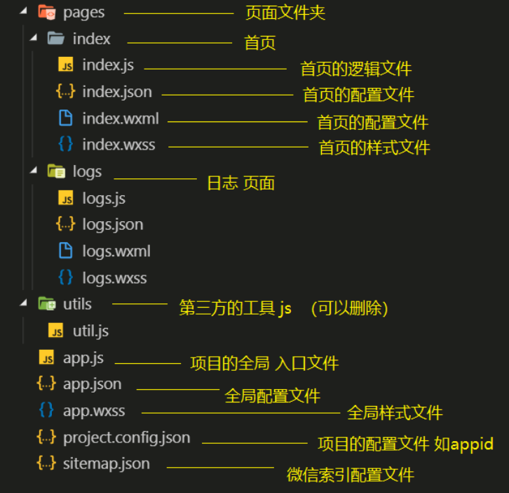
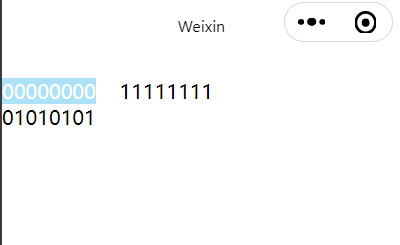
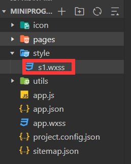
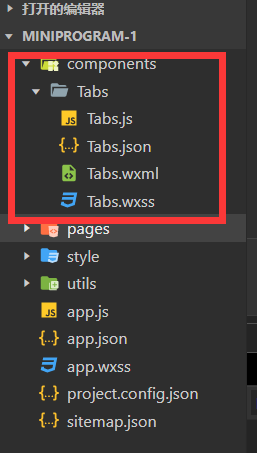

# 1	微信小程序

## 1.1	微信小程序概述

##### 什么是微信小程序

- 微信小程序，简称小程序，英文名 Mini Program ，是⼀种不需要下载安装即可使⽤的应⽤，它实现
  了应⽤“触手可及”的梦想，用户扫⼀扫或搜⼀下即可打开应⽤。

##### 微信小程序的优势

- 为什么是微信⼩程序 ？
- 微信有海量⽤⼾，⽽且粘性很⾼，在微信⾥开发产品更容易触达⽤⼾；
- 推⼴app 或公众号的成本太⾼。
- 开发适配成本低。
- 容易⼩规模试错，然后快速迭代。
- 跨平台。

---

<br>

## 1.2	开发环境搭建

##### 说明

- 由于腾讯发布的微信开发者工具编码体验较差，建议**使用 VS code 进行开发**，**使用微信开发者工具进行预览**。

---

<br>

## 1.3	微信小程序框架

### 1.3.0	微信小程序框架概述

##### 微信小程序框架的目标

- 小程序框架的目标是通过尽可能简单、高效的方式让开发者可以在微信中开发具有原生 APP 体验的服务。

##### 微信小程序框架的特点

- 小程序框架提供了自己的视图层描述语言 WXML 和 WXSS，使用 JavaScript 进行逻辑处理，并在视图层与逻
  辑层间提供了数据传输和事件系统，让开发者能够专注于数据与逻辑。

##### 小程序文件结构和传统 web 之间的对比

|      | 传统 web   | 微信小程序 |
| ---- | ---------- | ---------- |
| 结构 | HTML       | WXML       |
| 样式 | CSS        | WXSS       |
| 逻辑 | Javascript | Javascript |
| 配置 | 无         | JSON       |

---

<br>

### 1.3.1	小程序框架目录结构

##### 小程序框架结构图



---

<br>

### 1.3.2	全局配置文件

##### 说明

- ⼀个小程序应用程序会包括最基本的两种配置文件。⼀种是全局的 app.json 和 页面自己的page.json。
- app.json 包括了小程序的所有页面路径、界⾯表现、⽹络超时时间、底 部 tab 等。

##### app.json（稳定版 Stable Build (1.05.2102010)）

```json
{
  "pages":[
    "pages/index/index",
    "pages/logs/logs"
  ],
  "window":{
    "backgroundTextStyle":"light",
    "navigationBarBackgroundColor": "#fff",
    "navigationBarTitleText": "Weixin",
    "navigationBarTextStyle":"black"
  },
  "style": "v2",
  "sitemapLocation": "sitemap.json"
}
```

##### pages 字段

- 用于描述当前小程序所有页面路径，为了让微信客⼾端知道当前小程序页面定义在哪个⽬录。

##### window 字段

- 定义小程序所有页面的顶部背景颜色，文字颜色定义等。

##### tabbar 字段

- 用于定义页面导航栏.

- 常用属性如图：

  

##### 完整的配置信息

- 请参考 [全局配置|微信开发文档](https://developers.weixin.qq.com/miniprogram/dev/reference/configuration/app.html)。

---

<br>

### 1.3.3	页面配置文件 page.json

##### 说明

- 页面目录下的 page.json 用于进行和⼩程序⻚⾯相关的配置。 开发者可以独⽴定义每个⻚⾯的⼀些属性，如顶部颜⾊、是否允许下拉刷新等等。 
- 页面的配置只能设置 app.json 中部分 window 配置项的内容，**页面配置中配置项会覆盖 app.json 的 window 中相同的配置项**。

---

<br>

### 1.3.4	sitemap.json

##### 说明

- 微信现已开放小程序内搜索，开发者可以通过 `sitemap.json` 配置，或者管理后台页面收录开关来配置其小程序页面是否允许微信索引。当开发者允许微信索引时，微信会通过爬虫的形式，为小程序的页面内容建立索引。当用户的搜索词条触发该索引时，小程序的页面将可能展示在搜索结果中。

---

<BR>

# 2	常用组件

## 2.1	文字 \<text>

##### \<text>

- 类似于 HTML 中的 `<span>` 标签，属于行内标签。

- **特性**：

  - `<text>` 中只能嵌套 `<text>`
  - ⻓按可以复制 `<text>` 中的文字（只有 `<text>` 标签支持这个功能）
  - 可以对空格、回车等字符进行解码。

- **属性**：

  | 属性名     | 默认值 | 说明               |
  | ---------- | ------ | ------------------ |
  | selectable | false  | 文本是否可选       |
  | decode     | false  | 是否对字符进行解码 |

##### 例

```html
<text selectable decode="true">
    00000000&nbsp;&nbsp;&nbsp;&nbsp;11111111
  	<text>01010101</text>
</text>
```

- 输出：

  

---

<br>

## 2.2	布局 \<view>

##### \<view>

- 类似于 HTML 中的 \<div> 标签，属于块标签。

---

<br>

## 2.3	占位 \<block>

##### 说明

- 占位符标签，只在代码中存在，页面渲染时会把它移除。

##### 作用

- 渲染数据时，如果不想要添加额外的标签，可以使用 `block` 标签。

##### 例

```html
<view>
    <block>{{"测试1"}}</block>
    <block>{{"测试2"}}</block>
    <block>{{"测试3"}}</block>
    <block>{{"测试4"}}</block>
</view>
```

---

<br>

## 2.4	图片 \<image>

##### 特性

- image 组件默认宽度 320px、⾼度240px
- image 支持懒加载

##### 属性

| 属性名    | 类型    | 默认值      | 说明              |
| --------- | ------- | ----------- | ----------------- |
| src       | String  |             | 图片资源地址      |
| mode      | String  | scaleToFill | 图片剪裁/缩放模式 |
| lazy-mode | Boolean | false       | 图片懒加载        |

##### mode 的有效值

| 值           | 说明                                                         | 最低版本                                                     |
| :----------- | :----------------------------------------------------------- | :----------------------------------------------------------- |
| scaleToFill  | 缩放模式，不保持纵横比缩放图片，使图片的宽高完全拉伸至填满 image 元素 |                                                              |
| aspectFit    | 缩放模式，保持纵横比缩放图片，使图片的长边能完全显示出来。也就是说，可以完整地将图片显示出来。 |                                                              |
| aspectFill   | 缩放模式，保持纵横比缩放图片，只保证图片的短边能完全显示出来。也就是说，图片通常只在水平或垂直方向是完整的，另一个方向将会发生截取。 |                                                              |
| widthFix     | 缩放模式，宽度不变，高度自动变化，保持原图宽高比不变         |                                                              |
| heightFix    | 缩放模式，高度不变，宽度自动变化，保持原图宽高比不变         | [2.10.3](https://developers.weixin.qq.com/miniprogram/dev/framework/compatibility.html) |
|              |                                                              |                                                              |
| top          | 裁剪模式，不缩放图片，只显示图片的顶部区域                   |                                                              |
| bottom       | 裁剪模式，不缩放图片，只显示图片的底部区域                   |                                                              |
| center       | 裁剪模式，不缩放图片，只显示图片的中间区域                   |                                                              |
| left         | 裁剪模式，不缩放图片，只显示图片的左边区域                   |                                                              |
| right        | 裁剪模式，不缩放图片，只显示图片的右边区域                   |                                                              |
| top left     | 裁剪模式，不缩放图片，只显示图片的左上边区域                 |                                                              |
| top right    | 裁剪模式，不缩放图片，只显示图片的右上边区域                 |                                                              |
| bottom left  | 裁剪模式，不缩放图片，只显示图片的左下边区域                 |                                                              |
| bottom right | 裁剪模式，不缩放图片，只显示图片的右下边区域                 |                                                              |

---

<br>

## 2.5	轮播图 \<swiper>

##### 说明

- 微信内置的轮播图组件，`<swiper>` 中只可放置 `<swiper-item>` 组件，否则会导致未定义的行为。

##### 特点

- 宽度固定为 100%，高度默认为 150px。
- `<swiper>` 不会自适应内容大小，必须手动设置。

##### \<swiper> 的常用属性

| 属性                   | 类型    | 默认值            | 必填 | 说明                 |
| :--------------------- | :------ | :---------------- | :--- | :------------------- |
| indicator-dots         | boolean | false             | 否   | 是否显示面板指示点   |
| indicator-color        | color   | rgba(0, 0, 0, .3) | 否   | 指示点颜色           |
| indicator-active-color | color   | #000000           | 否   | 当前选中的指示点颜色 |
| autoplay               | boolean | false             | 否   | 是否自动切换         |
| current                | number  | 0                 | 否   | 当前所在滑块的 index |
| interval               | number  | 5000              | 否   | 自动切换时间间隔     |
| duration               | number  | 500               | 否   | 滑动动画时长         |
| circular               | boolean | false             | 否   | 是否采用衔接滑动     |

##### 例

```css
/* index.wxss*/
swiper{
    width:100%;
    height:1392rpx;
}
```

```html
<swiper 
        indicator-dots indicator-color="fff" 
        indicator-active-color="000"
        autoplay
        interval="2"
        duration="0.5"
        circular
        >
	<swiper-item>
        
    </swiper-item>
    
    <swiper-item>
        
    </swiper-item>
    
    <swiper-item>
              
    </swiper-item>
    
</swiper>
```

---

<br>

## 2.6	导航 \<navigator>

##### 说明

- 类似于 HTML 中的 `<a>` 标签，用于跳转页面。

##### 特点

- 默认为块标签，可以设置宽和高。

##### 常用属性

| 属性      | 类型   | 默认值   | 必填 | 说明                                 | 最低版本                                                     |
| :-------- | :----- | :------- | :--- | :----------------------------------- | :----------------------------------------------------------- |
| target    | string | self     | 否   | 在哪个目标上发生跳转，默认当前小程序 | [2.0.7](https://developers.weixin.qq.com/miniprogram/dev/framework/compatibility.html) |
| url       | string |          | 否   | 当前小程序内的跳转链接               | [1.0.0](https://developers.weixin.qq.com/miniprogram/dev/framework/compatibility.html) |
| open-type | string | navigate | 否   | 跳转方式                             | [1.0.0](https://developers.weixin.qq.com/miniprogram/dev/framework/compatibility.html) |

##### open-type 属性的有效值

| 值           | 说明                                                         | 最低版本                                                     |
| :----------- | :----------------------------------------------------------- | :----------------------------------------------------------- |
| navigate     | 保留当前⻚⾯，跳转到应⽤内的某个⻚⾯，但是不能跳转到 tabbar 中包含的页面 |                                                              |
| redirect     | 关闭当前⻚⾯，跳转到应⽤内的某个⻚⾯，但是不允许跳转到 tabbar 中包含的页面 |                                                              |
| switchTab    | 跳转到 tabBar ⻚⾯（只可以跳转到 tabBar 页面），并关闭其他所有⾮ tabBar ⻚⾯ |                                                              |
| reLaunch     | 关闭所有页面，打开到应⽤内的某个⻚⾯（可以打开 tabBar 页面和⾮ tabBar ⻚⾯） | [1.1.0](https://developers.weixin.qq.com/miniprogram/dev/framework/compatibility.html) |
| navigateBack | 关闭当前⻚⾯，返回上⼀⻚⾯或多级⻚⾯。可通过 getCurrentPages() 获取当 前的⻚⾯栈，决定需要返回⼏层 | [1.1.0](https://developers.weixin.qq.com/miniprogram/dev/framework/compatibility.html) |
| exit         | 退出小程序，`target="miniProgram"`时生效                     | [2.1.0](https://developers.weixin.qq.com/miniprogram/dev/framework/compatibility.html) |

##### 使用技巧

- **使用 reLaunch 和 navigateBack 切换页面**：在本页面中使用 reLaunch 属性的 `<navigator>` 标签进行跳转，在目标页面中使用 navigateBack 属性的 `<navigator>` 标签进行返回。

---

<br>

## 2.7	富文本 \<rich-text> 

##### 说明

- 可以将字符串解析成对应的 HTML 标签，类似 vue 中 v-html 功能。

##### 例

```js
//demo.js
Page({
  data: {
    html:'<div style="color: blue;" ><p>Hello&nbsp;World!</p></div>',
    nodes: [{
      name: 'div',
      attrs: {
        class: 'div_class',
        style: 'color: red;'
     },
      children: [{
        type: 'text',
        text: 'Hello&nbsp;World!'
     }]
   }]
  }
)}
```

```html
<!-- demo.wxml -->
<rich-text nodes="{{nodes}}" ></rich-text>

<rich-text nodes="{{html}}" ></rich-text>

<rich-text nodes='<div style="color: green;" ><p>Hello&nbsp;World!</p></div>' ></rich-text>
```

##### 📌rich-text 中可以使用的 HTML 标签与属性

- `<rich-text>` 支持的 HTML 标签参见 [rich-text| 微信开放文档](https://developers.weixin.qq.com/miniprogram/dev/component/rich-text.html)。
- `<rich-text>` 全局支持 class 和 style 属性，**不支持 id 属性**。

---

<br>

## 2.8	按钮 \<button>

##### 说明

- 微信小程序框架提供的按钮，有一些特有的功能

##### 常用属性

| 属性      | 类型    | 默认值  | 必填 | 说明                                                         | 最低版本                                                     |
| :-------- | :------ | :------ | :--- | :----------------------------------------------------------- | :----------------------------------------------------------- |
| size      | string  | default | 否   | 按钮的大小                                                   | [1.0.0](https://developers.weixin.qq.com/miniprogram/dev/framework/compatibility.html) |
| type      | string  | default | 否   | 按钮的样式类型                                               | [1.0.0](https://developers.weixin.qq.com/miniprogram/dev/framework/compatibility.html) |
| plain     | boolean | false   | 否   | 按钮是否镂空，背景色透明                                     | [1.0.0](https://developers.weixin.qq.com/miniprogram/dev/framework/compatibility.html) |
| disabled  | boolean | false   | 否   | 是否禁用                                                     | [1.0.0](https://developers.weixin.qq.com/miniprogram/dev/framework/compatibility.html) |
| loading   | boolean | false   | 否   | 名称前是否带 loading 图标                                    | [1.0.0](https://developers.weixin.qq.com/miniprogram/dev/framework/compatibility.html) |
| form-type | string  |         | 否   | 用于 [form](https://developers.weixin.qq.com/miniprogram/dev/component/form.html) 组件，点击分别会触发 [form](https://developers.weixin.qq.com/miniprogram/dev/component/form.html) 组件的 submit/reset 事件 | [1.0.0](https://developers.weixin.qq.com/miniprogram/dev/framework/compatibility.html) |
| open-type | string  |         | 否   | 微信开放能力                                                 | [1.1.0](https://developers.weixin.qq.com/miniprogram/dev/framework/compatibility.html) |

##### open-type 的合法值

| 值             | 说明                                                         | 最低版本                                                     |
| :------------- | :----------------------------------------------------------- | :----------------------------------------------------------- |
| contact        | 打开客服会话，如果用户在会话中点击消息卡片后返回小程序，可以从 bindcontact 回调中获得具体信息，[具体说明](https://developers.weixin.qq.com/miniprogram/dev/framework/open-ability/customer-message/customer-message.html) （*小程序插件中不能使用*） | [1.1.0](https://developers.weixin.qq.com/miniprogram/dev/framework/compatibility.html) |
| share          | 触发用户转发，使用前建议先阅读[使用指引](https://developers.weixin.qq.com/miniprogram/dev/framework/open-ability/share.html#使用指引) | [1.2.0](https://developers.weixin.qq.com/miniprogram/dev/framework/compatibility.html) |
| getPhoneNumber | 获取用户手机号，可以从bindgetphonenumber回调中获取到用户信息，[具体说明](https://developers.weixin.qq.com/miniprogram/dev/framework/open-ability/getPhoneNumber.html) *（小程序插件中不能使用）* *（非企业小程序不可使用该功能）* *（需要结合事件使用）* | [1.2.0](https://developers.weixin.qq.com/miniprogram/dev/framework/compatibility.html) |
| getUserInfo    | 获取用户信息，可以从bindgetuserinfo回调中获取到用户信息 （*小程序插件中不能使用*） | [1.3.0](https://developers.weixin.qq.com/miniprogram/dev/framework/compatibility.html) |
| launchApp      | 打开APP，可以通过app-parameter属性设定向APP传的参数[具体说明](https://developers.weixin.qq.com/miniprogram/dev/framework/open-ability/launchApp.html) | [1.9.5](https://developers.weixin.qq.com/miniprogram/dev/framework/compatibility.html) |
| openSetting    | 打开授权设置页                                               | [2.0.7](https://developers.weixin.qq.com/miniprogram/dev/framework/compatibility.html) |
| feedback       | 打开“意见反馈”页面，用户可提交反馈内容并上传[日志](https://developers.weixin.qq.com/miniprogram/dev/api/base/debug/wx.getLogManager.html)，开发者可以登录[小程序管理后台](https://mp.weixin.qq.com/)后进入左侧菜单“客服反馈”页面获取到反馈内容 | [2.1.0](https://developers.weixin.qq.com/miniprogram/dev/framework/compatibility.html) |

---

<br>

## 2.9	图标 \<icon>

##### 说明

- 图标。组件属性的长度单位默认为 px，2.4.0 起支持传入单位(rpx/px)。

##### 属性

| 属性  | 类型          | 默认值 | 必填 | 说明                                                         | 最低版本                                                     |
| :---- | :------------ | :----- | :--- | :----------------------------------------------------------- | :----------------------------------------------------------- |
| type  | string        |        | 是   | icon的类型，有效值：success, success_no_circle, info, warn, waiting, cancel, download, search, clear | [1.0.0](https://developers.weixin.qq.com/miniprogram/dev/framework/compatibility.html) |
| size  | number/string | 23     | 否   | icon的大小                                                   | [1.0.0](https://developers.weixin.qq.com/miniprogram/dev/framework/compatibility.html) |
| color | string        |        | 否   | icon的颜色，同css的color                                     | [1.0.0](https://developers.weixin.qq.com/miniprogram/dev/framework/compatibility.html) |

---

<br>

## 2.10	单选框  \<radio>

##### 说明

- 单选，需要与 radio group 一起使用。

##### 属性

| 属性     | 类型    | 默认值  | 必填 | 说明                                                         | 最低版本                                                     |
| :------- | :------ | :------ | :--- | :----------------------------------------------------------- | :----------------------------------------------------------- |
| value    | string  |         | 否   | [radio](https://developers.weixin.qq.com/miniprogram/dev/component/radio.html) 标识。当该[radio](https://developers.weixin.qq.com/miniprogram/dev/component/radio.html) 选中时，[radio-group](https://developers.weixin.qq.com/miniprogram/dev/component/radio-group.html) 的 change 事件会携带[radio](https://developers.weixin.qq.com/miniprogram/dev/component/radio.html)的value | [1.0.0](https://developers.weixin.qq.com/miniprogram/dev/framework/compatibility.html) |
| checked  | boolean | false   | 否   | 当前是否选中                                                 | [1.0.0](https://developers.weixin.qq.com/miniprogram/dev/framework/compatibility.html) |
| disabled | boolean | false   | 否   | 是否禁用                                                     | [1.0.0](https://developers.weixin.qq.com/miniprogram/dev/framework/compatibility.html) |
| color    | string  | #09BB07 | 否   | radio的颜色，同css的color                                    | [1.0.0](https://developers.weixin.qq.com/miniprogram/dev/framework/compatibility.html) |

---

<br>

## 2.11	复选框 \<checkbox>

##### 说明

- 复选框。可以搭配 checkbox-group ⼀起使⽤

属性

| 属性     | 类型    | 默认值  | 必填 | 说明                                                         | 最低版本                                                     |
| :------- | :------ | :------ | :--- | :----------------------------------------------------------- | :----------------------------------------------------------- |
| value    | string  |         | 否   | [checkbox](https://developers.weixin.qq.com/miniprogram/dev/component/checkbox.html)标识，选中时触发[checkbox-group](https://developers.weixin.qq.com/miniprogram/dev/component/checkbox-group.html)的 change 事件，并携带 [checkbox](https://developers.weixin.qq.com/miniprogram/dev/component/checkbox.html) 的 value | [1.0.0](https://developers.weixin.qq.com/miniprogram/dev/framework/compatibility.html) |
| disabled | boolean | false   | 否   | 是否禁用                                                     | [1.0.0](https://developers.weixin.qq.com/miniprogram/dev/framework/compatibility.html) |
| checked  | boolean | false   | 否   | 当前是否选中，可用来设置默认选中                             | [1.0.0](https://developers.weixin.qq.com/miniprogram/dev/framework/compatibility.html) |
| color    | string  | #09BB07 | 否   | checkbox的颜色，同css的color                                 | [1.0.0](https://developers.weixin.qq.com/miniprogram/dev/framework/compatibility.html) |

---

<br>

# 3	WXML 模板语法

## 3.1	数据绑定

##### 一般写法

```html
<view>{{字符串或/值}}</view>
或
<view>{{{data 中定义的属性名}}</view>
```

- **例**：

  ```
  //demo.js
  Page({
    data: {
      "name":"Hello World"
    },
  ```

  ```
  <view>{{name}}</view>
  <view>{{"你好世界"}}</view>
  ```

##### 组件属性 

```html
<view data-num="{{data 中定义的属性名}}"> </view>
```

- 例：

  ```html
  <checkbox checked = "{{false}}"></checkbox>
  ```

---

<br>

## 2.4	


---

<br>

## 3.2	运算

##### 说明

- 在 `{{}}` 中可以插入表达式进行运算，可以插入的表达式包括：
  1. 算数表达式*（如加减乘除等）*。
  2. 字符串拼接
  3. 三元运算
  4. 逻辑判断

##### 例

```html
<!-- 算数表达式 -->
<view>{{1 + 1}}</view> 

<!-- 字符串拼接 -->
<view>{{'1'+'1'}}</view>

<!-- 三元运算 -->
<view> {{ true ? "真" : "假" }} </view>
```

- 输出结果：

  ```sh
  2
  11
  真
  ```

---

<br>

## 3.3	列表渲染 wx:for

##### 列表循环

- **说明**：遍历列表中的所有元素。

- **例**：

  ```js
  Page({
    data: {
  	demolist:[
  	{	id:"一",
  		name:"张三"
  	},
  	{	id:"二",
  		name:"李四"
  	},
  	{	id:"三",
  		name:"王二"
  	},
  	{	id:"四",
  		name:"麻子"
  	}]
  }
  )}
  ```

  ```html
  <view wx:for="{{demoList}}" vx:for-item="item" vx:for-index="index">
    <view>index:{{index}}</view> 
    <view>item.id:{{item.id}}</view>
    <view>item.name:{{item.name}}</view>
  </view>
  ```

- 📌**注意**：

  - 嵌套循环时，内循环和外循环的 `for-item` 属性 和 `for-index` 属性不能重名。
  - 如果只有单层循环，可以省略  `for-item` 属性 和 `for-index` 属性。

##### 对象循环

- **说明**：遍历对象中所有属性。

- **例**：

  ```
  Page({
    data: {
  	demoObject:{
  		name:"张三",
  		age:"18",
  		gender:"男"
  	}
  }
  )}
  ```

  ```html
  <view wx:for="{{demoObject}}">
    <text>{{index}}</text>
    <text>{{item}}</text>
  </view>
  ```

- 📌**注意**：

  - 此时的 `index` 代表对象的属性名， `item` 代表对象的属性值。
  - 循换对象时，建议使用  `for-item` 属性 和 `for-index` 属性将 index 和 item 的名称分别改为 `key` 和 `value`，防止混淆。 

##### wx:key

- **为什么需要使用 `wx:key`**：当数据改变触发渲染层重新渲染的时候，会校正带有 key 的组件，框架会确保他们被重新排序，而不是重新创建，以确保使组件保持自身的状态，并且提高列表渲染时的效率。

- **使用 wx:key**：

  - `wk:key="字符串"`，字符串代表在 `for` 循环的 `item` 的某个属性，该属性的值必须是整个列表中**唯一的值**，**且不会发生改变**，例：

    ```
    Page({
      data: {
    	demolist:[
    	{	id:"一",
    		name:"张三"
    	},
    	{	id:"二",
    		name:"李四"
    	},
    	{	id:"三",
    		name:"王二"
    	},
    	{	id:"四",
    		name:"麻子"
    	}]
    }
    )}
    ```

    ```html
    <view wx:for="{{demoList}}" vx:for-item="item" vx:for-index="index" vx:key = "id">
      <view>index:{{index}}</view> 
      <view>item.id:{{item.id}}</view>
      <view>item.name:{{item.name}}</view>
    </view>
    ```

  - `wk:key="*this"`,代表在 for 循环中使用的 key 是i tem 自身，此时 item 必须是唯一的字符串或者数字。

    ```
    Page({
      data: {
    	demolist2:[
    		"一",
    		"二",
    		"三",
    		"四"
    	]
    }
    )}
    ```

    ```html
    <view wx:for="{{demolist2}}" vx:key = "*item">
      <view>{{item}}</view> 
    </view>
    ```

---

<br>

## 3.4	条件渲染

### 3.4.1	wx:if

##### 实现原理与适用场景

- `wx:if`  通过将标签直接从页面结构移除来达到显示效果，对性能消耗较大，适用于切换不频繁的场景。

##### 例

```html
<view wx:if="{{true}}">显示</view>
<view wx:if="{{false}}">隐藏</view>

<view wx:if="{{false}}">1</view>
<view wx:elif="{{flase}}">2</view>
<view wx:else>3</view>
```

- **显示**：

  ```html
  显示
  3
  ```

---

<br>

### 3.4.2	hidden

##### 实现原理和适用场景

- `hidden` 通过为标签添加样式来实现隐藏，适用于需要频繁切换的场景。

##### 例

```html
<view hidden>1</view>
<view hidden = "{{true}}">2</view>
<view hidden = "{{false}}">3</view>
<view hidden = "{{1 + 1 != 2}}">4</view>
```

- **显示**：

  ```html
  3
  4
  ```

##### 📌hidden 的优先级

- hidden 的优先级低于标签 style 中设置的 display 样式，所以 不要把 hidden 和 display 放在一起使用，例：

  ```html
  <view hidden style="display:flex">不会被隐藏</view>
  ```

---

<br>

# 4	事件绑定

## 4.1	双向绑定

##### 📌微信小程序框架的赋值语法

- **说明**：微信小程序的赋值语法与 JavaScript 或 Vue 中的有很大的区别。

- **语法**：

  ```js
  this.setData({ 
   [变量名]:[赋予的值]
  })
  ```

##### 例

```js
Page({
  data: {
    num:0
  },
  handleInput(e){
    console.log(e);
    console.log(e.detail);
    console.log(e.detail.value);
      
    //微信小程序框架特有的赋值方法
    this.setData({ 
      num:e.detail.value
    })
  }
)}
```

```html
<input type="text" bindinput="handleInput" /><!-- 使用 bindinput 为 input 标签添加输入事件 -->
<view>{{num}}</view>
```

##### 📌微信小程序的传参语法

- 在微信小程序框架中，不能直接给函数的参数进行传值，因为小程序框架会将参数识别为函数名的一部分。*（比如 `fun1(1)` 会被识别为函数名  `fun(1)`，不会再调用  `fun(num)`）*

- **语法**：

  ```js
  page({
      data:{
          num:0
      },
    　handleTap(e){
      //获取自定义属性 operation
      console.log(e.currentTarget.dataset.operation)
      this.setData({
          num:this.data.num +　e.currentTarget.dataset.operation
      })
  })
  ```

  ```html
  <button bindtab="handleTab" data-operation="{{1}}"/><!-- 自定义属性 operation -->
  ```

---

<br>

# 5	样式

## 5.1	rpx

##### 说明

- rpx（responsive pixel）是微信小程序框架特有的长度单位，可以根据屏幕宽度进行自适应。
- 规定屏幕宽为 750rpx 。如在 iPhone6 上，屏幕宽度为 375px ，共有750个物理像素，则 750rpx = 375px = 750物理像 素 ， 1rpx = 0.5px = 1物理像素 。

##### rpx 换算

| 设备 |      |
| ---- | ---- |
|      |      |
|      |      |
|      |      |

设备 rpx换算px (屏幕宽度/750) px换算rpx (750/屏幕宽度) iPhone5 1rpx = 0.42px 1px = 2.34rpx iPhone6 1rpx = 0.5px 1px = 2rpx iPhone6 Plus 1rpx = 0.552px 1px = 1.81rpx

---

<br>

## 5.2	样式导入

##### 说明

- wxss 支持使用 @import 语句导入外联样式表*（import 语句只支持相对路径）*。

##### 例——导入 style 目录下的 wxss 文件

- wxss 文件位置



- 在需要该 wxss 文件的页面中引入

  ```css
  @import "../../style/s1.wxss";
  ```

---

<br>

## 5.3	选择器（未完成）

##### 📌小程序不支持通配符 *

- 由于微信小程序框架不支持 `*`，所以下列代码无效：

  ```css
  *{
  	margin:0;
      padding:0;
      box-sizing:border-box:
  }
  ```

##### 目前小程序支持的选择器

|      |      |      |
| ---- | ---- | ---- |
|      |      |      |
|      |      |      |
|      |      |      |

---

 <br>

## 5.4	less（未完成）


---

<br>

# 6	自定义组件

## 6.1	基础

##### 创建自定义组件

1. 在微信小程序的根目录下 创建文件夹 components
2. 在 components 文件夹下新建文件夹，该文件夹与自定义组件同名
3. 在上述文件夹中创建与自定义组件同名的 wxss、wxml、json、js 文件，可以通过微信开发者工具进行一键创建。



##### 使用自定义组件

1. 在页面的 json 文件中引入自定义组件

   ```js
   //.json
   {
    // 引用声明
    "usingComponents": {
     // 要使用的组件的名称     // 组件的路径
        "Tabs":"/components/Tabs/Tabs"
     }
   }
   ```

2. 在 wxml 中使用自定义组件标签

   ```html
   <tabs/>
   ```

---

<br>

## 6.2	父组件向子组件传递数据

---

<br>

## 6.3	子组件向父组件传递数据

---

<br>

## 6.4	slot

---

<br>

## 6.5	自定义组件的其他属性

---

<br>

## 6.5	[例][]

---

<br>

# 7	生命周期

## 7.1	应用生命周期

##### 说明

- 应用程序生命周期函数在 app.js 文件中定义。

##### onLaunch()

- **触发时机**：小程序初次启动时触发。
- **用途**：可以用于在小程序初次启动的时，获取用户个人信息 。

##### onShow()

- **触发时机**：小程序界面加载完毕后。
- **用途**：可以用于重置页面数据或动画效果。

##### onHide()

- **触发时机**：用户离开小程序界面。
- **用途**：
  1. 可以用于暂停计时器
  2. 可以用于保存页面状态

#####  onError(err)

- **触发时机**：小程序出现错误时。
- **用途**：可以用于收集错误信息，通过异步请求将错误信息发送至后台。

##### onPageNotFound()

- **触发时机**：小程序启动时，如果找不到入口页面将触发。

- **用途**：如果入口页面不存在，可以在该函数中通过 js 的方式来重新跳转页面。

- **例**：

  ```js
  App({
  	onPageNotFound(){
  		//跳转到demo页面
  		wx.navigateTo({
      	  url: '/pages/demo/demo' 
      	});
      }
  })
  ```

---

<br>

## 7.2	页面生命周期


---

<br>

# 附录

##### 最后编辑时间

- 2021/03/09

##### 环境

- 

##### 参考

- [微信开放文档](https://developers.weixin.qq.com/miniprogram/dev/framework/)
- [黑马程序员Web前端教程_零基础玩转微信小程序](https://www.bilibili.com/video/BV1nE41117BQ)

##### 相关资料

- 

##### 脚注

[^xxx]: 

##### 代码链接

[1]:

##### 锚点

[](#1) 

##### 质疑

[^!1]: 

##### 疑问

[^?1]: 
