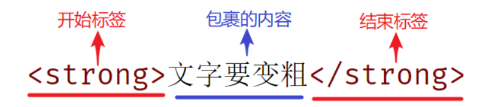
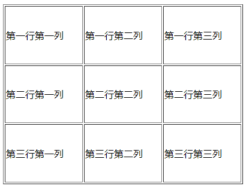
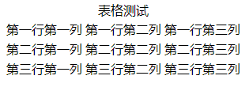
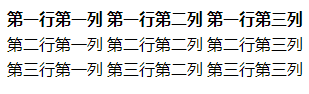
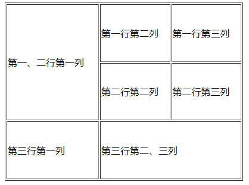
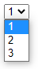

<div STYLE="page-break-after: always;">
	<br>
    <br>
    <br>
    <br>
    <br>
    <br>
    <br>
    <br>
    <br>
    <br>
	<center><h3><font size="20px">
        HTML
    </font></h3></center>
	<br>
    <br>
    <br>
    <br>
    <br>
    <br>
    <br>
    <br>
    <br>
    <br>
</div>


# 1	HTML 概述

## 1.1	HTML 简介

#### HTML 简介

HTML（Hyper Text Markup Language，超文本标记语言）是专门用于网页开发的语言，主要通过 HTML 标签对网页中的文本、图片、音频、视频等内容进行描。

<br>

#### HTML 文件的固定结构

```
<html>
	<head>
		<title>{{网页的标题}}</title>
	</head>
	<body>
        {{网页的主体内容}}
    </body>
</html>
```

1. 网页的内容需在 `<html>` 标签中；
2. 标题（`<title>` 标签）、字符格式、语言、兼容性、关键字、描述等信息显示在 `<head>` 标签中；

<br>

#### HTML 标签

HTML 标签是 HTML 语言中最基本的单位，也是最重要的组成部分。

###### HTML 标签的特点

1. 大小写不敏感，例如 `<html>` 和 `<HTML>` 作用相同；
2. 是由尖括号包围的关键词，例如 `<html>`。

###### 双标签

常见标签由两部分组成，称为双标签。



结构说明：

1. 双标签由 `<`、`>`、`/`、英文单词或字母组成。并且把标签中 `<>` 包括起来的英文单词或字母称为标签名；
2. 前部分叫开始标签（开放标签），后部分叫结束标签（闭合标签），两部分之间包裹内容。

###### 单标签

少数标签由一部分组成，称为单标签。单标签自成一体，无法包裹内容。

<br>

#### HTML 标签之间的关系

HTML 标签之间有两种关系：父子关系（嵌套关系）和兄弟关系（并列关系）。可以根据标签关系使用对应的 CSS 选择器。

###### 例——父子关系

```
<head>
	<title></title>
</head>
```

###### 例——兄弟关系

```
<head></head>
</head>
<body></body>
```

<br>

---

<div STYLE="page-break-after: always;"><br>
<br>
<br>
<br>
<br>
<br>
<br>
<br>
<br>
<br></div>

## 1.2	HTML5

#### 什么是 HTML5

HTML5 是 Web 中核心语言之一 HTML 的新一代规范[^1.2-1]。HTML5 技术结合了 HTML4.01 的相关标准并革新，在 2008 年正式发布，在 2012 年已形成了稳定的版本。2014年10月28日，W3C发布了HTML5的最终版。

与传统的技术相比，HTML5 的语法特征更加明显，并且结合了 SVG的内容。这些内容在网页中使用可以更加便捷地处理多媒体内容，而且 HTML5中还结合了其他元素，对原有的功能进行调整和修改，进行标准化工作。

<br>

---

[^1.2-1]: 当前是 2022 年。

<div STYLE="page-break-after: always;"><br>
<br>
<br>
<br>
<br>
<br>
<br>
<br>
<br>
<br></div>

# 2	HTML 基础标签

## 2.1	排版标签

#### 排版标签

###### 标题标签

HTML 中有 `<h1>` ~  `<h6>` 共六级标题标签，它们有以下共同特点：

1. 文字都有加粗;
2. 文字都有变大，并且从 `<h1>` 到 `<h6>` 文字逐渐减小;
3. 独占一行.

注意，`<h1>` 标签对于网页尤为重要，开发中有特定的使用场景，如：新闻的标题、网页的 logo 部分。

###### 段落标签

段落标签即 `<p>` 标签，有以下特点：

1. 独占一行
2. 段落之间存在间隙

###### 换行标签

`<br>` 标签可以让文字强制换行显示。

###### 水平线标签

`<hr>` 用于生成一条分隔不同主题内容的水平线。

<br>

#### 四种文本格式化标签

| 标签       | 简写  | 说明   |
| ---------- | ----- | ------ |
| `<strong>` | `<b>` | 加粗   |
| `<ins>`    | `<u>` | 下划线 |
| `<em>`     | `<i>` | 倾斜   |
| `<del>`    | `<s>` | 删除线 |

<br>

#### 媒体标签

###### 图片标签

`` 用于在网页中显示图片。如果 img 标签需要展示对应的效果，需要借助标签的属性进行设置。

常用属性：

1. src：设置目标图片的路径；
2. alt：指定替代文本，用于在图像无法显示或者用户禁用图像显示时，代替图像显示在浏览器中的内容；
3. title：设置提示文本，提示文本是当鼠标悬停时才显示的文本。
4. width 和 height：用于设置宽度和高度，有多种单位。注意：
   1. 如果只设置 width 或 height 中的一个，图片会自动等比例缩放（此时图片不会变形）；
   2. 如果同时设置了 width 和 height，可能导致图片变形（width 和 height 的比例与图片比例不同）；

###### 音频标签

`<audio src="" controls/>` 用于在页面中插入音频。

常用属性：

1. src：音频的路径；
2. controls：显示播放的控件；
3. autoplay：自动播放（部分浏览器不支持）；
4. loop：循环播放。

注意，音频标签目前支持三种格式：MP3、Wav、Ogg。

###### 视频标签

`<video src="" controls/>` 用于在页面中插入视频。

常用属性：

1. src：视频的路径；
2. controls：显示播放的控件；
3. autoplay：自动播放（谷歌浏览器中需配合静音实现静音播放）；
4. loop：循环播放。

注意，视频标签目前支持三种格式：MP4 、WebM 、Ogg。

<br>

#### 链接标签

链接标签又称为  a 标签、超链接、锚链接。

###### 特点

1. 双标签，内部可以包裹内容；
2. a 标签默认文字有下划线 ；
3. a 标签从未点击过，默认文字显示蓝色；
4. a 标签点击过之后，文字显示为紫色（清除浏览器历史记录可恢复蓝色）。

###### 基本语法

```html
<a href="./目标网页.html">链接文字</a>
```

###### 属性

1. href：通过设置 href 属性指定需要跳转的页面；
2. target：设置目标网页的打开形式：
   1. _self：默认值，在当前窗口中跳转（覆盖原网页）
   2. _blank：在新窗口中跳转（保留原网页）

###### 特殊用法——空链接

a 标签的 href 属性如果设置为 #，例如 `<a href="#">空链接</a>`，则为空链接。

作用：

1. 点击之后回到网页顶部；
2. 开发中如果还不确定该链接最终的跳转位置，可以先用空链接占位。

###### 特殊用法——页内跳转（❗需要补充）

 <br>

#### 绝对路径和相对路径

HTML 通过路径加载资源，实现页面跳转，路径可分为：

1. 绝对路径
2. 相对路径

###### 绝对路径

指目录下的绝对位置，可直接到达目标位置，通常是从 **盘符** 开始的路径。

例：

1. 盘符开头：D:\day01\images\1.jpg
2. 完整的网络地址：https://www.itcast.cn/2018czgw/images/logo.gif。

###### 相对路径

从当前文件开始出发，到达目标文件的路径。

相对路径存在三种情况：

1. 同级目录中文件的相对路径：`目标文件名字`
2. 下级目录中文件的相对路径：`文件夹名/目标文件名字`
3. 上级目录中文件的相对路径：`../目标文件名字`

<br>

#### 📌title 属性

title 属性不仅仅可以用于图片标签，还可以用于其他标签。

<br>

---

<div STYLE="page-break-after: always;"><br>
<br>
<br>
<br>
<br>
<br>
<br>
<br>
<br>
<br></div>

## 2.2	HTML 列表标签

#### HTML 列表简介

在网页中按照行的方式，整齐展示关联性的内容，如：新闻列表、排行榜、账单等。

HTML 中的列表分为：

1. 无序列表
2. 有序列表
3. 自定义列表

<br>

#### 无序列表

在网页中表示一组无顺序（列表前是一个黑色圆点）的列表。

###### 语法

```html
<ui>
	<li>111111</li>
	<li>222222</li>
	<li>333333</li>
</ui>
```

- `<ui>`：表示无序列表的整体，用于包裹 `<li>` 标签。`<ui>` 标签中只允许包含 `<li>` 标签；
- `<li>`：表示无序列表的每一项，用于包含每一行的内容。`<li>` 标签可以包含任意内容。

<br>

#### 有序列表

在网页中表示一组有顺序之分（列表前是数字序号）的列表。

###### 语法

```
<ol>
	<li>一一一</li>
	<li>二二二</li>
	<li>三三三</li>
</ol>
```

<br>

#### 自定义列表

###### 语法

```
<dt>
	<dt>自定义列表示例</dt>
	<dd>一一一</dd>
	<dd>二二二</dd>
	<dd>三三三</dd>
</dt>
```

- `<dd>` 前会默认显示缩进效果。

###### 使用场景

网页的底部导航通常会使用自定义列表实现。

---

<div STYLE="page-break-after: always;"><br>
<br>
<br>
<br>
<br>
<br>
<br>
<br>
<br>
<br></div>

## 2.3	HTML 表格标签

#### HTML 表格简介

在网页中以行+列的单元格的方式整齐展示和数据，如：学生成绩表。

<br>

#### 基本语法

```html
<table>
	<tr>
		<td>第一行第一列</td>
		<td>第一行第二列</td>
		<td>第一行第三列</td>
	</tr>
	
	<tr>
		<td>第二行第一列</td>
		<td>第二行第二列</td>
		<td>第二行第三列</td>
	</tr>

	<tr>
		<td>第三行第一列</td>
		<td>第三行第二列</td>
		<td>第三行第三列</td>
	</tr>
</table>
```


<br>

#### 常见相关属性

1. border：边框宽度；
2. width 和 height：表格宽度和高度。注意，可以对 `<table>`、`<tr>` 和 `<td>` 分别设置，但是使用时需要注意。

注意，实际开发时针对于样式效果推荐用 CSS 设置。

###### 例


```html
<table border="1px" width="400px" height="300px">
	<tr width="400px" height="100px">
		<td>第一行第一列</td>
		<td>第一行第二列</td>
		<td>第一行第三列</td>
	</tr>
	
	<tr>
		<td>第二行第一列</td>
		<td>第二行第二列</td>
		<td>第二行第三列</td>
	</tr>

	<tr>
		<td>第三行第一列</td>
		<td>第三行第二列</td>
		<td  width="200px" height="100px">第三行第三列</td>
	</tr>
</table>
```



<br>

#### 表格标题

`<caption>` 标签用于给为表格添加整体大标题。

###### 例

```
<table>
	<caption>表格测试</caption>
	<tr>
		<td>第一行第一列</td>
		<td>第一行第二列</td>
		<td>第一行第三列</td>
	</tr>
	
	<tr>
		<td>第二行第一列</td>
		<td>第二行第二列</td>
		<td>第二行第三列</td>
	</tr>

	<tr>
		<td>第三行第一列</td>
		<td>第三行第二列</td>
		<td>第三行第三列</td>
	</tr>
</table>
```



<br>

#### 表头单元格标签

`<th>` 标签表示一列小标题，通常用于表格第一行，默认内部文字加粗并居中显示。`<th>` 标签书写在第一行 `<tr>` 标签内部，替换 `<td>` 标签。

###### 语法

```
<table>
	<tr>
		<th>第一行第一列</th>
		<th>第一行第二列</th>
		<th>第一行第三列</th>
	</tr>
	
	<tr>
		<td>第二行第一列</td>
		<td>第二行第二列</td>
		<td>第二行第三列</td>
	</tr>

	<tr>
		<td>第三行第一列</td>
		<td>第三行第二列</td>
		<td>第三行第三列</td>
	</tr>
</table>
```



<br>

#### 表格的结构标签v

表格结构标签写在 `<table>` 标签内部，用于包裹 <`tr>` 标签。有三种表格结构标签：

1. `<thead>`：表格头部；
2. `<tbody>`：表格主体；
3. `<tfoot>`：表格底部。

一般，表格的结构标签可以省略。

<br>

#### 合并单元格

将水平或垂直多个单元格合并成一个单元格。

###### 步骤

1. 明确合并哪几个单元格
2. 通过左上原则，确定保留谁删除谁：
   1. 上下合并：只保留最上的，删除其他
   2. 左右合并→只保留最左的，删除其他
3. 给保留的单元格设置：跨行合并（rowspan）或者跨列合并（colspan）。

###### 例

```
<table border="1px" width="400px" height="300px">
	<tr>
		<td rowspan="2">第一、二行第一列</td>
		<td>第一行第二列</td>
		<td>第一行第三列</td>
	</tr>
	
	<tr>
		<td>第二行第二列</td>
		<td>第二行第三列</td>
	</tr>

	<tr>
		<td>第三行第一列</td>
		<td colspan="2">第三行第二、三列</td>
	</tr>
</table>
```



###### 注意

只有同一个结构标签中的单元格才能合并，不能跨结构标签合并（不能跨：thead、tbody、tfoot）。

<br>

---

<div STYLE="page-break-after: always;"><br>
<br>
<br>
<br>
<br>
<br>
<br>
<br>
<br>
<br></div>

## 2.4	表单标签

#### \<input>

`<input>` 标签用于在网页中显示收集用户信息。

###### type 属性

`<input>` 标签可以通过 type 属性的不同值，展示不同效果。

| type 属性值 | 说明                                                         |
| ----------- | ------------------------------------------------------------ |
| text        | 文本框，用于输入单行文本                                     |
| password    | 密码框，用于输入密码                                         |
| radio       | 单选框，用于多选一                                           |
| checkbox    | 多选框，用于多选多                                           |
| file        | 文件选择，用于选择需要上传的文件（实际上提交了文件的访问路径） |
| submit      | 提交按钮，用于提交                                           |
| reset       | 重置按钮，用于重置                                           |
| button      | 普通按钮，默认无功能，需要通过 js 添加功能。                 |

注意，type 的属性值不能拼错或者多加空格，否则相当于默认状态，即 text。

###### value 属性

用于绑定用户输入的内容。

###### name 属性

一般用于描述当前控件的作用。

###### placeholder 属性

占位符，可以用于文本框和密码框，用于提示用户输入内容的文本。

<br>

#### \<textarea>

提供可输入多行文本的表单（相当于可以多行输入的 `<input>` 标签）。

###### 常见属性

1. cols：规定了文本域内可见宽度
2. rows：规定了文本域内可见行数

###### 注意点

1. 右下角可以拖拽改变大小；
2. 实际开发时针对于样式效果推荐用 CSS 设置。

<br>

#### \<button>

按钮标签。

###### type 属性

| type 属性值 | 说明                                         |
| ----------- | -------------------------------------------- |
| button      | 普通按钮。默认无功能，需要通过 js 添加功能。 |
| submit      | 提交按钮。点击之后提交数据给后端服务器       |
| reset       | 重置按钮。点击之后恢复表单默认值。           |

注意，谷歌浏览器中 button 的 type 默认是 submit。

<br>

#### \<select>

提供多个选择项的下拉菜单表单控件。

###### 语法

```html
<select>
	<option>1</option>
	<option>2</option>
	<option>3</option>
</select>
```



- `<select>`：下拉菜单的整体
- `<option>`：下拉菜单的每一项

###### selected 属性

下拉菜单的默认选中。

<br>

#### \<label>

通常和 `<input>`、`<textarea>` 或 `<select>` 一起使用，标明 `<input>` 等控件的作用。

如果 `<label>` 与 `<input>` 等标签进行了绑定，当用户点击 `\<label>` 标签中的文本时，浏览器就会自动将焦点转到和该标签相关联的控件上。这个功能在单选按钮和复选按钮上经常被使用，使用后，点击单选按钮或复选按钮的文本也可以选中。

<br>

---

<div STYLE="page-break-after: always;"><br>
<br>
<br>
<br>
<br>
<br>
<br>
<br>
<br>
<br></div>

## 2.5	语义化标签

#### 无语义的布局标签

实际开发网页时会大量频繁的使用到 `<div>` 和 `<span>` 这两个无语义的布局标签：

1. `<div>`：一行只显示一个（独占一行）；
2. `<span>`：一行可以显示多个。

<br>

#### 有语义的布局标签

在 HTML5 新版本中，推出了一些有语义的布局标签供开发者使用。

| 标签名  | 语义       |
| ------- | ---------- |
| header  | 网页头部   |
| nav     | 网页导航   |
| footer  | 网页底部   |
| aside   | 网页侧边栏 |
| section | 网页区块   |
| article | 网页文章   |

注意，以上标签的显示特点和 `<div>` 相同，但是比 `<div>` 多了不同的语义。

<br>

---

<div STYLE="page-break-after: always;"><br>
<br>
<br>
<br>
<br>
<br>
<br>
<br>
<br>
<br></div>

# 3	HTML 特性

## 3.1	字符实体

#### HTML 的空格合并现象

如果在html代码中同时并列出现多个空格、换行、缩进等，最终浏览器只会解析出一个空格。

<br>

#### 什么是字符实体

特殊符号往往不能在网页中直接输出，需要使用字符实体替代。

<br>

#### 字符实体的结构

```html
&【名称或编号】;
```

<br>

### 常见字符实体

| 显示结果 | 描述     | 实体名称           | 实体编号 |
| :------- | :------- | :----------------- | :------- |
|          | 空格     | \&nbsp;            | \&#160;  |
| <        | 小于号   | \&lt;              | \&#60;   |
| >        | 大于号   | \&gt;              | \&#62;   |
| &        | 和号     | \&amp;             | \&#38;   |
| "        | 引号     | \&quot;            | \&#34;   |
| '        | 撇号     | \&apos; (IE不支持) | \&#39;   |
| ￠       | 分       | \&cent;            | \&#162;  |
| £        | 镑       | \&pound;           | \&#163;  |
| ¥        | 日圆     | \&yen;             | \&#165;  |
| €        | 欧元     | \&euro;            | \&#8364; |
| §        | 小节     | \&sect;            | \&#167;  |
| ©        | 版权     | \&copy;            | \&#169;  |
| ®        | 注册商标 | \&reg;             | \&#174;  |
| ™        | 商标     | \&trade;           | \&#8482; |
| ×        | 乘号     | \&times;           | \&#215;  |
| ÷        | 除号     | \&divide;          | \&#247;  |

<br>

---

<div STYLE="page-break-after: always;"><br>
<br>
<br>
<br>
<br>
<br>
<br>
<br>
<br>
<br></div>

# 附录

##### 参考资料

- 主要参考资料——[前端开发入门教程，web前端零基础html5 +css3+前端项目视频教程](https://www.bilibili.com/video/BV1Kg411T7t9/?p=2&spm_id_from=pageDriver&vd_source=87ed5edcdc8042ca0c34ee5bbeeda7b3) 发布于 2021/11/16；

<br>