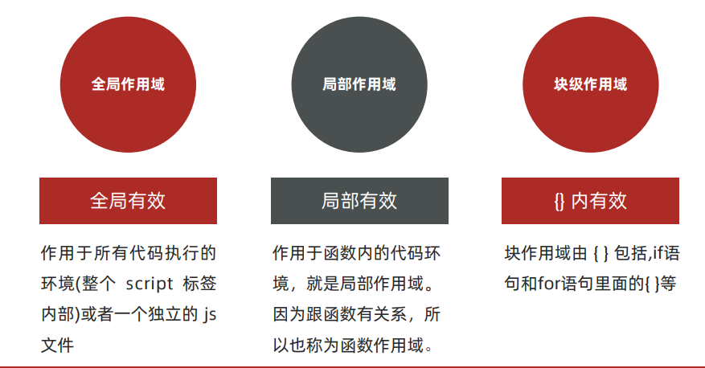

<div STYLE="page-break-after: always;">
	<br>
    <br>
    <br>
    <br>
    <br>
    <br>
    <br>
    <br>
    <br>
    <br>
	<center><h3><font size="20px">
        JavaScript
    </font></h3></center>
	<br>
    <br>
    <br>
    <br>
    <br>
    <br>
    <br>
    <br>
    <br>
    <br>
</div>

# 1	JavaScript 概述

## 1.1	JavaScript 简介

#### 什么是 JavaScript 

JavaScript（简称 JS） 是一种具有函数优先的 **轻量级**、**解释型或即时编译型** 的编程语言。虽然它是作为开发 Web 页面的脚本语言而出名，但是它也被用到了很多非浏览器环境中。JavaScript 是基于原型编程、多范式的动态脚本语言，并且支持面向对象、命令式、声明式、函数式编程范式。 

JavaScript 在1995年由 Netscape （网景）公司的工程师 Brendan Eich，在网景导航者浏览器上首次设计实现而成。因为 Netscape 与 Sun 合作，Netscape 管理层希望它外观看起来像 Java，因此取名为 JavaScript。但实际上它的语法风格与 Self 及 Scheme 较为接近。

<br>

#### JavaScript 的主要功能

1. 嵌入动态文本于 HTML 页面。
2. 对浏览器事件做出响应。
3. 读写 HTML 元素。
4. 在数据被提交到服务器之前验证数据。 
5. 检测访客的浏览器信息。
6. 控制 cookies，包括创建和修改等。
7. 基于 Node.js 技术进行服务器端编程。 

<br>

#### JavaScript 标准

JavaScript的标准是 ECMAScript （ES 标准）。ES标准中不包含 DOM 和 BOM的定义，只涵盖基本数据类型、关键字、语句、运算符、内建对象、内建函数等通用语法。

截至 2012 年，所有浏览器都完整的支持 ECMAScript 5.1，旧版本的浏览器至少支持 ECMAScript 3 标准。2015 年 6 月 17 日，ECMA 国际组织发布了 ECMAScript 的第六版，该版本正式名称为 ECMAScript 2015，但通常被称为 ECMAScript 6 或者 ES2015。

<br>

#### ECMAScript 6

ECMAScript 6.0（简称 ES6）是 JavaScript 语言的下一代标准，在 2015 年 6 月正式发布。它的目标是使 **JavaScript 语言可以用来编写复杂的大型应用程序，成为企业级开发语言**。

<br>

----

<div STYLE="page-break-after: always;"></div>


## 1.2	JavaScript 的引入方式

#### 引入 JavaScript

JavaScript 程序不能独立运行，它需要被嵌入 HTML 中，然后浏览器才能执行 JavaScript 代码。通过 `<script>` 标签将 JavaScript 代码引入到 HTML 中，有两种方式：

1. 内部形式
2. 外部形式

<br>

#### 内部形式

通过 `script` 标签包裹 JavaScript 代码：

```html

<body>
  <!-- 内联形式：通过 script 标签包裹 JavaScript 代码 -->
  <script>
    alert('嗨，欢迎来传智播学习前端技术！');
  </script>
</body>
```

<br>

#### 外部形式 

一般将 JavaScript 代码写在独立的以 .js 结尾的文件中，然后通过 `script` 标签的 `src` 属性引入

```javascript
// demo.js
document.write('Hello World！');
```

```html
<body>
  <!-- 外部形式：通过 script 的 src 属性引入独立的 .js 文件 -->
  <script src="demo.js"></script>
</body>
```

###### 注意

如果 `<script>` 标签使用 src 属性引入了某个 .js 文件，那么这个标签中的 JS 代码会被忽略，如下代码所示：

```html

<body>
  <script src="demo.js">
    // 此处的代码会被忽略
  	alert(666);  
  </script>
</body>
</html>
```

<br>

---

<div STYLE="page-break-after: always;"></div>

## 1.3	Babel 转码器

#### 什么是 Babel

Babel 是一个广泛使用的转码器，可以将 ES6 代码转为 ES5 代码，从而在现有不支持 ES6 的环境下执行。这意味着，你可以现在就用 ES6 编写程序，而不用担心现有环境是否支持。

<br>

#### 安装命令行转码工具

Babel 提供babel-cli工具，用于命令行转码。它的安装命令如下：

```sh
#使用 npm 全局安装 Babel
npm install --global babel-cli

#查看是否安装成功
babel --version
```

<br>

#### Babel 基本使用步骤

###### 第一步

初始化项目：

```sh
npm init -y
```

###### 第二步

创建文件 `src/example.js`，内容为：

```js
// 转码前
// 定义数据
let input = [1, 2, 3]
// 将数组的每个元素 +1
input = input.map(item => item + 1)
console.log(input)
```

###### 第三步

配置 `.babelrc` 文件，=，`.babelrc` 是 Babel 的配置文件，存放在项目的根目录下，该文件用来设置转码规则和插件，基本格式如下：

```js
{
    "presets": [],
    "plugins": []
}
```

使用 presets 字段设定转码规则，将 es2015 规则加入 `.babelrc`：

```js
{
    "presets": ["es2015"],
    "plugins": []
}
```

###### 第四步

在项目中安装转码器：

```sh
npm install --save-dev babel-preset-es2015
```

###### 第五步

转码：

```shell
# 转码结果写入一个文件
mkdir dist1
# --out-file 或 -o 参数指定输出文件
babel src/example.js --out-file dist1/compiled.js
# 或者
babel src/example.js -o dist1/compiled.js

# 整个目录转码
mkdir dist2
# --out-dir 或 -d 参数指定输出目录
babel src --out-dir dist2
# 或者
babel src -d dist2
```

<br>

---

<div STYLE="page-break-after: always;"></div>


# 2	基本语法

## 2.1	注释和结束符

#### 单行注释

使用 `// ` 注释单行代码

```js
// 这种是单行注释的语法
// 一次只能注释一行
// 可以重复注释
document.write('Hello World');
```

<br>

#### 多行注释

使用 `/* */` 注释多行代码

```js
/* 这种的是多行注释的语法 */
/*
	更常见的多行注释是这种写法
	在些可以任意换行
	多少行都可以
  */
document.write('Hello World');
```

<br>

##### 结束符

在 JavaScript 中 `;` 代表一段代码的结束。多数情况下可以省略 `;` ，使用回车（enter）替代。

```js
alert(1);
alert(2);
alert(1)
alert(2)
```

###### 注意

JavaScript 跟 HTML 和 CSS 一样，会忽略一些空白符号，但是换行符（回车）会被识别成结束符 `;`，因此在实际开发中有许多人主张书写 JavaScript 代码时省略结束符 `;`。

<br>

---

<div STYLE="page-break-after: always;"></div>

## 2.2	输入和输出

##### 输入

向 `prompt()` 输入任意内容会以弹窗形式出现在浏览器中，一般提示用户输入一些内容。

```js
// 1. 输入的任意数字，都会以弹窗形式展示
document.write('要输出的内容');
alert('要输出的内容');

// 2. 以弹窗形式提示用户输入姓名，注意这里的文字使用英文的引号
prompt('请输入您的姓名:');
```

<br>

##### 输出

JavaScript 可以接收用户的输入，然后再将输入的结果输出。

###### 输出函数

`alert()` 和 `document.wirte()` 会以弹窗形式将内容展示（输出）给用户。

<br>

---

<div STYLE="page-break-after: always;"></div>

## 2.3	变量与常量

#### 变量的声明和赋值

###### 局部变量 let

```js
let age;
```

###### 声明全局变量——var

```js
var b
```

###### 变量赋值

声明（定义）变量相当于创造了一个空的 “容器”，还需要通过赋值向这个容器中添加数据，例如：

```js
// 声明
let age
var name

// 赋值
age = 18
name = '赵大'

// 输出 18
document.write(age);
// 输出 赵大
document.write(name);
```

声明和赋值可以同时进行：

```js
let str = 'hello world!';
alert(str);
```

###### let 和 var 的不同点

1. 作用域不同：
   1. `let` 是块作用域，所以在块作用域内（比如 `for` 循环内）定义的 `let` 变量，在其外面是不可被访问的（所以 `for` 循环推荐用 `let`）；
   2. `var` 是函数作用域，在函数中声明了 `var`，整个函数内都是有效的，比如说在 `for` 循环内定义的一个 `var` 变量，实际上其在 `for` 循环以外也是可以访问的。

1. `let` 不能在定义之前访问该变量，但是 `var` 可以（此时变量的值为 `undefined`）；
3. `let` 不能被重新定义（声明），但是 `var` 可以；

```js
// 对于同一个变量名，let 只能声明一次：
let a = 1
let a = 2
console.log(a)  // Identifier 'n' has already been declared

// 对于同一个变量名，var 可以声明多次
var b = 1
var b = 2
console.log(b)  // 2
```


###### 注意

大部分情况使用 `let` 和 `var` 区别不大，但是 `let` 相较 `var` 更严谨，因此推荐使用 `let`。

<br>

#### 常量

常量在声明之后不允许改变，且声明后必须立即初始化。

###### 例——声明变量

```
const e =2.718281828
```

###### 例——变量不能重新赋值

```
//    
const PI = 3.1415926535
PI = 3  // TypeError: Assignment to constant variable.
```

###### 例——变量声明后必须立即初始化

```
const MY_AGE  // SyntaxError: Missing initializer in const declaration
```

<br>

#### 变量与常量的命名规则

关于变量的名称（标识符）有一系列的规则需要遵守：

1. 只能是字母、数字、下划线、$，且不能能数字开头；
2. 字母区分大小写，如 Age 和 age 是不同的变量；
3. JavaScript 内部的关键字或保留字不允许作为变量名使用；
4. 尽量保证变量具有一定的语义，见字知义。

<br>

---

<div STYLE="page-break-after: always;"></div>
## 2.4	关键字与保留字

#### 关键字

关键字指 JS 本身已经使用了的字符，不能再用它们充当变量名或方法名。

###### JS 现有的关键字

break、case、catch、continue、default、delete、do、else、finally、for、function、if、in、instanceof、new、return、switch、this、throw、try、typeof、var、void、while、with 等。

<br>

####  保留字

保留字实际上就是预留的“关键字”，意思是现在虽然还不是关键字，但是未来可能会成为关键字，同样不能使用它们当变量名或方法名。

###### JS 现有的保留字

boolean、byte、char、class、const、debugger、double、enum、export、extends、fimal、float、goto、implements、import、int、interface、long、mative、package、private、protected、public、short、static、super、synchronized、throws、transient、volatile 等。

###### 注意

如果将保留字用作变量名或函数名，那么除非将来的浏览器实现了该保留字，否则很可能收不到任何错误消息。当浏览器将其实现后，该单词将被看做关键字，如此将出现关键字错误。

<br>

---

<div STYLE="page-break-after: always;"></div>

## 2.5	数据类型

#### 检测数据类型——typeof 关键字

JS 中通过 **关键字 `typeof` ** 检测数据类型。

<br>

#### 数值类型 number

JS 中的数值类型包括 **整数、小数（浮点数）、正数、负数**。

###### 例

```js
let score = 100; // 正整数
let price = 12.345; // 小数
let temperature = -40; // 负数

document.write(typeof score); // 结果为 number
document.write(typeof price); // 结果为 number
document.write(typeof temperature); // 结果为 number
```

<br>

#### 字符串类型 string

通过单引号（ `''`） 、双引号（ `""`）或反引号包裹的数据都叫字符串，一般推荐使用单引号。

###### 例

```js
let user_name = '小明'; // 使用单引号
let gender = "男"; // 使用双引号
let str = '123'; // 看上去是数字，但是用引号包裹了就成了字符串了
let str1 = ''; // 这种情况叫空字符串
	
documeent.write(typeof user_name); // 结果为 string
documeent.write(typeof gender); // 结果为 string
documeent.write(typeof str); // 结果为 string
```

<br>

#### 布尔类型 boolean

表示肯定或否定时在计算机中对应的是布尔类型数据，它有两个固定的值 `true` 和 `false`。

###### 例

```js
let flag = true; 
flag = false; 

document.write(typeof flag); // 结果为 boolean
```

<br>

#### 未定义 undefined

`undefined` 是特殊的类型，只有一个值 undefined。如果只声明变量，不进行赋值，变量的默认值为 `undefined`。

###### 例

```js
// 只声明了变量，并末赋值
let tmp;
document.write(typeof tmp); // 结果为 undefined
```

<br>

---

<div STYLE="page-break-after: always;"></div>

## 2.6	类型转换

#### 隐式转换

某些运算符被执行时，系统内部自动将数据类型进行转换，这种转换称为隐式转换。

###### 例——使用数值与字符串进行算术运算

```
let num = 13; // 数值
let num2 = '2'; // 字符串

// 结果为 132
// 原因是将数值 num 转换成了字符串，相当于 '13'
// 然后 + 将两个字符串拼接到了一起
console.log(num + num2);

// 结果为 11
// 原因是将字符串 num2 转换成了数值，相当于 2
// 然后数值 13 减去 数值 2
console.log(num - num2);
```

<br>

#### 显式转换

编写程序时过度依靠系统内部的隐式转换是不严谨的。为了避免因隐式转换带来的问题，通常需要对数据进行显示转换。

###### 转换为数值类型——Number()

`Number()` 可以将变量显示转换成数值类型，转换失败时结果为 `NaN`（Not a Number，即不是一个数字）：

```js
let t = '12';
let f = 8;

// 显式将字符串 12 转换成数值 12
t = Number(t);

// 检测转换后的类型
// console.log(typeof t);
console.log(t + f); // 结果为 20

// 并不是所有的值都可以被转成数值类型
let str = 'hello';
// 将 hello 转成数值是不现实的，当无法转换成
// 数值时，得到的结果为 NaN （Not a Number）
console.log(Number(str));
```

<br>

---

<div STYLE="page-break-after: always;"></div>

## 2.7	模板字符串

#### 模板字符串

使用反引号 ``` ` 包裹的字符串就是模板字符串，模板字符串相当于加强版的字符串。

模板字符串中可以插入变量和表达式，还可以用来定义多行字符串。

###### 例——定义多行字符串

```js
let string1 =  `Hey,
can you stop angry now?`
console.log(string1)
// 输出：
// Hey,
// can you stop angry now?
```

###### 例——在字符串中插入变量和表达式

可以在 `${}` 中放入变量和 JavaScript 表达式。

```java
let name = "Mike"
let age = 27
let info = `My Name is ${name},I am ${age+1} years old next year.`
console.log(info)
// My Name is Mike,I am 28 years old next year.
```

###### 例——在字符串中调用函数

```js
function f(){
    return "have fun!"
}
let string2 = `Game start,${f()}`
console.log(string2);  // Game start,have fun!
```

<br>

---

<div STYLE="page-break-after: always;"></div>

## 2.8	运算符

#### 算术运算符

数学运算符也叫算术运算符，包括：

1. `+`：求和
2. `-`：求差
3. `*`：求积
4. `/`：求商
5. `%`：取模（取余数）

###### 算术运算符的优先级

同时使用多个运算符时，会按照一定顺序先后执行，我们称为优先级：

1. JavaScript 中优先级越高越先被执行；
2. 优先级相同时从左向右执行；
3.  乘、除、取余优先级相同；
4. 加、减优先级相同；
5. 乘、除、取余优先级大于加、减；
6. 使用 `()` 可以提升优先级。

<br>

#### 赋值运算符

赋值运算符是对变量进行赋值的运算符，包括：

1. `=`：将等号右边的值赋予给左边；
2. `+=`
3. `-=`
4. `*=`
5. `/=`
6. `%=`

###### 例 - 使用赋值运算符简化代码

```js
let n = 0
n+=1
console.log(n)
```

<br>

#### 自增/减运算符

自增/减运算符包括：

1. `++`：自增，让变量的值 +1；
2. `--`：自减，让变量的值 -1，

###### 使用场景

自增/减运算符经常用于程序计数。

###### 自增/减运算符前置与后置的差异

1. 前置自增：先自增/减再参与其他运算：

   ```js
   let n = 0
   console.log(++n)// 输出 1
   ```

2. 后置自增：先参与其他运算再自增/减

   ```js
   let n = 0
   console.log(n++)// 输出 0
   ```

<br>

#### 比较运算符

比较运算符用于比较两个数据大小或者是否相等，包括：

1. `>` ：大于
2. `<`： 小于
3. `>=`： 大于或等于
4. `<=`：小于或等于
5. `==`：比较值是否相等，若类型不同，会尝试转换类型；
6. `!=`：比较值是否不相等，若类型不同，会尝试转换类型；
7. `===`： 比较类型和值是否都相等，如果两边值相同，但类型不同则返回 `false`；
8. `!==`：比较类型和值是否不全等，如果两边值相同，但类型不同则返回 `true`；

######  📌比较运算符使用时的注意点

1. 字符串比较，是比较的字符对应的 ASCII 码：
   1. 从左往右依次比较
   2. 如果第一位一样再比较第二位，以此类推
2. NaN 不等于任何值，包括它本身
3. 尽量不要比较小数，因为小数有精度问题
4. 不同类型之间比较会发生隐式转换，最终把数据隐式转换转成 number 类型再比较
5. 开发中，如果需要进行准确的比较，应该使用 `===` 和 `!==`。

<br>

#### 逻辑运算符

逻辑运算符用来解决多重条件判断:

1. `&&`：逻辑与， 符号两边都为 `true`，结果才为 `true`（一假必假）；
2. `||`：逻辑或，符号两边有一个 `true` 就为 `true`（一真必真）；
3. `!`：逻辑非，取反（真变假，假变真）。

##### 逻辑运算符里的短路

短路只存在于 `&&` 和 `||` 中，当满足一定条件会让右边代码不执行，因为通过左边能得到整个式子的结果，因此没必要再判断右边。

短路条件：

1. `&&`：左边为 false 就短路；
2. `||`：左边为 true 就短路。

<br>

#### 运算符优先级

1. `()`：如果有 `()` 则一定先运算括号中的表达式；
2. 一元运算符：一元运算符包括：`++`、`--`、`!`；
3. 算数运算符：算数运算符之间的优先级——`*` 、`/` 、`%` 优先级高于 `+`、`-`；
4. 比较运算符：比较运算符之间的优先级——`>`、`>=`、` <` 、 `<=` 优先级高于 `==`、`!=`、`===`、`!==`；
5. 逻辑运算符：逻辑运算符之间的优先级——`&&` 的优先级高于 `||`；
6.  赋值运算符（`=`）；
7. 逗号运算符（`=`）。

<br>

---

<div STYLE="page-break-after: always;"></div>

## 2.9	语句

#### If 分支语句

if 语句有三种使用：

1. 单分支
2. 双分支
3. 多分支

###### 语法 - 单分支

条件为 `true` 时，进入大括号里执行代码：

```js
if(${判断条件}){
	${满足条件时执行的代码}
}
```

###### 语法 - 双分支

```js
if(${判断条件}){
	${满足条件时执行的代码}
}else{
	${不满足条件时执行的代码}
}
```

###### 语法 - 多分支

```js
if(${条件1}){
	${代码1}
}else if(条件2){
	${代码2}
}else{
	${代码n}
}
```

1. 先判断条件1，若满足条件1就执行代码1，其他不执行，若不满足则向下判断条件；
2. 满足条件 2 执行代码 2，其他不执行；
3. 若依然不满足继续往下判断，依次类推；
4. 若以上条件都不满足，执行 else 里的代码 n。

###### 📌 如果判断条件的值不是布尔类型

如果分支语句的条件表达式的结果不是布尔类型，会发生隐式转换，转为布尔类型。

<br>

#### switch 分支语句

###### 语法

```js
switch (${数据}) {
case ${值1}:
	${代码1}
	break
case ${值2}:
	${代码2}
	break
default:
	${代码n}
    break
}
```

###### 注意

1. `switch` 语句一般用于等值判断,不适合于区间判断；
2. `switch` 一般需要配合 `break` 关键字使用，没有 `break` 会造成 `case` 穿透（所有分支代码都被执行）；
3. 特殊情况下，可以使用 return 代替 `switch` 语句。

<br>

#### 三目运算符

三目运算符也叫做三元表达式，可以视为双分支 If 语句的简化写法，但是三目运算符有返回值。

###### 语法

```js
${条件} ? ${满足条件时执行的代码}:${不满足条件时执行的代码}
```

<br>

#### 循环三要素

循环的本质就是以某个变量为起始值，然后不断产生变化量，慢慢靠近终止条件的过程。 所以，循环需要具备三要素

1. 变量起始值
2. 终止条件（没有终止条件，循环会一直执行，造成死循环） 
3. 变量变化量（多为自增或者自减）

<br>

#### while 循环语句

`while` 语句当条件为 `true` 时进入循环，一次循环后重新判断条件，直到条件变为 `flase` 时结束循环。

###### 语法

```
while (${循环条件}) {
	${循环体}
}
```

<br>

#### for 循环

```js
for ( ${声明记录循环次数的变量};${循环条件};${变化值}) {
	${循环体}
}
```

<br>

#### for 和 while 各自的使用场景

1. 当如果明确了循环的次数的时候推荐使用for循环 
2. 当不明确循环的次数的时候推荐使用while循环

<br>

#### continue 和 break

1. `continue`：结束本次循环，继续下次循环 
2. `break`：跳出所在的循环

<br>

---

<div STYLE="page-break-after: always;"></div>

## 2.10	数组

#### 什么是数组

 数组（Array）是一种可以按顺序保存数据的数据类型，有以下性质：

1. 数组按顺序保存数组，所以每个数据都有自己的编号，编号从 0 开始。在数组中，数据的编号也叫 **索引** 或 **下标**。
2.  数组可以存储任意类型的数据

<br>

#### 语法——数组声明

```js
let ${数组名} = [${数据1},${数据2},...,${数据n}]
```

###### 例

```js
let names = ['赵大','钱二','孙三','李四']
```

<br>

#### 语法——数组取值

```js
${数组名}[${下标}]
```

###### 例

```js
let names = ['赵大','钱二','孙三','李四']
names[0] = // 赵大
names[1] = // 钱二
```

<br>

#### 语法——数组长度

数组中数据的个数，通过数组的 length 属性获得

```js
${数组名}.length
```

###### 例

```js
let names = ['赵大','钱二','孙三','李四']
names.length  // 5
```

<br>

#### 语法——数组增加元素

###### 使用 push 增加数据

`数组.push()` 方法将一个或多个元素添加到数组的 **末尾**，**并返回该数组的新长度**：

```js
arr.push(元素1,...,元素n)
```

###### 例——使用 push 增加数据

```js
let names = ['赵大','钱二','孙三','李四']
arr.push('周五','吴六','郑七','王八') // ['赵大','钱二','孙三','李四','周五','吴六','郑七','王八']
```

###### 使用 unshift 增加数据

`数组.unshift()` 方法将一个或多个元素添加到数组的 **开头**，**并返回该数组的新长度**：

```
let names = ['赵大','钱二','孙三','李四']
arr.unshift('周五','吴六','郑七','王八') // [ '周五','吴六','郑七','王八','赵大','钱二','孙三','李四']
```

<br>

#### 语法——数组删除元素

###### 使用 pop() 删除元素

`数组.pop()` 方法从数组中 **删除最后一个元素，并返回该元素的值**：

```js
arr.pop()
```

###### 例——使用  pop() 删除元素

```
let names = ['赵大','钱二','孙三','李四']
arr.pop() //['赵大','钱二','孙三']
```

###### 使用 shift() 删除元素

`数组. shift()` 方法从数组中 **删除第一个元素，并返回该元素的值**：

```js
arr.shift()
```

###### 例——使用 shift() 删除元素

```js
let names = ['赵大','钱二','孙三','李四']
arr.shift() //['钱二','孙三','李四']
```

###### 使用 splice() 删除元素

```js
arr.splice(start,deleteCount)
```

1. start：起始位置，指定修改的开始位置（从 0 计数） 。
2.  deleteCount: 表示要移除的数组元素的个数 。该参数可选，如果省略则默认从指定的起始位置删除到最后。

<br>

---

<div STYLE="page-break-after: always;"></div>

## 2.11 解构赋值

#### 什么是解构赋值

解构赋值是 ES6 中的语法，是 **对赋值运算符的扩展**，可以针对数组或者对象进行模式匹配，然后对其中的变量进行赋值。

解构赋值在代码书写上简洁且易读，语义更加清晰明了；也方便了复杂对象中数据字段获取。

<br>

#### 例——数组解构

```java
// 传统
let a = 1, b = 2, c = 3
console.log(a, b, c)
// ES6
let [x, y, z] = [1, 2, 3]
console.log(x, y, z)
```

<br>

#### 例——对象解构

```java
//2、对象解构
let user = {name: 'Helen', age: 18}
// 传统
let name1 = user.name
let age1 = user.age
console.log(name1, age1)
// ES6
let { name, age } =  user//注意：结构的变量必须是user中的属性
console.log(name, age)
```

<br>

---

<div STYLE="page-break-after: always;"></div>

# 3	高级语法

## 3.1	基本数据类型和引用数据类型

#### 什么是基本数据类型和引用数据类型

简单类型又叫做基本数据类型或者值类型，复杂类型又叫做引用类型：

1. 值类型：简单数据类型/基本数据类型，在存储时变量中存储的是值本身，因此叫做值类型，包括 string ，number，boolean，undefined，null。
2. 引用类型：复杂数据类型，在存储时变量中存储的仅仅是地址（引用），因此叫做引用数据类型。包括通过 new 关键字创建的对象（系统对象、自定义对象），如 Object、Array、Date等

<br>

#### 基本数据类型和引用数据类型的区别

###### 堆栈空间分配区别

1. 栈（操作系统）：由操作系统自动分配释放存放函数的参数值、局部变量的值等。其操作方式类似于数据结构中的栈。**简单数据类型存放到栈里**；
2. 堆（操作系统）：存储复杂类型(对象)，一般由程序员分配释放，若程序员不释放，由垃圾回收机制回收。 **引用数据类型存放到堆里面**。

<br>


---

<div STYLE="page-break-after: always;"></div>

## 3.2	函数

#### 什么是函数

函数（function），是被设计为执行特定任务的代码块，函数可以把具有相同或相似逻辑的代码“包裹”起来，通过函数调用执行这些被“包裹”的代码逻辑，这种做法有利于精简代码，方便复用。

函数体是函数的构成部分，它负责将相同或相似代码“包裹”起来，直到函数调用时函数体内的代码才会被执行。函数的功能代码都要写在函数体当中。

<br>

#### 语法——声明函数

```
function 函数名(){
	函数体
}
```

###### 例

```
function fun(){
	document.write('hello world')
}
```

###### 函数名命名规范

1. 和变量命名基本一致
2. 尽量小驼峰式命名法
3. 前缀应该为动词

<br>

#### 语法——函数的调用

声明（定义）的函数必须调用才会真正被执行，使用 `函数名()` 调用函数：

```
函数名()
```

###### 例

```
fun()
```

<br>

#### 语法——函数传参

```js
function 函数名(参数列表){
	函数体
}

...

//调用

函数名(参数列表)
```

1. 参数列表：传入数据列表，声明这个函数需要传入几个数据，多个数据之间用逗号隔开。
2. 形参和实参：
   1. 声明函数时写在函数名右边小括号里的叫形参（形式上的参数）
   2. 调用函数时写在函数名右边小括号里的叫实参（实际上的参数）
   3. 形参可以理解为是在这个函数内声明变量，实参可以理解为是给这个变量赋值
   4. 开发中尽量保持形参和实参个数一致

###### 例——传递单个参数

```js
function getSquare(num1){
	document.write(num1.num1)
}

...

// 调用
getSuare(8)
```

###### 例——传递多个参数

```js
function getSum(num1,num2){
	document.write(num1+num2)
}

// 调用
getSum(10,20)
```

<br>

#### 语法——函数的返回值

当函数需要返回数据出去时，用return关键字：

```
function 函数名(){
	...
	return 返回的数据
}
```

1. 在函数体中使用 return 关键字能将内部的执行结果交给函数外部使用
2. 函数内部只能出现 1 次 return，并且 return 后面代码不会再被执行，所以 return 后面的数据不要换行写
3. return会立即结束当前函数
4. 函数可以没有 return，这种情况函数默认返回值为 undefined

<br>

#### 作用域

通常来说，一段程序代码中所用到的名字并不总是有效和可用的，而限定这个名字的可用性的代码范围就是这个名字的作用域。作用域的使用提高了程序逻辑的局部性，增强了程序的可靠性，减少了名字冲突。



###### 变量的作用域

在 JavaScript 中，根据作用域的不同，变量可以分为：


###### 📌没有被声明的局部变量和块级变量会被视为全局变量

如果函数内部或者块级作用域内部，变量没有声明，直接赋值，也会被视为全局变量，但是强烈不推荐使用这种做法定义全局变量。

###### 变量访问原则——作用域链

只要是代码，就至少有一个作用域——写在函数内部的局部作用域。如果函数中还有函数，那么在这个作用域中就又可以诞生一个作用域。

而 **内部函数可以访问外部函数变量**，因此用链式查找决定哪些数据能被内部函数访问，就称为作用域链。

<br>

#### 匿名函数

函数可分为具名函数和匿名函数，匿名函数即没有函数名的函数：

```js
function (){
	//函数体
}
```

###### 函数表达式

可以将匿名函数赋值给一个变量，并且通过变量名称进行调用，这被称为函数表达式：

```
let fun = function (){
	//函数体
}

...

// 调用
fun()
```

###### 立即执行函数

立即执行函数可以避免全局变量之间的污染，例：

```
// 方式一
(function (){ //函数体 })();

// 方式二
(function (){ //函数体 }());
```

1. 立即执行函数无需调用，立即执行，其实本质已经调用了。
2. 两种方式的不同主要在于括号的位置；
3. 多个立即执行函数要用 `;` 隔开，否则会报错。

<br>

#### 箭头函数

箭头函数提供了一种更加简洁的函数书写方式。

###### 基本语法

```
参数 => 函数体
```

###### 作用

箭头函数多用于匿名函数的定义。

###### 例

```
// 传统
var f1 = function(a){
    return a
}
console.log(f1(1))


// ES6
var f2 = a => a
console.log(f2(1))
```

```
// 当箭头函数没有参数或者有多个参数，要用 () 括起来。
// 当箭头函数函数体有多行语句，用 {} 包裹起来，表示代码块，
// 当只有一行语句，并且需要返回结果时，可以省略 {} , 结果会自动返回。
var f3 = (a,b) => {
    let result = a+b
    return result
}
console.log(f3(6,2))  // 8

// 前面代码相当于：
var f4 = (a,b) => a+b
```

<br>

---

<div STYLE="page-break-after: always;"></div>

## 3.3	对象

#### 什么是对象

对象（object）是 JavaScript 中的一种数据类型，可以理解为是一种无序的数据集合 。

对象由属性和方法组成，可以用于描述某个事物：

1. **属性**：
   1. 信息或叫特征（名词），是数据描述性的信息。 比如 手机尺寸、颜色、重量等；
   2. 属性都是以 **属性名** 和 **值** 的形式成对出现， **属性名** 和 **值** 之间使用 `:` 分隔；
   3. 属性名可以使用 "" 或 ''，一般情况下省略，除非名称遇到特殊符号如空格、中横线等；
   4. 多个属性之间使用 `,` 分割；
   5. 属性本质上就是依附在对象上的变量
2. **方法**：
   1. 功能或叫行为（动词）。 比如 手机打电话、发短信、玩游戏等。
   2. 方法是由方法名和函数两部分构成，它们之间使用 `:` 分隔
   3. 多个属性之间使用 `,` 分隔；
   4. 方法是依附在对象中的函数；
   5. 方法名可以使用 `""` 或 `''`，一般情况下省略，除非名称遇到特殊符号如空格、中横线等。

注意，无论是属性还是方法，只要同一个对象中出现名称一样的，后面的会覆盖前面的。

<br>

#### 语法——对象声明与访问

```
let 对象名 = {
	属性名: 属性值,
	方法名: 函数
}
```

###### 例

```
// 声明一个 person 对象
let person = {}
```

###### 属性访问

声明对象，并添加了若干属性后，可以使用 . 或 [] 获得对象中属性对应的值：

```
let person = {
    name:"赵大",
	age:18,
	sex:"男"
}
console.log(person.name)
console.log(person['age'])
```

1. 注意，点后面的属性名一定不要加引号，而 `[]` 里面的属性名一定加引号。

###### 方法访问

声明对象，并添加了若干方法后，可以使用 `.` 调用对象中函数：

```
let person = {
    name:"赵大",
    sayHi: function(){
         console.log(person.name)
    }
}
// 对象名.方法名()
person.sayHi()
```

<br>

#### 语法——对象增加属性和方法

###### 新增属性

对象可以动态为对象添加属性，动态添加与直接定义是一样的，只是语法上更灵活，例：

```js
let person = {
    name:"赵大",
}
person["age"]=18
person.sex="男"
```

###### 新增方法

对象也可以动态为对象添加方法，动态添加与直接定义是一样的，只是语法上更灵活：

```js
person.move = function(){
	console.log(person.name)
}
```

<br>

#### 语法——遍历对象

一般不用这种方式遍历数组，主要是用来遍历对象：

```js
let person = {
	name:'赵大',
	age:18,
	sex:'男'
}
for(let k in obj){
	console.log(k)
	console.log(obj[k])
}
```

1. k是获得对象的属性
2. 对象名[k] 是获得属性值

<br>

#### JS 内置对象

JS 内置对象是 JavaScript 内部提供的对象，包含各种属性和方法给开发者调用。

###### 内置对象 Math

Math 对象是 JavaScript 提供的一个“数学高手”对象，提供了一系列做数学运算的方法，包括：

1. random：生成0-1之间的随机数（包含0不包括1） 
2. ceil：向上取整
3. floor：向下取整
4. max：找最大数
5. min：找最小数
6. pow：幂运算
7. abs：绝对值

<br>

#### 对象拓展运算符

拓展运算符（...）用于取出参数对象所有可遍历属性然后拷贝到当前对象。

###### 使用对象拓展运算符拷贝对象

```js
// 拷贝对象
let person1 = {name: "Amy", age: 15}
let someone = { ...person1 }
console.log(someone)  //{name: "Amy", age: 15}
```

###### 使用对象拓展运算符合并对象

```js
let age = {age: 15}
let name = {name: "Amy"}
let person2 = {...age, ...name}
console.log(person2)  //{age: 15, name: "Amy"}
```

###### 📌对象中包含其他对象的情况

如果对象中包含其他对象，那么对象扩展运算符将无法完全拷贝。

<br>

---

<div STYLE="page-break-after: always;"></div>

## 3.4	模块化

#### 模块化产生的背景

随着网站逐渐变成"互联网应用程序"，嵌入网页的 Javascript 代码越来越庞大，越来越复杂。传统非模块化开发存在以下缺点：

1. 命名冲突
2. 文件依赖

Javascript模块化编程，已经成为一个迫切的需求。理想情况下，开发者只需要实现核心的业务逻辑，其他都可以加载别人已经写好的模块。

但是，Javascript不是一种模块化编程语言，它不支持"类"（class），包（package）等概念，更遑论"模块"（module）了。

#### 模块化规范：

- CommonJS 模块化规范
- ES6 模块化规范

<br>

#### CommonJS 的模块规范

CommonJS 使用 exports 和 require 来导出、导入模块。每个文件就是一个模块，有自己的作用域。在一个文件里面定义的变量、函数、类，都是私有的，对其他文件不可见。

###### CommonJS 实现步骤

1. 创建 module 文件夹

2. 在 module 文件夹下创建 `common-js模块化/四则运算.js`：

   ```js
   // 定义成员：
   const sum = function(a,b){
       return parseInt(a) + parseInt(b)
   }
   const subtract = function(a,b){
       return parseInt(a) - parseInt(b)
   }
   const multiply = function(a,b){
       return parseInt(a) * parseInt(b)
   }
   const divide = function(a,b){
       return parseInt(a) / parseInt(b)
   }
   
   // 导出成员：
   module.exports = {
       sum: sum,
       subtract: subtract,
       multiply: multiply,
       divide: divide
   }
   //或者使用简写
   module.exports = {
       sum,
       subtract,
       multiply,
       divide
   }
   ```

3. 导入模块，创建文件 `common-js模块化/引入模块.js`：

   ```
   //引入模块，注意：当前路径必须写 ./
   const m = require('./四则运算.js')
   console.log(m)
   
   const result1 = m.sum(1, 2)
   const result2 = m.subtract(1, 2)
   console.log(result1, result2)
   ```

4. 运行程序：

   ```
   node common-js模块化/引入模块.js
   ```

<br>

#### ES6 模块化规范

###### 导出模块

创建文件 `es6模块化/userApi2.js`

```
export default {
    getList() {
        console.log('获取数据列表2')
    },

    save() {
        console.log('保存数据2')
    }
}
```

###### 导入模块

创建文件 es6模块化/userComponent2.js

```
import user from "./userApi2.js"
user.getList()
user.save()
```

<br>

---

<div STYLE="page-break-after: always;"></div>

# 附录

##### 参考资料

1. 主要参考资料——[前端开发入门教程，web前端零基础html5 +css3+前端项目视频教程](https://www.bilibili.com/video/BV1Kg411T7t9/?p=2&spm_id_from=pageDriver&vd_source=87ed5edcdc8042ca0c34ee5bbeeda7b3) 发布于 2021/11/16；
2. [2.3	变量与常量](#2.3	变量与常量)——[var和let的区别](https://zhuanlan.zhihu.com/p/265002815) 发布于 2020/10/12 最后编辑于 2022/01/17；

<br>