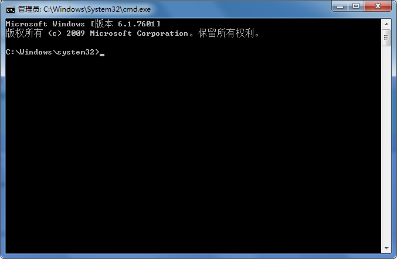
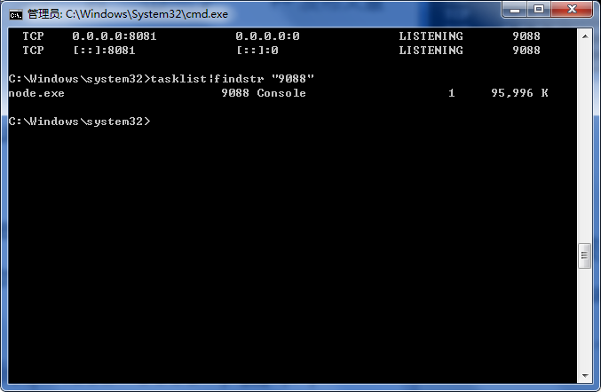
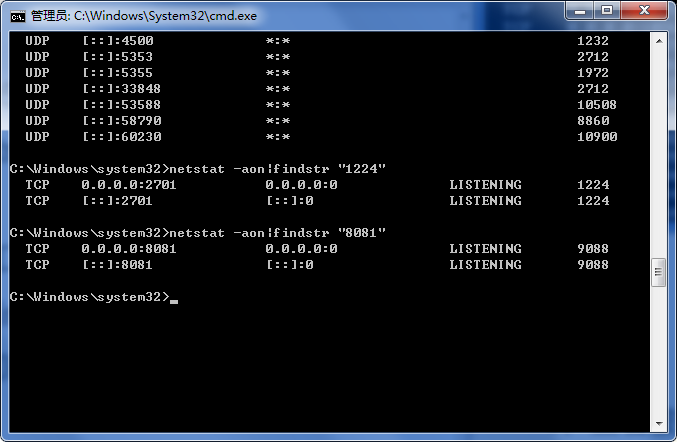
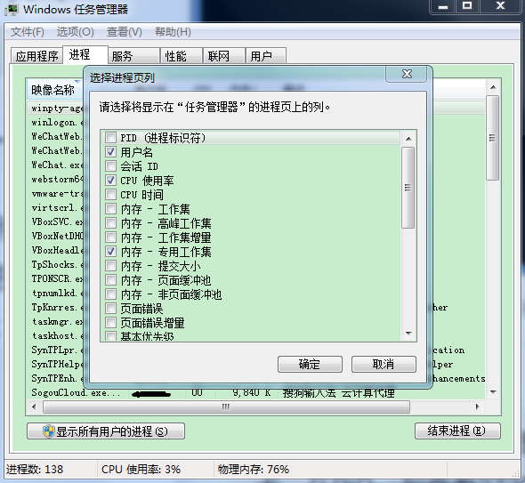

#### 方法一——使用 cmd

1. 以管理员身份打开命令窗口：



2. 查找被占用的端口：

   1. 方法一：查找所有运行的端口，输入命令：

      ```sh
      // 该命令列出所有端口的使用情况。
      netstat -ano
      ```

      

   2. 方法二：查看被占用端口对应的 PID：

      ```sh
      netstat -aon|findstr "8081"
      ```

      

3. 查看指定 PID 的进程，继续输入命令：

   ```sh
   tasklist|findstr "9088"
   ```

   

4. 结束进程，强制（`/F` 参数）杀死 pid 为 9088 的所有进程包括子进程（/T参数）：

   ```sh
   1taskkill /T /F /PID 9088 
   ```

   <br>

#### 方法二——使用任务管理器

1. 打开任务管理器，切换到进程选项卡，在 PID 一列查看端口号对应的进程：

   

2. 结束这个进程，就可以释放该端口了。

<br>