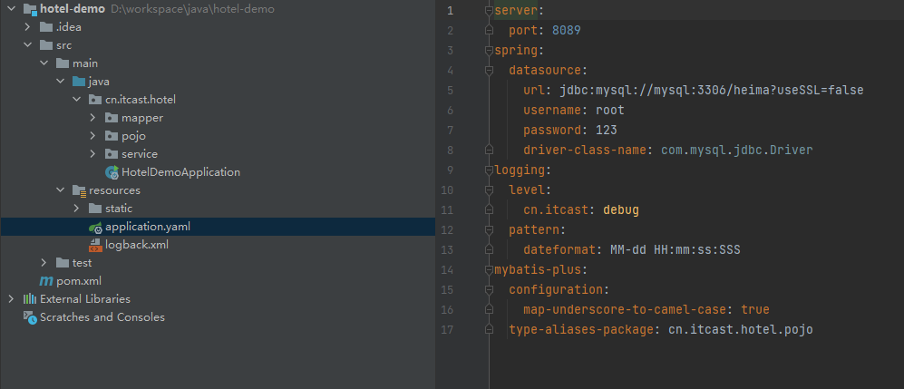
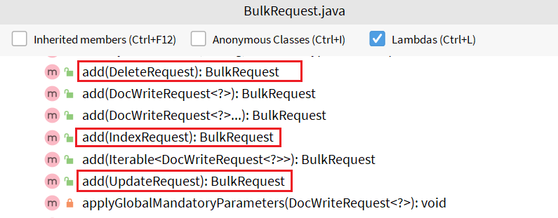

# 4	RestAPI

## 4.1	RestAPI 概述

##### ES 客户端

ES 官方提供了各种不同语言的客户端，用来操作 ES。这些客户端的本质就是组装 DSL 语句，通过 http 请求发送给ES。

<br>

##### 官方文档地址

https://www.elastic.co/guide/en/elasticsearch/client/index.html

<br>

##### Java Rest Client

ES 客户端中的 Java Rest Client 包括两种：

- Java Low Level Rest Client：低级别的REST客户端，通过http与集群交互，用户需自己编组请求JSON串，及解析响应JSON串。**兼容所有ES版本**。
- Java High Level Rest Client：高级别的REST客户端，基于低级别的REST客户端，增加了编组请求JSON串、解析响应JSON串等相关api。**使用的版本需要保持和ES服务端的版本一致，否则会有版本问题。**

<br>

##### 📌主要学习 Java High Level Rest Client

The Java High Level REST Client works **on top of the Java Low Level REST client**. Its main goal is to expose API specific methods, that accept request objects as an argument and return response objects, so that request marshalling and response un-marshalling is handled by the client itself.

<br>

RestHighLevelClient查询ES中数据的 API 主要有：get、multiGet、search、multiSearch、searchScroll，每个方法还有异步查询的操作方法。下面我们就逐个看看这些API的应用。

---

<div STYLE="page-break-after: always;">
    <br>
    <br>
    <br>
    <br>
    <br></div>

## 4.2	快速开始

##### 前提条件

###### Mysql 建表语句

```sql
CREATE TABLE `tb_hotel` (
  `id` bigint(20) NOT NULL COMMENT '酒店id',
  `name` varchar(255) NOT NULL COMMENT '酒店名称；例：7天酒店',
  `address` varchar(255) NOT NULL COMMENT '酒店地址；例：航头路',
  `price` int(10) NOT NULL COMMENT '酒店价格；例：329',
  `score` int(2) NOT NULL COMMENT '酒店评分；例：45，就是4.5分',
  `brand` varchar(32) NOT NULL COMMENT '酒店品牌；例：如家',
  `city` varchar(32) NOT NULL COMMENT '所在城市；例：上海',
  `star_name` varchar(16) DEFAULT NULL COMMENT '酒店星级，从低到高分别是：1星到5星，1钻到5钻',
  `business` varchar(255) DEFAULT NULL COMMENT '商圈；例：虹桥',
  `latitude` varchar(32) NOT NULL COMMENT '纬度；例：31.2497',
  `longitude` varchar(32) NOT NULL COMMENT '经度；例：120.3925',
  `pic` varchar(255) DEFAULT NULL COMMENT '酒店图片；例:/img/1.jpg',
  PRIMARY KEY (`id`)
) ENGINE=InnoDB DEFAULT CHARSET=utf8mb4;
```

###### 导入 SQL 数据

[tb_hotel.sql](attachment\sql)

###### 导入项目

[hotel-demo](attachment\hotel-demo)

###### 项目结果与配置文件预览



<br>

---

 <div STYLE="page-break-after: always;"><br>
    									<br>
    									<br>
    									<br>
    									<br></div>

## 4.3	索引库操作

### 4.3.1	mapping 映射分析

##### 创建 mapping 映射前需要考虑的问题

创建索引库，最关键的是 mapping 映射，而 mapping 映射要考虑的信息包括：

- 字段名
- 字段数据类型
- 是否参与搜索
- 是否需要分词
- 如果分词，分词器是什么？

其中：

- 字段名、字段数据类型，可以参考数据表结构的名称和类型
- 是否参与搜索要分析业务来判断，例如图片地址，就无需参与搜索
- 根据内容决定是否分词，内容如果是一个整体就无需分词，反之则要分词
- 分词器，可以统一使用 ik_max_word

<br>

##### 酒店数据的索引库结构

```json
PUT /hotel
{
  "mappings": {
    "properties": {
      "id": {
        "type": "keyword"
      },
      "name":{
        "type": "text",
        "analyzer": "ik_max_word",
        "copy_to": "all"
      },
      "address":{
        "type": "keyword",
        "index": false
      },
      "price":{
        "type": "integer"
      },
      "score":{
        "type": "integer"
      },
      "brand":{
        "type": "keyword",
        "copy_to": "all"
      },
      "city":{
        "type": "keyword",
        "copy_to": "all"
      },
      "starName":{
        "type": "keyword"
      },
      "business":{
        "type": "keyword"
      },
      "location":{
        "type": "geo_point"
      },
      "pic":{
        "type": "keyword",
        "index": false
      },
      "all":{
        "type": "text",
        "analyzer": "ik_max_word"
      }
    }
  }
}
```

特殊字段说明：

- location：地理坐标，里面包含精度、纬度
- all：一个组合字段，其目的是将多字段的值 利用copy_to合并，提供给用户搜索

<br>

##### ❓位置不对❓ES 支持的地理坐标数据类型

ES 中支持两种地理坐标数据类型：

- **geo_point**：由纬度（latitude）和经度（longitude）确定的一个点。例如："32.8752345, 120.2981576"。
- **geo_shape**：有多个 geo_point 组成的复杂几何图形。例如一条直线，"LINESTRING (-77.03653 38.897676, -77.009051 38.889939)"。

<br>

##### ❓位置不对❓copy_to

字段拷贝可以使用 copy_to 属性将当前字段拷贝到指定字段。示例：

```json
"all": {
  "type": "text",
  "analyzer": "ik_max_word"
},
"brand": {
  "type": "keyword",
  "copy_to": "all"
}
```

<br>

----

 <div STYLE="page-break-after: always;"><br>
    									<br>
    									<br>
    									<br>
    									<br></div>

### 4.3.2	初始化 RestClient

##### RestHighLevelClient

在 elasticsearch 提供的 API 中，与 elasticsearch 一切交互都封装在一个名为 RestHighLevelClient 的类中，必须先完成这个对象的初始化，建立与 elasticsearch 的连接。

<br>

##### 步骤——初始化 RestHighLevelClient 对象

1. 引入 es 的 RestHighLevelClient 依赖（SpringBoot 默认的 ES 版本是 7.6.2，需要覆盖默认的 ES 版本）：

```xml
<dependency>
    <groupId>org.elasticsearch.client</groupId>
    <artifactId>elasticsearch-rest-high-level-client</artifactId>
    <version>7.12.1</version>
</dependency>
```

2. 初始化RestHighLevelClient

```java
RestHighLevelClient client = new RestHighLevelClient(RestClient.builder(
        HttpHost.create("http://192.168.150.101:9200")
));
```

4. 创建一个测试类 HotelIndexTest（或者使用默认的测试类），然后将初始化的代码编写在 `@BeforeEach` 方法中：

```java
@SpringBootTest
public class HotelIndexTest {
    private RestHighLevelClient client;

    @BeforeEach
    void setUp() {
        this.client = new RestHighLevelClient(RestClient.builder(
                HttpHost.create("http://192.168.150.101:9200")
        ));
    }

    @AfterEach
    void tearDown() throws IOException {
        // 可以不进行关闭（RestHighLevelClient 的底层是一个 TCP 连接池，每次使用都是从池中获取连接）
        this.client.close();
    }
}
```

<br>

---

 <div STYLE="page-break-after: always;"><br>
    									<br>
    									<br>
    									<br>
    									<br></div>

### 4.3.3	索引库操作基础

##### JavaRestClient 操作 elasticsearch 的流程

JavaRestClient 操作 elasticsearch 的流程基本类似。核心是 `client.indices()` 方法来获取索引库的操作对象。

<br>

##### 索引库操作的基本步骤

1. 初始化RestHighLevelClient
2. 创建XxxIndexRequest。XXX是Create、Get、Delete
3. 准备DSL（ Create时需要，其它是无参）
4. 发送请求。调用RestHighLevelClient#indices().xxx()方法，xxx是create、exists、delete

<br>

---

 <div STYLE="page-break-after: always;"><br>
    									<br>
    									<br>
    									<br>
    									<br></div>

### 4.3.4	创建索引库

##### 代码

```java
    @Test
    void testCreateHotelIndex() throws IOException {
        // 1.创建Request对象
        CreateIndexRequest request = new CreateIndexRequest("hotel");
        // 2.请求参数，MAPPING_TEMPLATE是静态常量字符串，内容是创建索引库的DSL语句
        request.source(MAPPING_TEMPLATE, XContentType.JSON);
        // 3.发起请求
        client.indices().create(request, RequestOptions.DEFAULT);
    }
```

<br>

##### 分析


代码分为三步：

1. 创建 Request 对象。因为是创建索引库的操作，因此Request是CreateIndexRequest。
2. 添加请求参数，其实就是 DSL 的 JSON 参数部分。因为 json 字符串很长，这里是定义了静态字符串常量 MAPPING_TEMPLATE，让代码看起来更加优雅。
3. 发送请求，client.indices()方 法的返回值是 IndicesClient 类型，封装了所有与索引库操作有关的方法。

<br>

##### MAPPING_TEMPLATE 的值

```
    private static final String MAPPING_TEMPLATE = "{\n" +
            "  \"mappings\": {\n" +
            "    \"properties\": {\n" +
            "      \"id\": {\n" +
            "        \"type\": \"keyword\"\n" +
            "      },\n" +
            "      \"name\":{\n" +
            "        \"type\": \"text\",\n" +
            "        \"analyzer\": \"ik_max_word\",\n" +
            "        \"copy_to\": \"all\"\n" +
            "      },\n" +
            "      \"address\":{\n" +
            "        \"type\": \"keyword\",\n" +
            "        \"index\": false\n" +
            "      },\n" +
            "      \"price\":{\n" +
            "        \"type\": \"integer\"\n" +
            "      },\n" +
            "      \"score\":{\n" +
            "        \"type\": \"integer\"\n" +
            "      },\n" +
            "      \"brand\":{\n" +
            "        \"type\": \"keyword\",\n" +
            "        \"copy_to\": \"all\"\n" +
            "      },\n" +
            "      \"city\":{\n" +
            "        \"type\": \"keyword\",\n" +
            "        \"copy_to\": \"all\"\n" +
            "      },\n" +
            "      \"starName\":{\n" +
            "        \"type\": \"keyword\"\n" +
            "      },\n" +
            "      \"business\":{\n" +
            "        \"type\": \"keyword\"\n" +
            "      },\n" +
            "      \"location\":{\n" +
            "        \"type\": \"geo_point\"\n" +
            "      },\n" +
            "      \"pic\":{\n" +
            "        \"type\": \"keyword\",\n" +
            "        \"index\": false\n" +
            "      },\n" +
            "      \"all\":{\n" +
            "        \"type\": \"text\",\n" +
            "        \"analyzer\": \"ik_max_word\"\n" +
            "      }\n" +
            "    }\n" +
            "  }\n" +
            "}";
```

<br>

----

 <div STYLE="page-break-after: always;"><br>
    									<br>
    									<br>
    									<br>
    									<br></div>

### 4.3.5	删除索引库

##### 步骤

1. 创建 Request 对象。这次是 DeleteIndexRequest 对象
2. 准备参数。这里是无参
3. 发送请求。改用 delete 方法

<br>

##### 代码

在测试类中，编写单元测试，实现删除索引：

```java
@Test
void testDeleteHotelIndex() throws IOException {
    // 1.创建Request对象
    DeleteIndexRequest request = new DeleteIndexRequest("hotel");
    // 2.发送请求
    client.indices().delete(request, RequestOptions.DEFAULT);
}
```

<br>

---

 <div STYLE="page-break-after: always;"><br>
    									<br>
    									<br>
    									<br>
    									<br></div>

### 4.3.6	判断索引库是否存在

##### 判断索引库是否存在的本质

判断索引库是否存在的本质就是查询，对应的DSL是：

```json
GET /hotel
```

<br>

##### 步骤

1. 创建 Request 对象。这次是 GetIndexRequest 对象
2. 准备参数。这里是无参
3. 发送请求。改用 exists 方法

<br>

##### 代码

```java
@Test
void testExistsHotelIndex() throws IOException {
    // 1.创建Request对象
    GetIndexRequest request = new GetIndexRequest("hotel");
    // 2.发送请求
    boolean exists = client.indices().exists(request, RequestOptions.DEFAULT);
    // 3.输出
    System.err.println(exists ? "索引库已经存在！" : "索引库不存在！");
}
```

<br>

---

 <div STYLE="page-break-after: always;"><br>
    									<br>
    									<br>
    									<br>
    									<br></div>

## 4.4	文档操作

### 4.4.0

##### 文档操作的基本步骤

1. 初始化RestHighLevelClient
2. 创建XxxRequest。XXX是Index、Get、Update、Delete、Bulk
3. 准备参数（Index、Update、Bulk时需要）
4. 发送请求。调用RestHighLevelClient#.xxx()方法，xxx是index、get、update、delete、bulk
5. 解析结果（Get时需要）

<br>

##### 新建测试类

```java
@SpringBootTest
public class HotelDocumentTest {
    @Autowired
    private IHotelService hotelService;

    private RestHighLevelClient client;

    @BeforeEach
    void setUp() {
        this.client = new RestHighLevelClient(RestClient.builder(
                HttpHost.create("http://192.168.150.101:9200")
        ));
    }

    @AfterEach
    void tearDown() throws IOException {
           // 可以不进行关闭（RestHighLevelClient 的底层是一个 TCP 连接池，每次使用都是从池中获取连接）
        this.client.close();
    }
}
```

该测试类的作用：

- 初始化 RestHighLevelClient
- 通过注入的 IHotelService 接口，查询数据库中的酒店数据。

<br>

##### 数据库查询结果与索引库结构之间的差异

数据库查询后的结果是一个 Hotel 类型的对象。结构如下：

```java
@Data
@TableName("tb_hotel")
public class Hotel {
    @TableId(type = IdType.INPUT)
    private Long id;
    private String name;
    private String address;
    private Integer price;
    private Integer score;
    private String brand;
    private String city;
    private String starName;
    private String business;
    private String longitude;
    private String latitude;
    private String pic;
}
```

与我们的索引库结构存在差异：

- longitude 和 latitude 需要合并为location

因此，我们需要定义一个新的类型，与索引库结构吻合：

```java
package cn.itcast.hotel.pojo;

import lombok.Data;
import lombok.NoArgsConstructor;

@Data
@NoArgsConstructor
public class HotelDoc {
    private Long id;
    private String name;
    private String address;
    private Integer price;
    private Integer score;
    private String brand;
    private String city;
    private String starName;
    private String business;
    private String location;
    private String pic;

    public HotelDoc(Hotel hotel) {
        this.id = hotel.getId();
        this.name = hotel.getName();
        this.address = hotel.getAddress();
        this.price = hotel.getPrice();
        this.score = hotel.getScore();
        this.brand = hotel.getBrand();
        this.city = hotel.getCity();
        this.starName = hotel.getStarName();
        this.business = hotel.getBusiness();
        this.location = hotel.getLatitude() + ", " + hotel.getLongitude();
        this.pic = hotel.getPic();
    }
}

```

<br>

---

 <div STYLE="page-break-after: always;"><br>
    									<br>
    									<br>
    									<br>
    									<br></div>

### 4.4.1	新增文档

##### 新增文档的 DSL 语句

```json
POST /{索引库名}/_doc/1
{
    "name": "Jack",
    "age": 21
}
```

<br>

##### 代码

```java
    @Test
    void testIndexDocument() throws IOException {
        // 1.创建request对象
        IndexRequest request = new IndexRequest("indexname").id("1");
        // 2.准备JSON文档
        request.source("{\"name\": \"Jack\", \"age\": 21}", XContentType.JSON);
        // 3.发送请求
        client.index(request, RequestOptions.DEFAULT);
    }
```

<br>

##### 分析


可以看到与创建索引库类似，同样是三步走：

1. 创建 Request 对象
2. 准备请求参数，也就是 DSL 中的 JSON 文档
3. 发送请求

变化的地方在于，这里直接使用 `client.xxx()` 的 API，不再需要 `client.indices()` 了。

<br>

##### 导入数据库数据

###### 导入数据库数据的前提条件

导入数据库数据，基本流程一致，但是需要考虑几点变化：

1. 数据来自于数据库，我们需要先查询出来，得到 hotel 对象
2. hotel 对象需要转为 HotelDoc 对象
3. HotelDoc 需要序列化为 json 格式

###### 步骤

1. 根据 id 查询酒店数据 Hotel
2. 将 Hotel 封装为 HotelDoc
3. 将 HotelDoc 序列化为 JSON
4. 创建 IndexRequest，指定索引库名和 id
5. 准备请求参数，也就是 JSON 文档
6. 发送请求

###### 代码

```java
@Test
void testAddDocument() throws IOException {
    // 1.根据id查询酒店数据
    Hotel hotel = hotelService.getById(61083L);
    // 2.转换为文档类型
    HotelDoc hotelDoc = new HotelDoc(hotel);
    // 3.将HotelDoc转json
    String json = JSON.toJSONString(hotelDoc);

    // 1.准备Request对象
    IndexRequest request = new IndexRequest("hotel").id(hotelDoc.getId().toString());
    // 2.准备Json文档
    request.source(json, XContentType.JSON);
    // 3.发送请求
    client.index(request, RequestOptions.DEFAULT);
}
```

<br>

---

 <div STYLE="page-break-after: always;"><br>
    									<br>
    									<br>
    									<br>
    									<br></div>

### 4.4.2	查询文档

##### 文档查询的 DSL 语句

```json
GET /hotel/_doc/{id}
```

<br>

##### 步骤

1. 准备Request对象
2. 发送请求
3. 

<br>

##### 分析


可以看到，结果是一个 JSON，其中文档放在一个 `_source` 属性中，因此解析就是拿到 `_source`，反序列化为 Java 对象即可。与之前类似，也是三步走：

1. 准备Request对象。这次是查询，所以是GetRequest
2. 发送请求，得到结果。因为是查询，这里调用client.get()方法
3. 解析结果，就是对 JSON 做反序列化

<br>

##### 代码

```java
@Test
void testGetDocumentById() throws IOException {
    // 1.准备Request
    GetRequest request = new GetRequest("hotel", "61082");
    // 2.发送请求，得到响应
    GetResponse response = client.get(request, RequestOptions.DEFAULT);
    // 3.解析响应结果
    String json = response.getSourceAsString();

    HotelDoc hotelDoc = JSON.parseObject(json, HotelDoc.class);
    System.out.println(hotelDoc);
}
```

<br>

---

 <div STYLE="page-break-after: always;"><br>
    									<br>
    									<br>
    									<br>
    									<br></div>

### 4.4.3	删除文档

##### 删除文档的 DSL

```json
DELETE /hotel/_doc/{id}
```

<br>

##### 分析

与查询相比，仅仅是请求方式从 DELETE 变成 GET，可以想象 Java 代码应该依然是三步走：

1. 准备 Request 对象，因为是删除，这次是 DeleteRequest 对象。要指定索引库名和 id
2. 准备参数，无参
3. 发送请求。因为是删除，所以是 `client.delete()` 方法

<br>

##### 代码

```java
@Test
void testDeleteDocument() throws IOException {
    // 1.准备Request
    DeleteRequest request = new DeleteRequest("hotel", "61083");
    // 2.发送请求
    client.delete(request, RequestOptions.DEFAULT);
}
```

<br>

---

 <div STYLE="page-break-after: always;"><br>
    									<br>
    									<br>
    									<br>
    									<br></div>

### 4.4.4	修改文档

##### RestClient 的全量修改与增量修改

在 RestClient 的 API 中，全量修改与新增的 API 完全一致，判断依据是 ID：

- 如果新增时，ID已经存在，则修改
- 如果新增时，ID不存在，则新增

这里不再赘述，我们主要关注增量修改。

<br>

##### 分析


与之前类似，也是三步走：

1. 准备 Request 对象。这次是修改，所以是 UpdateRequest
2. 准备参数。也就是 JSON 文档，里面包含要修改的字段
3. 更新文档。这里调用 client.update() 方法

<br>

##### 代码

```java
@Test
void testUpdateDocument() throws IOException {
    // 1.准备Request
    UpdateRequest request = new UpdateRequest("hotel", "61083");
    // 2.准备请求参数
    request.doc(
        "price", "952",
        "starName", "四钻"
    );
    // 3.发送请求
    client.update(request, RequestOptions.DEFAULT);
}
```

<br>

---

 <div STYLE="page-break-after: always;"><br>
    									<br>
    									<br>
    									<br>
    									<br></div>

### 4.4.5	批量导入文档

##### 步骤

1. 利用 mybatis-plus 查询酒店数据

2. 将查询到的酒店数据（Hotel）转换为文档类型数据（HotelDoc）

3. 利用 JavaRestClient 中的 BulkRequest 批处理，实现批量新增文档

<br>

##### 分析

批量处理 BulkRequest，其本质就是将多个普通的 CRUD 请求组合在一起发送。

其中提供了一个 add 方法，用来添加其他请求：



可以看到，能添加的请求包括：

- IndexRequest，也就是新增
- UpdateRequest，也就是修改
- DeleteRequest，也就是删除

因此 Bulk 中添加了多个 IndexRequest，就是批量新增功能了。示例：


其实还是三步走：

1. 创建Request对象。这里是BulkRequest
2. 准备参数。批处理的参数，就是其它Request对象，这里就是多个IndexRequest
3. 发起请求。这里是批处理，调用的方法为client.bulk()方法

我们在导入酒店数据时，将上述代码改造成 for 循环处理即可。

<br>

##### 代码

```java
@Test
void testBulkRequest() throws IOException {
    // 批量查询酒店数据
    List<Hotel> hotels = hotelService.list();

    // 1.创建Request
    BulkRequest request = new BulkRequest();
    // 2.准备参数，添加多个新增的Request
    for (Hotel hotel : hotels) {
        // 2.1.转换为文档类型HotelDoc
        HotelDoc hotelDoc = new HotelDoc(hotel);
        // 2.2.创建新增文档的Request对象
        request.add(new IndexRequest("hotel")
                    .id(hotelDoc.getId().toString())
                    .source(JSON.toJSONString(hotelDoc), XContentType.JSON));
    }
    // 3.发送请求
    client.bulk(request, RequestOptions.DEFAULT);
}
```

<br>

----

<div STYLE="page-break-after: always;">
    <br>
    <br>
    <br>
    <br>
    <br></div>
## 4.5	ElasticSearch 工具类

##### 工具类 - ElasticSearch-7.9 版本 

```java
@Slf4j
@Component
public class EsUtil {

    @Autowired
    private RestHighLevelClient restHighLevelClient;


    /**
     * 关键字
     */
    public static final String KEYWORD = ".keyword";

    /**
     * 创建索引
     *
     * @param index 索引
     * @return
     */
    public boolean createIndex(String index) throws IOException {
        if(isIndexExist(index)){
            log.error("Index is exits!");
            return false;
        }
        //1.创建索引请求
        CreateIndexRequest request = new CreateIndexRequest(index);
        //2.执行客户端请求
        CreateIndexResponse response = restHighLevelClient.indices().create(request, RequestOptions.DEFAULT);

        log.info("创建索引{}成功",index);

        return response.isAcknowledged();
    }

    /**
     * 删除索引
     *
     * @param index
     * @return
     */
    public boolean deleteIndex(String index) throws IOException {
        if(!isIndexExist(index)) {
            log.error("Index is not exits!");
            return false;
        }
        //删除索引请求
        DeleteIndexRequest request = new DeleteIndexRequest(index);
        //执行客户端请求
        AcknowledgedResponse delete = restHighLevelClient.indices().delete(request, RequestOptions.DEFAULT);

        log.info("删除索引{}成功",index);

        return delete.isAcknowledged();
    }


    /**
     * 判断索引是否存在
     *
     * @param index
     * @return
     */
    public boolean isIndexExist(String index) throws IOException {

        GetIndexRequest request = new GetIndexRequest(index);

        boolean exists = restHighLevelClient.indices().exists(request, RequestOptions.DEFAULT);

        return exists;
    }


    /**
     * 数据添加，正定ID
     *
     * @param jsonObject 要增加的数据
     * @param index      索引，类似数据库
     * @param id         数据ID, 为null时es随机生成
     * @return
     */
    public String addData(JSONObject jsonObject, String index, String id) throws IOException {

        //创建请求
        IndexRequest request = new IndexRequest(index);
        //规则 put /test_index/_doc/1
        request.id(id);
        request.timeout(TimeValue.timeValueSeconds(1));
        //将数据放入请求 json
        IndexRequest source = request.source(jsonObject, XContentType.JSON);
        //客户端发送请求
        IndexResponse response = restHighLevelClient.index(request, RequestOptions.DEFAULT);
        log.info("添加数据成功 索引为: {}, response 状态: {}, id为: {}",index,response.status().getStatus(), response.getId());
        return response.getId();
    }


    /**
     * 数据添加 随机id
     *
     * @param jsonObject 要增加的数据
     * @param index      索引，类似数据库
     * @return
     */
    public String addData(JSONObject jsonObject, String index) throws IOException {
        return addData(jsonObject, index, UUID.randomUUID().toString().replaceAll("-", "").toUpperCase());
    }

    /**
     * 通过ID删除数据
     *
     * @param index 索引，类似数据库
     * @param id    数据ID
     */
    public void deleteDataById(String index, String id) throws IOException {
        //删除请求
        DeleteRequest request = new DeleteRequest(index, id);
        //执行客户端请求
        DeleteResponse delete = restHighLevelClient.delete(request, RequestOptions.DEFAULT);
        log.info("索引为: {}, id为: {}删除数据成功",index, id);
    }


    /**
     * 通过ID 更新数据
     *
     * @param object     要增加的数据
     * @param index      索引，类似数据库
     * @param id         数据ID
     * @return
     */
    public void updateDataById(Object object, String index, String id) throws IOException {
        //更新请求
        UpdateRequest update = new UpdateRequest(index, id);

        //保证数据实时更新
        //update.setRefreshPolicy("wait_for");

        update.timeout("1s");
        update.doc(JSON.toJSONString(object), XContentType.JSON);
        //执行更新请求
        UpdateResponse update1 = restHighLevelClient.update(update, RequestOptions.DEFAULT);
        log.info("索引为: {}, id为: {}, 更新数据成功",index, id);
    }


    /**
     * 通过ID 更新数据,保证实时性
     *
     * @param object     要增加的数据
     * @param index      索引，类似数据库
     * @param id         数据ID
     * @return
     */
    public void updateDataByIdNoRealTime(Object object, String index, String id) throws IOException {
        //更新请求
        UpdateRequest update = new UpdateRequest(index, id);

        //保证数据实时更新
        update.setRefreshPolicy("wait_for");

        update.timeout("1s");
        update.doc(JSON.toJSONString(object), XContentType.JSON);
        //执行更新请求
        UpdateResponse update1 = restHighLevelClient.update(update, RequestOptions.DEFAULT);
        log.info("索引为: {}, id为: {}, 更新数据成功",index, id);
    }


    /**
     * 通过ID获取数据
     *
     * @param index  索引，类似数据库
     * @param id     数据ID
     * @param fields 需要显示的字段，逗号分隔（缺省为全部字段）
     * @return
     */
    public Map<String,Object> searchDataById(String index, String id, String fields) throws IOException {
        Request request = new GetRequest(index, id);
        if (StringUtils.isNotEmpty(fields)){
            //只查询特定字段。如果需要查询所有字段则不设置该项。
            request.fetchSourceContext(new FetchSourceContext(true,fields.split(","), Strings.EMPTY_ARRAY));
        }
        GetResponse response = restHighLevelClient.get(request, RequestOptions.DEFAULT);
        Map<String, Object> map = response.getSource();
        //为返回的数据添加id
        map.put("id",response.getId());
        return map;
    }

    /**
     * 通过ID判断文档是否存在
     * @param index  索引，类似数据库
     * @param id     数据ID
     * @return
     */
    public  boolean existsById(String index,String id) throws IOException {
        GetRequest request = new GetRequest(index, id);
        //不获取返回的_source的上下文
        request.fetchSourceContext(new FetchSourceContext(false));
        request.storedFields("_none_");
        return restHighLevelClient.exists(request, RequestOptions.DEFAULT);
    }

    /**
     * 获取低水平客户端
     * @return
     */
    public RestClient getLowLevelClient() {
        return restHighLevelClient.getLowLevelClient();
    }


    /**
     * 高亮结果集 特殊处理
     * map转对象 JSONObject.parseObject(JSONObject.toJSONString(map), Content.class)
     * @param searchResponse
     * @param highlightField
     */
    public List<Map<String, Object>> setSearchResponse(SearchResponse searchResponse, String highlightField) {
        //解析结果
        ArrayList<Map<String,Object>> list = new ArrayList<>();
        for (SearchHit hit : searchResponse.getHits().getHits()) {
            Map<String, HighlightField> high = hit.getHighlightFields();
            HighlightField title = high.get(highlightField);

            hit.getSourceAsMap().put("id", hit.getId());

            Map<String, Object> sourceAsMap = hit.getSourceAsMap();//原来的结果
            //解析高亮字段,将原来的字段换为高亮字段
            if (title!=null){
                Text[] texts = title.fragments();
                String nTitle="";
                for (Text text : texts) {
                    nTitle+=text;
                }
                //替换
                sourceAsMap.put(highlightField,nTitle);
            }
            list.add(sourceAsMap);
        }
        return list;
    }


    /**
     * 查询并分页
     * @param index          索引名称
     * @param query          查询条件
     * @param size           文档大小限制
     * @param from           从第几页开始
     * @param fields         需要显示的字段，逗号分隔（缺省为全部字段）
     * @param sortField      排序字段
     * @param highlightField 高亮字段
     * @return
     */
    public List<Map<String, Object>> searchListData(String index,
                                                    SearchSourceBuilder query,
                                                    Integer size,
                                                    Integer from,
                                                    String fields,
                                                    String sortField,
                                                    String highlightField) throws IOException {
        SearchRequest request = new SearchRequest(index);
        SearchSourceBuilder builder = query;
        if (StringUtils.isNotEmpty(fields)){
            //只查询特定字段。如果需要查询所有字段则不设置该项。
            builder.fetchSource(new FetchSourceContext(true,fields.split(","),Strings.EMPTY_ARRAY));
        }
        from = from <= 0 ? 0 : from*size;
        //设置确定结果要从哪个索引开始搜索的from选项，默认为0
        builder.from(from);
        builder.size(size);
        if (StringUtils.isNotEmpty(sortField)){
            //排序字段，注意如果proposal_no是text类型会默认带有keyword性质，需要拼接.keyword
            builder.sort(sortField+".keyword", SortOrder.ASC);
        }
        //高亮
        HighlightBuilder highlight = new HighlightBuilder();
        highlight.field(highlightField);
        //关闭多个高亮
        highlight.requireFieldMatch(false);
        highlight.preTags("<span style='color:red'>");
        highlight.postTags("</span>");
        builder.highlighter(highlight);
        //不返回源数据。只有条数之类的数据。
        //builder.fetchSource(false);
        request.source(builder);
        SearchResponse response = restHighLevelClient.search(request, RequestOptions.DEFAULT);
        log.error("=="+response.getHits().getTotalHits());
        if (response.status().getStatus() == 200) {
            // 解析对象
            return setSearchResponse(response, highlightField);
        }
        return null;
    }
}
```

<br>

---

