# 10	用户登录

## 10.1	用户登录功能的实现

##### 一般的用户身份验证

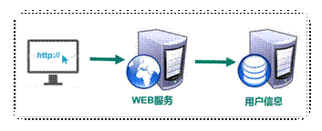

Internet 服务无法与用户身份验证分开。一般过程如下：

1. 用户向服务器发送用户名和密码。
2. 验证服务器后，相关数据（如用户角色，登录时间等）将保存在当前会话中。
3. 服务器向用户返回 session_id，session 信息都会写入到用户的 Cookie。
4. 用户的每个后续请求都将通过在 Cookie 中取出 session_id 传给服务器。
5. 服务器收到 session_id 并对比之前保存的数据，确认用户的身份。

###### 缺点

这种模式最大的问题是，没有分布式架构，无法支持横向扩展

<br>

##### SSO（single sign on）模式

分布式系统常用 SSO(single sign on，又称单点登录) 模式实现登录功能，


###### 优点

用户身份信息独立管理，更好的分布式管理。

 可以自己扩展安全策略

###### 缺点

   认证服务器访问压力较大。

###### 实现方案

1. **session 广播机制实现**：通过 session 复制。

2. **使用 cookie + redis 实现**：在项目某个模块进行登录，登录之后，把数据保存到两个地方：

   - redis：使用生成的唯一随机值（IP 地址、用户 id 等等）作为key，使用用户数据作为value
   - cookie：把 redis 里面生成 key 值放到 cookie 里面

   访问问项目中其他模块时，请求带着 cookie 进行发送，通过 cookie 中的 key 到 redis 进行查询，如果查询成功即已登录状态。

3. **使用 token 实现**：在项目某个模块进行登录，登录之后，按照规则生成字符串，把登录之后的用户信息包含到生成的字符串里面，把字符串返回。字符串可以通过 cookie 返回，也可以通过地址栏返回。访问项目其他模块时，在地址栏带着生成字符串，其他模块根据字符串获取用户信息。

<br>

----

<div STYLE="page-break-after: always;">
    <br>
	<br>
	<br>
	<br>
	<br>
</div>
## 10.2	JWT

### 10.2.1	JWT 概述

#####  访问令牌的类型


<br>

##### JWT 的组成

一个典型的 JWT 看起来如下图：

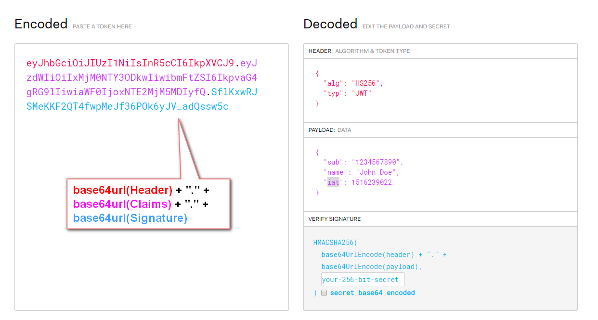

该 JWT 为一个很长的字符串，字符之间通过 `.` 分隔符分为三个子串。每一个子串表示了一个功能块，总共有以下三个部分：

- JWT头
- 有效载荷
- 签名

###### JWT 头

JWT头部分是一个描述 JWT 元数据的 JSON 对象，通常如下所示。

```json
{
  "alg": "HS256",
  "typ": "JWT"
}
```

在上面的代码中，alg 属性表示签名使用的算法，默认为 HMAC SHA256（写为 HS256）；typ 属性表示令牌的类型，JWT 令牌统一写为 JWT。最后，使用 Base64 URL 算法将上述 JSON 对象转换为字符串保存。

###### 有效载荷

有效载荷部分，是 JWT 的主体内容部分，也是一个 JSON 对象，包含需要传递的数据。 JWT 指定七个默认字段供选择。

- **iss**：发行人
- **exp**：到期时间
- **sub**：主题
- **aud**：用户
- **nbf**：在此之前不可用
- **iat**：发布时间
- **jti**：JWT ID用于标识该JWT

除以上默认字段外，我们还可以自定义私有字段，如下例：

```json
{
  "sub": "1234567890",
  "name": "Helen",
  "admin": true
}
```

请注意，默认情况下JWT是未加密的，任何人都可以解读其内容，因此不要构建隐私信息字段，存放保密信息，以防止信息泄露。JSON 对象也使用 Base64 URL 算法转换为字符串保存。

###### 签名哈希

签名哈希部分是对上面两部分数据签名，通过指定的算法生成哈希，以确保数据不会被篡改。首先，需要指定一个密码（secret）。该密码仅仅为保存在服务器中，并且不能向用户公开。然后，使用标头中指定的签名算法（默认情况下为HMAC SHA256）根据以下公式生成签名：

```
HMACSHA256(base64UrlEncode(header) + "." + base64UrlEncode(claims), secret)
```

在计算出签名哈希后，JWT头，有效载荷和签名哈希的三个部分组合成一个字符串，每个部分用"."分隔，就构成整个JWT对象。

###### Base64URL算法

如前所述，JWT 头和有效载荷序列化的算法都用到了 Base64URL。该算法和常见 Base64 算法类似，稍有差别。

作为令牌的 JWT 可以放在 URL 中（例如 api.example/?token=xxx）。 Base64 中用的三个字符是"+"，"/"和"="，由于在 URL 中有特殊含义，因此 Base64URL 中对他们做了替换："="去掉，"+"用"-"替换，"/"用"_"替换，这就是Base64URL算法。

<br>

##### JWT的原则

JWT的原则是在服务器身份验证之后，将生成一个JSON对象并将其发送回用户，如下所示。

```
{
  "sub": "1234567890",
  "name": "Helen",
  "admin": true
}
```

之后，当用户与服务器通信时，客户在请求中发回 JSON 对象。服务器仅依赖于这个JSON对象来标识用户。为了防止用户篡改数据，服务器将在生成对象时添加签名。服务器不保存任何会话数据，即服务器变为无状态，使其更容易扩展。

<br>

##### JWT的用法

客户端接收服务器返回的JWT，将其存储在 Cookie 或 localStorage 中。

此后，客户端将在与服务器交互中都会带 JWT。如果将它存储在 Cookie 中，就可以自动发送，但是不会跨域，因此一般是将它放入 HTTP 请求的 Header Authorization 字段中。当跨域时，也可以将 JWT 被放置于 POST 请求的数据主体中。

<br>

##### JWT 优点与缺点

###### 优点

- JWT不仅可用于认证，还可用于信息交换。善用JWT有助于减少服务器请求数据库的次数。
- 生产的token可以包含基本信息，比如id、用户昵称、头像等信息，避免再次查库
- 存储在客户端，不占用服务端的内存资源

###### 缺点

- JWT 默认不加密，但可以加密。生成原始令牌后，可以再次对其进行加密。
- 当 JWT 未加密时，一些私密数据无法通过 JWT 传输。
- JWT 的最大缺点是服务器不保存会话状态，所以在使用期间不可能取消令牌或更改令牌的权限。也就是说，一旦 JWT 签发，在有效期内将会一直有效。
- JWT 本身包含认证信息，token 是经过 base64 编码，所以可以解码，因此 token 加密前的对象不应该包含敏感信息，一旦信息泄露，任何人都可以获得令牌的所有权限。为了减少盗用，JWT的有效期不宜设置太长。对于某些重要操作，用户在使用时应该每次都进行进行身份验证。
- 为了减少盗用和窃取，JWT不建议使用 HTTP 协议来传输代码，而是使用加密的 HTTPS 协议进行传输。

<br>

---

<div STYLE="page-break-after: always;">
    <br>
	<br>
	<br>
	<br>
	<br>
</div>

### 10.2.2	在项目中整合 JWT 令牌

##### 步骤

###### 第一步

在 common_utils 模块中添加 jwt 工具依赖

```xml
<!-- JWT-->
<dependency>
	<groupId>io.jsonwebtoken</groupId>
    <artifactId>jjwt-api</artifactId>
    <version>${jjwt-api.version}</version>
</dependency>
```

###### 第二步

在 common_utils 模块中创建 JWT 工具类

```
import io.jsonwebtoken.Claims;
import io.jsonwebtoken.Jws;
import io.jsonwebtoken.Jwts;
import io.jsonwebtoken.SignatureAlgorithm;
import org.springframework.util.StringUtils;
import javax.servlet.http.HttpServletRequest;
import java.util.Date;
/**
 * @author
 */
public class JwtUtils {
    public static final long EXPIRE = 1000 * 60 * 60 * 24;
    public static final String APP_SECRET = "ukc8BDbRigUDaY6pZFfWus2jZWLPHO";
    public static String getJwtToken(String id, String nickname){
        String JwtToken = Jwts.builder()
                .setHeaderParam("typ", "JWT")
                .setHeaderParam("alg", "HS256")
                .setSubject("guli-user")
                .setIssuedAt(new Date())
                .setExpiration(new Date(System.currentTimeMillis() + EXPIRE))
                .claim("id", id)
                .claim("nickname", nickname)
                .signWith(SignatureAlgorithm.HS256, APP_SECRET)
                .compact();
        return JwtToken;
    }
    /**
     * 判断token是否存在与有效
     * @param jwtToken
     * @return
     */
    public static boolean checkToken(String jwtToken) {
        if(StringUtils.isEmpty(jwtToken)) return false;
        try {
            Jwts.parser().setSigningKey(APP_SECRET).parseClaimsJws(jwtToken);
        } catch (Exception e) {
            e.printStackTrace();
            return false;
        }
        return true;
    }
    /**
     * 判断token是否存在与有效
     * @param request
     * @return
     */
    public static boolean checkToken(HttpServletRequest request) {
        try {
            String jwtToken = request.getHeader("token");
            if(StringUtils.isEmpty(jwtToken)) return false;
            Jwts.parser().setSigningKey(APP_SECRET).parseClaimsJws(jwtToken);
        } catch (Exception e) {
            e.printStackTrace();
            return false;
        }
        return true;
    }
    /**
     * 根据token获取会员id
     * @param request
     * @return
     */
    public static String getMemberIdByJwtToken(HttpServletRequest request) {
        String jwtToken = request.getHeader("token");
        if(StringUtils.isEmpty(jwtToken)) return "";
        Jws<Claims> claimsJws = Jwts.parser().setSigningKey(APP_SECRET).parseClaimsJws(jwtToken);
        Claims claims = claimsJws.getBody();
        return (String)claims.get("id");
    }
}
```

<br>

---

<div STYLE="page-break-after: always;">
    <br>
	<br>
	<br>
	<br>
	<br>
</div>
## 10.3	阿里云短信服务（需要企业认证）

<br>

----

<div STYLE="page-break-after: always;">
    <br>
	<br>
	<br>
	<br>
	<br>
</div>
## 10.4	邮箱验证

#### 10.4.1	通过 org.apache.commons的commons-email 实现

##### 依赖

```
    <!-- https://mvnrepository.com/artifact/org.apache.commons/commons-email -->
    <dependency>
        <groupId>org.apache.commons</groupId>
        <artifactId>commons-email</artifactId>
        <version>1.5</version>
    </dependency>
```

<br>

---

<div STYLE="page-break-after: always;">
    <br>
	<br>
	<br>
	<br>
	<br>
</div>
## 10.5	登录功能具体实现

### 10.5.1	后端实现

<br>

---

<div STYLE="page-break-after: always;">
    <br>
	<br>
	<br>
	<br>
	<br>
</div>

### 10.5.2	前端实现

<br>

---

<div STYLE="page-break-after: always;">
    <br>
	<br>
	<br>
	<br>
	<br>
</div>

## 10.6	OAuth2

### 10.6.1	OAuth2 概述

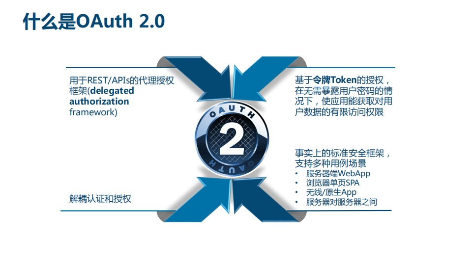

<br>

##### 令牌的核心

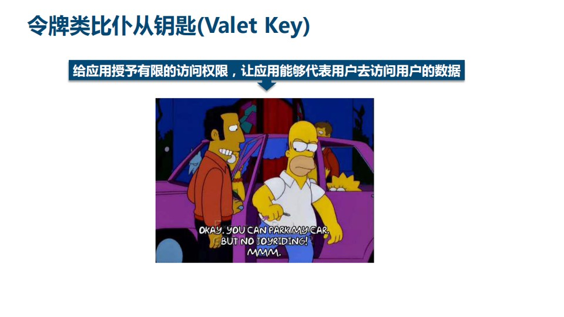

<br>

##### OAuth2 的历史

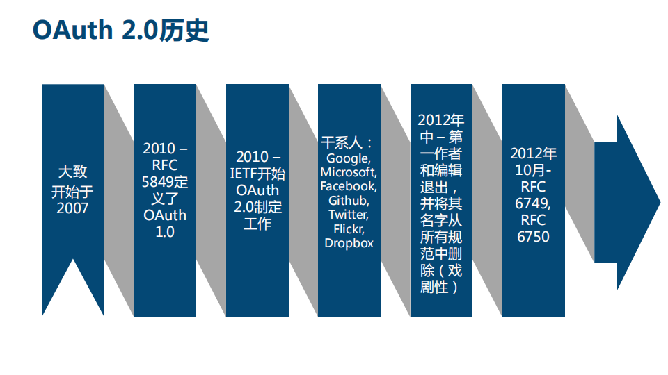

<br>

##### OAuth2的优势

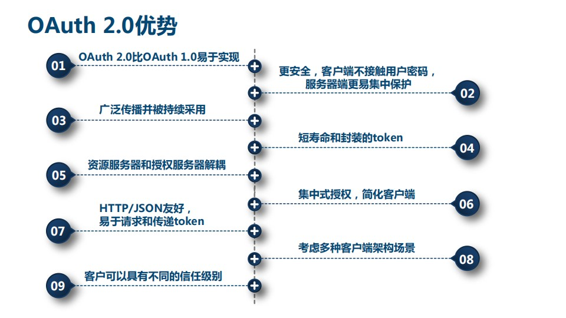

<br>

##### OAuth2的不足

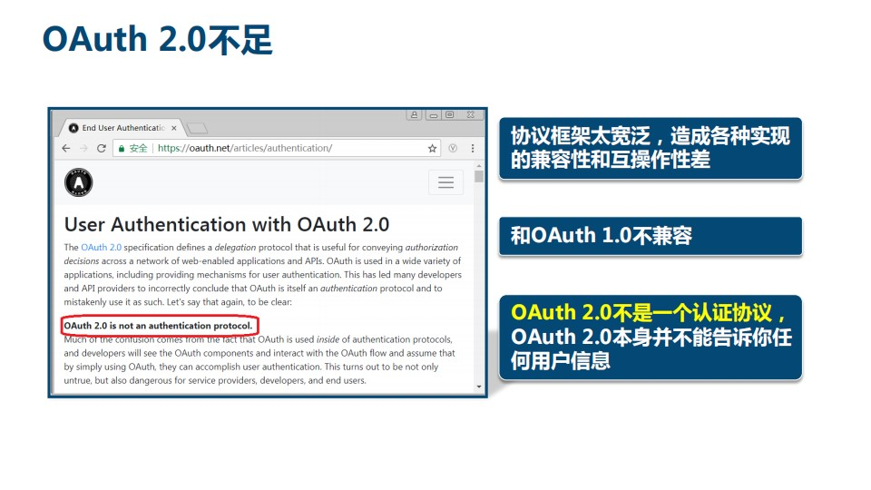

<br>

##### OAuth2 涉及的角色

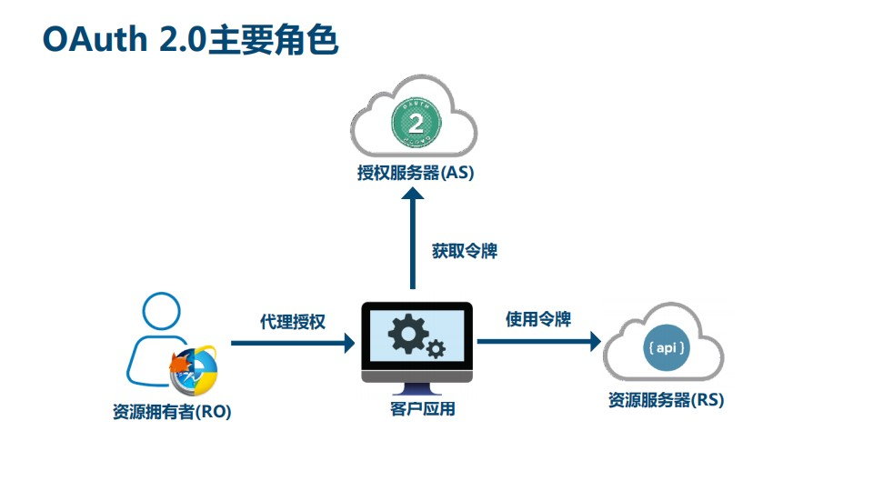

<br>

##### OAuth2 术语

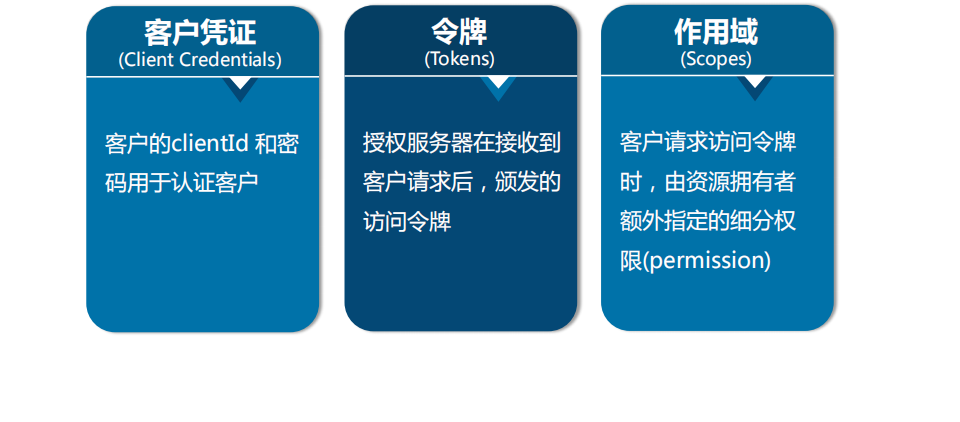

<br>

##### OAuth2 令牌的类型

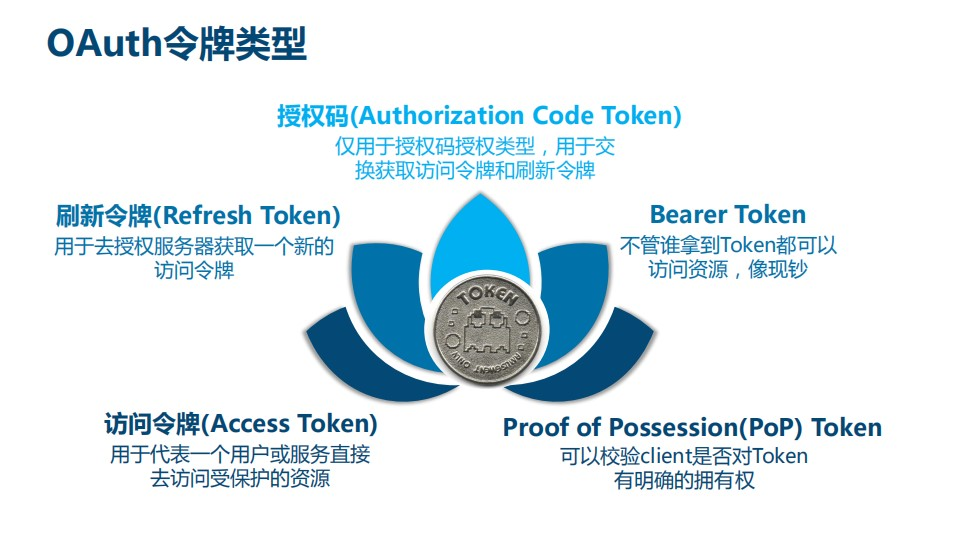

<br>

##### OAuth2 的误解

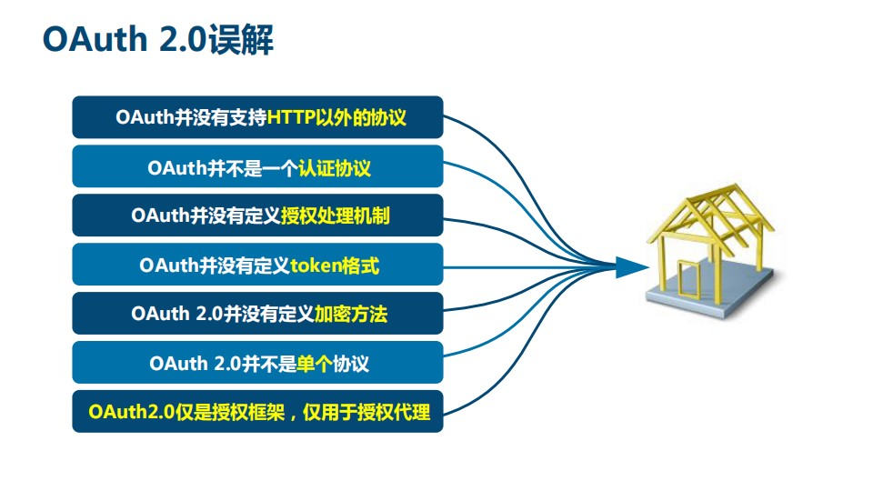

<br>

##### OAuth2 提出的背景

照片拥有者想要在云冲印服务上打印照片，云冲印服务需要访问云存储服务上的资源

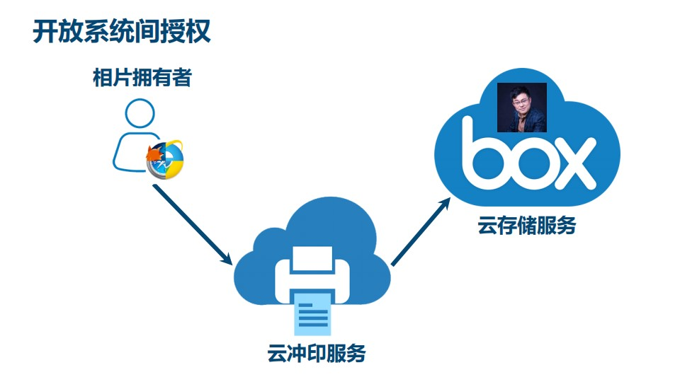

###### 图例

资源拥有者：照片拥有者

客户应用：云冲印

受保护的资源：照片


###### 方式一：用户名密码复制

适用于同一公司内部的多个系统，不适用于不受信的第三方应用


###### 方式二：通用开发者key

适用于合作商或者授信的不同业务部门之间

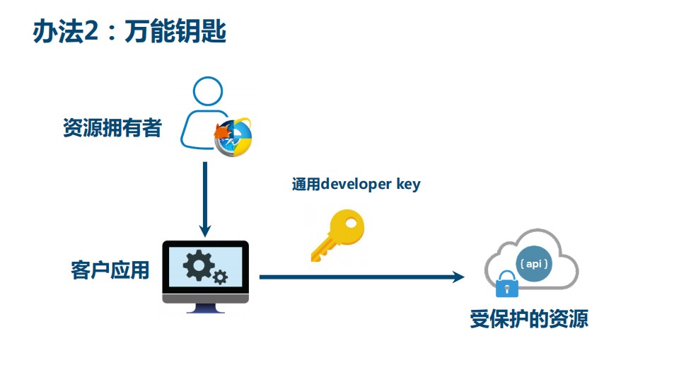

###### 方式三：办法令牌

接近 OAuth2 方式，需要考虑如何管理令牌、颁发令牌、吊销令牌，需要统一的协议，因此就有了 OAuth2 协议

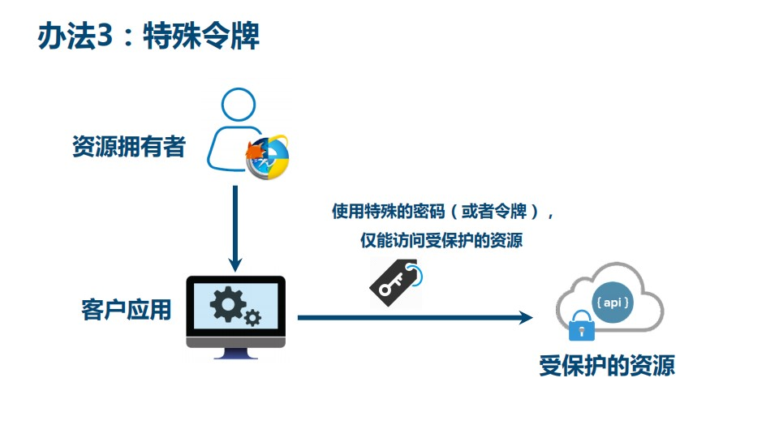

<br>

##### 现代微服务安全

除了开放系统授权，OAuth2还可以应用于现代微服务安全

###### 传统单块应用的安全


###### 现代微服务安全

现代微服务中系统微服务化以及应用的形态和设备类型增多，不能用传统的登录方式

核心的技术不是用户名和密码，而是token，由AuthServer颁发token，用户使用token进行登录


<br>

##### 典型的 OAuth2 应用

- 扫码登录
- 第三方授权登录

<br>

##### 总结

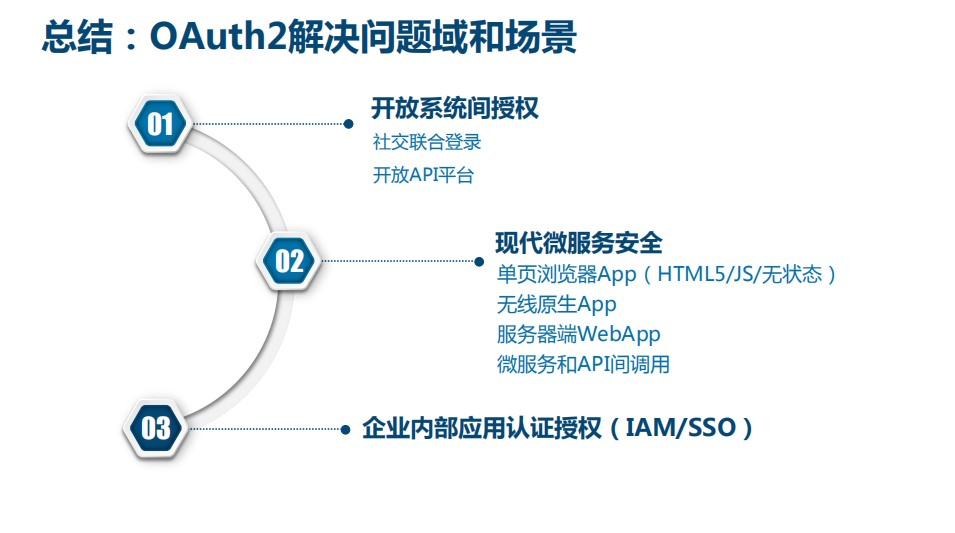

<br>

---

<div STYLE="page-break-after: always;">
    <br>
	<br>
	<br>
	<br>
	<br>
</div>

### 10.6.2	实现微信 OAuth2 登录

##### 前提条件

- 微信开发者资质认证（需要营业执照、审批时间以及注册费）
- 微信开放平台 appid
- 微信开放平台 appsecret
- 微信开放平台 重定向url

```properties
# 微信开放平台 appid
wx.open.app_id=你的appid
# 微信开放平台 appsecret
wx.open.app_secret=你的appsecret
# 微信开放平台 重定向url
wx.open.redirect_url=http://你的服务器名称/api/ucenter/wx/callback
```

<br>

##### 依赖

```xml
    <dependencies>

        <!--httpclient-->
        <dependency>
            <groupId>org.apache.httpcomponents</groupId>
            <artifactId>httpclient</artifactId>
        </dependency>
        <!--commons-io-->
        <dependency>
            <groupId>commons-io</groupId>
            <artifactId>commons-io</artifactId>
        </dependency>
        <!--可以使用 SpringBoot 默认的 json 解析器-->
        <dependency>
            <groupId>com.google.code.gson</groupId>
            <artifactId>gson</artifactId>
        </dependency>
    </dependencies>
```

<br>

##### 步骤

###### 第一步

创建工具类读取配置文件：

```java
import org.springframework.beans.factory.InitializingBean;
import org.springframework.beans.factory.annotation.Value;
import org.springframework.stereotype.Component;

@Component
public class ConstantWxUtils implements InitializingBean {

    @Value("${wx.open.app_id}")
    private String appId;

    @Value("${wx.open.app_secret}")
    private String appSecret;

    @Value("${wx.open.redirect_url}")
    private String redirectUrl;

    public static String WX_OPEN_APP_ID;
    public static String WX_OPEN_APP_SECRET;
    public static String WX_OPEN_REDIRECT_URL;

    @Override
    public void afterPropertiesSet() throws Exception {
        WX_OPEN_APP_ID = appId;
        WX_OPEN_APP_SECRET = appSecret;
        WX_OPEN_REDIRECT_URL = redirectUrl;
    }
}
```

######  第二步📌（也许可以通过 Feign 实现）

创建 HttpClientUtils 工具类

```java
package cn.nilnullnaught.educenter.util;

import org.apache.commons.io.IOUtils;
import org.apache.commons.lang.StringUtils;
import org.apache.http.Consts;
import org.apache.http.HttpEntity;
import org.apache.http.HttpResponse;
import org.apache.http.NameValuePair;
import org.apache.http.client.HttpClient;
import org.apache.http.client.config.RequestConfig;
import org.apache.http.client.config.RequestConfig.Builder;
import org.apache.http.client.entity.UrlEncodedFormEntity;
import org.apache.http.client.methods.HttpGet;
import org.apache.http.client.methods.HttpPost;
import org.apache.http.conn.ConnectTimeoutException;
import org.apache.http.conn.ssl.SSLConnectionSocketFactory;
import org.apache.http.conn.ssl.SSLContextBuilder;
import org.apache.http.conn.ssl.TrustStrategy;
import org.apache.http.conn.ssl.X509HostnameVerifier;
import org.apache.http.entity.ContentType;
import org.apache.http.entity.StringEntity;
import org.apache.http.impl.client.CloseableHttpClient;
import org.apache.http.impl.client.HttpClients;
import org.apache.http.impl.conn.PoolingHttpClientConnectionManager;
import org.apache.http.message.BasicNameValuePair;

import javax.net.ssl.SSLContext;
import javax.net.ssl.SSLException;
import javax.net.ssl.SSLSession;
import javax.net.ssl.SSLSocket;
import java.io.IOException;
import java.net.SocketTimeoutException;
import java.security.GeneralSecurityException;
import java.security.cert.CertificateException;
import java.security.cert.X509Certificate;
import java.util.ArrayList;
import java.util.List;
import java.util.Map;
import java.util.Map.Entry;
import java.util.Set;

/**
 *  依赖的jar包有：commons-lang-2.6.jar、httpclient-4.3.2.jar、httpcore-4.3.1.jar、commons-io-2.4.jar
 * @author zhaoyb
 *
 */
public class HttpClientUtils {

    public static final int connTimeout=10000;
    public static final int readTimeout=10000;
    public static final String charset="UTF-8";
    private static HttpClient client = null;

    static {
        PoolingHttpClientConnectionManager cm = new PoolingHttpClientConnectionManager();
        cm.setMaxTotal(128);
        cm.setDefaultMaxPerRoute(128);
        client = HttpClients.custom().setConnectionManager(cm).build();
    }

    public static String postParameters(String url, String parameterStr) throws ConnectTimeoutException, SocketTimeoutException, Exception{
        return post(url,parameterStr,"application/x-www-form-urlencoded",charset,connTimeout,readTimeout);
    }

    public static String postParameters(String url, String parameterStr,String charset, Integer connTimeout, Integer readTimeout) throws ConnectTimeoutException, SocketTimeoutException, Exception{
        return post(url,parameterStr,"application/x-www-form-urlencoded",charset,connTimeout,readTimeout);
    }

    public static String postParameters(String url, Map<String, String> params) throws ConnectTimeoutException,
            SocketTimeoutException, Exception {
        return postForm(url, params, null, connTimeout, readTimeout);
    }

    public static String postParameters(String url, Map<String, String> params, Integer connTimeout,Integer readTimeout) throws ConnectTimeoutException,
            SocketTimeoutException, Exception {
        return postForm(url, params, null, connTimeout, readTimeout);
    }

    public static String get(String url) throws Exception {
        return get(url, charset, null, null);
    }

    public static String get(String url, String charset) throws Exception {
        return get(url, charset, connTimeout, readTimeout);
    }

    /**
     * 发送一个 Post 请求, 使用指定的字符集编码.
     *
     * @param url
     * @param body RequestBody
     * @param mimeType 例如 application/xml "application/x-www-form-urlencoded" a=1&b=2&c=3
     * @param charset 编码
     * @param connTimeout 建立链接超时时间,毫秒.
     * @param readTimeout 响应超时时间,毫秒.
     * @return ResponseBody, 使用指定的字符集编码.
     * @throws ConnectTimeoutException 建立链接超时异常
     * @throws SocketTimeoutException  响应超时
     * @throws Exception
     */
    public static String post(String url, String body, String mimeType,String charset, Integer connTimeout, Integer readTimeout)
            throws ConnectTimeoutException, SocketTimeoutException, Exception {
        HttpClient client = null;
        HttpPost post = new HttpPost(url);
        String result = "";
        try {
            if (StringUtils.isNotBlank(body)) {
                HttpEntity entity = new StringEntity(body, ContentType.create(mimeType, charset));
                post.setEntity(entity);
            }
            // 设置参数
            Builder customReqConf = RequestConfig.custom();
            if (connTimeout != null) {
                customReqConf.setConnectTimeout(connTimeout);
            }
            if (readTimeout != null) {
                customReqConf.setSocketTimeout(readTimeout);
            }
            post.setConfig(customReqConf.build());

            HttpResponse res;
            if (url.startsWith("https")) {
                // 执行 Https 请求.
                client = createSSLInsecureClient();
                res = client.execute(post);
            } else {
                // 执行 Http 请求.
                client = HttpClientUtils.client;
                res = client.execute(post);
            }
            result = IOUtils.toString(res.getEntity().getContent(), charset);
        } finally {
            post.releaseConnection();
            if (url.startsWith("https") && client != null&& client instanceof CloseableHttpClient) {
                ((CloseableHttpClient) client).close();
            }
        }
        return result;
    }


    /**
     * 提交form表单
     *
     * @param url
     * @param params
     * @param connTimeout
     * @param readTimeout
     * @return
     * @throws ConnectTimeoutException
     * @throws SocketTimeoutException
     * @throws Exception
     */
    public static String postForm(String url, Map<String, String> params, Map<String, String> headers, Integer connTimeout,Integer readTimeout) throws ConnectTimeoutException,
            SocketTimeoutException, Exception {

        HttpClient client = null;
        HttpPost post = new HttpPost(url);
        try {
            if (params != null && !params.isEmpty()) {
                List<NameValuePair> formParams = new ArrayList<NameValuePair>();
                Set<Entry<String, String>> entrySet = params.entrySet();
                for (Entry<String, String> entry : entrySet) {
                    formParams.add(new BasicNameValuePair(entry.getKey(), entry.getValue()));
                }
                UrlEncodedFormEntity entity = new UrlEncodedFormEntity(formParams, Consts.UTF_8);
                post.setEntity(entity);
            }

            if (headers != null && !headers.isEmpty()) {
                for (Entry<String, String> entry : headers.entrySet()) {
                    post.addHeader(entry.getKey(), entry.getValue());
                }
            }
            // 设置参数
            Builder customReqConf = RequestConfig.custom();
            if (connTimeout != null) {
                customReqConf.setConnectTimeout(connTimeout);
            }
            if (readTimeout != null) {
                customReqConf.setSocketTimeout(readTimeout);
            }
            post.setConfig(customReqConf.build());
            HttpResponse res = null;
            if (url.startsWith("https")) {
                // 执行 Https 请求.
                client = createSSLInsecureClient();
                res = client.execute(post);
            } else {
                // 执行 Http 请求.
                client = HttpClientUtils.client;
                res = client.execute(post);
            }
            return IOUtils.toString(res.getEntity().getContent(), "UTF-8");
        } finally {
            post.releaseConnection();
            if (url.startsWith("https") && client != null
                    && client instanceof CloseableHttpClient) {
                ((CloseableHttpClient) client).close();
            }
        }
    }


    /**
     * 发送一个 GET 请求
     *
     * @param url
     * @param charset
     * @param connTimeout  建立链接超时时间,毫秒.
     * @param readTimeout  响应超时时间,毫秒.
     * @return
     * @throws ConnectTimeoutException   建立链接超时
     * @throws SocketTimeoutException   响应超时
     * @throws Exception
     */
    public static String get(String url, String charset, Integer connTimeout,Integer readTimeout)
            throws ConnectTimeoutException,SocketTimeoutException, Exception {

        HttpClient client = null;
        HttpGet get = new HttpGet(url);
        String result = "";
        try {
            // 设置参数
            Builder customReqConf = RequestConfig.custom();
            if (connTimeout != null) {
                customReqConf.setConnectTimeout(connTimeout);
            }
            if (readTimeout != null) {
                customReqConf.setSocketTimeout(readTimeout);
            }
            get.setConfig(customReqConf.build());

            HttpResponse res = null;

            if (url.startsWith("https")) {
                // 执行 Https 请求.
                client = createSSLInsecureClient();
                res = client.execute(get);
            } else {
                // 执行 Http 请求.
                client = HttpClientUtils.client;
                res = client.execute(get);
            }

            result = IOUtils.toString(res.getEntity().getContent(), charset);
        } finally {
            get.releaseConnection();
            if (url.startsWith("https") && client != null && client instanceof CloseableHttpClient) {
                ((CloseableHttpClient) client).close();
            }
        }
        return result;
    }


    /**
     * 从 response 里获取 charset
     *
     * @param ressponse
     * @return
     */
    @SuppressWarnings("unused")
    private static String getCharsetFromResponse(HttpResponse ressponse) {
        // Content-Type:text/html; charset=GBK
        if (ressponse.getEntity() != null  && ressponse.getEntity().getContentType() != null && ressponse.getEntity().getContentType().getValue() != null) {
            String contentType = ressponse.getEntity().getContentType().getValue();
            if (contentType.contains("charset=")) {
                return contentType.substring(contentType.indexOf("charset=") + 8);
            }
        }
        return null;
    }


    /**
     * 创建 SSL连接
     * @return
     * @throws GeneralSecurityException
     */
    private static CloseableHttpClient createSSLInsecureClient() throws GeneralSecurityException {
        try {
            SSLContext sslContext = new SSLContextBuilder().loadTrustMaterial(null, new TrustStrategy() {
                public boolean isTrusted(X509Certificate[] chain,String authType) throws CertificateException {
                    return true;
                }
            }).build();

            SSLConnectionSocketFactory sslsf = new SSLConnectionSocketFactory(sslContext, new X509HostnameVerifier() {

                @Override
                public boolean verify(String arg0, SSLSession arg1) {
                    return true;
                }

                @Override
                public void verify(String host, SSLSocket ssl)
                        throws IOException {
                }

                @Override
                public void verify(String host, X509Certificate cert)
                        throws SSLException {
                }

                @Override
                public void verify(String host, String[] cns,
                                   String[] subjectAlts) throws SSLException {
                }

            });

            return HttpClients.custom().setSSLSocketFactory(sslsf).build();

        } catch (GeneralSecurityException e) {
            throw e;
        }
    }
    
    //测试
    public static void main(String[] args) {
        try {
            String str= post("https://localhost:443/ssl/test.shtml","name=12&page=34","application/x-www-form-urlencoded", "UTF-8", 10000, 10000);
            //String str= get("https://localhost:443/ssl/test.shtml?name=12&page=34","GBK");
            /*Map<String,String> map = new HashMap<String,String>();
            map.put("name", "111");
            map.put("page", "222");
            String str= postForm("https://localhost:443/ssl/test.shtml",map,null, 10000, 10000);*/
            System.out.println(str);
        } catch (ConnectTimeoutException e) {
            // TODO Auto-generated catch block
            e.printStackTrace();
        } catch (SocketTimeoutException e) {
            // TODO Auto-generated catch block
            e.printStackTrace();
        } catch (Exception e) {
            // TODO Auto-generated catch block
            e.printStackTrace();
        }
    }

}

```

###### 第三步

创建 controller

```java
import com.atguigu.commonutils.JwtUtils;
import com.atguigu.educenter.entity.UcenterMember;
import com.atguigu.educenter.service.UcenterMemberService;
import com.atguigu.educenter.utils.ConstantWxUtils;
import com.atguigu.educenter.utils.HttpClientUtils;
import com.atguigu.servicebase.exceptionhandler.GuliException;
import com.google.gson.Gson;
import org.springframework.beans.factory.annotation.Autowired;
import org.springframework.stereotype.Controller;
import org.springframework.web.bind.annotation.*;

import java.net.URLEncoder;
import java.util.HashMap;

@CrossOrigin
@Controller  //只是请求地址，不需要返回数据，所以不使用 @RestController
@RequestMapping("/api/wx")
public class WxApiController {

    @Autowired
    private UcenterMemberService memberService;
    
     //生成微信扫描二维码
    @GetMapping("login")
    public String getWxCode() {
        //固定地址，后面拼接参数
//        String url = "https://open.weixin.qq.com/" +
//                "connect/qrconnect?appid="+ ConstantWxUtils.WX_OPEN_APP_ID+"&response_type=code";

        // 微信开放平台授权baseUrl  %s相当于?代表占位符
        String baseUrl = "https://open.weixin.qq.com/connect/qrconnect" +
                "?appid=%s" +
                "&redirect_uri=%s" +
                "&response_type=code" +
                "&scope=snsapi_login" +
                "&state=%s" +
                "#wechat_redirect";

        //对redirect_url进行URLEncoder编码
        String redirectUrl = ConstantWxUtils.WX_OPEN_REDIRECT_URL;
        try {
            redirectUrl = URLEncoder.encode(redirectUrl, "utf-8");
        }catch(Exception e) {
        }
        
        // 防止csrf攻击（跨站请求伪造攻击）
        //一般情况下会使用一个随机数
		//String state = UUID.randomUUID().toString().replaceAll("-", "");
        //为了让大家能够使用我搭建的外网的微信回调跳转服务器,这里填写你在ngrok的前置域名
		String state = "atguigu"

        //设置%s里面值
        String url = String.format(
                    baseUrl,
                    ConstantWxUtils.WX_OPEN_APP_ID,
                    redirectUrl,
                    state
                 );

        //重定向到请求微信地址里面
        return "redirect:"+url;
    }

    //回调，获取扫描人信息，添加数据
    @GetMapping("callback")
    public String callback(String code, String state) {
        try {
            //1 获取code值，临时票据，类似于验证码
            //2 拿着code请求 微信固定的地址，得到两个值 accsess_token 和 openid
            String baseAccessTokenUrl = "https://api.weixin.qq.com/sns/oauth2/access_token" +
                    "?appid=%s" +
                    "&secret=%s" +
                    "&code=%s" +
                    "&grant_type=authorization_code";
            //拼接三个参数 ：id  秘钥 和 code值
            String accessTokenUrl = String.format(
                    baseAccessTokenUrl,
                    ConstantWxUtils.WX_OPEN_APP_ID,
                    ConstantWxUtils.WX_OPEN_APP_SECRET,
                    code
            );
            //请求这个拼接好的地址，得到返回两个值 accsess_token 和 openid
            //使用httpclient发送请求，得到返回结果
            String accessTokenInfo = HttpClientUtils.get(accessTokenUrl);

            //从accessTokenInfo字符串获取出来两个值 accsess_token 和 openid
            //把accessTokenInfo字符串转换map集合，根据map里面key获取对应值
            //使用json转换工具 Gson
            Gson gson = new Gson();
            HashMap mapAccessToken = gson.fromJson(accessTokenInfo, HashMap.class);
            String access_token = (String)mapAccessToken.get("access_token");
            String openid = (String)mapAccessToken.get("openid");

            //把扫描人信息添加数据库里面
            //判断数据表里面是否存在相同微信信息，根据openid判断
            UcenterMember member = memberService.getOpenIdMember(openid);
            if(member == null) {//memeber是空，表没有相同微信数据，进行添加

                //3 拿着得到accsess_token 和 openid，再去请求微信提供固定的地址，获取到扫描人信息
                //访问微信的资源服务器，获取用户信息
                String baseUserInfoUrl = "https://api.weixin.qq.com/sns/userinfo" +
                        "?access_token=%s" +
                        "&openid=%s";
                //拼接两个参数
                String userInfoUrl = String.format(
                        baseUserInfoUrl,
                        access_token,
                        openid
                );
                //发送请求
                String userInfo = HttpClientUtils.get(userInfoUrl);
                //获取返回userinfo字符串扫描人信息
                HashMap userInfoMap = gson.fromJson(userInfo, HashMap.class);
                String nickname = (String)userInfoMap.get("nickname");//昵称
                String headimgurl = (String)userInfoMap.get("headimgurl");//头像

                member = new UcenterMember();
                member.setOpenid(openid);
                member.setNickname(nickname);
                member.setAvatar(headimgurl);
                memberService.save(member);
            }

            //使用jwt根据member对象生成token字符串
            String jwtToken = JwtUtils.getJwtToken(member.getId(), member.getNickname());
            //最后：返回首页面，通过路径传递token字符串
            return "redirect:http://localhost:3000?token="+jwtToken;
        }catch(Exception e) {
            throw new GuliException(20001,"登录失败");
        }
    }

   
}
```

Servi

```java
@Service
public class UcenterMemberServiceImpl extends ServiceImpl<UcenterMemberMapper, UcenterMember> implements UcenterMemberService {

	...

	@Override
    public UcenterMember getOpenIdMember(String openid) {
        QueryWrapper<UcenterMember> wrapper = new QueryWrapper<>();
        wrapper.eq("openid",openid);
        UcenterMember member = baseMapper.selectOne(wrapper);
        return member;
    }
}
```

授权 url 参数说明

| 参数          | 是否必须 | 说明                                                         |
| ------------- | -------- | ------------------------------------------------------------ |
| appid         | 是       | 应用唯一标识                                                 |
| redirect_uri  | 是       | 请使用urlEncode对链接进行处理                                |
| response_type | 是       | 填code                                                       |
| scope         | 是       | 应用授权作用域，拥有多个作用域用逗号（,）分隔，网页应用目前仅填写snsapi_login即 |
| state         | 否       | 用于保持请求和回调的状态，授权请求后原样带回给第三方。该参数可用于防止csrf攻击（跨站请求伪造攻击），建议第三方带上该参数，可设置为简单的随机数加session进行校验 |

<br>


---

