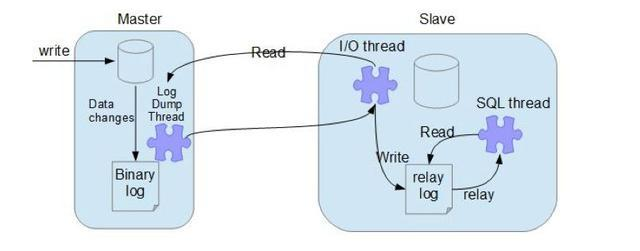

	 
     
     
     
     
     
     
     
     
     
	
<h3>
        MySQL
    </h3>

	 
     
     
     
     
     
     
     
     
     

# 1	MySQL 事务

## 1.1	ACID

#### 什么是 ACID

ACID，是指数据库管理系统（DBMS）在写入或更新资料的过程中，为保证事务（transaction）是正确可靠的，所必须具备的四个特性：

1. **原子性（atomicity，或称不可分割性）**：一个事务（transaction）中的所有操作，要么全部完成，要么全部不完成，不会结束在中间某个环节。事务在执行过程中发生错误，会被恢复（Rollback）到事务开始前的状态，就像这个事务从来没有执行过一样。
2. **一致性（consistency）**：在事务开始之前和事务结束以后，数据库的完整性没有被破坏。这表示写入的资料必须完全符合所有的预设规则，这包含资料的精确度、串联性以及后续数据库可以自发性地完成预定的工作。
3. **隔离性（isolation，又称独立性）**：数据库允许多个并发事务同时对其数据进行读写和修改，隔离性可以防止多个事务并发执行时由于交叉执行而导致数据的不一致。事务隔离分为不同级别，包括读未提交（Read uncommitted）、读提交（read committed）、可重复读（repeatable read）和串行化（Serializable）。
4. **持久性（durability）**：事务处理结束后，对数据的修改就是永久的，即便系统故障也不会丢失。

 

#### 如何保证 ACID

1. **原子性**：由 undolog 保证，它记录了需要回滚的日志信息，在事务回滚时撤销已经执行成功的 SQL；
2. **一致性**：由其他三大特性保证，程序代码要保证业务上的一致性；
3. **隔离性**：由 MVCC（Multi-Version Concurrency Control，多版本并发控制） 来保证；
4. **持久性**：由 redolog 来保证，MySQL 修改数据时会在 redolog 中记录日志，就算数据没有保存成功，只要日志保存成功了，数据就不会丢失。

 

----

 
     
     
     
     
     
     
     
     
     

## 1.2	MVCC 简介

#### 什么是 MVCC

MVCC（Multi-Version Concurrency Control，多版本并发控制）是一种并发控制的方法，一般在数据库管理系统中实现对数据库的并发访问。	

MVCC 是乐观锁的一种体现，读不加锁，读写不冲突，在不加锁的情况下能让多个事务进行并发读写，并且解决读写冲突问题，极大的提高系统的并发性。

 

#### MVCC 解决的问题是什么

数据库并发场景有三种，分别为：

1. 读读：不存在任何问题。也不需要并发控制；
2. 读写：有线程安全问题，可能会造成事务隔离性问题，可能遇到脏读、幻读、不可重复读；
3. 写写：有线程安全问题，可能存在更新丢失问题。

MVCC 是一种用来解决读写冲突的 **无锁** 并发控制， 也就是为事务分配单项增长的时间戳，为每个修改保存一个版本，版本与事务时间戳关联，读操作只读该事务开始前的数据库的快照，所以 MVCC 可以为数据库解决以下问题：

1. **阻塞问题**：在并发读写数据库时，可以做到在读写操作都不阻塞，提高了数据库并发读写的性能；
2. **事务隔离问题**：解决脏读、幻读、**不可重复读等**，但是不能解决更新丢失问题。

 

---

 
     
     
     
     
     
     
     
     
     

## 1.3	MySQL 的事务隔离级别与脏读、不可重复读、幻读

#### 并发问题出现的条件

事务的隔离性要求并发执行的事务之间彼此隔离，互不影响。

如果多个事务访问的数据不同，那不管怎么并行运行都不会相互影响。并发问题（或者称为竞争条件）只会出现在以下两种情况中：

1. 当一个事务读一个数据，而这个数据刚好在被另一个事务修改。
2. 两个事务尝试同时修改同一个数据。

 

#### 什么是事务隔离级别

MySQL 定义了四种隔离级别，包括一些具体规则，用于限定事务内外哪些改变是可见的，哪些改变是不可见的。低级别的隔离一般支持更高的并发处理， 并且拥有更低的系统开销。

 

#### MySQL 的四种事务隔离级别

###### READ UNCOMMITTED 读取未提交内容

在这个隔离级别，所有事务都可以“看到”未提交事务的执行结果。在这种级别上，可能会产生很多问题（比如读取未提交数据，即脏读），除非用户真的知道自己在做什么，并有很好的理由选择这样做。本隔离级别很少用于实际应用，因为它的性能也不必其他性能好多少，而别的级别还有其他更多的优点。

###### READ COMMITTED 读取提交内容

大多数数据库系统的默认隔离级别（但不是 MySQL 的默认隔离级别）。

保证了读数据时只能读到已提交事务的数据 （没有脏读），写数据时只能覆盖已经提交事务的数据 （没有脏写）。

这种隔离级别容易导致 **不可重复读**，即在一次事务中读同一个数据却读到了两个不同的值。

###### REPEATABLE READ 可重复读

MySQL 数据库默认的隔离级别。解决了 READ UNCOMMITTED 隔离级别导致的问题，它保证同一事务的多个实例在并发读取事务时，会“看到”同样的数据行。

当使用可重复读隔离级别时，在事务执行期间会锁定该事务以任何方式引用的所有行。因此，如果在同一个事务中发出同一个 SELECT 语句两次或更多次，那么产生的结果数据集总是相同的。因此，使用可重复读隔离级别的事务可以多次检索同一行集，并对它们执行任意操作，直到提交或回滚操作终止该事务。不过，这会导致另一个棘手问题——幻读。InnoDB 和 Falcon 存储引擎通过多版本并发控制机制解决了幻读问题。

###### SERIALIZABLE 可串行化

该级别是最高级别的隔离级别。通过强制事务排序，使之不可能相互冲突，从而解决幻读问题。简而言之，SERIALIZABLE 是在每个读的数据行上加锁。在这个级别，可能导致大量的超时 Timeout 和锁竞争 Lock Contention 现象，实际应用中很少使用到这个级别，但如果用户的应用为了数据的稳定性，需要强制减少并发的话，也可以选择这种隔离级。

 

#### 脏读

脏读指当一个事务正在访问数据，并且对数据进行了修改，而这种修改还没有提交到数据库中，这时，另外一个事务也访问这个数据，然后使用了这个数据。因为这个数据是还没有提交的数据，那么另外一个事务读到的这个数据是脏数据，依据脏数据所做的操作可能是不正确的。

 

#### 不可重复读

在一个事务内，多次读同一个数据。在这个事务还没有结束时，另一个事务也访问该同一数据并修改数据。那么，在第一个事务的两次读数据之间。由于另一个事务的修改，那么第一个事务两次读到的数据可能不一样，这样就发生了在一个事务内两次读到的数据是不一样的，因此称为不可重复读，即原始读取不可重复。

 

#### 脏读和不可重复读之间的区别

脏读读取的数据来自未提交的事务，而不可重复读读取的数据来自提交完成的事务。

 

#### 虚读（幻读）

幻读是事务非独立执行时发生的一种现象，例如，事务 A 批量对一个表中某一列列值为 1 的数据修改为 2 ，但是在这时，事务 B 对这张表插入了一条列值为 1 的数据，并完成提交。此时，如果事务一查看刚刚完成操作的数据，发现还有一条列值为 1 的数据没有进行修改，而这条数据其实是事务 B 刚刚提交插入的，这就是幻读。

 

#### 不可重复读和幻读之间的区别

幻读和不可重复读都是读取了另一条已经提交的事务（这点同脏读不同），不同的是不可重复读查询的都是同一个数据项，而幻读针对的是一批数据整体。

 

##### ❗补充资料

https://zhuanlan.zhihu.com/p/150107974

 

---

 
     
     
     
     
     
     
     
     
     

## 1.4	MVCC——快照读

#### 当前读与快照读

###### 当前读

读取记录的最新版本，读取时还要保证其他并发事务不能修改当前记录，会对读取的记录加锁。select lock in share mode（共享锁）、select for update（排他锁）、update、insert、delete 都是当前读操作。

###### 快照读

快照读是基于提高并发性能的考虑，快照读的实现基于 MVCC，由于基于 MVCC，快照读读取到的数据不一定是最新版本，也有可能是之前的历史版本。

注意，快照读的前提是隔离级别不是串行级别，串行级别下的快照都会变成当前读。

 

#### 快照读与 MVCC 之间的关系

快照读是 MySQL 通过 MVCC 实现的一个非阻塞读功能。

 

---

 
     
     
     
     
     
     
     
     
     

## 1.5	MVCC 的实现原理（❗需要补充）

#### MVCC 实现方式

MVCC 通过事务版本号、隐式字段、undo 日志、Read view 实现。

 

#### 事务版本号

每次事务开启前都会从数据库获得一个自增长的事务ID，可以从事务ID判断事务的执行先后顺序。

 

#### 表格的隐藏列

| 列名        | 说明                                                         |
| ----------- | ------------------------------------------------------------ |
| DB_TRX_ID   | 记录操作该数据事务的事务 ID；                                |
| DB_ROLL_PTR | 指向上一个版本数据在 undo log 里的位置指针；                 |
| DB_ROW_ID   | 隐藏 ID ，当创建表没有合适的索引作为聚集索引时，会用该隐藏 ID 创建聚集索引; |

 

#### Undo log

Undo log 主要用于记录数据被修改之前的日志，在表信息修改之前先会把数据拷贝到 undo log 里，当事务进行回滚时可以通过 undo log 里的日志进行数据还原。

 

#### Read view

在 innodb 中每个事务开启后都会得到一个 read_view。副本主要保存了当前数据库系统中正处于活跃（没有 commit）的事务的 ID 号，其实简单的说这个副本中保存的是系统中当前不应该被本事务看到的其他事务id列表。

 

---

 
     
     
     
     
     
     
     
     
     

## 1.6	MySQL 锁的类型

#### 基于锁的属性分类

1. 共享锁
2. 排他锁（exclusive lock）

 

#### 基于锁的粒度分类

1. 表级锁（innodb、myisam）
2. 页级锁（innodb 引擎）
3. 行级锁（innodb）
4. 记录锁
5. 间隙锁
6. 临键锁

 

#### 基于锁的状态分类

1. 意向共享锁
2. 意向排他锁

 

#### 共享锁（share lock）

共享锁又称读锁，简称 S锁。

当一个事务为数据加上读锁之后，其他事务只能对该数据加读锁，而不能对数据加写锁，直到所有的读锁释放之后其他事务才能对其加写锁。

共享锁的特性主要是为了支持并发的读取数据，读取数据的时候不支持修改，避免出现重复读的问题。

 

#### 排他锁（exclusive lock）

排他锁又称写锁，简称 X 锁。

当一个事务为数据加上写锁时，其他请求将不能再为数据加任何锁，直到该锁释放之后，其他事务才能对数据进行加锁。

排他锁的目的是在数据修改时候，不允许其他人同时修改，也不允许其他人读取，避免了出现脏数据和脏读的问题。

 

#### 表锁（table lock）

表锁是指上锁的时候锁住的是整个表，当下一个事务访问该表的时候，必须等前一个事务释放了锁才能进行对表进行访问。

特点：粒度大，加锁简单，容易冲突。

 

#### 页锁

页级锁是 MySQL 中锁定粒度介于行级锁和表级锁中间的一种锁。表级锁速度快，但冲突多，行级冲突少，但速度慢。所以取了折衷的页级。

一次锁定相邻的一组记录。

特点：开销和加锁时间界于表锁和行锁之间。锁定粒度界于表锁和行锁之间，并发度一般。

 

#### 行锁

行锁是指上锁的时候锁住的是表的某一行或多行记录， 其他事务访问同一张表时，只有被锁住的记录不能访问，其他的记录可正常访问。

特点：粒度小，加锁比表锁麻烦，不容易冲突，相比表锁支持的并发要高。

 

#### 记录锁（Record lock）

记录锁属于行锁中的一种，只不过记录锁的范围只是表中的某一条记录,。

 加了记录锁之后数据可以避免数据在查询的时候被修改的重复读问题，也避免了在修改的事务未提交前被其他事务读取的脏读问题。

 

#### 间隙锁

属于行锁的一种。

间隙锁是一个在索引记录之间的间隙上的锁，可以是两个索引记录之间，也可能是第一个索引记录之前或最后一个索引之后的空间。

当我们用范围条件而不是相等条件索引数据，并请求共享或排他锁时，InnoDB 会给符合条件的数据记录的索引项加锁；对于键值在条件范围内但并不存在的记录，叫做“间隙（GAP）”，在锁定的时候无法插入锁定键值范围内的任何数据。

间隙锁只会出现在 REPEATABLE_READ （重复读）的事务级别中。

 

#### 临键锁（Next-Key lock）

属于行锁的一种，并且是 INNODB 的行锁默认算法。

总结来说它就是记录锁和间隙锁的组合，临键锁会把查询出来的记录锁住，同时也会把该范围查询内的所有间隙空间也会锁住，还会把相邻的下一个区间也会锁住。

 

---

 
     
     
     
     
     
     
     
     
     

# 2	索引

## 2.1	索引简介

#### 什么是索引

索引是 MySQL 中的一种"键"， 是存储引擎用于快速找到记录的一种数据结构。索引对于良好的性能非常关键，尤其是当表中的数据量越来越大时，索引对于性能的影响愈发重要。

 

#### 为什么要有索引

一般的应用系统，读写比例在 10 : 1 左右，而且插入操作和一般的更新操作很少出现性能问题，在生产环境中，我们遇到最多的，也是最容易出问题的，还是一些复杂的查询操作，因此对查询语句的优化显然是重中之重。说起加速查询，就不得不提到索引了。

索引优化一般是对查询性能优化最有效的手段。索引能够轻易将查询性能提高好几个数量级。

 

---

 
     
     
     
     
     
     
     
     
     

## 2.2	索引的实现方式

#### 三种常见的索引实现方式

可以用于提高读写效率，实现索引的数据结构有很多种，这里主要讲三种常见、也比较简单的数据结构：**哈希表**、**有序数组** 和 **搜索树**。

索引的数据结构和具体存储引擎的实现有关，MySQL 主要用到两种结构： B+ Tree （InnoDB 引擎）和 Hash （Memory 引擎）索引。

 

#### 哈希表

哈希表是一种以 **键值对（key-value pair）**存储数据的结构，我们只要输入待查找的值即 key，就可以找到其对应的值即 Value。

###### 实现方式

创建一个数组，用特殊的哈希函数把 key 换算成数组中一个确定的位置，然后把 value 存放在数组的位置。

不可避免地，多个 key 值经过哈希函数的换算可能会出现位置相同的情况。处理这种情况的一种方法是，将在数组中位置相同的数据作为一个链表。

###### 优点

新增和进行等值查询的速度相当快。

###### 缺点

不管怎样的范围查询都需要进行全表扫描。

 

#### 有序数组

有序数组是一种特殊的数组，里面的元素，按一定的顺序排列。

###### 实现方式

通过排序算法，对所有数据进行排序，并按照排序结果存储在数组中。

###### 优点

支持等值和范围查询，且查询效率极高。

###### 缺点

**只适用于静态存储引擎**，即不会再修改的数据。

 

#### 搜索树

###### 二叉搜索树

二叉搜索树是指具有以下性质的二叉树：

1. 若任意节点的左子树不空，则左子树上所有节点的值均小于它的根节点的值；
2. 若任意节点的右子树不空，则右子树上所有节点的值均大于它的根节点的值；
3. 任意节点的左、右子树也分别为二叉查找树。

但是，二叉搜索树存在以下缺点：

1. 二叉搜索树的查询平均时间复杂度是 O(log(N))，但是为了维持该查询复杂度，必需保证这棵树是平衡二叉树。为了做这个保证，更新的时间复杂度也是 O(log(N))。
2. 数据存储在硬盘上，如果每个节点都在不同的硬盘数据块上，将会导致查询数据时需要访问多个数据块。

###### N 叉树

为了让一个查询尽量少地读磁盘，就必须让查询过程访问尽量少的数据块。那么，我们就不应该使用二叉树，而是要使用“N 叉”树。这里，“N 叉”树中的“N”取决于数据块的大小。

###### N 叉树 被广泛应用在数据库引擎中

N 叉树由于在读写上的性能优点，以及适配磁盘的访问模式，已经被广泛应用在数据库引擎中了。

 

---

 
     
     
     
     
     
     
     
     
     

## 2.3	B-Tree 和 B+ Tree

#### 二叉查找树

二叉树具有以下性质：左子树的键值小于根的键值，右子树的键值大于根的键值。 

例如：

 

#### 平衡二叉树（AVL Tree）

平衡二叉树（AVL 树）在符合二叉查找树的条件下，还满足任何节点的两个子树的高度最大差为 1。下面的两张图片，左边是 AVL 树，它的任何节点的两个子树的高度差 <=1；右边的不是 AVL 树，其根节点的左子树高度为 3，而右子树高度为 1：

 

#### B-Tree

B-Tree 即平衡多路查找树，是为磁盘等外存储设备设计的一种平衡查找树。

###### 为什么需要 B-Tree

系统从磁盘读取数据到内存时是以磁盘块（block）为基本单位的，位于同一个磁盘块中的数据会被一次性读取出来，而不是需要什么取什么。InnoDB 存储引擎中有页（Page）的概念，页是其磁盘管理的最小单位。

而系统一个磁盘块的存储空间往往没有这么大，因此 InnoDB 每次申请磁盘空间时都会是若干地址连续磁盘块来达到页的大小 16 KB。InnoDB 在把磁盘数据读入到磁盘时会以页为基本单位，在查询数据时如果一个页中的每条数据都能有助于定位数据记录的位置，这将会减少磁盘 I/O 次数，提高查询效率。

B-Tree结构的数据可以让系统高效的找到数据所在的磁盘块。

###### B-Tree 的原理

首先创建一个二元数组 [key, data] ，key 为记录的键值，对应表中的主键值，data 为一行记录中除主键外的数据。对于不同的记录，key 值互不相同。

一棵 m 阶的 B-Tree 有如下特性： 
1. 每个节点最多有 m 个子节点。  
2. 除了根节点和叶子节点外，其它每个节点至少有 Ceil(m/2) 个子节点。 
3. 若根节点不是叶子节点，则至少有2个子节点
4. 所有叶子节点都在同一层，且不包含其它关键字信息 
5. 每个非终端节点包含 n 个关键字信息（P0,P1,…Pn, k1,…kn） 
6. 关键字的个数 n 满足：ceil(m/2)-1 <= n <= m-1 
7. ki(i=1,…n) 为关键字，且关键字升序排序。 
8. Pi(i=1,…n) 为指向子树根节点的指针。P(i-1)指向的子树的所有节点关键字均小于ki，但都大于k(i-1)

B-Tree 中的每个节点根据实际情况可以包含大量的关键字信息和分支，如下图所示为一个 3 阶的 B-Tree： 

每个节点占用一个盘块的磁盘空间，一个节点上有两个升序排序的关键字和三个指向子树根节点的指针，指针存储的是子节点所在磁盘块的地址。两个关键词划分成的三个范围域对应三个指针指向的子树的数据的范围域。以根节点为例，关键字为 17 和 35，P1 指针指向的子树的数据范围为小于 17，P2 指针指向的子树的数据范围为17~35，P3 指针指向的子树的数据范围为大于 35。

###### B-Tree 的查找过程

模拟查找关键字 29 的过程：

1. 根据根节点找到磁盘块1，读入内存。（第1次磁盘I/O操作）
2. 比较关键字29在区间（17,35），找到磁盘块1的指针P2。
3. 根据P2指针找到磁盘块3，读入内存。（第2次磁盘I/O操作）
4. 比较关键字29在区间（26,30），找到磁盘块3的指针P2。
5. 根据P2指针找到磁盘块8，读入内存。（第 3 次磁盘I/O操作）
6. 在磁盘块8中的关键字列表中找到关键字 29

分析上面过程，发现需要 3 次磁盘 I/O 操作，和 3 次内存查找操作。由于内存中的关键字是一个有序表结构，可以利用二分法查找提高效率。而 3 次磁盘 I/O 操作是影响整个 B-Tree 查找效率的决定因素。B-Tree 相对于 AVLTree 缩减了节点个数，使每次磁盘 I/O 取到内存的数据都发挥了作用，从而提高了查询效率。

 

#### B+Tree

B+Tree 是在 B-Tree 基础上的一种优化，使其更适合实现外存储索引结构，InnoDB 存储引擎就是用 B+Tree 实现其索引结构。

###### B-Tree 的缺点

从 B-Tree 结构图中可以看到每个节点中不仅包含数据的 key 值，还有 data 值。而每一个页的存储空间是有限的，如果 data 数据较大时将会导致每个节点（即一个页）能存储的 key 的数量很小，当存储的数据量很大时同样会导致 B-Tree 的深度较大，增大查询时的磁盘 I/O 次数，进而影响查询效率。

###### B+Tree 的原理

在 B+Tree 中，所有数据记录节点都是按照键值大小顺序存放在同一层的叶子节点上，而非叶子节点上只存储 key 值信息，这样可以大大增加每个节点存储的 key 值数量，降低 B+Tree 的高度。

B+Tree相对于B-Tree有几点不同：

1. 非叶子节点只存储键值信息。
2. 所有叶子节点之间都有一个链指针。
3. 数据记录都存放在叶子节点中。

将 B-Tree 优化，由于 B+Tree 的非叶子节点只存储键值信息，假设每个磁盘块能存储 4 个键值及指针信息，则变成 B+Tree 后其结构如下图所示： 

通常在 B+Tree 上有两个头指针，一个指向根节点，另一个指向关键字最小的叶子节点，而且所有叶子节点（即数据节点）之间是一种链式环结构。因此可以对 B+Tree 进行两种查找运算：一种是对于主键的范围查找和分页查找，另一种是从根节点开始，进行随机查找。

###### B+Tree 支持大量数据的存储

可能上面例子中只有 22 条数据记录，看不出 B+Tree 的优点，下面做一个推算：

InnoDB存储引擎中页的大小为16KB，一般表的主键类型为INT（占用4个字节）或BIGINT（占用8个字节），指针类型也一般为4或8个字节，也就是说一个页（B+Tree中的一个节点）中大概存储16KB/(8B+8B)=1K个键值（因为是估值，为方便计算，这里的K取值为 10^3^）。也就是说一个深度为 3 的 B+Tree 索引可以维护 10^3^ * 10^3^ * 10^3^ = 10 亿条记录。

实际情况中每个节点可能不能填充满，因此在数据库中，B+Tree的高度一般都在2\~4层。MySQL 的InnoDB存储引擎在设计时是将根节点常驻内存的，也就是说查找某一键值的行记录时最多只需要1~3次磁盘 I/O 操作。

 

#### 聚集索引和辅助索引

数据库中的 B+Tree 索引可以分为聚集索引（clustered index）和辅助索引（secondary index）。

###### 聚集索引

又称聚簇索引，上面的 B+Tree 示例图在数据库中的实现即为聚集索引**，聚集索引的 B+Tree 中的叶子节点存放的是整张表的行记录数据**。

“聚簇”的意思是数据行被按照一定顺序一个个紧密地排列在一起存储。在聚簇索引中，实际的数据保存在叶子页中，中间的节点页保存指向下一层页面的指针。一个表只能有一个聚簇索引，因为在一个表中数据的存放方式只有一种。

一般来说，将通过主键作为聚簇索引的索引列，也就是通过主键聚集数据。

###### 辅助索引

又称非聚簇索引或二级索引，辅助索引与聚集索引的区别在于 **辅助索引的叶子节点并不包含行记录的全部数据，而是存储相应行数据的聚集索引键，即主键**。

当通过辅助索引来查询数据时，InnoDB 存储引擎会遍历辅助索引找到主键，然后再通过主键在聚集索引中找到完整的行记录数据。

###### 总结

聚簇索引和非聚簇索引的区别是数据跟索引是否存储在一起，和数据绑定在一起的就是聚簇索引。

###### 数据库引擎与聚簇索引

innodb 存储引擎在进行数据插入的时候，数据必须要跟索引放在一起（即聚簇索引），如果有主键就使用主键，没有主键就使用唯一键，没有唯一键就使用 6 字节的 rowid。而为了避免数据冗余存储，其他的索引的叶子节点中存储的都是聚簇索引的 key 值（即非聚簇索引），因此 **innodb 中既有聚簇索引也有非聚簇索引**。

而 **myisam 中只有非聚簇索引**。

 

---

 
     
     
     
     
     
     
     
     
     

## 2.4	MySQL 中索引类型有哪些？

#### MySQL 中的五种索引

1. **普通索引**：允许被索引的数据列包含重复的值
2. **唯一索引**：可以保证数据记录的唯一性
3. **主键索引**：一种特殊的唯一索引, 在一-张表中只能定义一个主键索引，主键用于唯一标识一条记录，使用关键字 primary key 创建。
4. **联合索引（组合索引）**：覆盖多个数据列的索引
5. **全文索引（倒排索引）**：MySQL 8 开始支持倒排索引，通过建立倒排索引，可以极大的提升检索效率，解决判断字段是否包含的问题，是目前搜索引擎使用的一种关键技术。

 

---

 
     
     
     
     
     
     
     
     
     

## 2.5	索引对数据库性能的影响？

#### 索引本质上是用空间换取时间

索引可以极大地提高数据的查询速度。

但是，索引会降低插入、删除、更新表的速度，因为在执行这些写操作的时候，还要操作索引文件。索引需要占物理空间，除了数据表占数据空间之外，每一个索引还要占一定的物理空间，如果要遍历聚簇索引那么需要的空间就会更大，如果非聚簇索引很多，一旦聚簇索引改变，那么所有非聚簇索引都会跟着变。

 

---

 
     
     
     
     
     
     
     
     
     

## 2.6	索引的设计原则

在进行索引设计的时候，应该保证索引字段占用的空间越小越好，这只是一个大的方向，除此之外还有一些细节需要注意：

1. 适合索引的列是出现在 where 子句中的列， 或者连接子句中指定的列；
2. 基数较小的表，索引效果差，没必要创建索引；
3. 可以指定某些列的一部分，没必要用全部字段的值。因为 B+Tree 的特点，在存储索引的时候，Key 列占用的空间越小越好。占用的空间越小，表示每一个块上面或者页上面能存储更多的数据。所以，在创建索引时，可以只使用字段前几位作为索引；
4. 不要给表中的每一个字段都创建索引，并不是索引越多越好；
5. 定义有外键的数据列一定要创建索引；
6. 更新频繁的字段不要有索引；
7. 创建索引的列不要过多，可以创建组合索引，但是组合索引的列的个数不建议太多；
8. 大文本、大对象不要创建索引。

 

---

 
     
     
     
     
     
     
     
     
     

# 3	性能优化

## 3.1	主从同步

#### 什么是 MySQL 的主从复制

MySQL 主从复制是指数据可以从一个 MySQL 数据库服务器主节点复制到一个或多个从节点。

MySQL 默认采用异步复制方式，这样从节点不用一直访问主服务器来更新自己的数据，数据的更新可以在远程连接上进行，从节点可以复制主数据库中的所有数据库或者特定的数据库，或者特定的表。

 

#### 为什么需要主从同步

1. 如果有 SQL 需要锁表，导致暂时不能使用读的服务，那么就会影响运行中的其他业务，使用主从复制，可以让主库负责写，从库负责读，即使主库出现了锁表的情景，从库也可以保证业务的正常运作。
2. 数据的热备，作为瞬时高并发场景下的替补数据库。
3. 架构的扩展。业务量越来越大，I/O 访问频率过高， 单机无法满足，此时做多库的存储，降低磁盘 I/O 访问的频率,提高单个机器的 I/O 性能。

 

#### MySQL 主从同步方式

1. MySQL 原生配置主从同步

2. 使用 canal 等同步工具

###### 参考资料

- MySQL 数据同步工具选择及使用 - 墨天轮——https://cdn.modb.pro/db/390581
- MySQL 主从同步方式（MySQL 主从同步实现）——https://www.cnblogs.com/looyee/articles/16384469.html

 

#### 主从复制的原理

1. Master 将数据的更改记录保存到二进制日志文件 Binary log 中；
2. Slave 每隔一段时间就检测 Master 的 Binary log 是否改变；
3. 如果发生改变，则开启一个 I/O Thread，发送请求读取 Master 的 Binary log；
4. 主节点为每个 I/O Thread 启动一个 Log Dump Thread，用于向该 I/O Thread 所属的 Slave 发送 Binary log；
5. 从主节点获取的 Binary Log 被保存到 Slave 的中继日志（relay log）中；
6. Slave 启动 SQL Thread 从中继日志中读取日志，在本地重放，使得主从数据保持一致；
7. 
   完成复制后，l/O Thread 和 SQL Thread 进入睡眠状态，等待下一次被唤醒。

 

#### 开启主从同步的前提条件

1. Master 和 Slave 的 MySQL 版本最好相同；
2. Master 和 Slave 的系统时间必须同步；
3. Master 一定要开启 Binary log ，通常为了数据安全考虑，Slave 也需要开启 binlog 功能 Binary log。

 

---

 
     
     
     
     
     
     
     
     
     

## 3.2	怎么处理 MySQL 慢查询

#### 如何定义慢查询

SQL 语句的快慢是由开发人员进行判断的，一般通过日志记录每条 SQL 的查询速度，并筛选出哪些查询时间超出标准的查询。

 

#### 处理慢查询

1. 开启日志，准确定位到哪个 SQL 语句出现了问题；
2. 分析 SQL 语句，看看是否 load 了额外的数据，可能是查询了多余的行并且抛弃掉了，可能是加载了许多结果中并不需要的列；
3. 分析语句的执行计划，然后获得其使用索引的情况，之后修改语句或者修改索引，使得语句可以尽可能的命中索引；
4. 如果对语句的优化已经无法进行，可以考虑表中的数据量是否太大，如果是的话可以进行横向或者纵向的分表。

 

---

 
     
     
     
     
     
     
     
     
     

## 3.3	Mysql 执行计划怎么看？

#### 基本使用

​	再需要查看的 SQL 语句前加上 EXPLAIN 关键字。

 

#### 执行计划的重要属性

###### id（重点）

注意，这与表中的 id 字段无关，是一个有顺序的编号，是查询的顺序号，有几个 select 就显示几行。id 的顺序是按 select 出现的顺序增长的。id 列的值越大执行优先级越高越先执行，id 列的值相同则从上往下执行，id 列的值为 NULL 的最后执行。

###### selectType

selectType 表示查询中每个 select 子句的类型：

1. SIMPLE：表示此查询不包含 UNION 查询或子查询；
2. PRIMARY：表示此查询是最外层的查询（包含子查询）
3. SUBQUERY：子查询中的第一个SELECT
4. UNION：表示此查询是 UNION 的第二或随后的查询
5. DEPENDENT UNION：UNION 中的第二个或后面的查询语句,取决于外面的查询 UNION RESULT（UNION 的结果）
6. DEPENDENT SUBQUERY：子查询中的第一个 SELECT，取决于外面的查询，即子查询依赖于外层查询的结果。
7. DERIVED：衍生，表示导出表的 SELECT（FROM子句的子查询）
###### table（重点）

表示该语句查询的表

###### type（重点）

优化 SQL 的重要字段，也是我们判断 SQL 性能和优化程度重要指标。他的取值类型范围：

1. system：表中只有一行记录， 相当于系统表；
2. const：通过索引一次命中，匹配一行数据；
3. eq_ref：唯一性索引扫描，对于每个索引键，表中只有一条记录与之匹配；
4. ref：非唯一性索引扫描，返回匹配某个值的所有记录。
5. range：只检索给定范围的行，使用一个索引来选择行，一般用于between. <、>;
6. index：只遍历索引树;
7. ALL：表示全表扫描，这个类型的查询是性能最差的查询之一。 那么基本就是随着表的数量增多变慢。

执行效率：ALL < index < range< ref < eq_ref < const < system，最好是避免 index 和 ALL。

###### possible_keys

表示 MySQL 在执行该 SQL 语句的时候，可能用到的索引信息，仅仅是可能，实际不一定会用到。

###### key（重点）

此字段是 MySQL  在当前查询时所真正使用到的索引，是 possible_keys 的子集。

###### key_len

表示查询优化器使用了索引的字节数，这个字段可以评估组合索引是否完全被使用，这也是我们优化sql时，评估索引的重要指标。

###### rows（重点）

mysql 查询优化器根据统计信息，估算该 sql 返回结果集需要扫描读取的行数，这个值相关重要，索引优化之后，扫描读取的行数越多，说明索引设置不对，或者字段传入的类型之类的问题，说明要优化空间越大。

###### filtered

返回结果的行占需要读到的行（rows列的值）的百分比，就是百分比越高，说明需要查询到数据越准确， 百分比越小，说明查询到的数据量大，而结果集很少。

###### extra（重点）

1. **using filesort**：表示 mysql 对结果集进行外部排序，不能通过索引顺序达到排序效果。一般有using filesort都建议优化去掉，因为这样的查询 cpu 资源消耗大，延时大。
2. using index：覆盖索引扫描，表示查询在索引树中就可查找所需数据，不用扫描表数据文件，往往说明性能不错。
3. **using temporary**：查询有使用临时表, 一般出现于排序， 分组和多表 join 的情况， 查询效率不高，建议优化。
4. **using where**：sql 使用了 where 过滤，效率较高。

 

---

 
     
     
     
     
     
     
     
     
     

# 4	MySQL 数据库引擎（❗不完整需要补充）

## 4.1	MySQL 的三个常用数据库引擎

#### innodb

Inodb 存储引擎默认是 B+Tree 索引。

主要面向 OLTP（Online Transaction Processing，在线事务处理）方面的应用，完整支持 ACID 事务的存储引擎。

###### 存储文件

innodb 存储引擎数据文件跟索引文件全部放在 ibd 文件中，

###### 特点

1. 存储文件（重点）：innodb 存储引擎数据文件跟索引文件全部放在 ibd 文件中
2. 事务（重点）：支持事务
3. 锁（重点）：支持行锁
4. 读写效率（重点）：读效率低于 MYISAM，写效率远高于 MYISAM
5. 支持外键
6. 支持自动增加列 AUTO_INCREMENT 属性
7. 支持 MVCC 模式的读写
8. 适合频繁修改以及设计到安全性较高的应用
9. 清空整个表的时候，是逐行删除

 

#### MyISAM

MyISAM 主要面向 OLAP（Online Analytical Processing，在线分析处理）方面的应用，是 MySQL 5.5 版以前的默认引擎。

###### 存储文件

myisam 的数据文件放在 myd 文件中，索引放在 myi 文件中。

###### 特点

1. 存储文件（重点）：独立于操作系统，当建立一个 MyISAM 存储引擎的表时，就会在本地磁盘建立三个文件 .frm（存储表结构）、.MYD（存储数据）、.MYI（存储索引）
2. 事务（重点）：不支持事务
3. 锁（重点）：支持表锁
4. 读写效率（重点）：读效率高于 InnoDB，写效率低于 InnoDB
5. 支持全文索引
6. MyISAM 存储引擎的数据表由 MYD 和 MYI 组成，MYD 用来存放数据文件, MYI 用来存放索引文件。MySQL数据库只缓存其索引文件，数据文件的缓存交给操作系统本身来完成
7. MySQL 5.0 版本开始，MyISAM 默认支持 256T 的单表数据；
8. 选择密集型的表：MYISAM存储引擎在筛选大量数据时非常迅速，这是他最突出的优点。
9. 适合查询以及插入为主的应用
10. 清空整个表的时候，MYISAM 则会新建表

 

#### Memory 

Memory 存储引擎（Memory 表只存在内存中，断电会消失，仅适用于临时表）默认 Hash 索引。在 MySQL 中，只有 Memory 存储引擎显示支持Hash索引，但是在 Memory 中也可以使用 B+Tree 索引。

 

---

 
     
     
     
     
     
     
     
     
     

# 附录

##### 参考资料

- 主要参考资料——[2022年最新【Java经典面试题300问】面试必备，查漏补缺；多线程+spring+JVM调优+分布式+redis+算法](https://www.bilibili.com/video/BV15v4y1T7fz?p=80&spm_id_from=pageDriver&vd_source=87ed5edcdc8042ca0c34ee5bbeeda7b3) 发布于 2022/06/29
- [2.2	索引的实现方式](#2.2	索引的实现方式)——[数据库索引原理，读懂这篇文章就可以跟面试官掰掰手腕了！](https://www.modb.pro/db/134175) 发布于 2021/10/14；
- [2.3	B-Tree 和 B+ Tree](#2.3	B-Tree 和 B+ Tree)——[BTree和B+Tree详解](https://blog.csdn.net/yin767833376/article/details/81511377) 发布于 2018/08/08

 