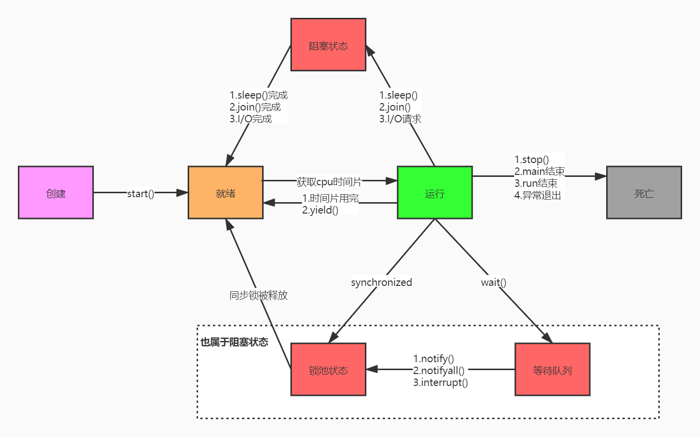
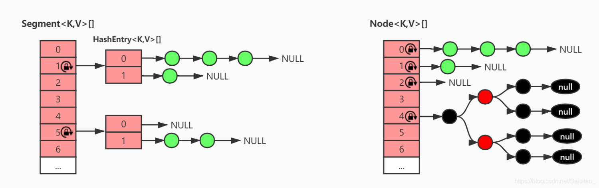

<div STYLE="page-break-after: always;">
	<br>
    <br>
    <br>
    <br>
    <br>
    <br>
    <br>
    <br>
    <br>
    <br>
	<center><h3><font size="20px">
        多线程
    </font></h3></center>
	<br>
    <br>
    <br>
    <br>
    <br>
    <br>
    <br>
    <br>
    <br>
    <br>
</div>


# 1	线程基础

## 1.1	线程的生命周期

#### 线程生命周期图



<br>

#### 创建状态

当程序使用 new 关键字创建了一个线程对象后，该线程就处于新建状态（初始状态），此时它和其他类型的 Java 对象一样，仅仅由 Java 虚拟机为其分配了内存，并初始化了成员变量值。此时的线程对象没有表现出任何线程的动态特征，程序也不会执行线程的执行体。

<br>

#### 就绪

当线程对象调用了 `Thread.start()` 方法之后，该线程处于就绪状态。Java 虚拟机会为其创建 <u>方法调用栈</u> 和 <u>程序计数器</u>，处于这个状态的线程并没有开始运行，它只是表示该线程可以运行了，至于该线程何时开始运行，取决于 JVM 线程调度器的调度。

<br>

#### 运行

就绪状态的线程，如果被 OS 调度选中了，就会进入到运行状态。

<br>

#### 阻塞状态

阻塞状态指线程因为某种原因放弃 CPU 使用权，暂时停止运行。阻塞的线程必须再次进入就绪状态后，才有机会转到运行状态。

###### 阻塞的种类

1. **等待阻塞**：运行的线程执行 `wait()` 方法，JVM 会把该线程放入等待池中。（`wait()` 会释放持有的锁）
2. **同步阻塞**：运行的线程在获取对象的同步锁时，若该同步锁被别的线程占用，则 JVM 会把该线程放入锁池中。
3. **其他阻塞**：运行的线程执行 `sleep()` 或 `join()` 方法，或者发出了 I/O 请求时，JVM 会把该线程置为阻塞状态。当 `sleep()` 状态超时、`join()` 等待线程终止或者超时、或者 I/O 处理完毕时，线程重新转入就绪状态。（注意，`sleep()` 不会释放持有的锁）。

###### 与线程阻塞相关的线程动作

1. **线程睡眠**：`Thread.sleep(long millis)` 方法，使线程转到阻塞状态。`millis` 参数设定睡眠的时间，以毫秒为单位。当睡眠结束后，就转为就绪（Runnable）状态。
2. **线程等待**：`Object` 类中的 `wait()` 方法，导致当前的线程等待，直到其他线程调用 <u>此对象的 `notify()` 方法</u> 或 `notifyAll()` 。这两个方法也是 Object 类中的方法，行为等价于调用 wait(0)。唤醒线程后，就转为就绪（Runnable）状态。
3. **线程让步**：`Thread.yield()` 方法，暂停当前正在执行的线程对象，把执行机会让给相同或者更高优先级的线程。
4. **线程加入**：`join()` 方法，等待其他线程终止。在当前线程中调用另一个线程的 `join()` 方法，则当前线程转入阻塞状态，直到另一个进程运行结束，当前线程再由阻塞转为就绪状态。
5. **线程 I/O**：线程执行某些 IO 操作，因为等待相关的资源而进入了阻塞状态。比如说监听 system.in，但是尚且没有收到键盘的输入，则进入阻塞状态。
6. **线程唤醒**：Object 类中的 `notify()` 方法会唤醒在此对象监视器[^1.1-1]上等待的单个线程。如果所有线程都在此对象上等待，则会选择唤醒其中一个线程，选择是任意性的，并在对实现做出决定时发生。类似的方法还有一个 `notifyAll()`，唤醒在此对象监视器上等待的所有线程。

<br>

#### 死亡

线程会以以下三种方式之一结束，结束后就处于死亡状态：

1. `run()` 方法执行完成，线程正常结束。
2. 线程抛出一个未捕获的 `Exception` 或 `Error`。
3. 直接调用该线程的 `stop()` 方法来结束该线程——该方法容易导致死锁，通常不推荐使用。

<br>

----

[^1.1-1]: **对象的“锁”** 一般我们也将其称为 **监视器（monitor）**。

<div STYLE="page-break-after: always;"><br>
    <br>
    <br>
    <br>
    <br>
    <br>
    <br>
    <br>
    <br>
    <br></div>
## 1.2	线程相关方法

#### sleep()

让线程睡眠，期间会出让 cpu，在同步代码块中，不会释放锁

<br>

#### wait()

让线程进入等待状态，并释放当前线程持有的锁资源，该方法必须先获得对应的锁才能调用。

调用 `wait()` 后，线程只有在 `notify()` 或者 `notifyAll()` 方法调用后才会被唤醒，然后去争夺锁。

<br>

#### notify() 和 notifyAll()

唤醒等待锁被释放的线程，唤醒后的线程进入就绪状态，如果唤醒了多个线程，它们会争夺锁。获得锁的线程开始执行，其他线程再次进入阻塞状态。

<br>

#### join()

线程之间协同方式。

使用场景: 线程 A 必须等待线程B运行完毕后才可以执行，那么就可以在线程 A 的代码中加入`ThreadB.join()`;

<br>

#### yield()

让当前正在运行的线程回到可运行状态，以允许具有相同优先级的其他线程获得运行的机会。因此，使用 `yield()` 的目的是让具有相同优先级的线程之间能够适当的轮换执行。但是，实际应用中无法保证 `yield()` 达到让步的目的，因为，让步的线程可能被线程调度程序再次选中。

<br>

---

<div STYLE="page-break-after: always;"><br>
    <br>
    <br>
    <br>
    <br>
    <br>
    <br>
    <br>
    <br>
    <br></div>

## 1.3	Java 创建线程的方式（❗需要完善）

#### 方式一——继承 Thread 类

<br>

#### 方式二——实现 Runnable 接口

<br>

#### 方式三——使用 Callable 和 Future

<br>

#### 方式四——使用线程池框架

<br>

---

<div STYLE="page-break-after: always;"><br>
    <br>
    <br>
    <br>
    <br>
    <br>
    <br>
    <br>
    <br>
    <br></div>

## 1.4	守护线程

#### 什么是守护线程

Java 中有两类线程：User Thread（用户线程）、Daemon Thread（守护线程）。

任何一个守护线程都是整个 JVM 中所有非守护线程的保姆：只要当前 JVM 实例中尚存在任何一个非守护线程没有结束，守护线程就全部工作；只有当最后一个非守护线程结束时，守护线程随着 JVM 一同结束工作。

###### 守护线程的作用

Daemon Thread 的作用是为其他线程的运行提供便利服务。守护线程最典型的应用就是 GC (垃圾回收器)。

###### 注意

1. `thread.setDaemon(true)` 必须在 `thread.start()` 之前设置，否则会出现一个 `IllegalThreadStateException` 异常。只能在线程未开始运行之前设置为守护线程。
2. 在 `Daemon` 线程中产生的新线程也是 `Daemon` 的。
3. 不要认为所有的应用都可以分配给 `Daemon` 来进行读写操作或者计算逻辑，因为这会可能回到数据不一致的状态。

<br>

---

<div STYLE="page-break-after: always;"><br>
    <br>
    <br>
    <br>
    <br>
    <br>
    <br>
    <br>
    <br>
    <br></div>

# 2	线程私有

## 2.1	Java 中的四种引用

#### 强引用

只要有引用指向该对象，该对象就不会被回收；换句话说，只要没有引用指向该对象，该对象就会被回收。

###### 生成强应用

```java
M m = new M();
```

###### 用途

一般的对象使用强引用。

<br>

#### 软引用

内存空间足够时不会被回收，只有在内存空间不足时才会被回收。

###### 生成软引用

```java
SoftRefernce<byte> sr = new SoftReference<>(new byte[1024 * 1024 *1024]);
```

###### 用途

作为缓存。

<br>

#### 弱引用

垃圾回收器发现虚应用对象会直接回收。

###### 生成虚引用

```
WeakReference<M> wr = new WeakReferance<>(new M());
```

###### 用途

解决 ThreadLocal 的内存泄露问题。

<br>

#### 虚引用

被虚引用引用的对象无法被获取。被虚引用引用的对象不是给业务人员使用的。而是由垃圾回收器使用的。

###### 堆外内存

​	过去 Java 读取服务器数据，需要先把数据拷贝虚拟机内存中，内存和CPU开销都很大，但是通过 NIO 可以直接读取发送到操作系统中的数据，这部分内存就是堆外内存。

###### 堆外内存与虚引用

​	堆外内存使用虚引用进行引用，如果堆外内存被回收，会通知 GC 清理虚引用。

<br>

---

<div STYLE="page-break-after: always;"><br>
    <br>
    <br>
    <br>
    <br>
    <br>
    <br>
    <br>
    <br>
    <br></div>

## 2.2	ThreadLocal

#### 什么是 ThreadLocal

`ThreadLocal` 本质上是一个可以装载对象的容器。`ThreadLocal` 中装载的对象是线程私有的。线程一中向 `ThreadLocal` 装载的对象，线程二无法访问。

<br>

#### 为什么 ThreadLocal 是线程私有的？

​	因为每一个线程都有一个单独的 `ThreadLocalMap`，`ThreadLocal` 实际上就是把对象存入该线程的 `ThreadLocalMap`。

​	`ThreadLocalMap` 的 key 是当前 `ThreadLocal` 的引用，`value` 是存入的对象的引用。

<br>

#### ThreadLocal 如何防止内存泄露

​	`ThreadLocal` 的引用被保存在 `ThreadLocalMap` 中，而保存键值对的的引用是弱引用。

​	创建的 `ThreadLocal` 被回收时（即一开始创建的 `ThreadLocal  tl` 现在  `tl = null`），此时 `ThreadLocal` 还有引用还被保存在 `ThreadLocalMap` 中，如果该引用不是弱引用，那么导致无法回收造成内存泄露。

<br>

#### 为什么使用弱引用的 ThreadLocal 还是会出现内存泄露问题？以及解决方案？

​	通过 `ThreadLocal` 装载的对象，被保存在 `ThreadLocalMap` 中的是一个强引用，就算 `ThreadLocal` 被回收，这个对象还是不会被回收。

​	所以，`ThreadLocal` 提供了 `remove()` 方法，用于手动回收这部分引用。

​	（关于 remove 的其他用途：连接池在每一次连接使用完成后，都必须使用 `remove()` 清空其中的数据，一是防止内存溢出，二是防止脏数据）

<br>

#### 例——使用 TheadLocal 装载对象

```Java
ThreadLocal<M> tl = new ThreadLocal<>();

tl.set(new M());

tl.remove();
```

<br>

#### ThreadLocal 的应用场景

1. 保存线程需要多次使用的参数；
2. Spring 的 `@Transactional`：数据库连接 `connection` 被装载到 `ThreadLocal` 中，保证一系列操作使用的是同一个 `connection` 从而实现事务。

<br>

---

<div STYLE="page-break-after: always;"><br>
    <br>
    <br>
    <br>
    <br>
    <br>
    <br>
    <br>
    <br>
    <br></div>

# 3	线程池

## 3.1	线程池简介

#### 什么是线程池

一种线程使用模式。线程过多会带来调度开销，进而影响缓存局部性和整体性能。而线程池维护着多个线程，等待着监督管理者分配可并发执行的任务。让每个线程可以多次使用，这避免了在处理短时间任务时创建与销毁线程的代价。

线程池不仅能够保证内核的充分利用，还能防止过分调度。可用线程数量应该取决于可用的并发处理器、处理器内核、内存、网络sockets等的数量。

<br>

#### 线程池线程复用的原理

###### 任务结束后对线程的处理

线程回收由 allowCoreThreadTimeOut 控制：

```java
/java/util/concurrent/ThreadPoolExecutor.java:1127
final void runWorker(Worker w) {
        Thread wt = Thread.currentThread();
        Runnable task = w.firstTask;
        w.firstTask = null;
        w.unlock(); // allow interrupts
        boolean completedAbruptly = true;
        try {
            while (task != null || (task = getTask()) != null) {...执行任务...}
            completedAbruptly = false;
        } finally {
            processWorkerExit(w, completedAbruptly);
        }
    }
首先线程池内的线程都被包装成了一个个的java.util.concurrent.ThreadPoolExecutor.Worker,然后这个worker会马不停蹄的执行任务,执行完任务之后就会在while循环中去取任务,取到任务就继续执行,取不到任务就跳出while循环(这个时候worker就不能再执行任务了)执行 processWorkerExit方法,这个方法呢就是做清场处理,将当前woker线程从线程池中移除,并且判断是否是异常的进入processWorkerExit方法,如果是非异常情况,就对当前线程池状态(RUNNING,shutdown)和当前工作线程数和当前任务数做判断,是否要加入一个新的线程去完成最后的任务(防止没有线程去做剩下的任务).
那么什么时候会退出while循环呢?取不到任务的时候(getTask() == null).下面看一下getTask方法

private Runnable getTask() {
        boolean timedOut = false; // Did the last poll() time out?

        for (;;) {
            int c = ctl.get();
            int rs = runStateOf(c);

            //(rs == SHUTDOWN && workQueue.isEmpty()) || rs >=STOP
            //若线程池状态是SHUTDOWN 并且 任务队列为空,意味着已经不需要工作线程执行任务了,线程池即将关闭
            //若线程池的状态是 STOP TIDYING TERMINATED,则意味着线程池已经停止处理任何任务了,不在需要线程
            if (rs >= SHUTDOWN && (rs >= STOP || workQueue.isEmpty())) {
            	//把此工作线程从线程池中删除
                decrementWorkerCount();
                return null;
            }

            int wc = workerCountOf(c);

            //allowCoreThreadTimeOut:当没有任务的时候,核心线程数也会被剔除,默认参数是false,官方推荐在创建线程池并且还未使用的时候,设置此值
            //如果当前工作线程数 大于 核心线程数,timed为true
            boolean timed = allowCoreThreadTimeOut || wc > corePoolSize;
			
            //(wc > maximumPoolSize || (timed && timedOut)):当工作线程超过最大线程数,或者 允许超时并且超时过一次了
            //(wc > 1 || workQueue.isEmpty()):工作线程数至少为1个 或者 没有任务了
            //总的来说判断当前工作线程还有没有必要等着拿任务去执行
            //wc > maximumPoolSize && wc>1 : 就是判断当前工作线程是否超过最大值
            //或者 wc > maximumPoolSize && workQueue.isEmpty():工作线程超过最大,基本上不会走到这,
            //		如果走到这,则意味着wc=1 ,只有1个工作线程了,如果此时任务队列是空的,则把最后的线程删除
            //或者(timed && timedOut) && wc>1:如果允许超时并且超时过一次,并且至少有1个线程,则删除线程
            //或者 (timed && timedOut) && workQueue.isEmpty():如果允许超时并且超时过一次,并且此时工作					队列为空，那么妥妥可以把最后一个线程（因为上面的wc>1不满足，则可以得出来wc=1）删除
            if ((wc > maximumPoolSize  || (timed && timedOut))
                && (wc > 1 || workQueue.isEmpty())) {
                if (compareAndDecrementWorkerCount(c))
                	//如果减去工作线程数成功,则返回null出去,也就是说 让工作线程停止while轮训,进行收尾
                    return null;
                continue;
            }

            try {
            	//判断是否要阻塞获取任务
                Runnable r = timed ?
                    workQueue.poll(keepAliveTime, TimeUnit.NANOSECONDS) :
                    workQueue.take();
                if (r != null)
                    return r;
                timedOut = true;
            } catch (InterruptedException retry) {
                timedOut = false;
            }
        }
    }
    
//综上所述,如果allowCoreThreadTimeOut为true,并且在第1次阻塞获取任务失败了,那么当前getTask会返回null,不管是不是核心线程;那么runWorker中将推出while循环,也就意味着当前工作线程被销毁

```

通过上面这个问题可以得出一个结论：当你的线程池参数配置合理的时候，执行完任务的线程是不会被销毁的，而是会从任务队列中取出任务继续执行。

<br>

---

<div STYLE="page-break-after: always;"><br>
    <br>
    <br>
    <br>
    <br>
    <br>
    <br>
    <br>
    <br>
    <br></div>

# 4	线程安全

## 4.1	线程安全问题

#### 造成线程不安全的原因与解决方案

1. 抢占式执行，调度过程随机（也是万恶之源，无法解决）；
2. 多个线程同时修改同一个变量（适当调整代码结构，避免这种情况）；
3. 针对变量的操作，不是原子的（对变量加锁，synchronized）；
4. 内存可见性，一个线程频繁读，一个线程写（可以使用 volatile）；
5. 指令重排序（对代码加锁)。

###### 📌EXTRA Volatile 关键字的作用

1. **线程的可见性**：当一个线程修改一个共享变量时，另外一个线程能读到这个修改的值。
2. **顺序一致性**：禁止指令重排序。

<br>

#### 线程的活跃性问题

线程安全的活跃性问题可以分为 **死锁**、**活锁**、**饥饿**。

<br>

#### 活锁

指线程虽然没有发生阻塞，但是仍然无法继续执行。活锁不会阻塞线程，线程会一直重复执行某个相同的操作，并且一直失败重试。

###### 可能会出现活锁问题的场景与解决方案

异步消息队列可能造成活锁的问题，在消息队列的消费端如果没有正确的 ack 消息，并且执行过程中报错了，就会再次放回消息头，然后再拿出来执行，一直循环往复的失败。

要解决这个问题除了正确的 ack 之外，往往是通过将失败的消息放入到延时队列中，等待一段时间后再进行重试。

<br>

#### 饥饿

线程因无法访问所需资源而无法继续执行。

###### 导致饥饿的两种情况

1. 线程在临界区做了无限循环或无限制等待资源的操作，让其他的线程一直不能拿到锁进入临界区，对其他线程来说，就进入了饥饿状态；
2. 因为线程优先级不合理的分配，导致部分线程始终无法获取到CPU资源而一直无法执行。

###### 解决饥饿的问题有几种方案:

1.  保证资源充足（但是很多场景下，资源的稀缺性无法解决）；
1.  避免持有锁的线程长时间执行（但是很多场景下，持有锁的线程的执行时间也很难缩短）；
1.  公平分配资源，在并发编程里使用公平锁，例如 FIFO 策略，线程等待是有顺序的，排在等待队列前面的线程会优先获得资源。

<br>

#### 死锁（❗需要完善，[参考资料地址 ](https://blog.csdn.net/weixin_38383877/article/details/123910789)）

线程在对同一把锁进行竞争的时候，未抢占到锁的线程会等待持有锁的线程释放锁后继续抢占，如果两个或两个以上的线程互相持有对方将要抢占的锁，互相等待对方先行释放锁就会进入到一个循环等待的过程，这个过程就叫做死锁。

###### 死锁发生的四个必要条件

1. 互斥条件：同一时间只能有一个线程获取资源；
1. 不可剥夺条件：一个线程已经占有的资源，在释放之前不会被其它线程抢占；
1. 请求和保持条件：线程已经保持至少一个资源，但又提出了新的资源请求，而该资源已被其它进程占有，此时请求进程阻塞，但又对自己已获得的其它资源保持不放。
1. 循环等待条件：多个线程互相等待对方释放资源。

###### 预防死锁的关键

死锁预防，就是破坏这四个必要条件：

1. 由于资源互斥是资源使用的固有特性，无法改变；

2. **破坏不可剥夺条件**：一个进程不能获得所需要的全部资源时便处于等待状态，等待期间它占有的资源将被隐式的释放重新加入到系统的资源列表中，可以被其他的进程使用，而等待的进程只有重新获得自己原有的资源以及新申请的资源才可以重新启动执行；

3. **破坏请求与保持条件**：

   1. 破坏“请求”条件（预先静态分配法）：每个进程执行之前，必须一次性地申请其在整个运行期间所需的全部资源，全部申请到了才能运行。这样它在整个运行过程中便不会再提出资源请求，从而破坏了“请求”条件。
   1.  破坏“保持”条件：每个进程提出申请资源前必须释放已占有的一切资源

4. **破坏循环等待条件**：采用 **资源有序分配**，其基本思想是将系统中的所有资源顺序编号，将紧缺的，稀少的采用较大的编号，在申请资源时必须按照编号的顺序进行：

   1. 每个进程只能按递增顺序申请资源，即进程申请了序号为 8 的资源后，下次只能申请序号为 9 或以上资源；
   2. 如果进程需要同一资源类型的多个实例（也就是序号相同的资源），则必须对它们一起进行申请；
   3. 如果进程又需要申请序号低的资源（比如 5），那就必须把现在拥有的序号为 5 及其以上的资源全部释放。

   为什么可以破坏循环等待条件：线程 A 需要序号为 10 的资源，但是 10 号资源被线程 B 占用了，线程 A 只能阻塞；此时持有 10 号资源的线程 B  可以继续申请序号更高的资源，不用担心死锁，因为可能会与它争夺资源的线程 A 已经无法再获取资源了。

<br>

#### ABA 问题

1. 有两个线程同时去修改一个变量的值，比如线程1、线程2，都更新变量值，将变量值从A更新成B。
1. 首先线程 1 获取到 CPU 的时间片，线程 2 由于某些原因发生阻塞进行等待，此时线程 1 进行比较更新（CompareAndSwap），成功将变量的值从 A 更新成 B。
1. 更新完毕之后，恰好又有线程 3 进来想要把变量的值从 B 更新成A，线程 3 进行比较更新，成功将变量的值从 B 更新成 A。
1. 线程  2获取到 CPU 的时间片，然后进行比较更新，发现值是预期的 A，然后有更新成了 B。但是线程1并不知道，该值已经有了 A->B->A 这个过程。

<br>

#### 竞态条件问题

同一个程序的多个线程访问同一个资源时，如果对资源的访问顺序敏感，就称存在竞态条件。和大多数并发错误一样，竞态条件不总是会产生问题，还需要不恰当的执行时序。

###### 两种常见的竞态条件出现原因

1. **先检测后执行**：执行依赖于检测的结果，而检测结果依赖于多个线程的执行时序，而多个线程的执行时序通常情况下是不固定不可判断的，从而导致执行结果出现各种问题。一种可能的解决办法：在一个线程访问修改一个资源时，防止其他线程的访问修改，也就是通过加锁机制，保证原子性。
1. **延迟初始化（典型为 Spring 单例 Bean 使用 BeanFactory 作为容器时的懒加载）**

<br>

---

<div STYLE="page-break-after: always;"><br>
    <br>
    <br>
    <br>
    <br>
    <br>
    <br>
    <br>
    <br>
    <br></div>

## 4.4	synchronized 和 lock 有哪些区别？

| 区别类型     | synchronized                                                 | Lock                                                         |
| ------------ | ------------------------------------------------------------ | ------------------------------------------------------------ |
| 存在层次     | Java 的关键字，在 jvm 层面上                                 | 是 JVM 的一个接口                                            |
| 锁的获取     | 假设 A 线程获得锁，B线程等待。如果 A 线程阻塞，B 线程会一直等待 | 情况而定，Lock 有多个锁获取的方式，大致就是可以尝试获得锁，线程可以不用一直等待（可以通过 tryLoc k判断有没有锁） |
| 锁的释放     | 1. 以获取锁的线程执行完同步代码，释放锁<br>2. 线程执行发生异常，JVM 会让线程释放 | 在 finally 中必须释放锁，不然容易造成线程死锁                |
| 锁类型       | 锁可重入、不可中断、非公平                                   | 可重入、可判断 可公平（两者皆可）                            |
| 性能         | 少量同步                                                     | 适用于大量同步                                               |
| 支持锁的场景 | 1.  独占锁                                                   | 1.  公平锁与非公平锁                                         |

<br>

---

<div STYLE="page-break-after: always;"><br>
    <br>
    <br>
    <br>
    <br>
    <br>
    <br>
    <br>
    <br>
    <br></div>

## 4.5	volatile 的可见性和禁止指令重排序怎么实现的？

#### 可见性

volatile 可以使被修饰的变量在被修改后可以立即同步到主内存，被修饰的变量在每次使用之前都从主内存刷新。

volatile 本质是通过内存屏障来实现可见性的：

1. 写内存屏障（Store Memory Barrier）可以促使处理器将当前 store buffer（存储缓存）的值写回主存。
2. 读内存屏障（Load Memory Barrier）可以促使处理器处理 invalidate queue（失效队列）。进而避免由于 Store Buffer 和 Invalidate Queue 的非实时性带来的问题。

<br>

#### 📌EXTRA 什么是内存屏障

内存屏障，也称内存栅栏，内存栅障，屏障指令等， 是一类同步屏障指令，是 CPU 或编译器在对内存随机访问的操作中的一个同步点，使得 **此点之前的所有读写操作都执行后才可以开始执行此点之后的操作**。

<br>

#### 禁止指令重排序

volatile 也通过 **内存屏障** 来禁止指令重排序。

###### JMM 内存屏障的策略

 1. 在每个 volatile 写操作的前面插入一个 StoreStore 屏障。
 2. 在每个 volatile 写操作的后面插入一个 StoreLoad 屏障。
 3. 在每个 volatile 读操作的后面插入一个 LoadLoad 屏障。
 4. 在每个 volatile 读操作的后面插入一个 LoadStore 屏障。

<br>

---

<div STYLE="page-break-after: always;"><br>
    <br>
    <br>
    <br>
    <br>
    <br>
    <br>
    <br>
    <br>
    <br></div>

## 4.6	ConcurrentHashMap 底层原理

##### ConcurrentHashMap 在 jdk 1.7 的数据结构

ConcurrentHashMap 的内部主要是一个 `Segment` 数组，而数组的每一项又是一个 `HashEntry` 数组，元素都存在 `HashEntry` 数组里。因为每次锁定的是 `Segment` 对象，也就是整个 `HashEntry` 数组，所以又叫分段锁。



<br>

##### ConcurrentHashMap 在 jdk 1.8 的数据结构

与 `HashMap` 一样采用：数组+链表+红黑树


底层原理则是采用锁链表或者红黑树头结点，相比于 `HashTable` 的方法锁，粒度更细，是对数组（table）中的桶（链表或者红黑树[^4.6-1]）的头结点进行锁定，这样锁定，只会影响数组（table）当前下标的数据，不会影响其他下标节点的操作，可以提高读写效率。

<br>

##### ConcurrentHashMap.putVal() 的执行流程：

1. 判断存储的 key、value 是否为空，若为空，则抛出异常；
1. 计算 key 的 hash 值，随后死循环（该循环可以确保成功插入，当满足适当条件时，会主动终止），判断 table 表为空或者长度为 0，则初始化 table 表；
1. 根据 hash 值获取 table 中该下标对应的节点，如果该节点为空，则根据参数生成新的节点，并以 CAS 的方式进行更新，并终止死循环；
1. 如果该节点的 hash 值是 MOVED(-1)，表示正在扩容，则辅助对该节点进行转移；
1. 对数组（table）中的节点，即桶的头结点进行锁定，如果该节点的hash大于等于0，表示此桶是链表，然后对该桶进行遍历（死循环），寻找链表中与 put 的 key 的 hash 值相等，并且 key 相等的元素，然后进行值的替换，如果到链表尾部都没有符合条件的，就新建一个 node，然后插入到该桶的尾部，并终止该循环遍历；
1. 如果该节点的 hash 小于 0，并且节点类型是 TreeBin，则走红黑树的插入方式；
1. 判断是否达到转化红黑树的阈值，如果达到阈值，则链表转化为红黑树。

<br>

---

[^4.6-1]: 红黑树是一种特化的AVL树（平衡二叉树），红黑树在二叉查找树的基础上增加了着色和相关的性质使得红黑树相对平衡，从而保证了红黑树的查找、插入、删除的时间复杂度最坏为O(log n)。所以红黑树适用于搜索，插入，删除操作较多的情况。

<div STYLE="page-break-after: always;"><br>
    <br>
    <br>
    <br>
    <br>
    <br>
    <br>
    <br>
    <br>
    <br></div>

# 5	线程与最佳性能

## 5.1	Happans-Before 原则（❗需要补充）

#### 什么是 Happans-Before

happens-before 关系是用来描述两个操作的内存可见性的。如果操作 X happens-before 操作 Y，那么 X 的结果对于 Y 可见。

<br>

#### 线程内的 happens-before

在同一个线程中，字节码的先后顺序（program order）也暗含了 happens-before 关系：在程序控制流路径中靠前的字节码 happens-before 靠后的字节码。

然而，这并不意味着前者一定在后者之前执行。实际上，如果后者没有观测前者的运行结果，即后者没有数据依赖于前者，那么它们可能会被重排序。

<br>

#### 线程间的 happens-before

1. 解锁操作 happens-before 之后（这里指时钟顺序先后）对同一把锁的加锁操作。
2. volatile 字段的写操作 happens-before 之后（这里指时钟顺序先后）对同一字段的读操作。
3. 线程的启动操作（即 Thread.starts()） happens-before 该线程的第一个操作。
4. 线程的最后一个操作 happens-before 它的终止事件（即其他线程通过 Thread.isAlive() 或 Thread.join() 判断该线程是否中止）。
5. 线程对其他线程的中断操作 happens-before 被中断线程所收到的中断事件
   （即被中断线程的 InterruptedException 异常，或者第三个线程针对被中断线程的 Thread.interrupted 或者 Thread.isInterrupted 调用）。
6. 构造器中的最后一个操作 happens-before 析构器的第一个操作。

<br>

#### happens-before关系的传递性

如果操作 X happens-before 操作 Y，而操作 Y happens-before 操作 Z，那么操作 X happens-before 操作 Z。

<br>

---

<div STYLE="page-break-after: always;"><br>
    <br>
    <br>
    <br>
    <br>
    <br>
    <br>
    <br>
    <br>
    <br></div>
## 5.2	程序开多少线程合适？

#### CPU 密集型程序

在 CPU 密集型程序中，一个完整请求，I/O 操作可以在很短时间内完成，CPU  计算的比例占很大一部分，线程等待时间接近 0。

###### 单核CPU

采用单核 CPU 处理 CPU 密集型程序时不适合使用多线程。

###### 多核

 如果是多核CPU 处理 CPU 密集型程序，我们完全可以最大化的利用 CPU 核心数，应用并发编程来提高效率。

CPU 密集型程序的最佳线程数就是：理论上线程数量 = CPU 核数（逻辑），但是实际上，数量一般会设置为 CPU 核数（逻辑）+ 1（经验值）。

如果 CPU 密集型的线程恰好在某时因为发生一个页错误或者因其他原因而暂停，刚好有一个“额外”的线程，可以确保在这种情况下 CPU 周期不会中断工作。

<br>

#### I/O 密集型程序

与 CPU 密集型程序相对，一个完整请求，CPU 运算操作完成之后还有很多 I/O 操作要做，也就是说 I/O 操作占比很大部分，等待时间较长。

I/O 密集型程序线程等待时间所占比例越高，需要越多线程。

###### I/O 密集型程序的最佳线程数

 最佳线程数 = CPU核心数 \* (1/CPU利用率) = CPU核心数 *  (1 + (I/O 耗时/CPU 耗时))

1. 如果几乎全是 I/O 耗时，那么 <u>I/O 耗时/CPU 耗时</u> 无限趋近于 1，此时最佳线程数是 2N（N=CPU核数）
1. 一般采用 2N + 1 即可。

<br>

---

<div STYLE="page-break-after: always;"><br>
    <br>
    <br>
    <br>
    <br>
    <br>
    <br>
    <br>
    <br>
    <br></div>

# 附录

##### 参考资料

- 主要参考资料——[2022年最新【Java经典面试题300问】面试必备，查漏补缺；多线程+spring+JVM调优+分布式+redis+算法](https://www.bilibili.com/video/BV15v4y1T7fz?p=80&spm_id_from=pageDriver&vd_source=87ed5edcdc8042ca0c34ee5bbeeda7b3) 发布于 2022/06/29；

<br>
