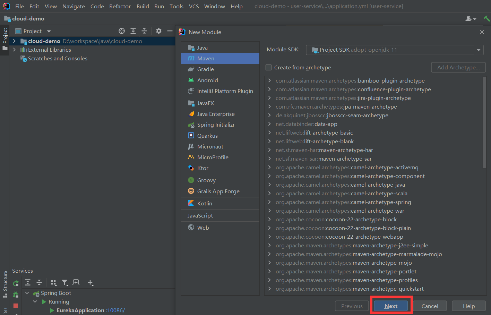

# 3	Eureka 注册中心

## 3.1	Eureka 概述

##### Eureka 的作用


###### 注册服务信息

服务提供者启动时向 Eureka 注册自己的信息，Eureka 保存这些信息，之后消费者会根据服务名称从 Eureka 拉取提供者信息。

###### 帮助选择服务提供者

如果有多个服务提供者，服务消费者会利用负载均衡算法，从服务列表中挑选一个。

###### 心跳监控

服务提供者会每隔 30 秒向 EurekaServer 发送心跳请求，报告健康状态。Eureka 会更新记录服务列表信息，心跳不正常的服务会被剔除。

<br>

##### Eureka 架构

在 Eureka 架构中，微服务角色有两类 EurekaServer 与 EurekaClient。

###### EurekaServer

服务端，注册中心，记录服务信息与心跳监控。

###### EurekaClient

EurekaClient 又分为 Provider 和 consumer[^3.1-1]。

- Provider：服务提供者，注册自己的信息到 EurekaServer，并每隔 30 秒向 EurekaServe r发送心跳。
- consumer：服务消费者，根据服务名称从 EurekaServer 拉取服务列表，基于服务列表做负载均衡，选中一个微服务后发起远程调用。

<br>

---

[^3.1-1]: 注意，因为每一个微服务都可能既是消费者又是提供者，所以这只是一个服务调用时出现的概念。

<div STYLE="page-break-after: always;">
    <br>
    <br>
    <br>
    <br>
    <br>
</div>

## 3.2	Eureka 实战

##### 搭建注册中心

1. 在已经导入 Spring Cloud 的父工程下，创建一个子模块，名为 eureka-server ：

   

   

   

2. 引入 Spring Cloud 为 eureka 提供的 starter 依赖

   ```xml
   <dependency>
       <groupId>org.springframework.cloud</groupId>
       <artifactId>spring-cloud-starter-netflix-eureka-server</artifactId>
   </dependency>
   ```

3. 给 eureka-server 服务编写一个启动类，一定要添加一个 `@EnableEurekaServer` 注解，开启 eureka 的注册中心功能：

   ```java
   package cn.itcast.eureka;
   
   import org.springframework.boot.SpringApplication;
   import org.springframework.boot.autoconfigure.SpringBootApplication;
   import org.springframework.cloud.netflix.eureka.server.EnableEurekaServer;
   
   @SpringBootApplication
   @EnableEurekaServer
   public class EurekaApplication {
       public static void main(String[] args) {
           SpringApplication.run(EurekaApplication.class, args);
       }
   }
   ```

4. 编写配置文件

   ```yml
   server:
     port: 10086
   spring:
     application:
       name: eureka-server
   eureka:
     client:
       service-url: 
         defaultZone: http://127.0.0.1:10086/eureka
   ```

5. 启动微服务，然后在浏览器访问：http://127.0.0.1:10086

<br>

##### 服务注册

1. 在 user-service[^3.2-1] 的 pom 文件中，引入下面的 eureka-client 依赖。

   ```
   <dependency>
       <groupId>org.springframework.cloud</groupId>
       <artifactId>spring-cloud-starter-netflix-eureka-client</artifactId>
   </dependency>
   ```

2. 在 user-service[^3.2-1] 中，修改 application.yml 文件，添加 **服务名称**以及 **eureka 地址**

   ```yaml
   spring:
     application:
       name: userservice #服务名称
   eureka:
     client:
       service-url:
         defaultZone: http://127.0.0.1:10086/eureka #eureka 地址
   ```

3. 为了演示一个服务有多个实例的场景，我们添加一个 SpringBoot 的启动配置，再启动一个 user-service

   

   

4. 启动两个 user-service 和一个 order-service 后，可以在 Eureka 管理界面看到

   

<br>

##### 服务发现

###### 前提条件

已经完成了服务注册。

###### 步骤

1. 在 order-service 项目的启动类 OrderApplication 中的 RestTemplate 上添加 **负载均衡** 注解

   ```java
   @MapperScan("cn.itcast.order.mapper")
   @SpringBootApplication
   public class OrderApplication {
   
       public static void main(String[] args) {
           SpringApplication.run(OrderApplication.class, args);
       }
   
       @Bean
       @LoadBalanced
       public RestTemplate restTemplate(){
           return new RestTemplate();
       }
   }
   ```

2. 修改 OrderService 的代码，修改访问的 url 路径，用服务名代替 ip和端口

   ```
       public Order queryOrderById(Long orderId) {
           // 1.查询订单
           Order order = orderMapper.findById(orderId);
   
           // TODO 2.查询用户
           // String url = "http://localhost:8081/user/" +  order.getUserId();
           String url = "http://localhost:8081/user/" +  order.getUserId();
           
           User user = restTemplate.getForObject(url, User.class)    ;
   
           // 3.封装user信
           order.setUser(user);
   
           // 4.返回
           return order;
       }
   ```

<br>

---

[^3.2-1]: 或者其他需要注册的模块

<div STYLE="page-break-after: always;">
    <br>
    <br>
    <br>
    <br>
    <br>
</div>
