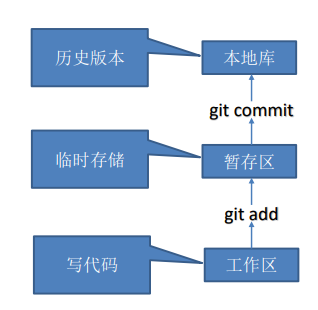
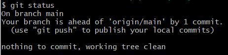
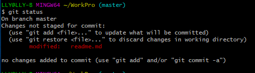
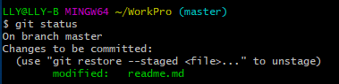
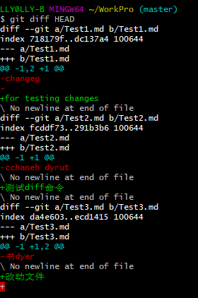

# 1	概述

## 1.1	Git 简介

#### 版本控制概述

版本控制是一种记录文件内容变化，以便将来查阅特定版本修订情况的系统。

版本控制其实最重要的是可以记录文件修改历史记录，从而让用户能够查看历史版本， 方便版本切换。

<br>

#### 集中式版本控制工具

集中化的版本控制系统[^1.1-1]，都有一个单一的集中管理的服务器，保存所有文件的修订版本，而协同工作的人们都通过客户端连到这台服务器，取出最新的文件或者提交更新。

多年以来，这已成为版本控制系统的标准做法。 这种做法带来了许多好处，每个人都可以在一定程度上看到项目中的其他人正在做些什么。而管理员也可以轻松掌控每个开发者的权限，并且管理一个集中化的版本控制系统，要远比在各个客户端上维护本地数据库来得轻松容易。

但是，这么做显而易见的缺点是中央服务器的单点故障。如果服务器宕 机一小时，那么在这一小时内，谁都无法提交更新，也就无法协同工作。

<br>

#### 分布式版本控制工具

分布式版本控制工具[^1.1-2]，客户端提取的不是最新版本的文件快照，而是把代码仓库完整地镜像下来（本地库）。这样任何一处协同工作用的文件发生故障，事后都可以用其他客户端的本地仓库进行恢复。因为每个客户端的每一次文件提取操作，实际上都是一次 对整个文件仓库的完整备份。 

分布式的版本控制系统出现之后，解决了集中式版本控制系统的缺陷：

1. 服务器断网的情况下也可以进行开发，因为版本控制是在本地进行的；
2. 每个客户端保存的也都是整个完整的项目（包含历史记录，更加代码保管更加安全）

<br>

#### 什么是 Git

Git 是一个 **开源** 的 **分布式版本控制工具**，Git 被开发出来的初衷是为了更好地管理 Linux 内核，而现在早已被广泛应用于全球各种大中小型项目中。

<br>

#### Git 的功能特性

从一般开发者的角度来看，git 有以下功能：

1. **克隆完整代码**：从服务器上克隆完整的 Git 仓库（包括代码和版本信息）到单机上；
2. **创建分支**：在自己的机器上根据不同的开发目的，创建分支，修改代码；
3. **分支提交**：在单机上自己创建的分支上提交代码；
4. **合并分支**：在单机上合并分支，或者把服务器上最新版的代码 fetch 下来，然后与自己的主分支合并；
5. **补丁开发**：生成补丁（patch），把补丁推送给主开发者；
6. **解决冲突**：
   1. 主开发者反馈解决冲突：如果主开发者发现两个一般开发者之间有冲突（他们之间可以合作解决的冲突），就会要求他们先解决冲突，然后再由其中一个人提交。如果主开发者可以自己解决，或者没有冲突，就通过。
   2. 一般开发者之间解决冲突：开发者之间可以使用 pull 命令解决冲突，解决完冲突之后再向主开发者提交补丁。

从主开发者的角度（假设主开发者不用开发代码）看，git 有以下功能：

1. **查看提交状态**：查看邮件或者通过其它方式查看一般开发者的提交状态；
2. **打上补丁，解决冲突**：可以自己解决，也可以要求开发者之间解决以后再重新提交，如果是开源项目，还要决定哪些补丁有用，哪些不用；
3. **提交开发结果**：向公共服务器提交结果，然后通知所有开发人员。

<br>

#### Git 的优缺点

###### 优点

1. 适合分布式开发，强调个体；
2. 公共服务器压力和数据量都不会太大；
3. 速度快、灵活；
4. 任意两个开发者之间可以很容易的解决冲突；
5. 离线工作。

###### 缺点

1. 资料少（起码中文资料很少）；
2. 学习周期相对而言比较长；
3. 不符合常规思维；
4. 代码保密性差，一旦开发者把整个库克隆下来就可以完全公开所有代码和版本信息。

<br>

#### Git 工作机制



<br>

#### Git 代码托管中心

代码托管中心是基于网络服务器的远程代码仓库，一般我们简单称为远程库。

局域网（自建）：

1. GitLab。

互联网：

1. GitHub；
2. Gitee。

<br>

---

[^1.1-1]: 诸如 CVS、SVN（Subversion）、VSS 等。
[^1.1-2]: 诸如 Git、Mercurial、Bazaar、Darcs 等。

<div STYLE="page-break-after: always;"></div>

## 1.2	安装 Git

#### Git 官网地址

https://git-scm.com/

<br>

#### 步骤[^1.2-❗1]

1. 进入 https://gitforwindows.org/ 下载安装包
2. 使用安装包进行安装

<br>

#### 验证是否安装完成

在 Git Bash 终端输入下列命令查看 git 版本：

```sh
git --version
```

<br>

---

<div STYLE="page-break-after: always;"></div>

# 2	Git 基础命令

## 2.1	设置用户签名

#### 用户签名的作用

Git 首次安装必须设置用户签名，否则无法提交代码。用户签名可以区分不同操作者身份。用户的签名信息包含在每一个版本的提交信息中，以确认提交者。

注意，用户签名和登录 GitHub（或其他代码托管中心）的账号没有关系。

<br>

#### 命令——设置用户签名

```
git config --global user.name "NNN"
git config --global user.email "nilnullnaught@gmail.com"
```

<br>

#### 命令——查看用户签名

配置完成后，可以输入一下命令查看用户签名（可以用于确认是否配置成功）：

```
git config --global user.name 
git config --global user.email
```

<br>

---

<div STYLE="page-break-after: always;"></div>

## 2.2	初始化本地库

#### 步骤

1. 进入需要创建仓库的项目下

2. 输入下列语句：

   ```bash
   git init

3. 输入上述命令后，会在项目的根目录下生成一个隐藏的 .git 目录，这个目录记录了本地所有 Git 操作。

<br>

#### 注意

如果要删除本地仓库，直接删除该目录即可。

<br>

---

<div STYLE="page-break-after: always;"></div>

## 2.3	添加到暂存区与撤销

#### git add——将目录和文件添加到暂存区

###### 基础命令

```sh
git add 【完整的文件名/目录名】
```

###### git add 参数命令

| 参数 | 命令         | 说明                                                         |
| ---- | ------------ | ------------------------------------------------------------ |
| `.`  | `git add .`  | `git add .`  会监控工作区的状态树，使用它会把工作时的 **所有变化提交** 到暂存区，包括文件内容修改（modified）以及新文件（new），但不包括被删除的文件。 |
| `-u` | `git` add -u | `git add -u` 仅监控 **已经被add的文件**（即 tracked file），它会将被修改的文件提交到暂存区。`git add -u` 不会提交新文件（untracked file），但是会将本地文件的删除与移动提交。 |
| `-A` | `git add -A` | 是上面两个功能的合集（git add --all的缩写）                  |

<br>

#### 撤销 git add

###### 基础命令

将上一次 add 的内容全部撤销：

```sh
git reset HEAD
```

###### 撤销单个文件或文件夹

```sh
git reset HEAD ${文件或文件夹名}
```

<br>

---

<div STYLE="page-break-after: always;"></div>

## 2.4	添加到本地库与撤销

#### git commit——将暂存区的文件提交到本地库

###### 基础命令

```sh
git commit -m "【描述信息】"
```

1. `git commit` 一定要通过 `-m` 参数附加提交信息，没有描述信息的提交被认为是不合法的；
2. `git commit` 默认提交暂存区的所有文件。可以在命令的最后添加具体的文件或文件夹名，实现对具体某个文件或文件夹名的提交。

<br>

#### 撤销 git commit

```
git reset --soft HEAD^ 
```

<br>

---

<div STYLE="page-break-after: always;"></div>

## 2.5	查看本地库状态

#### git status——查找改动的文件

使用 `git status` 可以查看 **上次提交后，修改了哪些文件**。

###### git status可能出现的三种情况

1. 无文件改动：

   

2. 有文件改动但未添加到暂存区：

   

3. 有文件改动已添加到暂存区，但未提交：

   

<br>

#### git diff——查找文件改动细节

Git 三大工作分区当中，工作区的上一级是暂存区，暂存区的上一级是版本区。每次的文件比较都是从当前工作区级别和上一级区域文件做比较。

###### 比较结果结构详解



1. **第一行**：标记比较的文件，`diff --git a/Test1.md b/Test1.md` 表示比较了 a 版本的 `Test1.md` 和 b 版本的 `Test1.md` 文件；
2. **第二行**：表示比较的不同区域的文件哈希值对象和模式， `index 718179f..dc137a4 100644` 中的 `718179f` 和 `dc137a4` 分别是a、b 两个版本 `Test1.md` 文件的对象哈希值，100644 中的 100 代表普通文件，644 代表文件权限（同 Linux 文件系统权限）；
3. **第三行和第四行**：`--- a/Test1.md` 和 `+++ b/Test1.md` 的 `---` 表示修改前的文件，`+++` 表示修改后的文件；
4. **第五行**：`@@ -1,2 +1 @@` 用两个 `@@` 符号一首一尾标记，表示改动的文件行数，修改前和修改后的文件用 `,` 隔开。`-1,2` 表示改动前的文件从第 1 行开始改动，从当前行数往后改动了 2 行；`+1` 表示改动后的文件从第 1 行开始改动，并且只改动了第 `1` 行。
5. **第六行和第七行**： 从上面的 `-` 开始，表示改动前的文件内容，即第1行开始往后连续 2 行内容。
6. 
   第八行和第九行：从 `+` 开始，表示修改后文件增加的内容。

<br>

---

<div STYLE="page-break-after: always;"></div>

## 2.6	历史版本与版本回退

#### git reflog——查看版本信息

###### 基础命令

```sh
git reflog
```

<br>

####  git log——查看版本详细信息

###### 基础命令

```sh
 git log
```

###### 查看指定 id 的记录

```shell
git log 【记录 id】
```

###### 查看最近一次提交的记录

```sh
git log -1
```

<br>

#### git reset——版本回退

###### 基础命令

```sh
git reset ${版本号}
```

1. 使用该命令前需要先通过 `git log` 命令查询版本号（commit id）。

###### 回退到当前版本的初始状态

```sh
git reset HEAD
```

1. 该命令一般用于撤销 `git add` 命令。但是，如果代码已经提交（`git commit`），那么只能使用 `git reset --hard HEAD^` 进行回退。

###### 回退符 ^

```sh
//回退到指定版本的上一个版本
git reset ${版本号}^

//回退到指定版本的前一个版本
git reset ${版本号}^^

//回退到指定版本的前 10 个版本
git reset ${版本号}^^^^^^^^^^

//回退到指定版本的前 10 个版本
git reset ${版本号}~10
```

1. `^` 用于指定返回的版本，有几个 `^` 则跳跃到几个版本之前，如果需要回退的版本太远，可以使用 `~n` 的形式 代替 `^`。

###### git reset 参数

| 参数               | 功能                                                 | 场景                                                         |
| ------------------ | ---------------------------------------------------- | ------------------------------------------------------------ |
| `–mixed`（或默认） | 保留工作区但清空暂存区，把版本之间的差异存放在工作区 | 1.有错误的 commit 需要修改；<br>2.使用 `git reset HEAD` 可以清空缓存区。 |
| `–soft`            | 保留工作区与暂存区，但是把版本之间的差异存放在缓存区 | 合并多个 commit                                              |
| `–hard`            | 清空工作区与暂存区                                   | 放弃目标版本后所有的修改                                     |

必须注意，`--hard` 参数是 `git reset` 命令唯一的 **危险用法**，是能够使 Git 会真正地销毁数据的仅有的几个操作之一。

其他任何形式的 `git reset` 操作都可以轻松撤消，但是`--hard` 选项不能，因为它强制覆盖了工作目录中的文件。

在这种特殊情况下，除非被回退的版本被提交过，我们才可以通过 `git reflog` 来找回它，否则该版本将直接丢失。

###### Git 版本跳跃原理

Git 切换版本，本质上是移动 HEAD 指针，如下图所示：


<br>

#### git revert——版本回退的另一种方式[^2.6-1❗]

<br>

---

<div STYLE="page-break-after: always;"></div>

# 3	Git 分支操作与 Tag

## 3.1	分支概述

#### 什么是分支

分支是版本控制工具中比较高级且比较重要的一个概念，它主要的作用就是在现有代码的基础上开辟一个分叉口，**使得代码可以在主干线和分支线上同时进行开发，且相互之间不会影响**。

<br>

#### 使用分支开发的好处

1. 分支可以同时并行推进多个功能开发，提高开发效率。
2. 各个分支在开发过程中，如果某一个分支开发失败，不会对其他分支有任何影响。失败的分支直接删除，重新开始即可。

<br>

#### 创建和切换分支图解


分支的本质就是移动 HEAD 指针。

master 等分支实际上都是指向具体版本记录的指针。当前所在的分支，其实是由 HEAD 决定的。所以创建分支的本质就是多创建一个指针。HEAD 如果指向 master，那么我们现在就在 master 分支上。 HEAD 如果指向 hotfix 分支，那么我们现在就在 hotfix 分支上。 

<br>

#### master 分支

创建 git 仓库后，git 默认的主要分支名为 master（GitHub 默认的）。

<br>

#### 远程分支

分支只有在总代码仓库（远程代码库）上才能起到项目管理作用，所以 **应该直接在总代码仓库上创建分支**，或者在本地创建后推送到远程服务器上。

<br>

---

<div STYLE="page-break-after: always;"></div>

## 3.2	分支操作命令

#### 创建分支

###### 基础命令

```sh
git branch ${分支名}
```

###### 例

```
//基于当前分支，创建一个名为 version1.0 的分支
git branch version1.0
```

<br>

#### 查看分支

###### 基础命令

```
git branch
```

1. `git branch` 可以查看所有分支；
2. 当前分支会以绿色标记，并在前面显示 * 号。

###### git branch 参数[^3.2-❗1]

<br>

#### git checkout——切换分支

###### 基础命令

```sh
git checkout ${分支名}
```

<br>

#### git merge——合并分支

在一个分支上修改并提交的代码将不会影响到其他分支。因此，如果我们在一个分支上修复了一个 bug，在其他分支上这个 bug 仍然是存在的。

这时将修改的代码一行行复制到其他分支上显然不是一种聪明的做法，最好的办法就是使用 `merge` 命令来完成合并操作：

```sh
//将当前分支与指定分支合并
git merge ${分支名}
```

<br>

#### git branch -D——删除分支

```sh
git branch -D ${分支名}
```

<br>

---

<div STYLE="page-break-after: always;"></div>

## 3.3	合并冲突[^3.3-❗1]

<br>

---

<div STYLE="page-break-after: always;"></div>

## 3.4	Git tag[^3.4-❗1]

https://blog.csdn.net/jdsjlzx/article/details/98654951

https://blog.csdn.net/qq_39505245/article/details/124705850

---

<div STYLE="page-break-after: always;"></div>

# 4	Git 团队合作机制

## 4.1	Git 团队合作机制概述

#### Git 团队合作机制简介

所有版本控制工具最重要的一个特点就是可以使用它来进行 **团队合作开发**。每个人的电脑上都会有一份代码，当团队的某个成员在自己的电脑上编写完成了某个功能后，就将代码提交到服务器，其他的成员只需要将服务器上的代码同步到本地，就能保证整个团队所有人的代码都相同。

如此一来，团队中的每个成员就可以各司其职，共同完成一个较为庞大的项目。

<br>


---

<div STYLE="page-break-after: always;"></div>

## 4.2	远程仓库操作

#### 在 GitHub 上创建远程仓库

1. 登录 GitHub 后，在个人主页上选择创建仓库：

   

2. 填写必要信息：

   

3. 完成创建。

<br>

#### git clone——从远程版本库获取代码

```sh
git clone ${远程版本库地址}
```

1. `git clone` 命令进行的操作：
   1. 拉取代码；
   2. 初始化本地仓库；
   3. 创建别名。

###### 例

```sh
git clone https://github.com/NilNullNaught/note.git
```

<br>

#### git remote——创建远程仓库别名

###### 基础命令

```
git remote add
```

1. 该命令必须进入 `git clone` 到本地的代码库文件夹中使用；
2. 别名只在当前代码库中生效，不会对远程代码库或其他本地代码库产生影响。

###### 查看当前所有远程地址别名

```sh
git remote -v
```

<br>

#### git push——推送本地分支到远程仓库

###### 基础命令

```sh
git push ${别名或远程版本库地址} ${分支名}
```

###### 将新建分支推到远程

在本地创建分支后，通过以下命令将其推送到远程服务器上：

```sh
 git push -u origin <新建分支名字>
```

1. 需要直接权限；
2. 分支一般直接在远程服务器上创建。

<br>

**使用 fetch 将远程版本库上的修改同步到本地**

```bash
git fetch origin master

//注意，fetch 同步下来的代码并不会合并到任何分支上，而是会存放到一个 origin/master 分支上
//需要之后再 merge 命令将 origin/master分 支上的修改合并到主分支上
```

**使用 pull 将远程版本库上的修改同步到本地**

```
//pull 命令相当于将 fetch 和 merge 这两个命令一起执行，它可以从远程版本库上获取最新的代码并且合并到本地当前分支
git pull origin master
```

<br>

---

<div STYLE="page-break-after: always;"></div>

# EXTRA

## 2.4	忽略文件

**Git 文件忽略机制**

- Git 允许用户将指定的文件或目录排除在版本控制之外，它会检查代码仓库的目录下是否存在一个名为 .gitignore 的文件，如果存在，就去一hanghang读取这个文件中的内容，并把每一行指定的文件或目录排除在版本控制之外。

<br>

# 附录

#### 参考资料

1. 主要参考资料——[尚硅谷Git入门到精通全套教程（涵盖GitHub\Gitee码云\GitLab）](https://www.bilibili.com/video/BV1vy4y1s7k6/?share_source=copy_web&vd_source=600a3ccbe03d057b2978ff8f2009da84) 发布于 2021/04/26；
1. [2.3	添加到暂存区与撤销](#2.3	添加到暂存区与撤销)——[Git操作之 git add 撤销、git commit 撤销](http://t.csdn.cn/QqxZS) 发布于 2022/07/15；
1. [2.4	添加到本地库与撤销](#2.4	添加到本地库与撤销)——[Git操作之 git add 撤销、git commit 撤销](http://t.csdn.cn/QqxZS) 发布于 2022/07/15；
1. [2.5	查看本地库状态](#2.5	查看本地库状态)——[Git——比较版本区别【git status / git diff】](https://blog.csdn.net/qq_36749906/article/details/113716994) 发布于 2021/02/21；
1. [2.6	历史版本与版本回退](#2.6	历史版本与版本回退)——[git reset 三种使用方法（--hard \soft\mixed）](http://t.csdn.cn/gy7gE) 发布于  2021/12/31 最后修改于 2022/04/19；
1. [2.6	历史版本与版本回退](#2.6	历史版本与版本回退)——[【学了就忘】Git后悔药 — 35.reset版本回退总结](https://www.jianshu.com/p/73108169d9fa) 发布于 2021/05/17；

<br>

#### ❗❓

[^1.2-❗1]: 需要补充。
[^2.6-1❗]: 需要补充。
[^3.2-❗1]: 需要补充。
[^3.3-❗1]: 需要补充。
[^3.4-❗1]: 需要补充。
