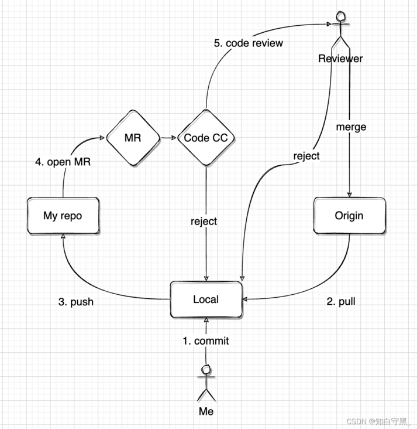
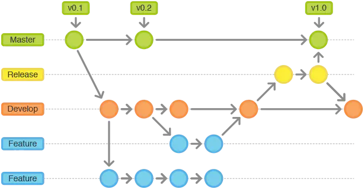
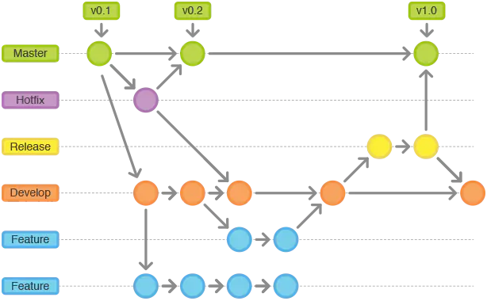

<div STYLE="page-break-after: always;">
	<br>
    <br>
    <br>
    <br>
    <br>
    <br>
    <br>
    <br>
    <br>
    <br>
	<center><h3><font size="20px">
        Git 最佳实践
    </font></h3></center>
	<br>
    <br>
    <br>
    <br>
    <br>
    <br>
    <br>
    <br>
    <br>
    <br>
</div>
# 1	团队开发

## 1.1	团队开发中 Git 提交和发布流程

#### 流程图



<br>

#### 详细流程说明

1. 从项目仓库拉取（git pull）master 的最新代码到本地。
2. 提交（git commit）代码到本地仓库。
3. 将更改推送（git push）到个人远程仓库。
4. 从个人远程仓库发起代码评审。
5. 由评审员进行代码评审。
6. 评审结果不通过，评审发起者需要修改代码，回到第 2 步。
7. 评审结果通过，由评审发起者确认合并之后代码改动被合并到 master。

<br>

---

<div STYLE="page-break-after: always;"><br>
    <br>
    <br>
    <br>
    <br>
    <br>
    <br>
    <br>
    <br>
    <br></div>

## 1.2	Git Flow 与分支规范（❗需要修改）

#### 在使用 Git 时需要注意的问题

在使用 Git 的过程中如果没有清晰流程和规划，每个人都提交一堆杂乱无章的 commit，项目很快就会变得难以协调和维护。**Git 版本管理同样需要一个清晰的流程和规范**。

<br>

#### Git Flow

Git Flow （Git 工作流）是一种代码开发合并管理流程的思维模式或者是管理方法。所有使用了 Git Flow 的项目，必须严格按照规范操作，否则不予以合并代码、提测、打包上线等后续操作。

###### Git Flow 流程图


<br>

#### 主分支

主分支分为 master 分支和 develop 分支，是所有开发活动的核心分支，所有的开发活动产生的输出最终都会反映到主分支的代码中。主分支的生命周期与整个项目的开发周期相同。


###### master 分支

master 分支也叫 Production 分支，master 分支存放的是 **随时可供在生产环境部署的稳定版本** 的代码。

使用规范：

1. master 分支保存官方发布版本历史，通过 release tag 标识不同的发布版本；
2. 一个项目只能有一个 master 分支；
3. **仅在发布新的可供部署的代码时才更新 master 分支上的代码**；
4. 每次更新 master，都需对 master 添加指定格式的 tag，用于发布或回滚；
5. master 分支是保护分支，不可以直接 push 到 master 分支；
6. master 分支代码只能被 release 分支或 hotfix 分支合并。

###### develop 分支

develop 分支是保存当前最新开发成果的分支。

使用规范：

1. 一个项目同时只能存在一个 develop 分支；
2. develop 分支衍生出各个 feature 分支；
3. develop 分支是保护分支，不可直接 push 到远程仓库 develop 分支；
4. develop 分支不能与 master 分支直接交互；
5. **开发时，一般从 develop 分支上拉取代码（Git pull）。**

<br>

#### 辅助分支

辅助分支分为 **feature分支**、**release 分支**、**hotfix 分支**， 辅助分支主要用于组织软件新功能的并行开发、简化新功能开发代码的跟踪、辅助完成版本发布工作以及对生产代码的缺陷进行紧急修复工作。这些分支与主分支不同，通常只会在有限的时间范围内存在。

###### feature 分支

feature 分支的父类分支是 develop 分支，feature 分支是 develop 分支的 **功能分支**。


使用规范：

1. 命名规则：`feature/*`
2. 以功能为单位从 develop 拉一个 feature 分支；
3. 每个 feature 分支的粒度要尽量小，以利于快速迭代和避免冲突；
4. 当其中一个 feature 分支完成后，它会合并回 develop 分支；
5. 当一个功能因为各种原因停止开发，这个分支直接废弃，不影响 develop 分支；
6. feature 分支代码可以保存在开发者自己的代码库中而不强制提交到主代码库里；
7. feature 分支只与 develop 分支交互，不能与 master 分支直接交互。

总之，如果多人同时开发，需要分割成几个小功能，每个人都需要从 develop 中拉出一个粒度尽量小的 feature 分支，确保能尽早 merge 回 develop 分支，否则冲突解决起来就没完没了。同时，当一个功能停止开发，这个分支将直接废弃，不影响 develop 分支。

❓feature 分支需要在远程代码库创建吗，还是说只需要在本地创建呢？

###### release 分支

release 分支是为发布新的产品版本而设计的。在这个分支上的代码可以进行 **测试**、**小缺陷的修正** 以及 **准备发布版本所需的各项说明信息**（版本号、发布时间、编译时间等）。通过在 release 分支上进行这些工作可以让 develop 分支空闲出来以接受新的 feature 分支上的代码提交，进入新的软件开发迭代周期。

使用规范：

1. 命名规则：`release/*`，“*”以本次发布的版本号为标识；
2. release 分支主要用来为发布新版的测试、修复做准备；
3. 当需要为发布新版做准备时，从 develop 衍生出一个 release 分支；
4. release 分支可以从 develop 分支上指定 commit 派生出；
5. release 分支测试通过后，合并到 master 分支并且给 master 标记一个版本号；
6. release 分支一旦建立就将独立，不可再从其他分支 pull 代码；
7. 必须合并回 develop 分支和 master 分支，合并完成后需要删除。



当 develop 分支上的代码已经包含了所有即将发布的版本中所计划包含的软件功能，并且已通过所有测试时，我们就可以考虑准备创建 release 分支了。而所有在当前即将发布的版本之外的业务需求一定要确保不能混到 release 分支之内（避免由此引入一些不可控的系统缺陷）。

成功的派生了release分支，并被赋予版本号之后，develop 分支就可以为“下一个版本”服务了。所谓的“下一个版本”是在当前即将发布的版本之后发布的版本。版本号的命名可以依据项目定义的版本号命名规则进行。

###### hotfix 分支



除了是计划外创建的以外，hotfix分支与release分支十分相似：都可以产生一个新的可供在生产环境部署的软件版本。

当生产环境中的软件遇到了异常情况或者发现了严重到必须立即修复的软件缺陷的时候，就需要从master分支上指定的TAG版本派生hotfix分支来组织代码的紧急修复工作。

使用规范：

1. 命名规则：`hotfix/*`
2. hotfix 分支用来快速给已发布产品修复 bug 或微调功能；
3. 只能从 master 分支指定 tag 版本衍生出来；
4. 一旦完成修复 bug，必须合并回 master 分支和 develop 分支；
5. master 被合并后，应该被标记一个新的版本号；
6. hotfix 分支一旦建立就将独立，不可再从其他分支 pull 代码。

<br>

#### 版本号（tag）相关事项

1. **命名规则**：主版本号.次版本号.修订号，如 2.1.13（遵循 GitHub 语义化版本命名规范）；
2. **只有 master 分支有版本号**：版本号仅标记于 master 分支，用于标识某个可发布/回滚的版本代码；
3. 对 master 标记 tag 意味着该 tag 能发布到生产环境；
4. 对 master 分支代码的每一次更新（合并）必须标记版本号；
5. 仅项目管理员有权限对 master 进行合并和标记版本号。

<br>

---

<div STYLE="page-break-after: always;"><br>
    <br>
    <br>
    <br>
    <br>
    <br>
    <br>
    <br>
    <br>
    <br></div>
## 1.3	Git Commit 最佳实践

#### 基本要求

1. 所有 commit 必须有注释，通过注释简洁明了的描述本次 commit 涵盖了哪些内容；
2. 合理控制提交内容的颗粒度，一次 commit 只包含一个独立功能点，可以将大问题或功能分解为多个小问题；
3. 提交前本地代码需要编译成功，并检查一下提交的代码；
4. 正确为每个项目设置 Git 提交用到的 user.name 和 user.email 信息。

<br>

#### commit 提交规范

###### 基本格式

```git
<type>(<scope>): <subject>
```

###### 完整格式

```
<type>(<scope>): <subject>
 <BLANK LINE>
 <body>
 <BLANK LINE>
 <footer>
```

###### type

commit 的类型，包含以下 13 种：

1. **feat**：最常用的 type，feat 是 feature 的缩写，当提交新功能、新特性或功能变更的时候，都可以采用这种类型的 type；
2. **fix**：bug 修复；
3. **docs**：更新了文档；
4. **style**：代码格式修改，比如执行了 format、更改了 tab 显示等；
5. **refactor**：代码重构，在不影响代码内部行为和功能的前提下，进行代码修改；
6. **perf**：对项目或者模块进行了性能优化。比如一些 jvm 的参数改动、把 stringbuffer 改为 stringbuilder 等；
7. **test**：增加了单元测试和自动化相关的代码；
8. **build**：影响项目构建或依赖项的修改，比如更改了 maven 插件、增加了 npm 的过程等；
9. **ci**：持续集成相关的修改，现在部分 build 系统会用 yml 描述 ci 功能。如有这种更改，建议使用 ci；
10. **chore**：其他修改（不在上述类型中的修改），比如一些注释修改或者文件清理。只要不影响 src 和 test 下的代码文件，都可以使用 chore；
11. **revert**：回滚；
12. **release**：发布新版本；
13. **workflow**：工作流相关文件修改。

###### scope

commit 影响的范围。scope 并没有要求强制，但团队可以按照自己的理解进行设计。

通常有技术维度和业务维度两种划分方式：

1. **按照技术划分**：比如分为 `controller`、`dto`、`service`、`dao` 等。但是在这种划分下，一个功能提交可能会涉及到多个 scope，所以按照技术维度分的情况比较少。
2. **按照业务模块进行划分**：比如分为 `user`、`order` 等划分，可以很容易看出是影响 user 模块还是 order 模块。
3. **其他**：或者如果进行了一次影响到全局的 BUG 修复，那么 scope 是 global。如果影响的是某个目录或某个功能，也可以以该目录的路径，或者对应的功能名称作为 scope。

###### subject

commit 的概述，subject 也是众多 git 管理工具默认显示的一行。

###### Body

主要填写详细的改动记录。如果 subject 足够清晰，正文可以直接弱化。但如果时间充裕，填写上重要记录的前因后果、需求背景，是一个好的习惯。

###### Footer

添加一些额外的 hook，比如提交记录之后，自动关闭 jira 的工单（JIRA 和 gitlab 等是可以联动的）。也可以触发一些文档编译或者其他动作。

###### Skip CI

一般的 ci 工具[^1.3-1]，都可以设置提交代码时自动触发编译。如果本次提交不需要进行自动编译（可能是因为你提前预判到了一些构建风险，或者就是不想编译），可以使用 [skip CI] 让 CI 工具忽略本次提交。

###### BLANK LINE

字面意思，空行，不需要手动编写。

<br>

#### 例——基本提交

```git
// 示例1
fix(global):修复checkbox不能复选的问题

// 示例2 下面圆括号里的 common 为通用管理的名称
fix(common): 修复字体过小的BUG，将通用管理下所有页面的默认字体大小修改为 14px

// 示例3
fix: value.length -> values.length
```

<br>

#### 例——完整提交

```
fix(order): 修复了1分钱买汽车的bug

商务反馈可以1分钱买汽车，目前已经卖出了100w量

Closes #2455

[skip ci]
```

<br>

---

[^1.3-1]: 持续集成是一种软件开发实践，即团队开发成员经常集成他们的工作，通常每个成员每天至少集成一次，也就意味着每天可能会发生多次集成。如果每次集成都通过自动化的构建（包括编译、发布、自动化测试）来验证，可以尽快地发现集成错误。

<div STYLE="page-break-after: always;"><br>
    <br>
    <br>
    <br>
    <br>
    <br>
    <br>
    <br>
    <br>
    <br></div>
## 1.4	IDEA 插件——Git Commit Template


---

<div STYLE="page-break-after: always;"><br>
    <br>
    <br>
    <br>
    <br>
    <br>
    <br>
    <br>
    <br>
    <br></div>

## 1.5	Git 管理工具


---

<div STYLE="page-break-after: always;"><br>
    <br>
    <br>
    <br>
    <br>
    <br>
    <br>
    <br>
    <br>
    <br></div>

# 附录

##### 参考资料

- [1.1	团队开发中 Git 提交和发布流程](#1.1	团队开发中 Git 提交和发布流程)——[合作开发git提交流程](https://blog.csdn.net/weixin_45693198/article/details/122909128) 发布于 2022/02/13；
- [1.2	Git Flow 与分支规范](#1.2	Git Flow 与分支规范)——[gitflow 是什么，有哪些优缺点？](https://blog.csdn.net/weixin_46674610/article/details/115396404) 发布于 2021/04/02； 
- [1.2	Git Flow 与分支规范](#1.2	Git Flow 与分支规范)——[Git 团队协作流程规范](https://www.jianshu.com/p/ab543916d799) 发布于 2022/01/06； 
- [1.3	Git Commit 最佳实践](#1.3	Git Commit 最佳实践)——[Git 团队协作流程规范](https://www.jianshu.com/p/ab543916d799) 发布于 2022/01/06； 
- [1.3	Git Commit 最佳实践](#1.3	Git Commit 最佳实践)——[80%的程序员，不会写commit记录](https://juejin.cn/post/6939766986125623304) 发布于 2021/03/15；
- [1.4	IDEA 插件——Git Commit Template](#1.4	IDEA 插件——Git Commit Template)——[80%的程序员，不会写commit记录](https://juejin.cn/post/6939766986125623304) 发布于 2021/03/15；

<br>