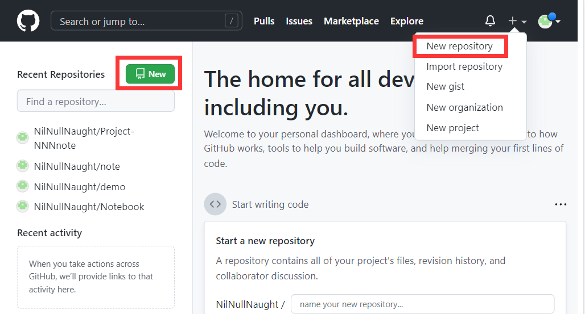

# 1	概述

## 1.1	Git 简介

#### 版本控制概述

版本控制是一种记录文件内容变化，以便将来查阅特定版本修订情况的系统。

版本控制其实最重要的是可以记录文件修改历史记录，从而让用户能够查看历史版本， 方便版本切换。

<br>

#### 集中式版本控制工具

集中化的版本控制系统[^1.1-1]，都有一个单一的集中管理的服务器，保存所有文件的修订版本，而协同工作的人们都通过客户端连到这台服务器，取出最新的文件或者提交更新。

多年以来，这已成为版本控制系统的标准做法。 这种做法带来了许多好处，每个人都可以在一定程度上看到项目中的其他人正在做些什么。而管理员也可以轻松掌控每个开发者的权限，并且管理一个集中化的版本控制系统，要远比在各个客户端上维护本地数据库来得轻松容易。

但是，这么做显而易见的缺点是中央服务器的单点故障。如果服务器宕 机一小时，那么在这一小时内，谁都无法提交更新，也就无法协同工作。

<br>

#### 分布式版本控制工具

分布式版本控制工具[^1.1-2]，客户端提取的不是最新版本的文件快照，而是把代码仓库完整地镜像下来（本地库）。这样任何一处协同工作用的文件发生故障，事后都可以用其他客户端的本地仓库进行恢复。因为每个客户端的每一次文件提取操作，实际上都是一次 对整个文件仓库的完整备份。 

分布式的版本控制系统出现之后，解决了集中式版本控制系统的缺陷：

1. 服务器断网的情况下也可以进行开发，因为版本控制是在本地进行的；
2. 每个客户端保存的也都是整个完整的项目（包含历史记录，更加代码保管更加安全）

<br>

#### 什么是 Git

Git 是一个 **开源** 的 **分布式版本控制工具**，Git 被开发出来的初衷是为了更好地管理 Linux 内核，而现在早已被广泛应用于全球各种大中小型项目中。

<br>

#### Git 的功能特性

从一般开发者的角度来看，git 有以下功能：

1. **克隆完整代码**：从服务器上克隆完整的 Git 仓库（包括代码和版本信息）到单机上；
2. **创建分支**：在自己的机器上根据不同的开发目的，创建分支，修改代码；
3. **分支提交**：在单机上自己创建的分支上提交代码；
4. **合并分支**：在单机上合并分支，或者把服务器上最新版的代码 fetch 下来，然后与自己的主分支合并；
5. **补丁开发**：生成补丁（patch），把补丁推送给主开发者；
6. **解决冲突**：
   1. 主开发者反馈解决冲突：如果主开发者发现两个一般开发者之间有冲突（他们之间可以合作解决的冲突），就会要求他们先解决冲突，然后再由其中一个人提交。如果主开发者可以自己解决，或者没有冲突，就通过。
   2. 一般开发者之间解决冲突：开发者之间可以使用 pull 命令解决冲突，解决完冲突之后再向主开发者提交补丁。

从主开发者的角度（假设主开发者不用开发代码）看，git 有以下功能：

1. **查看提交状态**：查看邮件或者通过其它方式查看一般开发者的提交状态；
2. **打上补丁，解决冲突**：可以自己解决，也可以要求开发者之间解决以后再重新提交，如果是开源项目，还要决定哪些补丁有用，哪些不用；
3. **提交开发结果**：向公共服务器提交结果，然后通知所有开发人员。

<br>

#### Git 的优缺点

###### 优点

1. 适合分布式开发，强调个体；
2. 公共服务器压力和数据量都不会太大；
3. 速度快、灵活；
4. 任意两个开发者之间可以很容易的解决冲突；
5. 离线工作。

###### 缺点

1. 资料少（起码中文资料很少）；
2. 学习周期相对而言比较长；
3. 不符合常规思维；
4. 代码保密性差，一旦开发者把整个库克隆下来就可以完全公开所有代码和版本信息。

<br>

#### Git 工作机制



<br>

#### Git 代码托管中心

代码托管中心是基于网络服务器的远程代码仓库，一般我们简单称为远程库。

局域网（自建）：

1. GitLab。

互联网：

1. GitHub；
2. Gitee。

<br>

---

[^1.1-1]: 诸如 CVS、SVN（Subversion）、VSS 等。
[^1.1-2]: 诸如 Git、Mercurial、Bazaar、Darcs 等。

<div STYLE="page-break-after: always;"></div>

## 1.2	安装 Git

#### Git 官网地址

https://git-scm.com/

<br>

#### 步骤[^1.2-❗1]

1. 进入 https://gitforwindows.org/ 下载安装包
2. 使用安装包进行安装

<br>

#### 验证是否安装完成

在 Git Bash 终端输入下列命令查看 git 版本：

```sh
git --version
```

<br>

---

<div STYLE="page-break-after: always;"></div>

## 1.3	创建远程代码库[^1.3-❗1]

<br>

---

<div STYLE="page-break-after: always;"></div>

# 2	Git 基本命令

## 2.1	设置用户签名

#### 用户签名的作用

Git 首次安装必须设置用户签名，否则无法提交代码。用户签名可以区分不同操作者身份。用户的签名信息包含在每一个版本的提交信息中，以确认提交者。

注意，用户签名和登录 GitHub（或其他代码托管中心）的账号没有关系。

<br>

#### 命令——设置用户签名

```
git config --global user.name "NNN"
git config --global user.email "nilnullnaught@gmail.com"
```

<br>

#### 命令——查看用户签名

配置完成后，可以输入一下命令查看用户签名（可以用于确认是否配置成功）：

```
git config --global user.name 
git config --global user.email
```

<br>

---

<div STYLE="page-break-after: always;"></div>

## 2.2	初始化本地库

#### 步骤

1. 进入需要创建仓库的项目下

2. 输入下列语句：

   ```bash
   git init

3. 输入上述命令后，会在项目的根目录下生成一个隐藏的 .git 目录，这个目录记录了本地所有 Git 操作。

<br>

#### 注意

如果要删除本地仓库，直接删除该目录即可。

<br>

---

<div STYLE="page-break-after: always;"></div>

## 2.4	查看本地库状态

##### git status——查找改动的文件

使用 `git status` 可以查看 **上次提交后，修改了哪些文件**。

###### git status可能出现的三种情况

1. 无文件改动：
2. 有文件改动但未添加到暂存区
3. 有文件改动已添加到暂存区，但未提交

<br>

---

<div STYLE="page-break-after: always;"></div>

## 2.3	提交本地代码

##### 说明

提交代码分为两步，第一步是将代码添加进来，第二部是确认提交。

<br>

##### git add ——添加目录和文件

###### 基本命令

```bash
git add 【完整的文件名/目录名】
```

###### git add . 

`git add .`  会监控工作区的状态树，使用它会把工作时的 **所有变化提交** 到暂存区，包括文件内容修改（modified）以及新文件（new），但不包括被删除的文件。

###### git add -u 

`git add -u` 仅监控 **已经被add的文件**（即 tracked file），他会将被修改的文件提交到暂存区。`git add -u` 不会提交新文件（untracked file），但是会将本地文件的删除与移动提交。

###### git add -A 

是上面两个功能的合集（git add --all的缩写）

<br>

##### 添加当前目录下的所有文件

```bash
git add .
```


**提交代码**

```
git commit -m "【描述信息】"
```

**注意**

- commit 命令的后面，一定要通过 -m 参数加上提交信息，没有描述信息的提交被认为是不合法的。

---

<br>

## 2.4	忽略文件

**Git 文件忽略机制**

- Git 允许用户将指定的文件或目录排除在版本控制之外，它会检查代码仓库的目录下是否存在一个名为 .gitignore 的文件，如果存在，就去一hanghang读取这个文件中的内容，并把每一行指定的文件或目录排除在版本控制之外。

---

<br>

## 2.5	使用 Git 查看自上次提交后文件修改的内容

**查看项目从上次提交后文件修改的内容**

```bash
git status
```

**查看项目更改的具体内容**

```bash
git diff
```

- 最左侧的加号表示新添加的内容，如果有删除的内容的话，会在最左侧用减号表示。

---

<br>

## 2.6	撤销未提交的修改

**命令**

```bash
git checkout 【路径或文件名】
```

**注意**

- 这种撤销只适用于还没有执行过 add 命令的文件，如果某个文件已经被添加过了，必须先取消添加，再进行提交

  ```bash
  #取消添加命令
  git reset 【路径或文件名】
  ```

---

<br>

## 2.7	查看提交记录

**查看所有的提交记录**

```bash
git log
```

**查看指定 id 的记录**

```bash
git log 【记录 id】
```

**查看最近一次的提交记录**

```bash
git log -1
```

---

<br>

# 3	高级

## 3.1	分支

#### **什么是分支**

- 分支是版本控制工具中比较高级且比较重要的一个概念，它主要的作用就是在现有代码的基础上开辟一个分叉口，**使得代码可以在主干线和分支线上同时进行开发，且相互之间不会影响**。

#### **分支的应用场景**

1. 比如说你们公司研发了一款不错的软件，最近刚刚完成，并推出了1.0版本。但是领导是不会让你们闲着的，马上提出了新的需求，让你们投入到1.1版本的开发工作当中。过了几个星期，1.1版本的功能已经完成了一半，但是这个时候突然有用户反馈，之前上线的1.0版本发现了几个重大的bug，严重影响软件的正常使用。领导也相当重视这个问题，要求你们立刻修复这些bug，并对1.0版本进行更新，但这个时候你就非常为难了，你会发现根本没法去修复。因为现在1.1版本已经开发一半了，如果在现有代码的基础上修复这些bug，那么更新的1.0版本将会带有一半1.1版本的功能。

   使用分支的话，只需要在发布1.0版本的时候建立一个分支，然后在主干线上继续开发1.1版本的功能。当在1.0版本上发现任何bug的时候，就在分支线上进行修改，然后发布新的1.0版本，并记得将修改后的代码合并到主干线上。这样的话，不仅可以轻松解决1.0版本存在的bug，而且保证了主干线上的代码也已经修复了这些bug，当1.1版本发布时，就不会有同样的bug存在了。

#### **master**

- 创建 git 仓库后，git 默认的主要分支名为 master。

#### 远程分支

分支只有在总代码仓库（远程代码库）上才能起到项目管理作用，所以应该直接在总代码仓库上创建分支，或者在本地创建后推送到远程服务器上

#### 将新建分支推到远程

在本地创建分支后，通过以下命令将其推送到远程服务器上：

```
 git push -u origin <新建分支名字>
```


#### **查看所有分支**

```
//输入 git branch 可以查看所有分支
//使用 bash 命令查看所有分支，当前分支会以颜色标记，并在前面显示 * 号
git branch
```

**创建分支**

```bash
//基于当前分支，创建一个名为 version1.0 的分支
git branch version1.0
```

**切换分支**

```bash
git checkout version1.0
```

**合并操作**

- 在version1.0分支上修改并提交的代码将不会影响到master分支。同样的道理，在master分支上修改并提交的代码也不会影响到version1.0分支。

  因此，如果我们在version1.0分支上修复了一个bug，在master分支上这个bug仍然是存在的。

  这时将修改的代码一行行复制到master分支上显然不是一种聪明的做法，最好的办法就是使用`merge`命令来完成合并操作

```bash
//切换到 master 分支
git checkout master
//将 master 分支与 version 1.0 分支合并
git merge version1.0
```

**删除分支**

```bash
//删除 version1.0 分支
git branch -D version1.0
```

---

<br>

## 3.3	Git tag

https://blog.csdn.net/jdsjlzx/article/details/98654951

https://blog.csdn.net/qq_39505245/article/details/124705850

---

<br>

## 3.3	与远程版本库协作

> 所有版本控制工具最重要的一个特点就是可以使用它来进行 **团队合作开发**。每个人的电脑上都会有一份代码，当团队的某个成员在自己的电脑上编写完成了某个功能后，就将代码提交到服务器，其他的成员只需要将服务器上的代码同步到本地，就能保证整个团队所有人的代码都相同。这样的话，每个团队成员就可以各司其职，大家共同来完成一个较为庞大的项目。

**将远程版本库的代码下载到本地**

```sh
//远程版本库的 Git 地址是 https://github.com/example/test.git
git clone https://github.com/example/test.git
```

**把本地修改的内容同步到远程版本库上**

```bash
//origin 部分指定的是远程版本库的 Git 地址，master 部分指定的是同步到哪一个分支上
git push origin master

//上述命令将本地代码同步到 https://github.com/example/test.git 这个版本库的 master 分支上
```

**使用 fetch 将远程版本库上的修改同步到本地**

```bash
git fetch origin master

//注意，fetch 同步下来的代码并不会合并到任何分支上，而是会存放到一个 origin/master 分支上
//需要之后再 merge 命令将 origin/master分 支上的修改合并到主分支上
```

**使用 pull 将远程版本库上的修改同步到本地**

```
//pull 命令相当于将 fetch 和 merge 这两个命令一起执行，它可以从远程版本库上获取最新的代码并且合并到本地当前分支
git pull origin master
```

---

<br>


## 3.4	版本回退

### 3.3.0

##### 版本回退的前提

- 版本回退通过 `git reset` 命令进行，需要指定的 `commit id`（即版本号）。所以需要先通过 `git log` 命令查询 `commit id`。

---

<br>

### 3.3.1	使用 reset 进行版本回退

##### 回退到当前版本的上一个版本

- ###### 命令

  ```php
  git reset --hard HEAD
  ```

<br>

##### 回退到指定的版本

- ###### 命令

  ```
  git reset --hard [commit id]
  ```

<br>

##### 回退到指定版本的上一个版本或前几个版本

- ###### 命令

  ```
  //回退到指定版本的上一个版本
  git reset --hard [commit id]^
  
  //回退到指定版本的前一个版本
  git reset --hard [commit id]^^
  
  //回退到指定版本的前 10 个版本
  git reset --hard [commit id]^^^^^^^^^^
  
  //回退到指定版本的前 10 个版本
  git reset --hard [commit id]~10
  ```

- ###### 回退符 ^

  `^` 用于指定返回的版本，有几个 `^` 则跳跃到几个版本之前，如果需要回退的版本太远，可以使用 `~n` 的形式 代替 `^`。

<br>

##### 📌使用 git reset 进行版本回退会导致跳跃版本之后的所有版本消失。

---

<br>

### 3.3.2	使用 revert 进行版本回退（未完成）


---

<br>

# 附录

##### 参考资料

1. 主要参考资料——[参考资料名](地址) 发布于 【0000/00/00】；
1. [2.4	查看本地库状态](#2.4	查看本地库状态)——[Git——比较版本区别【git status / git diff】](https://blog.csdn.net/qq_36749906/article/details/113716994) 发布于 2021/02/21；

<br>

#### ❗❓

[^1.2-❗1]: 需要补充。
[^1.3-❗1]: 需要补充。
