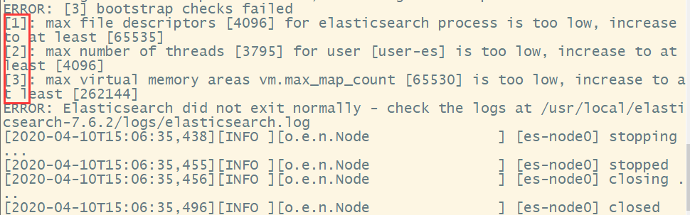
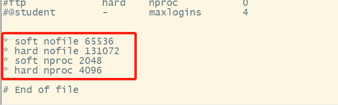
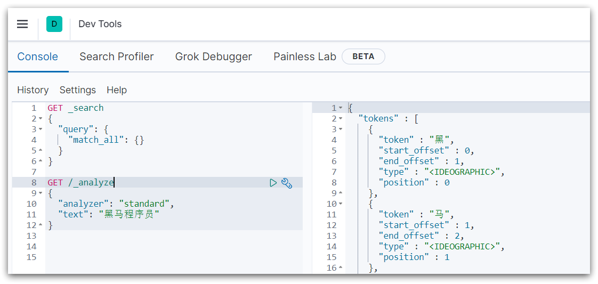

# 1	概述

## 1.1	elasticsearch 简介

##### 什么是 elasticsearch 

elasticsearch 是一款非常强大的 **开源搜索引擎**。具备搜索、日志统计、分析、系统监控等功能，可以帮助我们从海量数据中快速找到需要的内容。

官网地址 —— https://www.elastic.co/cn/。

<br>

##### elasticsearch 与 ELK

elasticsearch 结合 kibana、Logstash、Beats，也就是 elastic stack（ELK）。被广泛应用在日志数据分析、实时监控等领域。而elasticsearch 是 elastic stack 的核心，负责存储、搜索、分析数据。


<br>

##### elasticsearch 的底层实现 —— lucene

elasticsearch 的底层是基于 **lucene** 来实现的。

###### 什么是 lucene

**Lucene** 是一个 Java 语言的搜索引擎类库，是 Apache 公司的顶级项目，由 DougCutting 于1999年研发。官网地址：https://lucene.apache.org/ 。

###### Lucene 的优势

- 易扩展
- 高性能（基于倒排索引）

###### Lucene 的缺点

- 只限于Java语言开发
- 学习曲线陡峭
- 不支持水平扩展

<br>

##### elasticsearch 的发展历史

2004 年 Shay Banon 基于 Lucene 开发了 Compass。2010 年 Shay Banon 重写了 Compass，取名为 Elasticsearch。

<br>

##### 相比 lucene，elasticsearch 具备下列优势

- 支持分布式，可水平扩展
- 提供 Restful 接口，可被任何语言调用

<br>

----

<div STYLE="page-break-after: always;">
    <br>
    <br>
    <br>
    <br>
    <br></div>
## 1.2	倒排索引

##### 文档与词条

- **文档（Document）**：用来搜索的数据，其中的每一条数据就是一个文档。例如一个网页、一个商品信息。
- **词条（Term）**：对文档数据或用户搜索数据，利用某种算法分词，得到的具备含义的词语就是词条。例如：我是中国人，就可以分为：我、是、中国人、中国、国人这样的几个词条。

<br>

##### 正向索引

传统数据库（如 MySQL）采用正向索引。**正向索引** 是最传统的，根据id索引的方式。但根据词条查询时，必须先逐条获取每个文档，然后判断文档中是否包含所需要的词条，是 **根据文档找词条的过程**。

例如，给下表（tb_goods）中的 id 创建索引：


如果是基于 title 做模糊查询，只能是逐行扫描数据，流程如下：

1. 用户搜索数据，条件是 title 符合`"%手机%"`
2. 逐行获取数据，比如 id 为 1 的数据
3. 判断数据中的 title 是否符合用户搜索条件
4. 如果符合则放入结果集，不符合则丢弃。回到步骤 1

逐行扫描，也就是全表扫描，随着数据量增加，其查询效率也会越来越低。当数据量达到数百万时，就是一场灾难。

###### 优点

- 可以给多个字段创建索引
- 根据索引字段搜索、排序速度非常快

###### 缺点

- 根据非索引字段，或者索引字段中的部分词条查找时，只能全表扫描。

<br>

##### 倒排索引

**倒排索引** 与正向索引相反，是先找到用户要搜索的词条，根据词条得到保护词条的文档的 id，然后根据 id 获取文档。是 **根据词条找文档的过程**。

###### 词条词典与倒排列表

倒排索引中包含两部分内容：

- **词条词典（Term Dictionary）**：记录所有词条，以及词条与倒排列表（Posting List）之间的关系，会给词条创建索引，提高查询和插入效率。
- **倒排列表（Posting List）**：记录词条所在的文档 id[^1.2-1]、词条频率 （TF）[^1.2-2]、词条在文档中的位置等信息。

###### 创建倒排索引

**创建倒排索引** 是对正向索引的一种特殊处理，流程如下：

1. 将每一个文档的数据利用算法分词，得到一个个词条。
2. 创建表，每行数据包括词条、词条所在文档 id、位置等信息。
3. 因为词条唯一性，可以给词条创建索引，例如 hash 表结构索引。

如图：

###### 倒排索引的搜索流程

1. 假设用户输入条件`"华为手机"`进行搜索。
2. 对用户输入内容 **分词**，得到词条：`华为`、`手机`。
3. 拿着词条在倒排索引中查找，可以得到包含词条的文档id：1、2、3。
4. 拿着文档 id 到正向索引中查找具体文档。

如图：

虽然要先查询倒排索引，再查询正向索引，但是无论是词条、还是文档 id 都建立了索引，查询速度非常快！无需全表扫描。

###### 优点

- 根据词条搜索、模糊搜索时，速度非常快

###### 缺点

- 只能给词条创建索引，而不是字段
- 无法根据字段做排序

<br>

---

[^1.2-1]: 用于快速获取文档。
[^1.2-2]: 文档在词条出现的次数，用于评分。

<div STYLE="page-break-after: always;">
    <br>
    <br>
    <br>
    <br>
    <br></div>
## 1.3	Elasticsearch 的一些基本概念

##### Elasticsearch 的独有概念

elasticsearch 中有很多独有的概念，与 mysql 中略有差别，但也有相似之处。

<br>

##### 文档和字段

elasticsearch 是面向 **文档（Document）**存储的，可以是数据库中的一条商品数据，一个订单信息。文档数据会被序列化为 json 格式后存储在 elasticsearch 中。


而 Json 文档中往往包含很多的 **字段（Field）**，类似于数据库中的列。

<br>

##### 索引和映射

与 Mysql 等关系型数据库中的索引不同。Elasticsearch 中的**索引（Index）**，是相同类型的文档的集合。

例如：

- 所有用户文档，就可以组织在一起，称为用户的索引；
- 所有商品的文档，可以组织在一起，称为商品的索引；
- 所有订单的文档，可以组织在一起，称为订单的索引；


因此，我们可以把索引当做是数据库中的表。数据库的表会有约束信息，用来定义表的结构、字段的名称、类型等信息。因此，索引库中就有 **映射（mapping）**，是索引中文档的字段约束信息，类似表的结构约束。

<br>

##### mysql 与 elasticsearch 之间的对比

| MySQL  | Elasticsearch | 说明                                                         |
| ------ | ------------- | ------------------------------------------------------------ |
| Table  | Index         | 索引(index)，就是文档的集合，类似数据库的表(table)           |
| Row    | Document      | 文档（Document），就是一条条的数据，类似数据库中的行（Row），文档都是JSON格式 |
| Column | Field         | 字段（Field），就是JSON文档中的字段，类似数据库中的列（Column） |
| Schema | Mapping       | Mapping（映射）是索引中文档的约束，例如字段类型约束。类似数据库的表结构（Schema） |
| SQL    | DSL           | DSL是elasticsearch提供的JSON风格的请求语句，用来操作elasticsearch，实现CRUD |

<br>

##### mysql 与 Elasticsearc 的结合适用

mysql 与 Elasticsearc 两者各自有自己的擅长支出：

- Mysql：擅长事务类型操作，可以确保数据的安全和一致性。
- Elasticsearch：擅长海量数据的搜索、分析、计算。

因此在企业中，往往是两者结合使用：

- 对安全性要求较高的写操作，使用 mysql 实现
- 对查询性能要求较高的搜索需求，使用 elasticsearch 实现
- 两者再基于某种方式，实现数据的同步，保证一致性


<br>

---

<div STYLE="page-break-after: always;">
    <br>
    <br>
    <br>
    <br>
    <br></div>

## 1.4	分词器

##### Elastic search 默认的分词规则

es 在创建倒排索引时需要对文档分词；在搜索时，需要对用户输入内容分词。但默认的分词规则对中文处理并不友好。

<br>

##### 分词器的作用

- 创建倒排索引时对文档分词。
- 用户搜索时，对输入的内容分词。

<br>

##### IK 分词器

x

<br>

##### IK分词器的模式

- **ik_smart**：智能切分，粗粒度
- **ik_max_word**：最细切分，细粒度

<br>

##### IK 分词器如何拓展词条？如何停用词条？

- 利用 config 目录的IkAnalyzer.cfg.xml文件添加拓展词典和停用词典
- **在词典中添加拓展词条或者停用词条**

<br>

##### 扩展词词典

在原有的词汇列表中并不存在的新词语，可以通过扩展词字典添加。

###### 使用步骤

1. 打开 IK 分词器 config 目录 ../el-plugins/_data/analysis-ik/config。
2. 打开 config 目录下的配置文件 IKAnalyzer.cfg.xml。

```xml
<?xml version="1.0" encoding="UTF-8"?>
<!DOCTYPE properties SYSTEM "http://java.sun.com/dtd/properties.dtd">
<properties>dco
        <comment>IK Analyzer 扩展配置</comment>
        <!--用户可以在这里配置自己的扩展字典 *** 添加扩展词典-->
        <entry key="ext_dict">ext.dic</entry>
</properties>
```

3. 新建 ext.dic 文件，每一行就是一个词汇，如：

```
龙三
龙与地下城
龙举云兴
龙举云属
龙之吻
龙之国
龙之峡谷
龙之梦
龙之舞
龙争虎战
龙争虎斗
```

4. 重启 Elastic Search 容器
5. 使用 kibana DevTools 进行测试。

###### 📌在线安装的 IK 分词器没有 config 目录。

<br>

##### 敏感词词典

在互联网项目中，在网络间传输的速度很快，所以很多语言是不允许在网络上传递的，如：关于宗教、政治等敏感词语，那么我们在搜索时也应该忽略当前词汇。

IK分词器也提供了强大的停用敏感词功能，让我们在索引时就直接忽略当前的停用敏感词汇表中的内容。

###### 使用步骤

1. 在 IKAnalyzer.cfg.xml 配置文件内容添加

```xml
<?xml version="1.0" encoding="UTF-8"?>
<!DOCTYPE properties SYSTEM "http://java.sun.com/dtd/properties.dtd">
<properties>
        <comment>IK Analyzer 扩展配置</comment>
        <!--用户可以在这里配置自己的扩展字典-->
        <entry key="ext_dict">ext.dic</entry>
         <!--用户可以在这里配置自己的扩展停止词字典  *** 添加停用词词典-->
        <entry key="ext_stopwords">stopword.dic</entry>
</properties>
```

2. 在 stopword.dic 添加停用词

```
习近平
```

3. 重启 Elastic Search 容器

4. 使用 kibana DevTools 进行测试。

<br>

##### 📌必须使用 UTF-8 编辑词典文件

注意当前文件的编码必须是 UTF-8 格式，严禁使用 Windows 记事本编辑。

<br>

---

<div STYLE="page-break-after: always;">
    <br>
    <br>
    <br>
    <br>
    <br></div>
## 1.5	安装 ElasticSearch 

### 1.5.1	在 Linux 上安装 ElasticSearch 

##### 安装 ElasticSearch 

###### 1 - 从 elastic search 官方网站下载安装包，并上传到 Linux 上

https://www.elastic.co/cn/

###### 2 - 解压，并将 elasticsearch 移动到 /usr/local 目录下

```
tar -zxvf elasticsearch-7.16.3-linux-x86_64.tar.gz

mv elasticsearch-7.16.3 /usr/local/
```

###### 3 - 进入 elasticsearch 目录，在 elasticsearch 目录下创建 /data 文件夹

```
mkdir data
```

###### 4 - 进入 /cofig 目录下,修改 elasticsearch.yml 核心配置文件 

```
vim elasticsearch.yml
```

修改内容：

```
cluster.name: 【集群名称，如 esDemo 】
node.name: 【节点名称，如 esDemo-node0】
path.data: /usr/local/elasticsearch-7.16.3/data
path.logs: /usr/local/elasticsearch-7.16.3/logs
http.port: 9200
network.host: 0.0.0.0
cluster.initial_master_nodes: ["es-node0"]
```

###### 5 - 修改 jvm.options 配置文件（如果内存足够可以不进行修改）

```
-Xms1g -> -Xms128m
-Xmx1g -> -Xmx128m
```

###### 6 - 创建用户并授权

ES启动不能以ROOT用户来进行，所以需要创建一个用户：

```
useradd user-es
```

用户授权：

```
 chown -R user-es:user-es /usr/local/elasticsearch-7.16.3
```

###### 7 - 启动 elasticsearch

切换到 user-es 用户进入 bin 启动 elasticsearch：

```
#切换用户
su user-es

#进入 elasticsearch 根目录
cd /usr/local/elasticsearch-7.16.3

#前台启动 elasticsearch
bin/elasticsearch

#后台启动 elasticsearch
bin/elasticsearch -d
```

如果出现以下错误

ERROR: [1] bootstrap checks failed. You must address the points described in the following [1] lines before starting Elasticsearch.
bootstrap check failure [1] of [1]: max virtual memory areas vm.max_map_count [65530] is too low, increase to at least [262144]

错误原因是 ***max_map_count\***文件包含限制一个进程可以拥有的VMA(虚拟内存区域)的数量。虚拟内存区域是一个连续的虚拟地址空间区域。在进程的生命周期中，每当程序尝试在内存中映射文件，链接到共享内存段，或者分配堆空间的时候，这些区域将被创建。调优这个值将限制进程可拥有VMA的数量。限制一个进程拥有VMA的总数可能导致应用程序出错，因为当进程达到了VMA上线但又只能释放少量的内存给其他的内核进程使用时，操作系统会抛出内存不足的错误。如果你的操作系统在NORMAL区域仅占用少量的内存，那么调低这个值可以帮助释放内存给内核用。切换到 root 用户修改 

```
vim /etc/sysctl.conf
```

修改：

```
vm.max_map_count=262144
```

修改完成后输入：

```
sysctl -p
```


如果出现如下错误信息（最大文件数太小、线程太小、内存太低）：

  　

　　则需要修改相应的环境配置

​    切换到ROOT用户修改/etc/security/limits.conf配置文件

　　**su**      --切换root用户需要输入密码

　　**vi /etc/security/limits.conf**

​    修改信息如下：

　　** soft nofile 65536*

​    ** hard nofile 131072*

  ** soft nproc 2048*

​    ** hard nproc 4096*　　

​    **

　　然后修改另一个配置文件

　　**vi /etc/sysctl.conf**

​    修改信息如下：

　  *vm.max_map_count = 262145*

　　**

　　保存退出，刷新配置文件

　　**sysctl -p** 

​    ****

<br>

##### 安装 Kibana

###### 1 - 通过 wget 下载 kibana 安装包

注意，kibana 版本与 ElasticSearch 应该保持一致

```shell
wget https://artifacts.elastic.co/downloads/kibana/kibana-7.16.3-linux-x86_64.tar.gz
```

###### 2 - 解压，并将 kibana 移动到 /usr/local 目录下

解压

```
tar -zxvf kibana-7.16.3-linux-x86_64.tar.gz
```

移动

```
mv kibana-7.16.3-linux-x86_64 /usr/local/
```

###### 3 - 修改配置文件

```
cd /usr/local/kibana-7.16.3-linux-x86_64/config

vim kibana.yml
```

修改下列配置

```yml
server.port: 5601
server.host: "0.0.0.0"
elasticsearch.hosts: ["http://localhost:9200"]
kibana.index: ".kibana"

...

i18n.locale: "zh-CN" #设置语言为中文
```

###### 4 - 用户授权

```
// 创建用户（可以直接使用 ElasticSearch 的用户）
useradd user-es

chown -R user-es:user-es /usr/local/kibana-7.16.3-linux-x86_64
```

###### 5 - 启动 Kibana

```
#切换用户
su user-es

#进入 Kibana 根目录
cd /usr/local/kibana-7.16.3-linux-x86_64

#前台启动 kibana
bin/kibana

#后台启动 kibana
bin/kibana &
```

<br>

##### 安装 IK 分词器

###### 1 - 下载 IK 分词器，并上传到 Linux 上

下载地址：https://github.com/medcl/elasticsearch-analysis-ik/releases

###### 2 - 将压缩包移动到 ElasticSearch 的 plugin 目录下

```
mv elasticsearch-analysis-ik-7.16.3.zip /usr/local/elasticsearch-7.16.3/plugins
```

###### 3 - 在 plugin 目录下创建 ik 文件夹，并将 IK 分词器移动到该文件夹下解压

创建文件夹（因为 ik 分词器解压后，文件是散乱的）并移动

```
mkdir ik
mv elasticsearch-analysis-ik-7.16.3.zip ik
```

解压文件

```
unzip elasticsearch-analysis-ik-7.16.3.zip
```

<br>

###### 4 - 重启 ES 服务

```
#切换成有权限的es用户
su user-es

#杀掉进程，重启
ps -ef | grep elastic
kill -9 【elastic search 的端口号】

bin/elasticsearch -d
```

###### 5 - 验证

http://xx.xx.xx.xx:9200/_cat/plugins


---

<div STYLE="page-break-after: always;">
    <br>
    <br>
    <br>
    <br>
    <br></div>

### 1.5.2	使用 docker 安装 elasticsearch 并进行单点部署

##### 安装 elasticsearch

###### 1 - 创建网络

elasticsearch 需要和 kibana 配合使用，因此需要让 es 和 kibana 容器互联。这里先创建一个网络：

```sh
docker network create es-net
```

###### 2 - 安装镜像

```
docker pull elasticsearch:7.12.1
```

###### 3 - 部署单点 elasticsearch

```shell
docker run -d \
	--name es \
    -e "ES_JAVA_OPTS=-Xms512m -Xmx512m" \
    -e "discovery.type=single-node" \
    -v es-data:/usr/share/elasticsearch/data \
    -v es-plugins:/usr/share/elasticsearch/plugins \
    --privileged \
    --network es-net \
    -p 9200:9200 \
    -p 9300:9300 \
elasticsearch:7.12.1
```

命令解释：

- `-e "cluster.name=es-docker-cluster"`：设置集群名称
- `-e "http.host=0.0.0.0"`：监听的地址，可以外网访问
- `-e "ES_JAVA_OPTS=-Xms512m -Xmx512m"`：内存大小
- `-e "discovery.type=single-node"`：非集群模式
- `-v es-data:/usr/share/elasticsearch/data`：挂载逻辑卷，绑定es的数据目录
- `-v es-logs:/usr/share/elasticsearch/logs`：挂载逻辑卷，绑定es的日志目录
- `-v es-plugins:/usr/share/elasticsearch/plugins`：挂载逻辑卷，绑定es的插件目录
- `--privileged`：授予逻辑卷访问权
- `--network es-net` ：加入一个名为 es-net 的网络中
- `-p 9200:9200`：端口映射配置

###### 测试

在浏览器中输入：http://192.168.150.101:9200 即可看到 elasticsearch 的响应结果。

<br>

##### 部署 kibana

###### 1 - 拉取 kibana 镜像

```
docker pull kibana:7.12.1
```

<br>

###### 2 - 部署 kibana

```shell
docker run -d \
--name kibana \
-e ELASTICSEARCH_HOSTS=http://es:9200 \
--network=es-net \
-p 5601:5601  \
kibana:7.12.1
```

- `--network es-net` ：加入一个名为es-net的网络中，与elasticsearch在同一个网络中
- `-e ELASTICSEARCH_HOSTS=http://es:9200"`：设置elasticsearch的地址，因为kibana已经与elasticsearch在一个网络，因此可以用容器名直接访问elasticsearch
- `-p 5601:5601`：端口映射配置

<br>

###### 3 - 测试

查看运行日志：

```shell
docker logs -f kibana
```

在浏览器输入地址访问：http://192.168.150.101:5601。

kibana 中提供了一个 DevTools 界面：



这个界面中可以编写 DSL 来操作 elasticsearch。并且对 DSL 语句有自动补全功能。

<br>

##### 安装 IK 分词器

###### 在线安装

1. 进入容器内部

```shell
docker exec -it elasticsearch /bin/bash
```

2. 在线下载并安装

```shell
./bin/elasticsearch-plugin  install https://github.com/medcl/elasticsearch-analysis-ik/releases/download/v7.12.1/elasticsearch-analysis-ik-7.12.1.zip
```

3. 退出

```
exit
```

4.重启容器

```
docker restart elasticsearch
```

###### 离线安装ik

1. 下载 ik 插件并解压。
2. 上传到 ElasticSearch 容器挂载 plugins 目录的数据卷目录。
3. 重启容器。

###### 3 - 测试

在 kibana 的 DevTools 中进行测试。

<br>

----

<div STYLE="page-break-after: always;">
    <br>
    <br>
    <br>
    <br>
    <br></div>
### 1.5.3	在 Windows 上安装 ElasticSearch

##### 安装 Kibana

###### 1 - 从官方网站下载 Kibana

###### 2 - 修改配置文件

---

<div STYLE="page-break-after: always;">
    <br>
    <br>
    <br>
    <br>
    <br></div>
