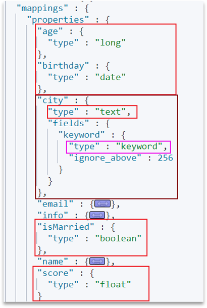

# 3	文档操作

## 3.1	新增文档

##### 语法

```json
POST /索引库名/_doc/文档id
{e
    "字段1": "值1",
    "字段2": "值2",
    "字段3": {
        "子属性1": "值3",
        "子属性2": "值4"
    },
    // ...
}
```

<br>

##### 示例

```json
POST /index_library_demo/_doc/1
{
  "info": "常山赵子龙",
  "email": "EEE@EEE.EE",
  "name": {
    "firstName": "云",
    "lastName": "赵"
  }
}
```

- 结果：


<br>

---

<div STYLE="page-break-after: always;">
    <br>
    <br>
    <br>
    <br>
    <br></div>

## 3.2	查询文档

##### 语法

```json
GET /{索引库名称}/_doc/{id}
```

<br>

##### 通过kibana查看数据

```js
GET /index_library_demo/_doc/1
```

结果：


<br>

---

<div STYLE="page-break-after: always;">
    <br>
    <br>
    <br>
    <br>
    <br></div>

## 3.3	删除文档

##### 语法

```js
DELETE /{索引库名}/_doc/id值
```

<br>

##### 示例

```json
# 根据id删除数据
DELETE /heima/_doc/1
```

结果：


<br>

---

<div STYLE="page-break-after: always;">
    <br>
    <br>
    <br>
    <br>
    <br></div>

## 3.4	修改文档

##### 修改文档有两种方式

- **全量修改**：直接覆盖原来的文档。
- **增量修改**：修改文档中的部分字段。

<br>

##### 全量修改

###### 全量修改的本质

全量修改是覆盖原来的文档，其本质是：

1. 根据指定的 id 删除文档[^3.4-1]。
2. 新增一个相同 id 的文档，

###### 语法

```json
PUT /{索引库名}/_doc/文档id
{
    "字段1": "值1",
    "字段2": "值2",
    // ... 略
}

```

###### 示例

```json
PUT /heima/_doc/1
{
    "info": "黑马程序员高级Java讲师",
    "email": "zy@itcast.cn",
    "name": {
        "firstName": "云",
        "lastName": "赵"
    }
}
```

<br>

### 增量修改

增量修改是只修改指定 id 匹配的文档中的部分字段。

###### 语法

```json
POST /{索引库名}/_update/文档id
{
    "doc": {
         "字段名": "新的值",
    }
}
```

###### 示例

```json
POST /heima/_update/1
{
  "doc": {
    "email": "ZhaoYun@itcast.cn"
  }
}
```

<br>

----

[^3.4-1]: 删除时，如果 id 不存在，第二步的新增也会执行，相当于从修改变成了新增。

<div STYLE="page-break-after: always;">
    <br>
    <br>
    <br>
    <br>
    <br></div>
## 3.5	动态映射

##### 什么是动态映射

当我们向 ES 中插入文档时，如果文档中字段没有对应的 mapping，ES 会帮助我们字段设置 mapping。

<br>

##### 动态映射规则

| JSON 类型 | Elasticsearch 类型                                           |
| --------- | ------------------------------------------------------------ |
| 字符串    | •日期格式字符串：mapping为date类型  •普通字符串：mapping为text类型，并添加keyword类型子字段 |
| 布尔值    | boolean                                                      |
| 浮点数    | float                                                        |
| 整数      | long                                                         |
| 对象嵌套  | object，并添加properties                                     |
| 数组      | 由数组中的第一个非空类型决定                                 |
| 空值      | 忽略                                                         |

<br>

##### 测试——插入包含没有 mapping 的字段

```json
PUT /heima/_doc/2
{
    "info": "黑马程序员Python讲师",
    "email": "zf@itcast.cn",
    "name": {
        "firstName": "飞",
        "lastName": "张"
    },
    "age": 35,
    "score": [98.5, 98.9, 97.9, 99.2],
    "isMarried": false,
    "birthday": "1988-05-20",
    "city": "上海",
}

```

结果：



<br>

##### 📌如果默认 mapping 规则不符合你的需求，一定要自己设置字段 mapping

<br>

---

<div STYLE="page-break-after: always;">
    <br>
    <br>
    <br>
    <br>
    <br></div>
